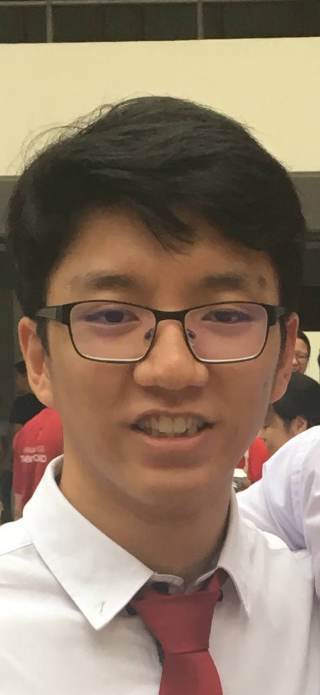
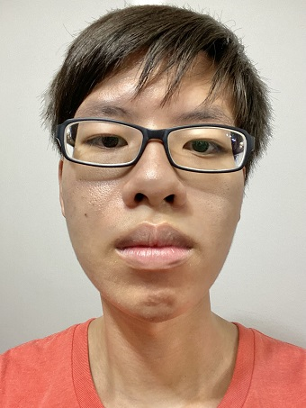
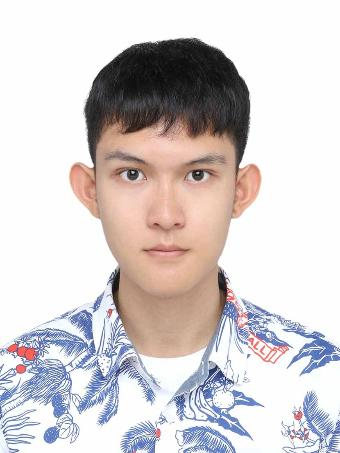

We are a team based in the [School of Computing, National University of Singapore](http://www.comp.nus.edu.sg).

You can reach us at the email `seer[at]comp.nus.edu.sg`

## Project team

### Chen Guanzhou

[[github](https://github.com/guanzhou03)]
[[portfolio](team/guanzhou03.md)]

* Role: Team Lead
* Responsibilities: In charge of Model

### Perry Wong Jun Jie

[[github](https://github.com/pwjj2000)]
[[portfolio](team/pwjj2000.md)]

* Role: Developer
* Responsibilities: Documentation and Testing

### Lim Hong Wei, Jovon

[[github](http://github.com/jovonlim)] [[portfolio](team/jovonlim.md)]

* Role: Developer
* Responsibilities: Storage

### Nicholas Tan

[[github](https://github.com/NicholasTYD)]
[[portfolio](team/nicholastyd.md)]

* Role: Developer
* Responsibilities: UI

### Zhao Yao

[[github](http://github.com/wingkei67)]
[[portfolio](team/wingkei67.md)]

* Role: Developer
* Responsibilities: Logic
