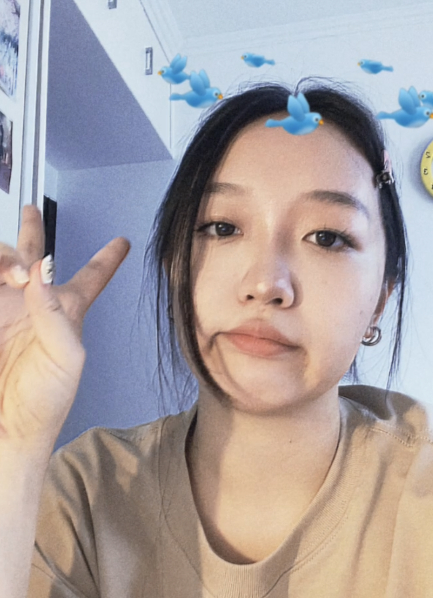

We are a team based in the [School of Computing, National University of Singapore](http://www.comp.nus.edu.sg).

You can reach us at the email `seer[at]comp.nus.edu.sg`

## Project Team

### Quah Kian Seong

GitHub: [@KIANSEONG](https://github.com/KIANSEONG)

* Role: Team Lead

### Wang Xinyi

GitHub: [@wxy1203](https://github.com/wxy1203)

* Role: Team Member
* Responsibilities: Many

### Brandon Thio

GitHub: [@beetee17](https://github.com/beetee17)
[[portfolio](team/beetee17.md)]

* Role: Team Member
* Responsibilities: Various

### Zheng Yilin

Github: [@yilinzyl](http://github.com/yilinzyl)
[[portfolio](team/yilinzyl.md)]

* Role: Team Member
* Responsibilities: Various

### Amresh

Github: [@amresh2000](http://github.com/amresh2000)
[[portfolio](team/amresh.md)]

* Role: Developer
* Responsibilities: Dev Ops + Threading
