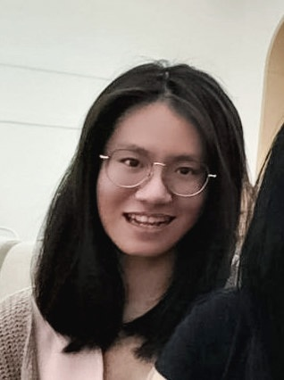

We are a team based in the [School of Computing, National University of Singapore](http://www.comp.nus.edu.sg).

You can reach us at the email `seer[at]comp.nus.edu.sg`

## Project team

### Aaron Tan Gui Rong

[ [github](https://github.com/aarontangr) ][ [portfolio](team/aarontangr.md) ]

* Role: Developer
* Responsibilities: UI, Dev Ops

### Elbert Benedict

[ [github](http://github.com/Elben85) ]
[ [portfolio](team/elben85.md) ]

* Role: Developer
* Responsibilities: Code quality

### Farrel Dwireswara Salim

[ [github](http://github.com/sugiyem) ] [ [portfolio](team/sugiyem.md) ]

* Role: Developer
* Responsibilities: Testing

### Rachel Angelyn Gunawan

[ [github](https://github.com/Rachel-AG) ]
[ [portfolio](team/rachel-ag.md) ]

* Role: Developer
* Responsibilities: Documentation

### Justin Siaw

[ [github](http://github.com/justinS00) ]
[ [portfolio](team/justins00.md) ]

* Role: Developer
* Responsibilities: Project Management
