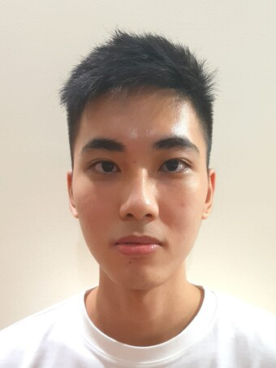

We are a team based in the [School of Computing, National University of Singapore](http://www.comp.nus.edu.sg).

<h2 class="no-num"> Project team </h2>

<h3 class="no-num"> Shashank Acharya </h3>

[[github](https://github.com/sheshenk)]
[[portfolio](team/sheshenk.md)]

* Role: Admin

<h3 class="no-num"> Shen Xinbei </h3>

[[github](https://github.com/ichigh0st)]
[[portfolio](team/ichigh0st.md)]

* Role: Code quality

<h3 class="no-num"> Lester Ong </h3>

[[github](http://github.com/lesterong)]
[[portfolio](team/lesterong.md)]

* Role: Developer

<h3 class="no-num"> Shawn Chew </h3>

[[github](https://github.com/shawnchew)]
[[portfolio](team/shawnchew.md)]

* Role: Developer

<h3 class="no-num"> Kee Seow Han </h3>

[[github](http://github.com/KSHan29)]
[[portfolio](team/kshan29.md)]

* Role: Testing
