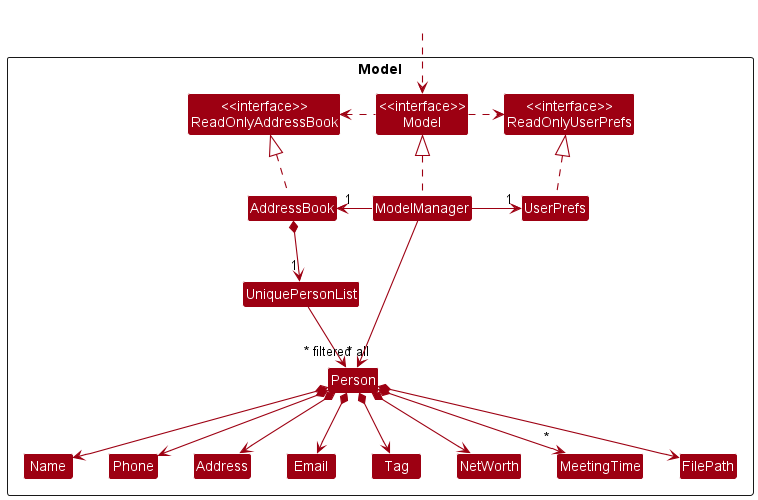
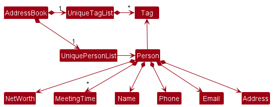
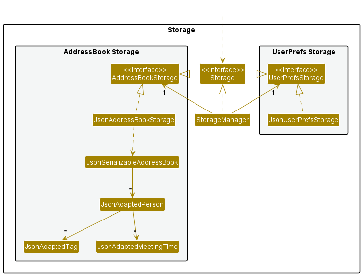

* Table of Contents
{:toc}

--------------------------------------------------------------------------------------------------------------------

## **Acknowledgements**

* The feature Undo and Redo was reused with minimal changes from a Tutorial called [Implementing Undo and Redo With The Command Design Pattern by ArjanCode](https://youtu.be/FM71_a3txTo).
* The feature open and add PDF file was reused with minimal changes from a code from stackoverflow [Open PDF file on the fly](https://stackoverflow.com/questions/2546968/open-pdf-file-on-the-fly-from-a-java-application)

--------------------------------------------------------------------------------------------------------------------

## **Setting up, getting started**

Refer to the guide [_Setting up and getting started_](SettingUp.md).

--------------------------------------------------------------------------------------------------------------------

## **Design**

:bulb: **Tip:** The `.puml` files used to create diagrams in this document can be found in the [diagrams](https://github.com/se-edu/addressbook-level3/tree/master/docs/diagrams/) folder. Refer to the [_PlantUML Tutorial_ at se-edu/guides](https://se-education.org/guides/tutorials/plantUml.html) to learn how to create and edit diagrams.

### Architecture

The ***Architecture Diagram*** given above explains the high-level design of the App.

Given below is a quick overview of main components and how they interact with each other.

**Main components of the architecture**

**`Main`** has two classes called [`Main`](https://github.com/se-edu/addressbook-level3/tree/master/src/main/java/seedu/address/Main.java) and [`MainApp`](https://github.com/se-edu/addressbook-level3/tree/master/src/main/java/seedu/address/MainApp.java). It is responsible for,
* At app launch: Initializes the components in the correct sequence, and connects them up with each other.
* At shut down: Shuts down the components and invokes cleanup methods where necessary.

[**`Commons`**](#common-classes) represents a collection of classes used by multiple other components.

The rest of the App consists of four components.

* [**`UI`**](#ui-component): The UI of the App.
* [**`Logic`**](#logic-component): The command executor.
* [**`Model`**](#model-component): Holds the data of the App in memory.
* [**`Storage`**](#storage-component): Reads data from, and writes data to, the hard disk.

**How the architecture components interact with each other**

The *Sequence Diagram* below shows how the components interact with each other for the scenario where the user issues the command `delete 1`.

Each of the four main components (also shown in the diagram above),

* defines its *API* in an `interface` with the same name as the Component.
* implements its functionality using a concrete `{Component Name}Manager` class (which follows the corresponding API `interface` mentioned in the previous point.

For example, the `Logic` component defines its API in the `Logic.java` interface and implements its functionality using the `LogicManager.java` class which follows the `Logic` interface. Other components interact with a given component through its interface rather than the concrete class (reason: to prevent outside component's being coupled to the implementation of a component), as illustrated in the (partial) class diagram below.

The sections below give more details of each component.

### UI component

The **API** of this component is specified in [`Ui.java`](https://github.com/se-edu/addressbook-level3/tree/master/src/main/java/seedu/address/ui/Ui.java)

The UI consists of a `MainWindow` that is made up of parts e.g.`CommandBox`, `ResultDisplay`, `PersonListPanel`, `StatusBarFooter` etc. All these, including the `MainWindow`, inherit from the abstract `UiPart` class which captures the commonalities between classes that represent parts of the visible GUI.

The `UI` component uses the JavaFx UI framework. The layout of these UI parts are defined in matching `.fxml` files that are in the `src/main/resources/view` folder. For example, the layout of the [`MainWindow`](https://github.com/se-edu/addressbook-level3/tree/master/src/main/java/seedu/address/ui/MainWindow.java) is specified in [`MainWindow.fxml`](https://github.com/se-edu/addressbook-level3/tree/master/src/main/resources/view/MainWindow.fxml)

The `UI` component,

* executes user commands using the `Logic` component.
* listens for changes to `Model` data so that the UI can be updated with the modified data.
* keeps a reference to the `Logic` component, because the `UI` relies on the `Logic` to execute commands.
* depends on some classes in the `Model` component, as it displays `Person` object residing in the `Model`.

### Logic component

**API** : [`Logic.java`](https://github.com/se-edu/addressbook-level3/tree/master/src/main/java/seedu/address/logic/Logic.java)

Here's a (partial) class diagram of the `Logic` component:

How the `Logic` component works:
1. When `Logic` is called upon to execute a command, it uses the `AddressBookParser` class to parse the user command.
1. This results in a `Command` object (more precisely, an object of one of its subclasses e.g., `CreateCommand`) which is executed by the `LogicManager`.
1. The command can communicate with the `Model` when it is executed (e.g. to add a person).
1. The result of the command execution is encapsulated as a `CommandResult` object which is returned back from `Logic`.

The Sequence Diagram below illustrates the interactions within the `Logic` component for the `execute("delete 1")` API call.

:information_source: **Note:** The lifeline for `DeleteCommandParser` should end at the destroy marker (X) but due to a limitation of PlantUML, the lifeline reaches the end of diagram.

Here are the other classes in `Logic` (omitted from the class diagram above) that are used for parsing a user command:

How the parsing works:
* When called upon to parse a user command, the `AddressBookParser` class creates an `XYZCommandParser` (`XYZ` is a placeholder for the specific command name e.g., `CreateCommandParser`) which uses the other classes shown above to parse the user command and create a `XYZCommand` object (e.g., `CreateCommand`) which the `AddressBookParser` returns back as a `Command` object.
* All `XYZCommandParser` classes (e.g., `CreateCommandParser`, `DeleteCommandParser`, ...) inherit from the `Parser` interface so that they can be treated similarly where possible e.g, during testing.

### Model component
**API** : [`Model.java`](https://github.com/se-edu/addressbook-level3/tree/master/src/main/java/seedu/address/model/Model.java)

The `Model` component,

* stores the address book data i.e., all `Person` objects (which are contained in a `UniquePersonList` object).
* stores the currently 'selected' `Person` objects (e.g., results of a search query) as a separate _filtered_ list which is exposed to outsiders as an unmodifiable `ObservableList<Person>` that can be 'observed' e.g. the UI can be bound to this list so that the UI automatically updates when the data in the list change.
* stores a `UserPref` object that represents the user’s preferences. This is exposed to the outside as a `ReadOnlyUserPref` objects.
* does not depend on any of the other three components (as the `Model` represents data entities of the domain, they should make sense on their own without depending on other components)

:information_source: **Note:** An alternative (arguably, a more OOP) model is given below. It has a `Tag` list in the `AddressBook`, which `Person` references. This allows `AddressBook` to only require one `Tag` object per unique tag, instead of each `Person` needing their own `Tag` objects. 

### Storage component

**API** : [`Storage.java`](https://github.com/se-edu/addressbook-level3/tree/master/src/main/java/seedu/address/storage/Storage.java)

The `Storage` component,
* can save both address book data and user preference data in json format, and read them back into corresponding objects.
* inherits from both `AddressBookStorage` and `UserPrefStorage`, which means it can be treated as either one (if only the functionality of only one is needed).
* depends on some classes in the `Model` component (because the `Storage` component's job is to save/retrieve objects that belong to the `Model`)

### Common classes

Classes used by multiple components are in the `seedu.addressbook.commons` package.

--------------------------------------------------------------------------------------------------------------------

## **Implementation**

This section describes some noteworthy details on how certain features are implemented.

### Undo/redo feature

#### Implementation

The undo/redo mechanism is facilitated by `UndoableCommands` and `CommandManager`.

`UndoableCommand` extends from `Command` and implements its own undo and redo methods. `Command`s that implement `UndoableCommand` include:
* `CreateCommand` — Deletes and adds saved person object for undo and redo methods respectively.
* `DeleteCommand` — Adds and deletes saved person object for undo and redo methods respectively.
* `UpdateCommand` — Saves the original and edited person objects and sets them accordingly for undo and redo methods.
* `ClearCommand` — Restores the saved original address book and sets address book to new address book for undo and redo methods respectively.

`CommandManager` stores `UndoableCommand`s that have been executed and that have been undone in an `undoStack` and `redoStack` respectively. Additionally, `CommandManager` implements the following operations:

* `CommandManager#pushNewCommand(Command)` — Saves the latest undoable command that was executed by user in its history.
* `CommandManager#undo(UndoableCommand)` — Undoes the last undoable command from the top of the undo-stack.
* `CommandManager#redo(UndoableCommand)` — Redoes the last undoable command from the top of the redo-stack.

These operations are exposed in the `Logic` interface as `Logic#execute()`, `Logic#undo()` and `Logic#redo()` respectively.

Given below is an example usage scenario and how the undo/redo mechanism behaves at each step.

Step 1. The user launches the application for the first time. The `CommandManger` will be initialized with an empty `undoStack` and `redoStack`.

Step 2. The user executes `delete 5` command to delete the 5th person in the address book. `CommandManager#pushNewCommand()` is called by `Logic#execute()`, saving the `DeleteCommand` in the `undoStack`.

Step 3. The user executes `add n/David …​` to add a new person. `CommandManager#pushNewCommand()` is called by `Logic#execute()`, saving the `AddCommand` in the `undoStack`.

:information_source: **Note:** If a command fails its execution, it will not call `Model#commitAddressBook()`, so the address book state will not be saved into the `addressBookStateList`.

Step 4. The user now decides that adding the person was a mistake, and decides to undo that action by executing the `undo` command. The `undo` command will call `Logic#undo()` which calls `CommandManager#undo()` , which will pop the latest `UndoableCommand` from the `undoStack` and calls the `#UndoableCommand#undo()` method of that command which reverts the addressbook back to its previous state. The command popped is pushed to the `redoStack`.

:information_source: **Note:** If the `currentStatePointer` is at index 0, pointing to the initial AddressBook state, then there are no previous AddressBook states to restore. The `undo` command uses `Model#canUndoAddressBook()` to check if this is the case. If so, it will return an error to the user rather
than attempting to perform the undo.

The following sequence diagram shows how the undo operation works:

:information_source: **Note:** The lifeline for `UndoCommand` should end at the destroy marker (X) but due to a limitation of PlantUML, the lifeline reaches the end of diagram.

The `redo` command does the opposite — it calls `Logic#redo()` which calls `CommandManager#redo()`, which pops the latest `UndoableCommand` from the `redostack` and calls the `UndoableCommand#redo()` of that command which reverts the addressbook to the state after the command execution. The command is added back to the `undoStack`.

:information_source: **Note:** If the `currentStatePointer` is at index `addressBookStateList.size() - 1`, pointing to the latest address book state, then there are no undone AddressBook states to restore. The `redo` command uses `Model#canRedoAddressBook()` to check if this is the case. If so, it will return an error to the user rather than attempting to perform the redo.

Step 5. The user then decides to execute the command `list`. Commands that do not modify the address book, such as `list`, will usually not be be added to the undoStack by `CommandManger#pushNewCommand()`. Thus, the `undoStack` remains unchanged.

Step 6. The user executes `clear`, which calls `CommandManager#pushNewCommand()`. Since there redoStack is not empty, `CommandManager#pushNewCommand` then calls `CommandManger#clearRedoStack`. Reason: It no longer makes sense to redo the `add n/David …​` command. This is the behavior that most modern desktop applications follow.

The following activity diagram summarizes what happens when a user executes a new command:

#### Design considerations:

**Aspect: How undo & redo executes:**
* **Alternative 1 (current choice):** Individual command knows how to undo/redo by
  itself.
    * Pros: Will use less memory (e.g. for `delete`, just save the person being deleted).
    * Cons: We must ensure that the implementation of each individual command are correct.

* **Alternative 2:** Saves the entire address book.
  * Pros: Easy to implement.
  * Cons: May have performance issues in terms of memory usage.

### Assigning PDF files feature

The assigning pdf file to a client feature allows the user to store the file path of a pdf stored on the user's device. The filePath in FABook is represented with by a `FilePath` class. A `FilePath` class requires a `String` filePath. A `Person` object Has-A `FilePath` object.

Implementation of the opening PDF file of client feature is built on top of the way that the PDF filepath is stored.

#### Implementation

The mechanism is facilitated by `SetPersonFileCommand` and `FileUtil`.

`SetPersonFileCommand` extends from `Command`. It overwrites the `Command` execute method to determine if the given filepath is valid and create an "EditedPerson" `Person` object.

The `FileUtil::checkValidPdfFilePath` method is used in `SetPersonFileCommand` to check the validity of the file path. The method follows the given filePath to check if the file exists and if the given filepath is of type `.pdf`.

Given below is an example usage scenario and how the set file mechanism behaves at each step.

Step 1. The user launches the application for the first time.

Step 2. The user decides to add a file path to  the 2nd person in the current list of contacts in the address book using the `filepath 2 f/C:\Users\Eugene Tay\Downloads\Tutorial_8_qns.pdf` command.

Step 3. `LogicManager` calls `LogicManager::execute` method that was implemented from `Logic` interface. Within the method, `AddressBookParser::parseCommand` is called on the user input `filePath` and a `Command` object is returned.

Step 4. `AddressBookParser::parseCommand` will parse the user input and match the `COMMAND_WORD` to be `filepath` which is `SetPathFileCommand#COMMAND_WORD`. Thus a `SetPathFileCommandParser` object is instantiated which parses and checks the user arguments. 

Step 5. `SetPathFileCommandParser` object parses the given user arguments. If the `PREFIX_FILEPATH` is present and there is no `IllegalValueException`, a `SetPersonFileCommand` object is instantiated with `index` and `filePath` obtained from the user arguments.

Step 6. `SetPathFileCommand::execute` method is called in `LogicManager`. This method will check if the given PDF filepath is valid with `FileUtil::checkValidPdfFilePath` method.

Step 7. `FileUtil::checkValidPdfFilePath` method follows the given filePath to check if the file exists and if the given filepath is of type `.pdf`.

Step 8. `SetPathFileCommand::execute` method will instantiate a new `Person` object with the original `Person` object's attributes and the new filePath. This `Person` object be set in `Model` and updated in `filterPersonList`.

The following sequence diagram shows how the assigning filepath to a client feature works.
**Insert sequence diagram here**

The following activity diagram shows how the assigning filepath to a client feature works.
**Insert activity diagram here**

#### Design Considerations:
**Would need Peter's Input on this**

### Person Enhancement

#### Enhancement 1
The person model now contains a `Net Worth` field.
`Net Worth` is implemented as a class where it contains a `final string value`, `final static string`
`MESSAGE_CONSTRAINTS` and `final static string` `VALIDATION_REGEX`.

#### Design Considerations
- Net Worth accepts a Net Worth object that has an immutable value.
- Net Worth is a compulsory field. A user will only engage with a client if they know their net worth.
- Net Worth `VALIDATION_REGEX` ensures that clients of more than 1000 dollars is engaged and the currency is
  standardise to be in dollars

#### Alternatives

* **Alternative 1 (current choice):** Compulsory Net Worth field in person and `VALIDATION_REGEX` calculated in
  dollars and must be more than 4 digits.
    * Pros: Standardisation of currency and minimum net worth.
    * Cons: Unable to create a contact without knowing the client's net worth and net worth must be more than a
      minimum amount.

* **Alternative 2:** Non-compulsory Net Worth field and `VALIDATION_REGEX` has no currency constraints nor minimum
  amount.
    * Pros: Flexibility in creating a contact.
    * Cons: No means of comparison between a contact of different currency.

### Upcoming Meetings

#### Implementation
The Upcoming Meetings function is facilitated by the `MeetingsWindow`, `MeetingCard` and `MeetingListPane` classes.
`MeetingsWindow` extends `UIPart<Stage>` and is linked to an FXML Menu Item `meetingsMenuItem` in `MainWindow`
During construction of `MainWindow` object, a `MeetingsWindow` object is instantiated and `setAccelerator()` is
called.

The `MainWindow#setAccelerator()` function sets a shortcut that links the call of `MeetingsWindow` to `F2`.

The construction of a `MeetingsWindow` object, will create a `MeetingsListPanel` and a `private` `meetingsMessage`
`label` that takes in a `MEETINGS_MESSAGE`

#### Design
<fxml portion>

#### Styling
<What css used>

#### Alternatives

#### Enhancement 2

The person model now contains a `Meeting Time` field.
`Meeting Time` is implemented as a class with five attributes:
- `final String value`
- `final String displayValue`
- `final LocalDateTime date`
- `final static String MESSAGE_CONSTRAINTS`
- `final static String VALIDATION_REGEX`

#### Design Considerations
- Use of Java API `java.time.LocalDateTime` to parse and format any valid given `String meetingTime` into the following
  format of 'dd-MM-yyyy-HH:mm'
- `displayValue`, `value` and `date` serve different usages.
  - `displayValue` serves to return a nicer string representation of the meeting time, where the full name of the
  month is displayed instead of its numeric form e.g. `12-OCTOBER-2022-12:00` instead of `12-10-2022-12:00`
  - `value` is used for parsing and passed around the program as a string.
  - `date` is stored as a LocalDateTime to allow comparisons between LocalDateTime objects.
- Meeting Time `VALIDATION_REGEX` ensures that a valid date is given.
- Under `VALIDATION_REGEX`, if a valid date is given that is out of the calendar dates, it will be parsed to the nearest valid
  date within the month e.g. Using the input `31-02-2022-15:00` will be parsed into `28-02-2022-15:00`
--------------------------------------------------------------------------------------------------------------------

## **Documentation, logging, testing, configuration, dev-ops**

* [Documentation guide](Documentation.md)
* [Testing guide](Testing.md)
* [Logging guide](Logging.md)
* [Configuration guide](Configuration.md)
* [DevOps guide](DevOps.md)

--------------------------------------------------------------------------------------------------------------------

## **Appendix: Requirements**

### Product scope

**Target user profile**:

* has a need to contact and liaise with many clients to sell their products
* prefer desktop apps over other types
* can type fast
* prefers typing to mouse interactions
* is reasonably comfortable using CLI apps
* split clients according to potential and secured
* has many different types of clients (etc. high/low accident rate, injury-prone)
* has difficulty remembering clients' information
* faces trouble in scheduling client meet-ups for both time and location
* wish to filter based on address

**Value proposition**:
* manage clients faster than a typical mouse/GUI driven app
* categorise client according to status and risk for the user to plan their schedule
* inbuilt calendar to track meetings
* search system via location and client meetup suggestions

### User stories

Priorities: High (must have) - `* * *`, Medium (nice to have) - `* *`, Low (unlikely to have) - `*`

| Priority | As a …​                                    | I want to …​                  | So that I can…​                                                       |
|----------|--------------------------------------------|-------------------------------|-----------------------------------------------------------------------|
| `* * *`  | new user                                   | see usage instructions        | refer to instructions when I forget how to use the App                |
| `* * *`  | user                                       | add a new client              |                                                                       |
| `* * *`  | user                                       | delete a client               | remove entries that I no longer need                                  |
| `* * *`  | user                                       | find a client by name         | locate details of clients without having to go through the entire list|
| `* * *`  | user                                       | save written information      | access previously saved information                                   |
| `* *`    | user                                       | find a client by address      | locate details of clients in a designated area                        |
| `* *`    | user                                       | have a schedule reminder      | keep track of when and which clients I am meeting                     |
| `* *`    | tech-savvy user                            | input shortcut commands       | be more efficient using the app                                       |
| `* *`    | user                                       | update a client's information | make changes whenever clients' information update                     |
| `*`      | user with many persons in the client book  | sort clients by name          | locate a client easily                                                |

*{More to be added}*

### Use cases

(For all use cases below, the **System** is the `FABook` and the **Actor** is the `user`, unless specified otherwise)

**Use case: UC01 - Requesting for help**

**MSS**
1. User requests for help

2. FABook shows an external link for help

3. User refers to link for help

    Use case ends.

**Use case: UC02 - Creating a client**

**MSS**
1. User creates a client

2. FABook adds the client to its contents

3. FABook informs user that input client has been added

4. FABook deletes the person

    Use case ends.

**Extensions**
* 1a. Format of creation is invalid.

    * 1a1. FABook shows an error message with suggested format

    Use case ends.

**Use case: UC03 - List all clients**

**MSS**
1. User requests to list clients

2. FABook shows a list of clients

    Use case ends.

**Extensions**
* 2a. The list is empty.

    Use case ends.

**Use case: UC04 - Updating a client's information**

**MSS**
1. User requests to update a specific client's information

2. FABook updates the given client's information

3. FABook informs user of updated client's information

    Use case ends.

**Extensions**
* 1a. The name is not found.

  * 1a1. FABook shows an error message with suggested format.

    Use case ends.

* 1b. No input optional field was given.

  * 1b1. FABook shows an error message with suggested format

    Use case ends.

* 1c. Input optional field is in the wrong format.

    * 1c. FABook shows an error message with suggested format

      Use case ends.

**Use case: UC05 - Adding description to a client**

**MSS**
1. User requests to add a description of any form to a specific client

2. FABook adds the description

3. FABook informs user the description has been added

**Extensions**
* 1a. The client is not found.

  * 1a1. FABook shows an error message with command explanation.

    Use case ends.

* 1b. No description was given.

  * 1b1. FABook shows an error message with suggested format

    Use case ends.

**Use case: UC06 - Finding a client by name**

**MSS**
1. User requests to find a specific client by name

2. FABook shows a list of matching clients

3. FABook informs the user of number of clients found

    Use case ends.

**Extensions**
* 1a. No client name was provided.

    * 1a1. FABook shows an empty list

      Use case ends.

* 1b. No such client name was found.

    * 1b1. FABook shows an error message with suggested format

      Use case ends.

**Use case: UC07 - Finding a client by phone number**

**MSS**
1. User requests to find a specific client by phone number

2. FABook shows a list of matching clients

3. FABook informs the user of number of clients found

    Use case ends.

**Extensions**
* 1a. No client number was provided.

    * 1a1. FABook shows an error message with suggested format

      Use case ends.

* 1b. No such client number was found.

    * 1b1. FABook shows an empty list

      Use case ends.

* 1c. No full phone number provided.

    * 1c1. FABook shows an error message with suggested format

      Use case ends.

**Use case: UC08 - Finding a client by address**

**MSS**
1. User requests to find a specific client by address

2. FABook shows a list of matching clients

3. FABook informs the user of number of clients found

   Use case ends.

**Extensions**
* 1a. No client address was provided.

    * 1a1. FABook shows an error message with suggested format

      Use case ends.

* 1b. No such client address was found.

    * 1b1. FABook shows an empty list

      Use case ends.

**Use case: UC09 - Delete a person**

**MSS**
1. User requests to <u>find a client by name(UC05)</u>

2. User requests to delete a specific client by name in the list

3. FABook deletes the person

    Use case ends.

**Use case: UC10 - Clearing all entries**

**MSS**
1. User requests to clear all entries

2. FABook removes all clients' information

3. FABook informs the user that all information has been cleared

    Use case ends.

**Use case: UC11 - Exiting FABook**

**MSS**
1. User requests to exit

2. FABook closes

   Use case ends.

{More to be added}*

### Non-Functional Requirements

1.  Should work on any _mainstream OS_ as long as it has Java `11` or above installed.
2.  Should be able to hold up to 1000 persons without a noticeable sluggishness in performance for typical usage.
3.  A user with above average typing speed for regular English text (i.e. not code, not system admin commands) should be able to accomplish most of the tasks faster using commands than using the mouse.
4.  The system should work on both 32-bit and 64-bit environments.

*{More to be added}*

### Glossary

* **Mainstream OS**: Windows, Linux, Unix, OS-X

--------------------------------------------------------------------------------------------------------------------

## **Appendix: Instructions for manual testing**

Given below are instructions to test the app manually.

:information_source: **Note:** These instructions only provide a starting point for testers to work on;
testers are expected to do more *exploratory* testing.

### Launch and shutdown

1. Initial launch

   1. Download the jar file and copy into an empty folder

   1. Double-click the jar file Expected: Shows the GUI with a set of sample contacts. The window size may not be optimum.

1. Saving window preferences

   1. Resize the window to an optimum size. Move the window to a different location. Close the window.

   1. Re-launch the app by double-clicking the jar file. 
       Expected: The most recent window size and location is retained.

1. _{ more test cases …​ }_

### Deleting a person

1. Deleting a person while all persons are being shown

   1. Prerequisites: List all persons using the `list` command. Multiple persons in the list.

   1. Test case: `delete 1` 
      Expected: First contact is deleted from the list. Details of the deleted contact shown in the status message. Timestamp in the status bar is updated.

   1. Test case: `delete 0` 
      Expected: No person is deleted. Error details shown in the status message. Status bar remains the same.

   1. Other incorrect delete commands to try: `delete`, `delete x`, `...` (where x is larger than the list size) 
      Expected: Similar to previous.

1. _{ more test cases …​ }_

### Saving data

1. Dealing with missing/corrupted data files

   1. _{explain how to simulate a missing/corrupted file, and the expected behavior}_

1. _{ more test cases …​ }_
