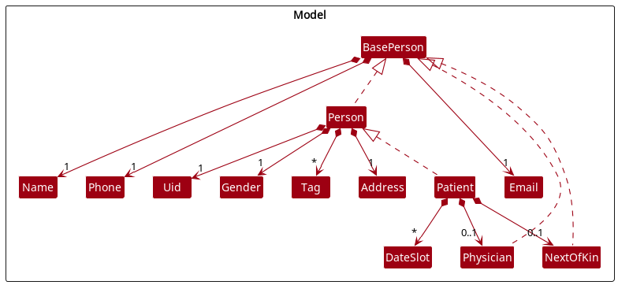
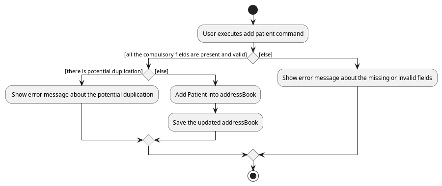
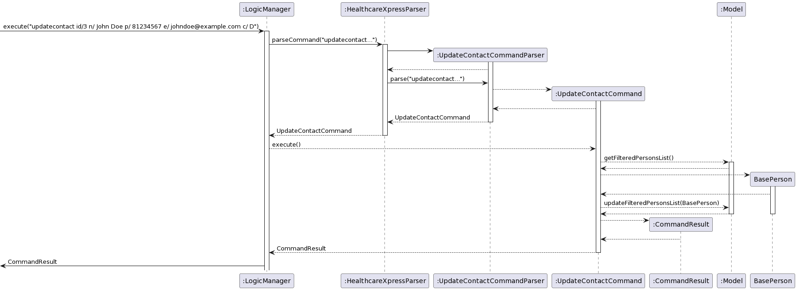

* Table of Contents
{:toc}

--------------------------------------------------------------------------------------------------------------------

## **Acknowledgements**

* {list here sources of all reused/adapted ideas, code, documentation, and third-party libraries -- include links to the original source as well}

--------------------------------------------------------------------------------------------------------------------

## **Setting up, getting started**

Refer to the guide [_Setting up and getting started_](SettingUp.md).

--------------------------------------------------------------------------------------------------------------------

## **Design**

:bulb: **Tip:** The `.puml` files used to create diagrams in this document can be found in the [diagrams](https://github.com/se-edu/addressbook-level3/tree/master/docs/diagrams/) folder. Refer to the [_PlantUML Tutorial_ at se-edu/guides](https://se-education.org/guides/tutorials/plantUml.html) to learn how to create and edit diagrams.

### Architecture

The ***Architecture Diagram*** given above explains the high-level design of the App.

Given below is a quick overview of main components and how they interact with each other.

**Main components of the architecture**

**`Main`** has two classes called [`Main`](https://github.com/se-edu/addressbook-level3/tree/master/src/main/java/seedu/address/Main.java) and [`MainApp`](https://github.com/se-edu/addressbook-level3/tree/master/src/main/java/seedu/address/MainApp.java). It is responsible for,
* At app launch: Initializes the components in the correct sequence, and connects them up with each other.
* At shut down: Shuts down the components and invokes cleanup methods where necessary.

[**`Commons`**](#common-classes) represents a collection of classes used by multiple other components.

The rest of the App consists of four components.

* [**`UI`**](#ui-component): The UI of the App.
* [**`Logic`**](#logic-component): The command executor.
* [**`Model`**](#model-component): Holds the data of the App in memory.
* [**`Storage`**](#storage-component): Reads data from, and writes data to, the hard disk.

**How the architecture components interact with each other**

The *Sequence Diagram* below shows how the components interact with each other for the scenario where the user issues the command `delete 1`.

Each of the four main components (also shown in the diagram above),

* defines its *API* in an `interface` with the same name as the Component.
* implements its functionality using a concrete `{Component Name}Manager` class (which follows the corresponding API `interface` mentioned in the previous point.

For example, the `Logic` component defines its API in the `Logic.java` interface and implements its functionality using the `LogicManager.java` class which follows the `Logic` interface. Other components interact with a given component through its interface rather than the concrete class (reason: to prevent outside component's being coupled to the implementation of a component), as illustrated in the (partial) class diagram below.

The sections below give more details of each component.

### UI component

The **API** of this component is specified in [`Ui.java`](https://github.com/se-edu/addressbook-level3/tree/master/src/main/java/seedu/address/ui/Ui.java)

The UI consists of a `MainWindow` that is made up of parts e.g.`CommandBox`, `ResultDisplay`, `PersonListPanel`, `StatusBarFooter` etc. All these, including the `MainWindow`, inherit from the abstract `UiPart` class which captures the commonalities between classes that represent parts of the visible GUI.

The `UI` component uses the JavaFx UI framework. The layout of these UI parts are defined in matching `.fxml` files that are in the `src/main/resources/view` folder. For example, the layout of the [`MainWindow`](https://github.com/se-edu/addressbook-level3/tree/master/src/main/java/seedu/address/ui/MainWindow.java) is specified in [`MainWindow.fxml`](https://github.com/se-edu/addressbook-level3/tree/master/src/main/resources/view/MainWindow.fxml)

The `UI` component,

* executes user commands using the `Logic` component.
* listens for changes to `Model` data so that the UI can be updated with the modified data.
* keeps a reference to the `Logic` component, because the `UI` relies on the `Logic` to execute commands.
* depends on some classes in the `Model` component, as it displays `Person` object residing in the `Model`.

### Logic component

**API** : [`Logic.java`](https://github.com/se-edu/addressbook-level3/tree/master/src/main/java/seedu/address/logic/Logic.java)

Here's a (partial) class diagram of the `Logic` component:

How the `Logic` component works:
1. When `Logic` is called upon to execute a command, it uses the `HealthcareXpressParser` class to parse the user command.
1. This results in a `Command` object (more precisely, an object of one of its subclasses e.g., `AddCommand`) which is executed by the `LogicManager`.
1. The command can communicate with the `Model` when it is executed (e.g. to add a person).
1. The result of the command execution is encapsulated as a `CommandResult` object which is returned back from `Logic`.

The Sequence Diagram below illustrates the interactions within the `Logic` component for the `execute("delete 1")` API call.

:information_source: **Note:** The lifeline for `DeleteCommandParser` should end at the destroy marker (X) but due to a limitation of PlantUML, the lifeline reaches the end of diagram.

Here are the other classes in `Logic` (omitted from the class diagram above) that are used for parsing a user command:

How the parsing works:
* When called upon to parse a user command, the `HealthcareXpressParser` class creates an `XYZCommandParser` (`XYZ` is a placeholder for the specific command name e.g., `AddCommandParser`) which uses the other classes shown above to parse the user command and create a `XYZCommand` object (e.g., `AddCommand`) which the `HealthcareXpressParser` returns back as a `Command` object.
* All `XYZCommandParser` classes (e.g., `AddCommandParser`, `DeleteCommandParser`, ...) inherit from the `Parser` interface so that they can be treated similarly where possible e.g, during testing.

### Model component
**API** : [`Model.java`](https://github.com/se-edu/addressbook-level3/tree/master/src/main/java/seedu/address/model/Model.java)

The `Model` component,

* stores the address book data i.e., all `Person` objects (which are contained in a `UniquePersonList` object).
* stores the currently 'selected' `Person` objects (e.g., results of a search query) as a separate _filtered_ list which is exposed to outsiders as an unmodifiable `ObservableList<Person>` that can be 'observed' e.g. the UI can be bound to this list so that the UI automatically updates when the data in the list change.
* stores a `UserPref` object that represents the user’s preferences. This is exposed to the outside as a `ReadOnlyUserPref` objects.
* does not depend on any of the other three components (as the `Model` represents data entities of the domain, they should make sense on their own without depending on other components)

:information_source: **Note:** An alternative (arguably, a more OOP) model is given below. It has a `Tag` list in the `AddressBook`, which `Person` references. This allows `AddressBook` to only require one `Tag` object per unique tag, instead of each `Person` needing their own `Tag` objects. 

### Storage component

**API** : [`Storage.java`](https://github.com/se-edu/addressbook-level3/tree/master/src/main/java/seedu/address/storage/Storage.java)

The `Storage` component,
* can save both address book data and user preference data in json format, and read them back into corresponding objects.
* inherits from both `AddressBookStorage` and `UserPrefStorage`, which means it can be treated as either one (if only the functionality of only one is needed).
* depends on some classes in the `Model` component (because the `Storage` component's job is to save/retrieve objects that belong to the `Model`)

### Common classes

Classes used by multiple components are in the `seedu.addressbook.commons` package.

--------------------------------------------------------------------------------------------------------------------

## **Implementation**

This section describes some noteworthy details on how certain features are implemented.

### Add feature

#### Implementation for adding a patient

The add patient mechanism is facilitated by `Patient`, `AddCommandParser`,`AddCommand`, `Model`, `AddressBook` and `UniquePersonList`.

`Patient` extends from `Person`. A `Patient` have the `Person` attributes and a `dateTimeList`. This is shown in the diagram below:

The `AddCommandParser` will take in the input and extract out different information respectively and create a `Patient`.

The `AddCommand` will then be executed and add the `Patient` to the `Model`'s `AddressBook`'s `UniquePersonList`.

Given below is an example usage scenario and how the add patient mechanism behaves at each step.

Step 1. The user executes `Add c/P n/Lily g/F p/91103813 a/ABC STREET 111 e/lily@gmail.com t/heartDisease dt/2022-10-10T15:20` command to add a new patient that requires nurse's home-visit.

:information_source: **Note:** The `c/P` is needed to indicate that the person added is a patient.`Name`, `Gender`, `Phone`, `Address`, `Email` is compulsory but `Tag` and `DateTime` has been made optional. The `n/`, `g/`, `p/` ... are the prefixes used to extract different details' field of the patient.

Step 2. The `HealthcareXpressParser` will parse the user command to return an `AddCommandParser` with the patient's details.

Step 3. The `AddCommandParser` will parse the respective patient's details using fixed prefixes and check their validity. The `Uid` for the patient will also be generated and used along with the parsed patient's details to create a patient if all the inputs are valid. Then, it returns an `AddCommand` with the patient created.

Step 4. The `AddCommand` will be executed and the patient will be added to the `Model`'s `AddressBook`'s `UniquePersonList`. In the `UniquePersonList`, potential duplication will be checked.

The following sequence diagram shows how the add patient operation works:

:information_source: **Note:** For simplification purpose, `c/P n/Lily g/F p/91103813 a/ABC STREET 111 e/lily@gmail.com t/heartDisease dt/2022-10-10T15:20` will be written as userInput and all the parsed patient's details will be written as patientDetails.

Step 5. The `LogicManager` will then call `saveAddressBook()` to store the new updated `AddressBook` so that the data of the new patient can be retrieved later.

The following activity diagram summarizes what happens when a user executes an add patient command:

#### Design considerations:

**Aspect: How to deal with duplication:**

* **Alternative 1:** Check the name. If the name is the same, then shows duplicate error and that patient would not be added.
    * Pros: Easy to implement.
    * Cons: If the 2 different patients have the exact same name, the user would not be able to add that patient.

* **Alternative 2:** Check the name. If the name is the same, then shows duplicate warning but that patient would still be added.
    * Pros: If the 2 different patients have the exact same name, the user would still be able to add that patient. At the same time, it will show potential duplication to the user.
    * Cons: The user have to manually check whether it is the same person and delete it if it is a duplication.
    * Cons: The user might miss out the duplicated patients.

**Aspect: The home-visit `DateTime` input:**

* **Alternative 1:** The `DateTime` input is in the format of `YYYY-MM-DDTHH:mm` and it can in any time.
    * Pros: More specific date and time recorded for the patient.
    * Pros: More flexible in the home visit date and time that a patient can choose.
    * Cons: It is hard to determine/check time crashes when assigning a home-visit `DateTime` to a nurse.

* **Alternative 2:** The `DateTime` input will be in the format of `YYYY-MM-DD` and slot. The slot will have fixed starting time and fixed duration.
    * Pros: It is easy to determine/check time crashes when assigning a home-visit `DateTime` slot to a nurse.
    * Cons: Less flexible in the home visit date and time that a patient can choose.

### Mark feature

#### Implementation for marking Appointments between Nurses and Patients

The marking mechanism is facilitated by `Appointment`, `VisitStatus`, LogicManager`, `HealthcareXpressParser`, `MarkCommandParser`, `MarkCommand`, `Model`, `AddressBook`, and `UniquePersonList`

`Appointment` is an association class between Nurse and Patient, and also keeps track of the date and time of the appointment, and if the Patient has been visited by the Nurse.

The `HealthcareXpressParser` will take in user input and recognise it as a `MarkCommand`, and pass on the user input to `MarkCommandParser`

`MarkCommandParser` will then identify the appointment of interest, by parsing the index given by the user.

Should the index provided by the user be valid, the `MarkCommand` returned by the `MarkCommandParser` will create a marked version of the `Appointment` specified by the user.

Upon execution, the `MarkCommand` will replace the `Appointment` with the marked version.

Given blow is an example usage scenario and how the mark mechanism works.

Step 1. The user enters the command `mark id/1` command to mark the appointment at index 1 as visited.

Step 2. The `HealthcareXpressParser` will parse the user command and pass the input to the `MarkCommandParser`

Step 3. The `MarkCommandParser` will parse the index, and ensure that the index is present. It will then return a `MarkCommand` with the index.

Step 4. The `MarkCommand` will execute, and change the `VisitStatus` of the `Appointment` to reflect that the `Patient` has been visited.

The following sequence diagram shows how marking an appointment works:

The following activity diagram shows what happens when a user marks an appointment as visited.

#### Design considerations

** Aspect: Marking Appointments that are already marked: **
* **Alternative 1:** Print and error message to inform the user that the Appointment has already been marked.
  * Pros: User will be made aware that they have probably erroneously marked the wrong Appointment, and make the necessary correction.
  * Cons: More difficult to implement, requires more thorough testing.

* **Alternative 2:** Make no changes and raise no exceptions.
  * Pros: Easier to implement and test.
  * Cons: User may have erroneously marked the wrong Appointment, and may not notice.

### List feature

#### Implementation for listing patients and nurses based on specified criteria

The list user function is primarily facilitated by `ListCommandParser`,`ListCommand`. `Model` and `Person` are also involved.

`ListCommandParser` takes in user input and extracts the specified criteria that the user wants.

The criteria are then passed to `ListCommand` which will create a `Predicate` based on the given criteria.

This `Predicate` is passed to `Model`, which will filter and display the enrolled users who match the given criteria.

Given below is an example usage scenario and how the list function behaves at each step. It is illustrated with the following sequence diagram:

Step 1. The user executes `list c/n g/f` to list all female nurses.

Step 2. `HealthcareXpressParser` parses the user command to return a `ListCommandParser` with the given criteria.

Step 3. The `ListCommandParser` parses the criteria using fixed prefixes and check their validity. Then, it returns an `ListCommand` with the criteria `category=N, gender=F`.

Step 4. The `ListCommand` will be executed and a `Predicate` of `category=N, gender=F` is created and passed to `Model`.

Step 5. `Model` applies the `Predicate` and filters the list of enrolled users, displaying all female nurses only.

The following activity diagram summarizes what happens when a user executes the list command:

#### Design considerations:

**Aspect: Dealing with one invalid input amoung multiple valid inputs:**

* **Alternative 1:** Verify validity of all inputs. If an input is invalid, ignore it and list based on the other given inputs.
    * Pros: It might be more convenient for the user in certain circumstances where exact criteria matching is not vital.
    * Cons: The user might think that the returned list fits the given criteria exactly, which might lead to user errors.

* **Alternative 2:** Verify validity of all inputs. If an input is invalid, do not process the command.
    * Pros: If a list is returned then the user can be sure that all returned users match the given criteria exactly.
    * Cons: Possibly inefficient if exact matching is not vital.

### Update Emergency Contacts feature

#### Implementation for updating attending physician and next of kin contact information for patients

The feature is primarily facilitated by `UpdateContactCommand` and `UpdateContactCommandParser`.

`UpdateContactCommandParser` takes in user input, extracts contact info and passes it to `UpdateContactCommand`.

`UpdateContactCommand` creates a new `NextOfKin` or `Physician`, based on whichever one the user specified.

The new `NextOfKin` or `Physician` will have the contact details as stated by the user.

`UpdateContactCommand` then gets the `Patient` from the database and edits the `Patient` to include the new contact.

The new `Patient`, with the contact info, is then passed to `Model`, so that the details are saved in the database.

Given below is an example scenario and how the `UpdateContactCommand` behaves at each step, 
illustrated with the following sequence diagram:

Step 1. The user executes `updatecontact id/3 n/ John Doe p/ 81234567 e/ johndoe@example.com c/ D`

Step 2. `HealthcareXpressParser` creates an `UpdateContactCommandParser` to parse the arguments.

Step 3. `UpdateContactCommandParser` checks validity of the given arguments and creates an `UpdateContactCommand`.

Step 4. The `UpdateContactCommand` is executed, and a new `Physician` with the given contact info is created`.

Step 5. `UpdateContactCommand` gets `Patient` with UID 3 from the database, and updates the `Patient` to contain 
`Physician` John Doe.

Step 6. `Model` updates the database, and displays the attending physician on `Patient` UID 3.

### \[Proposed\] Undo/redo feature

#### Proposed Implementation

The proposed undo/redo mechanism is facilitated by `VersionedAddressBook`. It extends `AddressBook` with an undo/redo history, stored internally as an `addressBookStateList` and `currentStatePointer`. Additionally, it implements the following operations:

* `VersionedAddressBook#commit()` — Saves the current address book state in its history.
* `VersionedAddressBook#undo()` — Restores the previous address book state from its history.
* `VersionedAddressBook#redo()` — Restores a previously undone address book state from its history.

These operations are exposed in the `Model` interface as `Model#commitAddressBook()`, `Model#undoAddressBook()` and `Model#redoAddressBook()` respectively.

Given below is an example usage scenario and how the undo/redo mechanism behaves at each step.

Step 1. The user launches the application for the first time. The `VersionedAddressBook` will be initialized with the initial address book state, and the `currentStatePointer` pointing to that single address book state.

Step 2. The user executes `delete 5` command to delete the 5th person in the address book. The `delete` command calls `Model#commitAddressBook()`, causing the modified state of the address book after the `delete 5` command executes to be saved in the `addressBookStateList`, and the `currentStatePointer` is shifted to the newly inserted address book state.

Step 3. The user executes `add n/David …​` to add a new person. The `add` command also calls `Model#commitAddressBook()`, causing another modified address book state to be saved into the `addressBookStateList`.

:information_source: **Note:** If a command fails its execution, it will not call `Model#commitAddressBook()`, so the address book state will not be saved into the `addressBookStateList`.

Step 4. The user now decides that adding the person was a mistake, and decides to undo that action by executing the `undo` command. The `undo` command will call `Model#undoAddressBook()`, which will shift the `currentStatePointer` once to the left, pointing it to the previous address book state, and restores the address book to that state.

:information_source: **Note:** If the `currentStatePointer` is at index 0, pointing to the initial AddressBook state, then there are no previous AddressBook states to restore. The `undo` command uses `Model#canUndoAddressBook()` to check if this is the case. If so, it will return an error to the user rather
than attempting to perform the undo.

The following sequence diagram shows how the undo operation works:

:information_source: **Note:** The lifeline for `UndoCommand` should end at the destroy marker (X) but due to a limitation of PlantUML, the lifeline reaches the end of diagram.

The `redo` command does the opposite — it calls `Model#redoAddressBook()`, which shifts the `currentStatePointer` once to the right, pointing to the previously undone state, and restores the address book to that state.

:information_source: **Note:** If the `currentStatePointer` is at index `addressBookStateList.size() - 1`, pointing to the latest address book state, then there are no undone AddressBook states to restore. The `redo` command uses `Model#canRedoAddressBook()` to check if this is the case. If so, it will return an error to the user rather than attempting to perform the redo.

Step 5. The user then decides to execute the command `list`. Commands that do not modify the address book, such as `list`, will usually not call `Model#commitAddressBook()`, `Model#undoAddressBook()` or `Model#redoAddressBook()`. Thus, the `addressBookStateList` remains unchanged.

Step 6. The user executes `clear`, which calls `Model#commitAddressBook()`. Since the `currentStatePointer` is not pointing at the end of the `addressBookStateList`, all address book states after the `currentStatePointer` will be purged. Reason: It no longer makes sense to redo the `add n/David …​` command. This is the behavior that most modern desktop applications follow.

The following activity diagram summarizes what happens when a user executes a new command:

#### Design considerations:

**Aspect: How undo & redo executes:**

* **Alternative 1 (current choice):** Saves the entire address book.
  * Pros: Easy to implement.
  * Cons: May have performance issues in terms of memory usage.

* **Alternative 2:** Individual command knows how to undo/redo by
  itself.
  * Pros: Will use less memory (e.g. for `delete`, just save the person being deleted).
  * Cons: We must ensure that the implementation of each individual command are correct.

_{more aspects and alternatives to be added}_

### \[Proposed\] Data archiving

_{Explain here how the data archiving feature will be implemented}_

--------------------------------------------------------------------------------------------------------------------

## **Documentation, logging, testing, configuration, dev-ops**

* [Documentation guide](Documentation.md)
* [Testing guide](Testing.md)
* [Logging guide](Logging.md)
* [Configuration guide](Configuration.md)
* [DevOps guide](DevOps.md)

--------------------------------------------------------------------------------------------------------------------

## **Appendix: Requirements**

### Product scope

**Target user profile**:

* medical administrator who has a need to manage a significant number of patients and nurses
* prefer desktop apps over other types
* can type fast with precision
* prefers typing to mouse interactions
* is reasonably comfortable using CLI apps

**Value proposition**: manage patient nurse relations faster than a typical mouse/GUI driven app

### User stories

Priorities: High (must have) - `* * *`, Medium (nice to have) - `* *`, Low (unlikely to have) - `*`

| Priority | As a …                | I can …                                                                                                  | So that …                                                                                                                                       |
|----------|-----------------------|----------------------------------------------------------------------------------------------------------|-------------------------------------------------------------------------------------------------------------------------------------------------|
| `*`      | medical administrator | export a current week’s schedule for nurses so that                                                      | they can check their schedules independently                                                                                                    |
| `* * *`  | medical administrator | quickly add the details of a patients that require home visits so that                                   | retrieve them later                                                                                                                             |
| `* * *`  | medical administrator | quickly add the details of the nurse                                                                     | retrieve them later for matching                                                                                                                |
| `* * *`  | medical administrator | add the health conditions (eg heart disease, asthma, paralysed etc) of the patients as tags              | use this information to match the patient with the respective nurse that has experience in dealing with such disease                            |
| `* *`    | medical administrator | add a list of diseases that the nurse dealt with before as tags                                          | give them the appropriate patient for a home visit                                                                                              |
| `* * *`  | medical administrator | add patients to the existing list of patients that the nurse is going to home visit for the current week | use it to create the schedule for the nurse                                                                                                     |
| `*`      | medical administrator | add the availability of the nurse                                                                        | use this information to assign the patient to them                                                                                              |
| `* * *`  | medical administrator | add the date (and time + duration) of home visit appointments for the patient                            | schedule the nurses accordingly                                                                                                                 |
| `*`      | medical administrator | add next of kin particulars for a patient                                                                | inform them in case of any emergency                                                                                                            |
| `*`      | medical administrator | add the contact details of the patient's attending physician                                             | liaise with them regarding the patient's treatments and how the patient responds to them                                                        |
| `* *`    | medical administrator | add patients' critical information                                                                       | quickly identify any essential information that needs to be taken note of during scheduling                                                     |
| `*`      | medical administrator | store a nurse's schedule in a specific folder with the nurse’s name as the individual file’s name        |                                                                                                                                                 |
| `*`      | medical administrator | create a file with the nurse's name for later storage of the schedule                                    |                                                                                                                                                 |
| `* * *`  | medical administrator | store all the information of the patient and nurse in respective files                                   |                                                                                                                                                 |
| `* * *`  | medical administrator | delete a patient who no longer requires home visits                                                      | I do not need to include them in the scheduled exercise                                                                                         |
| `* * *`  | medical administrator | delete the nurse that is no longer in this department                                                    | I would not schedule an unavailable nurse                                                                                                       |
| `* *`    | medical administrator | check how many patients are not yet scheduled for the current week ( /for a certain period)              | I know whether I have finished scheduling                                                                                                       |
| `* *`    | medical administrator | check the list of unscheduled patients                                                                   | schedule them now                                                                                                                               |
| `*`      | medical administrator | check the list of nurses not going for a home visit on a specific date                                   | if one of the nurses suddenly falls sick, I have to schedule her assigned patient with the other available nurse quickly                        |
| `*`      | medical administrator | assess a patient's details by name and update their personal information or health condition             | if there are any changes, edit them accordingly                                                                                                 |
| `*`      | medical administrator | assess a patient’s details by name and change their home visit’s date/ time                              | if the patient suddenly wants to change their appointment date/ time, also change it accordingly                                                |
| `* * *`  | medical administrator | mark a patient as scheduled                                                                              | prevent scheduling a patient twice                                                                                                              |
| `*`      | medical administrator | also unmark a patient as unscheduled                                                                     | if the patient changes the date for the home visits, I will remember to schedule the patient again by unmarking it                              |
| `* * *`  | medical administrator | mark a nurse as fully scheduled                                                                          | I will not match the nurse with the remaining patients since their home visit schedule is already full                                          |
| `* *`    | medical administrator | also unmark a nurse as not-fully scheduled                                                               | if one of their patients suddenly reschedules the dates, unmark the nurse and match the nurse with the remaining patients till it is full again |
| `*`      | medical administrator | manage recurring home visits                                                                             | I do not need to keep updating the date/time of the home visits                                                                                 |
| `*`      | medical administrator | create a one-week schedule that contains the list of all the required patient details for a nurse        | save it and export/send it to the nurse                                                                                                         |
| `* *`    | medical administrator | check whether there are time crashes in a nurse's schedule                                               | if a time crash is detected, reschedule it again                                                                                                |
| `*`      | medical administrator | check whether there are duplicate patients                                                               | the duplication can be detected and removed even if I accidentally add a patient into the system more than once                                 |
| `*`      | medical administrator | sort the list of patients by home visit date                                                             | I know which patient I need to schedule first                                                                                                   |
| `* * *`  | medical administrator | find patients by keywords/name (such as diabetic patient, Kent Ridge etc)                                | search the patients by keyword and assign them to the nurses                                                                                    |
| `*`      | medical administrator | create location tags to label the patients                                                               | group them by labels and assign the groups to the nurses                                                                                        |
| `* *`    | medical administrator | give patients different priorities                                                                       | if a patient’s condition is more serious, I need to assign more nurses / more experienced nurses to the patient’s home visits                   |
| `*`      | medical administrator | archive the patient records                                                                              | there is still a record of the patient after deletion                                                                                           |

*{More to be added}*

### Use cases

(For all use cases below, the **System** is the `Healthcare Xpress` and the **Actor** is the `medical administrator`, unless specified otherwise)

**Use case: UC01 - List Patients / Nurses**

**MSS**

1. Medical administrator requests to list patients,nurses or both with or without specifications.
2. Healthcare Xpress shows a list of patients/nurses that satisfy the specifications.

   Use case ends.

**Extensions**
* 1a. The given inputs/specifications are invalid.

    * 1a1. Healthcare Xpress shows an error message.

      Use case ends.

* 1b. The given specifications are nurses and areas only.

    * 1b1. Healthcare Xpress shows an error message.

      Use case ends.

* 1c. There are no patients/nurses that satisfy the specifications.

    * 1c1. Healthcare Xpress shows a blank list.

      Use case ends.

* *a. At any time, medical administrator choose to exit the program.

  Use case ends.

**Use case: UC02 - Find a Specific Patient / Nurse**

**MSS**

1. Medical administrator requests to find a specific patient/nurse.
2. Healthcare Xpress shows that specific patient/nurse.

   Use case ends.

**Extensions**
* 1a. The given inputs are invalid.

    * 1a1. Healthcare Xpress shows an error message.

      Use case ends.

* 1b. There is not only one patient/nurse that can match the find inputs.

    * 1b1. Healthcare Xpress returns a list of patients/nurses that matched and the first one being the most matched.

      Use case ends.

* *a. At any time, medical administrator choose to exit the program.

  Use case ends.

**Use case: UC03 - Delete a Patient / Nurse**

**MSS**

1. Medical administrator requests to <ins>list patients / nurses (UC01)</ins> or <ins>find a specific patient / nurse (UC02)</ins>.
2. Medical administrator requests to delete a patient/nurse.
3. Healthcare Xpress deletes the patient/nurse.

   Use case ends.

**Extensions**
* 2a. The given id number is invalid.

    * 2a1. Healthcare Xpress shows an error message.

      Use case resumes at step 1.

* *a. At any time, medical administrator chooses to exit the program.

  Use case ends.

**Use case: UC04 - Mark a Patient**

**MSS**

1.  Medical administrator requests to <ins>list patients / nurses (UC01)</ins> or <ins>find a specific patient / nurse (UC02)</ins>.
2.  Medical administrator requests to mark a specific patient.
3.  Healthcare Xpress marks the patient as visited.

    Use case ends.

**Extensions**
* 1a. Only nurse/nurses are shown.

    * 1a1. Medical administrator requests to mark a nurse.

    * 1a2. Healthcare Xpress shows an error message.

      Use case ends.

* 2a. The given id number is invalid.

    * 2a1. Healthcare Xpress shows an error message.

      Use case resumes at step 1.

* 2b. The given id number is not a patient.

    * 2b1. Healthcare Xpress shows an error message.

      Use case resumes at step 1.

* *a. At any time, medical administrator chooses to exit the program.

  Use case ends.

**Use case: UC05 - Edit a Patient / Nurse**

**MSS**

1.  Medical administrator requests to <ins>list patients / nurses (UC01)</ins> or <ins>find a specific patient / nurse (UC02)</ins>.
2.  Medical administrator requests to edit a patient / nurse and provides the details to be edited.
3.  Healthcare Xpress edits the specific details of the patient / nurse.

    Use case ends.

**Extensions**
* 2a. The given id number is invalid.

    * 2a1. Healthcare Xpress shows an error message.

      Use case resumes at step 1.

* 2b. The given details to be edited is invalid / in wrong format.

    * 2b1. Healthcare Xpress shows an error message.

      Use case resumes at step 1.

* *a. At any time, medical administrator chooses to exit the program.

  Use case ends.

**Use case: UC06 - Add Tag / Tags to a Patient / Nurse**

**MSS**

1.  Medical administrator requests to <ins>list patients / nurses (UC01)</ins> or <ins>find a specific patient / nurse (UC02)</ins>.
2.  Medical administrator requests to add a tag / many tags to a patient / nurse and provides each tag's details.
3.  Healthcare Xpress adds the tag / tags of specific details to the patient / nurse.

    Use case ends.

**Extensions**
* 2a. The given id number is invalid.

    * 2a1. Healthcare Xpress shows an error message.

      Use case resumes at step 1.

* 2b. The given details is invalid / in the wrong format.

    * 2b1. Healthcare Xpress shows an error message.

      Use case resumes at step 1.

* *a. At any time, medical administrator chooses to exit the program.

  Use case ends.

**Use case: UC07 - Delete a Specific Tag / Many Tags from a Patient / Nurse**

**MSS**

1.  Medical administrator requests to <ins>list patients / nurses (UC01)</ins> or <ins>find a specific patient / nurse (UC02)</ins>.
2.  Medical administrator requests to delete a specific tag / many tags from a patient / nurse.
3.  Healthcare Xpress deletes the tag / tags from the patient / nurse.

    Use case ends.

**Extensions**
* 2a. The given id number is invalid.

    * 2a1. Healthcare Xpress shows an error message.

      Use case resumes at step 1.

* 2b. The given index of the tag / tags is out of bounds.

    * 2b2. Healthcare Xpress shows an error message.

      Use case resumes at step 1.

* *a. At any time, medical administrator chooses to exit the program.

  Use case ends.

**Use case: UC08 - Add a Home-Visit Date and Time to a Patient**

**MSS**

1.  Medical administrator requests to <ins>list patients / nurses (UC01)</ins> or <ins>find a specific patient / nurse (UC02)</ins>.
2.  Medical administrator requests to add a date and time with or without recurring status to a patient.
3.  Healthcare Xpress add the date and time for home-visits to the patient.

    Use case ends.

**Extensions**
* 1a. Only nurse/nurses are shown.

    * 1a1. Medical administrator request to add a date and time to the nurse.

    * 1a2. Healthcare Xpress shows an error message.

      Use case ends.

* 2a. The given id number is invalid.

    * 2a1. Healthcare Xpress shows an error message.

      Use case resumes at step 1.

* 2b. The given id number is not a patient.

    * 2b1. Healthcare Xpress shows an error message.

      Use case resumes at step 1.

* 2c. The given date and time is invalid or in wrong format.

    * 2c1. Healthcare Xpress shows an error message.

      Use case resumes at step 1.

* *a. At any time, medical administrator chooses to exit the program.

  Use case ends.

**Use case: UC09 - Delete a Home-Visit Date and Time from a Patient**

**MSS**

1.  Medical administrator requests to <ins>list patients / nurses (UC01)</ins> or <ins>find a specific patient / nurse (UC02)</ins>.
2.  Medical administrator requests to delete date and time from a patient.
3.  Healthcare Xpress deletes the date and time for home-visits from the patient.

    Use case ends.

**Extensions**
* 1a. Only nurse/nurses are shown.

    * 1a1. Medical administrator request to delete a date and time from the nurse.

    * 1a2. Healthcare Xpress shows an error message.

      Use case ends.

* 2a. The given id number is invalid.

    * 2a1. Healthcare Xpress shows an error message.

      Use case resumes at step 1.

* 2b. The given id number is not a patient.

    * 2b1. Healthcare Xpress shows an error message.

      Use case resumes at step 1.

* *a. At any time, medical administrator chooses to exit the program.

  Use case ends.

**Use case: UC10 - Update a Home-Visit Date and Time for a Patient**

**MSS**

1.  Medical administrator requests to <ins>list patients / nurses (UC01)</ins> or <ins>find a specific patient / nurse (UC02)</ins>.
2.  Medical administrator requests to update date and time from a patient.
3.  Healthcare Xpress updates the date and time for home-visits from the patient.

    Use case ends.

**Extensions**
* 1a. Only nurse/nurses are shown.

    * 1a1. Medical administrator request to update a date and time from the nurse.

    * 1a2. Healthcare Xpress shows an error message.

      Use case ends.

* 2a. The given id number is invalid.

    * 2a1. Healthcare Xpress shows an error message.

      Use case resumes at step 1.

* 2b. The given id number is not a patient.

    * 2b1. Healthcare Xpress shows an error message.

      Use case resumes at step 1.

* 2c. The new date and time given is invalid or in wrong format.

    * 2c1. Healthcare Xpress shows an error message.

      Use case resumes at step 1.

* 2d. The patient has been assigned to a nurse and the new updated date and time crashes with that nurse existing schedule.

    * 2d2. Healthcare Xpress shows an error message.

      Use case ends.

* *a. At any time, medical administrator choose to exit the program.

  Use case ends.

**Use case: UC11 - Assign a patient to the nurse**

**MSS**

1.  Medical administrator requests to <ins>list patients / nurses (UC01)</ins> or <ins>find a specific patient / nurse (UC02)</ins>.
2.  Medical administrator requests to assign a patient to a nurse.
3.  Healthcare Xpress assigns the patient to the nurse.

    Use case ends.

**Extensions**
* 2a. Any given id number is invalid.

    * 2a1. Healthcare Xpress shows an error message.

      Use case resumes at step 1.

* 2b. The given id numbers are both patients or nurses.

    * 2b1. Healthcare Xpress shows an error message.

      Use case resumes at step 1.

* 2c. The given id number's nurse has another home-visit at the same date and time.

    * 2c1. Healthcare Xpress shows an error message.

      Use case resumes at step 1.

* *a. At any time, Medical administrator chooses to exit the program.

  Use case ends.

**Use case: UC12 - Remove a patient / all patients from a nurse**

**MSS**

1.  Medical administrator requests to <ins>list patients / nurses (UC01)</ins> or <ins>find a specific patient / nurse (UC02)</ins>.
2.  Medical administrator requests to remove a patient or all patients from a nurse.
3.  Healthcare Xpress removes the patient / all patients from the nurse.

    Use case ends.

**Extensions**
* 2a. Any given id number is invalid.

    * 2a1. Healthcare Xpress shows an error message.

      Use case resumes at step 1.

* 2b. One given id number is not a nurse.

    * 2b1. Healthcare Xpress shows an error message.

      Use case resumes at step 1.

* 2c. Two given id numbers is both patients or both nurses.

    * 2c1. Healthcare Xpress shows an error message.

      Use case resumes at step 1.

* *a. At any time, medical administrator choose to exit the program.

  Use case ends.

**Use case: UC13 - Swap a patient's nurse**

**MSS**

1.  Medical administrator requests to <ins>list patients / nurses (UC01)</ins> or <ins>find a specific patient / nurse (UC02)</ins>.
2.  Medical administrator requests to swap a patient's nurse.
3.  Healthcare Xpress swaps the patient's nurse to a new nurse.

    Use case ends.

**Extensions**
* 2a. Any given id number is invalid.

    * 2a1. Healthcare Xpress shows an error message.

      Use case resumes at step 1.

* 2b. The three given id numbers do not belong to two nurses and one patient.

    * 2b1. Healthcare Xpress shows an error message.

      Use case resumes at step 1.

* *a. At any time, medical administrator choose to exit the program.

  Use case ends.

### Non-Functional Requirements

1. Technical Requirements:
    1. The application should work on any _mainstream OS_, such as Windows, Linux, and macOS, as long as it has Java `11` or above installed.
    2. The application should be compatible with both _32-bit_ and _64-bit_ environments.
2. Performance Requirements:
    1. Should be able to hold up to _10000 patients and nurses_ without noticeable sluggishness in performance for typical usage.
    2. The application should be able to launch within _5 seconds_.
    3. The application should be able to respond to each command within _1 second_.
3. Quality requirements:
    1. A user with above average typing speed for regular English text (i.e. not code, not system admin commands)
       should be able to accomplish most of the tasks faster using commands than using the mouse.
    2. A user with minimal knowledge on how to operate text-based applications should be able to quickly learn how to use it.
4. Constraints:
    1. Each version of the application should be _backwards compatible_ with data produced by earlier versions.
    2. Specifications of dates and times should be compliant with ISO 8601 standard, and in the GMT+8 time zone.
5. Project Scope:
    1. The application is not required to handle the printing of the patient-nurse visitation schedule.

### Glossary

* **Medical Administrator**: A person who oversees, plan, direct, and coordinate home-visits for patients.
* **Patients**: A person receiving or registered to receive home visits due to special needs.
* **Nurses**: A person trained to care for the sick or infirm, especially trained to do home-visiting.
* **Healthcare Xpress**: A desktop app for managing patients that require home-visits.
* **Mainstream OS**: Windows, Linux, Unix, OS-X
* **Private contact detail**: A contact detail that is not meant to be shared with others

--------------------------------------------------------------------------------------------------------------------

## **Appendix: Instructions for manual testing**

Given below are instructions to test the app manually.

:information_source: **Note:** These instructions only provide a starting point for testers to work on;
testers are expected to do more *exploratory* testing.

### Launch and shutdown

1. Initial launch

   1. Download the jar file and copy into an empty folder

   1. Double-click the jar file Expected: Shows the GUI with a set of sample contacts. The window size may not be optimum.

1. Saving window preferences

   1. Resize the window to an optimum size. Move the window to a different location. Close the window.

   1. Re-launch the app by double-clicking the jar file. 
       Expected: The most recent window size and location is retained.

1. _{ more test cases …​ }_

### Deleting a person

1. Deleting a person while all persons are being shown

   1. Prerequisites: List all persons using the `list` command. Multiple persons in the list.

   1. Test case: `delete 1` 
      Expected: First contact is deleted from the list. Details of the deleted contact shown in the status message. Timestamp in the status bar is updated.

   1. Test case: `delete 0` 
      Expected: No person is deleted. Error details shown in the status message. Status bar remains the same.

   1. Other incorrect delete commands to try: `delete`, `delete x`, `...` (where x is larger than the list size) 
      Expected: Similar to previous.

1. _{ more test cases …​ }_

### Saving data

1. Dealing with missing/corrupted data files

   1. _{explain how to simulate a missing/corrupted file, and the expected behavior}_

1. _{ more test cases …​ }_
