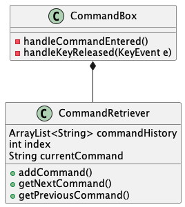
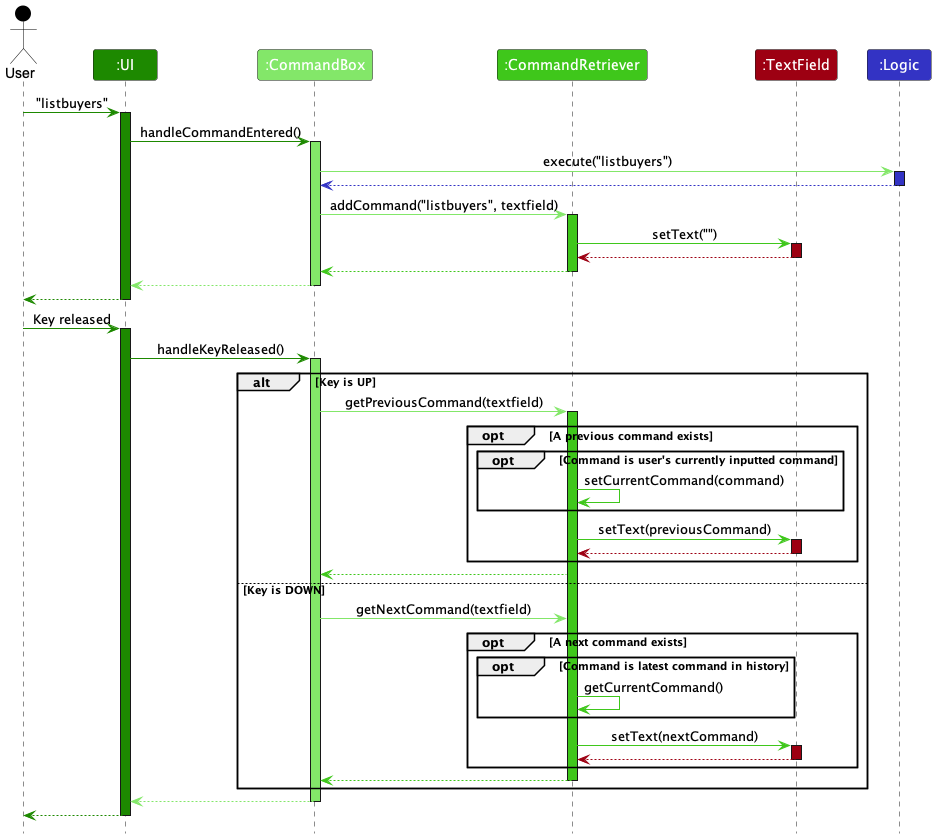
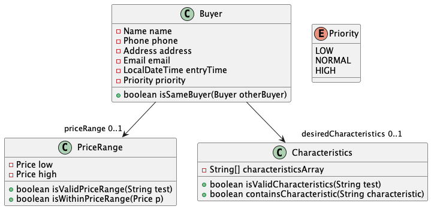
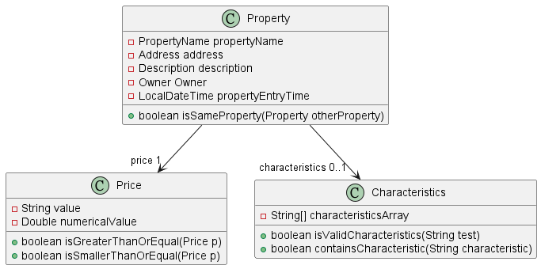
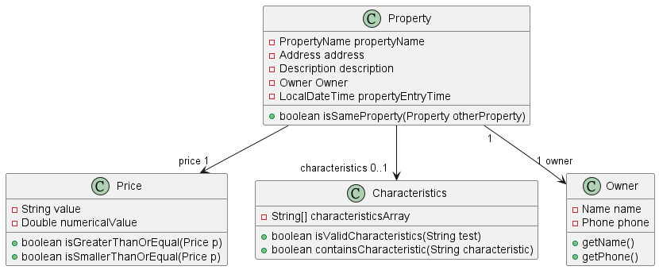

* Table of Contents
{:toc}

--------------------------------------------------------------------------------------------------------------------

## **Acknowledgements**

* {list here sources of all reused/adapted ideas, code, documentation, and third-party libraries -- include links to the original source as well}

--------------------------------------------------------------------------------------------------------------------

## **Setting up, getting started**

Refer to the guide [_Setting up and getting started_](SettingUp.md).

--------------------------------------------------------------------------------------------------------------------

## **Design**

:bulb: **Tip:** The `.puml` files used to create diagrams in this document can be found in the [diagrams](https://github.com/se-edu/addressbook-level3/tree/master/docs/diagrams/) folder. Refer to the [_PlantUML Tutorial_ at se-edu/guides](https://se-education.org/guides/tutorials/plantUml.html) to learn how to create and edit diagrams.

### Architecture

The ***Architecture Diagram*** given above explains the high-level design of the App.

Given below is a quick overview of main components and how they interact with each other.

**Main components of the architecture**

**`Main`** has two classes called [`Main`](https://github.com/se-edu/addressbook-level3/tree/master/src/main/java/seedu/address/Main.java) and [`MainApp`](https://github.com/se-edu/addressbook-level3/tree/master/src/main/java/seedu/address/MainApp.java). It is responsible for,
* At app launch: Initializes the components in the correct sequence, and connects them up with each other.
* At shut down: Shuts down the components and invokes cleanup methods where necessary.

[**`Commons`**](#common-classes) represents a collection of classes used by multiple other components.

The rest of the App consists of four components.

* [**`UI`**](#ui-component): The UI of the App.
* [**`Logic`**](#logic-component): The command executor.
* [**`Model`**](#model-component): Holds the data of the App in memory.
* [**`Storage`**](#storage-component): Reads data from, and writes data to, the hard disk.

**How the architecture components interact with each other**

The *Sequence Diagram* below shows how the components interact with each other for the scenario where the user issues the command `deletebuyer 1`.

Each of the four main components (also shown in the diagram above),

* defines its *API* in an `interface` with the same name as the Component.
* implements its functionality using a concrete `{Component Name}Manager` class (which follows the corresponding API `interface` mentioned in the previous point.

For example, the `Logic` component defines its API in the `Logic.java` interface and implements its functionality using the `LogicManager.java` class which follows the `Logic` interface. Other components interact with a given component through its interface rather than the concrete class (reason: to prevent outside component's being coupled to the implementation of a component), as illustrated in the (partial) class diagram below.

The sections below give more details of each component.

### UI component

The **API** of this component is specified in [`Ui.java`](https://github.com/se-edu/addressbook-level3/tree/master/src/main/java/seedu/address/ui/Ui.java)

The UI consists of a `MainWindow` that is made up of parts e.g.`CommandBox`, `ResultDisplay`, `BuyerListPanel`, `PropertyListPanel`, `StatusBarFooter` etc. All these, including the `MainWindow`, inherit from the abstract `UiPart` class which captures the commonalities between classes that represent parts of the visible GUI.

The `UI` component uses the JavaFx UI framework. The layout of these UI parts are defined in matching `.fxml` files that are in the `src/main/resources/view` folder. For example, the layout of the [`MainWindow`](https://github.com/se-edu/addressbook-level3/tree/master/src/main/java/seedu/address/ui/MainWindow.java) is specified in [`MainWindow.fxml`](https://github.com/se-edu/addressbook-level3/tree/master/src/main/resources/view/MainWindow.fxml)

The `UI` component,

* executes user commands using the `Logic` component.
* listens for changes to `Model` data so that the UI can be updated with the modified data.
* keeps a reference to the `Logic` component, because the `UI` relies on the `Logic` to execute commands.
* depends on some classes in the `Model` component, as it displays `Person` object residing in the `Model`.

### Logic component

**API** : [`Logic.java`](https://github.com/se-edu/addressbook-level3/tree/master/src/main/java/seedu/address/logic/Logic.java)

Here's a (partial) class diagram of the `Logic` component:

How the `Logic` component works:
1. When `Logic` is called upon to execute a command, it uses the `CobbParser` class to parse the user command.
1. This results in a `Command` object (more precisely, an object of one of its subclasses e.g., `AddBuyerCommand`) which is executed by the `LogicManager`.
1. The command can communicate with the `Model` when it is executed (e.g. to add a buyer).
1. The result of the command execution is encapsulated as a `CommandResult` object which is returned back from `Logic`.

The Sequence Diagram below illustrates the interactions within the `Logic` component for the `execute("deletebuyer 1")` API call.

:information_source: **Note:** The lifeline for `DeleteBuyerCommandParser` should end at the destroy marker (X) but due to a limitation of PlantUML, the lifeline reaches the end of diagram.

Here are the other classes in `Logic` (omitted from the class diagram above) that are used for parsing a user command:

How the parsing works:
* When called upon to parse a user command, the `CobbParser` class creates an `XYZCommandParser` (`XYZ` is a placeholder for the specific command name e.g., `AddBuyerCommandParser`) which uses the other classes shown above to parse the user command and create a `XYZCommand` object (e.g., `AddBuyerCommand`) which the `CobbParser` returns back as a `Command` object.
* All `XYZCommandParser` classes (e.g., `AddBuyerCommandParser`, `DeletePropertyCommandParser`, ...) inherit from the `Parser` interface so that they can be treated similarly where possible e.g, during testing.

### Model component
**API** : [`Model.java`](https://github.com/se-edu/addressbook-level3/tree/master/src/main/java/seedu/address/model/Model.java)

The `Model` component,

* stores the buyer book data i.e., all `Buyer` objects (which are contained in a `UniqueBuyerList` object).
* stores the property book date i.e, all `Property` objects (which are contained in a `UniquePropertyList` object).
* stores the currently 'selected' `Buyer` objects (e.g., results of a search query) as a separate _filtered_ list which is exposed to outsiders as an unmodifiable `ObservableList<Buyer>` that can be 'observed' e.g. the UI can be bound to this list so that the UI automatically updates when the data in the list change.
* * stores the currently 'selected' `Property` objects (e.g., results of a search query) as a separate _filtered_ list which is exposed to outsiders as an unmodifiable `ObservableList<Property>` that can be 'observed' e.g. the UI can be bound to this list so that the UI automatically updates when the data in the list change.
* stores a `UserPref` object that represents the user’s preferences. This is exposed to the outside as a `ReadOnlyUserPref` objects.
* does not depend on any of the other three components (as the `Model` represents data entities of the domain, they should make sense on their own without depending on other components)

:information_source: **Note:** An alternative (arguably, a more OOP) model is given below. A generic Cobb class is created as the parent for BuyerBook and PropertyBook since that the two children classes have a lot of methods with identical purposes. 

### Storage component

**API** : [`Storage.java`](https://github.com/se-edu/addressbook-level3/tree/master/src/main/java/seedu/address/storage/Storage.java)

The `Storage` component,
* can save buyer book data, property book date, and user preference data in json format, and read them back into corresponding objects.
* inherits from `BuyerBookStorage`, `PropertyBookStorage`, `UserPrefStorage`, which means it can be treated as either one (if only the functionality of only one is needed).
* depends on some classes in the `Model` component (because the `Storage` component's job is to save/retrieve objects that belong to the `Model`)

### Common classes

Classes used by multiple components are in the `seedu.addressbook.commons` package.

--------------------------------------------------------------------------------------------------------------------

## **Implementation**

This section describes some noteworthy details on how certain features are implemented.

### \[Proposed\] Undo/redo feature

#### Proposed Implementation

The proposed undo/redo mechanism is facilitated by `VersionedAddressBook`. It extends `AddressBook` with an undo/redo history, stored internally as an `addressBookStateList` and `currentStatePointer`. Additionally, it implements the following operations:

* `VersionedAddressBook#commit()` — Saves the current address book state in its history.
* `VersionedAddressBook#undo()` — Restores the previous address book state from its history.
* `VersionedAddressBook#redo()` — Restores a previously undone address book state from its history.

These operations are exposed in the `Model` interface as `Model#commitAddressBook()`, `Model#undoAddressBook()` and `Model#redoAddressBook()` respectively.

Given below is an example usage scenario and how the undo/redo mechanism behaves at each step.

Step 1. The user launches the application for the first time. The `VersionedAddressBook` will be initialized with the initial address book state, and the `currentStatePointer` pointing to that single address book state.

Step 2. The user executes `delete 5` command to delete the 5th buyer in the address book. The `delete` command calls `Model#commitAddressBook()`, causing the modified state of the address book after the `delete 5` command executes to be saved in the `addressBookStateList`, and the `currentStatePointer` is shifted to the newly inserted address book state.

Step 3. The user executes `add n/David …​` to add a new buyer. The `add` command also calls `Model#commitAddressBook()`, causing another modified address book state to be saved into the `addressBookStateList`.

:information_source: **Note:** If a command fails its execution, it will not call `Model#commitAddressBook()`, so the address book state will not be saved into the `addressBookStateList`.

Step 4. The user now decides that adding the buyer was a mistake, and decides to undo that action by executing the `undo` command. The `undo` command will call `Model#undoAddressBook()`, which will shift the `currentStatePointer` once to the left, pointing it to the previous address book state, and restores the address book to that state.

:information_source: **Note:** If the `currentStatePointer` is at index 0, pointing to the initial AddressBook state, then there are no previous AddressBook states to restore. The `undo` command uses `Model#canUndoAddressBook()` to check if this is the case. If so, it will return an error to the user rather
than attempting to perform the undo.

The following sequence diagram shows how the undo operation works:

:information_source: **Note:** The lifeline for `UndoCommand` should end at the destroy marker (X) but due to a limitation of PlantUML, the lifeline reaches the end of diagram.

The `redo` command does the opposite — it calls `Model#redoAddressBook()`, which shifts the `currentStatePointer` once to the right, pointing to the previously undone state, and restores the address book to that state.

:information_source: **Note:** If the `currentStatePointer` is at index `addressBookStateList.size() - 1`, pointing to the latest address book state, then there are no undone AddressBook states to restore. The `redo` command uses `Model#canRedoAddressBook()` to check if this is the case. If so, it will return an error to the user rather than attempting to perform the redo.

Step 5. The user then decides to execute the command `list`. Commands that do not modify the address book, such as `list`, will usually not call `Model#commitAddressBook()`, `Model#undoAddressBook()` or `Model#redoAddressBook()`. Thus, the `addressBookStateList` remains unchanged.

Step 6. The user executes `clear`, which calls `Model#commitAddressBook()`. Since the `currentStatePointer` is not pointing at the end of the `addressBookStateList`, all address book states after the `currentStatePointer` will be purged. Reason: It no longer makes sense to redo the `add n/David …​` command. This is the behavior that most modern desktop applications follow.

The following activity diagram summarizes what happens when a user executes a new command:

#### Design considerations:

**Aspect: How undo & redo executes:**

* **Alternative 1 (current choice):** Saves the entire address book.
  * Pros: Easy to implement.
  * Cons: May have performance issues in terms of memory usage.

* **Alternative 2:** Individual command knows how to undo/redo by
  itself.
  * Pros: Will use less memory (e.g. for `delete`, just save the buyer being deleted).
  * Cons: We must ensure that the implementation of each individual command are correct.

_{more aspects and alternatives to be added}_

### \[Proposed\] Data archiving

_{Explain here how the data archiving feature will be implemented}_

### Navigate previous commands with arrow keys

#### Motivation

Currently, once a command is executed successfully, there is no way for the user to get it back easily.
However, a user who frequently uses command line interfaces (CLIs) might expect the use of arrow keys to bring
back previous commands, as a way to quickly input multiple similar commands at once.

#### Implementation
`CommandBox` in the `commandbox` package represents the GUI component where the user enters commands.
`CommandRetriever` is a static nested class within `CommandBox`, used to contain and retrieve the history of
successful commands. It implements the following public methods:
- `CommandRetriever#addCommand(String command, TextField textfield)` - Adds a successful command to the command history,
and clears the TextField
- `CommandRetriever#getPreviousCommand(TextField textfield)` - Displays the previous command in the Textfield, if it
exists in the history
- `CommandRetriever#getNextCommand(TextField textfield)` - Displays the next command in the Textfield, if it
exists in the history

These methods are called by `CommandBox#handleCommandEntered()` and `CommandBox#handleKeyReleased(KeyEvent e)`.

Here is the UML diagram for `CommandRetriever`.

`CommandRetriever` only keeps track of the commands executed successfully, as invalid commands are highlighted red
and do not disappear from the TextField. Thus, there is no need to store these invalid commands since the user can
already edit the invalid command in the current implementation without having to retype it. Storing invalid commands
in `CommandRetriever` would only clutter up the history, especially if the user inputted numerous invalid commands.

Given below is an example usage scenario and how the arrow key changes the `CommandBox` text field at each step.
A sequence diagram is also provided below.

Step 1. The user launches the application for the first time. `commandHistory` is initialised as an empty
`ArrayList<String>`, and index is initialised as 0.

Step 2. The user executes a command, `listbuyers` by pressing the Enter key. `CommandBox#handleCommand` is fired,
getting the text from the text field. Since it is a valid command, it is executed successfully. `listbuyers` is added
to the `commandHistory` list, and index is set to `commandHistory.size()`.

Step 3. The user types a command halfway, but does not press the Enter key. He/she now wishes to use the previous
command to type the command.

Step 4. The user presses and releases the Up arrow. `CommandBox#handleKeyReleased` is fired, which sets the text field
to display the `(index - 1)`th element in `commmandHistory`. Because the current command is one that has not been
executed, it is saved in the field `currentCommand`.

Step 5. The user presses and releases the Up arrow again. `CommandBox#handleKeyReleased` is fired, but since there are
no more previous commands, nothing happens.

Step 6. The user presses and releases the Down arrow. `CommandBox#handleKeyReleased` is fired. Since this is the last
element in `commandHistory`, the text field is set to display the string `currentCommand`. This would be the user's
unexecuted command from Step 3.

### Creating a buyer

The `Buyer` class represents a buyer with buyer-specific fields. `PriceRange`, `Characteristics`, and `Priority`
denote his budget, requirements for the property, and buyer priority respectively.  

These three fields are all optional. When the user chooses not to indicate a buyer’s price range or desired characteristics, the `priceRange` and `desiredCharacteristics` field of a buyer may be null. Hence, they have both been implemented using `Optional<T>`.
When the user chooses not to indicate a buyer priority, the buyer's priority will be set to the default priority as `NORMAL`.
When the user creates a buyer, the entry time is also automatically stored as an `LocalDateTime`. 

This is the class diagram of a `Buyer`.

The structure for executing an `addbuyer` command follows the flow as mentioned in the “Logic component” section of this guide.

#### Design considerations:
No duplicate buyers can be added to the buyer list. This means that no two buyers with the same phone or email can exist. We considered using only name to identify a buyer, so that two people with the name but different contact numbers can be added. However, we decided against it as there could be two people with the exact same name. Therefore, we decided to use phone or email since these should be unique to every person. 
The entry time is added towards later of the development to help facilitate a more flexible implementation of the `sortbuyers` command.  

### Creating a property

The `Property` class represents a property with property-specific fields. `Price` and `Characteristics` denote the price and feature of the property respectively.

The `price` field is mandatory while the `characteristics` field is optional. When the user chooses not to indicate a property's characteristics, the `characteristics` field of a property may be null. Hence, it has been implemented using `Optional<T>`.
When the user creates a property, the entry time is also automatically stored as an `LocalDateTime`.

This is the class diagram of a `Property`.

The structure for executing an `addprop` command follows the flow as mentioned in the "Logic component" section of this guide.

#### Design considerations:
No duplicate properties can be added to the property list. This means that no two properties with the same address can exist. We used name and price to identify a property in previous iterations, but later decided against it since in real life there could be identical properties with the exact same name and price. The only thing unique to the property would be the unit number recorded in the address.
The entry time is added towards later of the development to help facilitate a more flexible implementation of the `sortprops` command.
### Owner specification within a property

To identify the owner of the property, we decided to include an `Owner` object within a `Property`. This `Owner` class contains two fields: `name` and `phone`.

The `name` and `phone` fields in the `Owner` class are compulsory, to make sure that each property being sold has a relevant contact buyer.
The fields are also validated the same way as when creating a new `Buyer` object.

To support retrieving the `Owner` of a `Property`, we added the following methods:
- `Property#getOwner()` - Returns the `Owner` object of the property.
- `Property#getOwnerName()` - Retrieves the name of the owner of the property.
- `Property#getOwnerPhone()` - Retrieves the phone number of the owner of the property.

This is the class diagram showing the full `Property` class diagram, with the `Owner` class included:

The `Owner` class enacts the Composition relationship, as the `Property` class contains the `Owner` object. Hence, if the property is deleted, it's associated owner will also be deleted.
The tradeoffs for this approach is examined below:

#### Design considerations:

**Aspect: How the owner class associates with the property class:**

* **Alternative 1 (current choice):** Owner class is coupled together with the property class.
    * Pros:
      * The `Owner` class is only used in the `Property` class, so it makes sense to couple them together.
      * You do not need to create an owner object separately using another command.
      * This reduces complexity of the system, and unexpected behaviours.
    * Cons:
      * This creates a 1-to-1 relationship between the owner and the property.
      * Each owner is coupled tightly with the property, and cannot be used for other properties.

* **Alternative 2:** Users will have to create an `Owner` object separately, and link it to the property manually.
    * Pros:
      * This allows for a many-to-many relationship between the owners and properties.
      * This allows for better OOP design, as owners will be treated as a separate, first-class entity, similar to
      `Buyer`.
    * Cons:
      * Increases complexity for a possibly limited use case of linking an owner to multiple properties.
      * This may lead to unexpected behaviours, such as whether properties linked to an owner should be deleted when
      the owner is deleted.

### Filtering properties by price range

The `Properties` list is filtered using a predicate, `filterPropsByPricePredicate`. This predicate checks if the
property's price falls within a specified price range.

The structure for executing a `filterprops` command follows the flow as mentioned in the “Logic component” section of
this guide.

Design considerations:
As `Property` has a single specific `Price`, it is much less useful to filter the list using one price value as it is
unlikely to match any property. Instead, we decided to filter by a price range instead, where any property whose price
falls within this range would be displayed.

--------------------------------------------------------------------------------------------------------------------

## **Documentation, logging, testing, configuration, dev-ops**

* [Documentation guide](Documentation.md)
* [Testing guide](Testing.md)
* [Logging guide](Logging.md)
* [Configuration guide](Configuration.md)
* [DevOps guide](DevOps.md)

--------------------------------------------------------------------------------------------------------------------

## **Appendix: Requirements**

### Product scope

**Target user profile**:

* property agent
* needs to manage a significant number of buyers, sellers and properties concurrently
* often overwhelmed by a disorganised and inefficient database
* wants to keep track of all information neatly categorised in one place
* takes too long to manually go through each property to find one that matches a buyer's requirements
* prefers desktop apps over other types
* can type fast and prefers typing to mouse interactions
* is reasonably comfortable using CLI apps

**Value proposition**: increases efficiency and convenience by allowing quick text-based inputs, separate functionalities for two contact bases (buyers and sellers) and properties, and optimized searching and filtering to automate property to buyer matches

### User stories

Priorities: High (must have) - `* * *`, Medium (nice to have) - `* *`, Low (unlikely to have) - `*`

| Priority | As a …​                                    | I want to …​                     | So that I can…​                                                        |
| -------- | ------------------------------------------ | ------------------------------------------------- | --------------------------------------------|
| `* * *`  | property agent                             | add new buyers
| `* * *`  | property agent                             | add new properties
| `* *`    | property agent                             | edit information without needing internet access
| `* *`    | disorganised property agent                | categorise contacts as "buyer" or "seller         | keep track of demand and supply
| `* *`    | property agent                             | edit contacts' details                            | easily update any changes
| `* * *`  | property agent with a large number of contacts | sort contacts in different ways (alphabetical order, date of transaction, location)           | easily update any changes
| `* *`    | property agent                             | search and filter for certain characteristics     | easily find matches
| `*`      | property agent                             | link a buyer to a property
| `*`      | non tech-savvy user                        | be able to make use of the command-line interface without too much difficulty
| `*`      | property agent                             | track a list of buyers who are interested in a certain property | follow up on these leads
| `*`      | property agent                             | filter out properties that do not meet the conditions of a prospective buyer
| `*`      | property agent                             | save tasks related to each contact                | monitor the things that I have to do
| `*`      | property agent                             | input notes for each contact                      | easily retrieve it for future correspondence with the client
| `*`      | property agent                             | view all existing information at a glance in a clean, visually-appealing manner
| `*`      | property agent with many clients           | avoid duplicate contacts                          | have a neat list of active clients
| `*`      | property agent                             | view the commission rate for each closed case and aggregated commissions for the year | track my progress
| `*`      | property agent                             | prioritise some clients who are desperate to find a place | contact them first and close the deal more easily |
| `*`      | property agent with a busy schedule        | know when my next free time is                    | schedule client meetings with no overlap
| `*`      | property agent                             | keep track of the cases that I have closed        | track my progress

### Use cases

(For all use cases below, the **System** is `Cobb` and the **Actor** is the `user`, unless specified otherwise)

### Use case: Add a buyer

**MSS:**

1. User chooses to add a new buyer.
2. User enters the details of the buyer (e.g. their requirements) and his/her status as a buyer/seller.

Use case ends.

**Extensions**
* 2a. The buyer already exists.
* 2b. Cobb shows an error message.

Use case ends.

### Use case: Add a property

**MSS:**

1. User chooses to add a new property.
2. User enters the details of the property.
3. If available, user enters the details of the buyer/seller.

Use case ends.

**Extensions**
* 2a. The property already exists.
* 2b. Cobb shows an error message.

Use case ends.

### Use case: List properties

**MSS:**

1. User chooses to list all properties.
2. User chooses the order in which to list the properties.

Use case ends.

**Extensions**
* 2a. There are no properties.
* 2b. Cobb shows an error message.

Use case ends.

### Use case: Delete irrelevant properties

**MSS:**

1. User <u>lists properties (Use case: List properties)</u>.
2. User finds properties that are not relevant anymore (e.g. already sold).
3. User deletes these properties.

Use case ends.

### Use case: Match buyer to property

**Preconditions**: Prospective buyer has been added.

**MSS:**
1. User <u>lists all properties (Use case: List properties)</u>.
2. User finds the property that suits the buyer.
3. User edits the property to record that it has been bought by the buyer.

Use case ends.

**Extensions**
* 2a. A suitable property is not found.

Use case ends.

* 2b. Buyer rejects the suitable property found.

Use case ends.

### Use case: New buyer

**MSS:**
1. User gets a new buyer.
2. User <u>adds the buyer (Use case: Add buyer)</u>.
3. User tries to <u>match the buyer to a property (Use case: Match buyer to property)</u>.

**Extensions:**
2a. Buyer already exists.
2b. User edits the existing buyer with new requirements, if necessary.

Use case continues at 3.

*{More to be added}*

### Non-Functional Requirements

1.  Should work on any _mainstream OS_ as long as it has Java `11` or above installed.
2.  Should work on any computer fewer than five years old.
3. Should be able to hold up to 1000 buyers without a noticeable sluggishness in performance for typical usage.
4. Should be able to respond within two seconds.
5. Should be downloaded and available to use within one minute.
6. A user with above average typing speed for regular English text (i.e. not code, not system admin commands) should be able to accomplish most of the tasks faster using commands than using the mouse.

*{More to be added}*

### Glossary

* **Mainstream OS**: Windows, Linux, Unix, OS-X
* **Private contact detail**: A contact detail that is not meant to be shared with others

--------------------------------------------------------------------------------------------------------------------

## **Appendix: Instructions for manual testing**

Given below are instructions to test the app manually.

:information_source: **Note:** These instructions only provide a starting point for testers to work on;
testers are expected to do more *exploratory* testing.

### Launch and shutdown

1. Initial launch

   1. Download the jar file and copy into an empty folder

   1. Double-click the jar file Expected: Shows the GUI with a set of sample contacts. The window size may not be optimum.

1. Saving window preferences

   1. Resize the window to an optimum size. Move the window to a different location. Close the window.

   1. Re-launch the app by double-clicking the jar file. 
       Expected: The most recent window size and location is retained.

1. _{ more test cases …​ }_

### Deleting a buyer

1. Deleting a buyer while all buyers are being shown

   1. Prerequisites: List all buyers using the `list` command. Multiple buyers in the list.

   1. Test case: `delete 1` 
      Expected: First contact is deleted from the list. Details of the deleted contact shown in the status message. Timestamp in the status bar is updated.

   1. Test case: `delete 0` 
      Expected: No buyer is deleted. Error details shown in the status message. Status bar remains the same.

   1. Other incorrect delete commands to try: `delete`, `delete x`, `...` (where x is larger than the list size) 
      Expected: Similar to previous.

1. _{ more test cases …​ }_

### Saving data

1. Dealing with missing/corrupted data files

   1. _{explain how to simulate a missing/corrupted file, and the expected behavior}_

1. _{ more test cases …​ }_
