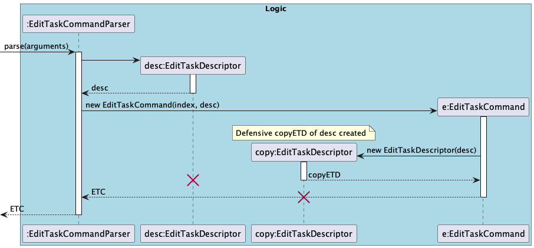
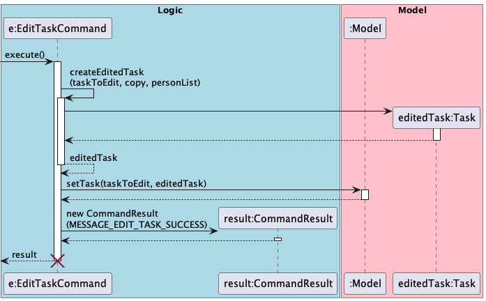
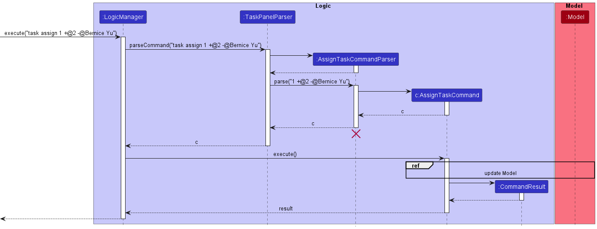
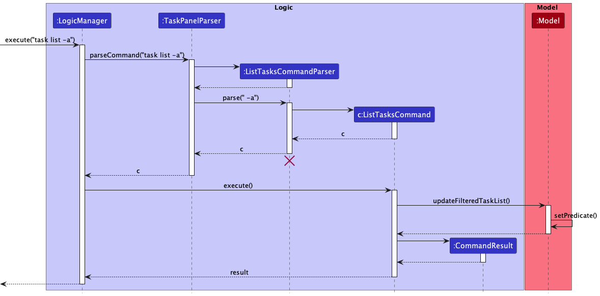

* Table of Contents
  {:toc}

--------------------------------------------------------------------------------------------------------------------

## **Acknowledgements**
* This project uses the [PrettyTime NLP library](https://www.ocpsoft.org/prettytime/nlp/) to enable simple parsing and computer understanding of natural language in terms of dates.

--------------------------------------------------------------------------------------------------------------------

## **Setting up, getting started**

Refer to the guide [_Setting up and getting started_](SettingUp.md).

--------------------------------------------------------------------------------------------------------------------

## **Design**

:bulb: **Tip:** The `.puml` files used to create diagrams in this document can be found in the [diagrams](https://github.com/AY2223S1-CS2103T-T08-2/tp/tree/master/docs/diagrams) folder. Refer to the [_PlantUML Tutorial_ at se-edu/guides](https://se-education.org/guides/tutorials/plantUml.html) to learn how to create and edit diagrams.

### Architecture

The ***Architecture Diagram*** given above explains the high-level design of the App.

Given below is a quick overview of main components and how they interact with each other.

**Main components of the architecture**

**`Main`** has two classes called [`Main`](https://github.com/AY2223S1-CS2103T-T08-2/tp/tree/master/src/main/java/seedu/address/Main.java) and [`MainApp`](https://github.com/AY2223S1-CS2103T-T08-2/tp/tree/master/src/main/java/seedu/address/MainApp.java). It is responsible for,
* At app launch: Initializes the components in the correct sequence, and connects them up with each other.
* At shut down: Shuts down the components and invokes cleanup methods where necessary.

[**`Commons`**](#common-classes) represents a collection of classes used by multiple other components.

The rest of the App consists of four components.

* [**`UI`**](#ui-component): The UI of the App.
* [**`Logic`**](#logic-component): The command executor.
* [**`Model`**](#model-component): Holds the data of the App in memory.
* [**`Storage`**](#storage-component): Reads data from, and writes data to, the hard disk.

**How the architecture components interact with each other**

The *Sequence Diagram* below shows how the components interact with each other for the scenario where the user issues the command `delete 1`.

Each of the four main components (also shown in the diagram above),

* defines its *API* in an `interface` with the same name as the Component.
* implements its functionality using a concrete `{Component Name}Manager` class (which follows the corresponding API `interface` mentioned in the previous point).

For example, the `Logic` component defines its API in the `Logic.java` interface and implements its functionality using the `LogicManager.java` class which follows the `Logic` interface. Other components interact with a given component through its interface rather than the concrete class (reason: to prevent outside component's being coupled to the implementation of a component), as illustrated in the (partial) class diagram below.

The sections below give more details of each component.

### UI component

The **API** of this component is specified in [`Ui.java`](https://github.com/AY2223S1-CS2103T-T08-2/tp/tree/master/src/main/java/seedu/address/ui/Ui.java)

The UI consists of a `MainWindow` that is made up of parts e.g.`CommandBox`, `ResultDisplay`, `PersonListPanel`, `StatusBarFooter` etc. All these, including the `MainWindow`, inherit from the abstract `UiPart` class which captures the commonalities between classes that represent parts of the visible GUI.

The `UI` component uses the JavaFx UI framework. The layout of these UI parts are defined in matching `.fxml` files that are in the `src/main/resources/view` folder. For example, the layout of the [`MainWindow`](https://github.com/AY2223S1-CS2103T-T08-2/tp/tree/master/src/main/java/seedu/address/ui/MainWindow.java) is specified in [`MainWindow.fxml`](https://github.com/AY2223S1-CS2103T-T08-2/tp/tree/master/src/main/resources/view/MainWindow.fxml)

The `UI` component,

* executes user commands using the `Logic` component.
* listens for changes to `Model` data so that the UI can be updated with the modified data.
* keeps a reference to the `Logic` component, because the `UI` relies on the `Logic` to execute commands.
* depends on some classes in the `Model` component, as it displays `Person` and `Task` objects residing in the `Model`.

### Logic component

**API** : [`Logic.java`](https://github.com/AY2223S1-CS2103T-T08-2/tp/tree/master/src/main/java/seedu/address/logic/Logic.java)

Here's a (partial) class diagram of the `Logic` component:

How the `Logic` component works:
1. When `Logic` is called upon to execute a command, it uses either the `AddressBookParser` class or the `TaskPanelParser` class to parse the user command.
2. This results in a `Command` object (more precisely, an object of one of its subclasses e.g., `AddCommand`, `AddTaskCommand`) which is executed by the `LogicManager`.
3. The command can communicate with the `Model` when it is executed (e.g. to add a person).
4. The result of the command execution is encapsulated as a `CommandResult` object which is returned from `Logic`.

The Sequence Diagram below illustrates the interactions within the `Logic` component for the `execute("task add New task")` API call.

:information_source: **Note:** The lifeline for `AddTaskCommandParser` should end at the destroy marker (X) but due to a limitation of PlantUML, the lifeline reaches the end of diagram.

The Sequence Diagram below illustrates the interactions within the `Logic` component for the `execute("delete 1")` API call.

:information_source: **Note:** The lifeline for `DeleteCommandParser` should end at the destroy marker (X) but due to a limitation of PlantUML, the lifeline reaches the end of diagram.

Here are the other classes in `Logic` (omitted from the class diagram above) that are used for parsing a user command:

How the parsing works:
* When called upon to parse a user command, the `LogicManager` class first checks if the command is a task related command or an address book command. If the command is task related (i.e. format of `task ...`), it calls the `TaskPanelParser` to parse the user command. Otherwise, the `AddressBookParser` will parse the user command.

Task commands:
* The `TaskPanelParser` class creates an `XYZTaskCommandParser` (`XYZ` is a placeholder for the specific command name e.g., `AddTaskCommandParser`) which uses the other classes shown above to parse the user command and create `XYZTaskCommand` object (e.g., `AddTaskCommand`) which the `TaskPanelParser` returns back as a `TaskCommand` object which is a `Command` object.
* All `XYZTaskCommandParser` classes (e.g., `AddTaskCommandParser`, `DeleteTaskCommanParser`, ...) inherit from the `Parser` interface so that they can be treated similarly where possible e.g., during testing.

AddressBook commands:
* The `AddressBookParser` class creates an `XYZCommandParser` (`XYZ` is a placeholder for the specific command name e.g., `AddCommandParser`) which uses the other classes shown above to parse the user command and create a `XYZCommand` object (e.g., `AddCommand`) which the `AddressBookParser` returns back as a `Command` object.
* All `XYZCommandParser` classes (e.g., `AddCommandParser`, `DeleteCommandParser`, ...) inherit from the `Parser` interface so that they can be treated similarly where possible e.g, during testing.

### Model component
**API** : [`Model.java`](https://github.com/AY2223S1-CS2103T-T08-2/tp/tree/master/src/main/java/seedu/address/model/Model.java)

The `Model` component,

* stores the address book data i.e., all `Person` objects (which are contained in a `UniquePersonList` object).
* stores the task panel data i.e., all `Task` objects (which are contained in a `UniqueTaskList` object).
* stores the currently 'selected' `Person` objects (e.g., results of a search query) as a separate _filtered_ list which is exposed to outsiders as an unmodifiable `ObservableList<Person>` that can be 'observed' e.g. the UI can be bound to this list so that the UI automatically updates when the data in the list change.
* stores the currently 'selected' `Task` objects (e.g., results of a search query) as a separate _filtered_ list which is exposed to outsiders as an unmodifiable `ObservableList<Task>` that can be 'observed' e.g. the UI can be bound to this list so that the UI automatically updates when the data in the list change.
* stores a `UserPref` object that represents the user’s preferences. This is exposed to the outside as a `ReadOnlyUserPref` objects.
* does not depend on any of the other three components (as the `Model` represents data entities of the domain, they should make sense on their own without depending on other components)

:information_source: **Note:** An alternative (arguably, a more OOP) model is given below. It has a `Tag` list in the `AddressBook`, which `Person` references. This allows `AddressBook` to only require one `Tag` object per unique tag, instead of each `Person` needing their own `Tag` objects. 

### Storage component

**API** : [`Storage.java`](https://github.com/AY2223S1-CS2103T-T08-2/tp/tree/master/src/main/java/seedu/address/storage/Storage.java)

The `Storage` component,
* can save task panel data, address book data and user preference data in json format, and read them back into corresponding objects.
* inherits from all of `TaskPanelStorage`, `AddressBookStorage` and `UserPrefStorage`, which means it can be treated as either one (if only the functionality of only one is needed).
* depends on some classes in the `Model` component (because the `Storage` component's job is to save/retrieve objects that belong to the `Model`)

### Common classes

Classes used by multiple components are in the `seedu.addressbook.commons` package.

--------------------------------------------------------------------------------------------------------------------

## **Implementation**

This section describes some noteworthy details on how certain features are implemented.

### Mark Feature

#### Current Implementation

The `mark` feature is implemented by acting on the current filtered`TaskPanel` with a one-based `Index` specified by the user, getting the target `Task` at the specified index, and marking it.

#### Example Usage of `task mark`

1. User launches Arrow and the `TaskPanel` is populated with existing `Task` entries.
2. User types in the command `task mark 1`, where `1` is the specified index given in one-based form.
3. The current state of the `TaskPanel` is obtained from `Model`.
4. The `Task` to be marked is fetched from the `TaskPanel` using the specified `Index`, using its zero-based form.
5. The `Task` is marked as completed.
6. The `GUI` is updated to show the new `TaskPanel` with the `Task` marked as complete.

### Unmark Feature

#### Current Implementation

The `unmark` feature is implemented by acting on the current filtered`TaskPanel` with a one-based `Index` specified by the user, getting the target `Task` at the specified index, and unmarking it.

#### Example Usage of `task unmark`

1. User launches Arrow and the `TaskPanel` is populated with existing `Task` entries.
2. User types in the command `task unmark 1`, where `1` is the specified index given in one-based form.
3. The current state of the `TaskPanel` is obtained from `Model`.
4. The `Task` to be unmarked is fetched from the `TaskPanel` using the specified `Index`, using its zero-based form.
5. The `Task` is marked as incompleted.
6. The `GUI` is updated to show the new `TaskPanel` with the `Task` marked as incomplete.

### Task Delete Feature

#### Current Implementation

The `task delete` feature is implemented by removing the `task` indicated by user using a one-based `Index` from the current current filtered `TaskPanel`.

#### Example Usage of `task delete`

1. User launches Arrow and the `TaskPanel` is filled with all the existing `Task` entries that has been added by user.
2. User types in the command `task delete 1`, where `1` is the specified index given in one-based form.
3. The current state of the `TaskPanel` is obtained from `Model`.
4. The `Task` to be deleted is then fetched from the `TaskPanel` using the specified `Index`, using its zero-based form.
5. The `Task` is deleted from the `Model`.
6. The `GUI` is updated to show the new `TaskPanel` with the `Task` deleted.

### Clear Feature

#### Current Implementation

The `clear` feature is implemented by acting on the current filtered`TaskPanel`, clearing all existing tasks in the task panel.

#### Example Usage of `task clear`

1. User launches Arrow and the `TaskPanel` is populated with existing `Task` entries.
2. User types in the command `task clear`.
3. The current state of the `TaskPanel` is obtained from `Model`.
4. The `TaskPanel` is resetted to be an empty one.
5. The `GUI` is updated to show the new `TaskPanel` with zero task.

### Task edit feature

#### Current Implementation

The task editing feature is primarily implemented within `EditTaskCommand` and the `EditTaskCommandParser` objects utilizing the help of `EditTaskDescriptor`.
The `EditTaskDescriptor` object contains the new value(s) of the data that needs to be edited.

#### Example usage of `task edit`

1. The user adds a `Task` to the `TaskPanel`.
2. The user types in the command `task edit 1 ti/TITLE`.
The `EditTaskCommand` is created together with the `EditTaskDescriptor` object as shown below.

3. The command return is executed. The copy of the `EditTaskDescriptor` object is used  during the `EditTaskCommand#createEditedTask` method, after which it is destroyed.
The edited copy of the task then replaces the current task in the task list.

4. Finally, the GUI is updated to reflect the changes made. In this case, it will show the task at index 1 with the new title.

#### `EditTaskDescriptor` implementation

`EditTaskDescriptor` is implemented as a public nested class within `EditTaskCommand`. The class contains the edited values which are provided by the user that can be manipulated.
`EditTaskDescriptor` has `get` and `set` methods:

- `setTitle()` / `getTitle()`
- `setProject()` / `getProject()`
- `setDeadline()` / `getDeadline()`
- `setAssignedContactIndexes(assignedContactIndexes)` / `getAssignedContactIndexes()`
- `setUnassignedContactsIndexes(unassignedContactIndexes)` / `getUnassignedContactsIndexes()`

where the `get` methods return `Optional<T>` objects containing the value to be edited, if any.

`EditTaskDescriptor` also has:
1. A constructor which accepts another `EditTaskDescriptor`, which creates a defensive copy of the original, which is only called in the constructor of `EditTaskCommand`.
2. A `isAnyFieldEdited` method is implemented to check whether the user input any values to be edited.

### Assign Person(s) to Task Feature

#### Current Implementation

The `task assign` feature assigns/unassigns contacts to the task specified by the user. The selection of tasks is implemented by acting on the current filtered `TaskPanel` with a one-based `Index` specified by the user, getting the target `Task` at the specified index. The selection of persons is implemented by acting on the current filtered `AddressBook` with one or more one-based `Index` specified by the user, getting the target `Person` at the specified index. The selection of person can also be done through specifying the full name of the person, which is matched with the target `Person` in the filtered `AddressBook`.

#### Example Usage of `task assign`

1. User launches Arrow. The `TaskPanel` and `AddressBook` is populated with existing `Task` and `Person` entries respectively.
2. User types in the command `task assign 1 +@2 -@Bernice Yu`. `1` is the specified index of `Task` in `TaskPanel` to be assigned to given in one-based form. `2` is the specified index of `Person` in the `AddressBook` to be assigned. "Bernice Yu" is the full name of the `Person` in the `AddressBook` to be unassigned.
3. The `LogicManager` detects that this is a `TaskCommand`, and therefore passes the user input to the `TaskPanelParser`
4. The `TaskPanelParser` detects the `AssignTaskCommand.COMMAND_WORD`, and therefore parses the command arguments via a `AssignTaskCommandParser`
5. The relevant parameters are used to create an instance of a `AssignTaskCommandd`, which is then returned to the `TaskPanelParser`
6. The `LogicManager` executes the command
7. The command obtains the current state of the `TaskPanel` and `AddressBook` from `Model`.
8. The `Task` to be modified is fetched from the `TaskPanel` using the specified `Index`, using its zero-based form.
9. The `Person`s to be assigned are fetched from the `AddressBook` using the specified `Index`, using its zero-based 
   form, or through matching his full name.
10. The `Person`s are assigned/unassigned to the `Task`.
11. The `GUI` is updated to show the new `TaskPanel` with the `Task`'s assigned contacts updated.

The AssignTaskCommandParser relies on the ArgumentMultimap abstraction, which helps to tokenize the user input by 
pre-specified prefixes. The prefix +@ denotes that the contact is to be assigned, while prefix `@ denotes that the 
contact is to be unassigned from the task's assigned contact list.

#### Design considerations:

The `Task` class composes of the `Contact` class. A `Contact` object is a reference to a `Person` in the `AddressBook`, 
and contains the name of the `Person`. We chose this implementation over composing `Task` and `Person` directly so 
that it will be easier to save the `Task`'s assigned contacts in the storage. Furthermore, this prevents duplicated 
copies of `Person` objects created when we restart the app and populate the `Task`s with their assigned contacts.

### List Tasks feature

#### Implementation

The list tasks feature filters the tasks in the task panel according to the user input. For example, users can choose to view only tasks containing a certain keyword, e.g. 'fix'.

Other filter parameters are also available, which can filter tasks by their completion status, due date and assigned contacts.

The following sequence diagram shows how the operation works:

As observed above, the execution flow for this command is quite straightforward.

1. The user enters a list tasks command
2. The `LogicManager` detects that this is a `TaskCommand`, and therefore passes the user input to the `TaskPanelParser`
2. The `TaskPanelParser` detects the `ListTaskCommand.COMMAND_WORD`, and therefore parses the command arguments via a `ListTaskCommandParser`
3. The relevant parameters are used to create an instance of a `ListTaskCommandd`, which is then returned to the `TaskPanelParser`
4. The `LogicManager` executes the command
5. The command generates the appropriate predicate based on its parameters, and filters the `Model`'s task list.

Most of the work is done in the parsing step by the `ListTaskCommandParser`, and the execution step to generate the right predicate.

The `ListTaskCommandParser` relies on the `ArgumentMultimap` abstraction, which helps to tokenize the user input by pre-specified prefixes. For example, the `before` prefix denotes that the user wishes to filter tasks that are before a certain deadline. Other prefixes include `-a` and `-c`, which function as flags to specify if all tasks should be shown (including completed ones), or to show completed or incomplete tasks only.

:information_source: **Note:** If both the `-a` and `-c` flags are specified, the `-c` flag takes precedence. This is because the `ListTasksCommand` combines multiple predicates with a logical `AND`. Therefore, the `-a` flag becomes redundant if another more specific flag is also included i.e. `-c`.

The `ListTaskCommandParser` also relies on the `PrettyTime NLP` open-source library to parse dates described in plain English. This is relevant for the `before` and `after` prefixes.

Lastly, upon execution, the `ListTaskCommand` builds a single predicate to be used to filter the `Model`'s task list. As mentioned above, multiple filters are combined with the logical `AND`. For example, `task list fix before tomorrow -c` shows all tasks that are completed, contain the keyowrd 'fix', **and** has a due date that is before tomorrow.

### \[Proposed\] Undo/redo feature

#### Proposed Implementation

The proposed undo/redo mechanism is facilitated by `VersionedAddressBook`. It extends `AddressBook` with an undo/redo history, stored internally as an `addressBookStateList` and `currentStatePointer`. Additionally, it implements the following operations:

* `VersionedAddressBook#commit()` — Saves the current address book state in its history.
* `VersionedAddressBook#undo()` — Restores the previous address book state from its history.
* `VersionedAddressBook#redo()` — Restores a previously undone address book state from its history.

These operations are exposed in the `Model` interface as `Model#commitAddressBook()`, `Model#undoAddressBook()` and `Model#redoAddressBook()` respectively.

Given below is an example usage scenario and how the undo/redo mechanism behaves at each step.

Step 1. The user launches the application for the first time. The `VersionedAddressBook` will be initialized with the initial address book state, and the `currentStatePointer` pointing to that single address book state.

Step 2. The user executes `delete 5` command to delete the 5th person in the address book. The `delete` command calls `Model#commitAddressBook()`, causing the modified state of the address book after the `delete 5` command executes to be saved in the `addressBookStateList`, and the `currentStatePointer` is shifted to the newly inserted address book state.

Step 3. The user executes `add n/David …​` to add a new person. The `add` command also calls `Model#commitAddressBook()`, causing another modified address book state to be saved into the `addressBookStateList`.

:information_source: **Note:** If a command fails its execution, it will not call `Model#commitAddressBook()`, so the address book state will not be saved into the `addressBookStateList`.

Step 4. The user now decides that adding the person was a mistake, and decides to undo that action by executing the `undo` command. The `undo` command will call `Model#undoAddressBook()`, which will shift the `currentStatePointer` once to the left, pointing it to the previous address book state, and restores the address book to that state.

:information_source: **Note:** If the `currentStatePointer` is at index 0, pointing to the initial AddressBook state, then there are no previous AddressBook states to restore. The `undo` command uses `Model#canUndoAddressBook()` to check if this is the case. If so, it will return an error to the user rather
than attempting to perform the undo.

The following sequence diagram shows how the undo operation works:

:information_source: **Note:** The lifeline for `UndoCommand` should end at the destroy marker (X) but due to a limitation of PlantUML, the lifeline reaches the end of diagram.

The `redo` command does the opposite — it calls `Model#redoAddressBook()`, which shifts the `currentStatePointer` once to the right, pointing to the previously undone state, and restores the address book to that state.

:information_source: **Note:** If the `currentStatePointer` is at index `addressBookStateList.size() - 1`, pointing to the latest address book state, then there are no undone AddressBook states to restore. The `redo` command uses `Model#canRedoAddressBook()` to check if this is the case. If so, it will return an error to the user rather than attempting to perform the redo.

Step 5. The user then decides to execute the command `list`. Commands that do not modify the address book, such as `list`, will usually not call `Model#commitAddressBook()`, `Model#undoAddressBook()` or `Model#redoAddressBook()`. Thus, the `addressBookStateList` remains unchanged.

Step 6. The user executes `clear`, which calls `Model#commitAddressBook()`. Since the `currentStatePointer` is not pointing at the end of the `addressBookStateList`, all address book states after the `currentStatePointer` will be purged. Reason: It no longer makes sense to redo the `add n/David …​` command. This is the behavior that most modern desktop applications follow.

The following activity diagram summarizes what happens when a user executes a new command:

#### Design considerations:

**Aspect: How undo & redo executes:**

* **Alternative 1 (current choice):** Saves the entire address book.
    * Pros: Easy to implement.
    * Cons: May have performance issues in terms of memory usage.

* **Alternative 2:** Individual command knows how to undo/redo by
  itself.
    * Pros: Will use less memory (e.g. for `delete`, just save the person being deleted).
    * Cons: We must ensure that the implementation of each individual command are correct.

_{more aspects and alternatives to be added}_

### \[Proposed\] Data archiving

_{Explain here how the data archiving feature will be implemented}_

--------------------------------------------------------------------------------------------------------------------

## **Documentation, logging, testing, configuration, dev-ops**

* [Documentation guide](Documentation.md)
* [Testing guide](Testing.md)
* [Logging guide](Logging.md)
* [Configuration guide](Configuration.md)
* [DevOps guide](DevOps.md)

--------------------------------------------------------------------------------------------------------------------

## **Appendix: Requirements**

### Product scope

**Target user profile**:

* has a need to manage a significant number of contacts
* has a need to manage tasks of members
* prefer desktop apps over other types
* can type fast
* prefers typing to mouse interactions
* is reasonably comfortable using CLI apps

**Value proposition**: This app will help users easily manage multiple projects from one place. By associating tasks to specific team members, users can keep track of what needs to be done and by who, and quickly reach out to the relevant members if needed.

### User stories

Priorities: High (must have) - `* * *`, Medium (nice to have) - `* *`, Low (unlikely to have) - `*`

| s/n | Priority | User Story                                                                                                                                                                       |
|-----|----------|----------------------------------------------------------------------------------------------------------------------------------------------------------------------------------|
| 1   | ***      | As a user, I can add a task.                                                                                                                                                     |
| 2   | ***      | As a user, I can add a contact.                                                                                                                                                  |
| 3   | ***      | As a user, I can assign a task to a specific contact, so that I can keep track of which tasks he/she is responsible for.                                                         |
| 4   | ***      | As a user, I can view all tasks.                                                                                                                                                 |
| 5   | ***      | As a user, I can view the tasks associated with a specific contact, so that I can easily see which tasks he/she has yet to complete.                                             |
| 6   | ***      | As a user, I can delete a task, so that I can remove unwanted tasks, or tasks that were entered incorrectly.                                                                     |
| 7   | ***      | As a user, I can mark a task as complete or incomplete, so that I can monitor and upgrade his/her progress.                                                                      |
| 8   | ***      | As a user, I can delete a contact, so that I can keep my contacts list up to date.                                                                                               |
| 9   | **       | As a user, I can search for a contact name, so that I can easily find his details.                                                                                               |
| 10  | **       | As a user, I can easily copy a contact's email, so that I can quickly paste it when I have to contact the team member.                                                           |
| 11  | **       | As a user, I can modify a task’s associated contact, so that I can reassign certain tasks to other team members.                                                                 |
| 12  | **       | As a user, I can edit a contact, so that I can keep my contact list updated with the latest changes.                                                                             |
| 13  | **       | As a user, I can associate a task with a date, so that I can record down the deadline I have set for a task.                                                                     |
| 14  | **       | As a user, I can view all tasks sorted by date, so that I can identify which tasks are the most urgent.                                                                          |
| 15  | **       | As a user, I can filter tasks by whether or not they have been completed, so that I can identify incomplete tasks.                                                               |
| 16  | **       | As a user, I can edit the details of a task, so that I can update the deadline or the deliverables.                                                                              |
| 17  | **       | As a user, I can create a task without assigning it to any contact, so that I can always choose to assign it later when I have more details of the task or project.              |
| 18  | **       | As a user, I can filter tasks by whether or not it has been assigned to a contact, so that I can identify the tasks I have to assign later on.                                   |
| 19  | *        | As a user, I can associate a task with multiple contacts, so that I can assign a task with a higher workload to more than one person to work on it.                              |
| 20  | *        | As a user, I can associate a task with a project (which are collections of tasks), so that I can group related tasks together and separate them by the many projects I may have. |
| 21  | *        | As a user, I can tag tasks to milestones/versions, so that I can ensure each version is ready by the delivery date.                                                              |
| 22  | *        | As a user, I can associate a contact with a project, so that I can assign a task to only contacts with the specific project.                                                     |
| 23  | *        | As a user, I can tag my contact's roles and positions, so that I can easily plan what kind of work to assign to him.                                                             |
| 24  | *        | As a user, I can choose to view only the tasks associated with a project, so that I can focus myself on that specific project.                                                   |
| 25  | *        | As a user, I can check if each member has finished their certain amount of tasks, so that I can monitor the progress of the team project.                                        |
| 26  | *        | As a user, I can check the date and time for projects or tasks, so that I can plan out the work needed to be done.                                                               |
| 27  | *        | As a user, I can set priority for the tasks, so that I can find out which are the most important.                                                                                |

### Use cases

(For all use cases below, the **System** is the `Arrow` and the **Actor** is the `user`, unless specified otherwise)

**Use case: UC01 - Add a person**

**MSS**

1. User requests to add person and provides name, number and email address.
2. Arrow adds person to list of persons.

   Use case ends.

**Extensions**

* 1a. There is no name provided.

    * 1a1. Arrow shows an error message.

  Use case resumes at step 1.

**Use case: UC02 - List all persons**

**MSS**

1. User requests to list all persons.
2. Arrow shows a list of all persons.

   Use case ends.

**Extensions**

* 2a. The list is empty.

   Use case ends.

**Use case: UC03 - Delete a person**

**MSS**

1.  User requests to list persons.
2.  Arrow shows a list of persons.
3.  User requests to delete a specific person in the list.
4.  Arrow deletes the person.

    Use case ends.

**Extensions**

* 2a. The list is empty.

  Use case ends.

* 3a. The given index is invalid.

    * 3a1. Arrow shows an error message.

      Use case resumes at step 2.

**Use case: UC04 - Edit a person**

**MSS**

1.  User requests to list persons.
2.  Arrow shows a list of persons.
3.  User requests to edit a specific person in the list and provides new information.
4.  Arrow updates the person.

    Use case ends.

**Extensions**

* 2a. The list is empty.

  Use case ends.

* 3a. The given index is invalid.

    * 3a1. Arrow shows an error message.

      Use case resumes at step 2.

* 3b. There is no new information provided.

    * 3b1. Arrow shows an error message.

      Use case resumes at step 2.

**Use case: UC05 - Add a task**

**MSS**

1.  User requests to add task and provides task name, deadline, assigned contacts and project.
2.  Arrow adds the task to the list of tasks.

    Use case ends.

**Extensions**

* 1b. There is no task name or deadline provided.

    * 1b1. Arrow shows an error message.

  Use case resumes at step 1.

**Use case: UC06 - Delete a task**

**MSS**

1.  User requests to list tasks.
2.  Arrow shows a list of tasks.
3.  User requests to delete a specific task in the tasks list.
4.  Arrow deletes the task.

    Use case ends.

**Extensions**

* 1a. The tasks list is empty.

  Use case ends.

* 3a. The given task index is invalid.

    * 3a1. Arrow shows an error message.

      Use case resumes at step 2.

**Use case: UC07 - Edit a task**

**MSS**

1.  User requests to list tasks.
2.  Arrow shows a list of tasks.
3.  User requests to edit a specific task in the list and provides new information.
4.  Arrow updates the task.

    Use case ends.

**Extensions**

* 1a. The tasks list is empty.

  Use case ends.

* 3a. The given task index is invalid.

    * 3a1. Arrow shows an error message.

      Use case resumes at step 2.

**Use case: UC08 - Mark a task as complete**

**MSS**

1.  User requests to mark a task to be complete.
2.  Arrow shows the task to be complete.

    Use case ends.

**Extensions**

* 1a. The given task index is invalid.

    * 1a1. Arrow shows an error message.

      Use case resumes at step 2.

* 2a. The tasks list is empty.

  Use case ends.

**Use case: UC09 - Mark a task as incomplete**

**MSS**

1.  User requests to mark a task to be incomplete.
2.  Arrow shows the task to be incomplete.

    Use case ends.

**Extensions**

* 1a. The given task index is invalid.

    * 1a1. Arrow shows an error message.

      Use case resumes at step 2.

* 2a. The tasks list is empty.

  Use case ends.

**Use case: UC10 - List tasks**

**MSS**

1.  User requests to list all tasks.
2.  Arrow shows a list of all tasks.

    Use case ends.

**Extensions**

* 1a. The task list is empty.

  Use case ends.

**Use case: UC11 - Find a person by name**

**MSS**

1. User requests to find a person and provides keyword(s) to search for.
2. Arrow shows a list of all persons with names containing keyword.

   Use case ends.

**Extensions**

* 2a. The list is empty.

   Use case ends.

**Use case: UC12 - Assign persons to a task**

**MSS**

1.  User requests to list persons.
2.  Arrow shows a list of persons.
3.  User requests to list tasks.
4.  Arrow shows a list of tasks.
5.  User requests to assign/unassign persons in the persons list to a specific task in the tasks list.
6.  Arrow assigns/unassigns the persons to the task.

    Use case ends.

**Extensions**

* 1a. The persons list is empty.

  Use case ends.

* 3a. The tasks list is empty.

  Use case ends.

* 5a. The given task and/or person index is invalid.

    * 5a1. Arrow shows an error message.

      Use case resumes at step 4.

* 5b. The given person name is invalid.

    * 5b1. Arrow shows an error message.

      Use case resumes at step 4.

*Use case: UC13 - List Project**

**MSS**

1.  User requests to list all projects.
2.  Arrow shows a list of all project.

    Use case ends.

**Extensions**

* 1a. No projects available.

  Use case ends.

**Use case: UC14 - Clear the task panel**

**MSS**

1.  User requests to clear task panel.
2.  Arrow shows a new empty task panel.

    Use case ends.

*{More to be added}*

### Non-Functional Requirements

1.  Should work on any _mainstream OS_ as long as it has Java `11` or above installed.
2.  Should be able to hold up to 1000 persons without a noticeable sluggishness in performance for typical usage.
3.  Should be able to hold up to 500 tasks without a noticeable sluggishness in performance for typical usage.
4.  A user with above average typing speed for regular English text (i.e. not code, not system admin commands) should be able to accomplish most of the tasks faster using commands than using the mouse.
5.  Any changes to the data should be saved permanently and automatically.

### Glossary

* **Mainstream OS**: Windows, Linux, Unix, OS-X
* **Private contact detail**: A contact detail that is not meant to be shared with others
* **Issue**: Issue on GitHub to track your work on a project
* **Repository**: A repository (GitHub) contains all of your project's files
* **Mainstream OS**: Windows, Linux, Unix, OS-X
* **Task**: An item or activity that needs to be completed and contributes towards the progress of the project
* **User**: Person in charge of a software engineering project
* **Private contact detail**: A contact detail that is not meant to be shared with others

--------------------------------------------------------------------------------------------------------------------

## **Appendix: Instructions for manual testing**

Given below are instructions to test the app manually.

:information_source: **Note:** These instructions only provide a starting point for testers to work on;
testers are expected to do more *exploratory* testing.

### Launch and shutdown

1. Initial launch

    1. Download the jar file and copy into an empty folder

    1. Double-click the jar file Expected: Shows the GUI with a set of sample contacts. The window size may not be optimum.

1. Saving window preferences

    1. Resize the window to an optimum size. Move the window to a different location. Close the window.

    1. Re-launch the app by double-clicking the jar file. 
       Expected: The most recent window size and location is retained.

1. _{ more test cases …​ }_

### Deleting a person

1. Deleting a person while all persons are being shown

    1. Prerequisites: List all persons using the `list` command. Multiple persons in the list.

    1. Test case: `delete 1` 
       Expected: First contact is deleted from the list. Details of the deleted contact shown in the status message. Timestamp in the status bar is updated.

    1. Test case: `delete 0` 
       Expected: No person is deleted. Error details shown in the status message. Status bar remains the same.

    1. Other incorrect delete commands to try: `delete`, `delete x`, `...` (where x is larger than the list size) 
       Expected: Similar to previous.

1. _{ more test cases …​ }_

### Saving data

1. Dealing with missing/corrupted data files

    1. _{explain how to simulate a missing/corrupted file, and the expected behavior}_

1. _{ more test cases …​ }_
