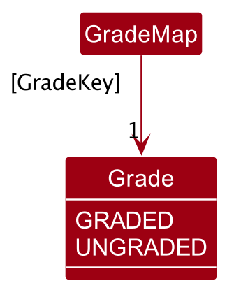
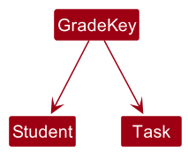
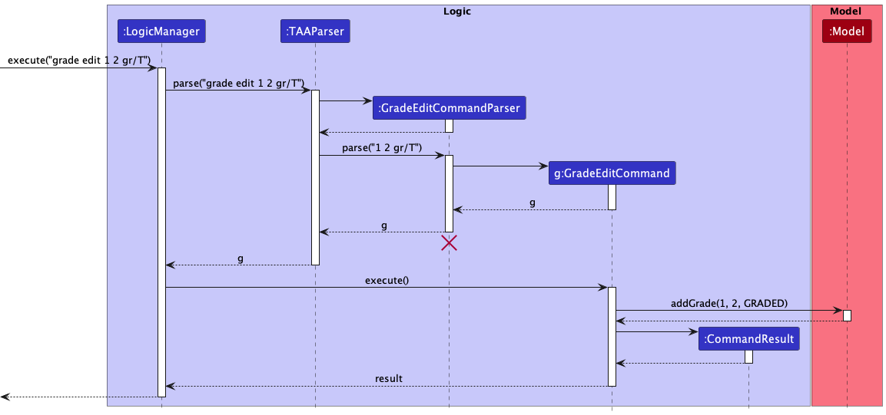

* Table of Contents
{:toc}

---

## **Acknowledgements**

- {list here sources of all reused/adapted ideas, code, documentation, and third-party libraries -- include links to the original source as well}

---

## **Setting up, getting started**

Refer to the guide [_Setting up and getting started_](SettingUp.md).

---

## **Design**

:bulb: **Tip:** The `.puml` files used to create diagrams in this document can be found in the [diagrams](https://github.com/AY2223S1-CS2103T-T13-1/tp/tree/master/docs/diagrams/) folder. Refer to the [_PlantUML Tutorial_ at se-edu/guides](https://se-education.org/guides/tutorials/plantUml.html) to learn how to create and edit diagrams.

### Architecture

The **_Architecture Diagram_** given above explains the high-level design of the App.

Given below is a quick overview of main components and how they interact with each other.

**Main components of the architecture**

**`Main`** has two classes called [`Main`](https://github.com/AY2223S1-CS2103T-T13-1/tp/blob/master/src/main/java/seedu/address/Main.java) and [`MainApp`](https://github.com/AY2223S1-CS2103T-T13-1/tp/blob/master/src/main/java/seedu/address/MainApp.java). It is responsible for,

- At app launch: Initializes the components in the correct sequence, and connects them up with each other.
- At shut down: Shuts down the components and invokes cleanup methods where necessary.

[**`Commons`**](#common-classes) represents a collection of classes used by multiple other components.

The rest of the App consists of four components.

- [**`UI`**](#ui-component): The UI of the App.
- [**`Logic`**](#logic-component): The command executor.
- [**`Model`**](#model-component): Holds the data of the App in memory.
- [**`Storage`**](#storage-component): Reads data from, and writes data to, the hard disk.

**How the architecture components interact with each other**

The _Sequence Diagram_ below shows how the components interact with each other for the scenario where the user issues the command `delete 1`.

Each of the four main components (also shown in the diagram above),

- defines its _API_ in an `interface` with the same name as the Component.
- implements its functionality using a concrete `{Component Name}Manager` class (which follows the corresponding API `interface` mentioned in the previous point.

For example, the `Logic` component defines its API in the `Logic.java` interface and implements its functionality using the `LogicManager.java` class which follows the `Logic` interface. Other components interact with a given component through its interface rather than the concrete class (reason: to prevent outside component's being coupled to the implementation of a component), as illustrated in the (partial) class diagram below.

The sections below give more details of each component.

### UI component

The **API** of this component is specified in [`Ui.java`](hhttps://github.com/AY2223S1-CS2103T-T13-1/tp/blob/master/src/main/java/seedu/address/ui/Ui.java)

The UI consists of a `MainWindow` that is made up of parts such as `CommandOutput`, `CommandInput`, `StudentListPanel`, and `TaskListPanel`. All these, including the `MainWindow`, inherit from the abstract `UiPart` class which captures the commonalities between classes that represent parts of the visible GUI.

The `UI` component uses the JavaFx UI framework. The layout of these UI parts are defined in matching `.fxml` files that are in the `src/main/resources/view` folder.

The `UI` component,

- executes user commands using the `Logic` component.
- listens for changes to `Model` data so that the UI can be updated with the modified data.
- keeps a reference to the `Logic` component, because the `UI` relies on the `Logic` to execute commands.
- depends on some classes in the `Model` component, as it displays `Student` objects and `Task` objects residing in the `Model`.

### Logic component

**API** : [`Logic.java`](https://github.com/AY2223S1-CS2103T-T13-1/tp/blob/master/src/main/java/seedu/address/logic/Logic.java)

Here's a (partial) class diagram of the `Logic` component:

How the `Logic` component works:

1. When `Logic` is called upon to execute a command, it uses the `AddressBookParser` class to parse the user command.
2. This results in a `Command` object which is executed by the `LogicManager`.
   * If the command takes in no arguments, the `Command` is directly created.
   * If the command takes in arguments, a parser is created to create the `Command`.
3. The command can communicate with the `Model` when it is executed (e.g. to add a student).
4. The result of the command execution is encapsulated as a `CommandResult` object which is returned back from `Logic`.

The Sequence Diagram below illustrates the interactions within the `Logic` component for the `execute("delete 1")` API call.

:information_source: **Note:** The lifeline for `DeleteCommandParser` should end at the destroy marker (X) but due to a limitation of PlantUML, the lifeline reaches the end of diagram.

Here are the other classes in `Logic` (omitted from the class diagram above) that are used for parsing a user command:

How the parsing works:
- Let `ABC` represent the name of a command that takes in at least one argument. Examples of `ABC` include `TaskDelete` and `TutorialGroupAdd`. 
- When called upon to parse a user command, the `AddressBookParser` class creates an `ABCCommandParser` that uses the other classes shown above to parse the user command to create an `ABCCommand` object (e.g., `TaskDeleteCommand`) which the `AddressBookParser` returns back as a `Command` object.
- All `ABCCommandParser` classes inherit from the `Parser` interface so that they can be treated similarly where possible e.g, during testing.

### Model component

**API** : [`Model.java`](https://github.com/AY2223S1-CS2103T-T13-1/tp/blob/master/src/main/java/seedu/address/model/Model.java)

The `Model` component,

- stores the address book data i.e., all `Student` objects (which are contained in a `UniqueStudentList` object).
- stores the currently 'selected' `Student` objects (e.g., results of a search query) as a separate _filtered_ list which is exposed to outsiders as an unmodifiable `ObservableList<Student>` that can be 'observed' e.g. the UI can be bound to this list so that the UI automatically updates when the data in the list change.
   - The same configuration applies to `Task` and `TutorialGroup` objects.
- stores the `GradeMap` which maps a unique `GradeKey` (composed of a `Student` and `Task` object) to a `Grade` object
- stores a `UserPref` object that represents the user’s preferences. This is exposed to the outside as a `ReadOnlyUserPref` objects.
- does not depend on any of the other three components (as the `Model` represents data entities of the domain, they should make sense on their own without depending on other components)

### Storage component

**API** : [`Storage.java`](https://github.com/AY2223S1-CS2103T-T13-1/tp/blob/master/src/main/java/seedu/address/storage/Storage.java)

The `Storage` component,

- can save both address book data and user preference data in json format, and read them back into corresponding objects.
- inherits from both `AddressBookStorage` and `UserPrefStorage`, which means it can be treated as either one (if only the functionality of only one is needed).
- depends on some classes in the `Model` component (because the `Storage` component's job is to save/retrieve objects that belong to the `Model`)

### Common classes

Classes used by multiple components are in the `seedu.addressbook.commons` package.

---

## **Implementation**

This section describes some noteworthy details on how certain features are implemented.

### Sort task by deadline feature

#### Implementation

The sort task by deadline mechanism will be implemented without the need to enter additional commands.

Additionally, its feature is exposed in the `List` interface by calling its `sort` method.

Given below is an example usage scenario of adding a new task and how the task sorted by deadline mechanism behaves.

Step 1. The user launches the application and enters the respective `taskAdd` command.

Step 2. If the command is successful, a `task` object is created and will eventually be passed to `UniqueTaskList`.

Step 3. `UniqueTaskList` will add the `Task` object to an object of type `ObservableList<Task>`

Step 4. `UniqueTaskList` will then call its own method `sortByDeadline`

Step 5. `sortByDeadline` will call the `sort` method of the same object of type `ObservableList<Task>` from Step 5.

Step 6. The `sort` method takes in an object of type Comparator which compares two different `Task` objects' based on its deadline variable.

Step 7. The `sort` method then iterate the object of type `ObservableList<Task>` and arrange them according to their deadline in ascending order.

#### Design considerations:

**Aspect: How sorting task by deadline executes:**

- **Alternative 1 (current choice):** sort tasks by default.

    - Pros: Easy to implement.
    - Cons: Might not be ideal if users do not want it to be sorted.

- **Alternative 2:** Individual command to sort tasks.
    - Pros: User has a choice whether they want their list to be sorted.
    - Cons: More classes to implement e.g. taskSortCommand.java and taskSortCommandParser.java.

### Tutorial group feature

#### Implementation

The tutorial group feature is facilitated by `TutorialGroup`. It implements the following operations:

- `TutorialGroup#TutorialGroup(String)` — Create a tutorial group with the name provided. The name must follow a format of "TXX".
- `TutorialGroup#isSameTutorialGroup()` — Check whether the two tutorial groups have the same name.
- `TutorialGroup#getStudents()` — Gets a list of students belong to this tutorial group.

Given below is an example usage scenario and how the undo/redo mechanism behaves at each step.

Step 1. The user launches the application for the first time.

Step 2. The user executes `tutorialList` command to display all the tutorial groups.

Step 3. The user executes `tutorialAdd g/T03` command to add a new tutorial group.

Step 4. The user executes `studentEdit 1 g/T03` command to assign the first student to the newly created tutorial group.

### Task feature

#### Description

The task features is an extension on AB3 to add a list of tasks to the `Model` that we then use to track different
tasks that the user has to complete.

#### Implementation

The task feature is facilitated by `Task`. It implements the following operations:
* Adding Tasks using a Name, Description, Deadline and assigned students (Optional)
* Deleting Tasks using the Task's index
* Editing Tasks using the Task's index
* Marking Tasks as done using the Task's index (In Progress)
* Viewing Tasks

#### Design Considerations

The implementation is quite similar to what was done for the base AB3, as well as
the tutorial group and student feature. However, there were a few differences in the
implementation that we had to take note of.

The main issue comes with the ability to edit tasks. In `TutorialGroup` and `Student`,
the implementation of the edit command was quite simple, which was to have a class to store all the changes
and merge them with the states in the `Model`. However, in `Task`, the implementation was a bit more complex,
as we had to take into account the students assigned to the task. We couldn't create new Students and then edit
the task, since the students would be new and not in the `Model` yet. Thus, we had to use a different method,
instead opting to defer the creation of the new `Task` to the `Model` itself. This was done by rewriting the
code to parse in all the fields of `Task` and leaving student as a list of Strings, which we then use to search through
the `Model` to find the students that are assigned to the task.

### Mass Actions feature

#### Description
The idea behind Mass Actions is to be able to chain together multiple commands without having to type them out one
by one. This is useful for when the user wants to perform the same action on multiple students or tutorial groups.

#### Implementation
The mass actions feature requires a rework of the parsers, particularly StudentDeleteCommandParser
and TaskDeleteCommandParser. Instead of parsing a single index, the parsers will parse a range of indices,
then loop through each index, getting the task before deleting it.

#### Design Considerations
The implementation is different from the original AB3 implementation, as there were some special considerations
to keep in mind. The key issue was that we had to do two separate loops, one for getting the list of tasks/students
to delete, before then proceeding to delete them. This is because if we attempt to do it in a single loop, we
encounter an error where the list of tasks/students is modified while we are iterating through it.

#### Alternative Considerations
Another way of doing this instead of completely reworking the commands would be to overload the constructor,
however, it seemingly would not be as clean as the current implementation, as the current implementation is able
to handle one or more indices, while the alternative implementation would be doing double work to cover the case with
one index.

### Expanding `TaskListCard` Feature

#### Description

In TAA, the user can specify which `Student`s a `Task` has to be completed for. In the UI, each `Task` is displayed as a `TaskListCard`. The `TaskListCard` can be clicked to show or hide the `Student`s.

#### Implementation

Every `TaskListCard` contains:
* a `VBox optionalInfo` UI component which displays the students' names to the user,
* a `boolean isExpanded` attribute to determine whether to show the `optionalInfo`, and
* a `void onCardClicked()` method to toggle `isExpanded`.

#### Design Considerations

If a `Task` has no `Student`s,
* clicking on its `TaskListCard` does nothing, and
* `"No students are assigned to this task."` is displayed to the user.

#### Alternative Designs Considered

1. **Always show the students for all tasks.** This is rejected because tutorial groups contain many students. This allows very few tasks to be displayed on the UI at one time. This prevents the user from having an at-a-glance view of their tasks.
2. **Display the students for a task in a pop-up dialog box.** This is rejected because we wish to minimise the number of mouse clicks needed to switch from viewing the students under Task 1 to viewing the students under Task 2.
    * In the current design, the user only needs to click once on Task 2 to collapse Task 1 and expand Task 2.
    * This alternative design requires the user to click on the **Close** button on Task 1's dialog box, and then click again on Task 2.

### Grade feature

#### Description

In TAA, the user can specify whether they have graded a `Student`'s `Task` or not.

#### Implementation

##### Model

The model component contains a `GradeMap`, which maps a `GradeKey` object to a `Grade` enum.

:information_source: **Note:** The association between `GradeKey` and `Key` is a *qualified association*: any given `GradeKey` object will be associated with at least and at most one `Grade`, but due to a limitation of PlantUML, the correct UML notation for a qualified association has not been displayed.

 

Since a `Grade` object is associated with a `Student` and `Task` pair, `GradeKey` consists of a `Student` field and a `Task` field.

##### Commands

###### Viewing the grade with `grade view`

The sequence diagram below illustrates the interactions within the `Logic` component for the `execute("grade view 1 2")` API call, where `1` is the student index and `2` is the task index.

:information_source: **Note:** The lifeline for `GradeViewCommand` should end at the destroy marker (X) but due to a limitation of PlantUML, the lifeline reaches
the end of diagram.

###### Editing the grade with `grade edit`

The sequence diagram below illustrates the interactions within the `Logic` component for the `execute("grade view 1 2 gr/T")` API call, where `1` is the student index and `2` is the task index.

:information_source: **Note:** The lifeline for `GradeEditCommand` should end at the destroy marker (X) but due to a limitation of PlantUML, the lifeline reaches
the end of diagram.

#### Design Considerations

**Aspect: Representation of a grade**

- **Alternative 1 (current choice):** `Grade` is an enum.

  - Pros: 
      - Easier and faster to implement than making `Grade` a full-fledged class.
      - `Grade`s are a group of constants, so making `Grade` an enum is natural.
      - While for now only two grades are supported ("graded" and "ungraded"), in the future, more grades can easily be added in the enum.
  - Cons: 
      - In the future, if operations are to be done on `Grade`, then it is better to switch to implement as a class rather than an enum.
     

- **Alternative 2:** `Grade` is a boolean.

  - Pros: 
      - Easier and faster to implement than making `Grade` an enum.
      - Uses less memory since a boolean is a primitive type which can be either `true` or `false`.
  - Cons: 
      - More grades cannot be added easily in the future. A switch to an enum or a class must be made in that case.

- **Alternative 3:** `Grade` is a class

   - Pros:
      - Extremely customisable. Any `String` can be encapsulated inside a `Grade` class.
      - Instance methods can prove to be useful and make codebase more cohesive by grouping `Grade` related methods into the `Grade` class.
   - Cons:
      - Harder to test 
      - Most memory-intensive
      - Slowest to implement

In the interest of future extensibility and fast implementation, `Grade` was made an enum.

**Aspect: Choice of collection for `GradeMap`**

- **Alternative 1 (current choice):** Use a `HashMap`.

  - Pros: O(1) lookups in `HashMap`
  - Cons: 
      - Provides only methods for lookup and removal of entries.
      - A `HashMap` does not maintain order of the entries.

- **Alternative 2:** Use a `TreeMap`.
  
  - Pros: `TreeMap` provides methods like `lowerKey()` and `higherKey()` that can be used to answer queries that are more complicated than lookups. 
  - Cons: Slower, `O(log n)` lookups

- **Alternative 3:** Use an `ArrayList`.

   - Pros: 
      - Can support a wider variety of queries than a `TreeMap`
      - Has a corresponding `FilteredList` that can be used to highlight results of a query in a way that is faster to implement.
   - Cons: 
      - Very slow, `O(n)` lookup. This can be especially problematic when there are a large number of `Student`s and `Task`s.
      - Cumbersome implementation.

The `HashMap` Java Collection was chosen because of faster lookups, since in the current iteration of TAA, the `GradeMap` is only used to add and retrieve grades. However, in the future, `GradeMap` can be changed easily to use a `TreeMap` instead. A `TreeMap` implementation would prove useful if more than 2 grades are added and a filter feature is desired, for example, get a list of `Student`s who scored more than a `B` in a particular `Task`. `ArrayList` was rejected because it is cumbersome to implement and is not as performant.

### \[Proposed\] Undo/redo feature

#### Proposed Implementation

The proposed undo/redo mechanism is facilitated by `VersionedAddressBook`. It extends `AddressBook` with an undo/redo history, stored internally as an `addressBookStateList` and `currentStatePointer`. Additionally, it implements the following operations:

- `VersionedAddressBook#commit()` — Saves the current address book state in its history.
- `VersionedAddressBook#undo()` — Restores the previous address book state from its history.
- `VersionedAddressBook#redo()` — Restores a previously undone address book state from its history.

These operations are exposed in the `Model` interface as `Model#commitAddressBook()`, `Model#undoAddressBook()` and `Model#redoAddressBook()` respectively.

Given below is an example usage scenario and how the undo/redo mechanism behaves at each step.

Step 1. The user launches the application for the first time. The `VersionedAddressBook` will be initialized with the initial address book state, and the `currentStatePointer` pointing to that single address book state.

Step 2. The user executes `delete 5` command to delete the 5th student in the address book. The `delete` command calls `Model#commitAddressBook()`, causing the modified state of the address book after the `delete 5` command executes to be saved in the `addressBookStateList`, and the `currentStatePointer` is shifted to the newly inserted address book state.

Step 3. The user executes `add n/David …​` to add a new student. The `add` command also calls `Model#commitAddressBook()`, causing another modified address book state to be saved into the `addressBookStateList`.

:information_source: **Note:** If a command fails its execution, it will not call `Model#commitAddressBook()`, so the address book state will not be saved into the `addressBookStateList`.

Step 4. The user now decides that adding the student was a mistake, and decides to undo that action by executing the `undo` command. The `undo` command will call `Model#undoAddressBook()`, which will shift the `currentStatePointer` once to the left, pointing it to the previous address book state, and restores the address book to that state.

:information_source: **Note:** If the `currentStatePointer` is at index 0, pointing to the initial AddressBook state, then there are no previous AddressBook states to restore. The `undo` command uses `Model#canUndoAddressBook()` to check if this is the case. If so, it will return an error to the user rather
than attempting to perform the undo.

The following sequence diagram shows how the undo operation works:

:information_source: **Note:** The lifeline for `UndoCommand` should end at the destroy marker (X) but due to a limitation of PlantUML, the lifeline reaches the end of diagram.

The `redo` command does the opposite — it calls `Model#redoAddressBook()`, which shifts the `currentStatePointer` once to the right, pointing to the previously undone state, and restores the address book to that state.

:information_source: **Note:** If the `currentStatePointer` is at index `addressBookStateList.size() - 1`, pointing to the latest address book state, then there are no undone AddressBook states to restore. The `redo` command uses `Model#canRedoAddressBook()` to check if this is the case. If so, it will return an error to the user rather than attempting to perform the redo.

Step 5. The user then decides to execute the command `list`. Commands that do not modify the address book, such as `list`, will usually not call `Model#commitAddressBook()`, `Model#undoAddressBook()` or `Model#redoAddressBook()`. Thus, the `addressBookStateList` remains unchanged.

Step 6. The user executes `clear`, which calls `Model#commitAddressBook()`. Since the `currentStatePointer` is not pointing at the end of the `addressBookStateList`, all address book states after the `currentStatePointer` will be purged. Reason: It no longer makes sense to redo the `add n/David …​` command. This is the behavior that most modern desktop applications follow.

The following activity diagram summarizes what happens when a user executes a new command:

#### Design considerations:

**Aspect: How undo & redo executes:**

- **Alternative 1 (current choice):** Saves the entire address book.

  - Pros: Easy to implement.
  - Cons: May have performance issues in terms of memory usage.

- **Alternative 2:** Individual command knows how to undo/redo by
  itself.
  - Pros: Will use less memory (e.g. for `delete`, just save the student being deleted).
  - Cons: We must ensure that the implementation of each individual command are correct.

_{more aspects and alternatives to be added}_

### \[Proposed\] Data archiving

_{Explain here how the data archiving feature will be implemented}_

### \[Proposed\] Data archiving

_{Explain here how the data archiving feature will be implemented}_
---

## **Documentation, logging, testing, configuration, dev-ops**

- [Documentation guide](Documentation.md)
- [Testing guide](Testing.md)
- [Logging guide](Logging.md)
- [Configuration guide](Configuration.md)
- [DevOps guide](DevOps.md)

---

## **Appendix: Requirements**

### Product scope

**Target user profile**:

- is a SoC student TA who wants to manage a lot of tasks and students in their care
- has a need to manage different students of varying learning speeds
- needs a way to mass manage all their students and respective tasks
- prefer desktop apps over other types
- can type fast
- prefers typing to mouse interactions
- is reasonably comfortable using CLI apps

**Value proposition**:

- manage contacts faster than a typical mouse/GUI driven app
- a way for student TAs to efficiently keep track of students' progress and tasks

### User stories

Priorities: High (must have) - `* * *`, Medium (nice to have) - `* *`, Low (unlikely to have) - `*`

| Priority | As a …​                                          | I want to …​                                                           | So that I can…​                                        |
| -------- | ------------------------------------------------ | ---------------------------------------------------------------------- | ------------------------------------------------------ |
| `* * *`  | new user                                         | see usage instructions                                                 | refer to instructions when I forget how to use the App |
| `* * *`  | Teaching Assistant                               | be able to manage (CRUD) a list of my students                         |                                                        |
| `* * *`  | Teaching Assistant                               | be able to manage (CRUD) any student’s task list                       |                                                        |
| `* * *`  | Teaching Assistant                               | keep track of which students’ assignments I have graded and not graded | can find the ungraded assignments faster               |
| `* * *`  | Teaching Assistant with multiple tutorial groups | keep track of which student is in which group                          | manage students based on their tutorial groups         |
| `* * *`  | Teaching Assistant                               | be able to assign deadlines to my tasks                                | keep track of the upcoming tasks easily                |
| `* * *`  | Teaching Assistant                               | a way to do mass actions                                               | can save time                                          |
| `* * *`  | Teaching Assistant                               | leave comments on students’ submissions                                | can help them learn from their mistakes                |
| `* * *`  | busy Teaching Assistant                          | want to prioritise tasks based on their deadline                       | can avoid missing deadlines                            |

- As a Teaching Assistant, I want to be able to manage (CRUD) a list of my students. `* * *`
- As a Teaching Assistant, I want to be able to manage (CRUD) any student’s task list. `* * *`
- As a Teaching Assistant, I want to keep track of which students’ assignments I have graded and not graded. `* * *`
- As a Teaching Assistant with multiple tutorial groups, I want to keep track of which student is in which group. `* * *`
- As a Teaching Assistant, I want to be able to assign deadlines to my tasks. `* * *`
- As a Teaching Assistant, I want a way to do mass actions (e.g. create a task for each student in a group) so that I can save unnecessary time `* *`
- As a Teaching Assistant, I want to leave comments on students’ submissions so that students can learn from their mistakes. `* *`
- As a busy Teaching Assistant, I want to prioritise tasks based on their deadline. `* *`

**(To be added)**

- As a Teaching Assistant, I want to manage each of my student’s progress. `*`
- As a Teaching Assistant, I want to manage each of my student’s class participation marks. `*`
- As a Teaching Assistant, I want to be able to estimate how much time I need to complete my tasks. `*`
- As a Teaching Assistant, I want to be able to categorise students based on how much help I think they need. `*`
- As a Teaching Assistant, I want to be able to see which student’s question I should reply to first. `*`
- As a Teaching Assistant, I need to know where and when my next tutorial is held. `*`
- As a Teaching Assistant, I need to know students' performance in exams. `*`
- As a Teaching Assistant, I want to divide students into pairs randomly during lessons to encourage teamwork. `*`
- As a Teaching Assistant, I want to categorise submissions based on students. `*`
- As a Teaching Assistant, I want to filter out assignments submitted after the deadline so I can penalise accordingly. `*`
- As a Teaching Assistant, I need to take attendance (mass selection) (for convenience) `*`
- As a Teaching Assistant, I want to leave comments on students’ submissions so that students can learn from their mistakes. `*`
- As a Teaching Assistant, I want to send notifications to students who failed to submit their homework on time. `*`
- As a Teaching Assistant, I want to view the distribution/summary of scores so I can see how well my students have understood the knowledge. `*`
- As a Teaching Assistant, I want a way to send out mass email so that I won’t miss out on any of my students `*`
- As a Teaching Assistant, I want a way to do mass actions so that I can save unnecessary time `*`
- As a Teaching Assistant, I want to track each of my student’s strengths and weaknesses so that I can better nurture their individual learning progress. `*`
- As a Teaching Assistant, I want a way to separate my stronger and weaker students so that it is easier for me to help them strive towards their academic goal. `*`
- As a Teaching Assistant, I want a way to classify my students learning at different speeds so that I can better help them grow at their own learning pace. `*`
- As a Teaching Assistant, I want to classify asked questions to a folder so that my students can refer to it easily without having me to spend unnecessary time repeating myself. `*`
- As a Teaching Assistant, I want to have fine-grained control over the commands I send using flags in the command line `*`
- As a Teaching Assistant, I want to be able to use the command line to pipe the output of my program to pipe to different Unix commands `*`
- As a Teaching Assistant, I want to be able to automate certain tasks such as marking off certain tasks if they are certain events that have passed `*`
- As a Teaching Assistant, I want a way to export and keep offsite backups of my data so that I do not need to worry of any corruption issues or loss of data\*_ `_`
- As a Teaching Assistant, I want a way to import data into the program so that I can have multiple systems with the same persistent data._ `_`
- As a Teaching Assistant, I want a way to randomly select a student’s name in the class so someone can respond to in-class questions. `*`

### Use cases

(For all use cases below, the **System** is the `TAA` and the **User** is the `teaching assistant`, unless specified otherwise)

**Use case UC1: Add a student**

**MSS**

1. User chooses to add a student record.
2. TAA displays the page for adding student.
3. User inputs the details of the student.
4. User confirms the details.
5. TAA add the record to the system.

   Use case ends.

**Extensions**

- 3a. TAA checks for duplicates and incorrect formating.

- 3a1. TAA requests for correct data and format.

- 3a2. User inputs the correct data.

- Steps 3a1-3a2 are repeated until the data entered are correct.

  Use case resumes from step 4.

**Use case UC2: Edit a student record**

**MSS**

1. User searches for his/her name or ID.
2. TAA displays all the students records with a matching signature.
3. User chooses the correct student.
4. User edit the student record.
5. User confirms the update.
6. TAA saves the new student record.

   Use case ends.

**Extensions**

- 2a. TAA cannot find any student record with a matching signature.

- 2b. TAA requests for re-enter.

- 2c. User re-enter the student name or ID

  Use case resume from step 3.

**Use case UC3: Tag a student who has not finished his/her assignments**

**MSS**

1. User searches for his/her name or ID.
2. TAA displays all the students records with a matching signature.
3. User chooses the correct student.
4. User chooses the type of tag.
5. User confirms the tagging action.
6. TAA register the tag and update accordingly.

   Use case ends.

**Use case UC4: Enroll a student to a tutorial group**

**MSS**

1. User searches for his/her name or ID.
2. TAA displays all the students records with a matching signature.
3. User chooses the correct student.
4. User searches for the name of the tutorial group.
5. TAA displays all the tutorial groups.
6. User chooses the correct tutorial group.
7. User confirms the enrollment.
8. TAA enrolls the student to the tutorial group.

   Use case ends.

**Extensions**

- 2a. The inputted student index is out of range.

- 2b. TAA displays error and requests re-enter of the student index.

  Use case resume from step 4.

- 7a. The student is already enrolled in a tutorial group.

- 7b. TAA displays error and requests the student to be expelled from his/her current tutorial group.

- 7c. User expels the student from his/her current tutorial group. 

  Use case resume from step 1.

**Use case UC5: Expel a student from a tutorial group**

**MSS**

1. User searches for the student's name or ID.
2. TAA displays all the students records with a matching signature.
3. User chooses the correct student.
4. User confirms to expel the student from his/her current tutorial group.
5. TAA expels the student from the tutorial group.

   Use case ends.

**Extensions**

- 3a. The student is not enrolled in any tutorial groups.

- 3b. TAA displays error and requests re-enter of the student index.

  Use case resume from step 3.

**Use case UC6: Add a new tutorial group**

**MSS**

1. User chooses to add a new tutorial group.
2. TAA adds a tutorial group with the given name.

   Use case ends.

**Extensions**

- 1a. There already exists a tutorial group with the same name.

- 1b. TAA requests re-enter of the tutorial group name.

  Use case resume from step 2.

_{More to be added}_

### Non-Functional Requirements

1. Should work on any _mainstream OS_ as long as it has Java `11` or above installed.
2. Should be able to hold up to 1000 students without a noticeable sluggishness in performance for typical usage.
3. A user with above average typing speed for regular English text (i.e. not code, not system admin commands) should be able to accomplish most of the tasks faster using commands than using the mouse.
4. The system should respond within two seconds
5. The system should be usable by someone who's tech illiterate
6. The system should work on both 32-bit and 64-bit environments
7. The system will need at least 100MB of disk space to run the application
8. Teaching Assistant Assistant should give constructive feedback for invalid command
9. Teaching Assistant Assistant should be able to work in an offline setting

### Glossary

- **Mainstream OS**: Windows, Linux, Unix, MacOS
- **TA**: Teaching Assistant, a student who helps the lecturer in a class
- **CRUD**: Create, Read, Update, Delete. The four main functions that are implemented by a persistent storage application.
- **SoC**: School of Computing, National University of Singapore
- **CLI**: Command Line Interface
- **GUI**: Graphical User Interface
- **32-bit/64-bit**: The number of bits that a computer's CPU (Central Processing Unit) can process at one time. 32-bit CPUs can only process 32 bits of data at one time, while 64-bit CPUs can process 64 bits of data at one time.
  64-bit CPUs are more powerful than 32-bit CPUs, but 32-bit CPUs are still more common in computers.
- **Disk Space**: The amount of space available on a computer's hard disk for storing data.

---

## **Appendix: Instructions for manual testing**

Given below are instructions to test the app manually.

:information_source: **Note:** These instructions only provide a starting point for testers to work on;
testers are expected to do more *exploratory* testing.

### Launch and shutdown

1. Initial launch

   1. Download the jar file and copy into an empty folder

   1. Double-click the jar file Expected: Shows the GUI with a set of sample contacts. The window size may not be optimum.

1. Saving window preferences

   1. Resize the window to an optimum size. Move the window to a different location. Close the window.

   1. Re-launch the app by double-clicking the jar file. 
      Expected: The most recent window size and location is retained.

1. _{ more test cases …​ }_

### Deleting a student

1. Deleting a student while all students are being shown

   1. Prerequisites: List all students using the `list` command. Multiple students in the list.

   1. Test case: `delete 1` 
      Expected: First contact is deleted from the list. Details of the deleted contact shown in the status message. Timestamp in the status bar is updated.

   1. Test case: `delete 0` 
      Expected: No student is deleted. Error details shown in the status message. Status bar remains the same.

   1. Other incorrect delete commands to try: `delete`, `delete x`, `...` (where x is larger than the list size) 
      Expected: Similar to previous.

1. _{ more test cases …​ }_

### Saving data

1. Dealing with missing/corrupted data files

   1. _{explain how to simulate a missing/corrupted file, and the expected behavior}_

1. _{ more test cases …​ }_
