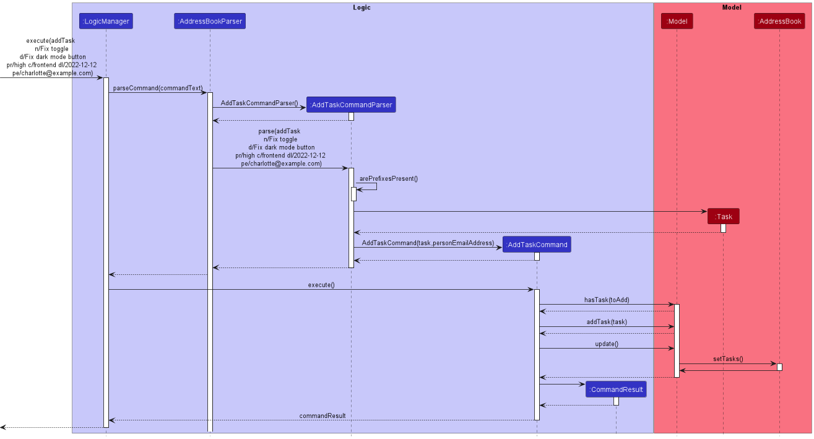
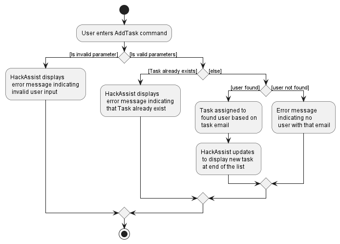
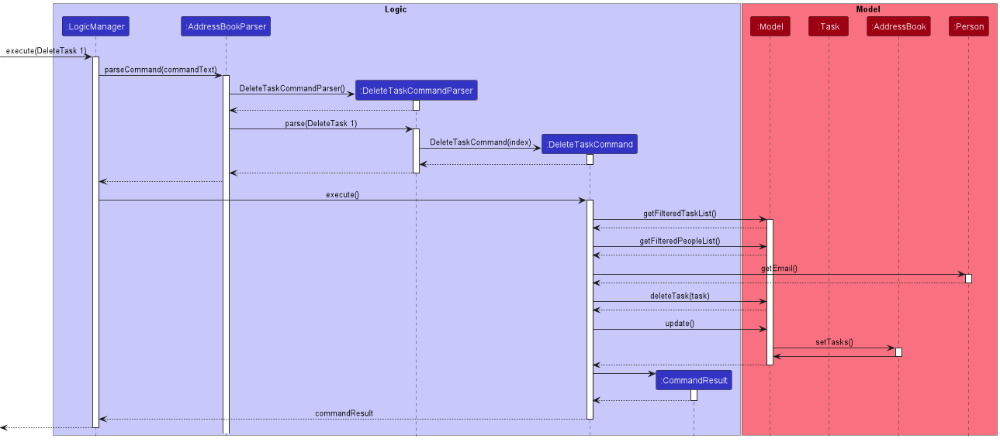
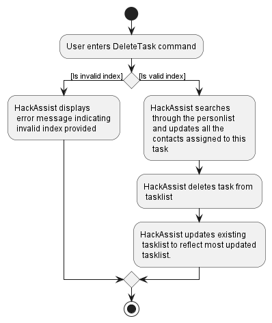

* Table of Contents
{:toc}

--------------------------------------------------------------------------------------------------------------------

## **Acknowledgements**

* {list here sources of all reused/adapted ideas, code, documentation, and third-party libraries -- include links to the original source as well}

--------------------------------------------------------------------------------------------------------------------

## **Setting up, getting started**

Refer to the guide [_Setting up and getting started_](SettingUp.md).

--------------------------------------------------------------------------------------------------------------------

## **Design**

:bulb: **Tip:** The `.puml` files used to create diagrams in this document can be found in the [diagrams](https://github.com/se-edu/addressbook-level3/tree/master/docs/diagrams/) folder. Refer to the [_PlantUML Tutorial_ at se-edu/guides](https://se-education.org/guides/tutorials/plantUml.html) to learn how to create and edit diagrams.

### Architecture

The ***Architecture Diagram*** given above explains the high-level design of the App.

Given below is a quick overview of main components and how they interact with each other.

**Main components of the architecture**

**`Main`** has two classes called [`Main`](https://github.com/se-edu/addressbook-level3/tree/master/src/main/java/seedu/address/Main.java) and [`MainApp`](https://github.com/se-edu/addressbook-level3/tree/master/src/main/java/seedu/address/MainApp.java). It is responsible for,
* At app launch: Initializes the components in the correct sequence, and connects them up with each other.
* At shut down: Shuts down the components and invokes cleanup methods where necessary.

[**`Commons`**](#common-classes) represents a collection of classes used by multiple other components.

The rest of the App consists of four components.

* [**`UI`**](#ui-component): The UI of the App.
* [**`Logic`**](#logic-component): The command executor.
* [**`Model`**](#model-component): Holds the data of the App in memory.
* [**`Storage`**](#storage-component): Reads data from, and writes data to, the hard disk.

**How the architecture components interact with each other**

The *Sequence Diagram* below shows how the components interact with each other for the scenario where the user issues the command `delete 1`.

Each of the four main components (also shown in the diagram above),

* defines its *API* in an `interface` with the same name as the Component.
* implements its functionality using a concrete `{Component Name}Manager` class (which follows the corresponding API `interface` mentioned in the previous point.

For example, the `Logic` component defines its API in the `Logic.java` interface and implements its functionality using the `LogicManager.java` class which follows the `Logic` interface. Other components interact with a given component through its interface rather than the concrete class (reason: to prevent outside component's being coupled to the implementation of a component), as illustrated in the (partial) class diagram below.

The sections below give more details of each component.

### UI component

The **API** of this component is specified in [`Ui.java`](https://github.com/se-edu/addressbook-level3/tree/master/src/main/java/seedu/address/ui/Ui.java)

The UI consists of a `MainWindow` that is made up of parts e.g.`CommandBox`, `ResultDisplay`, `PersonListPanel`, `StatusBarFooter` etc. All these, including the `MainWindow`, inherit from the abstract `UiPart` class which captures the commonalities between classes that represent parts of the visible GUI.

The `UI` component uses the JavaFx UI framework. The layout of these UI parts are defined in matching `.fxml` files that are in the `src/main/resources/view` folder. For example, the layout of the [`MainWindow`](https://github.com/se-edu/addressbook-level3/tree/master/src/main/java/seedu/address/ui/MainWindow.java) is specified in [`MainWindow.fxml`](https://github.com/se-edu/addressbook-level3/tree/master/src/main/resources/view/MainWindow.fxml)

The `UI` component,

* executes user commands using the `Logic` component.
* listens for changes to `Model` data so that the UI can be updated with the modified data.
* keeps a reference to the `Logic` component, because the `UI` relies on the `Logic` to execute commands.
* depends on some classes in the `Model` component, as it displays `Person` object residing in the `Model`.

### Logic component

**API** : [`Logic.java`](https://github.com/se-edu/addressbook-level3/tree/master/src/main/java/seedu/address/logic/Logic.java)

Here's a (partial) class diagram of the `Logic` component:

How the `Logic` component works:
1. When `Logic` is called upon to execute a command, it uses the `AddressBookParser` class to parse the user command.
1. This results in a `Command` object (more precisely, an object of one of its subclasses e.g., `AddCommand`) which is executed by the `LogicManager`.
1. The command can communicate with the `Model` when it is executed (e.g. to add a person).
1. The result of the command execution is encapsulated as a `CommandResult` object which is returned back from `Logic`.

The Sequence Diagram below illustrates the interactions within the `Logic` component for the `execute("delete 1")` API call.

:information_source: **Note:** The lifeline for `DeleteCommandParser` should end at the destroy marker (X) but due to a limitation of PlantUML, the lifeline reaches the end of diagram.

Here are the other classes in `Logic` (omitted from the class diagram above) that are used for parsing a user command:

How the parsing works:
* When called upon to parse a user command, the `AddressBookParser` class creates an `XYZCommandParser` (`XYZ` is a placeholder for the specific command name e.g., `AddCommandParser`) which uses the other classes shown above to parse the user command and create a `XYZCommand` object (e.g., `AddCommand`) which the `AddressBookParser` returns back as a `Command` object.
* All `XYZCommandParser` classes (e.g., `AddCommandParser`, `DeleteCommandParser`, ...) inherit from the `Parser` interface so that they can be treated similarly where possible e.g, during testing.

### Model component
**API** : [`Model.java`](https://github.com/se-edu/addressbook-level3/tree/master/src/main/java/seedu/address/model/Model.java)

The `Model` component,

* stores the address book data i.e., all `Person` objects (which are contained in a `UniquePersonList` object).
* stores the currently 'selected' `Person` objects (e.g., results of a search query) as a separate _filtered_ list which is exposed to outsiders as an unmodifiable `ObservableList<Person>` that can be 'observed' e.g. the UI can be bound to this list so that the UI automatically updates when the data in the list change.
* stores a `UserPref` object that represents the user’s preferences. This is exposed to the outside as a `ReadOnlyUserPref` objects.
* does not depend on any of the other three components (as the `Model` represents data entities of the domain, they should make sense on their own without depending on other components)

:information_source: **Note:** An alternative (arguably, a more OOP) model is given below. It has a `Tag` list in the `AddressBook`, which `Person` references. This allows `AddressBook` to only require one `Tag` object per unique tag, instead of each `Person` needing their own `Tag` objects. 

### Storage component

**API** : [`Storage.java`](https://github.com/AY2223S1-CS2103T-F12-2/tp/tree/master/src/main/java/seedu/address/storage)

The `Storage` component,
* can save both address book data and user preference data in json format, and read them back into corresponding objects.
* inherits from both `AddressBookStorage` and `UserPrefStorage`, which means it can be treated as either one (if only the functionality of only one is needed).
* depends on some classes in the `Model` component (because the `Storage` component's job is to save/retrieve objects that belong to the `Model`).

### Common classes

Classes used by multiple components are in the `seedu.addressbook.commons` package.

--------------------------------------------------------------------------------------------------------------------

## **Implementation**

This section describes some noteworthy details on how certain features are implemented.

### \[Proposed\] Undo/redo feature

#### Proposed Implementation

The proposed undo/redo mechanism is facilitated by `VersionedAddressBook`. It extends `AddressBook` with an undo/redo history, stored internally as an `addressBookStateList` and `currentStatePointer`. Additionally, it implements the following operations:

* `VersionedAddressBook#commit()` — Saves the current address book state in its history.
* `VersionedAddressBook#undo()` — Restores the previous address book state from its history.
* `VersionedAddressBook#redo()` — Restores a previously undone address book state from its history.

These operations are exposed in the `Model` interface as `Model#commitAddressBook()`, `Model#undoAddressBook()` and `Model#redoAddressBook()` respectively.

Given below is an example usage scenario and how the undo/redo mechanism behaves at each step.

Step 1. The user launches the application for the first time. The `VersionedAddressBook` will be initialized with the initial address book state, and the `currentStatePointer` pointing to that single address book state.

Step 2. The user executes `delete 5` command to delete the 5th person in the address book. The `delete` command calls `Model#commitAddressBook()`, causing the modified state of the address book after the `delete 5` command executes to be saved in the `addressBookStateList`, and the `currentStatePointer` is shifted to the newly inserted address book state.

Step 3. The user executes `add n/David …​` to add a new person. The `add` command also calls `Model#commitAddressBook()`, causing another modified address book state to be saved into the `addressBookStateList`.

:information_source: **Note:** If a command fails its execution, it will not call `Model#commitAddressBook()`, so the address book state will not be saved into the `addressBookStateList`.

Step 4. The user now decides that adding the person was a mistake, and decides to undo that action by executing the `undo` command. The `undo` command will call `Model#undoAddressBook()`, which will shift the `currentStatePointer` once to the left, pointing it to the previous address book state, and restores the address book to that state.

:information_source: **Note:** If the `currentStatePointer` is at index 0, pointing to the initial AddressBook state, then there are no previous AddressBook states to restore. The `undo` command uses `Model#canUndoAddressBook()` to check if this is the case. If so, it will return an error to the user rather
than attempting to perform the undo.

The following sequence diagram shows how the undo operation works:

:information_source: **Note:** The lifeline for `UndoCommand` should end at the destroy marker (X) but due to a limitation of PlantUML, the lifeline reaches the end of diagram.

The `redo` command does the opposite — it calls `Model#redoAddressBook()`, which shifts the `currentStatePointer` once to the right, pointing to the previously undone state, and restores the address book to that state.

:information_source: **Note:** If the `currentStatePointer` is at index `addressBookStateList.size() - 1`, pointing to the latest address book state, then there are no undone AddressBook states to restore. The `redo` command uses `Model#canRedoAddressBook()` to check if this is the case. If so, it will return an error to the user rather than attempting to perform the redo.

Step 5. The user then decides to execute the command `list`. Commands that do not modify the address book, such as `list`, will usually not call `Model#commitAddressBook()`, `Model#undoAddressBook()` or `Model#redoAddressBook()`. Thus, the `addressBookStateList` remains unchanged.

Step 6. The user executes `clear`, which calls `Model#commitAddressBook()`. Since the `currentStatePointer` is not pointing at the end of the `addressBookStateList`, all address book states after the `currentStatePointer` will be purged. Reason: It no longer makes sense to redo the `add n/David …​` command. This is the behavior that most modern desktop applications follow.

The following activity diagram summarizes what happens when a user executes a new command:

#### Design considerations:

**Aspect: How undo & redo executes:**

* **Alternative 1 (current choice):** Saves the entire address book.
  * Pros: Easy to implement.
  * Cons: May have performance issues in terms of memory usage.

* **Alternative 2:** Individual command knows how to undo/redo by
  itself.
  * Pros: Will use less memory (e.g. for `delete`, just save the person being deleted).
  * Cons: We must ensure that the implementation of each individual command are correct.

_{more aspects and alternatives to be added}_

### \[Proposed\] Data archiving

_{Explain here how the data archiving feature will be implemented}_

### \[Proposed\] Adding a Task into the TaskList.

#### Proposed Implementation

The proposed insertion mechanism allows a `Task` to be added into the tasklist. A task consists of attributes such as
its **name**, **description**, **priority level**, **category**, **deadline** and **email** of person assigned.
The command is executed using the `AddTaskCommand`class which extends the `Command` class and the 
respective attributes of a task is determined from the `AddTaskCommandParser` class which parses the user input 

Given below is an example usage scenario and how the AddTask mechanism behaves at each step.

Step 1. The user launches the application for the first time, with a tasklist populated with default tasks.

Step 2. The user executes `addTask n/Fix toggle d/Fix dark mode button pr/high c/frontend dl/2022-12-12 
pe/charlotte@example.com` to add a task to the tasklist. The `AddTaskCommand` calls the `Model#hasTask()`, checking if
the tasklist already contains the task. If the task already exist, an exception will be thrown and a **task already 
exist** error message will be returned to the user.

Step 3. If the task does not exist in the tasklist, the `AddTaskCommand` calls the `Model#addTask` to add the task into
the tasklist. 

step 4. After making an insert into the tasklist, the `AddTaskCommand` calls the `Model#update`, which calls 
`AddressBook#setTasks` to update the tasklist in the model to the latest version

The following sequence diagram shows how the AddTask operation works:

The following activity diagram summarizes what happens when a user executes a AddTask command:

**Design considerations**

**Aspect: How Adding executes:**

* **Alternative 1 (current choice):** Filters entire tasklist
    * Pros: Easy to implement.
    * Cons: May have performance issues as the entire tasklist must be parsed.

* **Alternative 2:**
    * Pros:
    * Cons:

### \[Proposed\] Deleting a Task into the TaskList.

#### Proposed Implementation

The proposed deletion mechanism allows a `Task` to be deleted from the tasklist based on its index. 
The command is executed using the `DeleteTaskCommand`class which extends the `Command` class and the
index of the task to be deleted is determined from the `DeleteTaskCommandParser` class which parses the user input

Given below is an example usage scenario and how the DeleteTask mechanism behaves at each step.

Step 1. The user launches the application for the first time, with a tasklist populated with default tasks.

Step 2. The user wants to delete the second task on the task list. THe user executes `delete 2` to delete the second task
from the tasklist. The `DeleteTaskCommand` calls the `Model#getFilteredTaskList()`, and checks if the index of the task
to be deleted is within the size of the tasklist. If it is not, an error message containing **invalid index provided**
is displayed to the user. 

Step 3. Next, `Model#getFilteredPersonList` is called to obtain the personlist and we check each person to see if the 
email matches the email of the person the task is assigned to. If it matches, we delete the task from the list of tasks 
the person is assigned to.

Step 4. After updating all the relevant people assigned to the task, the `DeleteTaskCommand` calls the 
`Model#deleteTask` to delete the task from the tasklist.

step 5. After making a deletion into the tasklist, the `DeleteTaskCommand` calls the `Model#update`, which calls
`AddressBook#setTasks` to update the tasklist in the model to the latest version

The following sequence diagram shows how the AddTask operation works:

The following activity diagram summarizes what happens when a user executes a AddTask command:

### \[Proposed\] Task and Person display each other

#### Proposed Implementation

Currently, A person in the addressbook has no relation to the tasks assigned to that person. This feature will allow tasks and persons to be related to each other, and allow the UI to display which tasks are assigned to a person, and which person is in charge of a task.

This will be implemented by modifying 3 already existing commands

* `Add` — Whenever a person is added, any task that shares the same email as the new Person's email wil be updated to reflect the person's name.
* `Delete` — Whenever a person is deleted, their tasks will be edited to reflect that they are not assigned to any person
* `Edit` — Whenever a person is edited, their tasks will be edited to reflect the new changes

Given below is an example usage scenario.

Step 1. The user launches the application for the first time.

Step 2. A new person (John) is added, with an email of test@example.com

Step 3. A new task is added, assigned to John.

Step 4. John is edited to James via the Edit command. This will be reflected in the task that John/James is assigned to

Step 5. James is deleted as a Person. The task is changed to be not assigned to anyone.

### \[Proposed\] Persistent Storage for Task

#### Proposed Implementation

We save tasks in Json format which contains the details of the task such as the task's name, description, etc.
We can then read the Json data file to obtain the details of each task and create a list of JsonAdaptedTask which can
then be converted to a list of tasks. Hence, our Json data file contains a list of task details.

When reading Json file we also check whether the values saved are valid before converting it back to a Task object.
This is to prevent creating a Task object with illegal values such as an empty name or name like " ". We also check for
such illegal values when creating a task through commands. However, they do not prevent creations of task with illegal
values that is done by editing Json data file. Thus, the checks when creating Task from Json data file is necessary.

We use a person's email as foreign key as it can uniquely identify a person in our person list. By implementing a
a foreign key this way, a change in person object is reflected in the task associated to that person. An alternative
to this is to keep a person object in a task object but this will prevent the change in the person object that is
supposed to be associated with the task object from being displayed in the task as they are two separate objects.

### \[Proposed\] Filtering of tasks by Task Category, Task Deadline or Both

#### Proposed Implementation

The proposed filter mechanism allows a `Task` to be filtered based on its `Task Category` or `Task Deadline`.
The command is executed using the `FilterTaskCommand`class which extends the `Command` class and the filter criteria is determined from the `FilterTaskParser` class which parses the user input. The `TaskCategoryAndDeadlinePredicate` class will filter the existing task list based on the keyword parsed from the `FilterTaskCategoryParser` class and return the filtered tasklist, which will be displayed on the application.

Given below is an example usage scenario and how the filter mechanism behaves at each step.

Step 1. The user launches the application for the first time, with an empty tasklist.

Step 2. The user executes `addTask n/homework d/coding assignment pr/high c/backend dl/2022-12-12 pe/charlotte@example.com` to add a task to the tasklist.

Step 3. The user repeats step 2 to add more tasks to the tasklist.

step 4. The user decides that he only wants to see the tasks that are backend related and are due by 2022-12-12. The user executes `filter c/backend dl/2022-12-12` to filter the tasks that are backend related and are due before 2022-12-12. After this, only tasks that have `TaskCategory:backend` are displayed onto the application.

The following sequence diagram shows how the filter operation works:

Step 5. After looking through all the tasks that are related to backend, the user wants to revert back to the original set of tasks. The user calls `listTasks`, which will list the unfiltered tasklist.

The following activity diagram summarizes what happens when a user executes a filter command:

**Design considerations**

**Aspect: How filter executes:**

* **Alternative 1 (current choice):** Filters entire tasklist
  * Pros: Easy to implement.
  * Cons: May have performance issues as the entire tasklist must be parsed.

* **Alternative 2:**
  * Pros:
  * Cons:

_{more aspects and alternatives to be added}_

--------------------------------------------------------------------------------------------------------------------

## **Documentation, logging, testing, configuration, dev-ops**

* [Documentation guide](Documentation.md)
* [Testing guide](Testing.md)
* [Logging guide](Logging.md)
* [Configuration guide](Configuration.md)
* [DevOps guide](DevOps.md)

--------------------------------------------------------------------------------------------------------------------

## **Appendix: Requirements**

### Product scope

**Target User**

Hackathon team leaders, in charge of distributing tasks to the people in his group

**Target user profile**:

* has a need to allocate and track tasks to team members
* has a need to manage a significant number of people and tasks
* has a need to manage tasks that can change significantly over the course of the project
* prefer using a desktop application for management
* is reasonably comfortable using CLI apps

**Value proposition**: help with project management tasks and team formation in Hackathons

### User stories

Priorities: High (must have) - `* * *`, Medium (nice to have) - `* *`, Low (unlikely to have) - `*`

| Priority | As a …​                                 | I want to …​                        | So that I can…​                                                                   |
|----------|--------------------------------------------|-------------------------------------|--------------------------------------------------------------------------------------|
| `* * *`  | hackathon team leader                      | see all tasks                       | have an overview of what needs to be done                                            |
| `* * *`  | hackathon team leader                      | add a task to the task list,        | include task that needs to be done                                                   |
| `* * *`  | hackathon team leader                      | delete a task                       | remove tasks that are accidentally added                                             |
| `* * *`  | hackathon team leader                      | edit a task                         | rectify mistakes in task details                                                     |
| `* * *`  | hackathon team leader                      | assign a task                       | allocate task to a team member                                                       |
| `* * *`  | hackathon team leader                      | mark task as done                   | I can keep a moving record of what we have done                                      |
| `* * *`  | hackathon team leader                      | mark task as not done               | in case we have tasks that end up being incomplete or the task requirements modified |
| `* *`    | hackathon team leader                      | see which tasks are done/ not done  | plan the way forward                                                                 |
| `* *`    | hackathon team leader                      | add further descriptions to the task | add more details to a task                                                           |                             |
| `* *`    | hackathon team leader                      | sort tasks by deadline               | know what is most urgent                                                                 |
| `* *`    | hackathon team leader                      | sort tasks by priority                | know what is most important                                                    |                             |

| `* *`    | hackathon team leader                      | filter tasks by differnt tasks        | focus of tasks of a certain type                                                                 |
| `* *`    | hackathon team leader                      | find a specific person               | know how much that person has assigned to him                                                      |                             |

*{More to be added}*

### Use cases

**Use case: Add a new team member**

**MSS**

1.  User requests to add a new member
2.  HackAssist shows a list of fields to input (Name,Phone Number, Email, Address, Tags)
3.  User inputs fields
4.  HackAssist shows list of all members, including new member
Use case ends.

**Extensions**

Extensions:
  * 3a. HackAssist detects that the member already exists
     * 3a1. Hackassist shows an error message
     * Use case ends.
       
 * 3b. HackAssist detects that one of the input fields is incorrectly formated
   * 3b1. Hackassist shows an error message, showing the incorrectly formated field and the specifications of that field
   * Use case ends.

**Use case: Delete a team member**

**MSS**

1.  User requests to delete a new member
2.  HackAssist shows a list of fields to input (index)
3.  User inputs fields
4.  HackAssist displays confirmation message
5.  HackAssist removes the user's name and email from all the tasks assigned to that user
6.  HackAssist shows list of all members, excluding deleted member, and the updated task list
Use case ends.

**Extensions**

Extensions:
  * 3a. HackAssist detects that the index is not a number
     * 3a1. Hackassist shows an error message warnging that the command format is invalid
     * Use case resumes from step 2.
  
  * 3b. HackAssist detects that the index is invalid
     * 3b1. Hackassist shows an error message warnging that the index is invalid
     * Use case resumes from step 2.

**Use case: Edit a team member**

**MSS**

1.  User requests to edit a new member
2.  HackAssist shows a list of fields to input (index and one or more of Name, Phone Number, Email Address, Tags)
3.  User inputs fields
4.  HackAssist displays confirmation message
5.  HackAssist shows list of all members, with that particular member's fields updated
Use case ends.

**Extensions**

Extensions:
  * 3a. HackAssist detects that the index is not a number
     * 3a1. Hackassist shows an error message warning that the command format is invalid
     * Use case resumes from step 2.
  
  * 3b. HackAssist detects that the index is invalid
     * 3b1. Hackassist shows an error message warning that the index is invalid
     * Use case resumes from step 2.
       
  * 3c. HackAssist detects that none of optional fields were inputed
     * 3c1. Hackassist shows an error message warning that at least one field must be edited
     * Use case resumes from step 2.
     
* 3d. HackAssist detects that not all the optional fields are different from existing fields
     * 3d1. Hackassist shows an error message warning that the fields must be different from the ones inputed
     * Use case resumes from step 2.
       
 **Use case: Add a task**

**MSS**

1.  User requests to add a new member
2.  HackAssist shows a list of fields to input (Name, Description, Priority, Category, Status)
3.  User inputs fields
4.  HackAssist shows list of all members, including new member
Use case ends.

**Extensions**

Extensions:
  * 3a. HackAssist detects that the task already exists
     * 3a1. Hackassist shows an error message
     * Use case ends.
 
 * 3b. HackAssist detects that the deadline has already past
     * 3b1. Hackassist shows an error message, warning that the deadline must be a future date
     * Use case ends.
       
 * 3c. HackAssist detects that the priority or category is not one of the accepted values
    * 3c1. Hackassist shows an error message, showing the incorrect priority or category and showing the correct values
    * Use case ends.
      
 * 3d. HackAssist detects that one of the input fields is incorrectly formated
    * 3d1. Hackassist shows an error message, showing the incorrectly formated field and the specifications of that field
    * Use case ends.
      
**Use case: Delete a task**

**MSS**

1.  User requests to delete a new task
2.  HackAssist shows a list of fields to input (index)
3.  User inputs fields
4.  HackAssist displays confirmation message
5.  HackAssist removes the task from task list and all members assigned to that task
6.  HackAssist shows list of all tasks, excluding deleted task, and the updated person list
Use case ends.

**Extensions**

Extensions:
  * 3a. HackAssist detects that the index is not a number
     * 3a1. Hackassist shows an error message warnging that the command format is invalid
     * Use case resumes from step 2.
  
  * 3b. HackAssist detects that the index is invalid
     * 3b1. Hackassist shows an error message warnging that the index is invalid
     * Use case resumes from step 2.
       
**Use case: Assign a task to an existing team member**

**MSS**

1.  User requests to see all tasks
2.  HackAssist shows current list of tasks
3.  User edits the task to have the email of a current member
4.  User is updated to be assigned to existing task
5.  Task is updated to show the user assigned to it, and that user's email
Use case ends.

**Extensions**

Extensions:
  * 2a. There are no tasks
    * Use case ends.
 
 * 3a. The format of the input email is invalid
    * 3a1 Hackassist shows an error message that shows what is the expected input
    * Use case resumes from step 2.

 * 3b. There are no members with the specified email
    * 3b1 Hackassist shows an error message that there are no members
    * Use case resumes from step 2.

 **Use case: Edit a task**

**MSS**

1.  User requests to edit a new member
2.  HackAssist shows a list of fields to input (index and one or more of Name, Description, Priority, Category, Status )
3.  User inputs fields
4.  HackAssist displays confirmation message
5.  HackAssist shows list of all members, with that particular member's fields updated
Use case ends.

Extensions:
  * 3a. HackAssist detects that the index is not a number
     * 3a1. Hackassist shows an error message warning that the command format is invalid
     * Use case resumes from step 2.
  
  * 3b. HackAssist detects that the index is invalid
     * 3b1. Hackassist shows an error message warning that the index is invalid
     * Use case resumes from step 2.
       
  * 3c. HackAssist detects that none of optional fields were inputed
     * 3c1. Hackassist shows an error message warning that at least one field must be edited
     * Use case resumes from step 2.
  
  * 3d. HackAssist detects that the priority or category is not one of the accepted values
    * 3d1. Hackassist shows an error message, showing the incorrect priority or category and showing the correct values
    * Use case ends.
       
  * 3e. HackAssist detects that not all the optional fields are different from existing fields
     * 3e1. Hackassist shows an error message warning that the fields must be different from the ones inputed
     * Use case resumes from step 2.
  
**Use case: Filter the tasks by category**

**MSS**

1.  User requests to filter the tasks by category
2.  User inputs the category
3.  HackAssist shows a the filtered task list
Use case ends.

Extensions:
  * 2a. HackAssist detects that category is not one of the accepted values
     * 2a1. Hackassist shows an error message warning that the command format is invalid
     * Use case resumes from step 2.
  
  * 2b. HackAssist detects that the command is incorrectly formated
     * 2b1. Hackassist shows an error message warning that command is incorrectly formated
     * Use case resumes from step 2.
       
**Use case: Filter the tasks by deadline**

**MSS**

1.  User requests to filter the tasks by category
2.  User inputs the category
3.  HackAssist shows a the filtered task list
Use case ends.

Extensions:
  * 2a. HackAssist detects that deadline has already past
     * 2a1. Hackassist shows an error message warning that the deadline has past
     * Use case resumes from step 2.
  
  * 2b. HackAssist detects that the command is incorrectly formated
     * 2b1. Hackassist shows an error message warning that command is incorrectly formated
     * Use case resumes from step 2.

**Use case: Sort the tasks by priority**

**MSS**

1.  User requests to sort the tasks by priority
2.  User inputs ascending or descending
3.  HackAssist shows a the sorted task list
Use case ends.

Extensions:
 * 2a. HackAssist detects that the command is incorrectly formated
     * 2a1. Hackassist shows an error message warning that command is incorrectly formated
     * Use case resumes from step 2.

 **Use case: Sort the tasks by deadline**

**MSS**

1.  User requests to sort the tasks by deadline
2.  User inputs ascending or descending
3.  HackAssist shows a the sorted task list
Use case ends.

Extensions:
 * 2a. HackAssist detects that the command is incorrectly formated
     * 2a1. Hackassist shows an error message warning that command is incorrectly formated
     * Use case resumes from step 2.
       

### Non-Functional Requirements

1.  Should work on any _mainstream OS_ as long as it has Java `11` or above installed.
2.  Should be able to hold up to 1000 persons without a noticeable sluggishness in performance for typical usage.
3.  A user with above average typing speed for regular English text (i.e. not code, not system admin commands) should be able to accomplish most of the tasks faster using commands than using the mouse.
4.  Should be usable by hackathon team leaders of all skill levels (i.e. novices to highly experienced).
5.  Product is not required to handle printing.
6.  System should respond within two seconds.
7.  Product is expected to be updated with a new set of features or bugfixes once every two weeks.
8.  Should be able to read from local disk storage (i.e. persistent storage functionality).
9.  Product is not designed to work between different disk storages (i.e. only can read and write to local disk storage).
10.  Should work offline without network connectivity.
11.  Should only be accessible by Hackathon group leaders.

*{More to be added}*

### Glossary

* **Mainstream OS**: Windows, Linux, Unix, OS-X
* **Private contact detail**: A contact detail that is not meant to be shared with others
* **CLI**: Command Line Interface which receives commands from a user in the form of lines of text

--------------------------------------------------------------------------------------------------------------------

## **Appendix: Instructions for manual testing**

Given below are instructions to test the app manually.

:information_source: **Note:** These instructions only provide a starting point for testers to work on;
testers are expected to do more *exploratory* testing.

### Launch and shutdown

1. Initial launch

   1. Download the jar file and copy into an empty folder

   1. Double-click the jar file Expected: Shows the GUI with a set of sample contacts. The window size may not be optimum.

1. Saving window preferences

   1. Resize the window to an optimum size. Move the window to a different location. Close the window.

   1. Re-launch the app by double-clicking the jar file. 
       Expected: The most recent window size and location is retained.

1. _{ more test cases …​ }_

### Deleting a person

1. Deleting a person while all persons are being shown

   1. Prerequisites: List all persons using the `list` command. Multiple persons in the list.

   1. Test case: `delete 1` 
      Expected: First contact is deleted from the list. Details of the deleted contact shown in the status message. Timestamp in the status bar is updated.

   1. Test case: `delete 0` 
      Expected: No person is deleted. Error details shown in the status message. Status bar remains the same.

   1. Other incorrect delete commands to try: `delete`, `delete x`, `...` (where x is larger than the list size) 
      Expected: Similar to previous.

1. _{ more test cases …​ }_

### Saving data

1. Dealing with missing/corrupted data files

   1. _{explain how to simulate a missing/corrupted file, and the expected behavior}_

1. _{ more test cases …​ }_
