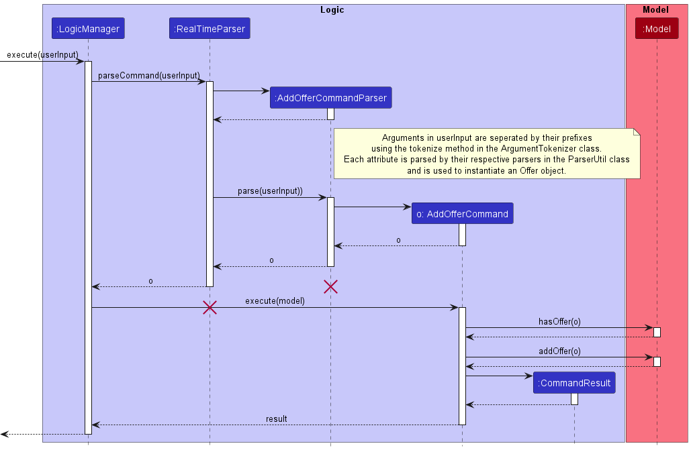
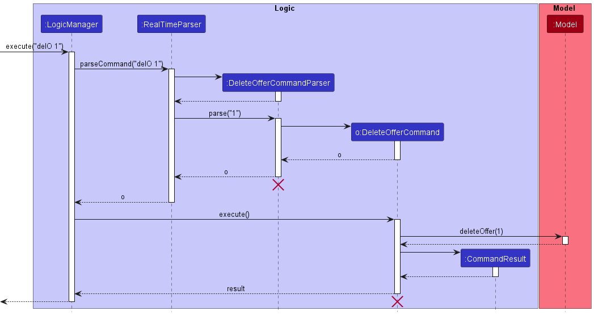

* Table of Contents
{:toc}

--------------------------------------------------------------------------------------------------------------------

## **Acknowledgements**

* {list here sources of all reused/adapted ideas, code, documentation, and third-party libraries -- include links to the original source as well}

--------------------------------------------------------------------------------------------------------------------

## **Setting up, getting started**

Refer to the guide [_Setting up and getting started_](SettingUp.md).

--------------------------------------------------------------------------------------------------------------------

## **Design**

:bulb: **Tip:** The `.puml` files used to create diagrams in this document can be found in the [diagrams](https://github.com/se-edu/addressbook-level3/tree/master/docs/diagrams/) folder. Refer to the [_PlantUML Tutorial_ at se-edu/guides](https://se-education.org/guides/tutorials/plantUml.html) to learn how to create and edit diagrams.

### Architecture

The ***Architecture Diagram*** given above explains the high-level design of the App.

Given below is a quick overview of main components and how they interact with each other.

**Main components of the architecture**

**`Main`** has two classes called [`Main`](https://github.com/se-edu/addressbook-level3/tree/master/src/main/java/seedu/address/Main.java) and [`MainApp`](https://github.com/se-edu/addressbook-level3/tree/master/src/main/java/seedu/address/MainApp.java). It is responsible for,
* At app launch: Initializes the components in the correct sequence, and connects them up with each other.
* At shut down: Shuts down the components and invokes cleanup methods where necessary.

[**`Commons`**](#common-classes) represents a collection of classes used by multiple other components.

The rest of the App consists of four components.

* [**`UI`**](#ui-component): The UI of the App.
* [**`Logic`**](#logic-component): The command executor.
* [**`Model`**](#model-component): Holds the data of the App in memory.
* [**`Storage`**](#storage-component): Reads data from, and writes data to, the hard disk.

**How the architecture components interact with each other**

The *Sequence Diagram* below shows how the components interact with each other for
the scenario where the user issues the command `delC 1`.

Each of the four main components (also shown in the diagram above),

* defines its *API* in an `interface` with the same name as the Component.
* implements its functionality using a concrete `{Component Name}Manager` class (which follows the corresponding API
`interface` mentioned in the previous point.

For example, the `Logic` component defines its API in the `Logic.java` interface and implements its functionality
using the `LogicManager.java` class which follows the `Logic` interface. Other components interact with a given
component through its interface rather than the concrete class (reason: to prevent outside component's being coupled
to the implementation of a component), as illustrated in the (partial) class diagram below.

The sections below give more details of each component.

### UI component

The **API** of this component is specified in [`Ui.java`](https://github.com/se-edu/addressbook-level3/tree/master/src/main/java/seedu/address/ui/Ui.java)

The UI consists of a `MainWindow` that is made up of parts e.g.`CommandBox`, `ResultDisplay`,
`PersonListPanel`, `StatusBarFooter` etc. All these, including the `MainWindow`, inherit from the abstract
`UiPart` class which captures the commonalities between classes that represent parts of the visible GUI.

The `UI` component uses the JavaFx UI framework. The layout of these UI parts are defined in matching `.fxml` files
that are in the `src/main/resources/view` folder. For example, the layout
of the [`MainWindow`](https://github.com/se-edu/addressbook-level3/tree/master/src/main/java/seedu/address/ui/MainWindow.java)
is specified in [`MainWindow.fxml`](https://github.com/se-edu/addressbook-level3/tree/master/src/main/resources/view/MainWindow.fxml)

The `UI` component,

* executes user commands using the `Logic` component.
* listens for changes to `Model` data so that the UI can be updated with the modified data.
* keeps a reference to the `Logic` component, because the `UI` relies on the `Logic` to execute commands.
* depends on some classes in the `Model` component, as it displays `Client` object residing in the `Model`.

### Logic component

**API** : [`Logic.java`](https://github.com/se-edu/addressbook-level3/tree/master/src/main/java/seedu/address/logic/Logic.java)

Here's a (partial) class diagram of the `Logic` component:

How the `Logic` component works:

1. When `Logic` is called upon to execute a command, it uses the `RealTimeParser` class to parse the user command.
2. This results in a `Command` object (more precisely, an object of one of its subclasses e.g., `AddClientCommand`)
which is executed by the `LogicManager`.
3. The command can communicate with the `Model` when it is executed (e.g. to add a person).
4. The result of the command execution is encapsulated as a `CommandResult` object which is returned back from `Logic`.

The Sequence Diagram below illustrates the interactions within the `Logic` component for the `execute("delC 1")` API call.

:information_source: **Note:** The lifeline for
`DeleteClientCommandParser` should end at the destroy marker (X) but due to a limitation of PlantUML, the lifeline
reaches the end of diagram.

Here are the other classes in `Logic` (omitted from the class diagram above) that are used for parsing a user command:

How the parsing works:
* When called upon to parse a user command, the `RealTimeParser` class creates an
`XYZCommandParser` (`XYZ` is a placeholder for the specific command name e.g., `AddClientCommandParser`) which uses the
other classes shown above to parse the user command and create a `XYZCommand` object (e.g., `AddClientCommand`) which the
`RealTimeParser` returns back as a `Command` object.
* All `XYZCommandParser` classes (e.g., `AddClientCommandParser`, `DeleteOfferCommandParser`, ...) inherit from
the `Parser` interface so that they can be treated similarly where possible e.g, during testing.

### Model component
**API** : [`Model.java`](https://github.com/se-edu/addressbook-level3/tree/master/src/main/java/seedu/address/model/Model.java)

The `Model` component,

* stores the data in RealTime i.e., all `Client`, `Offer`, `Listing` and `Meeting` objects (which are contained in a
`UniqueClientList`, `UniqueOfferList`, `UniqueListingList` and `UniqueMeetingList` object respectively).
* stores the currently 'selected' `Client`, `Offer`, `Listing` and `Meeting` objects (e.g., results of a search query)
as a separate _filtered_ list which is exposed to outsiders as an unmodifiable `ObservableList<Client>`,
`ObservableList<Offer>`, `ObservableList<Listing>` and `ObservableList<Meeting>` that can be 'observed' e.g. the UI
can be bound to this list so that the UI automatically updates when the data in the list change.
* stores a `UserPref` object that represents the user’s preferences. This is exposed to the outside as a
`ReadOnlyUserPref` objects.
* does not depend on any of the other three components (as the `Model` represents data entities of the domain,
they should make sense on their own without depending on other components)

:information_source: **Note:** An alternative (arguably, a more OOP) model is given below. It has a `Tag` list in the `RealTime`, which `Person` references. This allows `RealTime` to only require one `Tag` object per unique tag, instead of each `Person` needing their own `Tag` objects. 

### Storage component

**API** : [`Storage.java`](https://github.com/se-edu/addressbook-level3/tree/master/src/main/java/seedu/address/storage/Storage.java)

The `Storage` component,
* can save both RealTime data and user preference data in json format, and read them back into corresponding objects.
* inherits from both `RealTimeStorage` and `UserPrefStorage`, which means it can be treated as either one (if only the functionality of only one is needed).
* depends on some classes in the `Model` component (because the `Storage` component's job is to save/retrieve objects that belong to the `Model`)

### Common classes

Classes used by multiple components are in the `seedu.realtime.commons` package.

--------------------------------------------------------------------------------------------------------------------

## **Implementation**

This section describes some noteworthy details on how certain features are implemented.

### \[Proposed\] Undo/redo feature

#### Proposed Implementation

The proposed undo/redo mechanism is facilitated by `VersionedRealTime`. It extends `RealTime` with an undo/redo history, stored internally as an `RealTimeStateList` and `currentStatePointer`. Additionally, it implements the following operations:

* `VersionedRealTime#commit()` — Saves the current address book state in its history.
* `VersionedRealTime#undo()` — Restores the previous address book state from its history.
* `VersionedRealTime#redo()` — Restores a previously undone address book state from its history.

These operations are exposed in the `Model` interface as `Model#commitRealTime()`, `Model#undoRealTime()` and `Model#redoRealTime()` respectively.

Given below is an example usage scenario and how the undo/redo mechanism behaves at each step.

Step 1. The user launches the application for the first time. The `VersionedRealTime` will be initialized with the initial address book state, and the `currentStatePointer` pointing to that single address book state.

Step 2. The user executes `delete 5` command to delete the 5th person in the address book. The `delete` command calls `Model#commitRealTime()`, causing the modified state of the address book after the `delete 5` command executes to be saved in the `realTimeStateList`, and the `currentStatePointer` is shifted to the newly inserted address book state.

Step 3. The user executes `add n/David …​` to add a new person. The `add` command also calls `Model#commitRealTime()`, causing another modified address book state to be saved into the `realTimeStateList`.

:information_source: **Note:** If a command fails its execution, it will not call `Model#commitRealTime()`, so the address book state will not be saved into the `realTimeStateList`.

Step 4. The user now decides that adding the person was a mistake, and decides to undo that action by executing the `undo` command. The `undo` command will call `Model#undoRealTime()`, which will shift the `currentStatePointer` once to the left, pointing it to the previous address book state, and restores the address book to that state.

:information_source: **Note:** If the `currentStatePointer` is at index 0, pointing to the initial RealTime state, then there are no previous RealTime states to restore. The `undo` command uses `Model#canUndoRealTime()` to check if this is the case. If so, it will return an error to the user rather
than attempting to perform the undo.

The following sequence diagram shows how the undo operation works:

:information_source: **Note:** The lifeline for `UndoCommand` should end at the destroy marker (X) but due to a limitation of PlantUML, the lifeline reaches the end of diagram.

The `redo` command does the opposite — it calls `Model#redoRealTime()`, which shifts the `currentStatePointer` once to the right, pointing to the previously undone state, and restores the address book to that state.

:information_source: **Note:** If the `currentStatePointer` is at index `realTimeStateList.size() - 1`, pointing to the latest address book state, then there are no undone realTime states to restore. The `redo` command uses `Model#canRedoRealTime()` to check if this is the case. If so, it will return an error to the user rather than attempting to perform the redo.

Step 5. The user then decides to execute the command `list`. Commands that do not modify the address book, such as `list`, will usually not call `Model#commitRealTime()`, `Model#undoRealTime()` or `Model#redoRealTime()`. Thus, the `realTimeStateList` remains unchanged.

Step 6. The user executes `clear`, which calls `Model#commitRealTime()`. Since the `currentStatePointer` is not pointing at the end of the `realTimeStateList`, all address book states after the `currentStatePointer` will be purged. Reason: It no longer makes sense to redo the `add n/David …​` command. This is the behavior that most modern desktop applications follow.

The following activity diagram summarizes what happens when a user executes a new command:

#### Design considerations:

**Aspect: How undo & redo executes:**

* **Alternative 1 (current choice):** Saves the entire address book.
  * Pros: Easy to implement.
  * Cons: May have performance issues in terms of memory usage.

* **Alternative 2:** Individual command knows how to undo/redo by
  itself.
  * Pros: Will use less memory (e.g. for `delete`, just save the person being deleted).
  * Cons: We must ensure that the implementation of each individual command are correct.

_{more aspects and alternatives to be added}_

### \[Implemented\] Add Offer feature

#### Offers

REal-Time manages **_Offers_** made by Clients that are interested when bidding for Listings. To model an

#### Implementation

To add an `Offer` object, the `AddOfferCommand` must be executed. This stores the `Offer` object into the
`UniqueOfferList`. Following the command execution pathway, the implementation of adding offers uses the exposed
`Model#addOffer(Offer)` method in the `Model` API.

The `AddOfferCommand` is parsed by the `AddOfferCommandParser`.
`AddOfferCommandParser#parse()` parses the user input to return a `AddOfferCommand` object that will be executed.

Given below is an example usage scenario and how the add offers mechanism behaves at each step.

Step 1. The user opens up the `REal-Time` application for the first time and observes that there are some sample data
in the `UniqueOfferList`.

Step 2. The user keys in the command word for adding an offer, `addO`, followed by the compulsory parameters needed to
add an offer, namely the `Name` component prefixed by `n/`, `Price` component prefixed by `o/` and the `ListingId`
component prefixed by `l/`. In this scenario, the user keys in `addO n/John Doe l/BEDOK_SOUTH o/600000` into the command box
which will execute the `AddOfferCommandParser` to check through the arguments and ensure that the compulsory fields are
present. It will then create the `Price`, `ListingId` and `Name` objects needed to instantiate an `Offer` object. The
parser returns a `AddOfferCommand` object with the `Offer` object ready to be added into `Model`

Step 3. The `AddOfferCommand` calls the `Model#addOffer(Offer)` to add the offer and its relevant attributes.

Step 4. Depending on whether the `UniqueOfferList` already contains data or is an empty list, the added Offer will
be sorted automatically by the `ListingId` in lexicographical order. This is done using the `Collections#sort()` method
and implementing a natural order by implementing the `Comparable` interface and overriding the `Comparable#compareTo()`
method.

The sequence diagram below shows the add offer process.

:information_source: **Note:** The lifeline for
`AddOfferCommandParser` and `RealTimeParser` should end at the destroy marker (X) but due to a limitation of PlantUML, the lifeline
reaches the end of diagram.

#### Design considerations

**Aspect: Client-Offer interaction**

* **Alternative 1 (current choice):** Seperate Offers and Client objects
  * Pros: Easier to maintain as they are seperate objects, less dependency between each other
  * Cons: No reference between the `Client` and `Offer` objects
* **Alternative 2:** Allow Clients to have an Offer attribute instead
  * Pros: Easier to reference between `Client` and `Offer`
  * Cons: Large dependency between the two.

### \[Implemented\] Delete Offer feature

The Delete Offer feature allows users to delete the specified `Offer` in the `UniqueOfferList`.

#### Implementation

To delete an `Offer` object, the `DeleteOfferCommand` must be executed. The `DeleteOfferCommand` extends the `Command`
class.

The `DeleteOfferCommand` is parsed by the `DeleteOfferCommandParser`. `DeleteOfferCommandParser#parse()` parses the user
input to return a `DeleteOfferCommand` that will be executed.

Given below is an example usage scenario and how the delete offer mechanism behaves at each step.

Step 1. The user enters `delO 1` in the command box.  This calls the `LogicManager#execute()` method which calls the
`RealTimeParser#parse` method to be executed and will determine that the command is a `DeleteOfferCommand` after parsing.

Step 2. A `DeleteOfferCommandParser` object is instantiated with the necessary arguments. It will return a
`DeleteOfferCommand` object with the specified `Index`.

Step 3. The `DeleteOfferCommand#execute()` method is called which calls the `Model#deleteOffer(Offer)` method to delete
the Offer at the specified `Index` in `Model`.

The sequence diagram below shows the delete offer process.

:information_source: **Note:** The lifeline for
`DeleteOfferCommandParser` and `DeleteOfferCommand` should end at the destroy marker (X) but due to a limitation of PlantUML, the lifeline
reaches the end of diagram.

#### Design considerations

**Aspect: Using index specific or attribute specific deletion**

* **Alternative 1 (current choice):** Index specific
    * Pros: Easier implementation and more suited for fast-typing
    * Cons: Might accidentally delete the wrong `Offer` if `Index` is mistyped
* **Alternative 2:** Attribute specific
    * Pros: User does not have to find for specific `Index`
    * Cons: Many `Offer` objects might share same attribute such as `ListingId` and `Price`

### \[Implemented\] Edit Offer feature

The Edit Offer feature allows users to edit any attribute of an `Offer` in the `UniqueOfferList`.

#### Implementation

To edit an `Offer`, the `EditOfferCommand` is executed. The `EditOfferCommand` extends the `Command` class.

The `EditOfferCommand` is parsed by the `EditOfferCommandParser`. `EditOfferCommandParser#parse()` parses the user input
to return a `EditOfferCommand` that will be executed.

Given below is an example usage scenario and how the edit offer mechanism behaves at each step.

Step 1. The user enters `editO 1 l/Bukit_timah_rd o/1000000` in the command box. This calls the `LogicManager#execute()`
method which calls the `RealTimeParser#parse` method to be executed and will determine that the command is a
`EditOfferCommand` after parsing.

Step 2. An `EditOfferCommandParser` object is instantiated with the necessary arguments. It returns a `EditOfferCommand`
with the `Index` and `EditOfferDescriptor` as parameters. The `EditOfferDescriptor` contains the edited information that
the edited `Offer` is supposed to be updated to. In this scenario, we are changing the `listingId` and `Price` attribute
of the `Offer`. The `EditOfferDescriptor` is then updated through the `setListing()` and `setOfferPrice()` methods by
the `EditOfferDescriptor`.

Step 3. The `EditOfferCommand#execute()` method is called which creates the edited `Offer` using the `createEditedOffer`
method which takes in the `Offer` to be edited and the `EditOfferDescriptor` that was created from the previous step.
The edited `Offer` is then checked if it is a duplicate or already exists in the `UniqueOfferList` through the
`Offer#isSameOffer()` and `Model#hasOffer()` methods.

An `Offer` is the same if it contains the exact same `Name`, `Price` and `ListingId`.

Step 4. The `Model#setOffer(Offer)` method is called to replace the target `Offer` at the specified `Index` from earlier.
The `Model#updateFilteredOfferList()` is called to update the `UniqueOfferList`.

--------------------------------------------------------------------------------------------------------------------

## **Documentation, logging, testing, configuration, dev-ops**

* [Documentation guide](Documentation.md)
* [Testing guide](Testing.md)
* [Logging guide](Logging.md)
* [Configuration guide](Configuration.md)
* [DevOps guide](DevOps.md)

--------------------------------------------------------------------------------------------------------------------

## **Appendix: Requirements**

### Product scope

**Target user profile**: Real Estate Agents

* has a need to manage a significant number of contacts
* prefer desktop apps over other types
* can type fast
* prefers typing to mouse interactions
* is reasonably comfortable using CLI apps

**Value propositions**:
* manage clients faster than a typical mouse/GUI driven app
* Real-Estate agents with many clients may struggle to juggle their viewings and manage meetings.
* Track properties to their owners as well as potential buyers
* Centralised place to store client information, what they are looking for

### User stories

Priorities: High (must have) - `* * *`, Medium (nice to have) - `* *`, Low (unlikely to have) - `*`

| Priority | As a …​                                    | I want to …​                 | So that I can…​                                                        |
|----------|--------------------------------------------|------------------------------|------------------------------------------------------------------------|
| `* * *`  | new user                                   | see usage instructions       | refer to instructions when I forget how to use the App                 |
| `* * *`  | user                                       | add a new client             | see all my clients in one list                                         |
| `* * *`  | user                                       | add my client's offer        | track all my clients' current offers                                   |
| `* * *`  | user                                       | delete a client              | remove entries that I no longer need                                   |
| `* * *`  | user                                       | find a client by name        | locate details of persons without having to go through the entire list |
| `* * *`  | user                                       | edit an offer                | update any changes to a client's offer                                 |
| `* *`    | user                                       | hide private contact details | minimize chance of someone else seeing them by accident                |
| `*`      | user with many persons in the address book | sort client by name          | locate a person easily                                                 |
| `*`      | user with many offers in the address book  | sort offers by listings      | locate offers easily                                                   |
| `*`      | intermediate user                          | view reminders               | be informed of urgent meetings                                         |
| `*`      | intermediate user                          | reorder the list             | place important contacts near the top                                  |
| `*`      | user                                       | save my data                 | store my data for future use                                           |
| `*`      | intermediate user                          | filter the list              | easily view clients of a specific type                                 |

*{More to be added}*

### Use cases

(For all use cases below, the **System** is the `RealTime` and the **Actor** is the `user`, unless specified otherwise)

**Use case: UC01 - Reorder the list**

**MSS**

1.  User requests to list persons
2.  RealTime shows a list of persons
3.  User requests to switch a specific person in the list with another
4.  RealTime swaps their index

    Use case ends.

**Extensions**

* 2a. The list is empty.

  Use case ends.

* 3a. The given index is invalid.
    * 3a1. RealTime shows an error message.

      Use case resumes at step 2.

**Use case: UC02 - Delete a person**

**MSS**

1.  User requests to list persons
2.  RealTime shows a list of persons
3.  User requests to delete a specific person in the list
4.  RealTime deletes the person

    Use case ends.

**Extensions**

* 2a. The list is empty.

  Use case ends.

* 3a. The given index is invalid.
    * 3a1. RealTime shows an error message.

      Use case resumes at step 2.

**Use case: UC03 - Add an offer**

**MSS**
1. User requests to add an offer.
2. RealTime adds the offer.

    Use case ends.

**Extensions**

* 1a. User enters invalid input
  * 1a1. RealTime shows an error message.

    Use case resumes at Step 1.

**Use case: UC04 - Edit an offer**

**MSS**
1. User requests to edit an offer.
2. REal-Time edits the offer.

    Use case ends.

**Extensions**
* 1a. User enters invalid input
  * 1a1. REal-Time shows an error message.
 
    Use case resumes at Step 1.

**Use case: UC05 - Delete an offer**

**MSS**
1. User requests to delete an offer.
2. REal-Time deletes the offer.

    Use case ends.

**Extensions**
* 1a. User enters invalid input
  * 1a1. REal-Time shows an error message.

    Use case resumes at Step 1

*{More to be added}*

### Non-Functional Requirements

1. Should work on any _mainstream OS_ as long as it has Java `11` or above installed.
2. Should be able to hold up to 1000 persons without a noticeable sluggishness in performance for typical usage.
3. A user with above average typing speed for regular English text (i.e. not code, not system admin commands) should be able to accomplish most of the tasks faster using commands than using the mouse.
4. Application should start in under a few seconds.

*{More to be added}*

### Glossary

* **Mainstream OS**: Windows, Linux, Unix, OS-X
* **Client**: A person that is interested in purchasing or selling a property
* **Offer**: A price that the purchaser is willing to pay for a property
* **Listing**: A property that is being advertised
* **Meeting**: A scheduled appointment between the Real-Estate agent and client

--------------------------------------------------------------------------------------------------------------------

## **Appendix: Instructions for manual testing**

Given below are instructions to test the app manually.

:information_source: **Note:** These instructions only provide a starting point for testers to work on;
testers are expected to do more *exploratory* testing.

### Launch and shutdown

1. Initial launch

   1. Download the jar file and copy into an empty folder

   1. Double-click the jar file Expected: Shows the GUI with a set of sample contacts. The window size may not be optimum.

1. Saving window preferences

   1. Resize the window to an optimum size. Move the window to a different location. Close the window.

   1. Re-launch the app by double-clicking the jar file. 
       Expected: The most recent window size and location is retained.

1. _{ more test cases …​ }_

### Adding a Listing

1. Adding a listings

    1. Prerequisites: The owner of the Listing must already be added as a Person.
    2. Test case: `listing id/001 a/100 Charming Avenue n/Alex Yeoh ap/100000` 
       Expected: First a new Listing is created. Its id will be the contents after the 'id/' prefix.
                 Its Address will be the contents after the 'a/' prefix. Its owner's name
                 will be the contents after the 'n/' prefix. And the asking price of the Listing
                 will be the contents after the 'ap/' prefix.
                 Details of the new listing will be shown in the status message.
    3. Other incorrect delete commands to try: `listing id/... ap/.. n.. a/..`, `listing`, `...`  
        Expected: Error message to warn incorrect input format.
2. _{ more test cases …​ }_

### Deleting a person

1. Deleting a person while all persons are being shown

   1. Prerequisites: List all persons using the `list` command. Multiple persons in the list.

   1. Test case: `delete 1` 
      Expected: First contact is deleted from the list. Details of the deleted contact shown in the status message. Timestamp in the status bar is updated.

   1. Test case: `delete 0` 
      Expected: No person is deleted. Error details shown in the status message. Status bar remains the same.

   1. Other incorrect delete commands to try: `delete`, `delete x`, `...` (where x is larger than the list size) 
      Expected: Similar to previous.

1. _{ more test cases …​ }_

### Saving data

1. Dealing with missing/corrupted data files

   1. _{explain how to simulate a missing/corrupted file, and the expected behavior}_

1. _{ more test cases …​ }_

### Deleting a client

1. Deleting a person while all client are being shown

   1. Prerequisites: List all client using the `list` command. Multiple client in the list.
   2. Test case: `delete 1` 
      Expected: First contact is deleted from the list. Details of the deleted contact shown in the status message.
Timestamp in the status bar is updated.
   3. Test case: `delete 0` 
      Expected: No person is deleted. Error details shown in the status message. Status bar remains the same.
   4. Other incorrect delete commands to try: `delete`, `delete x`, `...` (where x is larger than the list size) 
      Expected: Similar to previous.

### Adding an Offer

1. Adding an offer while all offers are being shown
   1. Prerequisites: The Offer being added must not exist in the current list.
   2. Test case: `addO n/John Doe l/BEDOK_SOUTH o/700000`
 
      Expected: An Offer with name John Doe, listing ID BEDOK_SOUTH and offer price of 700000 will be added to the list.

   3. Test case: `addO n/Jackson Ang l/CALIFORNIA o/-10000`

      Expected: No Offer will be added. Error message will appear in the response box.
   4. Other incorrect commands to try: `addO n/Bruce Wayne l/YISHUN o/123p123`

### Deleting an Offer

1. Deleting an offer while all offers are being shown
   1. Prerequisites: At least one Offer has to exist in the list.
   2. Test case: `delO 1`

      Expected: First Offer is deleted from the list. Details of the deleted offer shown in the status message.
   3. Test case: `delO 0`

      Expected: No Offer is deleted. Error details shown in the status message.
   4. Other incorrect commands to try: `delO -1`, `delO a`

### Editing an Offer

1. Editing an offer while all offers are being shown
   1. Prerequisites: At least one Offer must exist to be edited.
   2. Test case: `editO 1 n/John Doe` 
      Expected: First Offer has the name changed to John Doe.
   3. Test case: `editO 1 o/-1000` 
      Expected: No Offer is edited. Error details shown in the status message.

