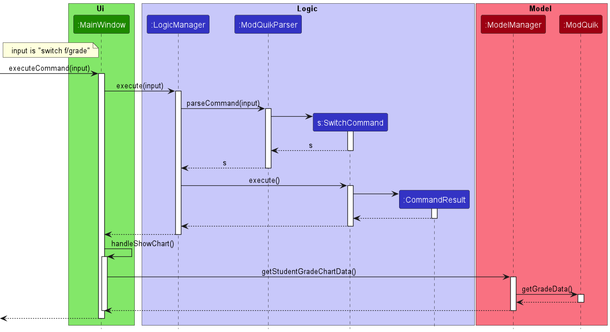
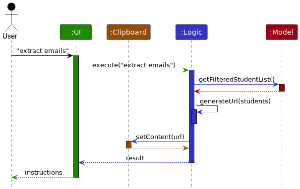

* Table of Contents
{:toc}

--------------------------------------------------------------------------------------------------------------------

## **Acknowledgements**

* {list here sources of all reused/adapted ideas, code, documentation, and third-party libraries -- include links to the original source as well}

--------------------------------------------------------------------------------------------------------------------

## **Setting up, getting started**

Refer to the guide [_Setting up and getting started_](SettingUp.md).

--------------------------------------------------------------------------------------------------------------------

## **Design**

:bulb: **Tip:** The `.puml` files used to create diagrams in this document can be found in the [diagrams](https://github.com/se-edu/addressbook-level3/tree/master/docs/diagrams/) folder. Refer to the [_PlantUML Tutorial_ at se-edu/guides](https://se-education.org/guides/tutorials/plantUml.html) to learn how to create and edit diagrams.

### Architecture

The ***Architecture Diagram*** given above explains the high-level design of the App.

Given below is a quick overview of main components and how they interact with each other.

**Main components of the architecture**

**`Main`** has two classes called [`Main`](https://github.com/se-edu/addressbook-level3/tree/master/src/main/java/seedu/address/Main.java) and [`MainApp`](https://github.com/se-edu/addressbook-level3/tree/master/src/main/java/seedu/address/MainApp.java). It is responsible for,
* At app launch: Initializes the components in the correct sequence, and connects them up with each other.
* At shut down: Shuts down the components and invokes cleanup methods where necessary.

[**`Commons`**](#common-classes) represents a collection of classes used by multiple other components.

The rest of the App consists of four components.

* [**`UI`**](#ui-component): The UI of the App.
* [**`Logic`**](#logic-component): The command executor.
* [**`Model`**](#model-component): Holds the data of the App in memory.
* [**`Storage`**](#storage-component): Reads data from, and writes data to, the hard disk.

**How the architecture components interact with each other**

The *Sequence Diagram* below shows how the components interact with each other for the scenario where the user issues the command `delete 1`.

Each of the four main components (also shown in the diagram above),

* defines its *API* in an `interface` with the same name as the Component.
* implements its functionality using a concrete `{Component Name}Manager` class (which follows the corresponding API `interface` mentioned in the previous point.

For example, the `Logic` component defines its API in the `Logic.java` interface and implements its functionality using the `LogicManager.java` class which follows the `Logic` interface. Other components interact with a given component through its interface rather than the concrete class (reason: to prevent outside component's being coupled to the implementation of a component), as illustrated in the (partial) class diagram below.

The sections below give more details of each component.

### UI component

The **API** of this component is specified in [`Ui.java`](https://github.com/se-edu/addressbook-level3/tree/master/src/main/java/seedu/address/ui/Ui.java)

The UI consists of a `MainWindow` that is made up of parts e.g.`CommandBox`, `ResultDisplay`, `PersonListPanel`, `StatusBarFooter` etc. All these, including the `MainWindow`, inherit from the abstract `UiPart` class which captures the commonalities between classes that represent parts of the visible GUI.

The `UI` component uses the JavaFx UI framework. The layout of these UI parts are defined in matching `.fxml` files that are in the `src/main/resources/view` folder. For example, the layout of the [`MainWindow`](https://github.com/se-edu/addressbook-level3/tree/master/src/main/java/seedu/address/ui/MainWindow.java) is specified in [`MainWindow.fxml`](https://github.com/se-edu/addressbook-level3/tree/master/src/main/resources/view/MainWindow.fxml)

The `UI` component,

* executes user commands using the `Logic` component.
* listens for changes to `Model` data so that the UI can be updated with the modified data.
* keeps a reference to the `Logic` component, because the `UI` relies on the `Logic` to execute commands.
* depends on some classes in the `Model` component, as it displays `Person` object residing in the `Model`.

### Logic component

**API** : [`Logic.java`](https://github.com/se-edu/addressbook-level3/tree/master/src/main/java/seedu/address/logic/Logic.java)

Here's a (partial) class diagram of the `Logic` component:

How the `Logic` component works:
1. When `Logic` is called upon to execute a command, it uses the `AddressBookParser` class to parse the user command.
1. This results in a `Command` object (more precisely, an object of one of its subclasses e.g., `AddCommand`) which is executed by the `LogicManager`.
1. The command can communicate with the `Model` when it is executed (e.g. to add a student).
1. The result of the command execution is encapsulated as a `CommandResult` object which is returned back from `Logic`.

The Sequence Diagram below illustrates the interactions within the `Logic` component for the `execute("delete 1")` API call.

:information_source: **Note:** The lifeline for `DeleteCommandParser` should end at the destroy marker (X) but due to a limitation of PlantUML, the lifeline reaches the end of diagram.

Here are the other classes in `Logic` (omitted from the class diagram above) that are used for parsing a user command:

How the parsing works:
* When called upon to parse a user command, the `AddressBookParser` class creates an `XYZCommandParser` (`XYZ` is a placeholder for the specific command name e.g., `AddCommandParser`) which uses the other classes shown above to parse the user command and create a `XYZCommand` object (e.g., `AddCommand`) which the `AddressBookParser` returns back as a `Command` object.
* All `XYZCommandParser` classes (e.g., `AddCommandParser`, `DeleteCommandParser`, ...) inherit from the `Parser` interface so that they can be treated similarly where possible e.g, during testing.

### Model component
**API** : [`Model.java`](https://github.com/se-edu/addressbook-level3/tree/master/src/main/java/seedu/address/model/Model.java)

The `Model` component,

* stores the address book data i.e., all `Person` objects (which are contained in a `UniquePersonList` object).
* stores the currently 'selected' `Person` objects (e.g., results of a search query) as a separate _filtered_ list which is exposed to outsiders as an unmodifiable `ObservableList<Person>` that can be 'observed' e.g. the UI can be bound to this list so that the UI automatically updates when the data in the list change.
* stores a `UserPref` object that represents the user’s preferences. This is exposed to the outside as a `ReadOnlyUserPref` objects.
* does not depend on any of the other three components (as the `Model` represents data entities of the domain, they should make sense on their own without depending on other components)

:information_source: **Note:** An alternative (arguably, a more OOP) model is given below. It has a `Tag` list in the `AddressBook`, which `Person` references. This allows `AddressBook` to only require one `Tag` object per unique tag, instead of each `Person` needing their own `Tag` objects. 

### Storage component

**API** : [`Storage.java`](https://github.com/se-edu/addressbook-level3/tree/master/src/main/java/seedu/address/storage/Storage.java)

The `Storage` component,
* can save both address book data and user preference data in json format, and read them back into corresponding objects.
* inherits from both `AddressBookStorage` and `UserPrefStorage`, which means it can be treated as either one (if only the functionality of only one is needed).
* depends on some classes in the `Model` component (because the `Storage` component's job is to save/retrieve objects that belong to the `Model`)

### Common classes

Classes used by multiple components are in the `seedu.addressbook.commons` package.

--------------------------------------------------------------------------------------------------------------------

## **Implementation**

This section describes some noteworthy details on how certain features are implemented.

### Show grade feature

#### Proposed Implementation

The proposed show grade mechanism is implemented mainly using the help of `AddressBook#getGradeData`. It extends the `Command` class and implements `ShowGradeCommand#excute`. The `show grade` command can be used to show a student's grade pie chart and the value of each categorical data.

The following sequence diagram shows how the show grade command works.

Given below is an example usage scenario and how the show grade mechanism behaves at each step.

### Extract emails

This feature allows a TA to easily mass email a selected group of students. A typical workflow is as such:
1. Use the `find` command to show a selected group of students of interest.
2. Use the `extract emails` command to generate a [mailto:](https://en.wikipedia.org/wiki/Mailto) link, which is copied to the clipboard
3. Open mailto: link using a mail app, typically on the browser.

#### Current Implementation
The following sequence diagram shows how the extract emails command works.

### \[Proposed\] Undo/redo feature

#### Proposed Implementation

The proposed undo/redo mechanism is facilitated by `VersionedAddressBook`. It extends `AddressBook` with an undo/redo history, stored internally as an `addressBookStateList` and `currentStatePointer`. Additionally, it implements the following operations:

* `VersionedAddressBook#commit()` — Saves the current address book state in its history.
* `VersionedAddressBook#undo()` — Restores the previous address book state from its history.
* `VersionedAddressBook#redo()` — Restores a previously undone address book state from its history.

These operations are exposed in the `Model` interface as `Model#commitAddressBook()`, `Model#undoAddressBook()` and `Model#redoAddressBook()` respectively.

Given below is an example usage scenario and how the undo/redo mechanism behaves at each step.

Step 1. The user launches the application for the first time. The `VersionedAddressBook` will be initialized with the initial address book state, and the `currentStatePointer` pointing to that single address book state.

Step 2. The user executes `delete 5` command to delete the 5th student in the address book. The `delete` command calls `Model#commitAddressBook()`, causing the modified state of the address book after the `delete 5` command executes to be saved in the `addressBookStateList`, and the `currentStatePointer` is shifted to the newly inserted address book state.

Step 3. The user executes `add n/David …​` to add a new student. The `add` command also calls `Model#commitAddressBook()`, causing another modified address book state to be saved into the `addressBookStateList`.

:information_source: **Note:** If a command fails its execution, it will not call `Model#commitAddressBook()`, so the address book state will not be saved into the `addressBookStateList`.

Step 4. The user now decides that adding the student was a mistake, and decides to undo that action by executing the `undo` command. The `undo` command will call `Model#undoAddressBook()`, which will shift the `currentStatePointer` once to the left, pointing it to the previous address book state, and restores the address book to that state.

:information_source: **Note:** If the `currentStatePointer` is at index 0, pointing to the initial AddressBook state, then there are no previous AddressBook states to restore. The `undo` command uses `Model#canUndoAddressBook()` to check if this is the case. If so, it will return an error to the user rather
than attempting to perform the undo.

The following sequence diagram shows how the undo operation works:

:information_source: **Note:** The lifeline for `UndoCommand` should end at the destroy marker (X) but due to a limitation of PlantUML, the lifeline reaches the end of diagram.

The `redo` command does the opposite — it calls `Model#redoAddressBook()`, which shifts the `currentStatePointer` once to the right, pointing to the previously undone state, and restores the address book to that state.

:information_source: **Note:** If the `currentStatePointer` is at index `addressBookStateList.size() - 1`, pointing to the latest address book state, then there are no undone AddressBook states to restore. The `redo` command uses `Model#canRedoAddressBook()` to check if this is the case. If so, it will return an error to the user rather than attempting to perform the redo.

Step 5. The user then decides to execute the command `list`. Commands that do not modify the address book, such as `list`, will usually not call `Model#commitAddressBook()`, `Model#undoAddressBook()` or `Model#redoAddressBook()`. Thus, the `addressBookStateList` remains unchanged.

Step 6. The user executes `clear`, which calls `Model#commitAddressBook()`. Since the `currentStatePointer` is not pointing at the end of the `addressBookStateList`, all address book states after the `currentStatePointer` will be purged. Reason: It no longer makes sense to redo the `add n/David …​` command. This is the behavior that most modern desktop applications follow.

The following activity diagram summarizes what happens when a user executes a new command:

#### Design considerations:

**Aspect: How undo & redo executes:**

* **Alternative 1 (current choice):** Saves the entire address book.
  * Pros: Easy to implement.
  * Cons: May have performance issues in terms of memory usage.

* **Alternative 2:** Individual command knows how to undo/redo by
  itself.
  * Pros: Will use less memory (e.g. for `delete`, just save the student being deleted).
  * Cons: We must ensure that the implementation of each individual command are correct.

_{more aspects and alternatives to be added}_

### \[Proposed\] Data archiving

_{Explain here how the data archiving feature will be implemented}_

--------------------------------------------------------------------------------------------------------------------

## **Documentation, logging, testing, configuration, dev-ops**

* [Documentation guide](Documentation.md)
* [Testing guide](Testing.md)
* [Logging guide](Logging.md)
* [Configuration guide](Configuration.md)
* [DevOps guide](DevOps.md)

--------------------------------------------------------------------------------------------------------------------

## **Appendix: Requirements**

### Product scope

**Target user profile**: NUS teaching assistants.

**Value proposition**: we want to evolve AB3 such that the fast-typist teaching assistants are able to search up the students and tutors in their courses, as well as the tasks assigned to each of them more efficiently.

### User stories

Priorities: High (must have) - `* * *`, Medium (nice to have) - `* *`, Low (unlikely to have) - `*`

| Priority | As a …​                                    | I want to …​                                      | So that I can…​                                        |
|----------|--------------------------------------------|---------------------------------------------------|--------------------------------------------------------|
| `* * *`  | teaching assistant                                  | add student into my classes                       | track the list of students in my classes               |
| `* * `   | teaching assistant                                  | edit a student's information                      | update any changes to a student's information          |
| `* * *`  | teaching assistant                                  | find a student by their name                      | get a student information quickly                      |
| `* * *`  | teaching assistant                                  | find a student by their student ID                | get their name quickly while grading their assignments |
| `* * *`  | teaching assistant                                  | remove a student from my classes                  | remove students who decide to drop the module          |
| `* * *`  | teaching assistant                                  | clear all students in my classes                  | clear all students at once after a semester            |
| `* * *`  | teaching assistant                                  | add a new reminder                                | keep track of any tasks I have                         |
| `* * *`  | teaching assistant                                  | edit a reminder                                   | change the description of my task                      |
| `* * *`  | teaching assistant                                  | delete a reminder                                 | delete any reminders that are not needed anymore       |
| `* * *`  | teaching assistant                                  | clear all reminders                               | clear all reminder slots at once after a semester      |
| `* * *`  | teaching assistant                                  | mark a reminder as done                           | keep track which tasks are done                        |
| `* * *`  | teaching assistant                                  | unmark a reminder as not done                     | reverse any task I accidentally marked as done         |
| `* * *`  | teaching assistant                                  | add a new consult slot                            | keep track of all my consults                          |
| `* * *`  | teaching assistant                                  | edit a consult slot                               | change an added consults quickly                       |
| `* * *`  | teaching assistant                                  | delete a consult slot                             | remove consults that are cancelled                     |
| `* * *`  | teaching assistant                                  | clear all consult slots                           | clear all consultation slot at once after a semester   |
| `* * *`  | teaching assistant                                  | add a new tutorial slot                           | keep track of all my tutorials                         |
| `* * `   | teaching assistant                                  | edit a tutorial slot                              | change the details of my tutorial                      |
| `* * *`  | teaching assistant                                  | delete a tutorial slot                            | remove unwanted tutorials                              |
| `* * *`  | teaching assistant                                  | clear all tutorial slots                          | clear all tutorial at once after a semester            |
| `* * *`  | teaching assistant                                  | see a pie chart summarizing my students' grades   | keep track of my students' performances                |

*{More to be added}*

### Use cases

(For all use cases below, the **System** is the `ModQuik` and the **Actor** is the `user`, unless specified otherwise)

**Use case: Add a reminder**

**MSS**

1. User requests to add a reminder
2. System adds the reminder
3. System displays the success message

    Use case ends.

**Extensions**

* 1a. The input does not follow the format.

    * 1a1. System shows an error message.

        Use case ends.

* 1b. The input does not include all required parameters.

    * 1b1. System shows an error message.

        Use case ends.

**Use case: Delete a tutorial slot**

**MSS**

1. User requests the list of tutorial slot
2. System shows the list of tutorial slot
3. User requests to delete a certain tutorial slot
4. System deletes the specified tutorial slot 
5. System displays the success message

    Use case ends.

**Extensions**

* 2a. The list is empty

    Use case ends.

* 3a. The given index is invalid.

    * 3a1. System shows an error message.

      Use case resumes at step 2.

*{More to be added}*

### Non-Functional Requirements

1. Should work on any _mainstream OS_ as long as it has Java `11` or above installed.
2. Should be able to hold up to 1000 students and TAs without a noticeable sluggishness in performance for typical usage.
3. A teaching assistant with above average typing speed for regular English text (i.e. not code, not system admin commands) should be able to accomplish most of the tasks faster using commands than using the mouse.
4. The application should process all commands in a reasonably short time (less than 5 seconds).
5. The application should be able to run without Internet connectivity.
6. The source code should be open source.
*{More to be added}*

### Glossary

* **Mainstream OS**: Windows, Linux, Unix, OS-X
* **TA**: Teaching Assistant

--------------------------------------------------------------------------------------------------------------------

## **Appendix: Instructions for manual testing**

Given below are instructions to test the app manually.

:information_source: **Note:** These instructions only provide a starting point for testers to work on;
testers are expected to do more *exploratory* testing.

### Launch and shutdown

1. Initial launch

   1. Download the jar file and copy into an empty folder

   1. Double-click the jar file Expected: Shows the GUI with a set of sample contacts. The window size may not be optimum.

1. Saving window preferences

   1. Resize the window to an optimum size. Move the window to a different location. Close the window.

   1. Re-launch the app by double-clicking the jar file. 
       Expected: The most recent window size and location is retained.

1. _{ more test cases …​ }_

### Tutorial

#### Adding a tutorial

Do the test cases sequentially to ensure correct expectation.

1. Adding a tutorial while tutorial tab is being shown. 

   1. Prerequisites: Switch to tutorial tab using the `switch f/tutorial` command. Ensure tutorials data are empty by using `clear f/tutorial` (you may skip this if you do not have any tutorials).

   2. Test case: `add tutorial n/G08 m/CS2101 v/COM2-0209 T/16:00-18:00 D/2` 
      Expected:  A new tutorial is added to the tutorial list. A success message containing details of the added tutorial is shown in result display box and the list of tutorials is shown.

   3. Test case: `add tutorial n/G02 m/CS2101 v/COM2-0209 T/15:00-17:00 D/2` 
      Expected: Conflicting tutorial error message is shown.

   4. Test case: `add tutorial n/G02 m/CS2101 v/COM2-0209 T/19:00-17:00 D/2` 
      Expected: Error message is shown as time range is invalid. No tutorial is added. 

   5. Test case: `add tutorial n/G02 m/CS2101` 
      Expected: Error message is shown as missing prefix. No tutorial is added.
   
   6. Other incorrect add tutorial commands to try: `add tutorials`, `add tutorial n/G01 m/sususu v/ T/ D/`, `...`  
      Expected: Error message is shown in the result display box.

2. Adding a tutorial while tutorial tab is not being shown.

   1. Prerequisites: Switch to another tab that is not tutorial, for example, using the `switch f/student` command. 
    
   2. Test case: `add tutorial n/TW08 m/GEC1027 v/AS1-0203 T/10:00-11:00 D/10` 
      Expected:  Error message is shown as day is invalid. Main display remains the same.

   3. Test case: `add tutorial n/TW08 m/GEC1027 v/AS1-0203 T/10:00-11:00 D/1` 
      Expected:  A success message containing details of the added tutorial is shown. Main display changes to tutorial and tutorial list is updated.
    
   
#### Deleting a tutorial

1. Deleting a tutorial while tutorial tab is being shown

    1. Prerequisites: Switch to tutorial tab using `switch f/tutorial` command (you can skip this if the main display is already tutorial). Multiple tutorials in the list.

    1. Test case: `delete tutorial 1` 
       Expected: First tutorial is deleted from the list. Details of the deleted tutorial shown in the status message. Tutorial list is updated.

    1. Test case: `delete tutorial 0` 
       Expected: No tutorial is deleted. Error details shown in the status message. Tutorial list remains the same.

    1. Other incorrect delete tutorial commands to try: `delete`, `delete x`, `...` (where x is larger than the list size) 
       Expected: Similar to previous.

#### Editing a tutorial

1. Editing a tutorial while tutorial tab is being shown.

    1. Prerequisites: Switch to tutorial tab using the `switch f/tutorial` command (you may skip this if the main display is already tutorial). There exists at least 1 tutorial in the list.

    2. Test case: `edit tutorial 1 v/LT27` 
       Expected: Venue of first tutorial is edited. Details of the edited tutorial shown in the status message.

    3. Test case: `edit tutorial 0` 
       Expected: No tutorial is edited. Error message shown in result display box.

### Consultation

#### Adding a consultation

Do the test cases sequentially to ensure correct expectation.

1. Adding a consultation while consultation tab is being shown.

    1. Prerequisites: There must exist a tutorial with the same module used in consultation. Ensure module existing by using `clear f/tutorial` then `add tutorial n/W10-1 m/CS2103T v/COM2-0209 T/16:00-18:00 D/2` 
       Switch to consultation tab using the `switch f/consultation` command. Ensure consultations data are empty by using `clear f/consultation` (you may skip this if you do not have any consultations).

    2. Test case: `add consultation n/Review past year paper m/CS2103T v/COM2-0109 D/2022-12-12 T/16:00-18:00 d/AY2019-2020 Question 3,6,8` 
       Expected:  A new consultation is added to the tutorial list. A success message containing details of the added consultation is shown in result display box and the list of consultations is shown.

    3. Test case: `add consultation n/Review past year paper m/CS2103T v/COM2-0109 D/2022-12-12 T/17:00-19:00 d/AY2019-2020 Question 3,6,8` 
       Expected: Conflicting consultation error message is shown.

    4. Test case: `add consultation n/Review past year paper m/CS2103T v/COM2-0109 D/2022-12-12 T/19:00-17:00 d/AY2019-2020 Question 3,6,8` 
       Expected: Error message is shown as time range is invalid. No consultation is added.

    5. Test case: `add consultation n/Review past year paper m/CS2103T v/COM2-0109 D/2022-12-12 T/16:00-18:00`  
       Expected: Error message is shown as missing prefix. No consultation is added.

    6. Test case: `add consultation n/Review past year paper m/CS2101 v/COM2-0109 D/2022-12-12 T/10:00-12:00 d/AY2019-2020 Question 3,6,8`  
       Expected: Error message is shown as module does not exist. No consultation is added.

    7. Other incorrect add consultation commands to try: `add consultation`, `add consultation n/testing m/sususu v/ T/ D/`, `...`  
       Expected: Error message is shown in the result display box.

2. Adding a consultation while consultation tab is not being shown.

    1. Prerequisites: There must exist a tutorial with the same module used in consultation. Ensure module existing by using `clear f/tutorial` then `add tutorial n/W10-1 m/CS2103T v/COM2-0209 T/16:00-18:00 D/2` 
       Switch to another tab that is not consultation, for example, using the `switch f/student` command.

    2. Test case: `add consultation n/Review past year paper m/CS2103T v/COM2-0109 D/2022-12-12 T/1900-1700 d/AY2019-2020 Question 3,6,8` 
       Expected: Error message is shown as time range format is invalid. Main display remains the same.

    3. Test case: `add consultation n/Review past year paper m/CS2103T v/COM2-0109 D/2022-12-12 T/16:00-18:00 d/AY2019-2020 Question 3,6,8` 
       Expected:  A success message containing details of the added consultation is shown. Main display changes to consultation and consultation list is updated.

#### Deleting a consultation

1. Deleting a consultation while consultation tab is being shown

    1. Prerequisites: Switch to consultation tab using `switch f/consultation` command (you can skip this if the main display is already consultation). Multiple consultation in the list.

    1. Test case: `delete consultation 1` 
       Expected: First consultation is deleted from the list. Details of the deleted consultation shown in the status message. Consultation list is updated.

    1. Test case: `delete consultation 0` 
       Expected: No consultation is deleted. Error details shown in the status message. Consultation list remains the same.

    1. Other incorrect delete consultation commands to try: `delete`, `delete x`, `...` (where x is larger than the list size) 
       Expected: Similar to previous.

#### Editing a tutorial

1. Editing a tutorial while tutorial tab is being shown.

    1. Prerequisites: Switch to tutorial tab using the `switch f/tutorial` command (you may skip this if the main display is already tutorial). There exists at least 1 tutorial in the list.

    2. Test case: `edit tutorial 1 v/LT27` 
       Expected: Venue of first tutorial is edited. Details of the edited tutorial shown in the status message.

    3. Test case: `edit tutorial 0` 
       Expected: No tutorial is edited. Error message shown in result display box.

### Deleting a student

1. Deleting a student while all students are being shown

   1. Prerequisites: List all students using the `list` command. Multiple students in the list.

   1. Test case: `delete 1` 
      Expected: First contact is deleted from the list. Details of the deleted contact shown in the status message. Timestamp in the status bar is updated.

   1. Test case: `delete 0` 
      Expected: No student is deleted. Error details shown in the status message. Status bar remains the same.

   1. Other incorrect delete commands to try: `delete`, `delete x`, `...` (where x is larger than the list size) 
      Expected: Similar to previous.

1. _{ more test cases …​ }_

### Saving data

1. Dealing with missing/corrupted data files

   1. _{explain how to simulate a missing/corrupted file, and the expected behavior}_

1. _{ more test cases …​ }_
