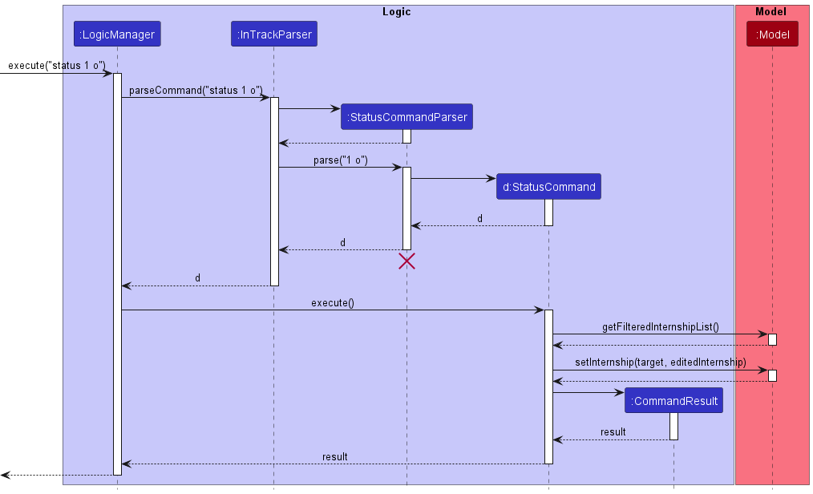
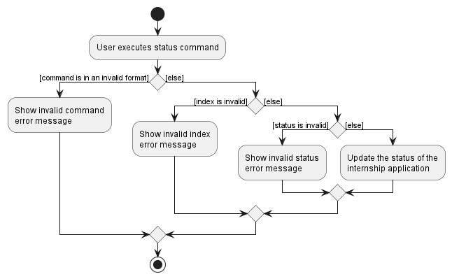
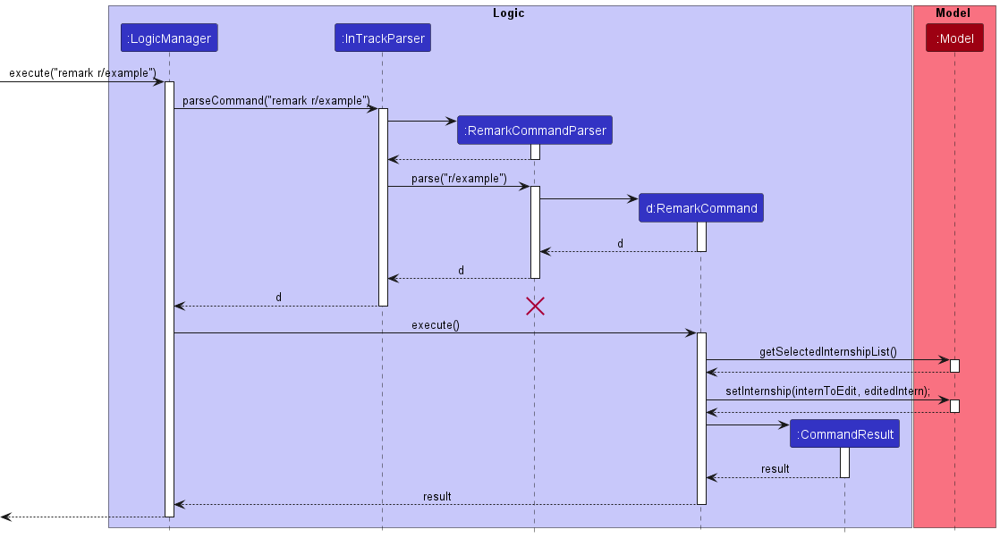
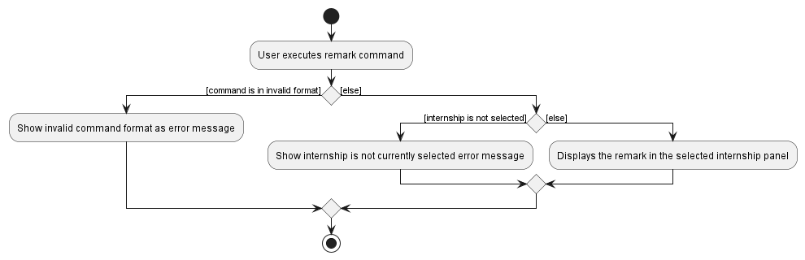
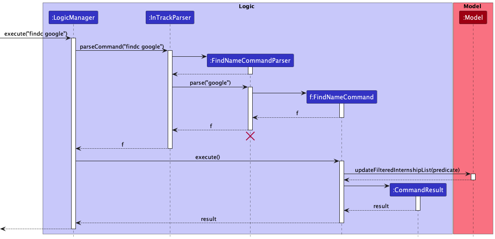
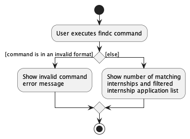

* Table of Contents
{:toc}

--------------------------------------------------------------------------------------------------------------------

## **Acknowledgements**

* {list here sources of all reused/adapted ideas, code, documentation, and third-party libraries -- include links to the original source as well}

--------------------------------------------------------------------------------------------------------------------

## **Setting up, getting started**

Refer to the guide [_Setting up and getting started_](SettingUp.md).

--------------------------------------------------------------------------------------------------------------------

## **Design**

:bulb: **Tip:** The `.puml` files used to create diagrams in this document can be found in the [diagrams](https://github.com/se-edu/addressbook-level3/tree/master/docs/diagrams/) folder. Refer to the [_PlantUML Tutorial_ at se-edu/guides](https://se-education.org/guides/tutorials/plantUml.html) to learn how to create and edit diagrams.

### Architecture

The ***Architecture Diagram*** given above explains the high-level design of the App.

Given below is a quick overview of main components and how they interact with each other.

**Main components of the architecture**

**`Main`** has two classes called [`Main`](https://github.com/se-edu/addressbook-level3/tree/master/src/main/java/seedu/address/Main.java) and [`MainApp`](https://github.com/se-edu/addressbook-level3/tree/master/src/main/java/seedu/address/MainApp.java). It is responsible for,
* At app launch: Initializes the components in the correct sequence, and connects them up with each other.
* At shut down: Shuts down the components and invokes cleanup methods where necessary.

[**`Commons`**](#common-classes) represents a collection of classes used by multiple other components.

The rest of the App consists of four components.

* [**`UI`**](#ui-component): The UI of the App.
* [**`Logic`**](#logic-component): The command executor.
* [**`Model`**](#model-component): Holds the data of the App in memory.
* [**`Storage`**](#storage-component): Reads data from, and writes data to, the hard disk.

**How the architecture components interact with each other**

The *Sequence Diagram* below shows how the components interact with each other for the scenario where the user issues the command `delete 1`.

Each of the four main components (also shown in the diagram above),

* defines its *API* in an `interface` with the same name as the Component.
* implements its functionality using a concrete `{Component Name}Manager` class (which follows the corresponding API `interface` mentioned in the previous point.

For example, the `Logic` component defines its API in the `Logic.java` interface and implements its functionality using the `LogicManager.java` class which follows the `Logic` interface. Other components interact with a given component through its interface rather than the concrete class (reason: to prevent outside component's being coupled to the implementation of a component), as illustrated in the (partial) class diagram below.

The sections below give more details of each component.

### UI component

The **API** of this component is specified in [`Ui.java`](https://github.com/se-edu/addressbook-level3/tree/master/src/main/java/seedu/address/ui/Ui.java)

The UI consists of a `MainWindow` that is made up of parts e.g.`CommandBox`, `ResultDisplay`, `InternshipListPanel`, `StatusBarFooter` etc. All these, including the `MainWindow`, inherit from the abstract `UiPart` class which captures the commonalities between classes that represent parts of the visible GUI.

The `UI` component uses the JavaFx UI framework. The layout of these UI parts are defined in matching `.fxml` files that are in the `src/main/resources/view` folder. For example, the layout of the [`MainWindow`](https://github.com/se-edu/addressbook-level3/tree/master/src/main/java/seedu/address/ui/MainWindow.java) is specified in [`MainWindow.fxml`](https://github.com/se-edu/addressbook-level3/tree/master/src/main/resources/view/MainWindow.fxml)

The `UI` component,

* executes user commands using the `Logic` component.
* listens for changes to `Model` data so that the UI can be updated with the modified data.
* keeps a reference to the `Logic` component, because the `UI` relies on the `Logic` to execute commands.
* depends on some classes in the `Model` component, as it displays `Internship` object residing in the `Model`.

### Logic component

**API** : [`Logic.java`](https://github.com/se-edu/addressbook-level3/tree/master/src/main/java/seedu/address/logic/Logic.java)

Here's a (partial) class diagram of the `Logic` component:

How the `Logic` component works:
1. When `Logic` is called upon to execute a command, it uses the `AddressBookParser` class to parse the user command.
1. This results in a `Command` object (more precisely, an object of one of its subclasses e.g., `AddCommand`) which is executed by the `LogicManager`.
1. The command can communicate with the `Model` when it is executed (e.g. to add an internship).
1. The result of the command execution is encapsulated as a `CommandResult` object which is returned back from `Logic`.

The Sequence Diagram below illustrates the interactions within the `Logic` component for the `execute("delete 1")` API call.

:information_source: **Note:** The lifeline for `DeleteCommandParser` should end at the destroy marker (X) but due to a limitation of PlantUML, the lifeline reaches the end of diagram.

Here are the other classes in `Logic` (omitted from the class diagram above) that are used for parsing a user command:

How the parsing works:
* When called upon to parse a user command, the `AddressBookParser` class creates an `XYZCommandParser` (`XYZ` is a placeholder for the specific command name e.g., `AddCommandParser`) which uses the other classes shown above to parse the user command and create a `XYZCommand` object (e.g., `AddCommand`) which the `AddressBookParser` returns back as a `Command` object.
* All `XYZCommandParser` classes (e.g., `AddCommandParser`, `DeleteCommandParser`, ...) inherit from the `Parser` interface so that they can be treated similarly where possible e.g, during testing.

### Model component
**API** : [`Model.java`](https://github.com/se-edu/addressbook-level3/tree/master/src/main/java/seedu/address/model/Model.java)

The `Model` component,

* stores the address book data i.e., all `Internship` objects (which are contained in a `UniqueInternshipList` object).
* stores the currently 'selected' `Internship` objects (e.g., results of a search query) as a separate _filtered_ list which is exposed to outsiders as an unmodifiable `ObservableList<Internship>` that can be 'observed' e.g. the UI can be bound to this list so that the UI automatically updates when the data in the list change.
* stores a `UserPref` object that represents the user’s preferences. This is exposed to the outside as a `ReadOnlyUserPref` objects.
* does not depend on any of the other three components (as the `Model` represents data entities of the domain, they should make sense on their own without depending on other components)

:information_source: **Note:** An alternative (arguably, a more OOP) model is given below. It has a `Tag` list in the `AddressBook`, which `Internship` references. This allows `AddressBook` to only require one `Tag` object per unique tag, instead of each `Internship` needing their own `Tag` objects. 

### Storage component

**API** : [`Storage.java`](https://github.com/se-edu/addressbook-level3/tree/master/src/main/java/seedu/address/storage/Storage.java)

The `Storage` component,
* can save both address book data and user preference data in json format, and read them back into corresponding objects.
* inherits from both `AddressBookStorage` and `UserPrefStorage`, which means it can be treated as either one (if only the functionality of only one is needed).
* depends on some classes in the `Model` component (because the `Storage` component's job is to save/retrieve objects that belong to the `Model`)

### Common classes

Classes used by multiple components are in the `seedu.addressbook.commons` package.

--------------------------------------------------------------------------------------------------------------------

## **Implementation**

This section describes some noteworthy details on how certain features are implemented.

### Add internship application feature

#### About this feature

The add internship application feature allows users to quickly add an internship application in the tracker via the
The add internship application feature allows users to quickly add an internship application in the tracker via the
command `add n/NAME p/POSITION hp/PHONE e/EMAIL a/ADDRESS [t/TAG]...`.

#### How it is implemented

The `add` command is facilitated by the `AddCommand` and the `AddCommandParser`. It uses the `ArgumentTokenizer#tokenize(String argString, Prefix... prefixes)`
to extract the relevant inputs for each field. A new `Internship` object is then created with the corresponding name, position, phone, email, address and tag.
The status field, by default, will be set to `Progress`. The `InTrack#addInternship(Internship target)` which is exposed in the `Model` interface as
`Model#addInternship(Internship target, Internship editedInternship)` is called to add the new `Internship` object to the list of internship applications.

#### Parsing user input

1. The user inputs the `add` command.
2. The `InTrackParser` processes the input and creates a new `AddCommandParser`.
3. The `AddCommandParser` then calls `ArgumentTokenizer#tokenize(String argString, Prefix... prefixes)` to extract the relevant inputs for each field.
   If any prefix is absent but compulsory or invalid, a `ParseException` would be thrown.
4. The respective `Name`, `Position`, `Phone`, `Email`, `Address` and `Tag` constructors then check for the validity of parsed inputs.
   If any of the parsed inputs are absent but compulsory or invalid, a `ParseException` would be thrown.
5. The `AddCommandParser` then creates the `AddCommand` based on the processed input.

#### Command execution

1. The `LogicManager` executes the `AddCommand`.
2. The `AddCommand` then creates a new `Internship` object with the corresponding parsed inputs for each field.
3. The `AddCommand` then calls `InTrack#addInternship(Internship target, Internship editedInternship)` to add the
   new `Internship` object to the list of internship applications.

#### Displaying of result

1. Finally, the `AddCommand` creates a `CommandResult` with a success message and returns it to the `LogicManager`
   to complete the command execution. The GUI would also be updated with the change of status.

The following sequence diagram shows how the `add` command works:

The following activity diagram shows what happens when a user executes a `add` command:

#### Design considerations

**Aspect: Command to add status of an internship application**
Most internship applications added by users would still be in progress, so a default "Progress" status is provided for
each new `Internship` instead of requiring the user to provide one initially, saving time. As such, there is no need for
a prefix for the `Status` field.

### Update internship application status feature

#### About this feature

The update internship application status feature allows users to quickly update the status of an internship application
in the tracker via the command `status INDEX STATUS`, where `INDEX` must be a positive integer within the list and
`STATUS` must be either `o` (for **O**ffered), `p` (for in **P**rogress) or `r` (for **R**ejected).

#### How it is implemented

The `status` command is facilitated by the `StatusCommand` and the `StatusCommandParser`. It uses the `List#get(int index)`
on the list of internship applications returned from the `Model#getFilteredInternshipList()` to get the target `Internship`
object to be updated. A new `Internship` object is then created with the new status. The
`InTrack#setInternship(Internship target, Internship editedInternship)` which is exposed in the `Model` interface as
`Model#setInternship(Internship target, Internship editedInternship)` is called to replace the target `Internship` object
with the updated one.

#### Parsing user input

1. The user inputs the `status` command.
2. The `InTrackParser` processes the input and creates a new `StatusCommandParser`.
3. The `StatusCommandParser` then calls `ParserUtil#parseIndex(String oneBasedIndex)` to check for the validity of INDEX.
If `INDEX` is absent or invalid, a `ParseException` would be thrown.
4. The `StatusCommandParser` then checks for the validity of STATUS. If `STATUS` is absent or invalid, a `ParseException`
would be thrown.
5. The `StatusCommandParser` then creates the `StatusCommand` based on the processed input.

#### Command execution

1. The `LogicManager` executes the `StatusCommand`.
2. The `StatusCommand` calls the `Model#getFilteredPersonList()` and `List#get(int index)` to get the target `Internship`
object to be updated based on the provided `INDEX`.
3. The `StatusCommand` then creates a new `Internship` object with the same variables as the target one except with the
new status.
4. The `StatusCommand` then calls `InTrack#setInternship(Internship target, Internship editedInternship)` to replace the
target `Internship` object with the updated one.

#### Displaying of result

1. Finally, the `StatusCommand` creates a `CommandResult` with a success message and returns it to the `LogicManager`
to complete the command execution. The GUI would also be updated with the change of status.

The following sequence diagram shows how the `status` command works:

The following activity diagram shows what happens when a user executes a `status` command:

#### Design considerations

**Aspect: Command to update status of an internship application**
Most internship applications added by users would still be in progress, so a default "Progress" status is provided for
each new `Internship` instead of requiring the user to provide one initially, saving time. As such, there is no need for
a prefix for the `Status` field and the `edit` command will not work in this case. Having a separate `status` command
allows for the format to be kept short and simple which further increases the ease of updating the status of internship
applications.

### Add internship application task feature

#### About this feature

The add internship application task feature allows users to add a task associated to an internship application
in the tracker via the command `addtask INDEX TASKNAME /at TASKTIME`, where `INDEX` must be a positive integer within
the list, `TASKNAME` must not be an empty string, and `TASKTIME` must be in the format `dd-MM-yyyy HH:mm`.

#### How it is implemented

The `addtask` command is facilitated by the `AddTaskCommand` and `AddTaskCommandParser`. It uses the
`List#get(int index)` on the list of internship applications returned from the `Model#getFilteredInternshipList()` to
get the target `Internship` object to be updated. A new `Internship` object is then created with the new `Task` updated
in the `List<Task>`. The `InTrack#setInternship(Internship target, Internship editedInternship)` which is exposed in the
`Model` interface as `Model#setInternship(Internship target, Internship editedInternship)` is called to replace the
target `Internship` object with the updated one.

#### Parsing user input

1. The user inputs the `addtask` command.
2. The `InTrackParser` processes the input and creates a new `AddTaskCommandParser`.
3. The `AddTaskCommandParser` then calls `ParserUtil#parseIndex(String oneBasedIndex)` to check for the validity of
`INDEX`. If `INDEX` is absent or invalid, a `ParseException` would be thrown.
4. The `AddTaskCommandParser` then checks for the validity of `TASKNAME` and `TASKTIME`. If either `TASKNAME` or
`TASKTIME` is absent or invalid, a `ParseException` would be thrown.
5. The `AddTaskCommandParser` then creates the `AddTaskCommand` based on the processed input.

#### Command execution

1. The `LogicManager` executes the `AddTaskCommand`.
2. The `AddTaskCommand` calls the `Model#getFilteredPersonList()` and `List#get(int index)` to get the target `Internship`
   object to be updated based on the provided `INDEX`.
3. The `AddTaskCommand` then creates a new `Internship` object with the same variables as the target and adds the new
task to the `List<Task>`.
4. The `AddTaskCommand` then calls `InTrack#setInternship(Internship target, Internship editedInternship)` to replace the
   target `Internship` object with the updated one.

#### Displaying of result

1. Finally, the `AddTaskCommand` creates a `CommandResult` with a success message and returns it to the `LogicManager`
   to complete the command execution. The GUI would also be updated with the new task added.

The following sequence diagram shows how the `addtask` command works:

The following activity diagram shows what happens when a user executes a `addtask` command:

### Add internship remark feature

#### About this feature
The add internship remark feature allows users to add a remark to his/her internship interview information via the command
`remark` `INDEX` `r/`.

### How it is implemented
The implemented `remark` command is facilitated by `RemarkCommand` and `RemarkCommandParser`. It enables users to add a Remark to their internship information.
It uses the `get(int INDEX)` on the list of internships received from `getFilteredInternshipList()` which is exposed to the `Model` interface as `Model#getFilteredInternshipList()` to
get an Internship Object. A new Internship object is then created with the new remark. Then the`InTrack#setInternship(Internship target, Internship editedInternship)` which is exposed in the Model interface as
`Model#setInternship(Internship target, Internship editedInternship)`, is used to replace the old Internship panel with the new one.

Given below is how the remark mechanism behaves at each step.

#### Parsing User input
Step 1. The user inputs the `remark` command  and provide the `INDEX` of the internship the user wants to add the remark to, the `r/` prefix and finally the `REMARK_CONTENT`
that he/she wants to add.

Step 2. The 'InTrackParser' then parses the user input and checks if the command word and arguments are correct before creating a new
`RemarkCommandParser`.

Step 3. The `RemarkCommandParser` then parses the user input and checks if the input variables are correct by checking for the presence of
the prefixes. It also checks whether the command is in the correct format. The correct format of the input is `r/REMARK_CONTENT`.

A `ParseException` will be thrown if the format is incorrect.

Step 4. If the format is correct, `RemarkCommandParser` will create a `RemarkCommand` based on the given inputs.

#### Command execution

Step 5. The `LogicManager` executes the `RemarkCommand`.

Step 6. The `RemarkCommand` obtains a list of `Internship`s via the `getFilteredInternshipList()` method
which is exposed to the `Model` interface as `Model#getFilteredInternshipList()`

Step 7. The `RemarkCommand` obtains the `Internship` object that the user wants to add the remark to via the
`get(int INDEX)` method from list of `Internship`s.

Step 8. The `RemarkCommand` then creates a new `Internship` object with the same variables as the old `Internship` except for the
`REMARK_CONTENT` that the user has input.

Step 9. `RemarkCommand` then call the `Model#setInternship(internshipToEdit, editedInternship)` to replace the old `Internship` with the new `Internship` with the new `Remark`

#### Displaying of result

Step 10. Finally, the `RemarkCommand` creates a `CommandResult` with a success message and returns it to the `LogicManager` to complete the command execution. The
GUI would also be updated on this change in the internship list and update the display of the `Internship` respectively.

The following sequence diagram shows how the `remark` command works:

The following activity diagram summarises what happens when a user executes the `remark` command:

#### Design considerations

**Aspect: Command to add remark to an internship application**
When a user has just added an internship application, he probably has not been to the internship interview yet,
so he would not have any remarks or notes to take about the interview process yet. Thus, the default `remark` field will
be empty for each new `Internship` instead of requiring the user to provide one initially, saving time.

### Find internship application by company name feature

#### About this feature

The find internship application by company name feature allows users to query the list of added internship applications
for applications that match the desired company name via the command `findn COMPANYNAME`, where `COMPANYNAME` must not
be an empty string.

#### How it is implemented

The `findn` command is facilitated by the `FindNameCommand`, `FindNameCommandParser` and the `NameContainsKeywordsPredicate`.
It uses `Model#updateFilteredInternshipList(Predicate<Internship> predicate)` to apply the `NameContainsKeywordsPredicate`
in order to produce a filtered list containing only entries whose names correspond to `COMPANYNAME`.

#### Parsing user input

1. The user inputs the `findn` command.
2. The `InTrackParser` processes the input and creates a new `FindNameCommandParser`.
3. The `FindNameCommandParser` then trims the input to remove whitespace. If the input is an empty string, a `ParseException`
would be thrown.
4. The `FindNameCommandParser` then creates the new `FindNameCommand` based on the processed input.

#### Command execution

1. The `LogicManager` executes the `FindNameCommand`.
2. The `FindNameCommand` calls the `Model#updateFilteredInternshipList(Predicate<Internship> predicate)` to update the
current internship list to only show internship applications matching the provided `COMPANYNAME`.

#### Displaying of result

1. Finally, the `FindNameCommand` creates a `CommandResult` containing the number of matching internship applications
and returns it to the `LogicManager` to complete the command execution. The GUI would also be updated with the change in
list.

The following sequence diagram shows how the `findn` command works:

The following activity diagram shows what happens when a user executes a `findn` command:

### \[Proposed\] Undo/redo feature

#### Proposed Implementation

The proposed undo/redo mechanism is facilitated by `VersionedAddressBook`. It extends `AddressBook` with an undo/redo history, stored internally as an `addressBookStateList` and `currentStatePointer`. Additionally, it implements the following operations:

* `VersionedAddressBook#commit()` — Saves the current address book state in its history.
* `VersionedAddressBook#undo()` — Restores the previous address book state from its history.
* `VersionedAddressBook#redo()` — Restores a previously undone address book state from its history.

These operations are exposed in the `Model` interface as `Model#commitAddressBook()`, `Model#undoAddressBook()` and `Model#redoAddressBook()` respectively.

Given below is an example usage scenario and how the undo/redo mechanism behaves at each step.

Step 1. The user launches the application for the first time. The `VersionedAddressBook` will be initialized with the initial address book state, and the `currentStatePointer` pointing to that single address book state.

Step 2. The user executes `delete 5` command to delete the 5th internship in the address book. The `delete` command calls `Model#commitAddressBook()`, causing the modified state of the address book after the `delete 5` command executes to be saved in the `addressBookStateList`, and the `currentStatePointer` is shifted to the newly inserted address book state.

Step 3. The user executes `add n/David …​` to add a new internship. The `add` command also calls `Model#commitAddressBook()`, causing another modified address book state to be saved into the `addressBookStateList`.

:information_source: **Note:** If a command fails its execution, it will not call `Model#commitAddressBook()`, so the address book state will not be saved into the `addressBookStateList`.

Step 4. The user now decides that adding the internship was a mistake, and decides to undo that action by executing the `undo` command. The `undo` command will call `Model#undoAddressBook()`, which will shift the `currentStatePointer` once to the left, pointing it to the previous address book state, and restores the address book to that state.

:information_source: **Note:** If the `currentStatePointer` is at index 0, pointing to the initial AddressBook state, then there are no previous AddressBook states to restore. The `undo` command uses `Model#canUndoAddressBook()` to check if this is the case. If so, it will return an error to the user rather
than attempting to perform the undo.

The following sequence diagram shows how the undo operation works:

:information_source: **Note:** The lifeline for `UndoCommand` should end at the destroy marker (X) but due to a limitation of PlantUML, the lifeline reaches the end of diagram.

The `redo` command does the opposite — it calls `Model#redoAddressBook()`, which shifts the `currentStatePointer` once to the right, pointing to the previously undone state, and restores the address book to that state.

:information_source: **Note:** If the `currentStatePointer` is at index `addressBookStateList.size() - 1`, pointing to the latest address book state, then there are no undone AddressBook states to restore. The `redo` command uses `Model#canRedoAddressBook()` to check if this is the case. If so, it will return an error to the user rather than attempting to perform the redo.

Step 5. The user then decides to execute the command `list`. Commands that do not modify the address book, such as `list`, will usually not call `Model#commitAddressBook()`, `Model#undoAddressBook()` or `Model#redoAddressBook()`. Thus, the `addressBookStateList` remains unchanged.

Step 6. The user executes `clear`, which calls `Model#commitAddressBook()`. Since the `currentStatePointer` is not pointing at the end of the `addressBookStateList`, all address book states after the `currentStatePointer` will be purged. Reason: It no longer makes sense to redo the `add n/David …​` command. This is the behavior that most modern desktop applications follow.

The following activity diagram summarizes what happens when a user executes a new command:

#### Design considerations:

**Aspect: How undo & redo executes:**

* **Alternative 1 (current choice):** Saves the entire address book.
  * Pros: Easy to implement.
  * Cons: May have performance issues in terms of memory usage.

* **Alternative 2:** Individual command knows how to undo/redo by
  itself.
  * Pros: Will use less memory (e.g. for `delete`, just save the internship being deleted).
  * Cons: We must ensure that the implementation of each individual command are correct.

_{more aspects and alternatives to be added}_

### \[Proposed\] Data archiving

_{Explain here how the data archiving feature will be implemented}_

--------------------------------------------------------------------------------------------------------------------

## **Documentation, logging, testing, configuration, dev-ops**

* [Documentation guide](Documentation.md)
* [Testing guide](Testing.md)
* [Logging guide](Logging.md)
* [Configuration guide](Configuration.md)
* [DevOps guide](DevOps.md)

--------------------------------------------------------------------------------------------------------------------

## **Appendix: Requirements**

### Product scope

**Target user profile**:

* has a need to manage a significant number of internship applications
* prefer desktop apps over other types
* can type fast
* prefers typing to mouse interactions
* is reasonably comfortable using CLI apps

**Value proposition**:

* Manage internship applications faster than a typical mouse/GUI driven app
* Manage multiple internships and provide comparisons between them for better decision-making
* Easily customizable and personalizable to manage internships applications
* Frequent reminders for deadlines

### User stories

Priorities: High (must have) - `* * *`, Medium (nice to have) - `* *`, Low (unlikely to have) - `*`

| Priority | As a …​                                    | I want to …​                                                          | So that I can…​                                                    |
|----------|--------------------------------------------|-----------------------------------------------------------------------|--------------------------------------------------------------------|
| `* * *`  | new user                                   | see usage instructions                                                | learn how to use the App                                           |
| `* * *`  | user                                       | view a list of current internship applications                        | -                                                                  |
| `* * *`  | user                                       | add a new internship application                                      | -                                                                  |
| `* * *`  | user                                       | delete an internship application                                      | remove entries that I no longer need                               |
| `* *`    | user                                       | mark internship applications as completed                             | clearly see my progress                                            |
| `*`      | user                                       | unmark completed internship applications                              | clearly see my progress                                            |
| `* * *`  | forgetful user                             | obtain the information of the company                                 | contact them if I have any queries                                 |
| `*`      | potential user                             | see the app populated with sample data                                | see what the app is like while it is in use                        |
| `* *`    | new user                                   | purge all current data                                                | get rid of experimental data I used for exploring the app          |
| `* * *`  | organized user                             | color code tags for different interviews and statuses                 | sort and prioritize my interview data                              |
| `* *`    | user applying to many internships          | sort application deadlines by time and priority                       | take note of upcoming deadlines                                    |
| `* *`    | user applying to many internships          | record down the dates of the interviews                               | avoid interview clashes                                            |
| `* *`    | user who just started his interviews       | record my mistakes made during interviews                             | reflect on t hem                                                   |
| `* * *`  | user applying to many internships          | search for a specific company via keywords                            | easily find the information I am looking for                       |
| `* *`    | user applying to many internships          | receive reminders about upcoming interviews and deadlines             | not miss any important dates                                       |
| `* * *`  | user applying to many internships          | make my own tags                                                      | sort my applications better                                        |
| `* *`    | user applying to technical internships     | view different stages of my interview such as HR and technical stages | see what phase of the interviews I am at                           |
| `* * *`  | user applying to internships progressively | edit individual application information at any time                   | make sure the information stays relevant                           |
| `* *`    | user applying to technical internships     | filter through my internships by job role                             | to keep track of the roles I have applied for                      |
| `*`      | user applying to many internships          | sort the salaries of each company                                     | compare the options I have                                         |
| `*`      | user applying to many internships          | archive the interviews I have been rejected from                      | avoid cluttering the app with data and also refer to them later on |
| `* *`    | user applying to many internships          | prioritize the companies I am keen on                                 | compare the options I have                                         |
| `* * *`  | frequent user                              | the commands to be simple and memorable                               | access my information quickly and easily                           |
| `*`      | frequent user                              | search for applications through case sensitive searching              | find and sort my internships more easily                           |
| `* *`    | user                                       | view internship periods of different companies                        | more informed about my applications                                |
| `*`      | frequent user                              | have a customizable GUI                                               | have more visible information on my applications                   |
| `* *`    | frequent user                              | compare internship statistics such as internship lengths              | make a more informed choice                                        |
| `*`      | frequent user                              | send feedback to the developers of the application                    | make them optimize the app more                                    |

*{More to be added}*

### Use cases

(For all use cases below, the **System** is the `InTrack` and the **Actor** is the `user`, unless specified otherwise)

**Use case: UC01 - View usage instructions**

**MSS**

1. User requests to view usage instructions.
2. InTrack displays the usage instructions.

    Use case ends.

**Use case: UC02 - View all current internship applications**

**MSS**

1. User requests to list internship applications.
2. InTrack displays a list of internship applications.

   Use case ends.

**Use case: UC03 - Add a new internship application**

**MSS**

1. User requests to add a new internship application to the list.
2. InTrack adds the new internship application.

   Use case ends.

**Extensions**

* 1a. The given command has an invalid format.

    * 1a1. InTrack shows an error message.

      Use case ends.

**Use case: UC04 - Delete an internship application**

**MSS**

1. User <u>views list of current internship applications (UC02)</u>.
2. User requests to delete a specific internship application in the list.
3. InTrack deletes the internship application.

   Use case ends.

**Extensions**

* 3a. The given index is invalid.

    * 3a1. InTrack shows an error message.

      Use case resumes at step 2.

**Use case: UC05 - Mark an internship application as completed**

**MSS**

1. User <u>views list of current internship applications (UC02)</u>.
2. User requests to mark a specific internship application in the list as completed.
3. InTrack marks the internship application as completed.

   Use case ends.

**Extensions**

* 3a. The given index is invalid.

    * 3a1. InTrack shows an error message.

      Use case resumes at step 2.

*{More to be added}*

### Non-Functional Requirements

1. Should work on any _mainstream OS_ as long as it has Java `11` or above installed.
2. Should be able to hold up to 1000 internship applications without a noticeable sluggishness in performance for typical usage.
3. A user with above average typing speed for regular English text (i.e. not code, not system admin commands) should be able to accomplish most of the tasks faster using commands than using the mouse.
4. Data should be stored consistently upon closing and reopening the app
5. System should be usable by a Computing student who has never applied to an internship before
6. System should be easily usable by the majority of Year 2+ Computing students

*{More to be added}*

### Glossary

| Term        | Explanation |
| ----------- | ----------- |
| Mainstream OS | Windows, Linux, Unix, OS-X |
| Graphical User Interface (GUI) | An interface for the user to interact with the system via graphical icons and audio |
| Command Line Interface (CLI) | An interface for the user to input commands to interact with the system |

--------------------------------------------------------------------------------------------------------------------

## **Appendix: Instructions for manual testing**

Given below are instructions to test the app manually.

:information_source: **Note:** These instructions only provide a starting point for testers to work on;
testers are expected to do more *exploratory* testing.

### Launch and shutdown

1. Initial launch

   1. Download the jar file and copy into an empty folder

   1. Double-click the jar file Expected: Shows the GUI with a set of sample contacts. The window size may not be optimum.

1. Saving window preferences

   1. Resize the window to an optimum size. Move the window to a different location. Close the window.

   1. Re-launch the app by double-clicking the jar file. 
       Expected: The most recent window size and location is retained.

1. _{ more test cases …​ }_

### Deleting an internship

1. Deleting an internship while all internships are being shown

   1. Prerequisites: List all internships using the `list` command. Multiple internships in the list.

   1. Test case: `delete 1` 
      Expected: First contact is deleted from the list. Details of the deleted contact shown in the status message. Timestamp in the status bar is updated.

   1. Test case: `delete 0` 
      Expected: No internship is deleted. Error details shown in the status message. Status bar remains the same.

   1. Other incorrect delete commands to try: `delete`, `delete x`, `...` (where x is larger than the list size) 
      Expected: Similar to previous.

1. _{ more test cases …​ }_

### Saving data

1. Dealing with missing/corrupted data files

   1. _{explain how to simulate a missing/corrupted file, and the expected behavior}_

1. _{ more test cases …​ }_
