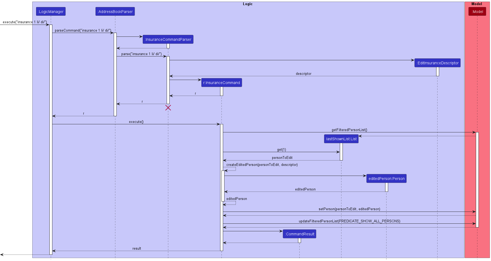
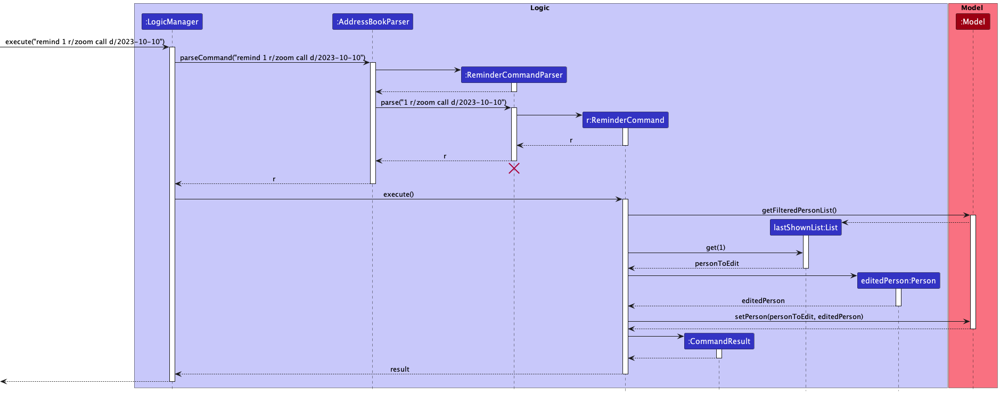
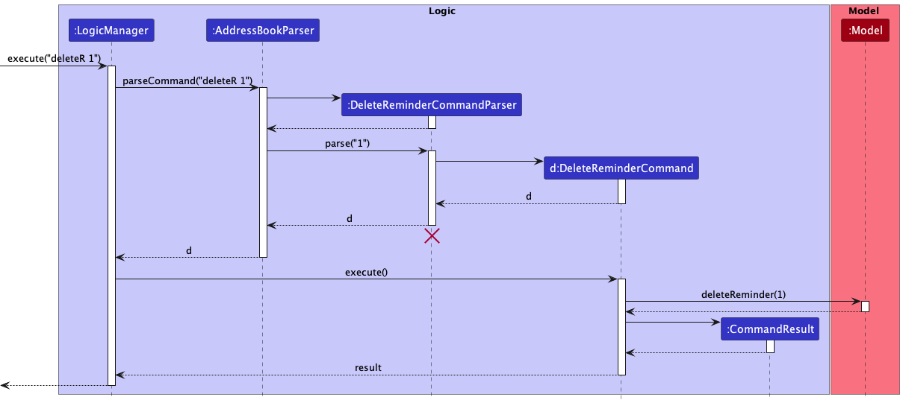
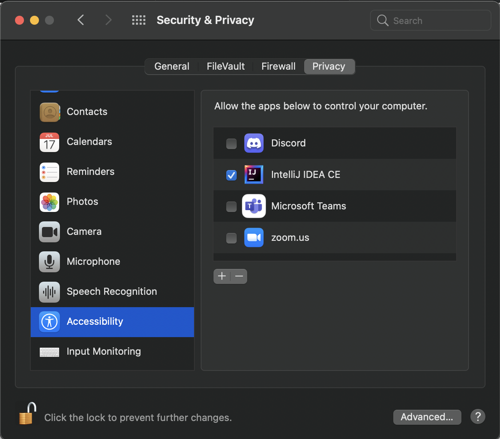
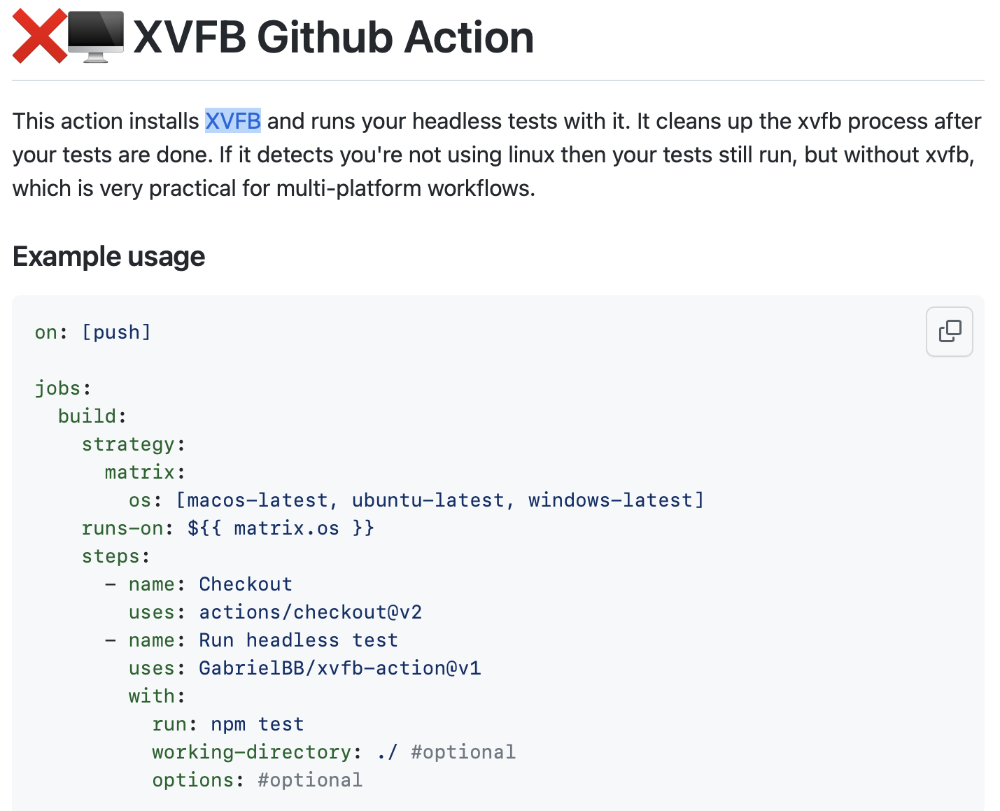

* Table of Contents
{:toc}

--------------------------------------------------------------------------------------------------------------------

## **Acknowledgements**

* Our project is built on the AddressBook-Level3 project created by the [SE-EDU](https://se-education.org/docs/templates.html) initiative.

--------------------------------------------------------------------------------------------------------------------

## **Setting up, getting started**

Refer to the guide [_Setting up and getting started_](SettingUp.md).

--------------------------------------------------------------------------------------------------------------------

## **Design**

:bulb: **Tip:** The `.puml` files used to create diagrams in this document can be found in the [diagrams](https://github.com/se-edu/addressbook-level3/tree/master/docs/diagrams/) folder. Refer to the [_PlantUML Tutorial_ at se-edu/guides](https://se-education.org/guides/tutorials/plantUml.html) to learn how to create and edit diagrams.

### Architecture

The ***Architecture Diagram*** given above explains the high-level design of the App.

Given below is a quick overview of main components and how they interact with each other.

**Main components of the architecture**

**`Main`** has two classes called [`Main`](https://github.com/se-edu/addressbook-level3/tree/master/src/main/java/seedu/address/Main.java) and [`MainApp`](https://github.com/se-edu/addressbook-level3/tree/master/src/main/java/seedu/address/MainApp.java). It is responsible for,
* At app launch: Initializes the components in the correct sequence, and connects them up with each other.
* At shut down: Shuts down the components and invokes cleanup methods where necessary.

[**`Commons`**](#common-classes) represents a collection of classes used by multiple other components.

The rest of the App consists of four components.

* [**`UI`**](#ui-component): The UI of the App.
* [**`Logic`**](#logic-component): The command executor.
* [**`Model`**](#model-component): Holds the data of the App in memory.
* [**`Storage`**](#storage-component): Reads data from, and writes data to, the hard disk.

**How the architecture components interact with each other**

The *Sequence Diagram* below shows how the components interact with each other for the scenario where the user issues the command `delete 1`.

Each of the four main components (also shown in the diagram above),

* defines its *API* in an `interface` with the same name as the Component.
* implements its functionality using a concrete `{Component Name}Manager` class (which follows the corresponding API `interface` mentioned in the previous point.

For example, the `Logic` component defines its API in the `Logic.java` interface and implements its functionality using the `LogicManager.java` class which follows the `Logic` interface. Other components interact with a given component through its interface rather than the concrete class (reason: to prevent outside component's being coupled to the implementation of a component), as illustrated in the (partial) class diagram below.

The sections below give more details of each component.

### UI component

The **API** of this component is specified in [`Ui.java`](https://github.com/se-edu/addressbook-level3/tree/master/src/main/java/seedu/address/ui/Ui.java)

The UI consists of a `MainWindow` that is made up of parts e.g.`CommandBox`, `ResultDisplay`, `CenterPanel`, `StatusBarFooter` etc. All these, including the `MainWindow`, inherit from the abstract `UiPart` class which captures the commonalities between classes that represent parts of the visible _GUI_.

The `CenterPanel` comprises two different panels within it, namely `PersonListPanel` and `ReminderListPanel`, with each of them displaying any number of `PersonCard` and `ReminderCard` respectively.

The `UI` component uses the JavaFx UI framework. The layout of these UI parts are defined in matching `.fxml` files that are in the `src/main/resources/view` folder. For example, the layout of the [`MainWindow`](https://github.com/se-edu/addressbook-level3/tree/master/src/main/java/seedu/address/ui/MainWindow.java) is specified in [`MainWindow.fxml`](https://github.com/se-edu/addressbook-level3/tree/master/src/main/resources/view/MainWindow.fxml)

The `UI` component,

* executes user commands using the `Logic` component.
* listens for changes to `Model` data so that the UI can be updated with the modified data.
* keeps a reference to the `Logic` component, because the `UI` relies on the `Logic` to execute commands.
* depends on some classes in the `Model` component, as it displays `Person` object residing in the `Model` in the `PersonCard` as well as the `ReminderCard`.

### Logic component

**API** : [`Logic.java`](https://github.com/se-edu/addressbook-level3/tree/master/src/main/java/seedu/address/logic/Logic.java)

Here's a (partial) class diagram of the `Logic` component:

How the `Logic` component works:
1. When `Logic` is called upon to execute a command, it uses the `AddressBookParser` class to parse the user command.
1. This results in a `Command` object (more precisely, an object of one of its subclasses e.g., `AddCommand`) which is executed by the `LogicManager`.
1. The command can communicate with the `Model` when it is executed (e.g. to add a person).
1. The result of the command execution is encapsulated as a `CommandResult` object which is returned back from `Logic`.

The Sequence Diagram below illustrates the interactions within the `Logic` component for the `execute("delete 1")` API call.

:information_source: **Note:** The lifeline for `DeleteCommandParser` should end at the destroy marker (X) but due to a limitation of PlantUML, the lifeline reaches the end of diagram.

Here are the other classes in `Logic` (omitted from the class diagram above) that are used for parsing a user command:

How the parsing works:
* When called upon to parse a user command, the `AddressBookParser` class creates an `XYZCommandParser` (`XYZ` is a placeholder for the specific command name e.g., `AddCommandParser`) which uses the other classes shown above to parse the user command and create a `XYZCommand` object (e.g., `AddCommand`) which the `AddressBookParser` returns back as a `Command` object.
* All `XYZCommandParser` classes (e.g., `AddCommandParser`, `DeleteCommandParser`, ...) inherit from the `Parser` interface so that they can be treated similarly where possible e.g, during testing.

### Model component
**API** : [`Model.java`](https://github.com/se-edu/addressbook-level3/tree/master/src/main/java/seedu/address/model/Model.java)

The `Model` component,

* stores the address book data i.e., all `Person` objects (which are contained in a `UniquePersonList` object).
* stores the currently 'selected' `Person` objects (e.g., results of a search query) as a separate _filtered_ list which is exposed to outsiders as an unmodifiable `ObservableList<Person>` that can be 'observed' e.g. the UI can be bound to this list so that the UI automatically updates when the data in the list change.
* stores a `UserPref` object that represents the user’s preferences. This is exposed to the outside as a `ReadOnlyUserPref` objects.
* does not depend on any of the other three components (as the `Model` represents data entities of the domain, they should make sense on their own without depending on other components)

### Storage component

**API** : [`Storage.java`](https://github.com/se-edu/addressbook-level3/tree/master/src/main/java/seedu/address/storage/Storage.java)

The `Storage` component,
* can save both address book data and user preference data in json format, and read them back into corresponding objects.
* inherits from both `AddressBookStorage` and `UserPrefStorage`, which means it can be treated as either one (if only the functionality of only one is needed).
* depends on some classes in the `Model` component (because the `Storage` component's job is to save/retrieve objects that belong to the `Model`)

### Common classes

Classes used by multiple components are in the `seedu.addressbook.commons` package.

--------------------------------------------------------------------------------------------------------------------

## **Implementation**

This section describes some noteworthy details on how certain features are implemented.

### Add feature

#### Implementation

The Add mechanism is facilitated by `AddCommand` and `AddCommandParser`. It allows users to add a contact into their contact list and specify the contacts'
`Name`, `Phone`, `Email`, `Birthday`, `Address`, and `Tags` to be stored and associated with the `Person` contact created.

#### Example Usage

Step 1: The user inputs `add n/John Doe p/98765432 e/johnd@example.com a/John street, block 123, #01-01 b/18-08-2000 t/friend`. This adds a person with `Name`
John Doe with the specified details into the contact list.

Step 2: `LogicManager` calls `AddressBookParser#parseCommand` with the user input.

Step 3: `AddressBookParser` will parse the command word and create a new `AddCommandParser` and call its function `parse` with the index as the arguments.

Step 4: The `AddCommandParser#parse` will then parse the arguments and create a new `AddCommand` object.

Step 5: The `LogicManager` then calls `AddCommand#execute`.

Step 6: The `AddCommand` communicates with the `Model` to add the person by calling `Model#addPerson`.

Step 7: `AddCommand` then returns a new `CommandResult` with the result of the execution.

### Insurance feature

#### Implementation

The Insurance mechanism is facilitated by `InsuranceCommand` and `InsuranceCommandParser`. It allows users to store whether a contact in their contact list has the four main types of insurance.
The four main types of insurances are modelled by the classes `LifeInsurance`, `DisabilityInsurance`, `CriticalIllnessInsurance` and `HealthInsurance` which inherit from the abstract `Insurance` class.

The types of insurances are specified by prefixes inputted by the user:
* li/ - Life Insurance
* di/ - Disability Insurance
* ci/ - Critical Illness Insurance
* hi/ - Health Insurance

`Insurance` fields are stored in the `Person` class, and consist of the boolean `hasInsurance` which is set to true if `Person` object has the type of insurance.

For prefixes not included in the command, the `Person` object is taken to not have the corresponding types of insurance.

Below is an example usage scenario.

#### Example Usage

Step 1: The user inputs `insurance 1 li/ di/`. This indicates that the user wants to update the first contact in the displayed contact list such that he only has life insurance and disability insurance.

Step 2: `LogicManager` calls `AddressBookParser` with the user input.

Step 3: `AddressBookParser` will parse the command word and create a new `InsuranceCommandParser` and call its function `parse` with the rest of the user input as the arguments.

Step 4: The `InsuranceCommandParser#parse` will then parse the insurance prefixes to create a new `EditInsuranceDescriptor` object.

Step 5: The `InsuranceCommandParser#parse` will then create a new `InsuranceCommand` object using the index and the `EditInsuranceDescriptor` object.

Step 5: The `LogicManager` then calls `InsuranceCommand#execute` with the `Model` object.

Step 6: The `InsuranceCommand` calls `Model#getFilteredPersonList` to get the filtered `List` of `Person` objects.

Step 7: The `InsuranceCommand` gets the `Person` to be edited from the `List`

Step 8: The `InsuranceCommand` calls its `createEditedPerson` method with the `Person` to be edited and the `EditInsuranceDescriptor` which returns the new edited `Person` .

Step 9: The `InsuranceCommand` calls the `setPerson` method of the `Model` object to replace the existing `Person` object with the new edited one.

Step 10: The `InsuranceCommand` calls the `updateFilteredPersonList` method of the `Model` object to update the filtered list.

Step 11: The `InsuranceCommand` then returns a new `CommandResult` object with the result of the execution.

Step 12: The `LogicManager` then returns the `CommandResult` object.

:information_source: **Note:** The lifeline for `InsuranceCommandParser` should end at the destroy marker (X) but due to a limitation of PlantUML, the lifeline reaches the end of diagram.

### Delete feature

#### Implementation

The delete mechanism is facilitated by `DeleteCommand` and `DeleteCommandParser`. It allows users to delete a contact from their contact list by either `INDEX` or `NAME`.

#### Example Usage

Step 1: The user inputs `delete 2` to delete the 2nd person in the displayed contact list.

Step 2: `LogicManager` calls `AddressBookParser#parseCommand` with the user input.

Step 3: `AddressBookParser` will parse the command word and create a new `DeleteCommandParser` and call its function `parse` with the index as the arguments.

Step 4: The `DeleteCommandParser#parse` will then parse the index and create a new `DeleteCommand` object.

Step 5: The `LogicManager` then calls `DeleteCommand#execute`.

Step 6: The `DeleteCommand` communicates with the `Model` to delete the person by calling `Model#deletePerson`.

Step 7: `DeleteCommand` then returns a new `CommandResult` with the result of the execution.

:information_source: **Note:** The lifeline for `DeleteCommandParser` should end at the destroy marker (X) but due to a limitation of PlantUML, the lifeline reaches the end of diagram.

The following activity diagram summarizes what happens when a user executes the delete command:

### Remind feature

#### Implementation

The remind mechanism is facilitated by `RemindCommand` and `RemindCommandParser`. It allows users to set a reminder message and date, for a contact from the contact list.

The `Reminder` objects for each `Person` is stored in the `Person` object as a `SortedList` where the predicate for sorting is based on the `date` attribute in `Reminder`.

The `UI` component then displays all the `Reminder` for all `Person` objects in `AddressBook.persons` in the `ReminderListPanel`.

#### Example Usage

Step 1: The user inputs `remind 1 r/zoom call d/2023-10-10` to create a reminder for the 2nd person in the displayed contact list.

Step 2: `LogicManager` calls `AddressBookParser` with the user input.

Step 3: `AddressBookParser` will parse the command word and create a new `ReminderCommandParser` and call its function `parse` with the rest of the user input as the arguments.

Step 4: The `ReminderCommandParser#parse` will then parse the index, task and date to create a new `ReminderCommand` object.

Step 5: The `LogicManager` then calls `ReminderCommand#execute`.

Step 6: The `ReminderCommand` calls `Model#getFilteredPersonList` to get the filtered `List` of `Person` objects.

Step 7: The `ReminderCommand` gets the `Person` to be edited from the `List`

Step 8: The `ReminderCommand` creates a new edited `Person`, with the given `Reminder`

Step 9: `ReminderCommand` then returns a new `CommandResult` with the result of the execution.

:information_source: **Note:** The lifeline for `ReminderCommandParser` should end at the destroy marker (X) but due to a limitation of PlantUML, the lifeline reaches the end of diagram.

#### Design considerations:

**Aspect: How to store a reminder:**

* **Alternative 1 (current choice):** Store Reminder as a field under a Person.
    * Pros: Allows for more features to be built on reminders (e.g: automated birthday reminders)
    * Cons: Results in higher coupling which may make maintenance and testing harder.

* **Alternative 2:** Store Reminder as a separate class
    * Pros: Easy to implement.
    * Cons: May be harder to implement automatically generated reminders.

### Delete Reminder feature

#### Implementation

The mechanism to delete a reminder is facilitated by `DeleteReminderCommand` and `DeleteReminderCommandParser`.

#### Example Usage

Step 1: The user inputs `deleteR 2` to delete the 2nd person in the displayed contact list.

Step 2: `LogicManager` calls `AddressBookParser#parseCommand` with the user input.

Step 3: `AddressBookParser` will parse the `deleteR` command word and create a new `DeleteReminderCommandParser` and call its function `parse` with the index as the arguments.

Step 4: The `DeleteReminderCommandParser#parse` will then parse the index and create a new `DeleteReminderCommand` object.

Step 5: The `LogicManager` then calls `DeleteReminderCommand#execute`.

Step 6: The `DeleteReminderCommand` communicates with the `Model` to delete the reminder by calling `Model#deleteReminder`.

Step 7: `DeleteReminderCommand` then returns a `CommandResult` indicating the result of the execution.

:information_source: **Note:** The lifeline for `DeleteReminderCommandParser` should end at the destroy marker (X) but due to a limitation of PlantUML, the lifeline reaches the end of diagram.

--------------------------------------------------------------------------------------------------------------------

## **Documentation, logging, testing, configuration, dev-ops**

* [Documentation guide](Documentation.md)
* [Testing guide](Testing.md)
* [Logging guide](Logging.md)
* [Configuration guide](Configuration.md)
* [DevOps guide](DevOps.md)

--------------------------------------------------------------------------------------------------------------------

## **Appendix A: Requirements**

### Product scope

**Target user profile**: Financial Advisors (FAs)

* has a need to manage a significant number of contacts
* has a need to manage many, different types of contacts such as friends,
family, clients and potential clients
* has to regularly keep in touch with many contacts, and often through
multiple platforms
* has a need to store information related to their clients such as birthdays,
contracts, packages, etc.
* prefer desktop apps over other types
* can type fast
* prefers typing to mouse interactions
* is reasonably comfortable using _CLI_ apps

**Value proposition**: Streamline, automate and speed up routine tasks that
FAs have to deal with on a day-to-day basis

### User stories

Priorities: High (must have) - `* * *`, Medium (nice to have) - `* *`, Low (unlikely to have) - `*`

| Priority | As a …​                                    | I want to …​                                                           | So that I can…​                                                                              |
|----------|--------------------------------------------|------------------------------------------------------------------------|----------------------------------------------------------------------------------------------|
| `* * *`  | Brand New User                             | see usage instructions                                                 | refer to instructions when I forget how to use the App                                       |
| `* * *`  | User                                       | store my friends, clients and potential clients contact information    | easily contact my friends, clients and potential clients                                     |
| `* * *`  | User                                       | view all of my contacts                                                | get an overview of all of my contacts                                                        |
| `* * *`  | User                                       | view my contacts' information                                          | easily access my contacts' information                                                       |
| `* * *`  | User                                       | delete specific contacts                                               | remove contacts that I no longer need and declutter the application                          |
| `* * *`  | User                                       | search for a contact                                                   | locate the information of my desired contact without having to check through all my contacts |
| `* * *`  | User                                       | save my contacts birthdays                                             | keep track of my contacts' birthdays and know when to wish them happy birthday               |
| `* * *`  | User                                       | save my contacts insurance information                                 | keep track of my contacts' insurance information to know when to follow up with them         |
| `* * *`  | User                                       | be able to label my contacts into different categories                 | organize my contacts better                                                                  |
| `* * *`  | User                                       | filter my contacts                                                     | more easily navigate through my contacts and find contacts I am interested in                |
| `* * *`  | User                                       | be sure that my data is safe and backed up                             | not lose important contact information                                                       |
| `* * *`  | User                                       | be reminded of my clients birthdays automatically                      | only have to input my clients information once                                               |
| `* * *`  | User                                       | set reminders for myself                                               | keep track of important tasks to carry out                                                   |
| `* *`    | User                                       | search through my contacts                                             | look up information stored about my contacts easily                                          |
| `* *`    | User                                       | import my contacts                                                     | not have to manually add my contacts individually                                            |
| `* *`    | User                                       | copy and paste information to my clipboard                             | paste prepared messages in whatever messaging application I like                             |
| `* *`    | User                                       | set preset messages beforehand for my contacts                         | easily copy the message and send it out                                                      |
| `* *`    | User                                       | delete all the current contacts                                        | start afresh after testing out the commands                                                  |
| `* *`    | User                                       | edit information related to my contacts                                | make changes if I make a mistake or their information changes                                |
| `* *`    | Intermediate User                          | learn more about how to use the application and more advanced features | increase my productivity                                                                     |
| `* *`    | Intermediate User                          | automatically hide old contacts that were last contacted some time ago | declutter the application of old contacts                                                    |
| `* *`    | Long-Time User                             | customize some of my commands                                          | group common commands together to automate common tasks and save time                        |
| `*`      | Long-Time User                             | have a fast way to show off how fast working with Friendnancial is     | introduce the product to my friends and convince them to use it                              |
| `*`      | User with many persons in the address book | sort persons by name                                                   | locate a person easily                                                                       |

### Use cases

(For all use cases below, the **System** is the `Friendnancial` and the **Actor** is the `User`, unless specified otherwise)

**Use Case 1: Add a person**

**MSS**

1.  User requests to list persons
2.  Friendnancial shows a list of persons
3.  User requests to add a specific person in the list and types their information
4.  Friendnancial adds the person and the user sees the new person in the list of persons

    Use case ends.

**Extensions**

* 3a. The input information does follow the correct format.
  
    * 3a1. Friendnancial displays an error message indicating the correct format for the user to follow.

      Use case resumes at step 2.

**Use Case 2: Delete a person**

**MSS**

1.  User requests to list persons
2.  Friendnancial shows a list of persons
3.  User requests to delete a specific person in the list either by their index or by their name
4.  Friendnancial deletes the person and the user sees the person deleted

    Use case ends.

**Extensions**

* 2a. The list is empty.

  Use case ends.

* 3a. The given index or name is invalid.

    * 3a1. Friendnancial shows an error message indicating that the user has input incorrect information.

      Use case resumes at step 2.

**Use Case 3: Edit a person**

**MSS**

1.  User requests to list persons
2.  Friendnancial shows a list of persons
3.  User requests to edit a specific person in the list by specifying what to update
4.  Friendnancial edits the information of the person and the user sees the changes

    Use case ends.

**Extensions**

* 2a. The list is empty.

  Use case ends.

* 3a. The given index to edit is invalid.

    * 3a1. Friendnancial shows an error message indicating that the user has input incorrect information.

      Use case resumes at step 2.

**Use Case 4: Add a reminder for a specific person**

**MSS**

1. User requests to list persons
2. Friendnancial shows a list of persons
3. User requests to add a reminder for a specific person by inputting the information
4. User sees the newly added reminder in the list of reminders

    Use case ends.

**Extensions**

* 2a. The list is empty.

  Use case ends.

* 3a. The given index is invalid.

    * 3a1. Friendnancial shows an error message indicating that the user has input incorrect information.

      Use case resumes at step 2.

**Use Case 5: Remove a reminder from the list of reminders**

**MSS**

1. User requests to list persons
2. Friendnancial shows a list of persons
3. User requests to remove a reminder by inputting the information
4. User sees the reminder removed from the list of reminders

   Use case ends.

**Extensions**

* 2a. The list is empty.

  Use case ends.

* 3a. The given reminder index is invalid.

    * 3a1. Friendnancial shows an error message indicating that the user has input incorrect information.

      Use case resumes at step 2.

**Use Case 6: Filtering contacts**

**MSS**

1. User requests to filter contacts based on a given field
2. Friendnancial shows the list of people that match the criteria

    Use case ends.

**Extensions**
* 1a. The given prefix is invalid.

  * 1a1. Friendnancial shows an error message.

    Use case ends.

* 1b. The user does not indicate any prefix.

  * 1b1. Friendnancial shows all the people in the list of people.

    Use case ends.

### Non-Functional Requirements

1.  Should work on any _mainstream OS_ as long as it has Java `11` or above installed.
2.  Should be able to hold up to 100 persons without a noticeable sluggishness in performance for typical usage.
3.  A user with above average typing speed for regular English text (i.e. not code, not system admin commands) should be able to accomplish most of the tasks faster using commands than using the mouse.
4. The system should respond within 2 seconds of entering a command.
5. The app is not required to explain financial advisor terms.
6. The app is not required to spell check or check for offensive terms.
7. The system should still work even if there is no data file present.
8. The system should replace the data file if it has corrupted.
9. The system should save the data after each command has been processed.

### Full Glossary

* **Mainstream OS**: Windows, Linux, Unix, OS-X
* **Private contact detail**: A contact detail that is not meant to be shared with others
* **GUI**: Graphical User Interface - A system of interactive visual components for computer software
* **CLI**: Command Line Interface - A text based user interface to run programs
* **Index**: A number indicating the order of a person within the contact list, used in conjunction with commands
* **Parameter**: Refers to the information typed along with the commands. For example the command `add n/John Doe` means that the parameter is `n/John Doe`
* **UML**: Unified Modelling Language - A Language based on drawing diagrams to describe models of the codebase
* **UML Sequence Diagram**: Sequence diagrams model the interactions between various entities in a system, in a specific scenario.
  Modelling such scenarios is useful, for example, to verify the design of the internal interactions is able to provide the expected outcomes.
* **UML Activity Diagram**: activity diagrams (AD) can model workflows.  Flow charts are another type of diagram that can model workflows. 
Activity diagrams are the UML equivalent of flow charts.
--------------------------------------------------------------------------------------------------------------------

## **Appendix B: Instructions for manual testing**

Given below are instructions to test the app manually.

:information_source: **Note:** These instructions only provide a starting point for testers to work on;
testers are expected to do more *exploratory* testing.

### Launch and shutdown

1. Initial launch

   1. Download the jar file and copy into an empty folder

   1. Double-click the jar file Expected: Shows the _GUI_ with a set of sample contacts. The window size may not be optimum.

1. Saving window preferences

   1. Resize the window to an optimum size. Move the window to a different location. Close the window.

   1. Re-launch the app by double-clicking the jar file. 
       Expected: The most recent window size and location is retained.

1. _{ more test cases …​ }_

### Deleting a person

1. Deleting a person while all persons are being shown

   1. Prerequisites: List all persons using the `list` command. Multiple persons in the list.

   1. Test case: `delete 1` 
      Expected: First contact is deleted from the list. Details of the deleted contact shown in the status message. Timestamp in the status bar is updated.

   1. Test case: `delete 0` 
      Expected: No person is deleted. Error details shown in the status message. Status bar remains the same.

   1. Other incorrect delete commands to try: `delete`, `delete x`, `...` (where x is larger than the list size) 
      Expected: Similar to previous.

1. _{ more test cases …​ }_

### Saving data

1. Dealing with missing/corrupted data files

   1. _{explain how to simulate a missing/corrupted file, and the expected behavior}_

1. _{ more test cases …​ }_

--------------------------------------------------------------------------------------------------------------------

## **Appendix C: Automated GUI Testing**

The application makes use of the [TestFX](https://github.com/TestFX/TestFX) library to carry out automated tests for
the GUI. Below are common issues when trying to carry out GUI tests.

#### **Problem: Keyboard and Mouse movements are not simulated in macOS systems, resulting in GUI tests failure**

* Reason: From macOS Mojave onwards, applications that do not have `Accessibility` permissions cannot simulate
such keyboard and mouse movements. Therefore, the GUI tests that require simulation of keyboard and mouse movements
to test the GUI cannot function properly and fail.

* Solution: Open `System Preferences`, click `Security and Privacy`, then `Privacy`, and then `Accessibility`.
Then check the box beside `IntelliJ IDEA`. The figure below shows `Accessibility` permission being granted to
`IntelliJ IDEA`.

#### **Problem: GitHub Actions Ubuntu environment cannot run GUI tests, resulting in Continuous Integration tests failure**

* Reason: The automated GUI tests require tools on different Linux distributions to run properly as they need to
display a GUI. The environment that GitHub Actions provides does not have these. Therefore, the GUI tests are
getting stuck and taking very long to build with no success and this is causing Continuous Integration checks to
fail.

* Solution: Update the [`gradle.yml`](../.github/workflows/gradle.yml) file to make use of an additional [action](https://github.com/marketplace/actions/gabrielbb-xvfb-action)
on GitHub actions that installs [XVFB](http://elementalselenium.com/tips/38-headless) and runs headless tests with
it. The figure below shows the new actions used to enable the CI environment to run the GUI tests properly.

