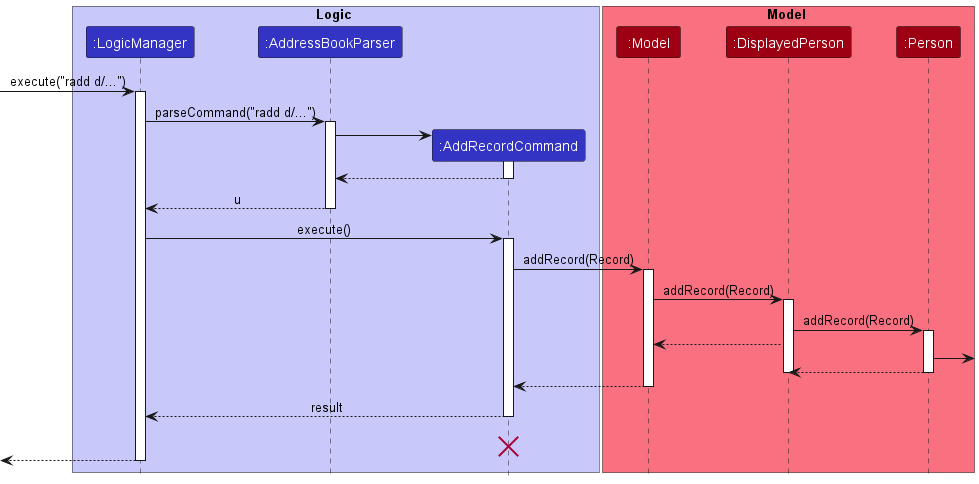
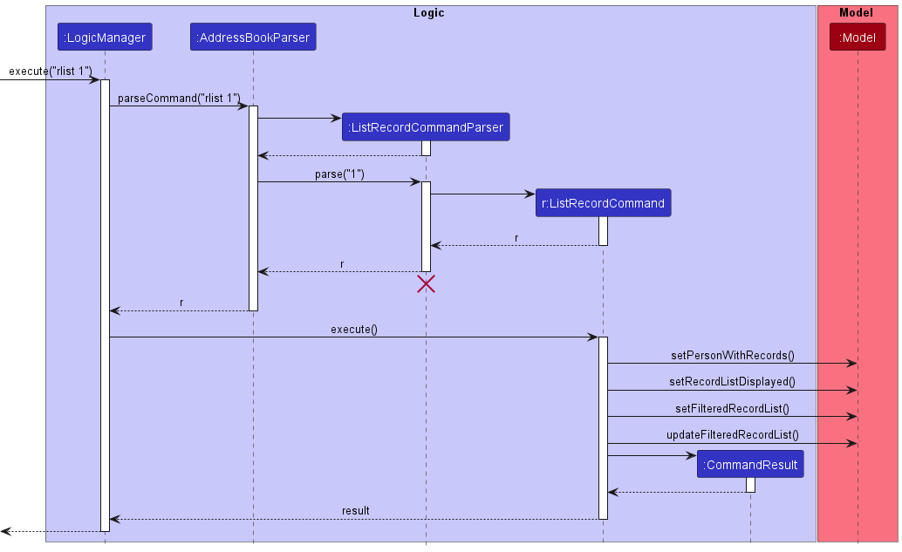

* Table of Contents
{:toc}

--------------------------------------------------------------------------------------------------------------------

## **Acknowledgements**

* Adapted from AB3 https://github.com/nus-cs2103-AY2223S1/tp

--------------------------------------------------------------------------------------------------------------------

## **Setting up, getting started**

Refer to the guide [_Setting up and getting started_](SettingUp.md).

--------------------------------------------------------------------------------------------------------------------

## **Design**

:bulb: **Tip:** The `.puml` files used to create diagrams in this document can be found in the [diagrams](https://github.com/se-edu/addressbook-level3/tree/master/docs/diagrams/) folder. Refer to the [_PlantUML Tutorial_ at se-edu/guides](https://se-education.org/guides/tutorials/plantUml.html) to learn how to create and edit diagrams.

### Architecture

The ***Architecture Diagram*** given above explains the high-level design of the App.

Given below is a quick overview of main components and how they interact with each other.

**Main components of the architecture**

**`Main`** has two classes called [`Main`](https://github.com/se-edu/addressbook-level3/tree/master/src/main/java/seedu/address/Main.java) and [`MainApp`](https://github.com/se-edu/addressbook-level3/tree/master/src/main/java/seedu/address/MainApp.java). It is responsible for,
* At app launch: Initializes the components in the correct sequence, and connects them up with each other.
* At shut down: Shuts down the components and invokes cleanup methods where necessary.

[**`Commons`**](#common-classes) represents a collection of classes used by multiple other components.

The rest of the App consists of four components.

* [**`UI`**](#ui-component): The UI of the App.
* [**`Logic`**](#logic-component): The command executor.
* [**`Model`**](#model-component): Holds the data of the App in memory.
* [**`Storage`**](#storage-component): Reads data from, and writes data to, the hard disk.

**How the architecture components interact with each other**

The *Sequence Diagram* below shows how the components interact with each other for the scenario where the user issues the command `delete 1`.

Each of the four main components (also shown in the diagram above),

* defines its *API* in an `interface` with the same name as the Component.
* implements its functionality using a concrete `{Component Name}Manager` class (which follows the corresponding API `interface` mentioned in the previous point.

For example, the `Logic` component defines its API in the `Logic.java` interface and implements its functionality using the `LogicManager.java` class which follows the `Logic` interface. Other components interact with a given component through its interface rather than the concrete class (reason: to prevent outside component's being coupled to the implementation of a component), as illustrated in the (partial) class diagram below.

The sections below give more details of each component.

### UI component

The **API** of this component is specified in [`Ui.java`](https://github.com/se-edu/addressbook-level3/tree/master/src/main/java/seedu/address/ui/Ui.java)

The UI consists of a `MainWindow` that is made up of parts e.g.`CommandBox`, `ResultDisplay`, `PersonListPanel`, `RecordListPanel`, `StatusBarFooter` etc. All these, including the `MainWindow`, inherit from the abstract `UiPart` class which captures the commonalities between classes that represent parts of the visible GUI.

The `UI` component uses the JavaFx UI framework. The layout of these UI parts are defined in matching `.fxml` files that are in the `src/main/resources/view` folder. For example, the layout of the [`MainWindow`](https://github.com/se-edu/addressbook-level3/tree/master/src/main/java/seedu/address/ui/MainWindow.java) is specified in [`MainWindow.fxml`](https://github.com/se-edu/addressbook-level3/tree/master/src/main/resources/view/MainWindow.fxml)

The `UI` component,

* executes user commands using the `Logic` component.
* listens for changes to `Model` data so that the UI can be updated with the modified data and display the correct panel.
* keeps a reference to the `Logic` component, because the `UI` relies on the `Logic` to execute commands.
* depends on some classes in the `Model` component, as it displays `Person` and `Record` object residing in the `Model`.

### Logic component

**API** : [`Logic.java`](https://github.com/se-edu/addressbook-level3/tree/master/src/main/java/seedu/address/logic/Logic.java)

Here's a (partial) class diagram of the `Logic` component:

How the `Logic` component works:
1. When `Logic` is called upon to execute a command, it uses the `AddressBookParser` class to parse the user command.
1. This results in a `Command` object (more precisely, an object of one of its subclasses e.g., `AddCommand`) which is executed by the `LogicManager`.
1. The command can communicate with the `Model` when it is executed (e.g. to add a person).
1. The result of the command execution is encapsulated as a `CommandResult` object which is returned back from `Logic`.

The Sequence Diagram below illustrates the interactions within the `Logic` component for the `execute("delete 1")` API call.

:information_source: **Note:** The lifeline for `DeleteCommandParser` should end at the destroy marker (X) but due to a limitation of PlantUML, the lifeline reaches the end of diagram.

Here are the other classes in `Logic` (omitted from the class diagram above) that are used for parsing a user command:

How the parsing works:
* When called upon to parse a user command, the `AddressBookParser` class creates an `XYZCommandParser` (`XYZ` is a placeholder for the specific command name e.g., `AddCommandParser`) which uses the other classes shown above to parse the user command and create a `XYZCommand` object (e.g., `AddCommand`) which the `AddressBookParser` returns back as a `Command` object.
* All `XYZCommandParser` classes (e.g., `AddCommandParser`, `DeleteCommandParser`, ...) inherit from the `Parser` interface so that they can be treated similarly where possible e.g, during testing.

### Model component
**API** : [`Model.java`](https://github.com/se-edu/addressbook-level3/tree/master/src/main/java/seedu/address/model/Model.java)

The `Model` component,

* stores the address book data.
  * all `Person` objects (which are contained in a `UniquePersonList` object)
  * all `Record` objects (which are contained in a `RecordList` object)
* stores the currently 'selected' `Person` objects (e.g., results of a search query) as a separate _filtered_ list which is exposed to outsiders as an unmodifiable `ObservableList<Person>` that can be 'observed' e.g. the UI can be bound to this list so that the UI automatically updates when the data in the list change.
* likewise, the currently 'selected' `Record` objects are stored as a separate _filtered_ list which is exposed to outsiders as an unmodifiable `ObservableList<Record>` that can be 'observed'.
* stores a `UserPref` object that represents the user’s preferences. This is exposed to the outside as a `ReadOnlyUserPref` objects.
* does not depend on any of the other three components (as the `Model` represents data entities of the domain, they should make sense on their own without depending on other components)

:information_source: **Note:** An alternative (arguably, a more OOP) model is given below. It has a `Tag` list in the `AddressBook`, which `Person` references. This allows `AddressBook` to only require one `Tag` object per unique tag, instead of each `Person` needing their own `Tag` objects. 

### Storage component

**API** : [`Storage.java`](https://github.com/se-edu/addressbook-level3/tree/master/src/main/java/seedu/address/storage/Storage.java)

The `Storage` component,
* can save both address book data and user preference data in json format, and read them back into corresponding objects.
* inherits from both `AddressBookStorage` and `UserPrefStorage`, which means it can be treated as either one (if only the functionality of only one is needed).
* depends on some classes in the `Model` component (because the `Storage` component's job is to save/retrieve objects that belong to the `Model`)

### Common classes

Classes used by multiple components are in the `seedu.addressbook.commons` package.

--------------------------------------------------------------------------------------------------------------------

## **Implementation**

This section describes some noteworthy details on how certain features are implemented.

### \[Implemented\] Add record feature

#### Patient Records
OmniHealth manages patient records generated during patient consultations.  Each `Patient` holds a list of 
medical records that the user is able to modify and edit. The `Record` class encapsulates a medical
record that comprises a date, medical information and medicine prescribed (if any).

#### Implementation

Following the command execution pathway, the implementation of adding records uses the exposed `Model#addRecord(Record)`
operation in the `Model` API which operates through a `DisplayedPerson` which encapsulates the current patient whose list of records is being 
displayed to the user. Record operations are performed through the displayed person, for example,`DisplayedPerson#addRecord(Record)`.
The current patient can be set by `DisplayedPerson#setPerson(Person, AddressBook)`.

The parsing of user input is facilitated by `AddRecordCommandParser`. `AddRecordCommandParser#parse()` parses user 
input string to return a `AddRecordCommand` object with a `Record` derived from the given inputs.

Given below is an example usage scenario.

Precondition. User should be current viewing a specific patient's record list using the `rlist` command. The current
patient is set using `DisplayedPerson#setPerson(Person, AddressBook)`.

Execution. User executes `radd d/01-02-2013 1230 r/Patient developed fever. m/Paracetamol` to add a new record containing 
the date/time of `01-02-2013 1230`, medication remark of `Patient developed fever.` and medication prescription of
`Paracetamol` into the current displayed person's record list. The `radd` command calls `Model#addRecord(Record)` 
which performs the adding of records to the `DisplayedPerson` held by the `Model`.

:information_source: **Note:** The medication field is an optional input

The following sequence diagram shows how the add record operation works:

#### Design considerations:

**Aspect: Model-Person Interaction:**

* **Alternative 1 (current choice):** Use DisplayedPerson as a wrapper class.
    * Pros: Maintain immutability within Person and Model classes, Easy to set current person whose record list is being
displayed
    * Cons: Longer command execution pathway as DisplayedPerson acts as an intermediary class between Model and Person.
  
* **Alternative 2:** Allow model to directly interact with Person's record list.
  * Pros: Easy to implement, simpler command execution pathway.
  * Cons: Potentially violates OOP.
  
### \[Implemented\] Find Records

#### Implementation: 
The find record command mechanism is facilitated by `RecordContainsKeywordPredicate` and `FindRecordCommandParser`
which extends `Predicate` and `AddressbookParser` respectively. 

`FindRecordCommandParser` implements the following operations:
* `FindRecordCommandParser#parse()` - Parses the input arguments by storing each prefix and its respective
values as an `ArgumentMultimap`.

`RecordContainsKeywordPredicate` implements the following operations:
* `RecordContainsKeywordPredicate#test()` - Tests whether the record under testing contains any of the keywords
in the correct fields.

Only `FindRecordCommandParser#parse` is exposed in the Parser interface as Parser#parse().

Given below is an example usage and how the find record mechanism works at each step.

### \[Implemented\] List Records feature

#### Implementation:

The implemented list record mechanism is facilitated by `ListRecordCommandParser`, which extends `AddressBookParser`. `ListRecordCommandParser` implements the following operations:
- `ListRecordCommandParser#parse()` - Parses the input argument into an `Index` and creates a new `ListRecordCommand` object with the parsed `Index`.

The `ListRecordCommand` object then communicates with the `Model` API when it is executed, more specifically, by calling the following methods that are implemented in `ModelManager`:
- `Model#setPersonWithRecords(Person)` - Sets the person whose record list is being displayed (`ModelManager#personWithRecords`) to the given `Person`, so that the displayed record list can be manipulated by calling methods such as `Model#addRecord()` and `Model#deleteRecord()`.
- `Model#setRecordListDisplayed(boolean)` - Setter for a flag to determine if a record list is being displayed; set to `true`.
- `Model#setFilteredRecordList(Person)` - Sets the *filtered list* of records (`ModelManager#filteredRecords`) to the record list of the given Person.
- `Model#updateFilteredRecordList(Predicate)` - Updates the filter of the *filtered list* of records to the filter given by the predicate; an `always true` predicate is given so that all records will be included in the *filtered list*.

At the final step of the execution of the `ListRecordCommand` object, a `CommandResult` object is returned.

The Sequence Diagram below shows how the list record operation works:

Example usage scenario:
- Precondition: The user should be viewing the patient list by using the `list` command.
- Execution: The user executes `rlist 1` to list the records of the 1st patient in the displayed patient list.

### \[Implemented\] Clear Records

The clear record command `rclear` allows the application to clear all the existing records in the current active record
list.

#### Implementation:

Given below is an example usage scenario for the command.

**Step 1:** The user launches the application.

**Step 2:** The user executes the `rlist INDEX` command to show the record list of a specified patient. 

**Step 3:** The user executes the `rclear` command to clear all existing records in the record list.

### \[Implemented\] Add appointment

The add appointment feature allows Omnihealth to manage future appointments for patients. Each `Patient` holds an appointment
reference for record keeping that the user is able to edit and clear.

The feature currently does not support automatic removal of appointments which dates have passed, and require a new appointment
to override the old appointment or for the existing appointment to be cleared with the `apptcl` command.

#### Implementation:
The add appointment command mechanism is facilitated by the `AddAppointmentCommandParser` class which extends the `AddressbookParser`.

`AddAppointmentParser` implements the following operations:
* `AddAppointmentParser#parse()` - Parses the input arguments by storing the index and the prefix of its respective values as 
an `ArgumentMultimap.`

`AddAppointmentParser#parse()` is exposed in the Parser interface as Parser#parse().

Given below is an example usage scenario for the command.

**Step 1:** The user launches the application.

**Step 2:** The user executes the `appt INDEX d/ dd-MM-yyyy` command in the CLI.

**Step 3:** An appointment will be assigned to the patient specified with the index input.

### \[Implemented\] Clear appointment

#### Implementation:
The add appointment mechanism is facilitated by `ClearAppointmentCommandParser`  which extends `AddressbookParser`.

`ClearAppointmentParser` implements the following operations:
* `ClearAppointmentParser#parse()` - Parses the input arguments by storing the index and the prefix of its respective values as
  an `ArgumentMultimap.`

`ClearAppointmentParser#parse()` is exposed in the Parser interface as Parser#parse().

Given below is an example usage scenario for the command.

**Step 1:** The user launches the application.

**Step 2:** The user executes the `apptcl INDEX ` command in the CLI.

**Step 3:** The patient's appointment(if any) will be cleared. 

### \[Proposed\] Upcoming appointment tracker

The proposed upcoming appointment feature will be a display to show upcoming appointments for the user upon application start.

#### Proposed Implementation
The proposed implementation is facilitated by `AppointmentWindow`. It extends `UiPart<Stage>` with a new window.

Given below is an example usage scenario for the command.

**Step 1:** The user launches the application.

**Step 2:** A additional window appears, showing the current upcoming appointments.

### \[Implemented\] Delete Records feature

#### Implementation:
The delete record mechanism is facilitated by `DeleteRecordCommandParser`  which extends `AddressbookParser`.

`DeleteRecordCommandParser` implements the following operations:
* `DeleteRecordCommandParser#parse()` - Parses the input argument into an `Index` and 
creates a new `DeleteRecordCommand` object with the parsed `Index`.

The `DeleteRecordCommand` object then communicates with the `Model` API when it is executed, more specifically, by calling the following methods that are implemented in `ModelManager`:
* `Model#getFilteredRecordList()` - Returns the record list which is displayed.
* `Model#isRecordListDisplayed()` - Returns a boolean result if a record list is being displayed.
* `Model#deleteRecord(Record)` - Deletes the input record from the DisplayedPerson (`Model#personWithRecords`).

Given below is an example usage scenario for the command.

* Precondition: 
  * User should be current viewing a specific patient's record list using the `rlist` command. 
  * The current patient is set using `DisplayedPerson#setPerson(Person, AddressBook)`.

* Execution: 
  * User executes `rdelete 1` to delete the 1st record in the displayed record list. The `rdelete` command calls `Model#deleteRecord(Record)` which performs the deletion of records from the `DisplayedPerson` held by the `Model`.

### \[Implemented\] Edit Records feature

#### Implementation:
The edit record mechanism is facilitated by `EditRecordCommandParser`  which extends `AddressbookParser`.

`EditRecordCommandParser` implements the following operations:
* `EditRecordCommandParser#parse()` - Parses the input argument by storing the index and respective prefix as in `ArgumentMultimap`

The `EditRecordCommand` object then calls `createEditedRecord` and communicates with the `EditRecordDescriptor` to create 
a new `editedRecord` to replace the `Record` that is to be edited.

The `EditRecordCommand` object then communicates with the `Model` API when it is executed, more specifically,
by calling the following methods that are implemented in `ModelManager`:
* `Model#setRecord(Record, Record)` - Sets the target record of `Model#personWithRecords` to the new edited record.
* `Model#updateFilteredRecordList(Predicate<Record>)` - Updates the filter of the filtered record list to filter by the given predicate;
in this case, show all the records.

Given below is an example usage scenario for the command.

* Precondition:
    * User should be current viewing a specific patient's record list using the `rlist` command.
    * The current patient is set using `DisplayedPerson#setPerson(Person, AddressBook)`.

* Execution:
    * User executes `redit 1 r/Fever d/12-12-2012 1200 m/` to set the 1st record in the displayed record list to a new
  record containing the date/time of `12-12-2012 1200`, record data of `Fever` and sets the medications to empty.

--------------------------------------------------------------------------------------------------------------------

## **Documentation, logging, testing, configuration, dev-ops**

* [Documentation guide](Documentation.md)
* [Testing guide](Testing.md)
* [Logging guide](Logging.md)
* [Configuration guide](Configuration.md)
* [DevOps guide](DevOps.md)

--------------------------------------------------------------------------------------------------------------------

## **Appendix: Requirements**

### Product scope

**Target user profile**:

* has a need to manage a significant number of contacts
* private clinic practitioners who do not have access to general health service management applications like Healthhub
* private clinic practitioners of clinics who still utilise physical paper records to store patient information

**Value proposition**:
* provide doctors with a place to **store and centrally manage their patients’ information**
* allow doctors to schedule appointments, send appointment reminders and other notifications (eg. medication, payment
  information) to patients using their stored contact information.

### User stories

Priorities: High (must have) - `* * *`, Medium (nice to have) - `* *`, Low (unlikely to have) - `*`

| Priority | As a …​                | I want to …​                             | So that I can…​                                                                           |
|----------|------------------------|------------------------------------------|-------------------------------------------------------------------------------------------|
| `* * *`  | new user               | view the user guide easily               | learn more about the product usage                                                        |
| `* * *`  | user                   | add a new patient and their details      | save them for later viewing                                                               |
| `* * *`  | user                   | view an existing patient's full details  | know more about the patient                                                               |
| `* * *`  | user                   | delete a patient's records               | remove a particular patient's medical records upon request. (E.g. due to privacy reasons) |
| `* * *`  | user                   | clear all of a patient's records         | save time by not deleting one by one                                                      |
| `* * *`  | user                   | view the entire list of patients         | see all my patients I have added.                                                         |
| `* * *`  | user                   | view a specific patient’s records        | remember past visits recorded                                                             |
| `* * *`  | user                   | exit the program                         |                                                                                           |
| `* *`    | schedule-oriented user | add appointments scheduled for a patient | keep track of my appointments                                                             |
| `* *`    | user                   | edit a patient's record                  | change details of a record in the future                                                  |

*{More to be added}*

### Use cases

(For all use cases below, the **System** is the `OmniHealth` and the **Actor** is the `user`, unless specified otherwise)

**Use case: UC01 - Add a patient**
**Precondition: Addressbook is displayed**

**MSS**

1. User requests to add a patient with given input fields.
2. OmniHealth adds patients with given fields into the list of patients.

    Use case ends.

**Extensions**

* 1a. The given input fields are invalid.

    * 1a1. OmniHealth shows an error message.

      Use case ends.

**Use case: UC02 - Add a record**

**MSS**

1. User !!requests to list patients (UC05)!!
2. User !!requests to display record list of specific patient (UC06)!!
3. User requests to add record with given fields into to the patient.
4. OmniHealth adds a record with given fields to the record list of the patient.

    Use case ends.

**Extensions**

* 3a. The given input fields are invalid.

    * 3a1. OmniHealth shows an error message.

      Use case resumes at step 2.

**Use case: UC03 - Delete a patient**
**Precondition: Addressbook is displayed**

**MSS**

1. User requests to delete a specific patient in the list
2. OmniHealth deletes the person

    Use case ends.

**Extensions**

* 3a. The list is empty.
    * 3a1. OmniHealth shows an error message.

        Use case ends.

* 3b. The given index is invalid.

    * 3b1. OmniHealth shows an error message.

      Use case ends.

* 2a. The user searches for a specific patient before deleting.

    * 2a1. User requests to find a patient
    * 2a2. OmniHealth shows a list of patient with given keyword
    * 2a3. User requests to delete a specific patient in the list
    * 2a4. OmniHealth deletes the patient

      Use case ends.

**Use case: UC04 - Delete a record**

**MSS**

1.  User !!requests to list patients (UC05).!!
2.  User !!requests to display record list of specific patient (UC06).!!
3.  User requests to delete a specific record in the list.
4.  OmniHealth deletes the record.

    Use case ends.

**Extensions**

* 3a. The record list is empty.

    * 3a1. OmniHealth shows an error message.

        Use case ends.

* 3b. The given index is invalid.

    * 3b1. OmniHealth shows an error message.

      Use case ends.

* *a. User attempts to delete a record before listing records.

    * *a1. OmniHealth shows an error message.

      Use case ends.

**Use case: UC05 - List all patients**

**MSS**

1. User requests to list all patients.
2. OmniHealth shows a list of all patients.

    Use case ends.

**Extensions**

* 1a. The patient list is empty.

    * 1a1. OmniHealth shows an error message.
    
        Use case ends.

**Use case: UC06 - List all records for a specified patient**

**MSS**

1. User requests to display all records for the specified patient.
2. OmniHealth shows a list of all records for the specified patient.

   Use case ends.

**Extensions**

* 1a. The record list is empty.

    * 1a1. OmniHealth shows an error message.
    
        Use case ends.

* 1b. The given index is invalid.

    * 1b1. OmniHealth shows an error message.
    
        Use case ends.

**Use case: UC07 - Clear patient list**
**Precondition: Addressbook is displayed**

**MSS**

1. User requests to clear all patients from list
2. OmniHealth deletes patient list

   Use case ends

**Extensions**

* 1a. Patient list is empty

    Use case ends

**Use case: UC08 - Clear patient records**

**MSS**

1. User !!requests to list patients (UC05)!!
2. User !!requests to display record list of specific patient (UC06)!!
3. User requests to clear all records from a patient
4. OmniHealth deletes all patient records

   Use case ends

**Extensions**
* 1a. Patient record list is empty

  Use case ends

* 1b. Patient does not exist
  * 1b1. OmniHealth displays error message

  Use case ends

**Use case: UC09 - Get Help**

**MSS**

1. User requests to view help
2. OmniHealth shows list of commands

    Use case ends

**Use case: UC10 - Find patient**
**Precondition: Addressbook is displayed**

**MSS**

1. User requests to find a patient by name.
2. OmniHealth shows a list of all patients matching the input by the user.

**Extensions**
* 1a. Patient record list is empty

  Use case ends

* 1b. Patient does not exist
    * 1b1. OmniHealth displays error message

  Use case ends

**Use case: UC11 - Find patient records**

**MSS**

1. User !!requests to list patients (UC05)!!
2. User !!requests to display record list of specific patient (UC06)!!
3. User inputs a keyword to search the record list.
4. OmniHealth shows all the relevant records of the specified patient.

**Extensions**
* 1a. Patient record list is empty

  Use case ends

* 1b. Patient does not exist
    * 1b1. OmniHealth displays error message

  Use case ends

* 3a. No keywords matching can be found
    * 3a1. OmniHealth displays error message

  Use case ends

**Use case: UC12 - Add patient appointment**

**MSS**
1. User requests to add an appointment with a specified date.
2. An appointment is created for the patient.

**Extensions**
* 1a. Patient list is empty
    * 1a1. OmniHealth displays an error message
  
    Use case ends

* 1b. Patient index does not exist
    * 1b1. OmniHealth displays an error message

    Use case ends

* 1c. Date is specified in wrong formatting
    * 1c1. OmniHealth displays an error message
    
    Use case ends

* 1d. Appointment already exists for the patient
    * 1d1. Old appointment is overriden by the new appointment

    Use case ends

**Use Case: UC13 - Clear patient appointment**

**MSS**

1. User requests to remove the existing appointment of the patient.
2. The specified appointment is removed.

**Extensions**
* 1a. Patient list is empty
    * 1a1. OmniHealth displays an error message

    Use case ends
* 1b. Patient index does not exist
    * 1b1. OmniHealth displays an error message.
    
    Use Case ends

**Use Case: UC14 - Edit a patient's record**

**MSS**

1. User !!requests to list patients (UC05).!!
2. User !!requests to display record list of specific patient (UC06).!!
3. User requests to edit a record
4. OmniHealth replaces the record in the record list with a new edited one

**Extensions**
* 3a. The record list is empty.

    * 3a1. OmniHealth shows an error message.

      Use case ends.

* 3b. The given index is invalid.

    * 3b1. OmniHealth shows an error message.

      Use case ends.

* *a. User attempts to edit a record before listing records.

    * *a1. OmniHealth shows an error message.

      Use case ends.

**Use Case: UC15 - Edit a patient's details**

**MSS**

1. User !!requests to list patients (UC05).!!
2. User requests to edit a patient's details
3. OmniHealth replaces the patient in the patient database with a new edited one

**Extensions**
* 2a. The patient list is empty.

    * 3a1. OmniHealth shows an error message.

      Use case ends.

* 2b. The given index is invalid.

    * 3b1. OmniHealth shows an error message.

      Use case ends.

* *a. User attempts to edit a patient before listing patients.

    * *a1. OmniHealth shows an error message.

      Use case ends.

*{More to be added}*

### Non-Functional Requirements

1. Should work as long as Java `11` or above is installed.
2. Should be secure to use so that patient records are not easily leaked.
3. Should be able to handle large amounts of data eg. Patient record list, Patient list

*{More to be added}*

### Glossary

* **Mainstream OS**: Windows, Linux, Unix, OS-X
* **Private contact detail**: A contact detail that is not meant to be shared with others

--------------------------------------------------------------------------------------------------------------------

## **Appendix: Instructions for manual testing**

Given below are instructions to test the app manually.

:information_source: **Note:** These instructions only provide a starting point for testers to work on;
testers are expected to do more *exploratory* testing.

### Launch and shutdown

1. Initial launch

   1. Download the jar file and copy into an empty folder

   1. Double-click the jar file Expected: Shows the GUI with a set of sample contacts. The window size may not be optimum.

1. Saving window preferences

   1. Resize the window to an optimum size. Move the window to a different location. Close the window.

   1. Re-launch the app by double-clicking the jar file. 
       Expected: The most recent window size and location is retained.

1. _{ more test cases …​ }_

### Deleting a person

1. Deleting a person while all persons are being shown

   1. Prerequisites: List all persons using the `list` command. Multiple persons in the list.

   1. Test case: `delete 1` 
      Expected: First contact is deleted from the list. Details of the deleted contact shown in the status message. Timestamp in the status bar is updated.

   1. Test case: `delete 0` 
      Expected: No person is deleted. Error details shown in the status message. Status bar remains the same.

   1. Other incorrect delete commands to try: `delete`, `delete x`, `...` (where x is larger than the list size) 
      Expected: Similar to previous.

1. _{ more test cases …​ }_

### Saving data

1. Dealing with missing/corrupted data files

   1. _{explain how to simulate a missing/corrupted file, and the expected behavior}_

1. _{ more test cases …​ }_
