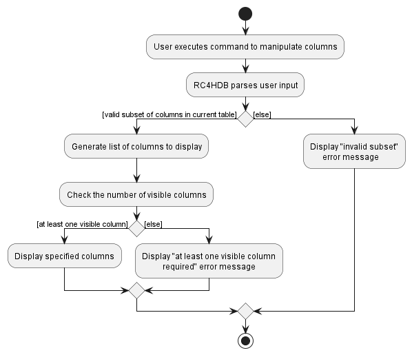
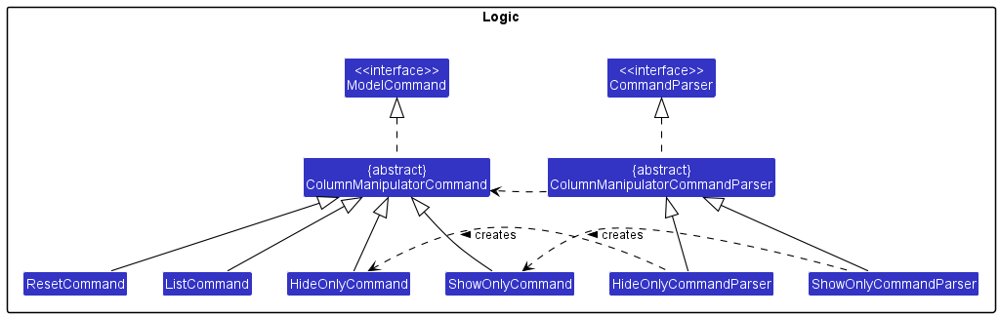
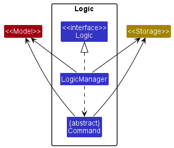
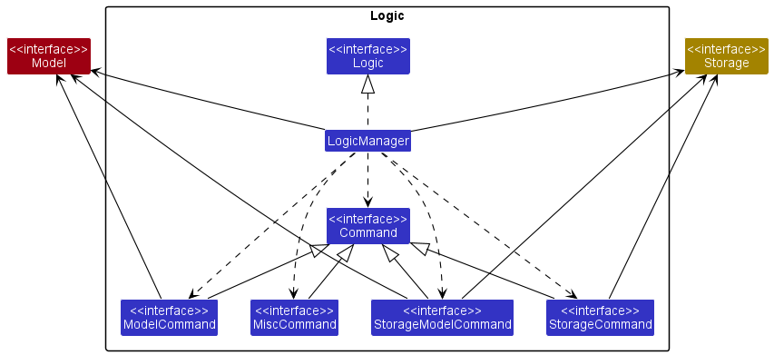
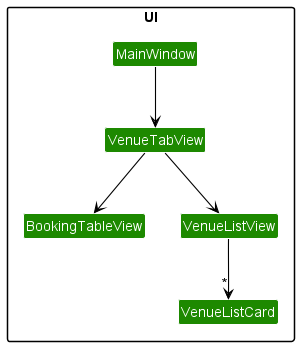
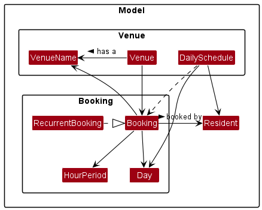
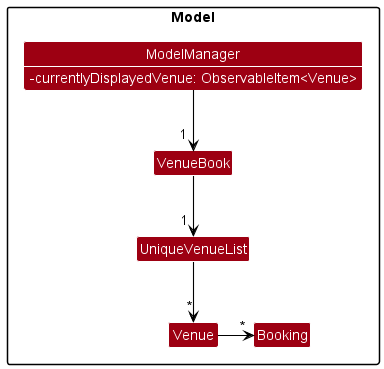
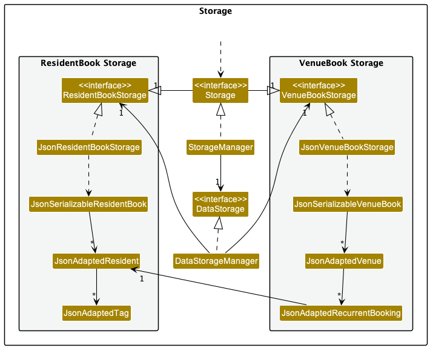
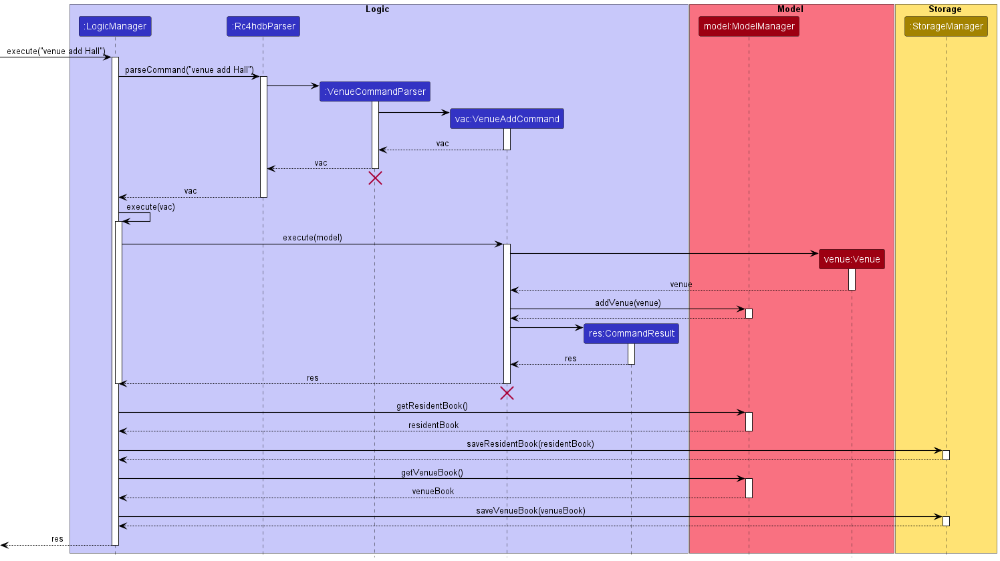

[Comment]: <> (landing page to be added here)

---

## **Table of Contents**

* [**Introduction**](#introduction)
* [**Design**](#design)
    * [Architecture](#architecture)
    * [Ui](#ui-component)
    * [Logic](#logic-component)
    * [Model](#model-component)
    * [Storage](#storage-component)
    * [Common classes](#common-classes)
* [**Implementation**](#implementation)
    * [Resident class](#the-resident-class)
    * [Displaying data](#displaying-data)
    * [Showing/hiding table columns](#manipulating-table-columns-using-showonly-and-hideonly)
    * [Filter fields](#filter-feature-to-filter-residents-according-to-fields)
    * [File management system](#multiple-data-files)
    * [Command history](#command-history)
    * [Venue and booking](#venue-and-booking)
* [**Acknowledgements**](#acknowledgements)
* [**Conclusion**](#conclusion)
* [**Appendix: Project requirements**](#appendix-project-requirements)
    * [Product scope](#product-scope)
    * [User stories](#user-stories)
    * [Use cases](#use-cases)
    * [Non-functional requirements](#non-functional-requirements)
    * [Glossary](#glossary)
* [**Appendix: Instructions for manual testing**](#appendix-instructions-for-manual-testing)
    * [Launch and shutdown](#launch-and-shutdown)
    * [Modifying residents](#modifying-residents)
    * [File management](#file-management)
    * [Venue management](#venue-management)
    * [Quality-of-life](#quality-of-life)

---

## **Introduction**

Welcome to our **Residential College 4 Housing Database (RC4HDB)** developer's guide. In case you do not already know what RC4HDB is, it is a desktop application which streamlines the daily workflow of [RC4](#glossary) housing management staff, by providing specialised features which solve their resident and venue management needs.

### Purpose

The RC4HDB developer's guide was created to provide future developers with readable and comprehensive documentation for the design of RC4HDB. We hope that after reading the document, you will gain a reasonable understanding of how RC4HDB was designed and the direction our [team](AboutUs.md) intends for RC4HDB to take.

### Scope

This document covers the following:
* High and low level design details of our application.
* Other potential implementations that we have considered and the reasons for our choice of our current implementation.
* RC4HDB [project requirements](#appendix-project-requirements).
* How you can go about [testing our application](#appendix-instructions-for-manual-testing).
* How you can [join](#joining-us) our team.

### Format of the guide

This document is arranged in a top-down format. We will begin by discussing high-level details, before discussing lower-level details of our application.

### Direction

With our resident and venue functionalities in place, we wish to enhance RC4HDB in the following ways:
* Improve the usability of the existing commands.
* Add data analysis tools.

### Getting started

A good place to start off with would be to take a look at the [design](#design) section of our guide, where you will find out about the high-level design details of **RC4HDB**. Otherwise, have a look at our [table of contents](#table-of-contents) for any sections of our guide that you may be interested in. If you are eager to work on the project, do refer to our section on how you can [join us](#joining-us).

---

## **Design**

RC4HDB aims to provide a complex set of features which are simple to use. Keeping this in mind,
we are pursuing an iterative approach, adding new features and functionalities amidst the evolving requirements.
This gives rise to the following main guiding principles for RC4HDB:

#### Maintainability

This project was adapted from an application called [`AddressBook Level 3 (AB3)`](https://se-education.org/addressbook-level3/). `AB3` was developed in a manner that facilitates easy modification of components. This design allows the functionalities implemented to be easily changed depending on the goals of the developers. Building upon the existing components in `AB3`, we have added additional classes to the major components which include [**`UI`**](#ui-component), [**`Logic`**](#logic-component), [**`Model`**](#model-component), [**`Storage`**](#storage-component).

#### Command Line Interface (CLI) Oriented

[**CLI**](#glossary) gives the user an easy way to type commands. This is especially useful for a target audience which is familiar with the process of performing admin tasks using a computer. For users who type fast, RC4HDB will be highly efficient and quick to respond, improving their existing processes of managing their housing database.

#### Color coding of components

To make it easier for readers to identify the components each class belong to in our UML diagrams, we have color coded each of our main components, `Model`, `Logic`, `Storage`, and `UI` with the following colors .


### Architecture


The ***Architecture Diagram*** given above explains the high-level design of the App.

Given below is a quick overview of main components and how they interact with each other.

**Main components of the architecture**

**`Main`** has two classes called [`Main`](https://github.com/se-edu/addressbook-level3/tree/master/src/main/java/seedu/address/Main.java) and [`MainApp`](https://github.com/se-edu/addressbook-level3/tree/master/src/main/java/seedu/address/MainApp.java). It is responsible for,
* At app launch: Initializes the components in the correct sequence, and connects them up with each other.
* At shut down: Shuts down the components and invokes cleanup methods where necessary.

[**`Commons`**](#common-classes) represents a collection of classes used by multiple other components.

The rest of the App consists of four components.

* [**`UI`**](#ui-component): The UI of the App.
* [**`Logic`**](#logic-component): The command executor.
* [**`Model`**](#model-component): Holds the data of the App in memory.
* [**`Storage`**](#storage-component): Reads data from, and writes data to, the hard disk.

**How the architecture components interact with each other**

The *Sequence Diagram* below shows how the components interact with each other for the scenario where the user issues the command `delete 1`.


Each of the four main components (also shown in the diagram above),

* defines its *API* in an `interface` with the same name as the Component.
* implements its functionality using a concrete `{Component Name}Manager` class (which follows the corresponding API `interface` mentioned in the previous point.

For example, the `Logic` component defines its API in the `Logic.java` interface and implements its functionality using the `LogicManager.java` class which follows the `Logic` interface. Other components interact with a given component through its interface rather than the concrete class (reason: to prevent outside component's being coupled to the implementation of a component), as illustrated in the (partial) class diagram below.


The sections below give more details of each component.

### UI component

The **API** of this component is specified in [`Ui.java`](https://github.com/se-edu/addressbook-level3/tree/master/src/main/java/seedu/address/ui/Ui.java)


The UI consists of a `MainWindow` that is made up of parts e.g.`CommandBox`, `ResultDisplay`, `ResidentTabView`, `VenueTabView`, `CurrentWorkingFileFooter` etc. All these, including the `MainWindow`, inherit from the abstract `UiPart` class which captures the commonalities between classes that represent parts of the visible GUI.

The `UI` component uses the JavaFx UI framework. The layout of these UI parts are defined in matching `.fxml` files that are in the `src/main/resources/view` folder. For example, the layout of the [`MainWindow`](https://github.com/se-edu/addressbook-level3/tree/master/src/main/java/seedu/address/ui/MainWindow.java) is specified in [`MainWindow.fxml`](https://github.com/se-edu/addressbook-level3/tree/master/src/main/resources/view/MainWindow.fxml)

The `UI` component,

* executes user commands using the `Logic` component.
* listens for changes to `Model` data so that the UI can be updated with the modified data.
* keeps a reference to the `Logic` component, because the `UI` relies on the `Logic` to execute commands.
* depends on some classes in the `Model` component, as it displays `Resident`, `Venue` and `Booking` object residing in the `Model`.

### Logic component

**API** : [`Logic.java`](https://github.com/AY2223S1-CS2103T-W12-3/tp/tree/master/src/main/java/seedu/rc4hdb/Logic.java)

Here's a (partial) class diagram of the `Logic` component:


How the `Logic` component works:
1. When `Logic` is called upon to execute a command, it uses the `Rc4hdbParser` class to parse the user command.
2. This results in a `Command` object (more precisely, an object of one of its subclasses e.g., `AddCommand`) which is executed by the `LogicManager`.
3. The command can communicate with the `Model` when it is executed (e.g. to add a person).
4. The result of the command execution is encapsulated as a `CommandResult` object which is returned back from `Logic`.

The Sequence Diagram below illustrates the interactions within the `Logic` component for the `execute("delete 1")` API call.


<div markdown="span" class="alert alert-info">:information_source: **Note:** The lifeline for `DeleteCommandParser` should end at the destroy marker (X) but due to a limitation of PlantUML, the lifeline reaches the end of diagram.
</div>

Here are the other classes in `Logic` (omitted from the class diagram above) that are used for parsing a user command:


How the parsing works:
* When called upon to parse a user command, the `Rc4hdbParser` class creates an `XYZCommandParser` (`XYZ` is a placeholder for the specific command name e.g., `AddCommandParser`) which uses the other classes shown above to parse the user command and create a `XYZCommand` object (e.g., `AddCommand`) which the `Rc4hdbParser` returns back as a `Command` object.
* All `XYZCommandParser` classes (e.g., `AddCommandParser`, `DeleteCommandParser`, ...) inherit from the `CommandParser` interface so that they can be treated similarly where possible e.g, during testing.
* Note that not all `CommandParser` classes depend on `CliSyntax`, `ArgumentTokenizer`, `ArgumentMultimap` and `ParserUtil`. e.g. `FileCommandParser` and `VenueCommandParser`.


The command class structure has been changed to provide an additional layer of abstraction using the four interface
classes ```ModelCommand```, ```StorageCommand```, ```StorageModelCommand``` and ```MiscCommand```. These interfaces all
implement the Command interface and is used as a intermediate barrier to build the command classes. The specific
commands implement these commands instead of directly implementing the Command interface in order to improve
the abstraction of commands.

### Model component

**API** : [`Model.java`](https://github.com/se-edu/addressbook-level3/tree/master/src/main/java/seedu/address/model/Model.java)


The `Model` component,

* stores the `ResidentBook` and `VenueBook` data, i.e. all `Resident` and `Venue` objects (which are further 
  contained in a `UniqueResidentList` object and `UniqueVenueList` object respectively).
* stores the currently selected venues and bookings, and the current set of visible and hidden table columns in 
  separate `ObservableList` objects.
    * The `Resident` objects are contained in a `FilteredList<Resident>` which are exposed to the outside as an unmodifiable `ObservableList`.
    * The `visibleFields` and `hiddenFields` are also exposed to the outside as unmodifiable `ObservableList` instances.
    * The UI can 'observe' these lists so that the UI automatically changes when the data in these lists change.
* stores a `UserPref` object that represents the user's preferences.
* does not depend on any of the other components (as the `Model` represents data entities of the domain, they should make sense on their own without depending on other components).

<!-- The references to Resident fields have been removed to reduce clutter -->

### Storage component

**API** : [`Storage.java`](https://github.com/AY2223S1-CS2103T-W12-3/tp/tree/master/src/main/java/seedu/rc4hdb/storage/Storage.java)


The `Storage` component,
* can save resident book data, venue book data and user preference data in json format, and read them back into corresponding objects.
* inherits from both `DataStorage` and `UserPrefStorage`, which means it can be treated as either one (if only the functionality of only one is needed).
* depends on some classes in the `Model` component (because the `Storage` component's job is to save/retrieve objects that belong to the `Model`)

The ```DataStorage``` class inherits ```ResidentBookStorage``` and ```VenueBookStorage```. The functionalities
of both these classes can be extended into DataStorage, which is applied by the ```DataStorageManager``` class.

### Common classes

Classes used by multiple components are in the `seedu.rc4hdb.commons` package.

---

## **Implementation**

This section describes some noteworthy details on how certain features are implemented. We have included other implementations that we have considered, along with reasons for choosing the current implementation over the others.

Here is a list of the details discussed:
* [Resident class](#the-resident-class)
* [Displaying data](#displaying-data)
* [Show only/Hide only commands](#show-onlyhide-only-commands)
* [Filter command](#filter-command)
* [Multiple data files](#multiple-data-files)
* [Command history](#command-history)
* [Venue and booking](#venue-and-booking)

---

### The Resident Class

`RC4HDB` seeks to serve as a housing management database, and as such, one of the first tasks at hand was to modify the
existing `AddressBook` application to one that makes use of the `Resident` class, which contains much more useful information as compared to the current fields that are supported by `Person`. `Person` contained the fields `Name`,
`Phone`, `Email`, `Address` and `Tags`. We decided to keep all of the above fields except `Address`. In addition,
we added the additional fields `Room`, `House`, `Gender`, `MatricNumber`, all of which are crucial information for the
housing management staff.

<br>

#### Refactoring of Classes

Refactoring of classes to make use of `Resident` related fields and information was a priority for us in the initial stages of development. With `Resident` not yet implemented, it was difficult for us to progress to other features that required the fields of said class. After this refactoring was done, all packages now fall under `seedu.rc4hdb`, the `Person` class was no longer needed, and `Resident` was able to replace it in all existing commands.

---

### Displaying Data

There are two main types of data that is stored and displayed, the `Resident`, and the `Venue`. As such, we have naturally separated the display of the two. The `MainWindow` contains two components, a `ResidentTabView` and a `VenueTabView`, which are responsible for displaying the respective information.

#### Resident Information

The `ResidentTabView` contains a `ResidentTableView` which is implemented via the `TableView` class of `JavaFX`. This is represented as a table, where each row corresponds to a `Resident` in `RC4HDB`, and each column corresponds to a field belonging to that `Resident`.

#### Design considerations

Aspect: Display format

Alternative 1 (current choice): Table

Pros:
* Ability to display condensed information clearly
* Ability to manipulate the data that can be displayed by showing and hiding field columns
* Ability for the user to view large amounts of information at a glance
* Powerful TableView implementation allows us to dynamically obtain resident field, and update the table when the Model changes

Cons:
* Possible information overload on the user
* Possible performance issues in terms of memory usage when the number of columns exceed 60

For more information on how the TableView implementation is powerful, we refer you to the [documentation](https://docs.oracle.com/javase/8/javafx/api/javafx/scene/control/cell/PropertyValueFactory.html)
on *method matching*, which is what we heavily used to fetch resident data.

For more information on possible performance **issue**, refer to this GitHub issue [here](https://github.com/javafxports/openjdk-jfx/issues/409).

Alternative 2: List

Pros:
* Ability to customize the layout of the data to be displayed
* Ability for the user to more focused by viewing lesser amounts of information at a glance

Cons:
* Possible lack of information displayed at a glance
* Less intuitive for handling large numbers of entries


For the purposes of the user, who has to deal with large amounts of residential information, we opted the use of the table.


#### Booking Information

Similar to the display of resident information, the `VenueTabView` contains a `BookingTableView` which was also implemented
via the `TableView` class of `JavaFX`. Here, each row corresponds to the `Day`, and each column corresponds to the `HourPeriod`.

##### Design considerations

Aspect: Display format

Alternative 1 (current choice): Table

Pros
* Decently proficient in displaying bookings

Cons
* Difficult to customize the design i.e. colors and size

Alternative 2: Grid

The implementation of the grid would be via a 8x16 grid of JavaFX containers using `HBox` and `VBox`. We would have nested
the `HBox` and `VBox` components to achieve a timetable like design to display the bookings.

Pros
* Decently proficient in displaying bookings
* Easier to customize the design i.e. colors and size

Cons
* Difficult and time-consuming to implement

Weighing the pros and cons, we decided to opt for the Table as it was sufficient for our purposes, without the addition
of any sizeable overhead.

<br>

---

### Manipulating table columns using `showonly` and `hideonly`

#### Changes to Model component:

For the `showonly` and `hideonly` features, we wanted to allow the `ResidentTableView` class in the UI to automatically 
update its columns based on user commands that affected the model. There needed to be some way for the 
`ResidentTableView` class to synchronise its columns with the corresponding field lists in `ModelManager`. 
From the below diagram, we can see that there is no association between `ModelManager` and `ResidentTableView`. 


One possible implementation was to store a reference to `ResidentTableView` in `ModelManager`, to update the 
UI directly whenever a command modified the field lists in `ModelManager`. However, this would increase the coupling 
between the UI and the model components, which would make integration and reuse of the module significantly harder. 

Our solution for this was to pass the field lists from `ModelManager` to `LogicManager` and then to `MainWindow`, 
as *unmodifiable* `ObservableList<String>` instances. These unmodifiable instances were then passed as arguments 
into the constructor of `ResidentTableView`, where we attached listeners to each of the lists. These listeners 
would update the column visibilities whenever the base `ObservableList<String>` instances in `ModelManager` changed.

This allowed us to apply the Observer pattern in our code, as the `ModelManager` class being observed is not coupled 
to the `ResidentTableView` class that is observing it (i.e. observing the field lists in `ModelManager`).

One interesting point to note is that there is a need to hold a reference to these unmodifiable `ObservableList<String>`
instances in `ModelManager`. This is because the `unmodifiableObservableList` method of `FXCollections` creates a wrapper 
and adds a *weak listener* to the original, backing `ObservableList`. If no reference to this wrapper 
(unmodifiable) list is held, it would end up being garbage collected, and the automatic UI updates would not work 
correctly. More information can be found [here](https://stackoverflow.com/questions/44341400/whats-the-purpose-of-fxcollections-unmodifiableobservablelist).

<br>

#### Restrictions on manipulating columns:

We decided to provide users with the flexibility of displaying or hiding any combination of the columns in the table 
view, with two exceptions: 

1. The user can only specify columns to show or hide that are in the current table view. 
   
    * This is to make the showing and hiding of columns more intuitive, as compared to our [previous implementation](#optional-reading-predecessors-to-showonly-and-hideonly). 

2. The user must have at least one column on his screen.

    * This is to avoid confusion with the table view shown when the list of residents is empty.

The activity diagram shown below for the column manipulation feature models the intended behaviour of RC4HDB based on 
user input, assuming the user enters valid fields (letters) in the correct command format.



#### Use of abstract classes for `showonly` and `hideonly`

The `hideonly` command alone is sufficient for users to hide their unwanted columns from the table view. However, 
we added support for both commands in order to improve the quality-of-life for RC4HDB users. Users can save time by 
using the complement command (`showonly` vs `hideonly`) depending on the relative number of fields they want to show or hide. 

After making this change, however, there were instances of undesirable code duplication in the commands and command
parsers for the `showonly` and `hideonly` features. For example, some input validation and utility methods were 
common among these classes.

Our solution was to abstract some of these commonalities into an abstract class, namely, 
`ColumnManipulatorCommand` for the `showonly` and `hideonly` commands (as well as `list` and `reset`), 
and `ColumnManipulatorCommandParser` for the `showonly` and`hideonly` command parsers. The UML diagram for the 
inheritance relationship is shown below. 



Adding these abstract classes also increased the extensibility of our application, as one of the future developments
for RC4HDB would be to implement the column manipulation features for the venue booking tables.

<br>

#### Choice of `ObservableList<String>` over `ObservableList<Field>`

The only information required by the `ResidentTableView` (to manipulate the columns) is the field identifier. Hence, the use of an 
`ObservableList<Field>` is redundant as none of the additional `Field` attributes need to be referenced. Using an 
`ObservableList<Field>` would also require the use of getters to extract the field identifier, which was unnecessary.

<br>

#### Optional reading: Predecessors to `showonly` and `hideonly`

For our previous iteration of RC4HDB, the `showonly` and `hideonly` features were handled by the `list /i` and 
`list /e` features, which have since been removed. 

For these overloaded `list` commands, the user could show or hide columns by specifying columns to include or exclude
when listing. 

However, there were two main issues with `list /i` and `list /e`:

1. These commands would cause the full list of residents to be displayed, removing the effects of the `filter` and 
`find` commands.
   
2. The columns to include or exclude were based on the full, default set of columns. Columns that were already 
excluded from the table had to be re-specified if additional columns were to be excluded. 
   
While it was convenient for the column manipulation feature to be bundled with the list command, we ultimately decided
to decrease coupling between both features, by replacing `list /i` and `list /e` with the `showonly` and `hideonly` 
commands. The feature to restore the full set of resident fields was implemented in the `reset` command, which does 
not affect the list of residents.

To make our commands more intuitive, we also made the `showonly` and `hideonly` commands state-dependent, so
that the user did not have to re-specify columns that were already hidden.

<br>

---

### Filter command

The previous AddressBook implementation only had a find command to search for specific residents according to the field.
Thus, a new command has been implemented to have an additional feature to filter the list of residents using every field
used to describe the resident.

<br>

#### Structure of the Command
A ```FilterCommand``` class and a ```FilterCommandParser``` class was implemented to follow the structure of the
```Logic``` component of the application. ```FilterCommand``` implements ```ModelCommand``` and the
```FilterCommandParser``` implements ```FilterCommandParser```. This structure allows the new filter feature to be
added without changing any of the Logic class components other than adding the cases to create a ```FilterCommand```
object

<br>

#### Creating a new ```ResidentDescriptor``` class

Previously, the edit feature utilized an ```EditDescriptor``` class to create an object that will store the parsed
information of the command to edit the specific Resident. Since the handler for the information was similar for the
filter feature, a new general ```ResidentDescriptor``` class was created which is used for both the edit and filter
features.

This makes it easier to update the features if there is a change in the structure of the fields or if there
is a new field added for the ```Resident```.

<br>

#### Creating a new ```Specifier``` class

There is a specifier after the filter keyword in the command that is used to select whether all or any of
the fields should match the residents' information in the database. A ```Specifier``` class is used to
represent the specifier as a wrapper to make the transferring of the specifier across classes easier and less
prone to errors.

<br>

#### Creating new predicate classes for filter

In order to check if the ```Resident``` objects passes matching the filter instructed by the user, a class
implementing the ```Predicate``` class needs to be created to handle this. Thus, two new classes
```AttributesMatchAllKeywords``` and ```AttributesMatchAnyKeyword``` hae been implemented to handle the logic of the
filtering for each type of specifier. Through this implementation, even more specifiers can be added during later cycles
of this project if required without any major restructuring of the initial classes created in this cycle.

<br>


#### Considerations

There was a choice to make the filter feature accept either only the exact string entered by the user or also
accept a field that contains the filter attribute given by the user. It is clear that the filter command would be more
flexible if the contains option is implemented as the user can use a substring of the actual field to filter
out residents. Thus, while keeping this advantage in mind, we have decided to make the filter feature accept fields
that contain the attributes instead of having it to be exactly equal.

<br>

---

### Multiple data files

#### Motivation

In the original `AddressBook`, the `Storage` component was implemented with the intent of users only being able to use a single data file. However, in `RC4HDB`, our target users would potentially benefit from being able to store their data in multiple files. Thus, we have decided to implement **file commands** which will provide users a way to **create**, **delete** and **switch** data files.

<br>

#### Storage command

The original `AddressBook` makes use of the [Command pattern](https://refactoring.guru/design-patterns/command), where the `Logic` component is in charge of executing commands. However, with the `AddressBook` implementation of the Command pattern, commands only have a reference to `Model`, which limits the command's ability to manipulate the `Storage`. Hence, in order to get around this, we came up with two different implementations which enable the manipulation of `Storage`, while retaining the ability of `Command` to manipulate `Model`.

<br>

##### Modifying the execute method for all commands

This implementation involves altering `Command` class the `execute(Model)` method to `execute(Model, Storage)`. This implementation is simple to implement, however it does not adhere to the [separation of concerns principle](https://deviq.com/principles/separation-of-concerns), potentially decreasing cohesion and increasing coupling.



As seen from the diagram above, there will be associations between `Storage` and `Model` for all commands, allowing for commands, such as `AddCommand` which only modifies `Model` to be able to modify `Storage`. Due to the flaw in this design, we decided to think of a better implementation.

<br>

##### Splitting the general command into specialized commands

This implementation involves splitting `Command` further into specialized `Command`s, which are only able to manipulate components that they are supposed to manipulate. After deliberation, we decided to split `Command` into `MiscCommand`, `ModelCommand`, `StorageCommand` and `StorageModelCommand`, which are only able to execute on their respective components, with `MiscCommand` executing on nothing. All of these specialized commands extend the base `Command`, which is kept for polymorphism purposes. Taking it a step further, we realized that `Command` only enforces the `execute` method in its subclasses, thus, we converted `Command` and the specialized commands into interfaces.



Comparing the diagram above with the diagram from the [other option](#modifying-the-execute-method-for-all-commands), `Command` is no longer associated with `Model` and `Storage`. Instead, `Model` and `Storage` are only associated with their respective specialized commands. While this effectively divides the responsibility of manipulating the `Model` and `Storage` amongst the specialized commands, it results in higher complexity. Weighing between our options, we decided to stick with this option due to it setting clear boundaries of what each command can and cannot do.

<br>

#### File commands

With our earlier issue of a lack of `Storage` reference in `Command` resolved, along with our new implementation of specialized commands, we decided to create an abstract `FileCommand` class which encapsulates commands which deal with files. Such commands will require a file path to be provided by the user, thus, we included logic that would likely be used by all `FileCommand` subclasses, to avoid repetition of common logic. We then proceeded with implementing a command that creates a new data file, a command that deletes an existing data file and a command that switches the current data file to another existing data file.

<br>

#### Create and delete file commands

Due to file creation and deletion not requiring an update to `Model`, but requiring access to `Storage`, we implement `FileCreateCommand` and `FileDeleteCommand` as storage commands. The file creation and deletion logic was then delegated to `Storage`, resulting in new methods, `createResidentBookFile(Path)` and `deleteResidentBookFile(Path)` being implemented.

<br>

#### Switch file command

Due to file switching requiring an update to not only `Storage`, but also `Model`, we implemented `FileSwitchCommand` as a storage model command. Similarly, the `setResidentBookFilePath(Path)` method was implemented to support the switching of files. As for the manipulation of `Model`, we made use of existing methods to update the user preferences and use the data file that the user intends to switch to as the data file that the application will read from when it first starts up. Additionally, the `FileSwitchCommand` also results in the `Model` updating its old data with the data from the file the user intends to switch to.

<br>

---

### Command history

The command history functionality allows the user to access past successfully executed commands by using the `UP_ARROW_KEY` and `DOWN_ARROW_KEY`.
The functionality consists of four classes, `CommandHistoryParser`, `CommandHistory`, `ForwardHistory` and `BackwardHistory`.

The `CommandHistoryParser` determines the `KEY` that was pressed by the user, and propagates the action to be taken, down to either
the `ForwardHistory` or `BackwardHistory` classes. 

These two classes extend from `CommandHistory`, which internally holds two stacks. The stacks maintain the order of retrieval of commands by
popping from one stack and pushing to the other. These actions are performed by the `ForwardHistory` and `BackwardHistory` classes as mentioned above.

The class diagram of `CommandHistory` is as follows.


While not mentioned in the diagram, the determination of a successful command is handled by the `Parsers` within the `Logic` component,
and therefore has an implicit dependency on them. Furthermore, as the list of successful commands are tracked in the `Ui` component,
and there is no need for the history to persist between instances, there is no dependency on the `Storage` component. There is also no
dependency on `Model`, as the functionalities are independent of it.

To illustrate how `CommandHistory` works, an activity diagram when using the `UP_ARROW_KEY` is provided below.


The activity diagram for the `DOWN_ARROW_KEY` is largely similar to the one above.

<<<<<<< HEAD
<br>

---

### Venue and booking

#### Motivation

As our [target user](#target-user-profile) would benefit greatly from being able to manage venues and bookings in RC4, we have decided to add a venue booking system in **RC4HDB**.

<br>

#### Planning the Ui

Using the top-down approach, we started by deciding on how we could display booking data in a format that our **target user** would benefit most. 

After consideration, we came up with two different formats for booking representation:
* Booking list display for each venue
* Weekly timetable (similar to NUSMods)

<br>

##### Booking list

Pros:
* Well suited for adhoc bookings
* Easier to implement commands to check if a venue has been booked during a certain date and time period

Cons:
* Does not represent empty time slots well
* Not temporally intuitive

<br>

##### Weekly timetable

Pros:
* Easier for users to distinguish between time periods where venue is booked and venue is not booked
* Well suited for recurrent bookings
* Format is familiar to **target user**
* Temporally intuitive

Cons:
* Difficult to implement adhoc bookings
* Only able to display the week's bookings for a single venue at a time

After considering both choices, we decided that a weekly timetable format would better serve our **target user**. However, due to limitations in time, we decided to implement only recurrent bookings and leave adhoc bookings to be implemented in a future iteration.

<br>

#### Ui implementation

Considering the fact that our Ui has no space for a timetable to be added in, we decided to make use of `Tab` and `TabView` from the JavaFX library. This allows us to keep our [`ResidentTableView`](#resident-information), while adding our timetable. However, we realised that users will need a way to view what venues are currently being tracked in **RC4HDB**. Thus, we decided to complement our timetable with a `ListView` which contains the list of venues being tracked.

With this, we went on implementing the following Ui parts:
* `VenueTabView`
* `BookingTableView`
* `VenueListView`
* `VenueListCard`

<br>

##### Venue tab view

This is just the Ui container component which contains the `BookingTableView` and `VenueListView`. We included this to reduce the clutter from having everything in the `MainWindow` class.

<br>

##### Booking table view

In order to implement a table-like timetable format, we made use of the `TableView` class in the JavaFX library. This allows us to easily achieve a table-like Ui graphic. Each row of the table will correspond to the bookings for a day of the week, with the columns corresponding to the time period of the booking, in 1-hour units. To be consistent with our previous implementation of `ResidentTableView`, where we made use of the Observer pattern, we will be adding a listener to a `Venue` that exists in the `Model` component.

<br>

##### Venue list view

To complement our `BookingTableView`, we added a `VenueListView` to display the venues that are currently being tracked by **RC4HDB**. The `VenueListView` is implemented with a `ListView` as a base, and each venue in the list is wrapped by a `VenueListCard` class which serves to beautify the list.

<br>

##### Interaction between each Ui part

The following diagram describes the interactions between each newly introduced Ui component.



<br>

#### Planning the data format

After deciding on how we would like to display our venue and booking data, we had to design our `Venue` and `Booking` data classes to fit our chosen `Ui` design.

<br>

##### Booking data

Considering that we are only going to implement `RecurrentBooking`, we minimally require:
* an association to the venue or venue identifier that is being booked by the booking
* an association to the resident that is making the booking
* a time period for the booking
* a day of the week for the booking

<br>

##### Venue data

In order to be able to keep track of venues, we implemented a `Venue` class, which has a unique identifier, in the form of `VenueName`. `VenueName` was implemented with the `Name` field in `Resident` in mind, as both are `VenueName` and `Name` served similar purposes before `Name` was no longer the unique identifier for `Resident`. Since each booking was tagged to a venue, we decided to add a list of bookings in `Venue`, to keep track of the bookings made for each venue.

<br>

##### Daily schedule

However, considering our usage of a `BookingTableView` Ui component, we had to transform the bookings for a venue into a format suitable for a table. To do so, we decided to add a `DailySchedule` data class, which will represent a row in our timetable implementation of the Ui. We will then pass a list of 7 `DailySchedule` to `BookingTableView` to represent a timetable of the bookings for a week, for a specified venue.

<br>

#### Data format implementation

Considering the requirements for venue and booking data, we have come up with the following design to suit our venue and booking data needs.



<br>

#### Model updates

With the new forms of data that **RC4HDB** has to keep track of, the `Model` component has to be updated to accommodate the venue and booking data. However, since bookings are stored in `Venue`, we only need to keep track of the venues in model, and we will have access to booking data. For our purposes, the `UniqueResidentList` implementation actually suits our venue data tracking needs, being the need for uniqueness of venues. Thus, we decided to reuse the `UniqueResidentList`, `ResidentBook` code for our `UniqueVenueList`, `VenueBook` classes.

The diagram below showcases the additional classes that were added into the `Model` component to support the venue and booking management feature.



As seen in the diagram, the `ModelManager` component contains a `VenueBook` and an `ObservableItem<Venue>`. Similarly to how `UniqueResidentList` contains an internal list which is wrapped with a `FilteredList` and listened to by the `ResidentTableView`, the `VenueListView` listens in on an unmodifiable version of the internal list in `UniqueVenueList` to update the list of venues that are tracked in our `Model`.

Additionally, the `BookingTableView` listens in on the `currentlyDisplayedVenue` for any additions to the list of bookings stored within the venue in `currentlyDisplayedVenue` and for when the venue in `currentlyDisplayedVenue` is replaced by another venue. This provides us an avenue to update the `BookingTableView` from the `ModelManager`.

<br>

#### Storage updates

With the addition of venue and booking data, we have to update the `Storage` component in order to allow for local storage of the new data required. Similarly to how we reused code from `UniqueResidentList` and `ResidentBook`, we reused the existing code that allows for storage of `ResidentBook` data in order to store our `VenueBook` data. 

The following diagram showcases the additions to the `Storage` component to support the venue and booking data storage:



As seen in the diagram, apart from the `DataStorageManager` class, all additions were heavily reused from the `ResidentBookStorage` portion. We added a `DataStorageManager` class to handle the `VenueBookStorage` and `ResidentBookStorage` needs. We intended for the `DataStorageManager` to be an all-purpose **RC4HDB** data storage, meaning that in the future, when more data needs to be tracked, such as perhaps finances and such, the `DataStorageManager` will serve as a go-to class to handle all **RC4HDB** data storage matters.

<br>

#### Logic updates

However, due to our application being [CLI](#command-line-interface-cli-oriented) oriented, we have to add another venue command, `VenueViewCommand`, to allow users to switch between viewing the bookings of a specified venue.

To support basic venue creation and deletion, booking and un-booking, and the switching of venue view we added the following venue commands:
* `VenueAddCommand`
* `VenueDeleteCommand`
* `VenueViewCommand`
* `BookCommand`
* `UnbookCommand`

Since all of the above commands have something to do with `Venue`, we created an abstract `VenueCommand` class with common logic between the above commands.

These commands will serve as a basic toolkit for our users to manage venue bookings.

<br>

##### Venue command flow

The following sequence diagram showcases the general flow of control for a `VenueCommand`. In the diagram, we used `VenueAddCommand` as an example.



<br>

---

## **Acknowledgements**

[comment]: <> (* {list here sources of all reused/adapted ideas, code, documentation, and third-party libraries -- include links to the original source as well})

RC4HDB is built upon [AddressBook-Level3](https://github.com/se-edu/addressbook-level3/tree/master/docs), a sample project that provides a starting point for Software Engineering (SE) students enrolled in CS2103T.

### Credits for code adapted from external sources

1. The code for some methods in `ResidentTableView` and `BookingTableView` was adapted from these threads on StackOverflow:
   * [How to show a list on table column with few fields of list items](https://stackoverflow.com/questions/31126123/how-to-show-a-list-on-table-column-with-few-fields-of-list-items), and
   * [Creating a row index column in JavaFX](https://stackoverflow.com/questions/33353014/creating-a-row-index-column-in-javafx)
2. `cleanBom` in `CsvReader` was adapted from this [thread](https://mkyong.com/java/java-how-to-add-and-remove-bom-from-utf-8-file/) on mkyong's website.
3. `NoSelectionModel` was adapted from [this thread](https://stackoverflow.com/questions/20621752/javafx-make-listview-not-selectable-via-mouse) on StackOverflow.

---

## **Conclusion**

Thank you for taking your time reading through this document. We would like to extend an invitation to those who are interested in joining our **RC4HDB** team. Below are details on how you may go about joining our team.

### Joining us

If you are interested in joining our team, do take a look at our [GitHub repository](https://github.com/AY2223S1-CS2103T-W12-3/tp), and the following guides on setting up.
* [Setting up](SettingUp.md)
* [Documentation guide](Documentation.md)
* [Testing guide](Testing.md)
* [Logging guide](Logging.md)
* [Configuration guide](Configuration.md)
* [DevOps guide](DevOps.md)

---

## **Appendix: Project requirements**

### Product scope

#### Target user profile:

* works in the housing management team for [**RC4**](#glossary) with several other co-workers
* has a need to manage a significant number of residents in [**RC4**](#glossary)
* is responsible for performing a wide variety of tasks including liasing with students/staff
* requires quick access to contact details and other relevant resident information
* prefer desktop apps over other types
* can type fast
* prefers typing to mouse interactions
* is reasonably comfortable using [**CLI**](#glossary) apps

#### Value proposition:

* manage contacts faster than a typical mouse/Graphic User Interface (GUI) driven app
* requires less technical knowledge to perform complex tasks
* easier on the eyes, as compared to compressed rows of data on Excel

### User stories

Our user stories have been packaged with the relevant functionalities that we will implement/have implemented.

They have been extensively documented [here](https://github.com/AY2223S1-CS2103T-W12-3/tp/issues?q=is%3Aissue+label%3Atype.Story), and have been prioritized accordingly:
1. 🟥 High: Must have
2. 🟧 Medium: Good to have
3. 🟨 Low: Nice to have


| Priority | As a ...          | I want to ...                                       | So that I can ...                                           |
|----------|-------------------|-----------------------------------------------------|-------------------------------------------------------------|
| 🟥       | basic user        | add new entries                                     | keep track of new residents                                 |
| 🟥       | basic user        | delete existing entries                             | remove residents who have left RC4                          |
| 🟥       | basic user        | edit existing entries                               | update any outdated or wrongly entered information          |
| 🟥       | basic user        | view all existing entries                           | get an overview of all residents                            |
| 🟥       | basic user        | search for existing entries                         | view their resident information                             |
| 🟥       | intermediate user | filter through entries via certain keywords         | view these residents                                        |
| 🟥       | basic user        | add new venues                                      | make these venues available for booking                     |
| 🟥       | basic user        | delete existing venues                              | prevent any bookings to be made                             |
| 🟥       | basic user        | add new bookings                                    | block certain time periods                                  |
| 🟥       | basic user        | delete existing bookings                            | free up these time periods for others                       |
| 🟥       | basic user        | view all bookings for a venue                       | see which time periods are free for booking                 |
| 🟥       | basic user        | view all existing venues                            | view all existing venues                                    |
| 🟥       | basic user        | switch between the resident tab and bookings tab    | better visualize my data                                    |
| 🟧       | intermediate user | hide certain columns                                | de-clutter my screen                                        |
| 🟧       | intermediate user | show previously hidden columns                      | get back to working on those data                           |
| 🟧       | intermediate user | delete multiple entries at a time                   | save time from individually removing them                   |
| 🟧       | basic user        | search for residents using a portion of their names | still find them without having to remember their full names |
| 🟧       | basic user        | add miscellaneous information to entries            | keep track of a little more information                     |
| 🟧       | advanced user     | create a new data file                              | maintain another list of residents                          |
| 🟧       | advanced user     | delete a file                                       | remove unused list of residents                             |
| 🟧       | advanced user     | switch between files                                | work on different files on the same system                  |
| 🟧       | advanced user     | import my data into the application                 | use RC4HDB to perform my tasks                              |
| 🟧       | new user          | see sample data                                     | how the application would like when in use                  |
| 🟧       | new user          | use the system without referring to the guide       | concentrate on my task                                      |
| 🟨       | basic user        | access commands I have previously entered           | save time on retyping them                                  |

*{More to be added}*

### Use cases

[comment]: <> (&#40;For all use cases below, the **System** is the `RC4HDB` and the **Actor** is the `user`, unless specified otherwise&#41;)

System: RC4HDB <br>
Use case: UC1 - Getting help with the application <br>
Actor: User <br>
MSS:

1. User needs help related to RC4HDB.
2. User requests for help in RC4HDB.
3. RC4HDB displays a message that directs the user to our user guide.

    Use case ends.

<br>

System: RC4HDB <br>
Use case: UC2 - Add a single resident <br>
Actor: User <br>
MSS:

1. New resident moves into [**RC4**](#glossary).
2. User has the personal details of a resident they wish to add.
3. User adds the resident to RC4HDB.
4. RC4HDB adds the resident to the data file.
5. RC4HDB displays the name and other information of the resident. <br>
   Use case ends.

Extensions:

&ensp; 3a. User enters resident information in an invalid format. <br>
&ensp; &emsp; &nbsp; 3a1. RC4HDB shows an error message. <br>
&ensp; &emsp; &nbsp; Use case resumes at step 3.

<br>

System: RC4HDB <br>
Use case: UC3 - Listing out information of all residents <br>
Actor: User <br>
MSS:

1. User wants to see the full list of residents in [**RC4**](#glossary).
2. User requests for the list of residents from RC4HDB.
3. RC4HDB displays the details of all residents in [**RC4**](#glossary).

    Use case ends.

Extensions:


&ensp; 2a. The list is empty. <br>
&ensp; &emsp; &nbsp; Use case ends.

<br>

System: RC4HDB <br>
Use case: UC4 - Hiding resident information from view <br>
Actor: User <br>
Precondition: There is at least one resident field being displayed in RC4HDB. <br>
MSS:

1. User wants to see only some resident fields on his/her screen.
2. User requests for RC4HDB to show or hide certain fields from the current view.
3. RC4HDB displays the residents' details with some fields omitted.

    Use case ends.

Extensions:

&ensp; 2a. The user specifies invalid fields to show or hide. <br>
&ensp; &emsp; &nbsp; 2a1. RC4HDB displays an error message. <br>
&ensp; &emsp; &nbsp; Use case resumes at step 2.

&ensp; 2b. The user tries to show zero fields or hide all fields. <br>
&ensp; &emsp; &nbsp; 2b1. RC4HDB displays an error message. <br>
&ensp; &emsp; &nbsp; Use case resumes at step 2.

<br>

System: RC4HDB <br>
Use case: UC5 - Resetting resident information that was hidden from view <br>
Actor: User <br>
MSS:

1. User wants to see the full set of resident fields on his/her screen.
2. User requests for RC4HDB to display the full set of resident fields.
3. RC4HDB displays the residents' details with the full set of fields shown.

   Use case ends.

Extensions:

&ensp; 2a. The full set of fields is already displayed. <br>
&ensp; &emsp; &nbsp; 2a1. RC4HDB displays residents' details with the same full set of fields shown. <br>
&ensp; &emsp; &nbsp; Use case ends.

<br>

System: RC4HDB <br>
Use case: UC6 - Editing a single resident’s information <br>
Actor: User <br>
MSS:

1. Resident has a specific change in personal information.
2. User edits the resident's information in RC4HDB.
3. RC4HDB updates the information of the specified resident.
4. RC4HDB displays a message detailing the changes made.

    Use case ends.

Extensions:

&ensp; 2a. There is no relevant category for that information. <br>
&ensp; &emsp; &nbsp; 2a1. RC4HDB shows an error message. <br>
&ensp; &emsp; &nbsp; Use case ends.


&ensp; 2b. User enters resident information in an invalid format. <br>
&ensp; &emsp; &nbsp; 2b1. RC4HDB shows an error message. <br>
&ensp; &emsp; &nbsp; Use case resumes at step 2.

<br>

System: RC4HDB <br>
Use case: UC7 - Finding a resident’s information by their name <br>
Actor: User <br>
MSS:

1. User wants to search for a resident’s information.
2. User makes a request to RC4HDB to find a resident by their name.
3. RC4HDB searches the database for the given name.
4. RC4HDB displays the resident's information.

    Use case ends.

Extensions:

&ensp; 3a. RC4HDB cannot find any resident matching the user input. <br>
&ensp; &emsp; &nbsp; 3a1. RC4HDB shows an error message. <br>
&ensp; &emsp; &nbsp; Use case resumes at step 2.


&ensp; 3b. RC4HDB finds multiple residents matching the user input. <br>
&ensp; &emsp; &nbsp; 3b1. RC4HDB shows a list of all matching residents. <br>
&ensp; &emsp; &nbsp; Use case ends.

<br>

System: RC4HDB <br>
Use case: UC8 - Filtering the list of all residents by specific fields <br>
Actor: User <br>
MSS:

1. User wants to see a list of residents that fall under a certain category.
2. User requests for a filtered list from RC4HDB based on the relevant categories.
3. RC4HDB shows the filtered list.

    Use case ends.

Extensions:

&ensp; 2a. User enters an invalid specifier i.e. one that is not `/all` or `/any`. <br>
&ensp; &emsp; &nbsp; 2a1. RC4HDB shows an error message. <br>
&ensp; &emsp; &nbsp; Use case resumes at step 2.

&ensp; 2b. User enters multiple specifiers i.e. both `/all` and `/any`. <br>
&ensp; &emsp; &nbsp; 2b1. RC4HDB shows an error message. <br>
&ensp; &emsp; &nbsp; Use case resumes at step 2.

&ensp; 2c. User enters a category that does not exist. <br>
&ensp; &emsp; &nbsp; 2c1. RC4HDB shows an error message. <br>
&ensp; &emsp; &nbsp; Use case resumes at step 2.

&ensp; 2d. User enters a value that does not exist in the category. <br>
&ensp; &emsp; &nbsp; 2d1. RC4HDB shows an error message. <br>
&ensp; &emsp; &nbsp; Use case resumes at step 2.

<br>

System: RC4HDB <br>
Use case: UC9 - Deleting a single resident <br>
Actor: User <br>
MSS:

1. Resident moves out of [**RC4**](#glossary).
2. User deletes the resident from RC4HDB.
3. RC4HDB removes the corresponding resident from the database.
4. RC4HDB displays the details of that resident that has been deleted.

    Use case ends.

Extensions:

&ensp; 2a. User enters an invalid input. <br>
&ensp; &emsp; &nbsp; 2a1. RC4HDB shows an error message. <br>
&ensp; &emsp; &nbsp; Use case resumes at step 2.

<br>

System: RC4HDB <br>
Use case: UC10 - Deleting multiple residents <br>
Actor: User <br>
MSS:

1. Multiple Residents that fall under the same categories have moved out. [**RC4**](#glossary).
2. User deletes the residents from RC4HDB using the categories.
3. RC4HDB removes the corresponding residents from the database.
4. RC4HDB displays the number of residents that has been deleted.

   Use case ends.

Extensions:

&ensp; 2a. User enters an invalid input. <br>
&ensp; &emsp; &nbsp; 2a1. RC4HDB shows an error message. <br>
&ensp; &emsp; &nbsp; Use case resumes at step 2.

<br>

System: RC4HDB <br>
Use case: UC11 - Clearing all data <br>
Actor: User <br>
MSS:

1. User wants to clear all data from the current working file.
2. RC4HDB clears all data from the current working file.
3. RC4HDB shows a success message.

    Use case ends.

<br>

System: RC4HDB <br>
Use case: UC12 - Exiting the application <br>
Actor: User <br>
MSS:

1. User has completed his/her tasks and wants to exit the application.
2. User exits the application.
3. RC4HDB application closes.

    Use case ends.

Extensions:

&ensp; 2a. User clicks on the exit button. <br>
&ensp; &emsp; &nbsp; 2a1. RC4HDB application closes. <br>
&ensp; &emsp; &nbsp; Use case ends.

<br>

System: RC4HDB <br>
Use case: UC13 - Importing data from [CSV](#glossary) file <br>
Actor: User <br>
MSS:

1. User has a data file with resident’s information, and wants to view it in RC4HDB.
2. User imports the file.
3. RC4HDB reads the file.
4. RC4HDB displays the name of the [**CSV**](#glossary) file after the file has been read.
5. RC4HDB displays all the information stored in the file.

    Use case ends.

Extensions:

&ensp; 2a. Information in the [**CSV**](#glossary) file has not been stored in the proper format. <br>
&ensp; &emsp; &nbsp; 2a1. RC4HDB shows an error message. <br>
&ensp; &emsp; &nbsp; Use case resumes at step 2.


&ensp; 3a. No file could be found at the specified file path. <br>
&ensp; &emsp; &nbsp; 3a1. RC4HDB shows an error message. <br>
&ensp; &emsp; &nbsp; Use case resumes at step 2.

<br>

System: RC4HDB <br>
Use case: UC14 - Add a single venue <br>
Actor: User <br>
MSS:

1. New venue has been established in [**RC4**](#glossary).
2. User has the name of the venue they want to add.
3. User adds the venue RC4HDB.
4. RC4HDB adds the venue to the data file.
5. RC4HDB displays the venue. <br>
   Use case ends.

Extensions:

&ensp; 3a. User enters venue information in an invalid format. <br>
&ensp; &emsp; &nbsp; 3a1. RC4HDB shows an error message. <br>
&ensp; &emsp; &nbsp; Use case resumes at step 3.

<br>

System: RC4HDB <br>
Use case: UC15 - Deleting a single venue <br>
Actor: User <br>
MSS:

1. Venue is not available for booking in [**RC4**](#glossary).
2. User deletes the venue from RC4HDB.
3. RC4HDB removes the corresponding venue from the database.
4. RC4HDB displays the details of that venue that has been deleted.

   Use case ends.

Extensions:

&ensp; 2a. User enters an invalid input. <br>
&ensp; &emsp; &nbsp; 2a1. RC4HDB shows an error message. <br>
&ensp; &emsp; &nbsp; Use case resumes at step 2.

<br>

System: RC4HDB <br>
Use case: UC16 - Viewing a venue <br>
Actor: User <br>
MSS:

1. User wants to view the bookings of a specific venue.
2. User makes a request to RC4HDB to view the venue bookings by their name.
3. The application will display the venue bookings according to the day and time of the bookings.
4. RC4HDB displays the details of that venue that has been deleted.

   Use case ends.

Extensions:

&ensp; 2a. User enters an invalid input. <br>
&ensp; &emsp; &nbsp; 2a1. RC4HDB shows an error message. <br>
&ensp; &emsp; &nbsp; Use case resumes at step 2.

<br>

System: RC4HDB <br>
Use case: UC17 - Add a single booking <br>
Actor: User <br>
MSS:

1. User wants to book a venue [**RC4**](#glossary).
2. User has the details of the booking they want to make.
3. User books the venue for a particular time period using RC4HDB.
4. RC4HDB books the venue for the time period in the data file.
5. RC4HDB displays the booking. <br>
   Use case ends.

Extensions:

&ensp; 3a. User enters venue information in an invalid format. <br>
&ensp; &emsp; &nbsp; 3a1. RC4HDB shows an error message. <br>
&ensp; &emsp; &nbsp; Use case resumes at step 3.

&ensp; 3b. A booking already exists in the requested time slot <br>
&ensp; &emsp; &nbsp; 3b1. RC4HDB shows an error message. <br>
&ensp; &emsp; &nbsp; Use case resumes at step 3.

<br>

System: RC4HDB <br>
Use case: UC18 - Deleting a single booking <br>
Actor: User <br>
MSS:

1. User wants to cancel a booking in [**RC4**](#glossary).
2. User deletes the booking from RC4HDB.
3. RC4HDB removes the corresponding booking from the database.
4. RC4HDB displays the details of that booking that has been deleted.

   Use case ends.

Extensions:

&ensp; 2a. User enters an invalid input. <br>
&ensp; &emsp; &nbsp; 2a1. RC4HDB shows an error message. <br>
&ensp; &emsp; &nbsp; Use case resumes at step 2.

<br>

[comment]: <> (*{More to be added}*)

### Non-Functional Requirements

#### Accessibility
* The application must not require an internet connection to work
* Inputs must be done through the [`Command Line Interface (CLI)`](#glossary)
* The application must be sufficiently light-weight to be run by older computer systems
* Should work on any [`Mainstream OS`](#glossary) as long as it has Java 11 or above installed
* A user with above average typing speed for regular English text (i.e. not code, not system admin commands) should be able to accomplish most of the tasks faster using commands than using the mouse

#### Quality
* The application must be able to be easily learnt within a week by administrative staff with limited technical knowledge

#### Technical
* The system must be able to handle approximately 300 to 500 entries without a noticeable sluggishness in performance for typical usage
* The system must be flexible and extensible for potential overhaul or changes to the [**RC4**](#glossary) housing management system
* The system must not lose any data if the exit command is triggered by the user.
* The system must not lose any data if the system is forcibly closed via other means than the exit command.
* Installing a new update shall not in any way, modify or erase existing data and value from the previous version, and the new update should be compatible with the data produced earlier within the system.

*{More to be added}*

### Glossary
* **Command Line Interface (CLI)**: An area in the application interface for users to input commands
* **Comma-Separated Values (CSV)**: A delimited text file that uses a comma to separate values and each line of the file is a data record
* **Display Window**: An area in the application interface for users to view the output of their commands
* **Mainstream OS**: Windows, Linux, Unix, OS-X
* **NUS**: The National University of Singapore
* **RC4**: Residential College 4 which resides in NUS
* **Resident**: A NUS student who lives in RC4

---

## **Appendix: Instructions for manual testing**

Given below are instructions to test the app manually. The following instructions are organised in a similar manner as our **User Guide**. We recommend that you refer to our **User Guide** for a basic idea of how each command works before proceeding with manual testing.

<div markdown="span" class="alert alert-info">:information_source: **Note:** These instructions only provide a starting point for testers to work on;
testers are expected to do more *exploratory* testing.

</div>

### Table of contents for manual testing

* [**Launch and shutdown**](#launch-and-shutdown)
  * [Initial launch](#initial-launch)
  * [Saving window preferences](#saving-window-preferences)
  * [Starting up with missing/corrupted data files](#starting-up-with-missingcorrupted-data-files)
* [**Modifying residents**](#modifying-residents)
  * [Adding a resident](#adding-a-resident)
  * [Editing an existing resident](#editing-an-existing-resident)
  * [Deleting a resident](#deleting-a-resident)
  * [Clearing all residents](#clearing-all-residents)
* [**Viewing residents**](#viewing-residents)
  * [Listing residents](#listing-residents)
  * [Showing resident fields](#showing-resident-fields)
  * [Hiding resident fields](#hiding-resident-fields)
  * [Resetting hidden resident fields](#resetting-hidden-resident-fields)
  * [Finding residents](#finding-residents)
  * [Filtering residents](#filtering-residents)
* [**File management**](#file-management)
  * [Creating a new data folder](#creating-a-new-data-folder)
  * [Deleting an existing data folder](#deleting-an-existing-data-folder)
  * [Switching to a different data folder](#switching-to-a-different-data-folder)
  * [Importing resident data from CSV file](#importing-resident-data-from-csv-file)
* [**Venue management**](#venue-management)
  * [Adding a venue](#adding-a-venue)
  * [Deleting a venue](#deleting-a-venue)
  * [Viewing a venue](#viewing-a-venue)
  * [Adding a booking](#adding-a-booking)
  * [Deleting a booking](#deleting-a-booking)
* [**Quality-of-life**](#quality-of-life)
  * [Command history](#browsing-recently-used-commands)
  * [Opening help window](#getting-help)
  * [Accessing command input box](#accessing-the-command-input-box)
  * [Switching tabs](#switching-tabs))

---

### Launch and shutdown

#### Initial launch

1. Download the jar file and copy into an empty folder.

2. Double-click the jar file Expected: Shows the GUI with a set of sample contacts. The window size may not be optimum.

#### Saving window preferences

1. Resize the window to an optimum size. Move the window to a different location. Close the window.

2. Re-launch the app by double-clicking the jar file.<br>
    Expected: The most recent window size and location is retained.

#### Starting up with missing/corrupted data files

#### Exiting RC4HDB

1. Exiting via command-line

    1. Test case: `exit`<br>
       Expected: Window closes.

2. Exiting via keyboard-shortcut

    1. Test case: Pressing `ESC`<br>
       Expected: Window closes.

### Viewing residents

#### Listing residents

1. Listing all residents in the resident list after calling `find` or `filter` (sequential testing)

    1. Prerequisites: List all persons using the `list` command. Multiple persons already in the list.

    2. First, enter `add  n/Peter Senge p/90798012 e/ps@email.com r/16-19 g/M h/D m/A0238871H`.
       Expected: `Peter Senge` is added to the list. The full list is displayed after adding the resident.
       
    3. Next, enter `add  n/Teng Mui Kiat p/88032012 e/tmk@email.com r/08-19 g/M h/D m/A0198211G`.
       Expected: `Teng Mui Kiat` is added to the list. The full list is displayed after adding the resident.
       
    4. Now, enter `find eng`. Expected: At least two residents are displayed in the list, i.e. `Peter Senge` and `Teng
       Mui Kiat`. This means that the list of residents shown is no longer the full list.
       
       - Alternatively, enter `filter /all h/D`. Expected: Same as *iv*.
       
    5. Enter `list`. Expected: The full list of residents should be displayed, along with `Peter Senge` and `Teng
       Mui Kiat`.

    6. Note the incorrect command: `find`<br>
       Expected: The list of residents displayed does not change. Error details shown in the status message. 
    
    7. Note the incorrect command: `filter` or `filter /all`<br>
       Expected: The list of residents displayed does not change. Error details shown in the status message. 
       

2. Listing all resident fields after calling `showonly` or `hideonly` (sequential testing)

    1. Prerequisites: The full set of resident fields is being shown in the table. Otherwise, use `reset` to display
       the full set of resident fields.
       
    2. Enter `showonly n p e`.
       Expected: The list of residents being displayed does not change, but only the `name`, `phone` and `email` 
       columns are shown in the table.
       
        - Alternatively, enter `hideonly i r g m h t`. Expected: Same as *ii*.
    
    3. Enter `list`. Expected: The full set of resident fields is displayed in the table, along with the full list of 
       residents.
       
    4. Note the incorrect command: `showonly` or `hideonly`.
       Expected: The set of fields displayed does not change. Error details shown in the status message.

       
#### Showing/hiding and resetting resident fields

1. Using `showonly` to show only some resident fields + `reset` (sequential testing)

    1. Prerequisites: The full set of resident fields is being shown in the table. Otherwise, use `reset` to display
       the full set of resident fields.
       
    2. Enter `showonly n p e`.
       Expected: The list of residents being displayed does not change, but only the `name`, `phone` and `email`
       columns are shown in the table.
       
    3. Enter `showonly r m g h`.
       Expected: Invalid columns specified. The set of resident fields being displayed does not change as the specified 
       fields are not present in the current table. Error details are shown in the status message. 
       
    4. Enter `showonly n`.
       Expected: The list of residents being displayed does not change, but only the `name` column is shown in 
       the table.
       
    5. Enter `reset`.
       Expected: The full set of resident fields is displayed in the table.
       
    6. Note the incorrect command: `showonly`
       Expected: The set of resident fields being displayed does not change. Error details are shown in the status 
       message. 


2. Using `hideonly` to hide only some resident fields + `reset` (sequential testing)

    1. Prerequisites: The full set of resident fields is being shown in the table. Otherwise, use `reset` to display
       the full set of resident fields.

    2. Enter `hideonly i r m g h t`.
       Expected: The list of residents being displayed does not change, but only the `name`, `phone` and `email`
       columns are shown in the table.

    3. Enter `hideonly r h`.
       Expected: Invalid columns specified. The set of resident fields being displayed does not change as the specified 
       fields are not present in the current table. Error details are shown in the status message.

    4. Enter `hideonly p e`.
       Expected: The list of residents being displayed does not change, but only the `name` column is shown in
       the table.
       
    5. Enter `hideonly n`.
       Expected: The set of resident fields being displayed does not change as users cannot hide all columns. Error
       details are shown in the status message.
       the table.

    6. Enter `reset`.
       Expected: The full set of resident fields is displayed in the table.

    7. Note the incorrect command: `hideonly`
       Expected: The set of resident fields being displayed does not change. Error details are shown in the status
       message.
       
### Modifying residents

#### Deleting a resident

1. Deleting a resident while all persons are being shown

   1. Prerequisites: List all residents using the `list` command. Multiple residents in the list.
   
   1. Test case: `delete 1`<br>
      Expected: First resident is deleted from the list. Details of the deleted resident shown in the status message. Timestamp in the status bar is updated.

   1. Test case: `delete 0`<br>
      Expected: No resident is deleted. Error details shown in the status message. Status bar remains the same.

   1. Other incorrect delete commands to try: `delete`, `delete x`, `...` (where x is larger than the list size)<br>
      Expected: Similar to previous.
2. _{ more test cases …​ }_

### Deleting multiple residents

1. Deleting multiple residents while all persons are being shown

    1. Prerequisites: List all residents using the `list` command. Multiple residents in the list.

    1. Test case: `remove /any r/02-02 g/M h/D t/friend` <br>
       Expected: residents are deleted accordingly. Number of residents deleted shown in the status message.
    1. Test case: `remove any/ r/02-02 g/M h/D t/friend` <br>
       Expected: Residents are not deleted. Error details shown in the status message.
    1. Other incorrect delete commands to try: `remove`, `remove x`, `...` (where x is any other string that is not the specifier)<br>
       Expected: Similar to previous.

1. _{ more test cases …​ }_

### Editing a resident

1. Editing a resident while all residents are being shown

    1. Prerequisites: List all residents using the `list` command. Multiple residents in the list.

    1. Test case: `edit r/02-02 g/M h/D t/friend` <br>
       Expected: First resident is edited from the list. Details of the deleted resident shown in the status message.
    1. Test case: `edit r/02-02 g/L h/D t/friend` <br>
       Expected: No resident is edited. Error details shown in the status message. Status bar remains the same.
    1. Other incorrect delete commands to try: `edit`, `edit l/`, `...` <br>
       Expected: Similar to previous.

1. _{ more test cases …​ }_


### Adding a resident

1. Adding a resident while all resident are being shown

    1. Prerequisites: List all residents using the `list` command. Multiple residents in the list.

    2. Test case: `add n/ Joe Don p/ 81616144 e/Joe@example.com r/02-02 g/M h/D m/A0210101X t/friend t/break`<br>
        Expected: resident is added to the list. Details of the newly added resident shown in the status message.

    3. Test case: `add n/ Joe Don p/ 81616144 e/Joe@example.com r/02-02 m/A0210101X t/friend t/break`<br>
        Expected: No person is added. Error details shown in the status message.

    4. Other incorrect delete commands include having invalid or missing information in the command <br>
       Expected: Similar to previous.

2. _{ more test cases …​ }_

### Filtering a resident

1. Filtering a resident while all resident are being shown

    1. Prerequisites: List all residents using the `list` command. Multiple residents in the list.

    2. Test case: `filter /any r/02-02 g/M h/D t/friend`<br>
       Expected: List is filtered accordingly. Number of residents filtered shown in the status message.

    3. Test case: `filter any/ r/02-02 g/M h/D t/friend`<br>
        Expected: Residents are not filtered. Error details shown in the status message.

    4. Other incorrect delete commands include having invalid or missing information in the command <br>
       Expected: Similar to previous.

2. _{ more test cases …​ }_


### File management

#### Creating a new data folder

1. Creating a new data folder when a folder with the same name already exists.

   1. Prerequisites: Have a data folder in the `ROOT/data` directory with the same name as the folder you are trying to create.

   2. Test case: `file create already_exist` <br>
       Expected: An error message indicating that the folder you are about to create already exists will be displayed in the result panel.

   3. Test case: `file create current_folder` when `ROOT/data/current_folder` is the folder currently in view <br>
       Expected: An error message indicating that the folder you are trying to create is the folder that is currently in view will be displayed in the result panel. No creation occurs.

2. Creating a new data folder when no folder with the same name already exists.

   1. Prerequisites: `ROOT/data` directory does not have a data folder with the same name as the folder you are trying to create.

   2. Test case: `file create does_not_exist` <br>
       Expected: A folder with the name `does_not_exist` is created in the `ROOT/data` directory.

#### Deleting an existing data folder

1. Deleting a data folder that does not exist.

   1. Prerequisites: There is no folder in the `ROOT/data` directory that has the same name as the data folder you are trying to delete.

   2. Test case: `file delete does_not_exist` <br>
       Expected: An error message indicating that the folder you are trying to delete does not exist will be displayed in the result panel.

2. Deleting a data folder that exists.

   1. Prerequisites: There is an existing folder in the `ROOT/data` directory that has the same name as the data folder you are trying to delete.

   2. Test case: `file delete already_exists` <br>
       Expected: Deletes the `already_exists` folder.

   3. Test case: `file delete current_folder` when `ROOT/data/current_folder` is the folder currently in view <br>
       Expected: An error message indicating that the folder you are trying to delete is the folder that is currently in view will be displayed in the result panel. No deletion occurs.

#### Switching to a different data folder

1. Switching to a data folder that does not exist.

   1. Prerequisites: There is no folder in the `ROOT/data` directory that has the same name as the data folder you are trying to switch to.

   2. Test case: `file switch does_not_exist` <br>
       Expected: An error message indicating that the folder you are trying to switch to, does not exist will be displayed in the result panel.

2. Switching to a data folder that exists.

   1. Prerequisites: There is an existing folder in the `ROOT/data` directory that has the same name as the data folder you are trying to switch to.

   2. Test case: `file switch already_exists` <br>
       Expected: Switches to the `already_exists` folder.

   3. Test case: `file switch current_folder` when `ROOT/data/current_folder` is the folder currently in view <br>
       Expected: An error message indicating that the folder you are trying to switch to is already the currently viewed data folder will be displayed in the result panel.

#### Importing resident data from CSV file

[Comment]: <> (Update CSV format link when UG is compiled)

1. Importing from a valid CSV file.

   1. Prerequisites: Have an existing CSV file in the proper format, as specified in the [CSV format]() section of our **User Guide**.

   2. Test case: `file import valid_file`, where `valid_file` is the name of your valid CSV file <br>
       Expected: A new data folder, with the name `valid_file` is created in `ROOT/data` directory. The new resident data imported from `valid_file.csv` will be stored in `ROOT/data/valid_file/resident_data.json` file, and the `valid_file.csv` file will remain inside the data folder.

<br>

### Venue management

#### Adding a venue (Buggy as of v1.3 - venue added does not show up immediately)

1. Adding a venue from Bookings tab.
   1. Prerequisites: View the Bookings tab, with `Hall` being one of the existing venues while `Recreational Room` is not.
   2. Test case: `venue add Recreational Room`<br>
      Expected: Recreational Room is added to the venue list. Status message reflects the successful addition.
   3. Test case: `venue add Hall`<br>
      Expected: An error message indicating that the venue "Hall" already exists.
   4. Other valid and invalid commands that vary the case of characters in `Hall` and `Recreational Room`.<br>
      Expected: Same outcome as the original commands.

#### Deleting a venue

1. Deleting a venue from Bookings tab.
   1. Prerequisites: View the Bookings tab, with `Recreational Room` being one of the existing venues, while `Recre Room` is not.
   2. Test case: `venue delete Recreational Room`<br>
      Expected: Recreational Room is deleted from the venue list. Status message reflects the successful deletion.
   3. Test case: `venue delete Recre Room` <br>
      Expected: An error message indicating that the venue "Recre Room" does not exist.
   4. Other valid and invalid commands that vary the case of characters in `Recreational Room` and `Recre Room`<br>
      Expected: Same outcome as the original commands.

#### Viewing a venue

1. Viewing a venue with existing Bookings.
   1. Prerequisites: View the Bookings tab, with `Hall` and `Meeting Room` being 2 venues, both with valid Bookings. `Recreational Room` is not an existing venue.
   2. Test case: `venue view Hall`, followed by `venue view Meeting Room`<br>
      Expected: Booking details change from that of `Hall` to that of `Meeting Room`. Status message indicates the successful switching between the viewing of booking data of `Hall` and `Meeting Room`.
   3. Test case: `venue view Recreational Room`<br>
      Expected: An error message indicating that the venue "Recreational Room" does not exist.

#### Adding a booking

1. Adding a Booking to a venue with no clashing Bookings.
   1. Prerequisites: View the venue `Hall` in the Bookings tab. No Booking in the time slot `Monday` from `0800 to 1100`. At least one resident in the database.
   2. Test case: `venue book 1 v/Hall tp/8-11 d/Mon`<br>
      Expected: Booking made on`Monday` from `0800 to 1100` by the first resident in the database.
   3. Other invalid commands which contain an invalid input in one of the parameters<br>
      Expected: Booking not made. An error message indicating the error in the specified parameter.
2. Adding a Booking to a venue with a clashing Booking.
   1. Prerequisites: View the venue `Hall` in the Bookings tab. An existing Booking in the time slot `Monday` from `0800 to 1100`. At least one resident in the database.
   2. Test case: `venue book 1 v/Hall tp/8-11 d/Mon`<br>
      Expected: Booking not made. An error message indicating the clash with an existing Booking.

#### Deleting a booking

1. Deleting a valid Booking to a venue.
   1. Prerequisites: View the venue `Hall` in the Bookings tab. An existing Booking in the time slot `Monday` from `0800 to 1100`.
   2. Test case: `venue unbook v/Hall tp/8-11 d/Mon`<br>
      Expected: Booking successfully deleted. 
   3. Test case: `venue unbook v/Hall tp/8-10 d/Mon`<br>
      Expected: Booking not deleted. An error message indicating that the Booking at `Hall`, on `Monday` from `8 to 10` was not found.
   4. Other invalid unbook commands to try: `unbook`, `unbook v/Hall tp/8-11 d/monday`, `...` (invalid `Venue`, `TimePeriod`, and `Day`s)<br>
      Expected: Similar to previous.

<br>

### Quality-of-life

We recommend viewing the [Quality-of-life](UserGuide.md#quality-of-life) section before proceeding, as the following largely tests the functionality from that section.

#### Browsing recently-used commands

1. Browsing recent valid commands

   1. Prerequisites: List all residents using the `list` command, followed by adding a resident using the `add` command. The following
   test cases are to be done sequentially.

   2. Test case: Pressing `UP_ARROW_KEY`<br>
      Expected: `add` command is copied onto the input command box.

   3. Test case: Pressing `UP_ARROW_KEY`<br>
      Expected: `add` command is replaced and `list` command is copied onto the input command box.

   4. Test case: Pressing `DOWN_ARROW_KEY`<br>
      Expected: `list` command is replaced and `add` command is copied onto the input command box.

   5. Test case: Pressing `DOWN_ARROW_KEY`<br>
      Expected: `add` command is replaced and ` ` is copied onto the input command box. i.e. no command

#### Getting help

1. Opening the Help Window

   1. Prerequisites: Help Window is not currently opened.

   2. Test case: `help`<br>
      Expected: Help Window pops up.

   3. Test case: Pressing `F1`<br>
      Expected: Help Window pops up.

2. Closing the Help Window

   1. Prerequisites: Help Window is currently opened.

   2. Test case: Pressing `X` of the Help Window.<br>
      Expected: Help Window closes.

   3. Test case: Pressing `ESC`<br>
      Expected: Help Window closes.

#### Accessing the command input box

1. Accessing command input

   1. Prerequisites: Command input box is not in focus.

   2. Test case: Pressing `F3`<br>
      Expected: Command input box is in focus and ready for user command.

#### Switching tabs

1. Switching between `Resident` and `Bookings` tab

   2. Test case: Pressing `CTRL-TAB`<br>
      Expected: Alternate tab is displayed.

---
