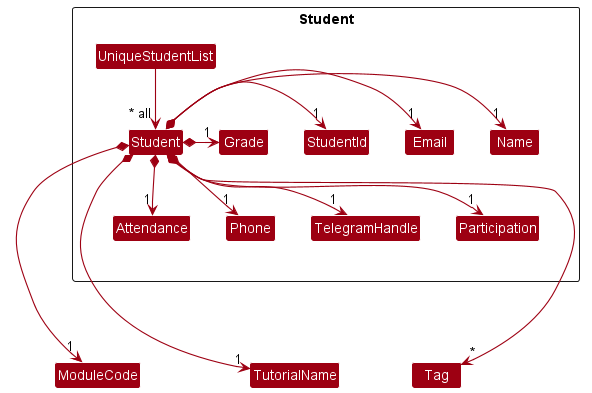
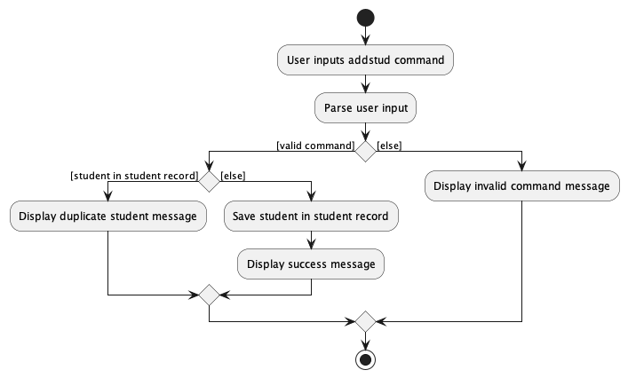
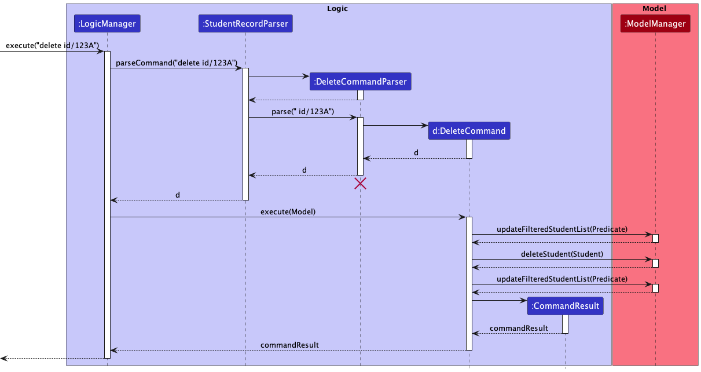
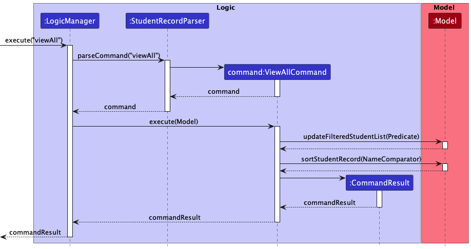
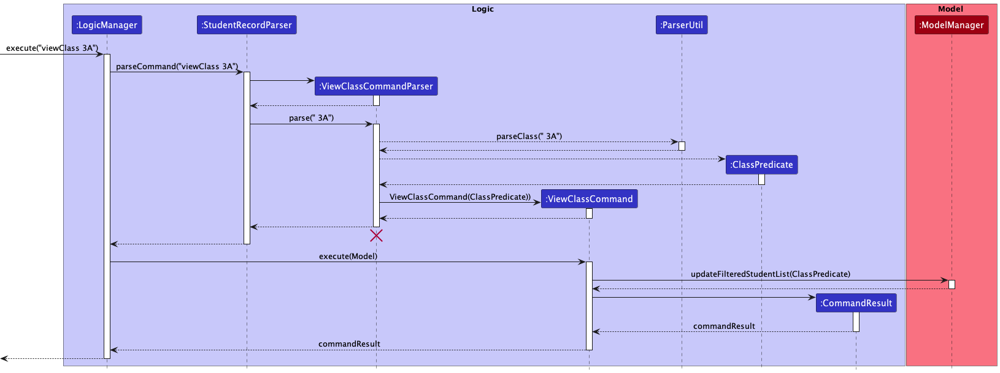
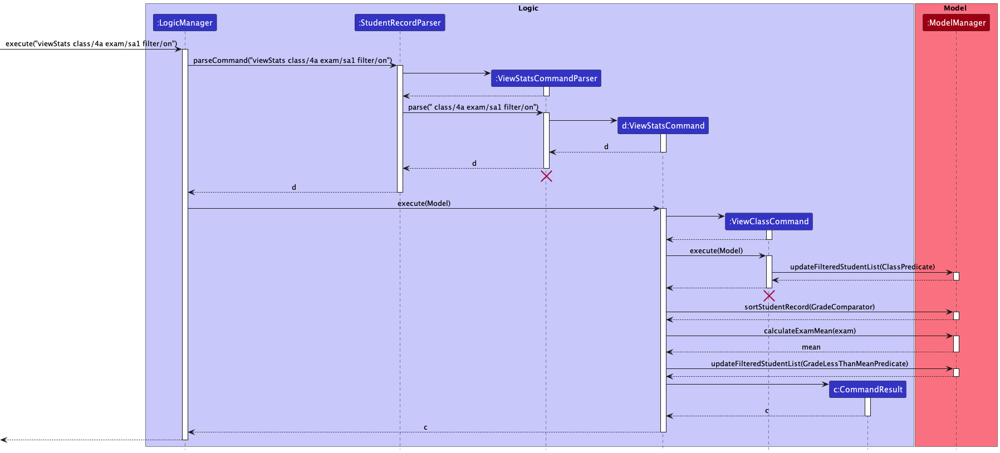

* Table of Contents
{:toc}
--------------------------------------------------------------------------------------------------------------------

## 1. **Introduction**

### 1.1 What is Class-ify

Class-ify is a **class management application** built specially for **Singapore Ministry of Education (MOE) teachers** to **monitor their student's academic progress easily**. Teachers can **generate exam statistics** for each class, and Class-ify quickly **flags out students** who require more support for contacting.

### 1.2 Who is this guide for

* Developers who wish to make sense of the codebase and contribute to Class-ify.
* Advanced users who wish to better understand Class-ify's features.

### 1.3 How to use this developer guide

This developer guide covers the architecture, design choices and implementation details in Class-ify to give the reader a clear picture of the technical details and inner workings of Class-ify.

* Refer to our <a href="#top">Table of Contents</a> to easily navigate between sections of the User Guide. There is also a link at the end of every section to bring you back to the Table of Contents.
* Refer to our [Quick Start](#3-setting-up-getting-started) guide to set up the project in your computer.
* Refer to our [Design and Implementation](#4-design-and-implementation) section to learn in detail how the commands in Class-ify are implemented and the design considerations that went into them.
* Refer to our [Documentation, logging, testing, configuration, dev-ops](#5-documentation-logging-testing-configuration-dev-ops) section for the various guides.
* Refer to our [Appendix: Requirements](#6-appendix-requirements) section for Class-ify's requirements.
* Refer to our [Appendix: Instructions for manual testing](#7-appendix-instructions-for-manual-testing) section to learn how to test Class-ify manually.

Click <a href="#top">here</a> to return to the top.

--------------------------------------------------------------------------------------------------------------------

## 2. **Acknowledgements**

* Class-ify is adapted from the [AddressBook-Level3](https://se-education.org/addressbook-level3/) project created by the SE-EDU initiative.
* Libraries used: [JavaFX](https://openjfx.io/), [Jackson](https://github.com/FasterXML/jackson), [JUnit5](https://github.com/junit-team/junit5)

Click <a href="#top">here</a> to return to the top.

--------------------------------------------------------------------------------------------------------------------

## 3. **Setting up, getting started**

Refer to the guide [_Setting up and getting started_](SettingUp.md).

Click <a href="#top">here</a> to return to the top.

--------------------------------------------------------------------------------------------------------------------

## 4. **Design and Implementation**

### 4.1 Architecture

The ***Architecture Diagram*** given above explains the high-level design of the App.

Given below is a quick overview of main components and how they interact with each other.

**Main components of the architecture**

**`Main`** has two classes called [`Main`](https://github.com/AY2223S1-CS2103T-T15-2/tp/blob/master/src/main/java/seedu/classify/Main.java) and [`MainApp`](https://github.com/AY2223S1-CS2103T-T15-2/tp/blob/master/src/main/java/seedu/classify/MainApp.java). It is responsible for:
* application launch: Initialises the components in the correct sequence, and connects them up with each other.
* application shut down: Shuts down the components and invokes cleanup methods where necessary.

[**`Commons`**](#415-common-classes) represents a collection of classes used by multiple other components.

The rest of the App consists of four components.

* [**`UI`**](#411-ui-component): The UI of the App.
* [**`Logic`**](#412-logic-component): The command executor.
* [**`Model`**](#413-model-component): Holds the data of the App in memory.
* [**`Storage`**](#414-storage-component): Reads data from, and writes data to the hard disk.

**How the architecture components interact with each other**

The *Sequence Diagram* below shows how the components interact with each other for the scenario where the user issues the command `delete id/123A`.

Each of the four main components (also shown in the diagram above),

* defines its *API* in an `interface` with the same name as the Component.
* implements its functionality using a concrete `{Component Name}Manager` class (which follows the corresponding API `interface` mentioned in the previous point).

For example, the `Logic` component defines its API in the `Logic.java` interface and implements its functionality using the `LogicManager.java` class which follows the `Logic` interface. Other components interact with a given component through its interface rather than the concrete class (reason: to prevent outside component's being coupled to the implementation of a component), as illustrated in the (partial) class diagram below.

The sections below give more details of each component.

#### 4.1.1 UI component

The **API** of this component is specified in [`Ui.java`](https://github.com/AY2223S1-CS2103T-T15-2/tp/blob/master/src/main/java/seedu/classify/ui/Ui.java)

The UI consists of a `MainWindow` that is made up of parts e.g.`CommandBox`, `ResultDisplay`, `StudentListPanel`, `StatusBarFooter` etc. All these, including the `MainWindow`, inherit from the abstract `UiPart` class which captures the commonalities between classes that represent parts of the visible GUI.

The `UI` component uses the JavaFx UI framework. The layout of these UI parts are defined in matching `.fxml` files that are in the `src/main/resources/view` folder. For example, the layout of the [`MainWindow`](https://github.com/AY2223S1-CS2103T-T15-2/tp/blob/master/src/main/java/seedu/classify/ui/MainWindow.java) is specified in [`MainWindow.fxml`](https://github.com/AY2223S1-CS2103T-T15-2/tp/blob/master/src/main/resources/view/MainWindow.fxml)

The `UI` component,

* executes user commands using the `Logic` component.
* listens for changes to `Model` data so that the UI can be updated with the modified data.
* keeps a reference to the `Logic` component, because the `UI` relies on the `Logic` to execute commands.
* depends on some classes in the `Model` component, as it displays `Person` object residing in the `Model`.

#### 4.1.2 Logic component

**API** : [`Logic.java`](https://github.com/AY2223S1-CS2103T-T15-2/tp/blob/master/src/main/java/seedu/classify/logic/Logic.java)

Here's a (partial) class diagram of the `Logic` component:

How the `Logic` component works:
1. When `Logic` is called upon to execute a command, it uses the `StudentRecordParser` class to parse the user command.
1. This results in a `Command` object (more precisely, an object of one of its subclasses e.g., `AddCommand`) which is executed by the `LogicManager`.
1. The command can communicate with the `Model` when it is executed (e.g. to add a student).
1. The result of the command execution is encapsulated as a `CommandResult` object which is returned from `Logic`.

The Sequence Diagram below illustrates the interactions within the `Logic` component for the `execute("delete id/123A")` API call.

:information_source:
**Note:** The lifeline for `DeleteCommandParser` should end at the destroy marker (X) but due to a limitation of PlantUML, the lifeline reaches the end of diagram.

Here are the other classes in `Logic` (omitted from the class diagram above) that are used for parsing a user command:

How the parsing works:
* When called upon to parse a user command, the `StudentRecordParser` class creates an `XYZCommandParser` (`XYZ` is a placeholder for the specific command name e.g., `AddCommandParser`) which uses the other classes shown above to parse the user command and create a `XYZCommand` object (e.g., `AddCommand`) which the `StudentRecordParser` returns back as a `Command` object.
* All `XYZCommandParser` classes (e.g., `AddCommandParser`, `DeleteCommandParser`, ...) inherit from the `Parser` interface so that they can be treated similarly where possible e.g, during testing.

#### 4.1.3 Model component

**API** : [`Model.java`](https://github.com/AY2223S1-CS2103T-T15-2/tp/blob/master/src/main/java/seedu/classify/model/Model.java)

The `Model` component:

* stores the student record data i.e., all `Student` objects (which are contained in a `UniqueStudentList` object).
* stores the currently 'selected' `Student` objects (e.g., results of a search query) as a separate _filtered_ list which is exposed to outsiders as an unmodifiable `ObservableList<Student>` that can be 'observed' e.g. the UI can be bound to this list so that the UI automatically updates when the data in the list change.
* stores a `UserPref` object that represents the user’s preferences. This is exposed to the outside as a `ReadOnlyUserPref` objects.
* does not depend on any of the other three components (as the `Model` represents data entities of the domain, they should make sense on their own without depending on other components)

#### 4.1.4 Storage component

**API** : [`Storage.java`](https://github.com/AY2223S1-CS2103T-T15-2/tp/blob/master/src/main/java/seedu/classify/storage/Storage.java)

The `Storage` component,
* can save both student record data and user preference data in json format, and read them back into corresponding objects.
* inherits from both `StudentRecordStorage` and `UserPrefStorage`, which means it can be treated as either one (if only the functionality of only one is needed).
* depends on some classes in the `Model` component (because the `Storage` component's job is to save/retrieve objects that belong to the `Model`)

#### 4.1.5 Common classes

Classes used by multiple components are in the `seedu.classify.commons` package.

Click <a href="#top">here</a> to return to the top.

--------------------------------------------------------------------------------------------------------------------

### 4.2 Implementation

This section describes some noteworthy details on how certain features are implemented.

#### 4.2.1 AddStudent command

**Description**

Adding new students is first basic step of using Class-ify. This is primarily done via the `AddStudentCommand` and `AddStudentCommandParser` classes.
Before going into the sequence of executing a `addStudent` command, let us take a quick look at the `Student` class.

The `Student` class contains a total of 6 fields:
* 2 `Name` fields for the student and parent names 
* 1 `Id` field 
* 1 `Phone` number field 
* 1 `Email` address field 
* 1 set of `Exam`(s)
    * The type of exams are currently limited to _CA1_, _CA2_, _SA1_ and _SA2_.
    * Future implementations may allow teachers to create their own examinable items.

**Implementation**

Adding a student record can be divided into 2 main steps: parsing the user input and executing it.

**Step 1: Parsing the command**

The delete command is first parsed.

1. `MainWindow` calls the `execute` method of `LogicManager` to execute the given user’s command.
2. Before the command is executed, it is parsed by `StudentRecordParser`, which identifies the command to be an `addStudent` command and creates a new `AddStudentCommandParser` instance to parse the user’s command.
3. Once the command is successfully parsed, `AddStudentCommandParser` creates a new `AddStudentCommand` instance which will be executed by the `LogicManager`.

**Step 2: Executing the command**

The `AddStudentCommand` instance now interacts with the `ModelManager` to execute the command.
1. The `hasStudent` method is called to check if the `Model` contains the student to be added.
2. Assuming there are no duplicates, the `addStudent` method is then called to add the student into the student record.
3. The `updateFilteredStudentList` method is called to show the updated list of students in the student record.
4. A new `CommandResult` instance is created and returned to `LogicManager`.
5. The control is then passed back to `MainWindow` where the `CommandResult` is displayed to the UI as feedback to the user.

The following activity diagram below summarizes what happens when a user executes an `addStudent` command.

**Design Considerations**

The current approach creates multiple `Class` objects per student. It serves as a more straightforward implementation. However, it is not a very OOP solution for the following reasons:

1. Multiple `Class` objects for the same class.
2. Classes do not have students.
   * A `Class` object has no reference to the students in that class. 

An alternative and perhaps more OOP approach is given below. It has a `Class` list in the `StudentRecord`, which references to `Student`.

* `StudentRecord` only requires one `Class` object per unique class the teacher teaches, instead of each `Student` needing their own `Class` objects.
* `Class` has reference to `Student`, modelling the relationship in which a teacher teaches a class with some students.
* Every `Class` has a set of `Exam`(s) which a `Student` takes and scores a certain grade.

#### 4.2.2 Delete command

**Description**

The delete command allows users to delete a student record by targeting either the student’s name or ID.

**Implementation**

Deleting a student record can be divided into 2 main steps: parsing the command and executing it.

The sequence diagram below illustrates the interactions within the `Logic` component when the user calls a delete command, for example, `delete id/123A`.

:information_source: **Note:** The lifeline for `DeleteCommandParser` should end at the destroy marker (X) but due to a limitation of PlantUML, the lifeline reaches the end of diagram.

**Step 1: Parsing the command**

The delete command is first parsed.

1. The `execute` method of `LogicManager` is called to execute the user’s command, `delete id/123A`.
2. Before the command is executed, it is parsed by `StudentRecordParser`, which identifies the command to be a delete command and creates a new `DeleteCommandParser` instance to parse the user’s command.
3. Once the command is successfully parsed, `DeleteCommandParser` creates a new `DeleteCommand` instance which will be executed by the `LogicManager`.

**Step 2: Executing the command**

The `DeleteCommand` instance now communicates with the `ModelManager` to execute the command.

1. The `updateFilteredStudentList` method is called to isolate the student record to be deleted.
2. The `deleteStudent` method is called to delete the student record.
3. The `updateFilteredStudentList` method is called again to show all student records.
4. A new `CommandResult` instance is created and returned to `LogicManager`.

**Design Considerations**

Current Design: We chose to keep a single class `DeleteCommand`, which the user can use to delete student records either by targeting the student’s name or student ID. Note that we chose not to delete student records by their index in the list since deletion is irreversible, and we wanted users to be aware of the exact student name when they are executing a `DeleteCommand`.

Pros:
- The user does not have to remember different types of delete commands such as `DeleteStudentByNameCommand` or `DeleteStudentByIDCommand`.

Cons:
- The parser would have to identify whether the user targeted the student’s name or student ID to delete the student record.

Alternative Design: Split `DeleteCommand` into two different commands, `DeleteStudentByNameCommand` and `DeleteStudentByIDCommand`.

Pros:
- There is no requirement for prefixes such as `nm/` or `id/` to identify whether the user is targeting the student’s name or student ID.

Cons:
- Additional classes need to be implemented.
- The command name is long.

#### 4.2.3 Edit command

*To be updated*

#### 4.2.4 Find command

**Description**

`FindCommand`, which extends `Command`, simulates searching through the `StudentRecord` for particular students. This is implemented through filtering the current list of students according to the user input, and displaying the filtered results to the user.

**Implementation**

`FindCommand` is executed through 2 steps:

**Step 1: Parsing the command**

The user input is first parsed by `StudentRecordParser`, in the same way as other commands. After the input is identified to be a `find`command, a `FindCommandParser` instance will be created to further parse the command arguments.

The `FindCommandParser` searches the input for either `PREFIX_STUDENT_NAME` or `PREFIX_ID` (but not both), and depending on which `Prefix` is present, instantiates a `NameContainsKeywordsPredicate` object or `IdPredicate` object respectively. Both inherit from `Predicate<Student>`.

This `Predicate<Student>` will then be used to create a `FindCommand` object.

**Step 2: Executing the command**

The `FindCommand` object created will then interact with the `ModelManager` to execute the command.

1. Using the `Preicate<Student>` created when parsing the command, `Model#updateFilteredStudentList(Predicate<Student>)`
   is called, to filter the list of students.
2. The filtered list is returned to the user, and they will be able to view the list of students whose name contains the
   specified keyword(s), or whose Id matches the specified Id.

Given below is an example usage scenario of `FindCommand`.

Step 1. The user launches the application and sees a list of students.

Step 2. The user executes `find nm/Alex` to locate students with "Alex" in their name.
This command performs a search using the names of the students. Since the prefix `nm/` was used, a `NameContainsKeywordsPredicate` object, which extends `Predicate<Student>` will be created.

:information_source: **Note:** Find command is case-insensitive, and the command `find nm/alex` will return the same results.

Step 3. Classify returns a filtered list of students whose names contain `Alex`. All the details recorded will also be shown.

The following activity diagram summarizes what happens when a user executes the find command.

**Design Considerations**

1. `ArgumentTokenizer#tokenize()` used to identify the prefix, to generate the corresponding `Predicate<Student>`.

#### 4.2.5 ViewAll command

**Description**

The `viewAll` command displays a list of all student records.

**Implementation**

The sequence diagram below illustrates the interaction between the `Logic` and `Model` components. 

Given below is an example usage scenario of how the ViewAll mechanism behaves at each step. 

Step 1. The user executes `viewAll` command. 

Step 2. The `StudentRecordParser` will identify the command and create a `ViewAllCommand` object in the `LogicManager`

Step 3. `ViewAllCommand#execute` is called which updates the `FilteredStudentList` in `Model`

Step 4. Classify updates and displays a list of all student records

#### 4.2.6 ViewClass command

**Description**

The `ViewClassCommand` displays the list of students in a particular class. This feature relies mainly on the `ViewClassCommandParser` and `ClassPredicate`, where the `ViewClassCommandParser` uses `ClassPredicate` to select students in the student record with the mentioned class.

**Implementation**

This command can be divided into 2 main steps: 
1. Parsing the command
3. Executing the command

The following Sequence diagram shows how the `ViewClassCommand` works:

**Step 1: Parsing the command**

The user's input command is first parsed.

1. `MainWindow` calls the `execute` method of `LogicManager` to execute the given user’s command.
2. Before the command is executed, it is parsed by `StudentRecordParser`, which identifies the command to be a `ViewClassCommand` and creates a new `ViewClassCommandParser` instance to parse the user’s input.
3. `ViewClassCommandParser` checks whether the user input is valid by parsing it into the `parseClass` method in `ParserUtil`.
4. If the input is valid, a new `ClassPredicate` instance is created. 
5. ViewClassCommandParser` then creates a new `ViewClassCommand` instance which will be executed by the `LogicManager`.

**Step 2: Executing the command**

The `ViewClassCommand` instance now interacts with the `ModelManager` to execute the command.

1. The `updateFilteredStudentList` method is called with the `ClassPredicate` to filter the list to only contain students whose `Class` matches the user input.

:information_source: **Note:** A case-insensitive match is done, hence `viewClass 1a` and `viewClass 1A` will return the same results.

4. A new `CommandResult` instance is created and returned to `LogicManager`.

**Design Considerations**

* **Alternative 1**: Integrate `ViewClassCommand` together with `FindCommand`, and users will find students in a specific class.
  * Pros: Users will not need to learn a different command.
  * Cons: There is still a need to differentiate the filter logic as class name requires an exact match, while name only requires it to contain the keywords.
* **Alternative 2**: Separate `ViewClassCommand` and `FindCommand`. (Current Implementation)
  * Pros: Distinguishing between a `View` and `Find` can make the filtering logic more obvious and apparent to users
  * Cons: Users have an additional command to learn.

#### 4.2.7 ToggleView command

**Description**

The `ToggleViewCommand` toggles the application to display or hide all students' parent details.

**Implementation**

The following activity diagram shows the events that occur when the user executes the `ToggleViewCommand`.

*Insert activity diagram*

The `Model`has an association with `FilteredStudent` where `FilteredStudent` encapsulates the current toggle status and `FilteredStudentList`. Executing the command will change the toggle status. The `StudentListPanel` is dependent on the toggle status in `FilteredStudent` to display or hide the students' parent details properly in the `StudentCard`.

The following sequence diagram shows the interaction between the `UI`, `Logic`, and `Model` components. 

*Insert sequence diagram*

Given below is an example usage scenario of how the ToggleView mechanism behaves at each step

Step 1. The user enters the command `toggleView`

Step 2. The `StudentRecordParser` will identify the command and create a `ToggleViewCommand` object in the `LogicManager`

Step 3. `ToggleViewCommand#execute` is called which changes the toggle status in `Model` 

Step 4. The `MainWindow` handles the updating of UI by requesting `StudentListPanel` to rerender the `StudentCard` to display or hide the student's parent details

With the above sequence, the UI is successfully updated to display the relevant student details according to the toggle status. 

**Design Considerations**

- Option 1: Each `Student` has a `isShowingParentDetails` `boolean` attribute
  - Pros:
    - The `StudentListPanel` will automatically update the `StudentCard` as it listens for changes in `FilteredStudentList`, thus reduces coupling (see Option 2 cons)   
  - Cons: 
    - Each execution of the command edits and replaces all the students in the `FilteredStudentList` with new `Student` objects with the updated attribute which can be costly when there are many student objects 
    - Needs a global variable to track the current toggle as new `Student` objects added need to know the current state of the toggle
- Option 2 (current choice): The UI keeps track of the toggle
  - Pros:
    - No need to edit every student in the `FilteredStudentList`
    - Able to retain the previously filtered list after toggling
  - Cons: 
    - Increase in coupling as `StudentListPanel` is dependent on `FilteredStudent` for toggling information

#### 4.2.8 ViewStats command

**Description**

`ViewStatsCommand` is a `Command` to present summary statistics for an `Exam` taken by a particular class of students. 
In particular, the command is implemented to generate the mean score of the `Exam`. The entire process of generating summary statistics is executed in 2 steps. 

**Implementation**

**Step 1: Parsing the command**

The user input is first parsed, in the same way as other commands. After the input is identified to be a viewStats command, a `ViewStatsCommandParser` instance will parse the inputs to retrieve the class and exam of interest.

Furthermore, the command will also be parsed to retrieve an input for an additional `Prefix` "filter/", which will indicate if the list of students returned should be flagged. A flagged list contains only students whose score for that particular `Exam` falls below the mean.

**Step 2: Executing the command**

The `ViewStatsCommand` then interacts with the `ModelManager` to execute the command, which is again done in 2 steps.

Step 1: A `ViewClassCommand` is executed, depending mainly on `Model#updateFilteredStudentList(Predicate<Student)`, in order to retrieve the class of interest.

Step 2: The mean of the exam scores for that class is calculated using `Model#calculateMean(String exam)`. 

Depending on the boolean value returned during the parsing of the filter prefix, the class list is further filtered using `Model#updateFilteredStudentList(Predicate<Student)` to show a flagged list. 

The whole list is sorted according to the score of the particular exam, before it is returned and displayed to the user.

The following sequence diagram depicts how different components such as `Logic` and `Model` interact.

:information_source: **Note:** The lifeline for `ViewStatsCommandParser` and `ViewClassCommand` should end at the destroy marker (X), but due to a limitation of PlantUML, the lifeline reaches the end of diagram.

**Design Considerations**

1. Sorting the list of students according to grade
- Option 1: sort the filtered list of students after retrieving the class
  - Pros:
    - Will not modify the current `StudentRecord`
    - Will not unnecessarily sort students not in the class of interest
  - Cons:
    - `FilteredStudents` is meant to be unmodifiable, and sorting potentially breaks this behaviour
    - `FilteredStudents` is implemented with `FilteredList<Student>` which does not maintain sorting, so additional wrapping
    needs to be done to sort the filtered list
- Option 2 (current choice): sort the entire student record, then filter to retrieve class
  - Pros:
    - Can maintain sorting even beyond the `ViewStats` command, ie. maintaining a sorted list of students, sorted by name,
    each time an `addStudent` command or `edit` command is run
  - Cons:
    - Reorders the whole `StudentRecord` each time the sorting is done

Click <a href="#top">here</a> to return to the top.

--------------------------------------------------------------------------------------------------------------------

## 5. **Documentation, logging, testing, configuration, dev-ops**

* [Documentation guide](Documentation.md)
* [Testing guide](Testing.md)
* [Logging guide](Logging.md)
* [Configuration guide](Configuration.md)
* [DevOps guide](DevOps.md)

Click <a href="#top">here</a> to return to the top.

--------------------------------------------------------------------------------------------------------------------

## 6. **Appendix: Requirements**

### 6.1 Product scope

**Target User Profile**

Ministry of Education (MOE) Teachers who:
* Teaches 3 to 5 classes a year
* Manages about 60 to 100 students with varying needs
* Is required to identify students who need additional academic assistance and contact their parents if necessary
* Finds paperwork time-consuming and messy
* Finds it tedious to manually keep track of the academic progress of each individual student
* Finds it tedious to manually identify students who are performing poorly academically
* Finds Excel spreadsheet complex and difficult to use
* Prefers typing to mouse interactions
* Types fast and is reasonably comfortable using CLI apps

**Value Proposition**

Class-ify is a **class management application** built specially for **Singapore Ministry of Education (MOE) teachers** to **monitor their student's academic progress easily**. Teachers can **generate exam statistics** for each class, and Class-ify quickly **flags out students** who require more support for contacting.

### 6.2 User stories

Priorities: High (must have) - `* * *`, Medium (nice to have) - `* *`, Low (unlikely to have) - `*`

| Role (As a/ an)                                     | Goal/ Function (I want to)                                  | Benefit (So that I)                                                           | Priority |
|-----------------------------------------------------|-------------------------------------------------------------|-------------------------------------------------------------------------------|----------|
| new user                                            | add new student records                                     |                                                                               | ***      |
| new user                                            | delete student records                                      | can remove irrelevant or incorrect student records.                           | ***      |
| new user                                            | update student records                                      | can keep my student records accurate and up to date.                          | ***      |
| new user                                            | view all students that I am teaching                        |                                                                               | ***      |
| new user                                            | find a particular student's record by name                  |                                                                               | ***      |
| new user                                            | find a particular student's record by student ID            |                                                                               | ***      |
| new user                                            | add in individual students' personal information            | can retrieve my student's information when necessary.                         | ***      |
| new user                                            | add in individual students' academic results                | can keep track of their results over time.                                    | ***      |
| teacher with multiple classes                       | categorise students into different classes                  | can keep my student records tidy and organised.                               | ***      |
| new user                                            | store parent's details                                      | can contact and inform them if a student is not doing well.                   | ***      |
| teacher with multiple classes                       | filter student records based on their class                 | can search for students in a particular class easily.                         | ***      |
| new user                                            | get exam statistics from a class                            | can get an overview of my students' academic performance.                     | ***      |
| new user                                            | flag out students who are under performing in class         | can quickly identify students who need more academic assistance.              | ***      |
| new user                                            | sort the student records in terms of grades                 | can easily view the academic rankings of my student.                          | ***      |
| teacher with many students                          | hide parent's information from view                         | can have an uncluttered view of my student's information.                     | ***      |
| new user who is forgetful                           | automatically save the data without inputting a new command | do not need to worry about forgetting to save before I quit the application.  | ***      |
| potential user                                      | try the application with sample data                        | can easily see how the application will look like when it is in use.          | ***      |
| potential user                                      | see a summary of functionalities                            | have an idea of what I can do without referencing the user guide.             | **       |
| new user                                            | purge all current data                                      | can get rid of sample/experimental data I used for exploring the application. | **       |
| intermediate user                                   | add multiple student records with a single command          | can efficiently enter my students' information at once.                       | **       |
| new user                                            | filter student records below a certain grade                | can identify students who scored below an acceptable grade.                   | **       |
| teacher who might teach a different class next year | delete all student records from a particular class          | can remove the records of students that I am no longer teaching.              | **       |
| new user                                            | undo previous commands                                      | can easily undo an accidental change.                                         | **       |
| intermediate user                                   | create additional custom fields in student records          | can keep track of additional information of my students.                      | **       |
| intermediate user                                   | share student details with other teachers                   | can share the data with another teacher who may take over the class.          | *        |
| advanced user                                       | transfer and backup data from one computer to another       | will not lose my data if I switch to another computer.                        | *        |
| advanced user                                       | update all students' exam grades with a single command      | can efficiently update my students' grades at once.                           | *        |
| teacher who might teach the same class next year    | update the class name of all students in that class         | can save time updating each student's information individually.               | *        |
| advanced user                                       | find out more advanced commands through suggestions         | can learn and extend the functionality of the app.                            | *        |
| potential user                                      | follow a tutorial to introduce the basic commands           | can learn the basic functionalities step by step.                             | *        |

### 6.3 Use cases

(For all use cases below, the **System** is `Class-ify` and the **Actor** is the `user`, unless specified otherwise.)

**Use case: Add a new student**

**MSS**

1. User requests to add a new student to the list.
2. User enters relevant details of the new student.
3. Class-ify adds new student into the student record.
4. Class-ify displays an updated list of student(s).

   Use case ends.

**Extensions**

* 2a. Student already exist in student record.
   * 2a1. Class-ify displays a duplicate error message. 

     Use case resumes from step 2.

* 2b. User missed out a compulsory field.
   * 2b1. Class-ify shows an invalid command error message.

     Use case resumes from step 2.

* 2c. Class-ify detects invalid format of field value.
    * 2c1. Class-ify shows an invalid format error message.

      Use case resumes from step 2.

**Use case: Delete a student**

**MSS**

1. User requests to delete a student from the list.
2. User enters name or id of student to be deleted.
3. Class-ify deletes student from the student record.
4. Class-ify displays an updated list of student(s).

   Use case ends.

**Extensions**

* 2a. Student does not exist in student record.
    * 2a1. Class-ify displays an error message indicating the to-be-deleted student does not exist.

      Use case resumes from step 2.

* 2b. The student record is empty.
    * 2b1. Class-ify displays an error message similar to 2a1.

      Use case resumes from step 2.

* 2c. Class-ify detects invalid format of field value.
    * 2c1. Class-ify shows an invalid format error message.

      Use case resumes from step 2.

**Use case: Edit details of a student**

**MSS**

1. User requests to edit the details of a student from the list.
2. User enters index of student in the list to be edited.
3. User enters the relevant details of the student to be edited.
4. Class-ify updates the details of the student in the student record.
5. Class-ify displays an updated list of student(s).

   Use case ends.

**Extensions**

* 2a. The given index is invalid.
    * 2a1. Class-ify displays an invalid command error message.

      Use case resumes from step 2.

* 2b. The given index is out of bounds of the list.
    * 2b1. Class-ify displays an error message similar to 2a1.

      Use case resumes from step 2.

* 3a. Class-ify detects invalid format of field value.
    * 3a1. Class-ify shows an invalid format error message.

      Use case resumes from step 3.

* 3b. No given fields to be edited.
    * 3b1. Class-ify shows an error message to prompt user to enter at least one field to be edited.

      Use case resumes from step 3.

**Use case: Find a student**

**MSS**

1. User requests to find some student(s) in the list.
2. User enters name or id of the student(s) to be found.
3. Class-ify search for the student(s) in the student record.
4. Class-ify displays a list of student(s) found.

   Use case ends.

**Extensions**

* 2a. No fields are given.
    * 2a1. Class-ify displays an invalid command error message.

      Use case resumes from step 2.

* 2b. Class-ify detects invalid format of field value.
    * 2b1. Class-ify shows an invalid format error message.

      Use case resumes from step 2.

* 4a. No students are found.
    * 4b1. Class-ify display an empty list and a message indicating no students are found. 

      Use case ends.

**Use case: Calculate exam statistics**

**MSS**

1. User requests to calculate exam statistics for a class.
2. User enters the class and exam that he/she wishes to calculate statistics for.
3. Class-ify calculates the average score in the class for the exam.
4. Class-ify displays the list of students in the class in order of ascending grades.

   Use case ends.

**Extensions**

* 2a. No fields are given.
    * 2a1. Class-ify displays an invalid command error message.

      Use case resumes from step 2.

* 2b. Class-ify detects invalid format of field value.
    * 2b1. Class-ify shows an invalid format error message.

      Use case resumes from step 2.

* 2c. Not all students have received grades for the exam.
    * 2c1. Class-ify shows an error message stating mean score cannot be calculated.

### 6.4 Non-Functional Requirements

- **Technical Requirement**:
  - Class-ify should work on any mainstream operating system (OS) as long as it has Java version 11 or above installed.
  - Class-ify should work on both 32-bit and 64-bit environments.
- **Quality Requirement**:
  - Display of information on the application should not feel disorganised or cluttered.
  - Colour scheme of Class-ify should be pleasant for most users and not cause a strain to the eye.
- **Performance Requirement**:
  - Class-ify should be able to process any command within two seconds.
  - Class-ify Should be able to hold up to 200 students in the student record without a noticeable lag in performance.
- **Project Scope**:
  - Class-ify does not offer student or parent accounts, and hence no communication with students or their guardians via the application.
  - Class-ify does not allow synchronisation of class lists with other teachers, but allows for sharing of data between teachers.
- **Others**:
  - A user with above average typing speed for regular English text (i.e. not code, not system admin commands) should be able to accomplish most of the tasks faster using commands than using the mouse.

### 6.5 Glossary

* **Mainstream OS**: Windows, Linux, Unix, OS-X
* **CLI**: Command Line Interface (CLI) is a text-based User Interface (UI) used to run programs.
Through the CLI, users interact with the application by typing in text commands
* **GUI**: Graphical User Interface (GUI) is an interface that allows the user to interact with through various visual graphics.
* **MSS**: Main Success Scenario (MSS) describes the most straightforward interaction for a given use case, 
which assumes that nothing goes wrong
* **32-bit/64-bit environment**: Refers to systems that use a 32-bit/64-bit processor respectively.

Click <a href="#top">here</a> to return to the top.

--------------------------------------------------------------------------------------------------------------------

## 7. **Appendix: Instructions for manual testing**

Given below are instructions to test the app manually.

:information_source: **Note:** These instructions only provide a starting point for testers to work on; testers are expected to do more *exploratory* testing.

### 7.1 Launch and shutdown

1. Initial launch
   1. Download the jar file and copy into an empty folder
   2. Double-click the jar file

Expected: Shows the GUI with a set of sample contacts. The window size may not be optimum.

2. Saving window preferences
   1. Resize the window to an optimum size. Move the window to a different location. Close the window.
   2. Re-launch the app by double-clicking the jar file. 

Expected: The most recent window size and location is retained.

### 7.2 Adding a new student record

Prerequisites: Existing student records do not have the names or IDs that will be added.
1. Test case: `addStudent nm/Peter Tan id/452B class/1F`
   
Expected: A new student record with the provided details is added to the list. Details of the student record are shown in the status message. Since no exam grades have been provided, the student card UI does not show anything below the grades section.

2. Test case: `addStudent nm/Alex Yeoh id/123A class/2B exam/CA1 60 exam/CA2 70`

Expected: A new student record with the provided details is added to the list. Details of the student record are shown in the status message. Since exam grades have been provided, the student card UI shows the exam scores for each exam that has been provided.

3. Test case: `addStudent nm/John Doe id/928C class/1A pn/Bob Doe hp/98765432 e/bobdoe@gmail.com exam/CA1 50`

Expected: A new student record with the provided details is added to the list. Details of the student record are shown in the status message. This test case includes parents' details as well.

4. Test case: `addStudent nm/Jonathan Lim id/abc2 class/2A`

Expected: The command entered by the user is highlighted red. The status message shows an error: "Id should only contain 3 digits and 1 character". "abc2" is an invalid value for the ID as Class-ify only accepts the last 3 numbers and last letter of a student's ID.

### 7.3 Editing a student record

1. Test case: `edit 1 exam/CA2 70 exam/SA1 60`

Expected: Adds or updates the CA2 and SA1 exam grades of the 1st student in the list to be `70` and `60` respectively.

2. Test case `edit 2 nm/Jacob Teo`

Expected: Edits the name of the 2nd student in the list to `Jacob Teo`.

### 7.4 Deleting a student record

Prerequisites: List all persons using the `list` command. Multiple students in the list.

1. Test case: `delete 1`

Expected: First contact is deleted from the list. Details of the deleted contact shown in the status message. Timestamp in the status bar is updated.

2. Test case: `delete 0`

Expected: No person is deleted. Error details shown in the status message. Status bar remains the same.

3. Other incorrect delete commands to try: `delete`, `delete x`

Expected: Similar to previous.

### 7.5 Finding a student record

Prerequisites: Students with "Alex" in their name exist in the list.

1. Test case: `find nm/Alex`

Expected: Students with "Alex" in their name appears in the list.

Prerequisites: Student with "123A" as their ID exists in the list.

1. Test case: `find id/123A`

Expected: Student with "123A" as their ID appears in the list.

### 7.6 Viewing all student records

Prerequisites: There are existing student records.

1. Test case: `viewAll`

Expected: All student records will appear in the list.

### 7.7 Viewing student records from a class

Prerequisites: Class provided must exist within the student records.

1. Test case: `viewClass 1A`

Expected: Student records from class 1A will appear in the list.

### 7.8 Toggling view

1. Test case: `toggleView`

Expected: Shows/hides parent details in each student card UI.

### 7.9 Calculating exam statistics

Prerequisites: Student records with class "4a" and exam results for "sa1" exists.

1. Test case: `viewStats class/4a exam/sa1 filter/off`

Expected: Displays the mean obtained by class "4A" for "SA1", as well as the list of all the students in the class '4A', arranged in ascending grades for "SA1".

### 7.10 Saving data

Prerequisites: Missing `data/classify.json` file

1. Dealing with missing/corrupted data files
      1. Test case: Delete `data/classify.json` file and relaunch the application.
         Expected: Application will be populated with sample data.

Click <a href="#top">here</a> to return to the top.
