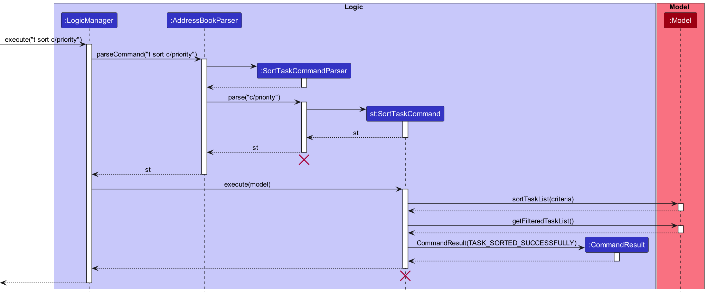
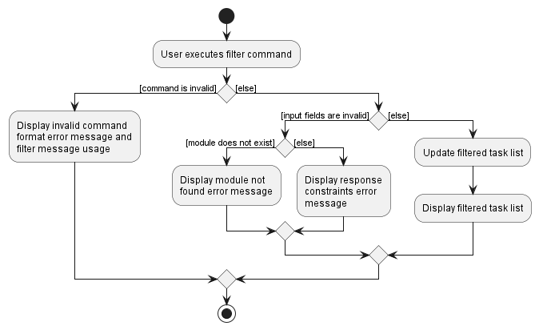
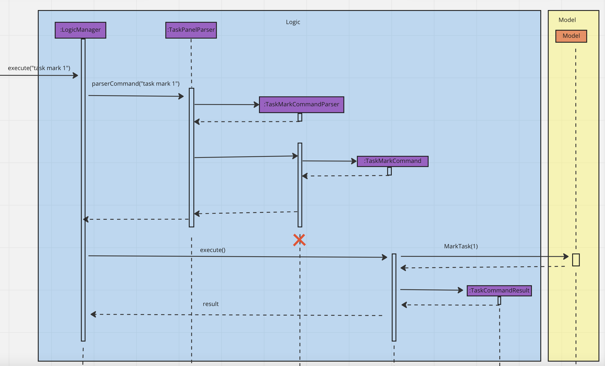
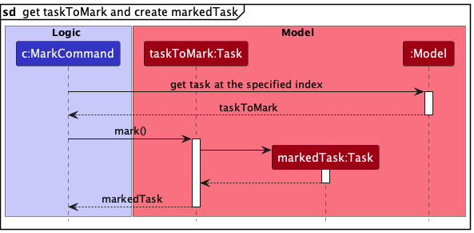
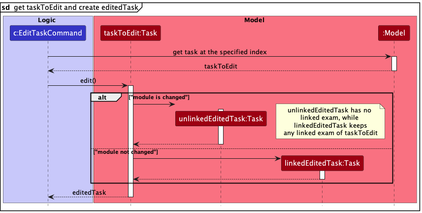
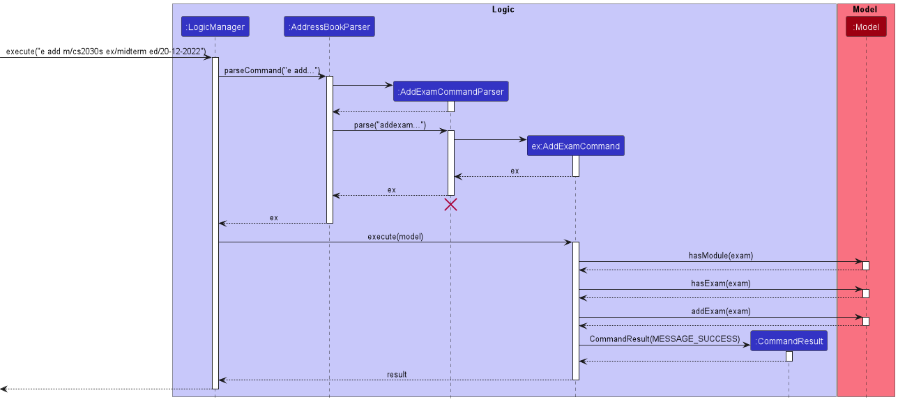

## **Table of Contents**
* Acknowledgements
* Setting up
* Design
  * Architecture
  * UI component
  * Logic component
  * Model component
  * Storage component
  * Common classes
* Implementation
* Documentation, logging, testing, configuration, dev-ops
* Appendix: Requirements
  * Product scope
  * User stories
  * Use cases
  * Non-Functional Requirements
  * Glossary
* Appendix: Instructions for manual testing
  * 

--------------------------------------------------------------------------------------------------------------------

## **Acknowledgements**

* {list here sources of all reused/adapted ideas, code, documentation, and third-party libraries -- include links to the original source as well}

--------------------------------------------------------------------------------------------------------------------

## **Setting up, getting started**

Refer to the guide [_Setting up and getting started_](SettingUp.md).

--------------------------------------------------------------------------------------------------------------------

## **Design**

:bulb: **Tip:** The `.puml` files used to create diagrams in this document can be found in the [diagrams](https://github.com/se-edu/addressbook-level3/tree/master/docs/diagrams/) folder. Refer to the [_PlantUML Tutorial_ at se-edu/guides](https://se-education.org/guides/tutorials/plantUml.html) to learn how to create and edit diagrams.

### Architecture

The ***Architecture Diagram*** given above explains the high-level design of the App.

Given below is a quick overview of main components and how they interact with each other.

**Main components of the architecture**

**`Main`** has two classes called [`Main`](https://github.com/se-edu/addressbook-level3/tree/master/src/main/java/seedu/address/Main.java) and [`MainApp`](https://github.com/se-edu/addressbook-level3/tree/master/src/main/java/seedu/address/MainApp.java). It is responsible for,
* At app launch: Initializes the components in the correct sequence, and connects them up with each other.
* At shut down: Shuts down the components and invokes cleanup methods where necessary.

[**`Commons`**](#common-classes) represents a collection of classes used by multiple other components.

The rest of the App consists of four components.

* [**`UI`**](#ui-component): The UI of the App.
* [**`Logic`**](#logic-component): The command executor.
* [**`Model`**](#model-component): Holds the data of the App in memory.
* [**`Storage`**](#storage-component): Reads data from, and writes data to, the hard disk.

**How the architecture components interact with each other**

The *Sequence Diagram* below shows how the components interact with each other for the scenario where the user issues the command `delete 1`.

Each of the four main components (also shown in the diagram above),

* defines its *API* in an `interface` with the same name as the Component.
* implements its functionality using a concrete `{Component Name}Manager` class (which follows the corresponding API `interface` mentioned in the previous point.

For example, the `Logic` component defines its API in the `Logic.java` interface and implements its functionality using the `LogicManager.java` class which follows the `Logic` interface. Other components interact with a given component through its interface rather than the concrete class (reason: to prevent outside component's being coupled to the implementation of a component), as illustrated in the (partial) class diagram below.

The sections below give more details of each component.

### UI component

The **API** of this component is specified in [`Ui.java`](https://github.com/se-edu/addressbook-level3/tree/master/src/main/java/seedu/address/ui/Ui.java)

The UI consists of a `MainWindow` that is made up of parts e.g.`CommandBox`, `ResultDisplay`, `PersonListPanel`, `StatusBarFooter` etc. All these, including the `MainWindow`, inherit from the abstract `UiPart` class which captures the commonalities between classes that represent parts of the visible GUI.

The `UI` component uses the JavaFx UI framework. The layout of these UI parts are defined in matching `.fxml` files that are in the `src/main/resources/view` folder. For example, the layout of the [`MainWindow`](https://github.com/se-edu/addressbook-level3/tree/master/src/main/java/seedu/address/ui/MainWindow.java) is specified in [`MainWindow.fxml`](https://github.com/se-edu/addressbook-level3/tree/master/src/main/resources/view/MainWindow.fxml)

The `UI` component,

* executes user commands using the `Logic` component.
* listens for changes to `Model` data so that the UI can be updated with the modified data.
* keeps a reference to the `Logic` component, because the `UI` relies on the `Logic` to execute commands.
* depends on some classes in the `Model` component, as it displays `Person` object residing in the `Model`.

### Logic component

**API** : [`Logic.java`](https://github.com/se-edu/addressbook-level3/tree/master/src/main/java/seedu/address/logic/Logic.java)

Here's a (partial) class diagram of the `Logic` component:

How the `Logic` component works:
1. When `Logic` is called upon to execute a command, it uses the `AddressBookParser` class to parse the user command.
1. This results in a `Command` object (more precisely, an object of one of its subclasses e.g., `AddCommand`) which is executed by the `LogicManager`.
1. The command can communicate with the `Model` when it is executed (e.g. to add a person).
1. The result of the command execution is encapsulated as a `CommandResult` object which is returned back from `Logic`.

The Sequence Diagram below illustrates the interactions within the `Logic` component for the `execute("delete 1")` API call.

:information_source: **Note:** The lifeline for `DeleteCommandParser` should end at the destroy marker (X) but due to a limitation of PlantUML, the lifeline reaches the end of diagram.

Here are the other classes in `Logic` (omitted from the class diagram above) that are used for parsing a user command:

How the parsing works:
* When called upon to parse a user command, the `AddressBookParser` class creates an `XYZCommandParser` (`XYZ` is a placeholder for the specific command name e.g., `AddCommandParser`) which uses the other classes shown above to parse the user command and create a `XYZCommand` object (e.g., `AddCommand`) which the `AddressBookParser` returns back as a `Command` object.
* All `XYZCommandParser` classes (e.g., `AddCommandParser`, `DeleteCommandParser`, ...) inherit from the `Parser` interface so that they can be treated similarly where possible e.g, during testing.

### Model component
**API** : [`Model.java`](https://github.com/se-edu/addressbook-level3/tree/master/src/main/java/seedu/address/model/Model.java)

The `Model` component,

* stores the address book data i.e., all `Person` objects (which are contained in a `UniquePersonList` object).
* stores the currently 'selected' `Person` objects (e.g., results of a search query) as a separate _filtered_ list which is exposed to outsiders as an unmodifiable `ObservableList<Person>` that can be 'observed' e.g. the UI can be bound to this list so that the UI automatically updates when the data in the list change.
* stores a `UserPref` object that represents the user’s preferences. This is exposed to the outside as a `ReadOnlyUserPref` objects.
* does not depend on any of the other three components (as the `Model` represents data entities of the domain, they should make sense on their own without depending on other components)

:information_source: **Note:** An alternative (arguably, a more OOP) model is given below. It has a `Tag` list in the `AddressBook`, which `Person` references. This allows `AddressBook` to only require one `Tag` object per unique tag, instead of each `Person` needing their own `Tag` objects. 

### Storage component

**API** : [`Storage.java`](https://github.com/se-edu/addressbook-level3/tree/master/src/main/java/seedu/address/storage/Storage.java)

The `Storage` component,
* can save both address book data and user preference data in json format, and read them back into corresponding objects.
* inherits from both `AddressBookStorage` and `UserPrefStorage`, which means it can be treated as either one (if only the functionality of only one is needed).
* depends on some classes in the `Model` component (because the `Storage` component's job is to save/retrieve objects that belong to the `Model`)

### Common classes

Classes used by multiple components are in the `seedu.addressbook.commons` package.

--------------------------------------------------------------------------------------------------------------------

## **Implementation**

This section describes some noteworthy details on how certain features are implemented.

### Sort Task Command

#### How the feature works

The `sort` command allows users to sort the task list by priority status,
deadline, module code and task description with ease. The sort command operates
directly on the `ObservableList` stored under `DistinctTaskList` in `AddressBook` so the
`ObservableList` in `DistinctTaskList` will be permanently sorted to the criteria.
* When sorting by priority, all tasks with `HIGH` priority status will be positioned at the top of the 
displayed task list, followed by `MEDIUM`, `LOW` and 
lastly all tasks with no priority tags.
* When sorting by deadline, all tasks with deadline tags will be displayed 
at the top of the displayed task list with the task with the earliest deadline
being displayed at the top. All the remaining tasks with no deadline tags will
be displayed below all tasks with deadline tags.

`sort` command adheres to the following format: `sort c/CRITERIA`

`CRITERIA` can be one of the following criteria:
* `priority`
* `deadline`
* `module`
* `description`

#### Sequence of the SortTaskCommand

Shown below is a sequence diagram of what occurs when the `excute` method of
`LogicManager` is invoked.

**Sequence of actions made when `execute` method of `LogicManager` is invoked**
1. `LogicManager` object takes in `"sort c/priority"` which the user keys into the command line. 
2. `LogicManager` object calls the `parseCommand` of the `AddressBookParser` object created during the initialisation 
of `LogicManager` object and passes the `"sort c/priority"` as the arguments of `parseCommand`
3. `SortTaskCommandParser` object is created during execution of `parseCommand` of `AddressBookParser`
4. `SortTaskCommandParser` object calls its `parse` method with `"c/priority"` being passed in as argument.
5. `SortTaskCommand` object called st is created from `SortTaskCommandParser`
6. `excute` method of `SortTaskCommand` object st is invoked and model is passed in as
an argument.
7. `sortTaskList` method of `Model` is called with `"priority"` being passed as an
argument of the method
8. `execute` method of `SortTaskCommand` object returns a `CommandResult` object with
the sorted successfully message as argument to the `LogicManager` object. 

### Filter feature

#### Implementation

The proposed filter mechanism is facilitated by `FilterPredicate`. It implements `Predicate` with module and tast status conditions, stored as `moduleToCheck` and `statusToCheck`. Additionally, it implements the following operations:

* `FilterPredicate#test(Task)` — Checks if a task fulfils the given module and/or completion status requirements.
* `FilterPredicate#toString()` — Returns a string representing all the conditions used during the filter operation.

These operations are exposed in the `Model` interface as `Model#updateFilteredTaskList`.

Given below is an example usage scenario and how the filter mechanism behaves at each step.

Step 1. The user launches the application. The `AddressBook` will be initialized with the initial address book state.

Step 2. The user executes `filter m/CS2103T s/complete` command to filter the task list to show all CS2103T tasks that have been marked complete. The `filter` command calls `Model#UpdateFilteredTaskList`, causing the task list to be filtered with the given conditions for `moduleToCheck` and `statusToCheck`.

:information_source: **Note:** If the `moduleToCheck` or `statusToCheck` input is invalid, there will be an error message shown and the address book will continue to show the current `taskFilteredList`.

Step 3. The user executes `filter m/CS2103T s/imcomplete` command to filter the task list to show all CS2103T tasks that have been marked incomplete. The updated `taskFilterdList` will be filtered based on all the tasks, not only the ones which have been filtered out in the previous filter command from step 2.

Step 4. The user executes `mark 1`. The first task is no longer in `taskFilteredList` since its `statusToCheck` is now complete and no longer fulfils the conditions.

The following sequence diagram shows how the filter operation works:

 :information_source: **Note:** The lifeline for `FilterCommand` should end at the destroy marker (X) but due to a limitation of PlantUML, the lifeline reaches the end of diagram.

The following activity diagram summarizes what happens when a user executes the filter command:

#### Design considerations:

**Aspect: User command input format:**

* **Alternative 1 (current choice):** Optional condition fields.
    * Pros: Easier to extend and add more conditions.
    * Cons: Harder to implement.

* **Alternative 2:** Compulsory condition fields.
    * Pros: Easier to implement.
    * Cons: Users have to type unnecessary details in command.

### Mark Task Command

####Command Format

`t mark INDEX` where `INDEX` is the index (shown in the displayed task list) of the task to be marked.

####What is the feature about

The `t mark` command allows users to indicate a specific task is completed.
The task specified will be ticked.

####How does the feature work

The mark task feature is currently implemented through the `MarkTaskCommand` which extends the abstract class `Command`.
A copy of the task to be marked will be created, with its `TaskStatus` set to `COMPLETE`. This marked task will then replace the
original task in the `DistinctTaskList`.

####UML diagrams
Shown below is a sequence diagram of what occurs when the execute method of LogicManager is invoked.

|    |
|:----------------------------------------------------------------:|
|  |
|               Sequence diagram of MarkTaskCommand                |

:information_source: **Note:** The lifeline for `MarkCommandParser` and `MarkCommand` should end at the destroy marker (X) but due to a limitation of PlantUML, the lifelines reach the end of the diagram.

:information_source: **Note:** If the command fails, `Model#replaceTask()` will not be called, so the task list will not change. If so, `MarkCommand` will return an error to the user rather than attempting to perform the command.

**Sequence of actions made when `execute` method of `LogicManager` is invoked**

1. The user types the `t mark 1` command.
2. The `execute()` method of the `LogicManager` is called.
3. The `LogicManager` then calls `AddressBookParser#parseCommand()` which parses `t mark 1`, creating a `MarkCommandParser` object.
4. The `AddressBookParser` calls `MarkCommandParser#parse()` which parses `1` and creates a `MarkCommand` object with an `Index` object storing the target index `1`.
5. Then, the `LogicManager`calls `MarkCommand#execute()`.
6. The `MarkCommand` retrieves the task at the `Index`, which is the first task in the filtered task list, from the `Model`. 
7. The `MarkCommand` command calls `Task#mark()` to create a marked copy of the `taskToMark`.
8. This `markedTask` has all fields similar to the original task, except its `TaskStatus` is `COMPLETE`.
9. Then, `MarkCommand` calls `Model#replaceTask()` which replaces the `taskToMark` in the filtered task list in `Model` with the `markedTask`.

:The `UnmarkCommand` works the same — the only difference is that it calls `Task#unmark()`, which returns a copy of the task with `TaskStatus` set to `INCOMPLETE`.

  
The following activity diagram summarizes what happens when MarkCommand is executed
  
|  |
|:--------------------------------------------------------------:|
|              Activity diagram of MarkTaskCommand               |

### Edit Task Command

####Command Format

`t edit INDEX [m/MODULE]* [d/DESCRIPTION]*` where `INDEX` is the index of the task to edit, and `MODULE` and `DESCRIPTION` are the module and description to replace the current values of the specified task.

####What is the feature about

The `t edit` command allows users to update the specified task with the fields provided. The provided fields will replace the existing fields.

####How does the feature work

The edit task feature is currently implemented through the `EditTaskCommand` which extends the abstract class `Command`.
A copy of the task to be edited will be created, with its existing `MODULE` and `DESCRIPTION` replaced with the new
values provided. This edited task will then replace the
original task in the `DistinctTaskList`.

####UML diagrams
Shown below is a sequence diagram of what occurs when the `execute` method of
`LogicManager` is invoked.

|    |
|:----------------------------------------------------------------:|
|  |
|               Sequence diagram of EditTaskCommand                |

:information_source: **Note:** The lifelines for `EditTaskCommandParser` and `EditTaskCommand` should end at the destroy marker (X) but due to a limitation of PlantUML, the lifelines reach the end of the diagram.

:information_source: **Note:** If the command is invalid, `Model#replaceTask()` will not be called, so the task list will not change. If so, `EditTaskCommand` will return an error to the user rather than attempting to perform the command.

**Sequence of actions made when `execute` method of `LogicManager` is invoked**

1. The user types the `t edit 1 d/task 1` command.
2. The `execute()` method of the `LogicManager` is called.
3. The `LogicManager` then calls `AddressBookParser#parseCommand()` which parses `t edit 1 d/task 1`, creating an `EditTaskCommandParser` object.
4. The `AddressBookParser` calls `EditTaskCommandParser#parse()` which parses `1 d/task 1` and creates an `EditTaskCommand` object with an `Index` object storing the target index `1` and an `EditTaskDescriptor` object storing the description `task 1` in a `TaskDescription` object.
5. Then, the `LogicManager`calls `EditTaskCommand#execute()`.
6. The `EditTaskCommand` retrieves the task at the `Index`, which is the first task in the filtered task list, from the `Model`.
7. The `EditTaskCommand` command calls `Task#edit()` with the `EditTaskDescriptor` passed as the argument.
8. The `Task#edit()` method checks that the module of the `taskToEdit` is not changed, so it creates a copy of the `taskToMark`, still linked to an exam.
9. This `editedTask` has all fields similar to the original task, except its `TaskDescription` is changed to `Task 1`.
10. Then, the `EditTaskCommand` calls `Model#replaceTask()` which replaces the `taskToEdit` in the filtered task list in `Model` with the `editedTask`.

The following activity diagram summarizes what happens when a user executes EditTaskCommand is executed

|    |
|:----------------------------------------------------------------:|
|        Activity diagram of EditTaskCommand                       |

### \[Proposed\] Data archiving

_{Explain here how the data archiving feature will be implemented}_

### \[Proposed\] Add Exam Command

### Add Exam Command

#### How the feature works
The `addExam` command allows users to add an exam to the `DistinctExamList` 
in `AddressBook`, with the following fields of exam module, exam description, 
and exam date.

#### Sequence of the AddExamCommand
**Sequence of actions made when `execute` method of `LogicManager` is invoked**

Step 1. The user launches the application. 

Step 2. The user types an `addExam` command. 

Step 3. The command calls `LogicManager#execute()` with 
the command input as the argument, which then calls `AddressBookParser#parseCommand() ` 
with command input as the argument. 

Step 4. `AddressBookParser#parseCommand()` matches the command to be 
a `addExam` command through the command word, which then calls `AddExamCommandParser#parse()`.

Step 5. `AddExamCommandParser#parse()` then parses the command to get `Module`, `ExamDescription` 
and the `ExamDate` objects of the exam by calling their respective `ParserUtil` parse methods. These 
methods will check if the inputted exam description, exam date and module are valid. If it is valid,
the object will be created. Otherwise, exception will be thrown. Then, an `Exam` object is created 
with the three objects as arguments. 

Step 6. `AddExamCommandParser#parse()` returns a new `AddExamCommand` object created with the `Exam`
object created previously as the argument in the constructor. `LogicManager` class will call 
`AddExamCommand#execute()` with a `Model` object as the argument. 

Step 7. `AddExamCommand#execute()` will check if model already contains the module of the exam 
through `Model#hasModule()`. If it does not contain the module, an exception will be thrown to 
indicate the module is not found. It will also check if the model already contains the exam 
through `Model#hasExam()`. If it contains the exam, an exception will be thrown 
to indicate that the exam has already been added.

Otherwise, it will call `ModelManager#addExam()` with the exam as the argument, 
which calls `AddressBook#addExam()` that will add the exam to the `DistinctExamList`, 
which stores all the exams.`AddExamCommand#execute()` method returns a `CommandResult` 
object to display that the exam was successfully added.

--------------------------------------------------------------------------------------------------------------------

## **Documentation, logging, testing, configuration, dev-ops**

* [Documentation guide](Documentation.md)
* [Testing guide](Testing.md)
* [Logging guide](Logging.md)
* [Configuration guide](Configuration.md)
* [DevOps guide](DevOps.md)

--------------------------------------------------------------------------------------------------------------------

## **Appendix: Requirements**

### Product scope

**Target user profile**:

* has a need to manage a significant number of module tasks
* prefer desktop apps over other types
* can type fast
* prefers typing to mouse interactions
* is reasonably comfortable using CLI apps

**Value proposition**: manage module tasks faster than a typical mouse/GUI driven app

### User stories

Priorities: High (must have) - `* * *`, Medium (nice to have) - `* *`, Low (unlikely to have) - `*`

| Priority | As a …​     | I want to …​                                  | So that I can…​                                         |
|----------|-------------|-----------------------------------------------|---------------------------------------------------------|
| `* * *`  | NUS student | view the list of tasks I need to complete     | start implementing those tasks.                         |
| `* * *`  | NUS student | create the tasks in the tasklist              | add the list of tasks that need to be completed         |
| `* * *`  | NUS student | indicate a task is completed                  | have a better idea of what I have completed.            |
| `* *`    | NUS student | indicate a task is not completed              | continue working on the task.                           |
| `* *`    | NUS student | edit a task                                   | easily change and correct the details of my tasks.      |
| `* *`    | NUS student | tag the priority of the tasks in the tasklist | prioritise the task that I would like to complete first |
| `* * *`  | NUS student | delete the tasks in my tasklist               | remove them if added wrongly.                           |
| `* * *`  | NUS student | delete the modules in my modulelist           | remove them if added wrongly.                           |
| `* * *`  | NUS student | edit the modules in my modulelist             | remove them if added wrongly.                           |

*{More to be added}*

### Use cases

(For all use cases below, the **System** is the `MODPRO` and the **Actor** is the `NUS student`, unless specified otherwise)

**Use case: Add a task into task list**

**MSS**

1. User requests to add a task
2. MODPRO shows the task added

   Use case ends.

**Extensions**

* 1a. The given description is empty.

    * 1a1. MODPRO shows an error message.

      Use case ends.

**Use case: List tasks in task list**

**MSS**
1. User requests to view tasks in the task list
2. MODPRO displays the list of tasks

   Use case ends.

**Use case: Indicate a task is completed**

**MSS**
1. User requests to mark a specific task
2. MODPRO ticks the specified task
3. MODPRO updates the progress bar for the module and exam (if it exists) of the task

   Use case ends.

**Extensions**
* 1a. The provided command is in an invalid command format
    * 1a1. MODPRO shows an error message  
      Use case ends.
* 1b. The given index for the task is invalid
    * 1b1. MODPRO shows an error message  
      Use case ends.
* 1c. The task specified is already marked 
    * 1c1. MODPRO shows an error message  
      Use case ends.

**Use case: Indicate a task is not completed**

**MSS**
1. User requests to unmark a specific task
2. MODPRO unticks the specified task
3. MODPRO updates the progress bar for the module and exam (if it exists) of the task

   Use case ends.

**Extensions**
* 1a. The provided command is in an invalid command format
    * 1a1. MODPRO shows an error message  
      Use case ends.
* 1b. The given index for the task is invalid
    * 1b1. MODPRO shows an error message  
      Use case ends.
* 1c. The task specified is already unmarked
    * 1c1. MODPRO shows an error message  
      Use case ends.

**Use case: Edit a task**

**MSS**
1. User requests to edit the module or description of a specific task
2. MODPRO updates the specified task with the new values provided

   Use case ends.

**Extensions**
* 1a. The provided command is in an invalid command format
    * 1a1. MODPRO shows an error message  
      Use case ends.
* 1b. The given index for the task is invalid
    * 1b1. MODPRO shows an error message  
      Use case ends.
* 1c. Neither the module nor the description is provided.
    * 1c1. MODPRO shows an error message  
      Use case ends.
* 1d. The given module code is invalid
    * 1d1. MODPRO shows an error message  
      Use case ends.
* 1e. The given description is invalid
    * 1e1. MODPRO shows an error message  
      Use case ends.
* 1f. The given module does not exist in the module list
    * 1f1. MODPRO shows an error message  
      Use case ends.
* 1g. The module and description of the specified task are not changed.
    * 1g1. MODPRO shows an error message  
      Use case ends.
* 1h. The edited task is the same as another existing task in the task list
    * 1h1. MODPRO shows an error message  
      Use case ends. 
* 2a. The module of the specified task is changed and the specified task is linked to an exam
    * 2a1. MODPRO unlinks the task from its exam and updates the progress bar for the exam
    * 2a2. MODPRO updates the progress bar for both the current and previous module of the task 
      Use case ends.
* 2b. The module of the specified task is changed and the specified task is not linked to any exam
    * 2b1. MODPRO updates the progress bar for both the current and previous module of the task 
      Use case ends.

**Use Case: Tag the priority to complete task**

**MSS**
1. NUS student requests to tag the priority of task in task list
2. MODPRO adds the tag to the task in the task list

   Use case ends.

**Extensions**
* 1a. The given priority status for the task is invalid
    * 1a1. MODPRO shows an error message  
      Use case ends.

**Use case: Delete a task from the task list**

**MSS**
1. User requests to delete a specific task in the task list
2. MODPRO deletes the task

   Use case ends.

**Extensions**
* 1a. The given index is invalid.
    * 1a1. MODPRO shows an error message.  
      Use case ends.

**Use case: Delete a module from the module list**

**MSS**
1. User requests to delete a specific module in the module list
2. MODPRO deletes the module

   Use case ends.

**Extensions**
* 1a. The given index is invalid.
    * 1a1. MODPRO shows an error message.  
      Use case ends.
* 1b. The module at the given index is tied to multiple tasks thus cannot be deleted
    * 1a1. MODPRO shows an error message.  
      Use case ends.

**Use case: Edit a module in the module list**

**MSS**
1. User requests to edit a specific module in the module list
2. MODPRO edits the module

   Use case ends.

**Extensions**
* 1a. The given index is invalid.
    * 1a1. MODPRO shows an error message.  
      Use case ends.
* 1b. The module at the given index is tied to multiple tasks thus cannot be edited
    * 1b1. MODPRO shows an error message.  
      Use case ends.
* 1c. The given module code is invalid 
    * 1c1. MODPRO shows an error message.  
      Use case ends.

*{More to be added}*

### Non-Functional Requirements

1.  Should work on any _mainstream OS_ as long as it has Java `11` or above installed.
2.  Should be able to hold up to 1000 tasks without a noticeable sluggishness in performance for typical usage.
3.  A user with above average typing speed for regular English text (i.e. not code, not system admin commands) should be able to accomplish most of the tasks faster using commands than using the mouse.

*{More to be added}*

### Glossary

* **Mainstream OS**: Windows, Linux, Unix, OS-X
--------------------------------------------------------------------------------------------------------------------

## **Appendix: Instructions for manual testing**

Given below are instructions to test the app manually.

:information_source: **Note:** These instructions only provide a starting point for testers to work on;
testers are expected to do more *exploratory* testing.

### Launch and shutdown

1. Initial launch

    1. Download the jar file and copy into an empty folder

    1. Double-click the jar file Expected: Shows the GUI with a set of sample contacts. The window size may not be optimum.

1. Saving window preferences

    1. Resize the window to an optimum size. Move the window to a different location. Close the window.

    1. Re-launch the app by double-clicking the jar file. 
       Expected: The most recent window size and location is retained.

1. _{ more test cases …​ }_

### Deleting a person

1. Deleting a person while all persons are being shown

    1. Prerequisites: List all persons using the `list` command. Multiple persons in the list.

    1. Test case: `delete 1` 
       Expected: First contact is deleted from the list. Details of the deleted contact shown in the status message. Timestamp in the status bar is updated.

    1. Test case: `delete 0` 
       Expected: No person is deleted. Error details shown in the status message. Status bar remains the same.

    1. Other incorrect delete commands to try: `delete`, `delete x`, `...` (where x is larger than the list size) 
       Expected: Similar to previous.

2. _{ more test cases …​ }_

### Marking a task

1. Marking a task while all tasks are being shown 
   * Prerequisites: 
     * List all tasks using the `t list` command. 
     * The task list displays multiple tasks. 
   * Test case: `t mark 1` 
     Expected: 
     * First task in the list is ticked.
     * Details of the marked task shown in the feedback message.
     * Progress bar for the module of the task is updated. 
   * Test case: `t mark 0` 
     Expected:
     * No changes made to any tasks, exams or modules.
     * Error details shown in the feedback message. 
   * Test case: `t mark INDEX` (where `INDEX` is the index of a task that is already marked) 
     Expected: Similar to the previous test case.
   * Other invalid mark commands to try: `t mark `, `t mark asd`, `t mark INDEX` (where `INDEX` is larger than the list size) 
     Expected: Similar to the previous test case.

2. Marking a task with only some tasks shown 
   * Prerequisites:
     * Filter the tasks using the `t filter` command.
     * The task list displays multiple tasks. 
   * Test case: `t mark 1` 
     Expected:
     * First task in the list is ticked.
     * Details of the marked task shown in the feedback message.
     * Progress bar for the module of the task is updated. 
   * Test case: `t mark INDEX` (where `INDEX` is larger than the size of the displayed list but less than the size of the stored task list) 
     Expected:
     * No changes made to any tasks, exams or modules.
     * Error details shown in the feedback message.

3. Marking a task linked to an exam
    * Prerequisites:
      * The list contains a task linked to an exam.
      * The task shows the name of the exam.
    * Test case: `t mark INDEX` (where `INDEX` is the index of the linked task) 
      Expected:
      * The task specified is ticked.
      * Details of the marked task shown in the feedback message.
      * Progress bars for both the module of the task and the exam it is linked to, are updated.

### Editing a task

1. Editing a task while all tasks are being shown
    * Prerequisites: 
      * List all tasks using the `t list` command.
      * The task list displays multiple tasks.
      * There are no tasks with the description 'task 1'.
    * Test case: `t edit 1 d/task 1`
      Expected:
      * The description of the first task in the list is changed to 'task 1'.
      * Details of the edited task is shown in the feedback message.
    * Test case: `t edit 0 d/task 1` 
      Expected:
      * No changes made to any tasks, exams or modules.
      * Error details shown in the feedback message.
    * Other incorrect edit commands to try: `t edit d/task 1`, `t edit 1`, `t edit asd d/task 1`, `t edit INDEX d/task 1` (where `INDEX` is larger than the list size), `t edit 1 d/DESCRIPTION` (where `DESCRIPTION` is the current description of the first task in the list) 
      Expected: Similar to the previous test case.

2. Editing a task with only some tasks shown
    * Prerequisites:
      * Filter the tasks using the `t filter` command.
      * The task list displays multiple tasks but not all the tasks in the stored task list.
      * There are no tasks in the stored task list with the description 'task 1'.
    * Test case: `t edit 1 d/task 1` 
      Expected:
      * The description of the first task in the list is changed to 'task 1'.
      * Details of the marked task shown in the feedback message.
    * Test case: `t edit INDEX d/task 1` (where `INDEX` is larger than the size of the displayed list but less than the size of the stored task list) 
      Expected:
      * No changes made to any tasks, exams or modules.
      * Error details shown in the feedback message.

3. Editing a task with invalid parameters
    * Prerequisites:
        * There are no modules in the stored module list with the module code 'cs2030'.
        * The task list displays multiple tasks. 
    * Test cases: `t edit 1 m/cs2030`, `t edit 1 m/c`, `t edit 1 d/ ` 
      Expected:
        * No changes made to any tasks, exams or modules.
        * Error details shown in the feedback message.

4. Editing a task to be the same as another task
    * Prerequisites:
        * There are 2 modules in the stored module list.
        * The first 2 tasks in the list have the same module.
    * Test cases: `t edit 1 d/DESCRIPTION` (where DESCRIPTION is the description of the second task) 
      Expected:
        * No changes made to any tasks, exams or modules.
        * Error details shown in the feedback message.

5. Editing the module of a task linked to an exam
    * Prerequisites:
        * List all tasks using the `t list` command.
        * There are 2 modules in the stored module list, 1 exam in the exam list and 1 task in the task list.
        * The module of both the exam and the task is the first module in the module list.
        * The task is linked to the exam.
    * Test cases: `t edit 1 m/MODULE` (where `MODULE` is the module code of the second module in the list) 
      Expected:
        * The module of the task in the list is changed to `MODULE`.
        * A warning and the details of the edited task are shown in the feedback message.
        * Progress bars for the 2 modules are updated.

### Saving data

1. Dealing with missing/corrupted data files

    1. _{explain how to simulate a missing/corrupted file, and the expected behavior}_

1. _{ more test cases …​ }_
