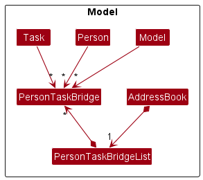

- Table of Contents
{:toc}

---

## **Setting up and getting started**

Refer to the guide [_Setting up and getting started_](SettingUp.md).

---

## **Design**

:bulb: **Tip**  
The `.puml` files used to create diagrams in this document can be found in the [diagrams](https://github.com/AY2223S1-CS2103T-T12-2/tp/tree/master/docs/diagrams) folder. Refer to the [_PlantUML Tutorial_ at se-edu/guides](https://se-education.org/guides/tutorials/plantUml.html) to learn how to create and edit diagrams.

### Architecture

The **_Architecture Diagram_** given above explains the high-level design of the App.

Given below is a quick overview of main components and how they interact with each other.

**Main components of the architecture**

**`Main`** has two classes called [`Main`](https://github.com/AY2223S1-CS2103T-T12-2/tp/blob/master/src/main/java/swift/Main.java) and [`MainApp`](https://github.com/AY2223S1-CS2103T-T12-2/tp/blob/master/src/main/java/swift/MainApp.java). It is responsible for,

- At app launch: Initializes the components in the correct sequence, and connects them up with each other.
- At shut down: Shuts down the components and invokes cleanup methods where necessary.

[**`Commons`**](#common-classes) represents a collection of classes used by multiple other components.

The rest of the App consists of four components.

- [**`UI`**](#ui-component): The UI of the App.
- [**`Logic`**](#logic-component): The command executor.
- [**`Model`**](#model-component): Holds the data of the App in memory.
- [**`Storage`**](#storage-component): Reads data from, and writes data to, the hard disk.

**How the architecture components interact with each other**

The _Sequence Diagram_ below shows how the components interact with each other for the scenario where the user issues the command `delete 1`.

Each of the four main components (also shown in the diagram above),

- defines its _API_ in an `interface` with the same name as the Component.
- implements its functionality using a concrete `{Component Name}Manager` class (which follows the corresponding API `interface` mentioned in the previous point).

For example, the `Logic` component defines its API in the `Logic.java` interface and implements its functionality using the `LogicManager.java` class which follows the `Logic` interface. Other components interact with a given component through its interface rather than the concrete class (reason: to prevent outside component's being coupled to the implementation of a component), as illustrated in the (partial) class diagram below.

The sections below give more details of each component.

### UI component

The **API** of this component is specified in [`Ui.java`](https://github.com/AY2223S1-CS2103T-T12-2/tp/blob/master/src/main/java/swift/ui/Ui.java)

The UI consists of a `MainWindow` that is made up of parts e.g.`CommandBox`, `ResultDisplay`, `PersonListPanel`, `StatusBarFooter` etc. All these, including the `MainWindow`, inherit from the abstract `UiPart` class which captures the commonalities between classes that represent parts of the visible GUI.

The `UI` component uses the JavaFx UI framework. The layout of these UI parts are defined in matching `.fxml` files that are in the `src/main/resources/view` folder. For example, the layout of the [`MainWindow`](https://github.com/AY2223S1-CS2103T-T12-2/tp/blob/master/src/main/java/swift/ui/MainWindow.java) is specified in [`MainWindow.fxml`](https://github.com/AY2223S1-CS2103T-T12-2/tp/blob/master/src/main/resources/view/MainWindow.fxml)

The `UI` component,

- executes user commands using the `Logic` component.
- prompts users with command suggestions and allows them to auto-complete them using the `Logic` component.
- listens for changes to `Model` data so that the UI can be updated with the modified data.
- keeps a reference to the `Logic` component, because the `UI` relies on the `Logic` to execute commands.
- depends on some classes in the `Model` component, as it displays `Person` object residing in the `Model`.
- depends on some classes in the `Model` component, as it displays `Task` object located in the `Model`.

### Logic component

**API** : [`Logic.java`](https://github.com/AY2223S1-CS2103T-T12-2/tp/blob/master/src/main/java/swift/logic/Logic.java)

Here's a (partial) class diagram of the `Logic` component:

How the `Logic` component works:

1. When `Logic` is called upon to execute a command, it uses the `AddressBookParser` class to parse the user command.
2. This results in a `Command` object (more precisely, an object of one of its subclasses e.g., `AddCommand`) which is executed by the `LogicManager`.
3. The command can communicate with the `Model` when it is executed (e.g. to add a person).
4. The result of the command execution is encapsulated as a `CommandResult` object which is returned from `Logic`.

The Sequence Diagram below illustrates the interactions within the `Logic` component for the `execute("delete 1")` API call.

:information_source: **Note**  
The lifeline for `DeleteCommandParser` should end at the destroy marker (X) but due to a limitation of PlantUML, the lifeline reaches the end of diagram.

Here are the other classes in `Logic` (omitted from the class diagram above) that are used for parsing a user command:

How the parsing works:

- When called upon to parse a user command, the `AddressBookParser` class creates an `XYZCommandParser` (`XYZ` is a placeholder for the specific command name e.g., `AddCommandParser`) which uses the other classes shown above to parse the user command and create a `XYZCommand` object (e.g., `AddCommand`) which the `AddressBookParser` returns back as a `Command` object.
- All `XYZCommandParser` classes (e.g., `AddCommandParser`, `DeleteCommandParser`, ...) inherit from the `Parser` interface so that they can be treated similarly where possible e.g, during testing.

### Model component

**API** : [`Model.java`](https://github.com/AY2223S1-CS2103T-T12-2/tp/blob/master/src/main/java/swift/model/Model.java)

The `Model` component,

- stores the address book data i.e., all `Person` objects (which are contained in a `UniquePersonList` object).
- stores the currently 'selected' `Person` objects (e.g., results of a search query) as a separate _filtered_ list which is exposed to outsiders as an unmodifiable `ObservableList<Person>` that can be 'observed' e.g. the UI can be bound to this list so that the UI automatically updates when the data in the list change.
- stores a `UserPref` object that represents the user’s preferences. This is exposed to the outside as a `ReadOnlyUserPref` objects.
- does not depend on any of the other three components (as the `Model` represents data entities of the domain, they should make sense on their own without depending on other components)

:information_source: **Note**  
An alternative (arguably, a more OOP) model is given below. It has a `Tag` list in the `AddressBook`, which `Person` references. This allows `AddressBook` to only require one `Tag` object per unique tag, instead of each `Person` needing their own `Tag` objects. 

### Storage component

**API** : [`Storage.java`](https://github.com/AY2223S1-CS2103T-T12-2/tp/blob/master/src/main/java/swift/storage/Storage.java)

The `Storage` component,

- can save both address book data and user preference data in json format, and read them back into corresponding objects.
- inherits from both `AddressBookStorage` and `UserPrefStorage`, which means it can be treated as either one (if only the functionality of only one is needed).
- depends on some classes in the `Model` component (because the `Storage` component's job is to save/retrieve objects that belong to the `Model`)

### Common classes

Classes used by multiple components are in the `swift.commons` package.

---

## **Implementation**

This section describes some noteworthy details on how certain features are implemented.

<!---
# KEEP AS REFERENCE FOR NOW, REMOVE ONCE MORE IMPLEMENTATIONS ARE ADDED #

### \[Proposed\] Undo/redo feature

#### Proposed Implementation

The proposed undo/redo mechanism is facilitated by `VersionedAddressBook`. It extends `AddressBook` with an undo/redo history, stored internally as an `addressBookStateList` and `currentStatePointer`. Additionally, it implements the following operations:

- `VersionedAddressBook#commit()` — Saves the current address book state in its history.
- `VersionedAddressBook#undo()` — Restores the previous address book state from its history.
- `VersionedAddressBook#redo()` — Restores a previously undone address book state from its history.

These operations are exposed in the `Model` interface as `Model#commitAddressBook()`, `Model#undoAddressBook()` and `Model#redoAddressBook()` respectively.

Given below is an example usage scenario and how the undo/redo mechanism behaves at each step.

Step 1. The user launches the application for the first time. The `VersionedAddressBook` will be initialized with the initial address book state, and the `currentStatePointer` pointing to that single address book state.

Step 2. The user executes `delete 5` command to delete the 5th person in the address book. The `delete` command calls `Model#commitAddressBook()`, causing the modified state of the address book after the `delete 5` command executes to be saved in the `addressBookStateList`, and the `currentStatePointer` is shifted to the newly inserted address book state.

Step 3. The user executes `add n/David …​` to add a new person. The `add` command also calls `Model#commitAddressBook()`, causing another modified address book state to be saved into the `addressBookStateList`.

:information_source: **Note**  
If a command fails its execution, it will not call `Model#commitAddressBook()`, so the address book state will not be saved into the `addressBookStateList`.

Step 4. The user now decides that adding the person was a mistake, and decides to undo that action by executing the `undo` command. The `undo` command will call `Model#undoAddressBook()`, which will shift the `currentStatePointer` once to the left, pointing it to the previous address book state, and restores the address book to that state.

:information_source: **Note**  
If the `currentStatePointer` is at index 0, pointing to the initial AddressBook state, then there are no previous AddressBook states to restore. The `undo` command uses `Model#canUndoAddressBook()` to check if this is the case. If so, it will return an error to the user rather
than attempting to perform the undo.

The following sequence diagram shows how the undo operation works:

:information_source: **Note**  
The lifeline for `UndoCommand` should end at the destroy marker (X) but due to a limitation of PlantUML, the lifeline reaches the end of diagram.

The `redo` command does the opposite — it calls `Model#redoAddressBook()`, which shifts the `currentStatePointer` once to the right, pointing to the previously undone state, and restores the address book to that state.

:information_source: **Note**  
If the `currentStatePointer` is at index `addressBookStateList.size() - 1`, pointing to the latest address book state, then there are no undone AddressBook states to restore. The `redo` command uses `Model#canRedoAddressBook()` to check if this is the case. If so, it will return an error to the user rather than attempting to perform the redo.

Step 5. The user then decides to execute the command `list`. Commands that do not modify the address book, such as `list`, will usually not call `Model#commitAddressBook()`, `Model#undoAddressBook()` or `Model#redoAddressBook()`. Thus, the `addressBookStateList` remains unchanged.

Step 6. The user executes `clear`, which calls `Model#commitAddressBook()`. Since the `currentStatePointer` is not pointing at the end of the `addressBookStateList`, all address book states after the `currentStatePointer` will be purged. Reason: It no longer makes sense to redo the `add n/David …​` command. This is the behavior that most modern desktop applications follow.

The following activity diagram summarizes what happens when a user executes a new command:

#### Design considerations:

**Aspect: How undo & redo executes:**

- **Alternative 1 (current choice):** Saves the entire address book.

  - Pros: Easy to implement.
  - Cons: May have performance issues in terms of memory usage.

- **Alternative 2:** Individual command knows how to undo/redo by
  itself.
  - Pros: Will use less memory (e.g. for `delete`, just save the person being deleted).
  - Cons: We must ensure that the implementation of each individual command are correct.

_{more aspects and alternatives to be added}_

-->

### Many-to-many relationship between `Person` and `Task`

The implementation of the contact-task relation is facilitated by `PersonTaskBridge` and `PersonTaskBridgeList`.

`PersonTaskBridge` is a class containing a `Person`'s ID and a `Task`'s ID, representing a relation between a `Person` and a `Task`.

`PersonTaskBridgeList` is a class containing a list of `PersonTaskBridge` objects, representing all the relations between `Person` and `Task` objects in the `AddressBook`. Additionally, it implements the following operations:

- `PersonTaskBridgeList#add(PersonTaskBridge)` - Saves a new relation between a `Person` and a `Task` in the list.
- `PersonTaskBridgeList#remove(PersonTaskBridge)` - Removes an existing relation between a `Person` and a `Task` from the list.
- `PersonTaskBridgeList#removePerson(Person)` and `PersonTaskBridgeList#removeTask(Task)` - Removes all existing relations between a `Person` and `Task` objects from the list.

These operations will be exposed in the `Model` interface.

### Find contacts/tasks

Execution of the `find_task` and `find_contact` commands are similar to other commands, as per described in the [Logic component](#logic-component).

The implementation of finding the contacts/tasks from our model is facilitated by `ContactNameContainsKeywordsPredicate` and `TaskNameContainsKeywordsPredicate`.

`ContactNameContainsKeywordsPredicate` and `TaskNameContainsKeywordsPredicate` implement the interface `Predicate` and test if a contact/task's name contains the given keywords.

The predicates are passed into `Model#updateFilteredContactList` and `Model#updateFilteredTaskList` respectively, which then uses the predicates to filter contacts/tasks containing the given keywords.

### View tasks details
The implementation of the task tab UI is facilitated by `TaskCard` and `TaskListPanel`.

`TaskCard` and `TaskListPanel` extends the superclass `UiPart<Region>` and fills the UI container with a panel that displays the list of tasks, along with their assigned contacts and deadlines.

`TaskListPanel` in is responsible for displaying the graphics of a task using a `TaskCard`.

### Command Suggestions and Command Auto-Completion

The implementation of Command Suggestions and Command Auto-Completion is facilitated by `CommandSuggestor` in the `Logic` Component. The `CommandBox` UI component listens for changes in the command box textField and calls methods from `CommandSuggestor` to reflect command suggestions and allow autocompletion.

`CommandSuggestor` mainly implements the following operations:
- `CommandSuggestor#suggestCommand` - Suggests a command with the corresponding syntax based on the user's current input
- `CommandSuggestor#autocompleteCommand` - Completes the current user input according to the shown command suggestion

## **Documentation, logging, testing, configuration, and dev-ops**

- [Documentation guide](Documentation.md)
- [Testing guide](Testing.md)
- [Logging guide](Logging.md)
- [Configuration guide](Configuration.md)
- [DevOps guide](DevOps.md)

---

## **Appendix: Requirements**

### Product scope

**Target user profile**:

Designed for software engineering project leads who ...
- need to keep track of many tasks and scheduled events with clients and colleagues
- can type fast
- prefer typing to mouse interactions
- prefer desktop apps over other types

**Value proposition**: manage tasks and scheduled events with clients and colleagues faster than a typical GUI driven app

### User stories

Priorities:

- High (must have) - `* * *`
- Medium (nice to have) - `* *`
- Low (unlikely to have) - `*`

| Priority | As a …​        | I want to …​             | So that I can…​                                                            |
|----------|----------------|--------------------------|----------------------------------------------------------------------------|
| `* * *`  | new user       | see usage instructions   | refer to instructions when I forget how to use the app                     |
| `* * *`  | user           | add a new contact        | add a new contact to keep track of                                         |
| `* * *`  | user           | view all contacts        | get an overview of all contacts in my app                                  |
| `* * *`  | user           | update a contact         | update the particulars of a contact                                        |
| `* * *`  | user           | delete a contact         | remove contacts that I no longer need                                      |
| `* * *`  | user           | find contacts by name    | locate details of contacts without having to go through the entire list    |
| `* * *`  | user           | add task for contact     | add a task to a contact to keep track of                                   |
| `* * *`  | user           | view tasks by contact    | view tasks belonging to a contact                                          |
| `* *`    | user           | update a task            | update the particulars of a task                                           |
| `* * *`  | user           | delete a task            | remove tasks that I no longer need                                         |
| `* *`    | user           | list all tasks           | to locate details of all the tasks immediately                             |
| `* *`    | user           | find tasks by name       | locate details of tasks without having to go through the entire list       |
| `* *`    | forgetful user | autocomplete my commands | conveniently type commands without referring to the user guide excessively |

### Use cases

(For all use cases below, the **System** is the `AddressBook` and the **Actor** is the `user`, unless specified otherwise)

**Use case: Update a person**

**MSS**

1.  User requests to list people
2.  AddressBook shows a list of people
3.  User requests to edit a specific person in the list
4.  AddressBook edits the person

    Use case ends.

**Extensions**

- 2a. The list is empty.

  Use case ends.

- 3a. The given index is invalid.

  - 3a1. AddressBook shows an error message.

    Use case resumes at step 2.

- 3b. The command arguments are invalid.

  - 3b1. AddressBook shows an error message.

    Use case resumes at step 2.

**Use case: Delete a person**

**MSS**

1.  User requests to list people
2.  AddressBook shows a list of people
3.  User requests to delete a specific person in the list
4.  AddressBook deletes the person

    Use case ends.

**Extensions**

- 2a. The list is empty.

  Use case ends.

- 3a. The given index is invalid.

  - 3a1. AddressBook shows an error message.

    Use case resumes at step 2.

**Use case: Update a task**

**MSS**

1.  User requests to list tasks
2.  AddressBook shows a list of tasks
3.  User requests to edit a specific task in the list
4.  AddressBook edits the task

    Use case ends.

**Extensions**

- 2a. The list is empty.

  Use case ends.

- 3a. The given index is invalid.

  - 3a1. AddressBook shows an error message.

    Use case resumes at step 2.

- 3b. The command argument is invalid.

  - 3b1. AddressBook shows an error message.

    Use case resumes at step 2.

**Use case: Delete a task**

**MSS**

1.  User requests to list tasks
2.  AddressBook shows a list of tasks
3.  User requests to delete a specific task in the list
4.  AddressBook deletes the task

    Use case ends.

**Extensions**

- 2a. The list is empty.

  Use case ends.

- 3a. The given index is invalid.

  - 3a1. AddressBook shows an error message.

    Use case resumes at step 2.

### Non-Functional Requirements

1.  Should work on any _mainstream OS_ as long as it has Java `11` or above installed.
2.  Should be able to hold up to 1000 tasks and contacts without a noticeable sluggishness in performance for typical usage.
3.  A user with above average typing speed for regular English text (i.e. not code, not system admin commands) should be able to accomplish most of the tasks faster using commands than using the mouse.
4.  Data should be persistent and stored in the local machine's storage.
5.  Product is designed for single user and is not required to handle collaboration between multiple users.

### Glossary

- **Mainstream OS**: Windows, Linux, Unix, OS-X
- **Private contact detail**: A contact detail that is not meant to be shared with others
- **Task**: A task that is assigned to a specific contact
- **Tag**: The relationship between user and contact

---

## **Appendix: Instructions for manual testing**

Given below are instructions to test the app manually.

:information_source: **Note**  
These instructions only provide a starting point for testers to work on;
testers are expected to do more *exploratory* testing.

### Launch and shutdown

1. Initial launch

   1. Download the jar file and copy into an empty folder

   2. Double-click the jar file Expected: Shows the GUI with a set of sample contacts. The window size may not be optimum.

2. Saving window preferences

   1. Resize the window to an optimum size. Move the window to a different location. Close the window.
   2. Re-launch the app by double-clicking the jar file. 
      Expected: The most recent window size and location is retained.

3. _{ more test cases …​ }_

### Deleting a person / task

1. Deleting a person / task while all persons / task are being shown

   1. Prerequisites: List all persons / task using the `list_contact` or `list_task` command.

   2. Test case: `delete_contact 1` / `delete_task 1` 
      Expected: First contact / task is deleted from the list. Details of the deleted contact / task shown in the status message. Timestamp in the status bar is updated.

   3. Test case: `delete_contact 0` / `delete_task 0` 
      Expected: No person / task is deleted. Error details shown in the status message. Status bar remains the same.

   4. Other incorrect delete commands to try: `delete_contact` / `delete_task`, `delete_contact x` / `delete_task x`, `...` (where x is larger than the list size) 
      Expected: Similar to previous.

2. _{ more test cases …​ }_

### Saving data

1. Dealing with missing/corrupted data files

   1. _{explain how to simulate a missing/corrupted file, and the expected behavior}_

2. _{ more test cases …​ }_

---

## **Acknowledgements**

- This project is based on the AddressBook-Level3 project created by the [SE-EDU initiative](https://se-education.org).
- Libraries used: [JavaFX](https://openjfx.io/), [Jackson](https://github.com/FasterXML/jackson), [JUnit5](https://github.com/junit-team/junit5)
- UI color scheme inspired by [TailwindUI](https://tailwindui.com/)
- User guide format inspired by [FoodRem](https://ay2223s1-cs2103t-w16-2.github.io/tp/)
