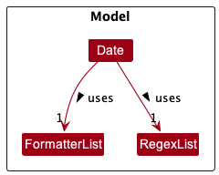
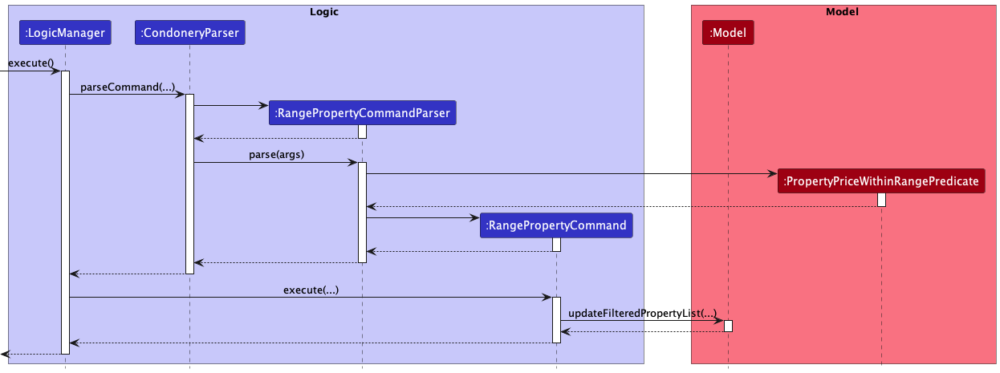
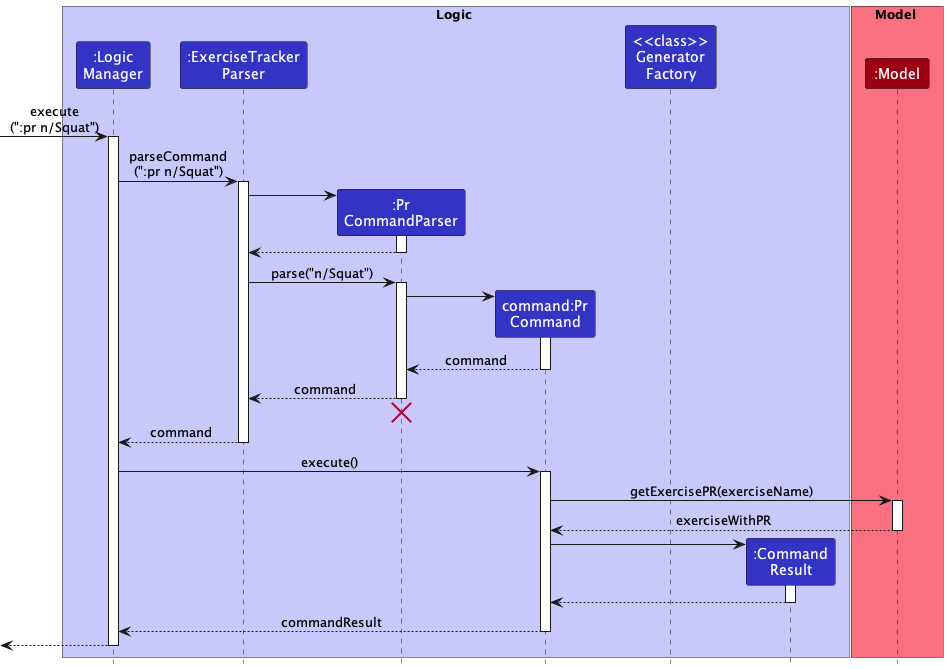
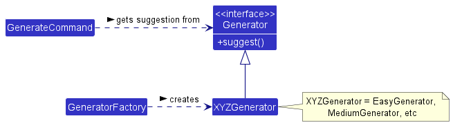
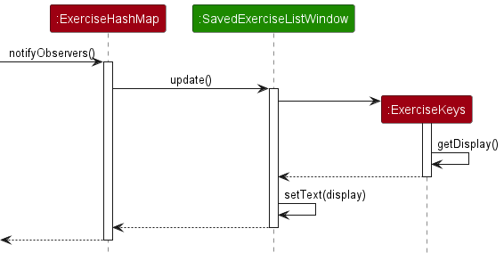

<p align="center">
  
</p>

<div style="page-break-after: always;"></div>

**Table of Contents**
* Table of Contents
{:toc}

--------------------------------------------------------------------------------------------------------------------
<div style="page-break-after: always;"></div>

## **Acknowledgements**

* Gim is adapted from the [AddressBook-Level3](https://se-education.org/addressbook-level3/) project created by the SE-EDU initiative.
* Libraries used: [JavaFX](https://openjfx.io/), [Jackson](https://github.com/FasterXML/jackson), [JUnit5](https://github.com/junit-team/junit5)

--------------------------------------------------------------------------------------------------------------------

## **Setting up, getting started**

Refer to the guide [_Setting up and getting started_](SettingUp.md).

--------------------------------------------------------------------------------------------------------------------

<div style="page-break-after: always;"></div>

## **Design**

<div markdown="span" class="alert alert-primary">

:bulb: **Tip:** The `.puml` files used to create diagrams in this document can be found in the [diagrams](https://github.com/se-edu/addressbook-level3/tree/master/docs/diagrams/) folder. Refer to the [_PlantUML Tutorial_ at se-edu/guides](https://se-education.org/guides/tutorials/plantUml.html) to learn how to create and edit diagrams.
</div>

### Architecture


The ***Architecture Diagram*** given above explains the high-level design of the App.

Given below is a quick overview of main components and how they interact with each other.

**Main components of the architecture**

**`Main`** has two classes called [`Main`](https://github.com/AY2223S1-CS2103T-T15-4/tp/blob/master/src/main/java/gim/Main.java) and [`MainApp`](https://github.com/AY2223S1-CS2103T-T15-4/tp/blob/master/src/main/java/gim/MainApp.java). It is responsible for,
* At app launch: Initializes the components in the correct sequence, and connects them up with each other.
* At shut down: Shuts down the components and invokes cleanup methods where necessary.

[**`Commons`**](#common-classes) represents a collection of classes used by multiple other components.

The rest of the App consists of four components.

* [**`UI`**](#ui-component): The UI of the App.
* [**`Logic`**](#logic-component): The command executor.
* [**`Model`**](#model-component): Holds the data of the App in memory.
* [**`Storage`**](#storage-component): Reads data from, and writes data to, the hard disk.


**How the architecture components interact with each other**

The *Sequence Diagram* below shows how the components interact with each other for the scenario where the user issues the command `:del 1`.


Each of the four main components (also shown in the diagram above),

* defines its *API* in an `interface` with the same name as the Component.
* implements its functionality using a concrete `{Component Name}Manager` class (which follows the corresponding API `interface` mentioned in the previous point.

<div style="page-break-after: always;"></div>

For example, the `Logic` component defines its API in the `Logic.java` interface and implements its functionality using the `LogicManager.java` class which follows the `Logic` interface. Other components interact with a given component through its interface rather than the concrete class (reason: to prevent outside component's being coupled to the implementation of a component), as illustrated in the (partial) class diagram below.


The sections below give more details of each component.

<div style="page-break-after: always;"></div>

### UI component

The **API** of this component is specified in [`Ui.java`](https://github.com/AY2223S1-CS2103T-T15-4/tp/blob/master/src/main/java/gim/ui/Ui.java)


The UI consists of a `MainWindow` that is made up of parts e.g.`CommandBox`, `ResultDisplay`, `ExerciseListPanel`, `StatusBarFooter` etc. All these, including the `MainWindow`, inherit from the abstract `UiPart` class which captures the commonalities between classes that represent parts of the visible GUI.

The `UI` component uses the JavaFx UI framework. The layout of these UI parts are defined in matching `.fxml` files that are in the `src/main/resources/view` folder. For example, the layout of the [`MainWindow`](https://github.com/AY2223S1-CS2103T-T15-4/tp/blob/master/src/main/java/gim/ui/MainWindow.java) is specified in [`MainWindow.fxml`](https://github.com/AY2223S1-CS2103T-T15-4/tp/blob/master/src/main/resources/view/MainWindow.fxml)

The `UI` component,

* executes user commands using the `Logic` component.
* listens for changes to `Model` data so that the UI can be updated with the modified data.
* keeps a reference to the `Logic` component, because the `UI` relies on the `Logic` to execute commands.
* depends on some classes in the `Model` component, as it displays `Exercise` object residing in the `Model`.

<div style="page-break-after: always;"></div>

### Logic component

**API** : [`Logic.java`](https://github.com/AY2223S1-CS2103T-T15-4/tp/blob/master/src/main/java/gim/logic/Logic.java)

Here's a (partial) class diagram of the `Logic` component:


How the `Logic` component works:
1. When `Logic` is called upon to execute a command, it uses the `ExerciseTrackerParser` class to parse the user command.
2. This results in a `Command` object (more precisely, an object of one of its subclasses e.g., `AddCommand`) which is executed by the `LogicManager`.
3. The command can communicate with the `Model` when it is executed (e.g. to add an exercise).
4. The result of the command execution is encapsulated as a `CommandResult` object which is returned back from `Logic`.

<div style="page-break-after: always;"></div>

The Sequence Diagram below illustrates the interactions within the `Logic` component for the `execute(":del 1")` API call.


<div markdown="span" class="alert alert-info">:information_source: **Note:** The lifeline for `DeleteCommandParser` should end at the destroy marker (X) but due to a limitation of PlantUML, the lifeline reaches the end of diagram.
</div>

<div style="page-break-after: always;"></div>

Here are the other classes in `Logic` (omitted from the class diagram above) that are used for parsing a user command:


How the parsing works:
* When called upon to parse a user command, the `ExerciseTrackerParser` class creates an `XYZCommandParser` (`XYZ` is a placeholder for the specific command name e.g., `AddCommandParser`) which uses the other classes shown above to parse the user command and create a `XYZCommand` object (e.g., `AddCommand`) which the `ExerciseTrackerParser` returns back as a `Command` object.
* All `XYZCommandParser` classes (e.g., `AddCommandParser`, `DeleteCommandParser`, ...) inherit from the `Parser` interface so that they can be treated similarly where possible e.g, during testing.

<div style="page-break-after: always;"></div>

### Model component
**API** : [`Model.java`](https://github.com/AY2223S1-CS2103T-T15-4/tp/blob/master/src/main/java/gim/model/Model.java)


The `Model` component,

* stores the exercise tracker data i.e., all `Exercise` objects (which are contained in a `ExerciseList` and `ExerciseHashMap` object).
* stores the currently 'selected' `Exercise` objects (e.g., results of a search query) as a separate _filtered_ list which is exposed to outsiders as an unmodifiable `ObservableList<Exercise>` that can be 'observed' e.g. the UI can be bound to this list so that the UI automatically updates when the data in the list change.
* stores a `UserPref` object that represents the user’s preferences. This is exposed to the outside as a `ReadOnlyUserPref` objects.
* does not depend on any of the other three components (as the `Model` represents data entities of the domain, they should make sense on their own without depending on other components)

<div style="page-break-after: always;"></div>

### Storage component

**API** : [`Storage.java`](https://github.com/AY2223S1-CS2103T-T15-4/tp/blob/master/src/main/java/gim/storage/Storage.java)


The `Storage` component,
* can save both exercise tracker data and user preference data in json format, and read them back into corresponding objects.
* inherits from both `ExerciseTrackerStorage` and `UserPrefStorage`, which means it can be treated as either one (if only the functionality of only one is needed).
* depends on some classes in the `Model` component (because the `Storage` component's job is to save/retrieve objects that belong to the `Model`)

### Common classes

Classes used by multiple components are in the `gim.commons` package.

--------------------------------------------------------------------------------------------------------------------

<div style="page-break-after: always;"></div>

## **Implementation**

This section describes some noteworthy details on how certain features are implemented.

### **Exercise**

#### Implementation


An `Exercise` is stored in `ExerciseList` and `ExerciseHashmap` of Model

An `Exercise` contains the following attributes:
1. a `Name`, which represents the name of the Exercise
2. a `Weight`, which represents the total weight used for a certain Exercise
3. a `Reps`, which represents the number of times a specific exercise was performed
4. a `Sets`, which represents the number of cycles of reps that was completed
5. a `Date`, which represents the date an exercise was performed

<div style="page-break-after: always;"></div>

#### Date Implementation


The default format for date follows `dd/MM/uuuu`. `uuuu` is chosen over `yyyy` because this avoids unexpected exceptions
under strict parsing by the Java API `DateTimeFormatter`, such as those exceptions related to year-of-era.

The validity of a given date string depends on two factors: (1) Regex formatting and (2) Non-existent date checking.

1. For the regex formatting, the Singleton class `RegexList` contains a `List<String>` called `regexList` that contains the
accepted regex strings. The method `isValidDateByRegex` iterates through `regexList` to check whether a given date string
follows any of the accepted regex strings.

2. For the non-existent date checking, the Singleton class `FormatterList` contains a `List<String>` called `formatterList`
that contains the accepted date patterns. The private constructor of this class uses stream mapping to obtain a `List<DateTimeFormatter>`
called `formatterList` containing `DateTimeFormatter` objects that follows strict date validity check using
`ResolverStyle.STRICT`.

The Singleton pattern is used here to prevent multiple instantiation of this class.
1. The drawbacks of using this pattern is not really pronounced as there are not many classes having them as dependencies (only the `Date` class).
Therefore, coupling within the code base will not increase much.
2. Testing will not be affected by the fact that singleton objects carry data from one test to another because there is no mutation
of data inside the singleton objects `RegexList` and `FormatterList`. All tests will have the same singleton objects used.

<div style="page-break-after: always;"></div>

#### Design Considerations

**Aspect: Fields of Exercise are Final**
* **Current choice**: The aforementioned fields in `Exercise` are final, effectively making our Exercise class immutable.
  * Rationale: Code written with immutable objects is easier to reason with and easier to understand, facilitating a smoother process when it comes to debugging and testing any code related to `Exercise`.

<div style="page-break-after: always;"></div>

### **Exercise Hashmap**

#### Implementation
The Exercise Hashmap stores data in the form of a hashmap, where the key of the hashmap is the `Name` of an `Exercise` and its associated value is an `Exercise` ArrayList, containing a list of exercises (with the same name).

#### Design Considerations

**Aspect: Choosing the Data Structure**
* **Current choice**: We decided to use a hashmap data structure.
  * Rationale: We wanted to create associations between exercises with the same name. Utilising a hashmap structure, we can easily identify and retrieve exercises with the same exercise name (by their unique key identifier). Hence, this facilitates commands that rely on this retrieval to be implemented, such as [Listing of Personal Records](#listing-of-personal-records) and [Generating a suggested workout routine](#generating-a-suggested-workout-routine).

### **Sorting Exercise List**

#### Implementation

The sorting of exercise list is facilitated by `ModelManager` which implements `Model`. `ModelManager` contains a `filteredExercises`
list which is the list of exercises in a `FilteredList` 'wrapper' from `javafc.collections.transformation`. `filteredExercises`
gets the list of exercises to be displayed from method `getExerciseList()` in `ExerciseTracker`.

`ExerciseTracker` has method `sortDisplayedList()` which calls `sortDisplayedList()` in `ExerciseList`.

`ExerciseList` contains a `displayedList` of type `ObservableList<Exercise>` and is the list that will be displayed by the `Ui`.
It is a duplicated copy of the `internalUnmodifiableList` of type `unmodifiableObservableList`. `ExerciseList` has method
`sortDisplayedList()` which sorts the `displayedList` by order of date using the `sort()` method in `java.util.Collections` with a `Comparator<Exercise>`.

<div style="page-break-after: always;"></div>

**Execution**

When the command `:sort` is entered, the `Ui` sends the command to `Logic`. `Logic` parses and identifies the `:sort` command that was entered, and creates
an instance of it. `Logic` then executes the command. `Model` will have the displayed list sorted and the sorted list will be displayed by `Ui`.

**Example Usage**

Given below is an example usage scenario and how the sorting mechanism behaves at each step.

Step 1: The user launches the application which loads the set of exercises previously keyed. `displayedList` will be initialised
to be the same as the `internalUnmodifiableList` in `ExerciseList` where the exercises are sorted by the date of input.

Step 2: The user executes `:sort` command to sort the exercises based on date of exercises done. The `ExerciseTrackerParser`
identifies that the command is a `SortCommand`. The command calls `Model` to `sortDisplayedList` and the `Ui` displays the
`displayedList` which has the exercises sorted by their respective dates.

The following sequence diagram shows how the sort command is executed.


<div style="page-break-after: always;"></div>

#### Design considerations

**Aspect: Displayed List structure**
* **Current choice**: `displayedList` is a duplicated copy of the list of exercises in `internalUnmodifiableList` of type
  `UnmodifiableObservableList` in `ExerciseList` class
    * Rationale: The sort command will sort the `diplayedList`, not affecting the `internalUnmodifiableList`. This allows
      users to view the sorted list of exercises while maintaining a defensive copy of exercises keyed by user.

**Aspect: Open-Closed Principle**
* **Current choice**: `sortDisplayedList()` in `ExerciseList` sorts the `displayedList` using the `sort()` method in `java.util.Collections` and a `Comparator<Exercise>`.
    * Rationale: Using a `Comparator<Exercise>` in `sort()` allows one to extend the `sortDisplayedList` method to accommodate other sorting orders
      by simply changing the `Comparator<Exercise>` used should the sorting criteria change in the future.

### **Viewing exercises within a date range**

#### Implementation

* `ExerciseTrackerParser` calls `RangeCommandParser#parse`.
* `RangeCommandParser#parseArguments` will return an enum type `Variation` according to the arguments in the
`ArgumentMultimap` created.
* When we obtain `Variation.ONE`, `RangeCommandParser#getVariationOne` will be called. 
  * In this case, the arguments expected to be inside the `ArgumentMultimap` will be the start date and
    end date.
* When we obtain `Variation.TWO`, `RangeCommandParser#getVariationTwo` will be called.
    * In this case, we expect the number of days to be the only argument inside `ArgumentMultimap`.
* `ParserUtil#parseDate` will be called to obtain the `Date` object(s).
* `RangeCommand` is returned.
* Then, the `execute()` method of the resulting `RangeCommand` object will be called, returning a
`CommandResult` object with the appropriate message.

<div style="page-break-after: always;"></div>

**Execution**

When the command `:range start/START_DATE end/END_DATE` or `:range last/NUMBER_OF_DAYS` is entered, the `Ui` sends 
the command to `Logic`. `LogicManager` parses and identifies the `:range` command that was entered, and creates an instance of it.

`LogicManager` then executes the command by calling `execute()` in `RangeCommand`.

`RangeCommand` will call the method `sortFilteredExerciseList(predicate)` defined in `Model`. This will cause
`filteredExercises` in `ModelManager` to be filtered according to the predicate `DateWithinRangePredicate`.
The resulting list will only include exercise entries that have dates between the start date (inclusive) and
end date (inclusive), arranged from the most recent first. If two exercise entries have the same date,
they will be sorted in alphabetical order.

`Model` will have the list sorted and the sorted list will be displayed by `Ui`.

**Example Usage**

Given below is an example usage scenario and how the date range view mechanism behaves at each step.

Step 1: The user launches the application which loads the set of exercises previously keyed.

Step 2: The user executes `:range start/10/10/2022 end/15/10/2022` command to view all the exercises done between
10 October 2022 and 15 October 2022. The `ExerciseTrackerParser` identifies that the command is a `RangeCommand`.
The command calls `Model` to `sortFilteredExerciseList(predicate)` and the `Ui` displays the `filteredExercises` list which has all the exercises between the specified dates.

<div style="page-break-after: always;"></div>

The following sequence diagram shows how the date range process is executed.



<div style="page-break-after: always;"></div>

#### Design considerations

**Aspect: Simplicity of command design**
* **Current choice**: The two variations of the `:range` command uses the same keyword but with different expected arguments.
This reduces the number of command keywords the user needs to remember when using the app.
* **Alternative choice**: Instead of using `:range` for both variations, another keyword such as
`:rangeLast` could be used in addition to `:range`. The drawback for this design choice is that
it goes against the simplicity of command design where the set of command keywords should be minimised where possible.

**Aspect: Enum types are used to indicate the variations**
* **Current choice**: Within `RangeCommandParser`, the enum `Variation` has only two values: `ONE` and `TWO` to represent
`:range` command variation one and two respectively. This ensures that the value representing the command variation cannot be anything not defined in the enum type.
Adding new variations is also easily done by adding another value inside the enum type.

### **Listing of Personal Records**

#### Implementation

The mechanism for listing Exercise personal record(s) is facilitated by `PrCommand`, which extends from `Command`.

It implements the following operations:

* `PrCommand#execute()`Executes and coordinates the necessary objects and methods to list personal record(s).
* `PrCommandParser#parse()`Parses user input from UI and initialises a PrCommand object.

The user can choose to view personal record(s) for specific exercises with the 'n/' prefix:
* `:pr n/NAME1 [n/NAME2 n/NAME3 ...]`

The user can also choose to view personal records for ALL exercises with the 'all/ prefix':
* `:pr all/`

<div style="page-break-after: always;"></div>

**Example Usage**

Given below is an example usage scenario for how the mechanism for listing Exercise personal record(s) behaves at each step.

Step 1. The user launches the application and already has 4 Exercise instances, with two unique Exercises (Squat and Deadlift), in the exercise tracker.

Step 2: The user enters the command `:pr n/Squat` to view their personal record for the exercise 'Squat'.

The following sequence diagram shows how the `PrCommand` works.



<div style="page-break-after: always;"></div>

#### Design considerations

**Aspect: Type of arguments to accept**
* **Alternative 1 (current choice)**: Accept exercise names.
    * Pros: Being able to view and list personal records by Exercise name is more intuitive and convenient, especially since all unique Exercises are listed in the UI (bottom right).
    * Cons: Would require users to type more characters; also require users to enter exercise names accurately.

* **Alternative 2**: Accept index as arguments.
    * Pros: Suggestions are generated based on PR recorded by the app. As such, the input exercise(s) must already exist in the app. Accepting indexes would guarantee this condition.
    * Cons: May require users to scroll to locate index of desired exercise, when the number of exercises grow.

<div style="page-break-after: always;"></div>

### **Generating a suggested workout routine**

#### Implementation

Workout suggestions are suggested by `Generator` objects. The suggestion mechanism follows the command pattern. The `GeneratorFactory` creates a concrete `Generator` object, and passes it to the `GenerateCommand` object, which treats all generators as a general `Generator` type. `GenerateCommand` is able to get a workout suggestion without knowledge of the type of generator. The following class diagram illustrates this.



The mechanism for generating a suggested workout routine is facilitated by `GenerateCommand`, which extends from `Command`.

It implements the following operations:

* `GenerateCommand#execute()` — Executes and coordinates the necessary objects and methods to generate a suggested workout routine.
* `GenerateCommandParser#parse()` — Parses user input from UI and initializes a GenerateCommand object.

Cases such as where the index from the user input is out of bounds, are handled by the methods.

<div style="page-break-after: always;"></div>

**Example Usage**

Given below is an example usage scenario for how the mechanism for generating a workout routine behaves at each step.

Step 1. The user launches the application, and already has 2 exercises, squat and deadlift, at index 1 and 2, in the exercise tracker.

Step 2: The user enters the command `:gen 1,2 l/easy` to generate an easy workout routine consisting of the exercises squat and deadlift.

The following sequence diagram shows how the `GenerateCommand` works.
A `Name` object `exerciseName` is returned to `g:GenerateCommand` by calling a method in `:Model`. 
For the sake of brevity, this interaction is omitted from the diagram.


<div style="page-break-after: always;"></div>

The diagram below illustrates the interaction between `g:GenerateCommand` and `GeneratorFactory` class.
The static method `GeneratorFactory#getGenerator()` creates a `Generator` of the correct difficulty level, such as `EasyGenerator`.
The number of `Generator` objects created is equal to the number of unique exercise names. They are `s:EasyGenerator` and `d:EasyGenerator` for squat and deadlift respectively.


<div markdown="span" class="alert alert-info">:information_source: **Note:** The sd frame should capture the entire diagram here, but due to a limitation of PlantUML, it appears as such.

</div>

#### Design considerations

**Aspect: Number of `Generator` objects:**
* **Current choice**: Pairing each unique exercise to one `Generator`.
    * Rationale: The current `:gen` command specifies a single difficulty level for all exercises listed in the command. A possible extension in the future would be to allow each exercise to be linked to its own difficulty level, for example, `:gen deadlift/easy squat/hard`. This design would make such an implementation possible.

<div style="page-break-after: always;"></div>

### **Listing of unique stored Exercises in a graphical UI**

#### Implementation

The display window is located in the bottom right of the application. The display mechanism has been implemented with the Observer design pattern in mind.

It is primarily driven by `SavedExerciseListWindow` (which holds the UI for the display). The logic is
handled by `ExerciseKeys` and `ExerciseHashMap`.

**General class diagram**

The `SavedExerciseListWindow` class implements the `Observer` interface as it is the observer. The `ExerciseHashMap` class maintains an internal ArrayList of type `Observer`, which can be modified through the addUI function. As the UI elements are usually initialized later than the data on loading of the application, the `SavedExerciseListWindow`UI object is only added as an observer after its constructor is called. This guards against any null-pointer exceptions which may occur when preloading data from a hashmap in storage.


<div style="page-break-after: always;"></div>

**Subscribing to updates**

Once the `SavedExerciseListWindow` object has been added to the arraylist of `Observer` in the  `ExerciseHashMap`, it 'subscribes' to notifications whenever the ExerciseHashMap changes. Based on the functionality of the Hashmap as well as the application, this can be generalised into two distinct scenarios.

* **Adding an exercise** - Whenever a new exercise has been added, there is a possibility of a new key being added.
* **Removing an exercise** - Whenever a new exercise has been removed, there is a possibility of a key being removed permanently.

<div markdown="span" class="alert alert-info">:information_source: **Note:** The current implementation subscribes to notification for any form of addition or deletion, regardless if the exercise is unique or already exists in the list.
</div>

**Updating**

Whenever there is a state changing operation, the `ExerciseHashMap` object will notify all observers through the notifyObservers method. All Observers in the list will run the update method that is individually specified in their class. As such , all Observers of ExerciseHashMap are required to override the update method as shown below.

```
    @Override
    public void update() {
        .
        unique implementation detail here... 
        . 
    }
```

<div style="page-break-after: always;"></div>

Below is a sample sequence diagram for the current implementation of how notifyObservers work.



<div markdown="span" class="alert alert-info">:information_source: **Note:** Currently, there is only SavedExerciseListWindow observing the ExerciseHashMap
</div>

The logic behind the calculations and formatting of the display message is handled by the `ExerciseKeys` class.

Through this pattern, each observer gets to define exactly what the required display/result should be.

#### Design considerations

**Aspect: Polymorphism**
* The immediately apparent benefit of this design would be the Polymorphism that it capitalises on. In particular, the notifyObservers function in `ExerciseHashMap`.

```
    public void notifyObservers() {
        for (Observer o: observerArrayList) {
            o.update();
        }
    }
```

<div style="page-break-after: always;"></div>

* Notice that `ExerciseHashMap` does not know the nature of the observers and how they interact with it. `ExerciseHashMap` only stores a list of the objects observing it. It does not have to define what they should do to update, instead, the responsibility of deciding what to do is passed on to the Observers themselves.

* This allows for flexibility in having different types of objects having different forms of updating. This keeps the code in `ExerciseHashMap` short and hides the implementation of the Observers behind the `Observer` interface which acts as an intermediary to help the UI communicate with `ExerciseHashMap`.

--------------------------------------------------------------------------------------------------------------------

<div style="page-break-after: always;"></div>

## **Documentation, logging, testing, configuration, dev-ops**

* [Documentation guide](Documentation.md)
* [Testing guide](Testing.md)
* [Logging guide](Logging.md)
* [Configuration guide](Configuration.md)
* [DevOps guide](DevOps.md)

--------------------------------------------------------------------------------------------------------------------

<div style="page-break-after: always;"></div>

## **Appendix: Requirements**

### **Product scope**

**Target user profile**:

* Programmers who love vim and want to hit the gym for some exercise. However, they are too occupied with work to recall their progressions and don’t know what to do next
* They may also find it hard to remember their statistics on each exercise

**Value proposition**:
* Leverage on their blazing speed on vim to save, write and view gym data in a familiar fashion
* Provides a fast platform for users to track their gym progress or workout routine
* Has vim-like commands to make things more efficient for vim lovers


### **User stories**

Priorities: High (must have) - `* * *`, Medium (nice to have) - `* *`, Low (unlikely to have) - `*`

<br>

| Priority | As a …        | I want to …                                                          | so that I can …                                                            |
|----------|---------------|----------------------------------------------------------------------|----------------------------------------------------------------------------|
| `* * *`  | user          | add exercises                                                        | keep track of my exercises                                                 |
| `* * *`  | user          | delete exercises                                                     | see what exercises I have done                                             |
| `* * *`  | user          | look for all entries of a specific exercise                          | track my progression for that particular exercise                          |
| `* * *`  | user          | view exercises in chronological order                                | keep track of my gym progress                                              |
| `* * *`  | user          | want to track my personal records                                    | keep track of my progress for each exercise (and show off to my friends)   |
| `* * *`  | user          | generate workouts of different difficulty                            | customise my workout based on how I’m feeling that day                     |
| `* * *`  | user          | view my recent exercises                                             | plan for my next gym session                                               |
| `* * *`  | user          | view my exercises done within a date range                           | track my overall progress over a period of time (eg. weekly, monthly, etc) |
| `* * *`  | user          | see what names the system has registered                             | add exercises correctly and quickly                                        |
| `* * `   | new user      | remove all sample data                                               | input my own data                                                          |
| `* *  `  | advanced user | have a quick summary of all the commands I can do in the application | save time                                                                  |
| `* * `   | clumsy user   | have a safeguard against accidentally clearing all data              | preserve my exercise                                                       |
| `*`      | user          | track my calories intake                                             | attain my fitness goals                                                    |
| `*`      | user          | track my calories burnt during the gym session                       | attain my fitness goals                                                    |
| `*`      | user          | have a tailored workout program                                      | target my specific strengths and weaknesses for outstanding results        |
| `*`      | user          | have motivation to go to the gym                                     | stay motivated to attain my fitness goals                                  |
| `*`      | user          | track my Rate of Perceived Exertion (RPE) of previous workout        | better plan for my next workout                                            |
| `*`      | user          | view my run timings                                                  | track my running progression                                               |
| `*`      | user          | share my workout plan with my friends                                | progress together with them                                                |
| `*`      | user          | access a workout plan done by my friends                             | learn from them                                                            |

<div style="page-break-after: always;"></div>

### **Use cases**

(For all use cases below, the **System** is `Gim` and the **Actor** is the `user`, unless specified otherwise)

#### Use case 1: Help

System: Gim <br>
Use case: UC01 - Request for help <br>
Actor: User <br>

**MSS**

1. User requests for help.
2. Gim displays help message.
<br>Use case ends.

#### Use case 2: Add an exercise

System: Gim <br>
Use case: UC02 - Add an exercise <br>
Actor: User <br>

**MSS**

1. User requests to add an exercise.
2. Gim adds the exercise into storage.
<br>Use case ends.

**Extensions**

* 1a. User enters the command wrongly.
    * 1a1. Gim shows an error message.
<br>Use case resumes at step 1.

<div style="page-break-after: always;"></div>

#### Use case 3: Delete an exercise

System: Gim <br>
Use case: UC03 - Delete an exercise <br>
Actor: User <br>

**MSS**

1. User requests to delete an exercise.
2. Gim deletes the exercise.
<br>Use case ends.

**Extensions**

* 1a. User enters the command wrongly.
    * 1a1. Gim displays the error message.
<br>Use case resumes at step 1.

* 1b. User enters an exercise that does not exist in the app.
    * 1b1. Gim displays that the exercise does not exist.
<br>Use case ends.

#### Use case 4: Clear all exercise entries in the system

System: Gim <br>
Use case: UC04 - Clear all exercise entries in the system <br>
Actor: User <br>

**MSS**

1. User requests to clear all exercise entries in the system.
2. Gim clears all exercise entries in the system.
   <br>Use case ends.

**Extensions**

* 1a. User enters the command wrongly.
    * 1a1. Gim shows an error message.
      <br>Use case resumes at step 1.

<div style="page-break-after: always;"></div>

#### Use case 5: List exercises

System: Gim <br>
Use case: UC05 - List exercises <br>
Actor: User <br>

**MSS**

1. User requests to list all stored exercises.
2. Gim lists the stored exercises.
<br>Use case ends.

#### Use case 6: Sort exercises

System: Gim <br>
Use case: UC06 - Sort exercises <br>
Actor: User <br>

**MSS**

1. User requests to sort the displayed list of exercises.
2. Gim sorts the displayed list of exercises by date.
   <br>Use case ends.

#### Use case 7: View exercises within a time period

System: Gim <br>
Use case: UC07- View exercises within a time period <br>
Actor: User <br>

**MSS**

1. User requests to view displayed exercises within a time period.
2. Gim displays exercises completed within the specified time period in an order sorted by date.
   <br>Use case ends.

**Extensions**

* 1a. User enters the command wrongly.
    * 1a1. Gim displays the error message.
      <br>Use case resumes at step 1.
* 1b. User enters an invalid date.
    * 1b1. Gim displays the invalid date error message.
      <br>Use case resumes at step 1.

<div style="page-break-after: always;"></div>

#### Use case 8: Filter exercises by keyword(s)

System: Gim <br>
Use case: UC08 - Filter exercises by keyword(s) <br>
Actor: User <br>

**MSS**

1. User requests to filter the displayed list of exercises by keyword(s).
2. Gim displays the filtered list of exercises.
   <br>Use case ends.

**Extensions**

* 1a. User enters the command wrongly.
    * 1a1. Gim displays the error message.
      <br>Use case resumes at step 1.
* 2a. Filtered list of exercises is empty.
    * 2a1. Gim displays a reminder message.
      <br>Use case ends.

#### Use case 9: View Personal Record (PR) for exercise(s)

System: Gim <br>
Use case: UC09 - View Personal Record (PR) for exercise(s) <br>
Actor: User <br>

**MSS**

1. User requests to view Personal Record (PR) for exercise(s).
2. Gim calculates and displays the Personal Record (PR) for exercise(s).
   <br>Use case ends.

**Extensions**

* 1a. User enters the command wrongly.
    * 1a1. Gim displays the error message.
      <br>Use case resumes at step 1.
* 1b. User enters the name of exercise(s) wrongly.
    * 1b1. Gim displays exercise(s) not registered in system message.
      <br>Use case resumes at step 1.

<div style="page-break-after: always;"></div>

#### Use case 10: Generate workout suggestion for exercise(s)

System: Gim <br>
Use case: UC10 - Generate workout suggestion for exercise(s) <br>
Actor: User <br>

**MSS**

1. User requests to generate a workout suggestion.
2. Gim computes a sample workout for the user.
   <br>Use case ends.

**Extensions**

* 1a. User enters the command wrongly.
    * 1a1. Gim displays the error message.
      <br>Use case resumes at step 1.
* 1b. User enters an invalid index.
    * 1b1. Gim displays the invalid index error message.
      <br>Use case resumes at step 1.
* 1c. User enters an incorrect format for index(es).
    * 1c1. Gim displays the incorrect index format message.
      <br>Use case resumes at step 1.
* 1d. User enters the name of exercise(s) wrongly.
    * 1d1. Gim displays exercise(s) not registered in system message.
      <br>Use case resumes at step 1.
* 1e. User enters an invalid difficulty level.
    * 1e1. Gim displays the invalid difficulty level message.
      <br>Use case resumes at step 1.

  
#### Use case 11: Exit Gim

System: Gim <br>
Use case: UC11 - Exit Gim <br>
Actor: User <br>

**MSS**

1. User requests to exit Gim.
2. Gim exits.
<br>Use case ends.

<div style="page-break-after: always;"></div>

### **Non-Functional Requirements**

1. Should work on any _mainstream OS_ as long as it has Java `11` or above installed.
2. Should be able to hold up to 1000 exercises without a noticeable sluggishness in performance for typical usage.
3. Should work without an internet connection.
4. Should be able to support frequent updating of data.
5. A user with above average typing speed for regular English text (i.e. not code, not system admin commands) should be able to accomplish most of the tasks faster using commands than using the mouse.
6. Should not be able to verify if the user actually perform the exercises they input.
7. Users with no coding background should be able to use Gim.
8. Should be optimised for a single user.
9. The product file size should not exceed 100MB.
10. Data should be persisted locally and be in a human-readable format, e.g. JSON.
11. Should be delivered to a user as a single JAR file.
12. Should not lose any data if application is closed through external means (i.e. not using exit command).


### **Glossary**
* **Exercise**: Physical activity done in a regular gym that is structured and repetitive, usually involving some weights.
* **Mainstream OS**: Windows, Linux, Unix, OS-X.
* **Personal Record (PR)**: Heaviest weight recorded in the exercise tracker for a specific exercise.
* **Rate of Perceived Exertion (RPE)**: A measure of a physical activity intensity level.
* **Reps**: Number of times you perform a specific exercise.
* **Sets**: Number of cycles of reps that you complete.
* **Vim**: A Unix text editor, known for being lightweight, fast and efficient. It can be controlled entirely with the keyboard with no need for menus or a mouse.
* **Weight**: Total weight of equipment (in kg).

--------------------------------------------------------------------------------------------------------------------

<div style="page-break-after: always;"></div>

## **Appendix: Instructions for manual testing**

Given below are instructions to test the app manually.

<div markdown="span" class="alert alert-info">:information_source: **Note:** These instructions only provide a starting point for testers to work on;
testers are expected to do more *exploratory* testing.

</div>

### Launch and shutdown

1. Initial launch

   1. Download the jar file and copy into an empty folder

   1. Double-click the jar file Expected: Shows the GUI with a set of sample exercises. The window size may not be optimum.

2. Saving window preferences

   1. Resize the window to an optimum size. Move the window to a different location. Close the window.

   1. Re-launch the app by double-clicking the jar file.<br>
       Expected: The most recent window size and location is retained.

<div style="page-break-after: always;"></div>

### Adding an exercise

1. Adding an exercise to the system.

    1. Test case: `:add n/Squat w/60 s/1 r/5 d/25/01/2022`.<br>
       Expected: A new exercise with the name `Squat`, with weight `60kg`, with set `1`, with reps `5` and with date `25/01/2022` is added at the bottom of the Exercise List in Gim.
       The Result Display Window indicates that an exercise named `Squat` has been successfully added.
    
    2. Test case: `:add n/Squat w/60 s/1 r/5`.<br>
       Expected: A new exercise with the name `Squat`, with weight `60kg`, with set `1`, with reps `5` and with today's date is added at the bottom of the Exercise List in Gim.
       The Result Display Window indicates that an exercise named `Squat` has been successfully added.

    3. Test case: `:add n/Squat`.<br>
       Expected: No exercise is added. The Result Display Window indicates that the command is of an invalid format.

    4. Other incorrect `:add` commands to try: `:add`, `:add x/invalid`, `...` (where x is any invalid prefix).<br>
       Expected: Similar to previous.

<div style="page-break-after: always;"></div>

### Deleting an exercise

1. Deleting an exercise while all exercises are being shown

   1. Prerequisite: List all exercises using the `:list` command. Multiple exercises in the list.

   2. Test case: `:del 1`<br>
      Expected: First exercise is deleted from the list. Details of the deleted exercise shown in the Result Display Window. Timestamp in the status bar is updated.

   3. Test case: `:del 0`<br>
      Expected: No exercise is deleted. Error details shown in the Result Display Window. Status bar remains the same.

   4. Other incorrect delete commands to try: `:del`, `:del x`, `...` (where x is larger than the list size)<br>
      Expected: Similar to previous.

### Clearing all exercises in the system

1. Clearing all exercises in the system

    1. Prerequisite: There is at least one exercise in the Exercise List.

    2. Test case: `:clear`<br>
       Expected: The Result Display Window will indicate that the command is invalid.

    3. Test case: `:clear confirnm/`<br>
       Expected: All exercises in the system is cleared. The Result Display Window will indicate that the exercise tracker has been cleared.

<div style="page-break-after: always;"></div>

### Filtering exercises by keyword(s)

1. Filtering displayed list of exercises using keyword(s).

    1. Prerequisite: There are multiple exercises in the Exercise List.

    2. Prerequisite: There exists an exercise with exercise name `Deadlift`.<br>
       Test case: `:filter Deadlift`.<br>
       Expected: The exercise with exercise name `Deadlift` appears in the Exercise List after executing the command.

    3. Prerequisite: There exists an exercise with exercise name `Deadlift` and an exercise with exercise name `Squat`.<br>
       Test case: `:filter Deadlift Squat`.<br>
       Expected: The exercise with exercise name `Deadlift` and exercise with exercise named `Squat` appear in the Exercise List after executing the command.

    4. Other incorrect `:filter` commands to try: `:filter` (no keywords provided).<br>
       Expected: The Result Display Window will indicate that the command is invalid.

### Sorting exercises

1. Sorting displayed list of exercises by order of date.

    1. Prerequisite: There are multiple exercises in the Exercise List.

    2. Test case: `:sort`.<br>
       Expected: The exercises displayed in the Exercise List will be sorted by date after executing the command.

<div style="page-break-after: always;"></div>

### Viewing exercises within a time period

1. Viewing exercises within a time period.

    1. Prerequisite: There is at least one exercise in the Exercise List.

    2. Test case: `:range last/5`.<br>
       Expected: List exercises completed in the last 5 days.

    3. Test case: `:range start/01/01/2022 end 31/01/2022`.<br>
       Expected: List exercises completed between 01/01/2022 and 31/01/2022.

    4. Test case: `:range start/01/01/202222 end 31/01/202222`.<br>
       Expected: The Result Display Window will indicate that the date input format is invalid.

    5. Other incorrect `:range` commands to try: `:range`, `range last/abc`, `range start/01/01/2022`, ...<br>
       Expected: The Result Display Window will indicate that the command is invalid.

<div style="page-break-after: always;"></div>

### Generating workout suggestion for exercise(s)

1. Generating workout suggestion using index(es).

    1. Prerequisite: There is at least one exercise in the Exercise List.

    2. Test case: `:gen 1 level/easy`.<br>
       Expected: Generate a workout with difficulty level easy for the exercise at index 1 of the Exercise List.

    3. Prerequisite: There is only one exercise in the Exercise List.<br>
       Test case: `:gen 2 level/easy`.<br>
       Expected: The Result Display Window will indicate that the index is invalid.

2. Generating workout suggestion using exercise name(s).

    1. Prerequisite: There is at least one exercise in the Exercise List.

    2. Prerequisite: There exists an exercise with exercise name `Deadlift`.<br>
      Test case: `:gen n/Deadlift level/easy`.<br>
      Expected: Generate a workout with difficulty level easy for exercise with exercise name `Deadlift`.

    3. Prerequisite: There does not exist an exercise with exercise name `Squat`.<br>
        Test case: `:gen n/Squat level/easy`.<br>
        Expected: The Result Display Window will indicate that the exercise is not registered in the system.
   
    4. Test case: `:gen n/Deadlift level/easyyyyyy`.<br>
       Expected: The Result Display Window will indicate that the level is not supported.

    5. Other incorrect `:gen` commands to try: `:gen` (no keywords provided).<br>
       Expected: The Result Display Window will indicate that the command is invalid.

<div style="page-break-after: always;"></div>    

### Listing Personal Records (PR)

1. Listing Personal Record(s) of exercise(s).

    1. Prerequisite: There is at least one exercise in the Exercise List.

    2. Prerequisite: There exists at least one exercise with exercise name `Deadlift`.<br>
       Test case: `:pr n/Deadlift`.<br>
       Expected: List the Personal Record for exercise with exercise name `Deadlift`.

    3. Prerequisite: There exists only exercises with exercise name `Deadlift` and exercise name `Squat`.<br>
       Test case: `:pr all/`.<br>
       Expected: List the Personal Records for exercises with exercise name `Deadlift` and exercise name `Squat`.

    4. Prerequisite: There does not exist an exercise with exercise name `Bench press`.<br>
      Test case: `:pr n/Bench press`.<br>
      Expected: The Result Display Window will indicate that the exercise is not registered in the system.

    5. Other incorrect `:pr` commands to try: `:pr` (no keywords provided).<br>
       Expected: The Result Display Window will indicate that the command is invalid.

### Saving data

1. Dealing with missing/corrupted data files

    1. Prerequisites: Able to access the `/data` folder (created in the same folder containing the `Gim.jar` file).

    2. Test Case: Navigate to the `/data` folder and delete the `exercisetracker.json` file. Then reopen the application. <br>
        Expected: The application will be repopulated with the initial starting data.
