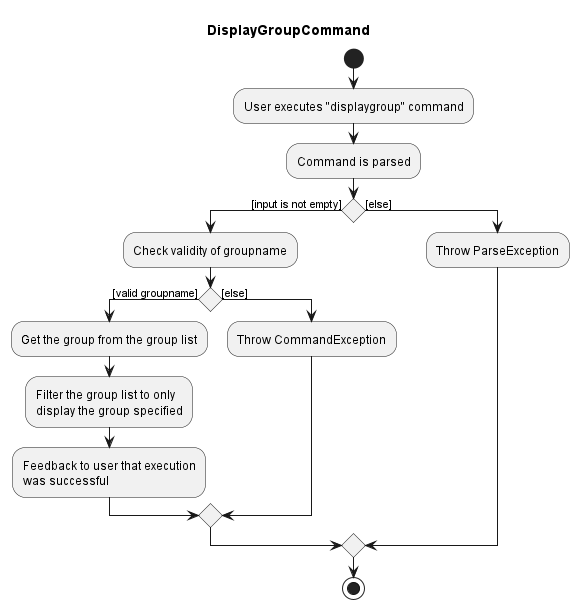
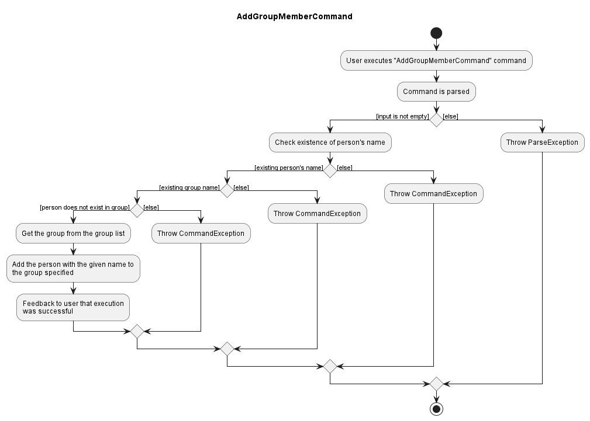
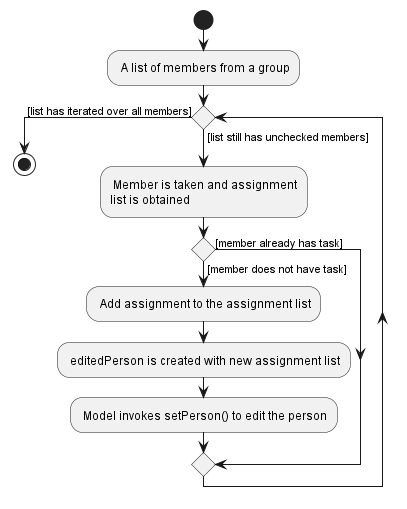

* Table of Contents
{:toc}

--------------------------------------------------------------------------------------------------------------------

## **Acknowledgements**

* {list here sources of all reused/adapted ideas, code, documentation, and third-party libraries -- include links to the original source as well}

--------------------------------------------------------------------------------------------------------------------

## **Setting up, getting started**

Refer to the guide [_Setting up and getting started_](SettingUp.md).

--------------------------------------------------------------------------------------------------------------------

## **Design**

:bulb: **Tip:** The `.puml` files used to create diagrams in this document can be found in the [diagrams](https://github.com/se-edu/addressbook-level3/tree/master/docs/diagrams/) folder. Refer to the [_PlantUML Tutorial_ at se-edu/guides](https://se-education.org/guides/tutorials/plantUml.html) to learn how to create and edit diagrams.

### Architecture

The ***Architecture Diagram*** given above explains the high-level design of the App.

Given below is a quick overview of main components and how they interact with each other.

**Main components of the architecture**

**`Main`** has two classes called [`Main`](https://github.com/se-edu/addressbook-level3/tree/master/src/main/java/seedu/address/Main.java) and [`MainApp`](https://github.com/se-edu/addressbook-level3/tree/master/src/main/java/seedu/address/MainApp.java). It is responsible for,
* At app launch: Initializes the components in the correct sequence, and connects them up with each other.
* At shut down: Shuts down the components and invokes cleanup methods where necessary.

[**`Commons`**](#common-classes) represents a collection of classes used by multiple other components.

The rest of the App consists of four components.

* [**`UI`**](#ui-component): The UI of the App.
* [**`Logic`**](#logic-component): The command executor.
* [**`Model`**](#model-component): Holds the data of the App in memory.
* [**`Storage`**](#storage-component): Reads data from, and writes data to, the hard disk.

**How the architecture components interact with each other**

The *Sequence Diagram* below shows how the components interact with each other for the scenario where the user issues the command `delete 1`.

Each of the four main components (also shown in the diagram above),

* defines its *API* in an `interface` with the same name as the Component.
* implements its functionality using a concrete `{Component Name}Manager` class (which follows the corresponding API `interface` mentioned in the previous point.

For example, the `Logic` component defines its API in the `Logic.java` interface and implements its functionality using the `LogicManager.java` class which follows the `Logic` interface. Other components interact with a given component through its interface rather than the concrete class (reason: to prevent outside component's being coupled to the implementation of a component), as illustrated in the (partial) class diagram below.

The sections below give more details of each component.

### UI component

The **API** of this component is specified in [`Ui.java`](https://github.com/se-edu/addressbook-level3/tree/master/src/main/java/seedu/address/ui/Ui.java)

The UI consists of a `MainWindow` that is made up of parts e.g.`CommandBox`, `ResultDisplay`, `PersonListPanel`, `StatusBarFooter` etc. All these, including the `MainWindow`, inherit from the abstract `UiPart` class which captures the commonalities between classes that represent parts of the visible GUI.

The `UI` component uses the JavaFx UI framework. The layout of these UI parts are defined in matching `.fxml` files that are in the `src/main/resources/view` folder. For example, the layout of the [`MainWindow`](https://github.com/se-edu/addressbook-level3/tree/master/src/main/java/seedu/address/ui/MainWindow.java) is specified in [`MainWindow.fxml`](https://github.com/se-edu/addressbook-level3/tree/master/src/main/resources/view/MainWindow.fxml)

The `UI` component,

* executes user commands using the `Logic` component.
* listens for changes to `Model` data so that the UI can be updated with the modified data.
* keeps a reference to the `Logic` component, because the `UI` relies on the `Logic` to execute commands.
* depends on some classes in the `Model` component, as it displays `Person` object residing in the `Model`.

### Logic component

**API** : [`Logic.java`](https://github.com/se-edu/addressbook-level3/tree/master/src/main/java/seedu/address/logic/Logic.java)

Here's a (partial) class diagram of the `Logic` component:

How the `Logic` component works:
1. When `Logic` is called upon to execute a command, it uses the `AddressBookParser` class to parse the user command.
1. This results in a `Command` object (more precisely, an object of one of its subclasses e.g., `AddCommand`) which is executed by the `LogicManager`.
1. The command can communicate with the `Model` when it is executed (e.g. to add a person).
1. The result of the command execution is encapsulated as a `CommandResult` object which is returned back from `Logic`.

The Sequence Diagram below illustrates the interactions within the `Logic` component for the `execute("delete 1")` API call.

:information_source: **Note:** The lifeline for `DeleteCommandParser` should end at the destroy marker (X) but due to a limitation of PlantUML, the lifeline reaches the end of diagram.

Here are the other classes in `Logic` (omitted from the class diagram above) that are used for parsing a user command:

How the parsing works:
* When called upon to parse a user command, the `AddressBookParser` class creates an `XYZCommandParser` (`XYZ` is a placeholder for the specific command name e.g., `AddCommandParser`) which uses the other classes shown above to parse the user command and create a `XYZCommand` object (e.g., `AddCommand`) which the `AddressBookParser` returns back as a `Command` object.
* All `XYZCommandParser` classes (e.g., `AddCommandParser`, `DeleteCommandParser`, ...) inherit from the `Parser` interface so that they can be treated similarly where possible e.g, during testing.

### Model component
**API** : [`Model.java`](https://github.com/se-edu/addressbook-level3/tree/master/src/main/java/seedu/address/model/Model.java)

The `Model` component,

* stores the address book data i.e., all `Person` objects (which are contained in a `UniquePersonList` object).
* stores the currently 'selected' `Person` objects (e.g., results of a search query) as a separate _filtered_ list which is exposed to outsiders as an unmodifiable `ObservableList<Person>` that can be 'observed' e.g. the UI can be bound to this list so that the UI automatically updates when the data in the list change.
* stores a `UserPref` object that represents the user’s preferences. This is exposed to the outside as a `ReadOnlyUserPref` objects.
* does not depend on any of the other three components (as the `Model` represents data entities of the domain, they should make sense on their own without depending on other components)

:information_source: **Note:** An alternative (arguably, a more OOP) model is given below. It has a `Tag` list in the `AddressBook`, which `Person` references. This allows `AddressBook` to only require one `Tag` object per unique tag, instead of each `Person` needing their own `Tag` objects. 

### Storage component

**API** : [`Storage.java`](https://github.com/se-edu/addressbook-level3/tree/master/src/main/java/seedu/address/storage/Storage.java)

The `Storage` component,
* can save both address book data and user preference data in json format, and read them back into corresponding objects.
* inherits from both `AddressBookStorage` and `UserPrefStorage`, which means it can be treated as either one (if only the functionality of only one is needed).
* depends on some classes in the `Model` component (because the `Storage` component's job is to save/retrieve objects that belong to the `Model`)

### Common classes

Classes used by multiple components are in the `seedu.addressbook.commons` package.

--------------------------------------------------------------------------------------------------------------------
## **Implementation**

This section describes some noteworthy details on how certain features are implemented.

### **\[Developed\] Display Group feature**

#### **Implementation**

This feature allows an existing group with its members to be displayed, using the `displaygroup` command. This is facilitated by the `DisplayGroupCommand` and `DisplayGroupCommandParser` classes.

The `DisplayGroupCommandParser` class parses the input entered by the user, which is the group name the user wants to display.

The validity of the group name input by the user will be checked with the help of the `FullGroupNamePredicate` class.

- `FullGroupNamePredicate#test(group)` Tests if the name of a group in the list of groups stored matches the input given by the user.

If the group name is valid, the specified group will be displayed with the help of `Model#updateFilteredGroupList(predicate)`.

Given below is an example of how `DisplayGroupCommand` is being executed.

**Steps**

Step 1. The user enters `displaygroup [NAME OF GROUP]` command

Step 2. The  `DisplayGroupCommandParser` class parses the group name input and returns a `DisplayGroupCommand` object with a single `FullGroupNamePredicate` attribute, encapsulating the input group name.

Step 3. The `DisplayGroupCommand` object is executed. `FullGroupNamePredicate#test(group)` will be called to check against all the groups which are already present in TABS. These existing groups can be retrived by calling `ObservableList#get()` method.

Step 4. If an existing group in TABS has name which matches exactly the name given by the user, then `Model#updateFilteredGroupList(predicate)` will be called, and this will display the group as specified.

Step 5. CommandResult is then returned, which provides a feedback to user that the specified group has been successfully
displayed.

**Activity Diagram**

The user flow can be illustrated in the Activity Diagram as shown below.

-------

### **\[Developed\] Delete Group feature**

#### **Implementation**

This feature allows an existing group to be deleted from TABS, using the `deletegroup` command. Tasks assigned to the
members will be deleted and existing members will be removed from the specified group. This is facilitated by the `DeleteGroupCommand` and `DeleteGroupCommandParser` classes.

The `DeleteGroupCommandParser` class parses the input entered by the user, which is the group name the user wants to delete from TABS.

The details of the members in the specified group will be updated as such:
- Each member will have their assignments associated with the group removed.
- Each member will be updated such that they are no longer associated with the target group.
- Other details of the members will remain the same.

A new `Person` with the edited fields above is created for each member, and `Model#setPerson()` will be called to update in TABS.

`Model#deleteGroup(GroupName)` is called to remove the group from TABS, and `Model#updateFilteredPersonList(Predicate)` is called to display the new result in the GUI after deletion.

**Steps**

Step 1. The user enters `deletegroup [NAME OF GROUP]` command

Step 2. The `DeleteGroupCommandParser` class parses the group name input and returns a `DeleteGroupCommand` object with a single `Group` attribute.

Step 3. The `DisplayGroupCommand` object is executed. This group can be retrieved by calling `ObservableList#getGroupWithName()` method.

Step 4. If no groups show up in the ObservableList, a CommandException is thrown where the group is not found in TABS. Otherwise, members of the group are retrieved with the `getMembers()` method in `Group` class.

Step 5. For each member, `getAssignments()` and `getPersonGroups` methods from `Person` class are called to aid in removal of the tasks and associated group.

Step 6. A new Person object is created with the edited fields and `Model#setPerson(Person)` is called to update the new details for each member, with the new `editedPerson` passed in as an argument.

Step 7. The `Group` invoked is deleted from TABS. A CommandResult is then returned, which provides a feedback to user that the specified group has been successfully deleted.

**Activity Diagram**

The user flow can be illustrated in the Activity Diagram as shown below.

**Sequence Diagram**

The sequence diagram for DeleteGroup command is as shown below.

----------------------------

### **\[Developed\] Add Group Member feature**

#### **Implementation**

This feature allows an existing group with its members to be displayed, using the `addgroupmember` command. This is facilitated by the `AddGroupMemberCommand` and `AddGroupMemberCommandParser` classes.

The `AddGroupMemberCommandParser` class parses the input entered by the user, which consists of the person's name and the group's name.
The person with the given name will then be added to the group with the given name. 

The validity of the group name and person name input by the user will be checked with the help of an ObservableList for each field.

`AddGroupMemberCommand` will also check if the person already exits in the specified group.

If the both person and group names are valid, the specified person will be added to the group.

Given below is an example of how `AddGroupMemberCommand` is being executed.

**Steps**

Step 1. The user enters `addmember [g/NAME OF GROUP] [n/ NAME OF PERSON]` command

Step 2. The  `AddGroupMemberCommandParser` class parses the group name input and returns a `AddGroupMemberCommand` object with two attributes in two strings.

Step 3. The `AddGroupMemberCommand` object is executed. The person and group
can be obtained by calling the `ObservableList#get()` method on each field should they exist.

Step 4. If an existing person in TABS has a name which matches exactly the name given by the user
, then TABS will check for the group's existence.

Step 5. If an existing group in TABS has a name which matches exactly the name given by the user, then TABS will check if the person already exists in the group. 

Step 6. If the person does not yet exist in the group,
then the person will be added to the specified group.

Step 7. CommandResult is then returned, which provides a feedback to user that the specified person has been successfully
added to the specified group.

**Activity Diagram**

The user flow can be illustrated in the Activity Diagram as shown below.

----

### **\[Developed\] Assign Task feature**

#### **Implementation**

This feature allows the user to assign task to a member in an existing group, using the `assigntask` command. This is facilitated by the `AssignTaskCommand` and `AssignTaskCommandParser` classes.

The `AssignTaskCommandParser` class parses the input entered by the user, which are the username, the group name, and the task name that the user wants to assign.

The validity of the group name and person name input by the user will be checked with the help of an ObservableList for each field.

`AssignTaskCommandParser` will also check if the person exists in the specified group.

The task name should not be empty.

If all the inputs are valid, the specified task will be assigned to the specified user in a specified group with the help of `Model#setPerson`.

The specified task will then be displayed under that user with the help of `Model#updateFilteredPersonList(predicate)`.

Given below is an example of how `AssignTaskCommand` is being executed.

**Steps**

Step 1. The user enters `assigntask [NAME OF GROUP]` command

Step 2. The  `AssignTaskCommandParser` class parses the group name input and returns a `AssignTaskCommand` object, encapsulating the user, group name and task.

Step 3. The `AssignTaskCommand` object is executed. If the user and group exists in the application, the existing user and group can be retrieved by calling `ObservableList#get()` method.

Step 4. The assigned task will be added to the specified user under that specified group.

Step 5. CommandResult is then returned, which provides a feedback to user that the task has been assigned to the specified user.

**Activity Diagram**

The user flow of Assign Task can be illustrated in the Activity Diagram as shown below.

----

### **\[Developed\] Bulk Assignment & Deletion of Tasks**
All members in a group can be assigned a task via the `assigntaskall` command,
and similarly deleted via the `deletetaskall` command. The commands accept a group
to affect, and the task to be added or deleted. In any cases where a member
will have a duplicate task upon assignment/does not have the task to delete, they
are skipped over.

Below is an activity diagram reflecting the operation of the `assigntaskall` command.
`deletetaskall` operates similarly.

#### Implementation Details
1. User input is parsed in the context of `assigntaskall` and `deletetaskall` commands
   using the `AssignTaskAllCommandParser` and `DeleteTaskAllCommandParser` respectively.
   Erroneous inputs trigger a ParseException indicating to the user of invalid input.
2. The correct command is then generated and executed. During execution, several
   conditions are checked to ensure proper operation of the instruction, failing which
   the user is notified. These are:
  1. The group specified exists in the app;
  2. The group has members to operate on, and;
  3. At least one member is modified following the instruction.
3. The instruction iterates over each member and assigns/deletes the task respectively.
   As mentioned prior, members which already have/do not have the task respectively are
   skipped over.
4. The model is invoked to update its displayed person list.
5. Successfully modified members are told to user via feedback.

#### Implementation Rationale
The above-mentioned flow follows closely with pre-existing instruction `edit`.
In doing so, some rationales are carried forward:
1. Follows in line with other commands by having an "XYZParser", in this case
   `AssignTaskAllCommandParser` and `DeleteTaskAllCommandParser` respectively, which
   return an executable command to be executed by the `Logic` (and by extension `Model`)
   class.
2. Upon execution, performs several checks which upon failure throw CommandExceptions
   to indicate to the user when the command is not successful.
3. Modification of each person by adding/deleting assignment follows that of `edit`
   in that the given Person is treated as immutable, and an edited copy is created before
   `Model` is invoked to set the Person, thus adhering to defensive programming standards
   previously established.

----

### **\[Proposed\] Undo/redo feature**

#### **Proposed Implementation**

The proposed undo/redo mechanism is facilitated by `VersionedAddressBook`. It extends `AddressBook` with an undo/redo history, stored internally as an `addressBookStateList` and `currentStatePointer`. Additionally, it implements the following operations:

* `VersionedAddressBook#commit()` — Saves the current address book state in its history.
* `VersionedAddressBook#undo()` — Restores the previous address book state from its history.
* `VersionedAddressBook#redo()` — Restores a previously undone address book state from its history.

These operations are exposed in the `Model` interface as `Model#commitAddressBook()`, `Model#undoAddressBook()` and `Model#redoAddressBook()` respectively.

Given below is an example usage scenario and how the undo/redo mechanism behaves at each step.

Step 1. The user launches the application for the first time. The `VersionedAddressBook` will be initialized with the initial address book state, and the `currentStatePointer` pointing to that single address book state.

Step 2. The user executes `delete 5` command to delete the 5th person in the address book. The `delete` command calls `Model#commitAddressBook()`, causing the modified state of the address book after the `delete 5` command executes to be saved in the `addressBookStateList`, and the `currentStatePointer` is shifted to the newly inserted address book state.

Step 3. The user executes `add n/David …​` to add a new person. The `add` command also calls `Model#commitAddressBook()`, causing another modified address book state to be saved into the `addressBookStateList`.

:information_source: **Note:** If a command fails its execution, it will not call `Model#commitAddressBook()`, so the address book state will not be saved into the `addressBookStateList`.

Step 4. The user now decides that adding the person was a mistake, and decides to undo that action by executing the `undo` command. The `undo` command will call `Model#undoAddressBook()`, which will shift the `currentStatePointer` once to the left, pointing it to the previous address book state, and restores the address book to that state.

:information_source: **Note:** If the `currentStatePointer` is at index 0, pointing to the initial AddressBook state, then there are no previous AddressBook states to restore. The `undo` command uses `Model#canUndoAddressBook()` to check if this is the case. If so, it will return an error to the user rather
than attempting to perform the undo.

The following sequence diagram shows how the undo operation works:

:information_source: **Note:** The lifeline for `UndoCommand` should end at the destroy marker (X) but due to a limitation of PlantUML, the lifeline reaches the end of diagram.

The `redo` command does the opposite — it calls `Model#redoAddressBook()`, which shifts the `currentStatePointer` once to the right, pointing to the previously undone state, and restores the address book to that state.

:information_source: **Note:** If the `currentStatePointer` is at index `addressBookStateList.size() - 1`, pointing to the latest address book state, then there are no undone AddressBook states to restore. The `redo` command uses `Model#canRedoAddressBook()` to check if this is the case. If so, it will return an error to the user rather than attempting to perform the redo.

Step 5. The user then decides to execute the command `list`. Commands that do not modify the address book, such as `list`, will usually not call `Model#commitAddressBook()`, `Model#undoAddressBook()` or `Model#redoAddressBook()`. Thus, the `addressBookStateList` remains unchanged.

Step 6. The user executes `clear`, which calls `Model#commitAddressBook()`. Since the `currentStatePointer` is not pointing at the end of the `addressBookStateList`, all address book states after the `currentStatePointer` will be purged. Reason: It no longer makes sense to redo the `add n/David …​` command. This is the behavior that most modern desktop applications follow.

The following activity diagram summarizes what happens when a user executes a new command:

#### Design considerations:

**Aspect: How undo & redo executes:**

* **Alternative 1 (current choice):** Saves the entire address book.
  * Pros: Easy to implement.
  * Cons: May have performance issues in terms of memory usage.

* **Alternative 2:** Individual command knows how to undo/redo by
  itself.
  * Pros: Will use less memory (e.g. for `delete`, just save the person being deleted).
  * Cons: We must ensure that the implementation of each individual command are correct.

_{more aspects and alternatives to be added}_

### \[Proposed\] Data archiving

_{Explain here how the data archiving feature will be implemented}_

--------------------------------------------------------------------------------------------------------------------

## **Documentation, logging, testing, configuration, dev-ops**

* [Documentation guide](Documentation.md)
* [Testing guide](Testing.md)
* [Logging guide](Logging.md)
* [Configuration guide](Configuration.md)
* [DevOps guide](DevOps.md)

--------------------------------------------------------------------------------------------------------------------
## **Appendix: Requirements**
### Product scope
**Target user profile**:
Project team leaders with many projects, members and tasks to assign.

**Value proposition**:
* view information of which group members are in their project.
* track which tasks have been assigned to which members.
* see an estimate of how much workload each member has.
* receive information regarding upcoming deadlines.

### User stories

#### Priorities:
- High (must have) &nbsp;&nbsp;&nbsp;&nbsp;&nbsp;&nbsp;&nbsp;&nbsp;- `* * *`
- Medium (nice to have) - `* *`
- Low (unlikely to have) &nbsp;- `*`

| Priority | As a ...          | I want to ...                                                                  | So that I can ...                                                                      |
|:---------|:------------------|:-------------------------------------------------------------------------------|:---------------------------------------------------------------------------------------|
| `* * * ` | beginner user     | see usage instructions                                                         | refer to instructions when I forget how to use the App                                 |
| `* * *`  | beginner user     | add contacts to my app                                                         |                                                                                        |
| `* * *`  | beginner user     | remove existing contacts on my app                                             | remove entries that I no longer need                                                   |
| `* * *`  | beginner user     | create a group                                                                 |                                                                                        |
| `* * *`  | beginner user     | add members to a group                                                         |                                                                                        |
| `* *`    | intermediate user | locate a particular contact                                                    | quickly find a member                                                                  |
| `* *`    | intermediate user | have a quick overview of all my groups with their existing members             |                                                                                        |
| `* * *`  | intermediate user | assign tasks to members                                                        |                                                                                        |
| `* *`    | intermediate user | have a quick overview of tasks assigned to members in the group                |                                                                                        |
| `* *`    | intermediate user | create a tag specific to the group project                                     | quickly assign tags to members                                                         |
| `* *`    | intermediate user | place tags on group members                                                    | better identify their role                                                             |
| `* *`    | intermediate user | assign multiple tags to a user if needed                                       | identify their roles more specifically                                                 |
| `* *`    | intermediate user | filter and search for groups                                                   | quickly identify the one in particular                                                 |
| `* *`    | advanced user     | view deadlines for each project                                                | periodically use this for self-reminder                                                |
| `* *`    | advanced user     | have a rough sense of the workload of every member in the group                | assign future tasks with more confidence                                               |
| `*`      | advanced user     | view a member’s tasks in more detail                                           | assign future tasks to them with more confidence                                       |
| `* * *`  | advanced user     | add more tasks to a member                                                     |                                                                                        |
| `* * *`  | advanced user     | delete tasks from a member                                                     |                                                                                        |
| `*`      | advanced user     | categorise the tasks assigned into different levels of intensity               | not judge workload based solely on the number of tasks per member                      |
| `* * *`  | advanced user     | delete unused groups after the project is completed                            | declutter my app                                                                       |
| `* * *`  | advanced user     | delete existing tags if they are no longer relevant                            | declutter my app                                                                       |
| `*`      | advanced user     | reuse existing tags in groups for future projects                              | establish new projects under my management style                                       |
| `*`      | advanced user     | move tags and assignments from one user to another easily                      | ensure that members can ‘swap’ roles hassle-free                                       |
| `* *`    | expert user       | perform group-wide addition of tags and assignments                            | ensure that repetitive new assignments are made as quickly and accurately as possible. |
| `* *`    | expert user       | perform group-wide removal of tags and assignments                             | ensure that group members’ roles are quickly cleared owing to new demands              |
| `*`      | expert user       | be notified when a member completes his task or when a deadline is approaching | better manage my time                                                                  |
| `*`      | expert user       | create shortcuts and pin most important projects on the top of the app         | access these projects faster                                                           |
| `*`      | expert user       | have the choice of deleting users from the app when a project completes        | quickly declutter my app                                                               |
| `*`      | expert user       | set timers to add/delete groups after a project ends                           | ensure that I do not have too many groups cluttering the database                      |

---
## Use cases 

For all use cases below, the **System** is TABS and the **Actor** is the user, unless specified otherwise.

### UC1: Help

**MSS**

1. User indicates they want help.
2. TABS Displays UG link.

&nbsp;&nbsp;
Use case ends.

### UC2: Add a person

**MSS**

1. User requests add a person.
2. TABS display that person is successfully added.

&nbsp;&nbsp;
Use case ends.

**Extensions:**

&nbsp;&nbsp;
1a. The contact already exists in TABS.

&nbsp;&nbsp;&nbsp;&nbsp;&nbsp;&nbsp;&nbsp;&nbsp;
1a1. TABS displays that the person already exists in the program.

&nbsp;&nbsp;
Use case ends.

### UC3: Edit a person’s details

**MSS**

1. User requests to edit an existing contact.
2. TABS displays the modified contact.

&nbsp;&nbsp;
Use case ends.

**Extensions:**

&nbsp;&nbsp;
1a. The contact specified is not found in TABS.

&nbsp;&nbsp;&nbsp;&nbsp;&nbsp;&nbsp;&nbsp;&nbsp;
1a1. TABS terminates the operation by the user and displays error messages.

&nbsp;&nbsp;
Use case ends.

### UC4: Find a person

**MSS**

1. User requests to find an existing contact.
2. TABS displays the contacts found.

&nbsp;&nbsp;
Use case ends.

**Extensions**

&nbsp;&nbsp;
2a. The list is empty.

&nbsp;&nbsp;
Use case ends.

### UC5: Delete a person

**MSS**

1. User requests to delete an existing contact.
2. TABS displays that the contact is successfully deleted.

&nbsp;&nbsp;
Use case ends.

**Extensions:**

&nbsp;&nbsp;
1a. The contact specified is not found in TABS.

&nbsp;&nbsp;&nbsp;&nbsp;&nbsp;&nbsp;&nbsp;&nbsp;
1a1. TABS terminates the operation by the user and indicates error messages.

&nbsp;&nbsp;
Use case ends.

### UC6: Add a group

**MSS**

1. User requests add a group.
2. TABS displays the added group.

&nbsp;&nbsp;
Use case ends.

**Extensions:**

&nbsp;&nbsp;
1a. The group already exists in TABS.

&nbsp;&nbsp;&nbsp;&nbsp;&nbsp;&nbsp;&nbsp;&nbsp;
1a1. TABS displays that the group already exists inside TABS.

&nbsp;&nbsp;
Use case ends.

### UC7: Display a group

**MSS**

1. User requests to display an existing group.
2. TABS displays the group with its members.

&nbsp;&nbsp;
Use case ends.

**Extensions:**

&nbsp;&nbsp;
1a. The group specified is not found in TABS.

&nbsp;&nbsp;&nbsp;&nbsp;&nbsp;&nbsp;&nbsp;&nbsp;
1a1. TABS terminates the operation by the user and displays error messages.

&nbsp;&nbsp;
Use case ends.

### UC8: Find a group

**MSS**

1. User requests to find an existing group.
2. TABS displays the groups found.

&nbsp;&nbsp;
Use case ends.

**Extensions:**

&nbsp;&nbsp;
2a. The list is empty.

&nbsp;&nbsp;
Use case ends.

### UC9: Delete a group

**MSS**

1. User requests to delete an existing group.
2. TABS displays that the group is successfully deleted.

&nbsp;&nbsp;
Use case ends.

**Extensions:**

&nbsp;&nbsp;
1a. The contact specified is not found in TABS.

&nbsp;&nbsp;&nbsp;&nbsp;&nbsp;&nbsp;&nbsp;&nbsp;
1a1. TABS terminates the operation by the user.

&nbsp;&nbsp;
Use case ends.

### UC10: Add a person to group

**MSS**

1. User requests to add an existing contact to an existing group.
2. TABS displays that the contact specified is added to the group.

&nbsp;&nbsp;
Use case ends.

**Extensions:**

&nbsp;&nbsp;
1a. The contact specified is not found in TABS.

&nbsp;&nbsp;&nbsp;&nbsp;&nbsp;&nbsp;&nbsp;&nbsp;
1a1. TABS terminates the operation by the user.

&nbsp;&nbsp;
Use case ends.

&nbsp;&nbsp;
1b. The group specified is not found in TABS.

&nbsp;&nbsp;&nbsp;&nbsp;&nbsp;&nbsp;&nbsp;&nbsp;
1b1. TABS terminates the operation by the user.

&nbsp;&nbsp;
Use case ends.

### UC11: Remove a person from group

**MSS**

1. User requests to remove an existing contact from an existing group.
2. TABS displays that the contact specified is removed from the group.

&nbsp;&nbsp;
Use case ends.

**Extensions:**

&nbsp;&nbsp;
1a. The contact specified is not found in TABS.

&nbsp;&nbsp;&nbsp;&nbsp;&nbsp;&nbsp;&nbsp;&nbsp;
1a1. TABS terminates the operation by the user.

&nbsp;&nbsp;
Use case ends.

&nbsp;&nbsp;
1b. The group specified is not found in TABS.

&nbsp;&nbsp;&nbsp;&nbsp;&nbsp;&nbsp;&nbsp;&nbsp;
1b1. TABS terminates the operation by the user.

&nbsp;&nbsp;
Use case ends.

### UC12: Assign a task to a member

**MSS**

1. User requests to assign a task.
2. TABS displays that the task is tagged to the person specified under the group.

&nbsp;&nbsp;
Use case ends.

**Extensions:**

&nbsp;&nbsp;
1a. The contact specified is not found in TABS.

&nbsp;&nbsp;&nbsp;&nbsp;&nbsp;&nbsp;&nbsp;&nbsp;
1a1. TABS terminates the operation by the user.

&nbsp;&nbsp;
Use case ends.

&nbsp;&nbsp;
1b. The group specified is not found in TABS.

&nbsp;&nbsp;&nbsp;&nbsp;&nbsp;&nbsp;&nbsp;&nbsp;
1b1. TABS terminates the operation by the user.

&nbsp;&nbsp;
Use case ends.

### UC13: Remove a task from a person

**MSS**

1. User requests to remove a task from a person.
2. TABS displays that the task is successfully removed.

&nbsp;&nbsp;
Use case ends.

**Extensions:**

&nbsp;&nbsp;
2a. The person specified is not found in TABS.

&nbsp;&nbsp;&nbsp;&nbsp;&nbsp;&nbsp;&nbsp;&nbsp;
2a1. TABS terminates the operation by the user.

&nbsp;&nbsp;
Use case ends.

&nbsp;&nbsp;
3a. The person does not have the specified task.

&nbsp;&nbsp;&nbsp;&nbsp;&nbsp;&nbsp;&nbsp;&nbsp;
3a1. TABS terminates the operation by the user.

&nbsp;&nbsp;
Use case ends.

### UC14: Assign a tag to a person

**MSS**

1. User requests to assign a tag to a person in TABS.
2. TABS displays that the tag is added to the person specified.

&nbsp;&nbsp;
Use case ends.

**Extensions:**

&nbsp;&nbsp;
1a. The contact specified is not found in TABS.

&nbsp;&nbsp;&nbsp;&nbsp;&nbsp;&nbsp;&nbsp;&nbsp;
1a1. TABS terminates the operation by the user.

&nbsp;&nbsp;
Use case ends.

### UC15: Remove a tag from a person

**MSS**

1. User requests to remove a tag from a person.
2. TABS displays that the tag is successfully removed.

&nbsp;&nbsp;
Use case ends.

**Extensions:**

&nbsp;&nbsp;
1a. The person specified is not found in TABS.

&nbsp;&nbsp;&nbsp;&nbsp;&nbsp;&nbsp;&nbsp;&nbsp;
1a1. TABS terminates the operation by the user.

&nbsp;&nbsp;
Use case ends.

&nbsp;&nbsp;
1a. The person does not have the specified tag.

&nbsp;&nbsp;&nbsp;&nbsp;&nbsp;&nbsp;&nbsp;&nbsp;
1a1. TABS terminates the operation by the user.

&nbsp;&nbsp;
Use case ends.

### UC16: Group assignment of task

**MSS**

1. User requests to add a task to a group.
2. TABS displays that the task is successfully added.

&nbsp;&nbsp;
Use case ends.

**Extensions:**

&nbsp;&nbsp;
1a. The group specified is not found in TABS.

&nbsp;&nbsp;&nbsp;&nbsp;&nbsp;&nbsp;&nbsp;&nbsp;
1a1. TABS terminates the operation by the user.

&nbsp;&nbsp;
Use case ends.

### UC17: Group removal of task

**MSS**

1. User requests to remove a task from a group.
2. TABS displays that the task is successfully removed.

&nbsp;&nbsp;
Use case ends.

**Extensions:**

&nbsp;&nbsp;
1a. The group specified is not found in TABS.

&nbsp;&nbsp;&nbsp;&nbsp;&nbsp;&nbsp;&nbsp;&nbsp;
1a1. TABS terminates the operation by the user.

&nbsp;&nbsp;
Use case ends.

&nbsp;&nbsp;
1a. The person does not have the specified task.

&nbsp;&nbsp;&nbsp;&nbsp;&nbsp;&nbsp;&nbsp;&nbsp;
1a1. TABS moves on to the next person in the group.

&nbsp;&nbsp;
Use case ends.

### UC18: Group assignment of tag

**MSS**

1. User requests to add a tag to a group.
2. TABS displays that the tag is successfully added.

&nbsp;&nbsp;
Use case ends.

Extensions:

&nbsp;&nbsp;
1a. The group specified is not found in TABS.

&nbsp;&nbsp;&nbsp;&nbsp;&nbsp;&nbsp;&nbsp;&nbsp;
1a1. TABS terminates the operation by the user.

&nbsp;&nbsp;
Use case ends.

### UC19: Group removal of tag

**MSS**

1. User requests to remove a tag from a group.
2. TABS displays that the tag is successfully removed.

&nbsp;&nbsp;
Use case ends.

**Extensions:**

&nbsp;&nbsp;
1a. The group specified is not found in TABS.

&nbsp;&nbsp;&nbsp;&nbsp;&nbsp;&nbsp;&nbsp;&nbsp;
1a1. TABS terminates the operation by the user.

&nbsp;&nbsp;
Use case ends.

&nbsp;&nbsp;
1a. The person does not have the specified tag.

&nbsp;&nbsp;&nbsp;&nbsp;&nbsp;&nbsp;&nbsp;&nbsp;
1a1. TABS moves on to the next person in the group.

&nbsp;&nbsp;
Use case ends.

### UC20: Notifications

**MSS**

1. User boots up the application/requests for notifications.
2. TABS provides notifications on upcoming deadlines/completed tasks.

&nbsp;&nbsp;
Use case ends.

**Extensions:**

&nbsp;&nbsp;
1a. List is empty.

&nbsp;&nbsp;
Use case ends.

---
## Non-functional requirements

1. Should work on any **mainstream** OS (Windows, Linux, Unix, OS-X) as long as it has `Java 11` or above installed.
2. Should be able to hold up to 500 persons and/or 10 groups without noticeable sluggishness in performance.
3. Bulk assignments/removals should be able to handle up to 20 persons without noticeable sluggishness in performance.
4. Workload indicators, if using colours, should be easily distinguishable.
5. Content should be saved to a save file that can be opened and edited with mainstream text editors e.g. Notepad.
