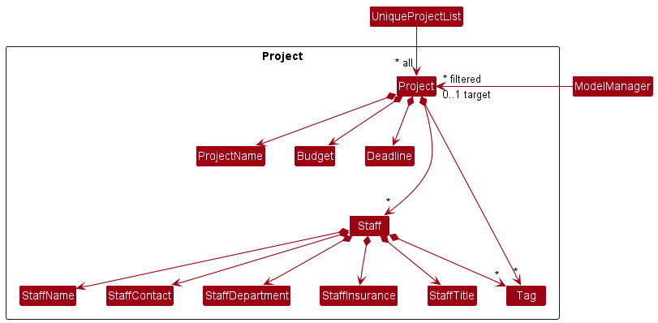
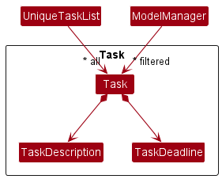
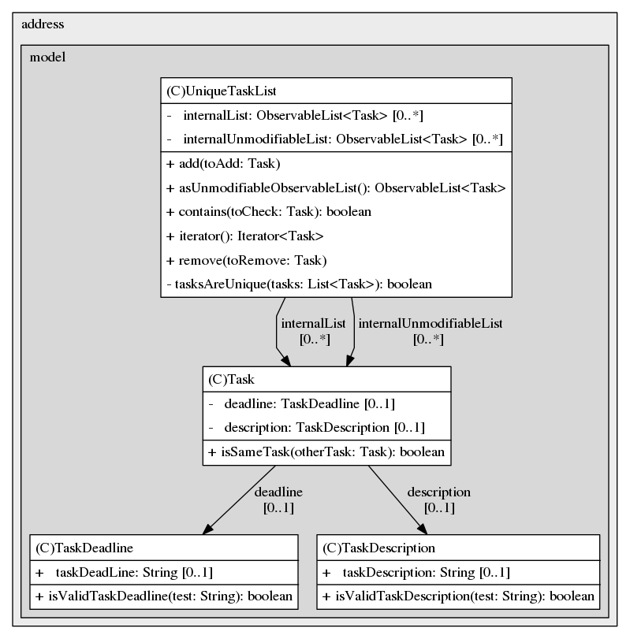
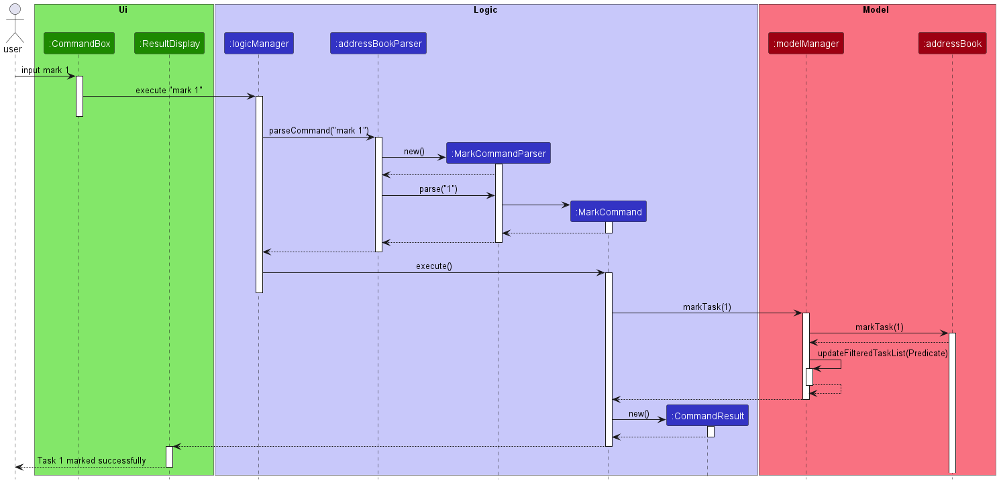
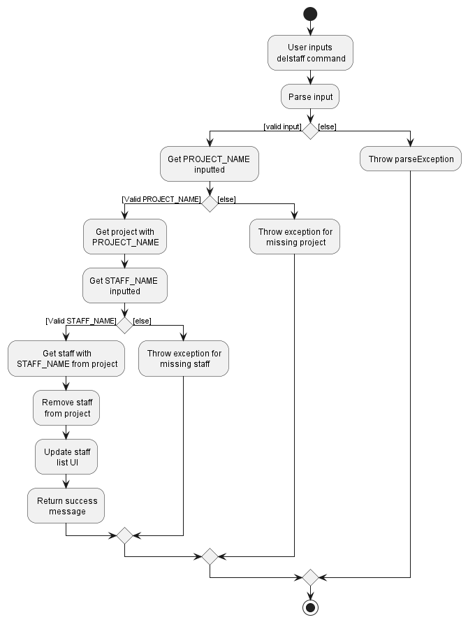

* Table of Contents
{:toc}

--------------------------------------------------------------------------------------------------------------------

## **Acknowledgements**

* {list here sources of all reused/adapted ideas, code, documentation, and third-party libraries -- include links to the original source as well}

--------------------------------------------------------------------------------------------------------------------

## **Setting up, getting started**

Refer to the guide [_Setting up and getting started_](SettingUp.md).

--------------------------------------------------------------------------------------------------------------------

## **Design**

<div markdown="span" class="alert alert-primary">

:bulb: **Tip:** The `.puml` files used to create diagrams in this document can be found in the [diagrams](https://github.com/se-edu/addressbook-level3/tree/master/docs/diagrams/) folder. Refer to the [_PlantUML Tutorial_ at se-edu/guides](https://se-education.org/guides/tutorials/plantUml.html) to learn how to create and edit diagrams.
</div>

### Architecture


The ***Architecture Diagram*** given above explains the high-level design of the App.

Given below is a quick overview of main components and how they interact with each other.

**Main components of the architecture**

**`Main`** has two classes called [`Main`](https://github.com/se-edu/addressbook-level3/tree/master/src/main/java/seedu/address/Main.java) and [`MainApp`](https://github.com/se-edu/addressbook-level3/tree/master/src/main/java/seedu/address/MainApp.java). It is responsible for,
* At app launch: Initializes the components in the correct sequence, and connects them up with each other.
* At shut down: Shuts down the components and invokes cleanup methods where necessary.

[**`Commons`**](#common-classes) represents a collection of classes used by multiple other components.

The rest of the App consists of four components.

* [**`UI`**](#ui-component): The UI of the App.
* [**`Logic`**](#logic-component): The command executor.
* [**`Model`**](#model-component): Holds the data of the App in memory.
* [**`Storage`**](#storage-component): Reads data from, and writes data to, the hard disk.


**How the architecture components interact with each other**

The *Sequence Diagram* below shows how the components interact with each other for the scenario where the user issues the command `delproj 1`.


Each of the four main components (also shown in the diagram above),

* defines its *API* in an `interface` with the same name as the Component.
* implements its functionality using a concrete `{Component Name}Manager` class (which follows the corresponding API `interface` mentioned in the previous point.

For example, the `Logic` component defines its API in the `Logic.java` interface and implements its functionality using the `LogicManager.java` class which follows the `Logic` interface. Other components interact with a given component through its interface rather than the concrete class (reason: to prevent outside component's being coupled to the implementation of a component), as illustrated in the (partial) class diagram below.


The sections below give more details of each component.

### UI component

The **API** of this component is specified in [`Ui.java`](https://github.com/se-edu/addressbook-level3/tree/master/src/main/java/seedu/address/ui/Ui.java)


The UI consists of a `MainWindow` that is made up of parts e.g.`CommandBox`, `ResultDisplay`, `ProjectListPanel`, `StaffListPanel`, `TaskListPanel`, `StatusBarFooter` etc. All these, including the `MainWindow`, inherit from the abstract `UiPart` class which captures the commonalities between classes that represent parts of the visible GUI.

The `UI` component uses the JavaFx UI framework. The layout of these UI parts are defined in matching `.fxml` files that are in the `src/main/resources/view` folder. For example, the layout of the [`MainWindow`](https://github.com/se-edu/addressbook-level3/tree/master/src/main/java/seedu/address/ui/MainWindow.java) is specified in [`MainWindow.fxml`](https://github.com/se-edu/addressbook-level3/tree/master/src/main/resources/view/MainWindow.fxml)

The `UI` component,

* executes user commands using the `Logic` component.
* listens for changes to `Model` data so that the UI can be updated with the modified data.
* keeps a reference to the `Logic` component, because the `UI` relies on the `Logic` to execute commands.
* depends on some classes in the `Model` component, as it displays `Person` object residing in the `Model`.

### Current implementation
The GUI reflects the entered projects, tasks, and staff members recorded in HR Pro Max++.
There are 3 main columns, which from left to right are for `Task`, `Project` and `Staff` from model.
Directly adding or removing `Project`, `Task`, or `Staff` would update the `ProjectListPanel`, `TaskListPanel` and `StaffListPanel` to show their respective `ProjectCard`, `StaffCard` and `TaskCard` respectively.
Each of the `ProjectCard`, `StaffCard` and `TaskCard` would display the fields under the corresponding `Project`, `Staff` and `Task` objects as discussed under [Model Component](#model-component).


### Logic component

**API** : [`Logic.java`](https://github.com/se-edu/addressbook-level3/tree/master/src/main/java/seedu/address/logic/Logic.java)

Here's a (partial) class diagram of the `Logic` component:


How the `Logic` component works:
1. When `Logic` is called upon to execute a command, it uses the `AddressBookParser` class to parse the user command.
1. This results in a `Command` object (more precisely, an object of one of its subclasses e.g., `AddCommand`) which is executed by the `LogicManager`.
1. The command can communicate with the `Model` when it is executed (e.g. to add a person).
1. The result of the command execution is encapsulated as a `CommandResult` object which is returned back from `Logic`.

The Sequence Diagram below illustrates the interactions within the `Logic` component for the `execute("delete 1")` API call.


<div markdown="span" class="alert alert-info">:information_source: **Note:** The lifeline for `DeleteCommandParser` should end at the destroy marker (X) but due to a limitation of PlantUML, the lifeline reaches the end of diagram.
</div>

Here are the other classes in `Logic` (omitted from the class diagram above) that are used for parsing a user command:


How the parsing works:
* When called upon to parse a user command, the `AddressBookParser` class creates an `XYZCommandParser` (`XYZ` is a placeholder for the specific command name e.g., `AddCommandParser`) which uses the other classes shown above to parse the user command and create a `XYZCommand` object (e.g., `AddCommand`) which the `AddressBookParser` returns back as a `Command` object.
* All `XYZCommandParser` classes (e.g., `AddCommandParser`, `DeleteCommandParser`, ...) inherit from the `Parser` interface so that they can be treated similarly where possible e.g, during testing.

### Model component
**API** : [`Model.java`](https://github.com/AY2223S1-CS2103T-T09-3/tp/blob/master/src/main/java/seedu/address/model/Model.java)


The `Model` component,

* stores the address book data consisting of all `Project` objects (which are contained in a `UniqueProjectList` object) and all `Task` objects (which are contained in a `UniqueTaskList` object).
* stores the currently 'selected' `Project` objects and `Task` objects  (e.g., results of a search query) as a separate _filtered_ list which is exposed to outsiders as an unmodifiable `ObservableList<Project>` or `ObservableList<Task>` that can be 'observed' e.g. the UI can be bound to this list so that the UI automatically updates when the data in the list change.
* stores a `UserPref` object that represents the user’s preferences. This is exposed to the outside as a `ReadOnlyUserPref` objects.
* does not depend on any of the other three components (as the `Model` represents data entities of the domain, they should make sense on their own without depending on other components)


**API** : [`Project.java`](https://github.com/AY2223S1-CS2103T-T09-3/tp/blob/master/src/main/java/seedu/address/model/project/Project.java)



The `Project` class,

* stores the details of a particular project (i.e. `ProjectName`, `Budget`, `Deadline`).
* stores the details of all Staff members (which are contained in a `UniqueStaffList` object) working on the project.
* at most one of this `Project` object (e.g., result of a view query) is stored in a separate _target_ list whose `UniqueStaffList` will be shown to outsiders e.g. the UI can be bound to this list so that the UI automatically updates when the data in this list changes.


**API** : [`Task.java`](https://github.com/AY2223S1-CS2103T-T09-3/tp/blob/master/src/main/java/seedu/address/model/task/Task.java)



The `Task` class,

* stores the details of a particular task (i.e. `TaskDescription`, `TaskDeadline`).

### Storage component

**API** : [`Storage.java`](https://github.com/se-edu/addressbook-level3/tree/master/src/main/java/seedu/address/storage/Storage.java)


The `Storage` component,
* can save both address book data and user preference data in json format, and read them back into corresponding objects.
* inherits from both `AddressBookStorage` and `UserPrefStorage`, which means it can be treated as either one (if only the functionality of only one is needed).
* depends on some classes in the `Model` component (because the `Storage` component's job is to save/retrieve objects that belong to the `Model`)

### Common classes

Classes used by multiple components are in the `seedu.addressbook.commons` package.

--------------------------------------------------------------------------------------------------------------------

## **Implementation**

This section describes some noteworthy details on how certain features are implemented.

### \[Proposed\] Undo/redo feature

#### Proposed Implementation

The proposed undo/redo mechanism is facilitated by `VersionedAddressBook`. It extends `AddressBook` with an undo/redo history, stored internally as an `addressBookStateList` and `currentStatePointer`. Additionally, it implements the following operations:

* `VersionedAddressBook#commit()` — Saves the current address book state in its history.
* `VersionedAddressBook#undo()` — Restores the previous address book state from its history.
* `VersionedAddressBook#redo()` — Restores a previously undone address book state from its history.

These operations are exposed in the `Model` interface as `Model#commitAddressBook()`, `Model#undoAddressBook()` and `Model#redoAddressBook()` respectively.

Given below is an example usage scenario and how the undo/redo mechanism behaves at each step.

Step 1. The user launches the application for the first time. The `VersionedAddressBook` will be initialized with the initial address book state, and the `currentStatePointer` pointing to that single address book state.


Step 2. The user executes `delete 5` command to delete the 5th person in the address book. The `delproj` command calls `Model#commitAddressBook()`, causing the modified state of the address book after the `delproj 5` command executes to be saved in the `addressBookStateList`, and the `currentStatePointer` is shifted to the newly inserted address book state.


Step 3. The user executes `addproj n/David …​` to add a new person. The `add` command also calls `Model#commitAddressBook()`, causing another modified address book state to be saved into the `addressBookStateList`.


<div markdown="span" class="alert alert-info">:information_source: **Note:** If a command fails its execution, it will not call `Model#commitAddressBook()`, so the address book state will not be saved into the `addressBookStateList`.

</div>

Step 4. The user now decides that adding the person was a mistake, and decides to undo that action by executing the `undo` command. The `undo` command will call `Model#undoAddressBook()`, which will shift the `currentStatePointer` once to the left, pointing it to the previous address book state, and restores the address book to that state.


<div markdown="span" class="alert alert-info">:information_source: **Note:** If the `currentStatePointer` is at index 0, pointing to the initial AddressBook state, then there are no previous AddressBook states to restore. The `undo` command uses `Model#canUndoAddressBook()` to check if this is the case. If so, it will return an error to the user rather
than attempting to perform the undo.

</div>

The following sequence diagram shows how the undo operation works:


<div markdown="span" class="alert alert-info">:information_source: **Note:** The lifeline for `UndoCommand` should end at the destroy marker (X) but due to a limitation of PlantUML, the lifeline reaches the end of diagram.

</div>

The `redo` command does the opposite — it calls `Model#redoAddressBook()`, which shifts the `currentStatePointer` once to the right, pointing to the previously undone state, and restores the address book to that state.

<div markdown="span" class="alert alert-info">:information_source: **Note:** If the `currentStatePointer` is at index `addressBookStateList.size() - 1`, pointing to the latest address book state, then there are no undone AddressBook states to restore. The `redo` command uses `Model#canRedoAddressBook()` to check if this is the case. If so, it will return an error to the user rather than attempting to perform the redo.

</div>

Step 5. The user then decides to execute the command `list`. Commands that do not modify the address book, such as `list`, will usually not call `Model#commitAddressBook()`, `Model#undoAddressBook()` or `Model#redoAddressBook()`. Thus, the `addressBookStateList` remains unchanged.


Step 6. The user executes `clear`, which calls `Model#commitAddressBook()`. Since the `currentStatePointer` is not pointing at the end of the `addressBookStateList`, all address book states after the `currentStatePointer` will be purged. Reason: It no longer makes sense to redo the `add n/David …​` command. This is the behavior that most modern desktop applications follow.


The following activity diagram summarizes what happens when a user executes a new command:


#### Design considerations:

**Aspect: How undo & redo executes:**

* **Alternative 1 (current choice):** Saves the entire address book.
  * Pros: Easy to implement.
  * Cons: May have performance issues in terms of memory usage.

* **Alternative 2:** Individual command knows how to undo/redo by
  itself.
  * Pros: Will use less memory (e.g. for `delproj`, just save the person being deleted).
  * Cons: We must ensure that the implementation of each individual command are correct.

_{more aspects and alternatives to be added}_

### Task List

#### Implementation
`Task List` is implemented in a way that is similar to
`Staff List` and `Project List`. The `Task ` class is first created, alongside the supporting field
classes `TaskDeadline` and `TaskDescription`. With these classes, the `Task` class can hold information
regarding the description and deadline of a task.

* `UniqueTaskList`: A list of tasks which are unique and can be displayed to the `UI`.
* `Task`: The task to be done.
* `TaskDeadline`: The deadline of the task.
* `TaskDescription`: The description of the task.



#### Design considerations

* A `UniqueTaskList` ensures that all tasks are different so that the tasks that are needed to be done
are well-defined.
* By making sure all added tasks are checked using `Task.isSameTask`, we can be sure that
there are no duplicates in the task list.
* When storing the task list, we ensured that both `Project List` and `Task List` are stored together
in one file so that the file can be read easily.

### Mark and unmark task

#### Implementation
For tasks, they can either be marked as being completed or not. The implementation would
be to add a new field `TaskMark` into each `Task` object and `TaskMark` will only accept a `true` or
`false` value.

The `true` value would mean that the task is marked as completed and the `false` value
mean that the task is not yet done.

The switching of `true` and `false` values for `TaskMark` will be facillitaed using `marktask INDEX` and
`unmarktask INDEX` commands.

* `marktask INDEX` This will mark the `Task` at the specified `INDEX` in the `Task List` as completed.
* `unmarktask INDEX` This will mark the `Task` at the specified `INDEX` in the `Task List` as uncompleted.

The following sequence diagram shows how the mark command will run throughout HR Pro Max++.



#### Design Consideration:

* Users when done with a Task might just delete it and thus the need to mark
Task as complete or not is redundant.
  * Pros: Less memory since there is a need for task to have additional field and 2 extra commands
  * Cons: Some users might like to record what they have done, so they would not delete completed tasks.
  Having a way to mark task as completed or not will help them manage their task.


### Delete Staff from a project

#### Implementation

For each Project, there is a Unique Staff list and removing Staff object from this list
will remove Staff that are part of the project. This can be done using a delete command
specifically for staff called `delstaff`. This `Staff` is then deleted.

`delstaff Index pn/PROJECT_NAME ` : Get the Staff name of the Staff on the displayed Staff list identified
by the INDEX. It then deletes the Staff from the Project identified by the PROJECT_NAME if the Staff exist.

To align with the current implementation of deleting from only the displayed Project and Staff list, we 
will only allow Staff that are displayed to be deleted. Since we do not save which Project is currently on 
display, we pass in the PROJECT_NAME to delete the Staff from the Project identified by the PROJECT_NAME. However, if the Project
with the PROJECT_NAME is not displayed, the Staff cannot be deleted also due to the above-mentioned reason.

It also uses `ModelManager` and the following fields to delete the task.
* `FilteredStaffList` - get the Staff Name at the specified Index within this list
* `FilteredProjectList`- get the Project with the specified PROJECT_NAME within this list

It then searches if the Staff is within the Project's Staff list. If it is, the Staff is deleted and if not, exception is thrown.

Example Usage:
```
Filtered Project list :
1) CS2103T TP
2) CS2102 project
3) Orbital

Filter Staff list:
1) Andy
2) Jayden
3) Shawn
4) Jia Wei
5) Sherwin
```
If the command input is `delstaff 2 pn/CS2102 Project`
Index 2 in this case would refer to Jayden and then we would find the Staff Jayden
within CS2102 project's Staff list and delete Staff Jayden if it exist.

Exception is thrown for the following cases:
* If the Staff list or Project list is empty (Nothing is displayed).
* If the PROJECT_NAME is for a Project not on display or not in HR Pro Max++.
* If the INDEX is greater than the number of Staff on display currently, or if the INDEX is 0 or negative or exceed Int_MAX.
* If there are any missing parameters.

The activity diagram below shows how the `delstaff` command propagates through HR Pro Max++ to delete the staff.



#### Design Consideration:

The `delstaff` command could be implemented in the form `delstaff pn/PROJECT_NAME sn/STAFF_NAME`.
* The `PROJECT_NAME` would then refer to a Project specified by the PROJECT_NAME in the Project List to delete the Staff from.
* The `STAFF_NAME` would then refer to the Staff specified by the STAFF_NAME to delete from the Project's Staff list.

Pros: Easier to implement then the currrent implementation

Cons: Does not require Staff to be displayed to be deleted, can randomly delete Staff and lose track of what is being deleted from where.

## **Implementation**

This section describes some noteworthy details on how certain features are implemented.

### Adding staff feature
#### Implementation
The adding staff features is facilitated by `AddStaffCommand`. It extends the `Command` class with functionality
to add a  `Staff` to a `Project`, both of which are provided via the `addStaff` command.

The following operations are implemented:
- `execute(Model model)` - Executes an `AddStaffCommand`.

An example of an `AddStaffCommand` is:
`addStaff pn/CS2103T sn/Betsy Crowe sp/1234567 st/Admin Staff sd/Admin sl/false`

The arguments passed into the command are as follows:
- `pn` is the `Project` name of the project to add the staff to.
- `sn` is the name of the `Staff` to add
- `sp` is the phone number of the `Staff`
- `st` is the title of the `Staff`
- `sd` is the department of the `Staff`
- `sl` is the leave status of the `Staff`, which is either `true` or `false`

The usage scenario and how the add staff mechanism behaves is described as following.

Step 1. The user launches the application, and uses the `addStaff` command as described in the UserGuide.
A `AddStaffCommand` is created, and the arguments are passed into an `AddStaffCommandParser`.
The `AddStaffCommandParser`, which is a class that extends the `Parser` interface, parses user inputs and creates
two objects, a `ProjectName` object, and a `Staff` object.

Step 2. The `AddStaffCommand` checks if the project exists by checking if the `ProjectName` already exists in
`Model.getFilteredProjectList()`.

Step 3. The method also checks if the `Staff` already exists in the `Project`. If the `Staff` already exists, a `CommandException` is thrown.

Step 4. The `Staff` is added to the `Project`. The `execute()` method updates the `filteredProjectList` before exiting.

Sequence diagram for the execution of `AddStaffCommand`


#### Design Considerations
**Aspect: Finding project to add**

Finding project to add is not straightforward since only `ProjectName` is passed as argument to the `AddStaffCommand`.

- **Alternative 1 (current choice)**: Checks all projects using `ProjectName`.
    - Pros: Easy to code out.
    - Cons: Intuitively does not make sense, since we are adding a `Staff` to a `Project`, not a `ProjectName`.

- **Alternative 2**: Create a dummy project to check with
    - Pros: Intuitively makes sense, since we are adding the `Staff` to the `Project.
    - Cons: Hard to implement. The `Project` `equals()` method checks for equality on all the parameters of a project, so
      simply creating a blank `Project` won't do.`


--------------------------------------------------------------------------------------------------------------------

## **Documentation, logging, testing, configuration, dev-ops**

* [Documentation guide](Documentation.md)
* [Testing guide](Testing.md)
* [Logging guide](Logging.md)
* [Configuration guide](Configuration.md)
* [DevOps guide](DevOps.md)

--------------------------------------------------------------------------------------------------------------------

## **Appendix: Requirements**

### Product scope

**Target user profile**:
HR Pro Max++ aims to help team leads in SME to help track and manage their projects
and staff members in their team.

* prefer desktop apps over other types
* can type fast and prefers it over mouse interactions
* is reasonably comfortable using CLI apps
* need to oversee many projects
* need to track staff members who are part of each project
* need to record project details for easy access in the future
* need to be reminded of impending project deadlines
* need to contact their team members

**Value proposition**:
* For many SME, a problem they face when setting up their business is a lack of a database to help
them track their business operations. This can result in inefficiency in their operations if they are not
kept up to date of the latest project information or do not know who to contact. Therefore, we created
HR Pro Max++ to be a free, easy and comprehensive employee and project management application.
* For SME to earn profit, they would have to engage in many projects, so they can record the project details
in our application to keep track of them.
* Team lead can also record which one of their team members are involved with which project so that they will
know who to find and how to contact them.


### User stories

Priorities: High (must have) - `* * *`, Medium (nice to have) - `* *`, Low (unlikely to have) - `*`

| Priority | As a …​     | I want to …​                               | So that I can…​                               |
|----------|-------------|--------------------------------------------|-----------------------------------------------|
| `* * *`  | team leader | view the projects I am working on          | view my workload                              |
| `* * *`  | team leader | add deadline to projects                   | aim to finish before then                     |
| `* * *`  | team leader | add clients to projects                    | find out who to liaise with                   |
| `* * *`  | team leader | delete projects that are done or cancelled | remove unnecessary information                |
| `* * *`  | team leader | edit project details                       | to update project with the newest information |
| `* * *`  | team leader | add staff to a project                     | to track who is working on each project       |
| `* * *`  | new user    | record staff details one at a time         | ensure that I will not make any mistake       |


### Use cases

(For all use cases below, the **System** is the `HR Pro Max++` and the **Actor** is the `user`, unless specified otherwise)

**Use case: UC01- Add a project**

**MSS**

1. User request to add project.
2. HR Pro Max++ records the project details and display added project.

   Use case ends.

**Extensions:**

* 1a. HR Pro Max++ detects error in add project command.
    * 1a1. HR Pro Max++ shows error

      Use case resume at step 1.

**Use case: UC02- Add staff member to project**

**MSS**

1. User request to list all current projects.
2. HR Pro Max++ shows a list of all projects.
3. User requests to add a staff member to a specific project in the list.
4. HR Pro Max++ displays staff member added and stores them.

   Use Case ends.

**Extensions:**
* 2a. The list is empty.

  Use case ends.

* 3a. The given index is invalid.

    * 3a1. HR Pro Max++ shows an error message.

      Use case resumes at step 2.

**Use case: UC03- Delete a Project**

**MSS**

1.  User requests to list persons.
2.  HR Pro Max++ shows a list of persons.
3.  User requests to delete a specific project in the list.
4.  HR Pro Max++ deletes the project.

    Use case ends.

**Extensions**

* 2a. The list is empty.

  Use case ends.

* 3a. The given index is invalid.

    * 3a1. HR Pro Max++ shows an error message.

      Use case resumes at step 2.


**Use case: UC04- Edit Project details**

**MSS**

1. User add a project(UC01).
2. User request to edit project in Project list with new arguments.
3. HR Pro Max++ records the change in local storage and display project with updated details.

   Use case ends.

**Use case: UC05- Edit Staff details**

**MSS**

1. User add staff to project(UC02).
2. HR Pro Max++ displays staff member added and stores them.
3. User realises staff detail is wrong.
4. User delete staff detail.
5. User add staff with updated detail.
6. HR Pro Max++ displays updated staff member added and stores them.

    Steps 3-6 are repeated until staff member detail is correct.

**Extensions:**

* 1a. The given project is invalid.
    * 1a1. HR Pro Max++ shows error.

      Use case resume at step 1.
* 4a. The given project is invalid.
    * 4a1 HR Pro Max++ shows error.

      Use case resume at step 4.
* 4b. The given staff is invalid.
    * 4b1 HR Pro Max++ shows error.

      Use case resume at step 4.
* 5a. The given project is invalid.
    * 5a1. HR Pro Max++ shows error.

      Use case resume at step 5.

**Use case: UC06- View Staff details**

**MSS**

1. User add staff to project(UC02).
2. User request to view staff details.
3. HR Pro Max++ displays staff details.

   Use case ends.

**Extensions:**

* 1a. The given project is invalid.
    * 1a1. HR Pro Max++ shows error.

      Use case resume at step 1.
* 2a. The given project is invalid.
    * 2a1. HR Pro Max++ shows error.

      Use case resume at step 2.


### Non-Functional Requirements
1.  Should work on any _mainstream OS_ as long as it has Java `11` or above installed.
2.  Should be able to hold up to 1000 projects without a noticeable sluggishness in performance for typical usage.
3.  A user with above average typing speed for regular English text (i.e. not code, not system admin commands) should be able to accomplish most of the tasks faster using commands than using the mouse.

*{More to be added}*

### Glossary

* **Mainstream OS**: Windows, Linux, Unix, OS-X
* **Private contact detail**: A contact detail that is not meant to be shared with others
* **SME** Small and medium-sized enterprises, business whose personnel fall below certain limits
* **Team lead/ Team leader** Someone leading a group of other staff members within the SME

--------------------------------------------------------------------------------------------------------------------

## **Appendix: Instructions for manual testing**

Given below are instructions to test the app manually.

<div markdown="span" class="alert alert-info">:information_source: **Note:** These instructions only provide a starting point for testers to work on;
testers are expected to do more *exploratory* testing.

</div>

### Launch and shutdown

1. Initial launch

   1. Download the jar file and copy into an empty folder

   1. Double-click the jar file Expected: Shows the GUI with a set of sample contacts. The window size may not be optimum.

1. Saving window preferences

   1. Resize the window to an optimum size. Move the window to a different location. Close the window.

   1. Re-launch the app by double-clicking the jar file.<br>
       Expected: The most recent window size and location is retained.

1. _{ more test cases …​ }_

### Deleting a person

1. Deleting a person while all persons are being shown

   1. Prerequisites: List all persons using the `list` command. Multiple persons in the list.

   1. Test case: `delproj 1`<br>
      Expected: First contact is deleted from the list. Details of the deleted contact shown in the status message. Timestamp in the status bar is updated.

   1. Test case: `delproj 0`<br>
      Expected: No person is deleted. Error details shown in the status message. Status bar remains the same.

   1. Other incorrect delete commands to try: `delproj`, `delproj x`, `...` (where x is larger than the list size)<br>
      Expected: Similar to previous.

1. _{ more test cases …​ }_

### Saving data

1. Dealing with missing/corrupted data files

   1. _{explain how to simulate a missing/corrupted file, and the expected behavior}_

1. _{ more test cases …​ }_
