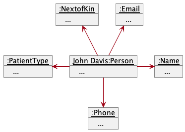
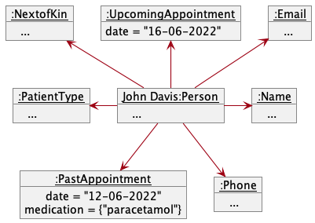
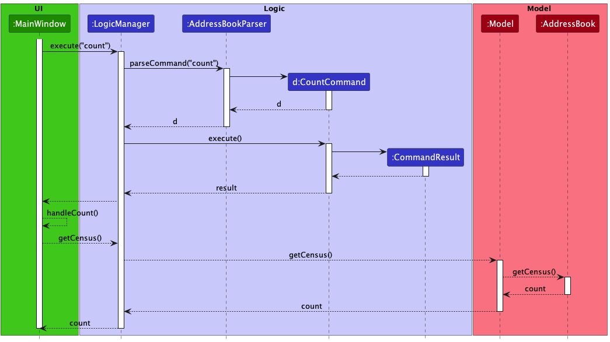
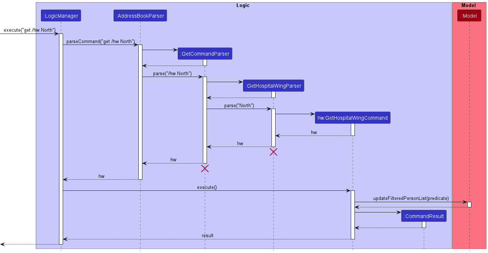

* Table of Contents
{:toc}

--------------------------------------------------------------------------------------------------------------------

## **Acknowledgements**

This project is based on the AddressBook-Level3 project created by the [SE-EDU initiative](https://se-education.org).

Third-party software used in this project:
* [JavaFx](https://openjfx.io/)
* [JUnit](https://junit.org/)
* [Gradle](https://gradle.org/)
* [CheckStyle](https://checkstyle.sourceforge.io/)
* [Codecov](https://codecov.io/)

--------------------------------------------------------------------------------------------------------------------

## **Introduction**

checkUp is a desktop application for medical practitioners to manage their patients' medical records. In this developer
guide, we will describe the architecture and design of the application. This guide is mainly for developers who wish to
enhance or create their own version of checkUp. You may refer to the [User Guide](UserGuide.md) for instructions on how
to use the application. 

### **Technologies**

checkUp is written in Java 11 and uses JavaFX to create the GUI. Gradle is used for building and managing the project.
Testing is done using JUnit.

### **Functions**

checkUp's features include creating, viewing and managing patients' medical records by storing data such as their:
* personal information;
* next-of-kin information;
* past appointment and visit history;
* upcoming appointments and visits;
* long-term medication prescriptions; and
* location in the hospital (for inpatients).

checkUp also allows users to:
* search for patients by:
  * name;
  * location in the hospital;
  * long-term medication;
* view the total number of patients in the system; and
* view the total number of patients under specific long-term medication prescriptions.

--------------------------------------------------------------------------------------------------------------------

## **Setting up, getting started**

Refer to the following guide: [_Setting up and getting started_](SettingUp.md).

--------------------------------------------------------------------------------------------------------------------

## **Design**

:bulb: **Tip:** The `.puml` files used to create diagrams in this document can be found in the 
[diagrams](https://github.com/AY2223S1-CS2103T-W16-3/tp/blob/master/docs/diagrams/) folder. Refer to the 
[_PlantUML Tutorial_ at se-edu/guides](https://se-education.org/guides/tutorials/plantUml.html) to learn how to create 
and edit diagrams.

### Architecture

The ***Architecture Diagram*** given above explains the high-level design of the App.

Given below is a quick overview of main components and how they interact with each other.

**Main components of the architecture**

**`Main`** has two classes called [`Main`](https://github.com/AY2223S1-CS2103T-W16-3/tp/blob/master/src/main/java/seedu/address/Main.java) 
and [`MainApp`](https://github.com/AY2223S1-CS2103T-W16-3/tp/blob/master/src/main/java/seedu/address/MainApp.java). 
It is responsible for,
* At app launch: Initializes the components in the correct sequence, and connects them up with each other.
* At shut down: Shuts down the components and invokes cleanup methods where necessary.

[**`Commons`**](#common-classes) represents a collection of classes used by multiple other components.

The rest of the App consists of four components.

* [**`UI`**](#ui-component): The UI of the App.
* [**`Logic`**](#logic-component): The command executor.
* [**`Model`**](#model-component): Holds the data of the App in memory.
* [**`Storage`**](#storage-component): Reads data from, and writes data to, the hard disk.

**How the architecture components interact with each other**

The *Sequence Diagram* below shows how the components interact with each other for the scenario where the user issues
the command `delete 1`.

Each of the four main components (also shown in the diagram above),

* defines its *API* in an `interface` with the same name as the Component.
* implements its functionality using a concrete `{Component Name}Manager` class (which follows the corresponding API 
  `interface` mentioned in the previous point).

For example, the `Logic` component defines its API in the `Logic.java` interface and implements its functionality using 
the `LogicManager.java` class which follows the `Logic` interface. Other components interact with a given component 
through its interface rather than the concrete class (reason: to prevent outside component's being coupled to the 
implementation of a component), as illustrated in the (partial) class diagram below.

The sections below give more details of each component.

### UI component

The **API** of this component is specified in [`Ui.java`](https://github.com/AY2223S1-CS2103T-W16-3/tp/blob/master/src/main/java/seedu/address/ui/Ui.java)

The UI consists of a `MainWindow` that is made up of parts e.g.`CommandBox`, `ResultDisplay`, `PersonListPanel`, 
`StatusBarFooter` etc. All these, including the `MainWindow`, inherit from the abstract `UiPart` class which captures 
the commonalities between classes that represent parts of the visible GUI.

The `UI` component uses the JavaFx UI framework. The layout of these UI parts are defined in matching `.fxml` files that
are in the `src/main/resources/view` folder. For example, the layout of the 
[`MainWindow`](https://github.com/AY2223S1-CS2103T-W16-3/tp/blob/master/src/main/java/seedu/address/ui/MainWindow.java) 
is specified in [`MainWindow.fxml`](https://github.com/AY2223S1-CS2103T-W16-3/tp/blob/master/src/main/resources/view/MainWindow.fxml)

The `UI` component,

* executes user commands using the `Logic` component.
* listens for changes to `Model` data so that the UI can be updated with the modified data.
* keeps a reference to the `Logic` component, because the `UI` relies on the `Logic` to execute commands.
* depends on some classes in the `Model` component, as it displays `Person` object residing in the `Model`.

### Logic component

**API** : [`Logic.java`](https://github.com/AY2223S1-CS2103T-W16-3/tp/blob/master/src/main/java/seedu/address/logic/Logic.java)

Here's a (partial) class diagram of the `Logic` component:

How the `Logic` component works:
1. When `Logic` is called upon to execute a command, it uses the `AddressBookParser` class to parse the user command.
2. This results in a `Command` object (more precisely, an object of one of its subclasses e.g., `AddCommand`) which is 
   executed by the `LogicManager`.
3. The command can communicate with the `Model` when it is executed (e.g. to add a person).
4. The result of the command execution is encapsulated as a `CommandResult` object which is returned back from `Logic`.

The Sequence Diagram below illustrates the interactions within the `Logic` component for the `execute("delete 1")` API call.

:information_source: **Note:** The lifeline for `DeleteCommandParser` 
should end at the destroy marker (X) but due to a limitation of PlantUML, the lifeline reaches the end of diagram.

Here are the other classes in `Logic` (omitted from the class diagram above) that are used for parsing a user command:

How the parsing works:
* When called upon to parse a user command, the `AddressBookParser` class creates an `XYZCommandParser` (`XYZ` is a 
  placeholder for the specific command name e.g., `AddCommandParser`) which uses the other classes shown above to parse 
  the user command and create a `XYZCommand` object (e.g., `AddCommand`) which the `AddressBookParser` returns back as 
  a `Command` object.
* When parsing a `get` command, the `AddressBookParser` class creates a `GetCommandParser` to parse the prefix of the 
  `get` command (e.g., `/hw`). If the `get` command only requires a prefix (e.g., `get /inp` & `get /outp`), the 
  respective `GetXYZCommand` object is created. If the `get` command requires parameters (e.g., `get /hw North`), the 
  prefix is parsed accordingly within the `GetCommandParser` before the respective `GetXYZCommandParser` is created to
  parse the parameters and create the appropriate `GetXYZCommand` to be returned.
* All `XYZCommandParser` and `GetXYZCommandParser` classes (e.g., `AddCommandParser`, `DeleteCommandParser`, ...) 
  inherit from the `Parser` interface so that they can be treated similarly where possible e.g, during testing.

### Model component
**API** : [`Model.java`](https://github.com/AY2223S1-CS2103T-W16-3/tp/blob/master/src/main/java/seedu/address/model/Model.java)

The partial class diagram above shows the classes that make up the `Model` component. Classes used by `Person` objects
through composition are omitted for brevity and shown later. 

The `Model` component,

* stores all registered patient data i.e., all `Person` objects (which are contained in a `UniquePersonList` object).
* stores the currently 'selected' `Person` objects (e.g., results of a search query) as a separate _filtered_ list which
    is exposed to outsiders as an unmodifiable `ObservableList<Person>` that can be 'observed' e.g. the UI can be bound to
    this list so that the UI automatically updates when the data in the list change.
* stores all prescribed medication data in a `MedicationMap` object.
* stores all [appointment](#appointments-feature) data (as `Appointment` objects in a `Person` object). 
* stores a `UserPref` object that represents the user’s preferences. This is exposed to the outside as a
    `ReadOnlyUserPref` objects.
* does not depend on any of the other three components (as the `Model` represents data entities of the domain, they
    should make sense on their own without depending on other components)

A patient (i.e. `Person`) stores related fields through composition, as shown in the class diagram below.

### Storage component

**API** : [`Storage.java`](https://github.com/AY2223S1-CS2103T-W16-3/tp/blob/master/src/main/java/seedu/address/storage/Storage.java)

The `Storage` component,
* can save both patient data and user preference data in json format, and read them back into corresponding objects.
* inherits from both `AddressBookStorage` and `UserPrefStorage`, which means it can be treated as either one (if only 
  the functionality of only one is needed).
* depends on some classes in the `Model` component (because the `Storage` component's job is to save/retrieve objects 
  that belong to the `Model`)

### Common classes

Classes used by multiple components are in the `seedu.addressbook.commons` package.

--------------------------------------------------------------------------------------------------------------------

## **Implementation**

This section describes some noteworthy details on how certain features are implemented.

### Appointments feature

The class diagram above visualises the `Appointment` package. The members of the `Medication` class have been hidden.

**Implementation**

The appointment creation mechanism is facilitated by its own `Appointment` component under the `Model` component. There
are 2 types of appointments, namely, `PastAppointment` and `UpcomingAppointment`.

- Both of these extend the abstract `Appointment` class, which implements the `Appointment#getDate()` operation.
- The static method `Appointment#isValidDate()` helps check against invalid date inputs for appointment creation.

#### `PastAppointment`

`PastAppointment`s represent a completed appointment for a patient. They are guaranteed to be immutable as they
constitute of sensitive patient data. Apart from `date`, `PastAppointment`s also require the following:

* `diagnosis`
  * Stored as a string, and is compulsory for the creation of a `PastAppointment`. Represents the doctor's analysis of
    the patient's state in the appointment, and is input using the `diag/` prefix.
  * Exposed using the `PastAppointment#getDiagnosis()` method for use in `JsonAdaptedPastAppointment`.
* `medication`
  * Stored as a set of medication tags, a `PastAppointment` may contain 0 or more medicine tags. Each medicine tag is
    input separately with a `m/` prefix.
  * Exposed using the `PastApointment#getMedication()` method for use in `JsonAdaptedPastAppointment`.

The following Sequence Diagram represents the creation of a `PastAppointment` using a `PastAppointmentCommand`:

#### `UpcomingAppointment`

`UpcomingAppointment`s represent an upcoming appointment for a patient. They only contain the `date` of the upcoming
appointment. A patient can only have a **maximum of 1** `UpcomingAppointment` at any given time.

Given below is an example usage scenario and how the appointment mechanism behaves at each step.

Context: Patient `John Davis` had a past appointment on `12-06-2022` where they were diagnosed with a `headache` and
prescribed `paracetamol` medication as a painkiller. They are scheduled for a follow-up appointment on `16-06-2022`.

Step 1. The medical assistant opens the application and executes `get /n John Davis` to find the target patient. The
assistant notices John is at index 2. John Davis currently has 0 `PastAppointment`s and no `UpcomingAppointment`.

The values of John's default details have been hidden in the above diagram.

Step 2. The medical assistant creates a `PastAppointment` for John by executing `appt 2 on/12-06-2022 diag/headache
m/paracetamol`. The `PastAppointment` count is now at `1`.

Step 3. The medical assistant creates an `UpcomingAppointment` for John by executing `edit upcoming/16-06-2022`. John
now has an `UpcomingAppointment` associated with him.

### Count feature

The count feature allows the user to count the number of patients stored in checkUp. It also returns a list of long-term
medications and how many patients are taking them. The count feature is facilitated by the `CountCommand` class.

**Implementation**

The count feature is implemented by the `CountCommand` class which extends the `Command` class. The overridden `execute()`
method returns a `CommandResult` object which contains the number of patients and the list of long-term medications.

The list of patients are stored in the `UniquePersonList` class. The list of medications are stored in the
`MedicationMap` class, which encapsulates an `ObservableMap` object that maps the name of a medication (represented by a
string) to the number of patients taking it (represented by an integer). Both the `UniquePersonList` and `MedicationMap`
classes are stored in the `Model` component, and accessible through the `ReadOnlyAddressBook` interface.

The `CountCommand` class indicates to the `UI` component to open the count window upon execution. The `UI` component
depends on the `Logic` interface to get the count data, through the `Logic#getCensus()` method. The `Logic` interface
uses the `Model` interface through the `Model#getCensus()` method which uses the `ReadOnlyAddressBook` interface to get
the data. `Model#getCensus()` in turn calls the `ReadOnlyAddressBook#getCensus()` method which interacts with the
`UniquePersonList` class to get the list of patients, and the `MedicationMap` class to get the list of long-term
medications.

The following sequence diagram shows how the count feature works:

### Get Features (By prefixes)

The get feature contains a series of sub-features that allows the user to get
a list of persons based on the prefixes inputted. It is implemented the same way as the `AddressBookParser` class,
but it matches the following prefix of the user input instead of the first command word.
Only the first prefix following the `get` command word will be considered. Extra prefix inputs will be ignored.
By having a parent `GetCommand` class, we can have a series of sub-commands that inherits from it.
This way, new implementations of other items to be filtered when using the get command can be easily
added in the future.

There are 2 types of inputs for get commands, specifically those that only require a prefix (`/inp` & `/outp`) and 
those that require a prefix and parameters.

Below is a Sequence Diagram illustrating the implementation of `GetCommand` for get commands that only require a prefix.
The command `get /inp` will be used for this example.

This Sequence Diagram below illustrates the implementation of the `GetCommand` for get commands that require parameters
in addition to the prefix. The command `get /hw North` will be used for this example.

All get commands are implemented in the following steps:
1. User input prefix is matched in `GetCommandParser` class
2. If the get command takes in both a prefix and parameter, the parser for the get command corresponding to the prefix 
   is called and parses the parameters inputted
3. Specific child classes of `GetCommand` is instantiated and executed
4. The model is then updated such that the *filtered* list only displays patients whose details match the query
   arguments of that prefix

#### Appointment Date (/appton)

Getting the list of patients with an appointment on the query date involves the following steps:
1. Prefix `/appton` is matched using an instance of `GetCommandParser`
2. A new `GetAppointmentByDateCommandParser` instance is created and parses the user input (specifically the date inputted)
3. A `GetAppointmentByDateCommand` instance containing the date of the appointment is created and returned
4. The `GetAppointmentByDateCommand` is executed, accessing the list of `PastAppointment` of the specified patient
   to be returned in a `CommandResult`
5. The model is updated such that the *filtered* list only displays patients who have an appointment on the specified
   date.

To ease the parsing of date inputs using `LocalDate`, we have standardized the input query to be in the format of `dd-MM-yyyy`.

#### Past appointments of a patient (/appt)

Getting the past appointments of a patient involves the following steps:
1. Prefix `/appt` is matched using an instance of `GetCommandParser`
2. A new `GetPastAppointmentCommandParser` instance is created and parses the user input (specifically the index inputted)
3. A `GetPastAppointmentCommand` instance containing the index of the patient to be updated is created and returned
4. The `GetPastAppointmentCommand` is executed, accessing the list of `PastAppointment` of the specified patient
   to be returned in a `CommandResult`
5. The list of `PastAppointment` will then be displayed in the `ResultDisplay`

#### Floor Number (/fn)

Getting the list of patients in the query floor number involves the following steps:
1. Prefix `/fn` is matched in `GetCommandParser` class
2. A new `GetFloorNumberCommandParser` instance is created and parses the user input
3. A `GetFloorNumberCommand` instance is returned
4. The model is updated such that the *filtered* list only displays patients who are on the query floor number

Strict restrictions are placed to prevent querying and parsing of invalid floor numbers. Invalid floor numbers include
floor numbers less than 1, negative numbers and characters or strings. 

#### Hospital Wing (/hw)

Getting the list of patients in the query hospital wing involves the following steps:
1. Prefix `/hw` is matched in `GetCommandParser` class
2. A new `GetHospitalWingCommandParser` instance is created and parses the user input
3. A `GetHospitalWingCommand` instance is returned
4. The model is updated such that the *filtered* list only displays patients who are in the query hospital wing

Strict restrictions are placed to prevent too many varieties of hospital wings. Hospital wings only accepts 
the following values (case-insensitive) `south` `north` `east` `west` as valid inputs. 

#### Long Term Medication (/m)

Getting the list of patients who are taking the query long term medication involves the following steps:
1. Prefix `/m` is matched in `GetCommandParser` class
2. A new `GetMedicationCommandParser` instance is created and parses the user input
3. A `GetMedicationCommand` instance is returned
4. The model is updated such that the *filtered* list only displays patients who are taking the query long term medication

Medication name searches are case-insensitive. Each search requires a full-word match.
For example, searching for `paracet` will only return patients with long-term medication name
`paracet`, and **not** `paracetamol`.

#### Name (`/n`)

Getting the list of patients whose name contains the query name involves the following steps:
1. Prefix `/n` is matched in `GetCommandParser` class
2. A new `GetNameCommandParser` instance is created and parses the user input
3. A `GetNameCommand` instance is returned
4. The model is updated such that the *filtered* list only displays patients whose name contains the query name

Name searches are case-insensitive. Each search requires a full-word match.
For example, searching for `john` will only return patients with name `John`, and **not** `Johnson`.

#### Next of Kin (`/nok`)

Getting the information of the next of kin of the list of query patient names involves the following steps:
1. Prefix `/nok` is matched in `GetCommandParser` class
2. A new `GetNextOfKinCommandParser` instance is created and parses the user input
3. A `GetNextOfKinCommand` instance is returned
4. The model is updated such that the *filtered* list only displays queried patients' next of kin details

Details of the next of kin include the name, relationship to patient and phone number.

#### Patient type (/inp & /outp)

Getting the list of inpatients and outpatients involves the following steps:
1. Prefix `/inp` or `/outp` is matched using an instance of `GetCommandParser`
2. The respective `GetInpatientCommand` or `GetOutpatientCommand` instance is created and returned
3. The model is updated such that the *filtered* list only displays inpatients or outpatients

If additional parameters are inputted (e.g. `get /inp hello world`), the extra parameters will be ignored, similar to 
how `help`, `list`, `exit` and `clear` are executed.

#### Ward Number (/wn)

Getting the list of patients in the query ward number involves the following steps:
1. Prefix `/wn` is matched in `GetCommandParser` class
2. A new `GetWardNumberCommandParser` instance is created and parses the user input
3. A `GetWardNumberCommand` instance is returned
4. The model is updated such that the *filtered* list only displays patients who are in the query ward number

Strict restrictions are placed to prevent too many varieties of ward number inputs. This way the regex for searching
for ward numbers is simplified. Due to differing places having different ways of numbering their ward numbers, we
have standardised it to be in the format of `Uppercase Alphabet` + `3 Numbers`. For example, `A123`, `B241`, `C005`, etc.
If the user tries to query for a ward number of incorrect format, the search will still proceed, but no patients will be
displayed.

### New Add Command

The new `Add` Command incorporates support for the necessary fields for a patient, namely the: `NextOfKin`,
`PatientType`,`HospitalWing`, `FloorNumber`, `WardNumber` and `Medications` fields. The new command still follows the
flow of the old command, as illustrated in the Activity Diagram below.

As the Add Command now includes more fields for the patients, the Person class has also been updated to store these
fields, as shown in the class diagram below.

The usage of the Add Command remains the same as before.

--------------------------------------------------------------------------------------------------------------------

## **Documentation, logging, testing, configuration, dev-ops**

* [Documentation guide](Documentation.md)
* [Testing guide](Testing.md)
* [Logging guide](Logging.md)
* [Configuration guide](Configuration.md)
* [DevOps guide](DevOps.md)

--------------------------------------------------------------------------------------------------------------------

## **Appendix: Requirements**

### Product scope

**Target user profile**:

* for hospital staff
* prefer CLI over GUI
* can type fast
* prefers typing to mouse interactions
* is reasonably comfortable using CLI apps

**Value proposition**: The product aims to enhance and increase the productivity and efficiency of hospital staff in terms of patients management, within a single hospital/clinic only.

### User stories

Priorities: High (must have) - `* * *`, Medium (nice to have) - `* *`, Low (unlikely to have) - `*`

| Priority | As a …         | I want to …                                        | So that I can …                                                                          |
|----------|----------------|----------------------------------------------------|------------------------------------------------------------------------------------------|
| `* * *`  | doctor         | search for patients by name                        | view patient's relevant details for ease of diagnosis                                    |
| `* * *`  | hospital staff | retrieve patient contact info and next-of-kin data | quickly and efficiently contact the patient or someone near them                         |
| `* *`    | receptionist   | check the total number of patients in my hospital  | know when the hospital is oversubscribed                                                 |
| `* * *`  | hospital staff | retrieve patients by ward number                   | attend to them quickly                                                                   |
| `* * *`  | hospital staff | retrieve patients by floor number                  | attend to them quickly                                                                   |
| `* * *`  | hospital staff | retrieve patients by hospital wings                | attend to them quickly                                                                   |
| `* *`    | hospital staff | have a list of inpatients and outpatients          | easily see which patients are staying in the hospital                                    |
| `* * *`  | receptionist   | check if patient is inpatient or for daily checkup | know where to direct them                                                                |
| `* * *`  | receptionist   | create patient profiles                            | store new patients into the system                                                       |
| `* * *`  | nurse          | retrieve patients by medication                    | view all patients on a type of long-term medication for easier medication administration |
| `* * *`  | hospital staff | remove patients from the database                  | remove redundant entries that are no longer necessary                                    |
| `* * *`  | doctor         | view the previous appointments of a patient        | see patients' previous consultation diagnoses or issued medications                      |
| `* * *`  | receptionist   | retrieve patients by their appointment date        | know which patients have scheduled an appointment on a particular day                    |
| `*`      | hospital staff | retrieve patient count by medication               | know which medication is most commonly prescribed                                        |
| `* *`    | receptionist   | add appointments to a patient's record             | keep track of a patient's medical history and backdate records                           |
| `* *`    | doctor         | store a patient's next appointment date            | keep track of when the patient is due for their next appointment                         |

- Doctor - Doctor
- Receptionist - Receptionist
- Nurse - Nurse
- Hospital staff - Doctor, receptionist, nurse

### Use cases

(For all use cases below, the **System** is `checkUp` and the **Actor** is the `User`, unless specified otherwise)

<h3>Use case 1: Register a patient</h3>

**MSS**

1. User requests to add a patient
2. checkUp adds the patient

    Use case ends.

**Extensions**

* 1a. The user input is invalid

    * 1a1. checkUp shows an error message

      Use case resumes at step 1

<h3>Use case 2: Delete a patient</h3>

**MSS**

1.  User requests to list patients
2.  checkUp shows a list of patients
3.  User requests to delete a specific patient in the list
4.  checkUp deletes the patient 

    Use case ends.

**Extensions**

* 2a. The list is empty.

  Use case ends.

* 3a. The given index is invalid.

    * 3a1. checkUp shows an error message.

      Use case resumes at step 2.

<h3>Use case 3: Backdating a patient's appointment record</h3>

**MSS**

1. User requests to filter list of patients by name
2. checkUp shows a list of patients
3. User requests to create a past appointment for a specific patient in the list
4. checkUp creates the appointment

    Use case ends.

**Extensions**

* 2a. The list is empty.

  Use case ends.

* 3a. The given index is invalid.

    * 3a1. checkUp shows an error message.

      Use case resumes at step 2.

* 3b. The given date is invalid.
    
    * 3b1. checkUp shows an error message.
    
      Use case resumes at step 2.

* 4a. The command is missing the date or diagnosis.

    * 4a1. checkUp shows an error message.

      Use case resumes at step 2.

<h3>Use case 4: Setting a patient's next appointment date</h3>

**MSS**

1. User requests to filter list of patients by name
2. checkUp shows a list of patients
3. User requests to set a future appointment for a specific patient in the list
4. checkUp sets the appointment

    Use case ends.

**Extensions**

* 2a. The list is empty.

  Use case ends.

* 3a. The given index is invalid.

    * 3a1. checkUp shows an error message.

      Use case resumes at step 2.

* 3b. The given date is invalid or in the past.

    * 3b1. checkUp shows an error message.

      Use case resumes at step 2.

* 4a. The user sets the wrong date.
  
  Use case resumes at step 2.

<h3>Use case 5: Removing a patient's next appointment date</h3>

**MSS**

1. User requests to filter list of patients by name
2. checkUp shows a list of patients
3. User requests to remove a future appointment for a specific patient in the list
4. checkUp removes the appointment

    Use case ends.

**Extensions**

* 2a. The list is empty.

  Use case ends.

* 3a. The given index is invalid.

    * 3a1. checkUp shows an error message.

      Use case resumes at step 2.

<h3>Use case 6: Checking number of patients in a ward</h3>

**MSS**

1. User requests to filter list of patients by ward number
2. checkUp shows number of patients in given ward number

    Use case ends.

**Extensions**

* 1a. The user input is invalid

    * 1a1. checkUp shows an empty list

      Use case resumes at step 1.

* 2a. The list is empty.

  Use case ends.

<h3>Use case 7: Recording number of patient influx</h3>

**MSS**

1. User requests count of patients in the hospital
2. checkUp shows number of patients in the hospital

    Use case ends.

**Extensions**

* 1a. The user input is invalid

    * 1a1. checkUp shows an error message

      Use case resumes at step 1.

### Non-Functional Requirements

1. Should work on any _mainstream OS_ as long as it has Java `11` or above installed.
2. Should be able to hold up to 1000 patients without a noticeable sluggishness in performance for typical usage.
3. A user with above average typing speed for regular English text (i.e. not code, not system admin commands) should be able to accomplish most of the tasks faster using commands than using the mouse.
4. Stored data should be compatible with other OSes and versions of the application.
5. Users must be able to access the application without an internet connection.
6. The application should load up within 3-5 seconds.

### Glossary

* **Mainstream OS**: Windows, Linux, Unix, OS-X
* **Private contact detail**: A contact detail that is not meant to be shared with others
* **Hospital Administrator/Staff**: Member of hospital management, able to view and edit ALL patient contact details (including private contact details).

--------------------------------------------------------------------------------------------------------------------

## **Appendix: Instructions for manual testing**

Given below are instructions to test the app manually.

:information_source: **Note:** These instructions only provide a starting point for testers to work on;
testers are expected to do more *exploratory* testing.

### Launch and shutdown

1. Initial launch

   1. Download the jar file and copy into an empty folder

   2. Double-click the jar file Expected: Shows the GUI with a set of sample contacts. The window size may not be optimum.

2. Saving window preferences

   1. Resize the window to an optimum size. Move the window to a different location. Close the window.

   2. Re-launch the app by double-clicking the jar file. 
       Expected: The most recent window size and location is retained.

### Deleting a person

1. Deleting a person while all persons are being shown

   1. Prerequisites: List all persons using the `list` command. Multiple persons in the list.

   2. Test case: `delete 1` 
      Expected: First contact is deleted from the list. Details of the deleted contact shown in the status message. Timestamp in the status bar is updated.

   3. Test case: `delete 0` 
      Expected: No person is deleted. Error details shown in the status message. Status bar remains the same.

   4. Other incorrect delete commands to try: `delete`, `delete x`, `...` (where x is larger than the list size) 
      Expected: Similar to previous.

### Creating appointments 

1. Creating a past appointment while a list of patients is being shown.

    1. Prerequisites: List all patients using the `list` command. Multiple patients are in the list.

    2. Test case: `appt 1 on/10-10-2020 diag/Fever m/Ibuprofen` 
       Expected: A past appointment is created for the first patient in the list. Details of the appointment shown in the status message.

    3. Test case: `appt 1 on/10-10-2020 diag/Fever` 
       Expected: Success message as the above test case, as the medication fields are optional.

    4. Test case: `appt 1 on/10-10-2020 diag/Fever m/Ibuprofen m/Paracetamol` 
       Expected: Success message as the above test case, as there can be multiple medication fields.

    5. Test case: `appt 1 diag/Fever m/Ibuprofen` 
       Expected: No appointment is created, as the date field is not optional. Error details shown in the status message.

    6. Test case: `appt 1 on/10-10-2020 m/Ibuprofen` 
       Expected: No appointment is created, as the diagnosis field is not optional. Error details shown in the status message.
   
    7. Test case: `appt 0 on/10-10-2020 diag/Fever` 
       Expected: No appointment is created, as the index is invalid. Error details shown in the status message.

2. Editing a patient's upcoming appointment while a list of patients is being shown.

    1. Prerequisites: List all patients using the `list` command. Multiple patients are in the list.

    2. Test case: `edit 1 ua/10-10-2035` 
       Expected: The first patient's upcoming appointment is edited to be on 10-10-2020. Details of the appointment shown in the status message. 
   
    3. Test case: `edit 1 ua/10-10-2020` 
       Expected: The upcoming appointment is not set, as the date is in the past. Error details shown in the status message. 
    
    4. Test case: `edit 1 ua/` 
       Expected: The first patient's upcoming appointment is set to None. Details of the appointment shown in the status message.

    5. Test case: `edit 0 ua/10-10-2035` 
         Expected: No appointment is edited, as the index is invalid. Error details shown in the status message.

### Sorting patients by patient type

1. Displaying all inpatients registered in checkUp

   1. Prerequisites: List all patients using the `list` command. At least one inpatient in the list of people.
   
   2. Test case: `get /inp` 
      Expected: All inpatients are listed. The number of inpatients listed is displayed in the result box.
   
   3. Test case: `get /inp hello world` 
      Expected: All inpatients are listed. The number of inpatients listed is displayed in the result box.
   
   4. Test case: `get /inp /outp` 
      Expected: All inpatients are listed. The number of inpatients listed is displayed in the result box.
   
   5. Test case: `get inp` 
      Expected: The current list remains unchanged. Error message is displayed in the result box.
   
   6. Test case: `get inp/` 
      Expected: The current list remains unchanged. Error message is displayed in the result box.

2. Displaying all outpatients registered in checkUp

   1. Prerequisites: List all patients using the `list` command. At least one outpatient in the list of people.
   
   2. Test case: `get /outp` 
      Expected: All outpatients are listed. The number of outpatients listed is displayed in the result box.
   
   3. Test case: `get /outp hello world` 
      Expected: All outpatients are listed. The number of outpatients listed is displayed in the result box.
   
   4. Test case: `get /outp /inp` 
      Expected: All outpatients are listed. The number of outpatients listed is displayed in the result box.
   
   5. Test case: `get outp` 
      Expected: The current list remains unchanged. Error message is displayed in the result box.
   
   6. Test case: `get outp/` 
      Expected: The current list remains unchanged. Error message is displayed in the result box.

### Sorting patients by hospital wing

1. Displaying all inpatients in a particular hospital wing
    1. Prerequisites: List all patients using the `list` command. At least one inpatient in the list of people.
    2. Test case: `get /hw south` 
       Expected: All inpatients in the south wing are listed. 
       The number of inpatients listed is displayed in the result box.
    3. Test case: `get /hw NORTH` 
       Expected: All inpatients in the north wing are listed. 
       The number of inpatients listed is displayed in the result box.
    4. Test case: `get /hw east /fn 9` 
       Expected: All inpatients in the east wing are listed. 
       The number of inpatients listed is displayed in the result box.
    5. Test case: `get /hw east south` 
       Expected: All inpatients in the east wing and south wing are listed.
       The number of inpatients listed is displayed in the result box.
    6. Test case: `get hw` 
       Expected: The current list remains unchanged. Error message is displayed in the result box.
    7. Test case: `get hw/` 
       Expected: The current list remains unchanged. Error message is displayed in the result box.

### Sorting patients by appointment date

1. Displaying all patients that has an appointment on the query appointment date
    1. Prerequisites: List all patients using the `list` command. At least one inpatient in the list of people.
    2. Test case: `get /appton 14-12-1212` 
       Expected: All patients having appointments on 14th December 1212 are listed.
       The number of patients listed is displayed in the result box.
    3. Test case: `get /appton 14-12-1212 15-12-2020` 
       Expected: All patients having appointments on 14th December 1212 or 15th December 2020 are listed.
       The number of patients listed is displayed in the result box.
    4. Test case: `get /appton 2020-08-08` 
       Expected: The current list remains unchanged. Error message is displayed in the result box.
    5. Test case: `get /appton 14-12-1212 /hw south` 
       Expected: The current list remains unchanged. Error message is displayed in the result box.
    6. Test case: `get /appton 14-12-1212 5` 
       Expected: The current list remains unchanged. Error message is displayed in the result box.
    7. Test case: `get appton` 
       Expected: The current list remains unchanged. Error message is displayed in the result box.
    8. Test case: `get appton/` 
       Expected: The current list remains unchanged. Error message is displayed in the result box.
    
### Displaying all past appointments of a patient

1. Displaying the past appointment of a patient when all patients have past appointments.

   1. Prerequisite: List all patients using the `list` command. All patients have at least one past appointment.
   
   2. Test case: `get /appt 1` 
      Expected: Displays all the past appointments of the first patient in the list. The list of past appointments will 
                be arranged from most recent to oldest in the result box.
   
   3. Test case: `get /appt 0` 
      Expected: No past appointment is displayed. Error message is displayed in the result box.
   
   4. Test case: `get /appt INVALID_INDEX` where `INVALID_INDEX` is an index outside the displayed list (e.g. `7` in a
                 list of size 6) 
      Expected: No past appointment is displayed. Error message is displayed in the result box.

2. Displaying the past appointment of a patient that does not have any past appointments.
   
   1. Prerequisite: At least one patient in the list of displayed patients must have no past appointments.
   
   2. Test case: `get /appt INDEX_OF_PATIENT` where `INDEX_OF_PATIENT` is the index of the patient with no past 
                 appointments. 
      Expected: Result box will display `Obtained Past Appointments of Patient:` only, indicating there are no past
                appointments.

### Sorting of the past appointments

1. Testing if past appointments are arranged from most recent to oldest

   1. Prerequisite: At least one patient in the list of displayed patients must have no past appointments.
   
   2. Test case: `appt INDEX_OF_PATIENT on/01-01-2022 diag/fever`, 
                 `appt INDEX_OF_PATIENT on/04-01-2022 diag/fever follow up`, `get /appt INDEX_OF_PATIENT` where 
                 `INDEX_OF_PATIENT` is the index of the patient with no past appointments. 
      Expected: The list of past appointments will display the appointment on 04-01-2022 first followed by the 
                appointment on 01-01-2022 in the result box.
   
   3. Test case: `appt INDEX_OF_PATIENT on/04-01-2022 diag/fever follow up`,
                 `appt INDEX_OF_PATIENT on/01-01-2022 diag/fever`, `get /appt INDEX_OF_PATIENT` where `INDEX_OF_PATIENT`
                 is the index of the patient with no past appointments. 
      Expected: The list of past appointments will display the appointment on 04-01-2022 first followed by the
                appointment on 01-01-2022 in the result box. 

### Filtering patients by medication

1. Displaying all patients who are taking a specific medication

   1. Prerequisite: At least one patient is taking the medication.
   
   2. Test case: `get /m paracetamol` 
      Expected: All patients who are taking paracetamol are listed. The number of patients listed is displayed in the result box.
   
   3. Test case: `get /m paracetamol /inp /outp` 
      Expected: All patients who are taking paracetamol are listed. The number of patients listed is displayed in the result box.

   4. Test case: `get /m paracetamol ibuprofen` 
      Expected: All patients who are taking paracetamol or ibuprofen are listed. The number of patients listed is displayed in the result box.

   5. Test case: `get paracetamol` 
      Expected: The current list remains unchanged. Error message is displayed in the result box.
   
   6. Test case: `get medication paracetamol` 
      Expected: The current list remains unchanged. Error message is displayed in the result box.

### Filtering patients by name

1. Displaying all patients whose name contains a specific keyword

   1. Prerequisite: At least one patient's name contains the keyword.
   
   2. Test case: `get /n alice` 
      Expected: All patients whose name contains Alice are listed. The number of patients listed is displayed in the result box.
   
   3. Test case: `get /n alice /inp /outp` 
      Expected: All patients whose name contains Alice are listed. The number of patients listed is displayed in the result box.

   4. Test case: `get /n alice bob` 
      Expected: All patients whose name contains Alice or Bob are listed. The number of patients listed is displayed in the result box.

   5. Test case: `get alice` 
      Expected: The current list remains unchanged. Error message is displayed in the result box.
   
   6. Test case: `get name alice` 
      Expected: The current list remains unchanged. Error message is displayed in the result box.

### Filtering patients by ward number

1. Displaying all patients who are in a specific ward

   1. Prerequisite: At least one patient is inpatient and is in the ward.
   
   2. Test case: `get /wn D312` 
      Expected: All patients who are in ward number D312 are listed. The number of patients listed is displayed in the result box.
   
   3. Test case: `get /wn D312 /inp /outp` 
      Expected: All patients who are in ward number D312 are listed. The number of patients listed is displayed in the result box.

   4. Test case: `get /wn D312 F456` 
       Expected: All patients who are in ward numbers D312 or F456 are listed. The number of patients listed is displayed in the result box.

   5. Test case: `get /wn d312` 
      Expected: All patients who are in ward number D312 are listed. The number of patients listed is displayed in the result box.

   6. Test case: `get ward D312` 
      Expected: The current list remains unchanged. Error message is displayed in the result box.
   
2. Displaying list of patients when ward number is invalid

   1. Prerequisite: At least one patient is in the ward. All patients are in a valid ward.
   
   2. Test case: `get /wn hello` 
      Expected: No patients are listed. Invalid ward number will never match.
   
   3. Test case: `get /wn D31` 
      Expected: No patients are listed. Invalid ward number will never match.

### Filtering patients by floor number

1. Displaying all patients who are on a specific floor

   1. Prerequisite: At least one patient is inpatient and is on the specific floor.
   
   2. Test case: `get /fn 3` 
      Expected: All patients who are in floor number 3 are listed. The number of patients listed is displayed in the result box.
   
   3. Test case: `get /fn 3 4 5` 
      Expected: All patients who are in floor numbers 3, 4 and 5 are listed. The number of patients listed is displayed in the result box.

   4. Test case: `get floor 3` 
       Expected: The current list remains unchanged. Error message is displayed in the result box.

   5. Test case: `get /fn 0` 
      Expected: No patients are listed. Error message is displayed in the result box.
   
   6. Test case: `get /fn -1 4 5` 
      Expected: No patients are listed. Error message is displayed in the result box.

   7. Test case: `get /fn -1 hello -5` 
      Expected: No patients are listed. Error message is displayed in the result box.

## **Appendix: Effort**

### Difficulty level

Overall difficulty was manageable, as many of our iP implementations lay the proper foundations for
checkUp feature implementations. However, due to managing workload in a group setting and balancing
reviewing teammate's PRs and writing our own code, the difficulty increased due to the sheer workload.

### Challenges faced

Challenges we faced along the way include:

1. Time management
   - We found ourselves rushing most of the milestone deadlines, despite splitting it up to halves
   - Last minute changes to the UI and features resulted in merge conflicts
2. Team coordination
   - All of us had differing schedules, therefore finding a common meeting time every week was difficult

### Effort required

Here are some of the efforts we have put in to develop checkUp, which was a brownfield project extended from AB3.

1. Getting familiar with the large codebase.

2. We have refactored the AB3 codebase to fit the needs of our application. This includes
  renaming of classes, methods and variables to fit the context of our application.
   - Implementing additional details to the `Person` class means refactoring of multiple other classes which
       involve the `Person` class.
   - Refactoring of test cases were also required to include the new details of the `Person` class.

### Achievements

Here are some of the features we achieved:

1. Past and future appointments for patients
2. Inpatient and outpatient patient types
3. Filtering of patients according to given prefix
4. Next of kin of patients
5. Long-term medication of patients
