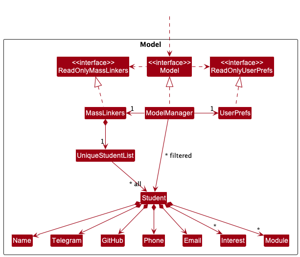
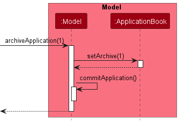
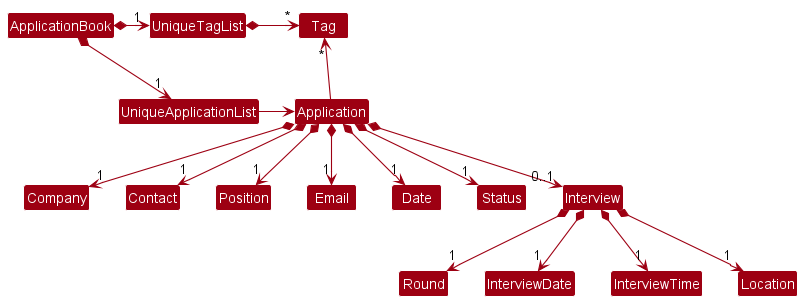
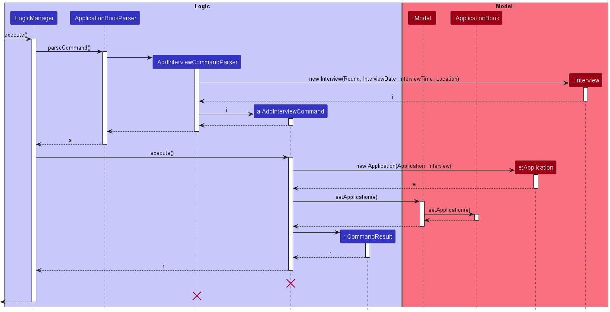
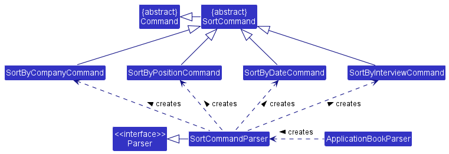

* Table of Contents
{:toc}

--------------------------------------------------------------------------------------------------------------------

## **Acknowledgements**

* {list here sources of all reused/adapted ideas, code, documentation, and third-party libraries -- include links to the original source as well}

--------------------------------------------------------------------------------------------------------------------

## **Setting up, getting started**

Refer to the guide [_Setting up and getting started_](SettingUp.md).

--------------------------------------------------------------------------------------------------------------------

## **Design**

:bulb: **Tip:** The `.puml` files used to create diagrams in this document can be found in the [diagrams](https://github.com/se-edu/addressbook-level3/tree/master/docs/diagrams/) folder. Refer to the [_PlantUML Tutorial_ at se-edu/guides](https://se-education.org/guides/tutorials/plantUml.html) to learn how to create and edit diagrams.

### Architecture

The ***Architecture Diagram*** given above explains the high-level design of the App.

Given below is a quick overview of main components and how they interact with each other.

**Main components of the architecture**

**`Main`** has two classes called [`Main`](https://github.com/se-edu/addressbook-level3/tree/master/src/main/java/seedu/address/Main.java) and [`MainApp`](https://github.com/se-edu/addressbook-level3/tree/master/src/main/java/seedu/address/MainApp.java). It is responsible for,
* At app launch: Initializes the components in the correct sequence, and connects them up with each other.
* At shut down: Shuts down the components and invokes cleanup methods where necessary.

[**`Commons`**](#common-classes) represents a collection of classes used by multiple other components.

The rest of the App consists of four components.

* [**`UI`**](#ui-component): The UI of the App.
* [**`Logic`**](#logic-component): The command executor.
* [**`Model`**](#model-component): Holds the data of the App in memory.
* [**`Storage`**](#storage-component): Reads data from, and writes data to, the hard disk.

**How the architecture components interact with each other**

The *Sequence Diagram* below shows how the components interact with each other for the scenario where the user issues the command `delete 1`.

Each of the four main components (also shown in the diagram above),

* defines its *API* in an `interface` with the same name as the Component.
* implements its functionality using a concrete `{Component Name}Manager` class (which follows the corresponding API `interface` mentioned in the previous point.

For example, the `Logic` component defines its API in the `Logic.java` interface and implements its functionality using the `LogicManager.java` class which follows the `Logic` interface. Other components interact with a given component through its interface rather than the concrete class (reason: to prevent outside component's being coupled to the implementation of a component), as illustrated in the (partial) class diagram below.

The sections below give more details of each component.

### UI component

The **API** of this component is specified in [`Ui.java`](https://github.com/AY2223S1-CS2103-F14-3/tp/tree/master/src/main/java/seedu/application/ui/Ui.java)

The UI consists of a `MainWindow` that is made up of parts e.g.`CommandBox`, `ResultDisplay`, `ApplicationListPanel`, `StatusBarFooter` etc. All these, including the `MainWindow`, inherit from the abstract `UiPart` class which captures the commonalities between classes that represent parts of the visible GUI.

The `UI` component uses the JavaFx UI framework. The layout of these UI parts are defined in matching `.fxml` files that are in the `src/main/resources/view` folder. For example, the layout of the [`MainWindow`](https://github.com/AY2223S1-CS2103-F14-3/tp/tree/master/src/main/java/seedu/application/ui/MainWindow.java) is specified in [`MainWindow.fxml`](https://github.com/AY2223S1-CS2103-F14-3/tp/tree/master/src/main/resources/view/MainWindow.fxml)

The `UI` component,

* executes user commands using the `Logic` component.
* listens for changes to `Model` data so that the UI can be updated with the modified data.
* keeps a reference to the `Logic` component, because the `UI` relies on the `Logic` to execute commands.
* depends on some classes in the `Model` component, as it displays `Application` object residing in the `Model`.

### Logic component

**API** : [`Logic.java`](https://github.com/se-edu/addressbook-level3/tree/master/src/main/java/seedu/address/logic/Logic.java)

Here's a (partial) class diagram of the `Logic` component:

How the `Logic` component works:
1. When `Logic` is called upon to execute a command, it uses the `AddressBookParser` class to parse the user command.
1. This results in a `Command` object (more precisely, an object of one of its subclasses e.g., `AddCommand`) which is executed by the `LogicManager`.
1. The command can communicate with the `Model` when it is executed (e.g. to add a person).
1. The result of the command execution is encapsulated as a `CommandResult` object which is returned back from `Logic`.

The Sequence Diagram below illustrates the interactions within the `Logic` component for the `execute("delete 1")` API call.

:information_source: **Note:** The lifeline for `DeleteCommandParser` should end at the destroy marker (X) but due to a limitation of PlantUML, the lifeline reaches the end of diagram.

Here are the other classes in `Logic` (omitted from the class diagram above) that are used for parsing a user command:

How the parsing works:
* When called upon to parse a user command, the `AddressBookParser` class creates an `XYZCommandParser` (`XYZ` is a placeholder for the specific command name e.g., `AddCommandParser`) which uses the other classes shown above to parse the user command and create a `XYZCommand` object (e.g., `AddCommand`) which the `AddressBookParser` returns back as a `Command` object.
* All `XYZCommandParser` classes (e.g., `AddCommandParser`, `DeleteCommandParser`, ...) inherit from the `Parser` interface so that they can be treated similarly where possible e.g, during testing.

### Model component
**API** : [`Model.java`](https://github.com/se-edu/addressbook-level3/tree/master/src/main/java/seedu/address/model/Model.java)

The `Model` component,

* stores the address book data i.e., all `Person` objects (which are contained in a `UniquePersonList` object).
* stores the currently 'selected' `Person` objects (e.g., results of a search query) as a separate _filtered_ list which is exposed to outsiders as an unmodifiable `ObservableList<Person>` that can be 'observed' e.g. the UI can be bound to this list so that the UI automatically updates when the data in the list change.
* stores a `UserPref` object that represents the user’s preferences. This is exposed to the outside as a `ReadOnlyUserPref` objects.
* does not depend on any of the other three components (as the `Model` represents data entities of the domain, they should make sense on their own without depending on other components)

:information_source: **Note:** An alternative (arguably, a more OOP) model is given below. It has a `Tag` list in the `AddressBook`, which `Person` references. This allows `AddressBook` to only require one `Tag` object per unique tag, instead of each `Person` needing their own `Tag` objects. 

### Storage component

**API** : [`Storage.java`](https://github.com/se-edu/addressbook-level3/tree/master/src/main/java/seedu/address/storage/Storage.java)

The `Storage` component,
* can save both address book data and user preference data in json format, and read them back into corresponding objects.
* inherits from both `AddressBookStorage` and `UserPrefStorage`, which means it can be treated as either one (if only the functionality of only one is needed).
* depends on some classes in the `Model` component (because the `Storage` component's job is to save/retrieve objects that belong to the `Model`)

### Common classes

Classes used by multiple components are in the `seedu.addressbook.commons` package.

--------------------------------------------------------------------------------------------------------------------

## **Implementation**

This section describes some noteworthy details on how certain features are implemented.

### Undo/redo feature

#### Implementation

The undo/redo mechanism is facilitated by `VersionedApplicationBook`. It extends `ApplicationBook` with an undo/redo history, stored internally as an `applicationBookStateList` and `currentStatePointer`. Additionally, it implements the following operations:

* `VersionedApplicationBook#commit()` — Saves the current application book state in the history.
* `VersionedApplicationBook#undo()` — Restores the previous application book state from the history.
* `VersionedApplicationBook#redo()` — Restores a previously undone application book state from the history.

These operations are exposed in the `Model` interface as `Model#commitApplicationBook()`, `Model#undoApplicationBook()` and `Model#redoApplicationBook()` respectively.

Given below is an example usage scenario and how the undo/redo mechanism behaves at each step.

Step 1. The user launches the application for the first time. The `VersionedApplicationBook` will be initialized with the initial application book state, and the `currentStatePointer` pointing to that single application book state.

Step 2. The user executes `delete 5` command to delete the 5th application in the application book. The `delete` command calls `Model#commitApplicationBook()`, causing the modified state of the application book after the `delete 5` command executes to be saved in the `applicationBookStateList`, and the `currentStatePointer` is shifted to the newly inserted application book state.

Step 3. The user executes `add c/Google …​` to add a new application. The `add` command also calls `Model#commitApplicationBook()`, causing another modified application book state to be saved into the `applicationBookStateList`.

:information_source: **Note:** If a command fails its execution, it will not call `Model#commitApplicationBook()`, so the application book state will not be saved into the `applicationBookStateList`.

Step 4. The user now decides that adding the application was a mistake, and decides to undo that action by executing the `undo` command. The `undo` command will call `Model#undoApplicationBook()`, which will shift the `currentStatePointer` once to the left, pointing it to the previous application book state, and restores the application book to that state.

:information_source: **Note:** If the `currentStatePointer` is at index 0, pointing to the initial ApplicationBook state, then there are no previous ApplicationBook states to restore. The `undo` command uses `Model#canUndoApplicationBook()` to check if this is the case. If so, it will return an error to the user rather than attempting to perform the undo.

The following sequence diagram shows how the undo operation works:

:information_source: **Note:** The lifeline for `UndoCommand` should end at the destroy marker (X) but due to a limitation of PlantUML, the lifeline reaches the end of diagram.

The `redo` command does the opposite — it calls `Model#redoApplicationBook()`, which shifts the `currentStatePointer` once to the right, pointing to the previously undone state, and restores the application book to that state.

:information_source: **Note:** If the `currentStatePointer` is at index `applicationBookStateList.size() - 1`, pointing to the latest application book state, then there are no undone ApplicationBook states to restore. The `redo` command uses `Model#canRedoApplicationBook()` to check if this is the case. If so, it will return an error to the user rather than attempting to perform the redo.

Step 5. The user then decides to execute the command `list`. Commands that do not modify the application book, such as `list`, will usually not call `Model#commitApplicationBook()`, `Model#undoApplicationBook()` or `Model#redoApplicationBook()`. Thus, the `applicationBookStateList` remains unchanged.

Step 6. The user executes `clear`, which calls `Model#commitApplicationBook()`. Since the `currentStatePointer` is not pointing at the end of the `applicationBookStateList`, all application book states after the `currentStatePointer` will be purged. Reason: It no longer makes sense to redo the `add n/Google …​` command. This is the behavior that most modern desktop applications follow.

The following activity diagram summarizes what happens when a user executes a new command:

#### Design considerations:

**Aspect: How undo & redo executes:**

* **Alternative 1 (current choice):** Saves the entire application book.
  * Pros: Easy to implement.
  * Cons: May have performance issues in terms of memory usage.

* **Alternative 2:** Individual command knows how to undo/redo by
  itself.
  * Pros: Will use less memory (e.g. for `delete`, just save the application being deleted).
  * Cons: We must ensure that the implementation of each individual command are correct.

### Data archiving

#### Implementation

The purpose of this enhancement is to allow user to archive applications that are not applicable in the current time (applications that are rejected/offered/no-response )
* Data archiving of `Application` is done with adding a boolean attribute to the Application class as the record of its archive status.
* Two predicates in Model to adjust its FilterList shown to the user.
* By applying predicates to the `FilterList` in `ModelManager`, the archived `Application` can be hidden from the user.
* The list showing to user in the UI is either showing the unarchived applications or the archived application using `ListCommand` and `ListArchiveCommand` respectively unless `FindCommand` is used.

The features of the new and modified commands are summarized as follows:
* `ArchiveCommand`: Set specified application archive status to `true` by utilising `ModelManager#archiveApplication`.
* `RetriveCommand`: Set specified application archive status to `false` by utilising `ModelManager#retrieveApplication`.
* `ListArchiveCommand`: Show user the archived applications in CinternS.
* `ListCommand`: Show user the unarchived applications in CinternS.

The following sequence diagram shows how the ModelManager works when archive command is executed to update the list shown in UI:

After`ApplicationBook#setArchive` is called the `Model#archiveApplication` will apply the predicate that hides the archive application to the FilterList in Model and the archived application will be hidden from the updated list shown in UI.

#### Constraints of Data archiving:
Archived applications cannot be archived again. Doing so will cause `CommandException` to be thrown. The same reasoning applies to retrieve command.

#### Design considerations:

Aspect: How should data archiving be implemented?

- Alternative 1 (current choice): Add a boolean attribute to Application class.
    - Pros: Concise implementation as only predicates and a few new commands are added to make it work.
    - Cons: Current tests need to be modified.
- Alternative 2: Adding archived application to a list similar to UniqueApplicationList as record.
    - Pros: Less effort to maintain the previous test case as this implementation makes only minor modification on previous classes.
    - Cons: Too much duplication and maintenance of actual code (Another copy of UniqueList need to be created and maintained).

Aspect: Should user be allowed to edit archived application directly?

- Alternative 1 (current choice): User are allowed to edit archived application
    - Pros: A more convenient usage for user.
    - Cons: Less "hidden" nature of archiving data.
- Alternative 2: User are not allow to edit archived application
    - Pros: Usage of archive is more intuitive as archive applications are only used for future references.
    - Cons: Inconvenient usage as user need to retrieve archived application before editing it.
- Alternative 1 is chosen in this case by referencing Whatsapp archived chat where user can still send message (make modification) in the archived chat.

### Interview Feature

#### Implementation

The `Interview` feature acts as one of the fields under `Application`. `Interview` itself contains four different compulsory fields in order to let Interview exist, which are `Round`, `InterviewDate`, `InterviewTime` and `Location`.

The class diagram is as follows:

Since an `Application` can have either zero or one `Interview`, hence `Interview` is wrapped with `Optional` class, with `Optional.empty()` assigned to the `Interview` field if the `Application` does not have an interview yet.

New commands are added to facilitate the operations of `Interview`.
- `AddInterviewCommand` : Utilising `ApplicationBook#setApplication()` to assign new `Interview` to `Application`.
- `DeleteInterviewCommand` : Utilising `ApplicationBook#setApplication()` to reset `Interview` to empty in an `Application`.

1. The user enters `interview 2 ir/Technical interview id/2022-10-12 it/1400 il/Zoom` to assign a new Interview to the Application at index 2 in the application list. The execution prompts the `LogicManager` to call the `ApplicationBookParser#parseCommand(String)` method.
2. The ApplicationBookParser then identifies the corresponding `AddInterviewCommandParser` to create. Then, the corresponding interview sub-fields are used to instantiate new `Interview`, which in turn is used to create new `AddInterviewCommand`.
3. The LogicManager executes the returned `AddInterviewCommand` object. In here, the target application is retrieved from the `ApplicationBook` to create another new `Application` with the corresponding `Interview`.
4. Now, we replace the old `Application` object with the newly created `Application` object. But before that, the `ApplicationBook#setApplication()` goes through checks to ensure the `ApplicationBook` does not contain duplicated `Interview`. (The meaning of `duplicated Interview` is discussed in the **Constraints of Interview** section below.)
5. Once the check is passed, the `ApplicationBook` successfully replaces the old `Application` object, hence it now contains the updated `Application` object with `Interview`.
6. The `DeleteInterview` operation with command `remove-i 3` has a similar implementation as the `AddInterview` operation, but a new `Application` object with empty `Interview` is used to replace the old `Application` object instead.

The sequence diagram is as follows:

#### Constraints of Interview:

In order for the Interview fields to make sense, several constraints are added:
1. `InterviewDate` must be after the `Application` applied `Date`, else `InvalidInterviewException` will be thrown.
2. `Interview` duration is set to be one hour long for each `Interview`.
3. Two Interviews are considered duplicates if they have the same `InterviewDate` and overlapping `InterviewTime`, then `DuplicateInterviewException` will be thrown.
4. New `Interview` is allowed to overwrite the current `Interview` that is already assigned to an `Application`. This can be considered as an `EditInterview` feature, but we did not explicitly write out this feature as the `AddInterviewCommand` can be reused here instead.

#### Design considerations:

Aspect: How should Interview be presented?

- Alternative 1 (current choice): Interview exists as one of the fields under Application.
  - Pros: Easy to implement, represent the real world OOP model.
  - Cons: Current tests need to be modified.
- Alternative 2: Interview exists as another separate list, stored under another new list, called `InterviewBook`.
  - Pros: Tests do not need to be modified, only new tests need to be added.
  - Cons: Too much duplication of code (Another copy of ApplicationBook).

### Find Feature 

#### Design considerations: 

Aspect: What fields should the `find` command search through? 

- Alternative 1 (current choice): `find` command finds all applications whose company name and/or position contain any of the specified keywords.
  - Pros: Aligns with the definition of duplicate application, where applications are uniquely identified by their company name AND position. 
  - Cons: Tests need to be modified to take into consideration finding by more than 1 field.
- Alternative 2: `find` command finds only all applications whose company name contain any of the specified keywords.
  - Pros: Easy to implement, with minimal modification to existing tests.
  - Cons: Limited breadth of search, does not align with definition of unique application. 

### Sort Feature

#### Implementation

The sort feature allows the user to sort the application list using company names, positions, application dates or interview dates. Each of these orders can also be reversed.

The class diagram below shows the classes in the Logic component relevant for sorting:

There is an abstract `SortCommand` class that inherits from the abstract `Command` class. Then, there is a concrete `SortCommand` subclass for each possible order of sort. Meanwhile, there is a single `SortCommandParser` class. When it parses the arguments supplied to a `sort` command, it decides which of the `SortCommand` subclasses to instantiate.

The following sequence diagram shows the operation of a sort featuring just two of the possible orders - by company and by date:

When calling the `parse` method of the `SortCommandParser`, the argument provided for the `o/` prefix determines which subclass of `SortCommand` will get created. In the event that the prefix is not provided, a `SortByDateCommand` is returned by default.

Later, when `LogicManager` `executes` the `SortCommand` created, the `SortCommand` will call one of the `sortApplicationList` methods provided by the `Model` interface for sorting the application list. Internally, the `Model` wraps its `ObservableList` of `Applications` inside a `SortedList`, so all it has to do is set an appropriate comparator on the `SortedList` to attain the desired sort order.

#### Constraints of Sort Feature

The user can only sort based on one field at a time. The sort also only persists for the current session, meaning the order of applications will be reset if the app is closed and reopened.

#### Design Considerations

Aspect: What method(s) to add to the `Model` interface:

* Alternative 1: Add a single `sortApplicationList` method that takes in a boolean `shouldReverse` and an enum value `order` that specifies what order to use for sorting.
    * Pros: Only one method is required. Potentially prevents duplication of similar code.
    * Cons: Implementation of the method can become long and complex if many more possible sort orders are added in the future, especially if each sort order's implementation turn out not to be similar.

* Alternative 2 (current choice): Add separate methods for every sort order, each only taking a boolean `shouldReverse` as argument
    * Pros: Avoids the need for switch statements to control the behaviour. Implementation of forward and reversed orders likely similar, so code can be shared.
    * Cons: `Model` interface may have many sort methods if many possible orders are added later.

* Alternative 3: Have 2 methods for each order, one for forward order and one for reverse order.
    * Pros: Removes the need for any flag argument.
    * Cons: Leads to a lot of code duplication since implementing a reversed sort is likely very similar to implementing the original sort in most if not all cases. Also creates a lot more methods.

Aspect: How to allow the `SortCommand` to sort using different possible orders when executed:

* Alternative 1 (current choice): Create separate subclasses of `SortCommand` each for sorting based on a different order.
    * Pros: Better follows the Open-Closed Principle since none of the current `SortCommand` subclasses need to be edited when a new sort order is implemented.
    * Cons: Multiple classes associated with a single command word.

* Alternative 2: Store an enum value inside each `SortCommand` instance indicating what order to use for sorting. Then, in the `execute` method, use a switch statement to make the appropriate function calls on the `Model`.
    * Pros: Will avoid the need for creating multiple classes.
    * Cons: Seems redundant to use another switch statement for controlling the `SortCommand` behaviour after already using one in `SortCommandParser` for determining the order to use.

### Remind Feature

#### Implementation
The remind feature allows the user to view a list of upcoming interviews within the next 1 week, sorted by interview date and time.

The rationale for this enhancement is that the interview list on the main GUI window shows all non-archived interviews, including interviews that have passed and interviews scheduled weeks to months later. This feature enables a focused view of only approaching interviews within the next week.

The sequence diagram below shows the crucial components involved in executing the `remind` command:

#### Constraints of Remind Feature
The remind feature can only be used on the main application list page and not on the list-archive page.

#### Design Considerations

Aspect: How should the remind feature be presented? 

* Alternative 1 (current choice): Upcoming interviews presented in a pop-up window upon `remind` command input by user.
    * Pros: Behaviour lines up better with the rest of CinternS where changes to the display are driven by commands. Better code testability. 
    * Cons: Users are not reminded of upcoming interviews if they do not enter the `remind` command.

* Alternative 2: Pop-up window appears alongside main GUI window upon starting up the application.
    * Pros: Better aligns with the purpose of a reminder as a prompt to the user without the user having to input any commands.
    * Cons: Could complicate the UI design of the application with the use of more than one primary stage or scene in JavaFX.

Aspect: How should the remind command filter out upcoming interviews? 

* Alternative 1 (current choice): By using an `UpcomingInterviewPredicate`.
    * Pros: Better aligns with the Separation of Concerns principle where the definition of an 'upcoming' interview in terms of time is contained within the predicate.
    * Cons: Increased coupling between RemindCommand in Logic and a separate predicate class in Model.

* Alternative 2: By maintaining a list of upcoming interviews in the ModelManager.
    * Pros: Reduced coupling between different classes.
    * Cons: Each time an action is performed on an application or interview (such as archiving, adding or editing), the list of upcoming interviews has to be informed and updated as well. 

### Statistic Feature

#### Implementation
The statistic feature is a simple feature that allow user to obtain a summarized statistics of the whole application list.

The results of the statistic is shown on the UI using the `ResultDisplay` section. The sequence diagram below shows the working flow of statistic feature. It gets the list of applications in the model and count the respective information. The calculation result is then output through `CommandResult`.

#### Constraints of Statistic Feature
The statistic of the applications will only show when user enter `stats` command. Possible future improvement is to reorganise UI section to display real-time statistics on one section while the list view of applications and interviews are not affected.

#### Design Considerations

Aspect: How should the statistic feature be presented?

* Alternative 1 (current choice): Utilise `ResultDisplay` section in UI to show user the statistics.
    * Pros: Does not need extra space in the UI to show the statistic and more simple and straight-forward implementation.
    * Cons: Increase coupling between `ModelManager` and `StatsCommand` as it requires the list of applications in `ModelManager`.

* Alternative 2: Create a new section in UI to show user real-time statistics.
    * Pros: Does not increase coupling between classes and align with the implementation of Applications and Interviews list views.
    * Cons: Space usage for UI might be inefficient as user will not always want to review the statistic of the applications.

- Alternative 1 is chosen as our team justified that the implementation is simple, and it will less likely to have bugs despite the accessing application list from `ModelManager`. Furthermore, interview and application list are more important to be shown in UI when comparing with the statistics.
--------------------------------------------------------------------------------------------------------------------

## **Documentation, logging, testing, configuration, dev-ops**

* [Documentation guide](Documentation.md)
* [Testing guide](Testing.md)
* [Logging guide](Logging.md)
* [Configuration guide](Configuration.md)
* [DevOps guide](DevOps.md)

--------------------------------------------------------------------------------------------------------------------

## **Appendix: Requirements**

### Product scope

**Target user profile**:

* Computing students
* Need to manage many internship applications
* Prefer desktop apps over other types
* Fast typist
* Prefer typing to mouse interactions
* Comfortable using CLI apps

**Value proposition**:

Internship applications can stretch over a long period of time, making it hard to keep track of the states of each one. This product will help students keep track of multiple internship application processes more systematically.

### User stories

| Priority | As a...                           | I want to...                                                                             | So that I can...                                                     |
|----------|-----------------------------------|------------------------------------------------------------------------------------------|----------------------------------------------------------------------|
| High     | user                              | view a list of all my upcoming interviews                                                | I can recall what interviews I need to attend and when               |
| High     | user                              | delete entries I've added in previously                                                  | I can change my mind about those entries                             |
| High     | user with many application emails | add details such as location, date, time and contact person/information for an interview | I need not sieve through my emails to remind myself of these details |
| Medium   | user applying for many positions  | get a list of all companies and positions applied                                        | I don't accidentally apply for the same position twice               |
| Low      | user who can type fast            | be able to exit the program without using a mouse                                        | I can use the app more efficiently                                   |

### Use cases

(For all use cases below, the **System** is the `CinternS` and the **Actor** is the `user`, unless specified otherwise)

**Use case: Add an internship application**

**MSS**

1.  User inputs their application details (i.e. company 
name, position applied, application platform, application 
date, document submitted, etc.)
2.  CinternS adds the application into the database.
    
    Use case ends.

**Extensions**

* 1a. CinternS detects the user has entered invalid data format.

  * 1a1. CinternS prompts a warning message and requests the user to reenter.
  
  * 1a2. User inputs the application by using the correct format.

    Use case resumes at step 2.

 

**Use case:  Delete an internship application**

**MSS**

1.  User requests the list of applications.
2.  CinternS shows the list of internship applications.
3.  User requests to delete a specific application in the list
4.  Cinterns deletes the application.

    Use case ends.

**Extensions**

* 2a. The list is empty.

     Use case ends.

* 3a. The given index is invalid (e.g. not a number).

    * 3a1. CinternS shows an error message.

      Use case resumes at step 2.
      
* 3b. The given index is out of bound.

    * 3b1. CinternS shows an error message.
    
      Use case resumes at step 2.

 

**Use case: List all existing internship applications**

**MSS** 

1. User enters the command to list all existing internship applications.
2. CinternS responds with the list of internship applications and their current status.
   Use case ends.

**Extensions**
* 1a. The command is invalid or not recognised.

   * 1a1. CinternS shows an error message and prompts user to reenter command
    
     Use case resumes at step 1.

* 2a. The list is empty.

   * 2a1. CinternS shows an error message.
   
     Use case ends.

### Non-Functional Requirements

1. Technical requirement: the app should work on all _mainstream OS_ as long as it has Java `11` or above installed.
2. Performance requirements: the app should respond within two seconds for typical usage.
3. Quality requirements: the app should be usable by a person who has average computer skills.
4. Portability: it should be possible to easily transfer the data from the app to another computer.
5. Documentation: user guide should be sufficiently clear such that all users can understand how to use the app after reading the guide.

### Glossary

* **App**: Short for application (the short form is only used to refer to the CinternS program, not internship applications)
* **Mainstream OS**: Windows, Linux, OS-X

--------------------------------------------------------------------------------------------------------------------

## **Appendix: Instructions for manual testing**

Given below are instructions to test the app manually.

:information_source: **Note:** These instructions only provide a starting point for testers to work on;
testers are expected to do more *exploratory* testing.

### Launch and shutdown

1. Initial launch

   1. Download the jar file and copy into an empty folder

   1. Double-click the jar file Expected: Shows the GUI with a set of sample contacts. The window size may not be optimum.

1. Saving window preferences

   1. Resize the window to an optimum size. Move the window to a different location. Close the window.

   1. Re-launch the app by double-clicking the jar file. 
       Expected: The most recent window size and location is retained.

1. _{ more test cases …​ }_

### Deleting an application

1. Deleting an application while all applications are being shown

   1. Prerequisites: List all applications using the `list` command. Multiple applications in the list.

   1. Test case: `delete 1` 
      Expected: First application is deleted from the list. Details of the deleted application shown in the status message. Timestamp in the status bar is updated.

   1. Test case: `delete 0` 
      Expected: No application is deleted. Error details shown in the status message. Status bar remains the same.

   1. Other incorrect delete commands to try: `delete`, `delete x`, `...` (where x is larger than the list size) 
      Expected: Similar to previous.

1. _{ more test cases …​ }_

### Saving data

1. Dealing with missing/corrupted data files

   1. _{explain how to simulate a missing/corrupted file, and the expected behavior}_

1. _{ more test cases …​ }_
