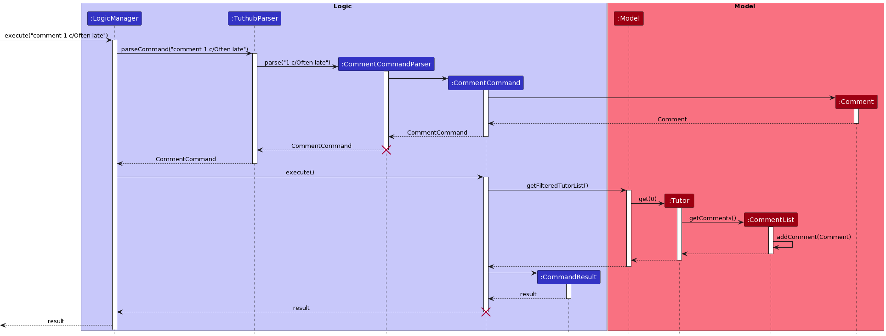

* Table of Contents
{:toc}

--------------------------------------------------------------------------------------------------------------------

## **Acknowledgements**

We'd like to thank:

* [SE-Edu's AddressBook-Level3](https://github.com/se-edu/addressbook-level3) for being the foundation of this brownfield project.
--------------------------------------------------------------------------------------------------------------------

## **Setting up, getting started**

Refer to the guide [_Setting up and getting started_](SettingUp.md).

--------------------------------------------------------------------------------------------------------------------

## **Design**

:bulb: **Tip:** The `.puml` files used to create diagrams in this document can be found in the [diagrams](https://github.com/AY2223S1-CS2103T-T15-3/tp/tree/master/docs/diagrams) folder. Refer to the [_PlantUML Tutorial_ at se-edu/guides](https://se-education.org/guides/tutorials/plantUml.html) to learn how to create and edit diagrams.

### Architecture

The ***Architecture Diagram*** given above explains the high-level design of the App.

Given below is a quick overview of main components and how they interact with each other.

**Main components of the architecture**

**`Main`** has two classes called [`Main`](https://github.com/AY2223S1-CS2103T-T15-3/tp/blob/master/src/main/java/seedu/address/Main.java) and [`MainApp`](https://github.com/AY2223S1-CS2103T-T15-3/tp/blob/master/src/main/java/seedu/address/MainApp.java). It is responsible for,
* At app launch: Initializes the components in the correct sequence, and connects them up with each other.
* At shut down: Shuts down the components and invokes cleanup methods where necessary.

[**`Commons`**](#common-classes) represents a collection of classes used by multiple other components.

The rest of the App consists of four components.

* [**`UI`**](#ui-component): The UI of the App.
* [**`Logic`**](#logic-component): The command executor.
* [**`Model`**](#model-component): Holds the data of the App in memory.
* [**`Storage`**](#storage-component): Reads data from, and writes data to, the hard disk.

**How the architecture components interact with each other**

The *Sequence Diagram* below shows how the components interact with each other for the scenario where the user issues the command `delete 1`.

Each of the four main components (also shown in the diagram above),

* defines its *API* in an `interface` with the same name as the Component.
* implements its functionality using a concrete `{Component Name}Manager` class (which follows the corresponding API `interface` mentioned in the previous point.

For example, the `Logic` component defines its API in the `Logic.java` interface and implements its functionality using the `LogicManager.java` class which follows the `Logic` interface. Other components interact with a given component through its interface rather than the concrete class (reason: to prevent outside component's being coupled to the implementation of a component), as illustrated in the (partial) class diagram below.

The sections below give more details of each component.

### UI component

The **API** of this component is specified in [`Ui.java`](https://github.com/AY2223S1-CS2103T-T15-3/tp/blob/master/src/main/java/seedu/address/ui/Ui.java)

The UI consists of a `MainWindow` that is made up of parts e.g.`CommandBox`, `ResultDisplay`, `TutorListPanel`, `StatusBarFooter` etc. All these, including the `MainWindow`, inherit from the abstract `UiPart` class which captures the commonalities between classes that represent parts of the visible GUI.

The `UI` component uses the JavaFx UI framework. The layout of these UI parts are defined in matching `.fxml` files that are in the `src/main/resources/view` folder. For example, the layout of the [`MainWindow`](https://github.com/AY2223S1-CS2103T-T15-3/tp/blob/master/src/main/java/seedu/address/ui/MainWindow.java) is specified in [`MainWindow.fxml`](https://github.com/AY2223S1-CS2103T-T15-3/tp/blob/master/src/main/resources/view/MainWindow.fxml)

The `UI` component,

* executes user commands using the `Logic` component.
* listens for changes to `Model` data so that the UI can be updated with the modified data.
* keeps a reference to the `Logic` component, because the `UI` relies on the `Logic` to execute commands.
* depends on some classes in the `Model` component, as it displays `Tutor` object residing in the `Model`.

### Logic component

**API** : [`Logic.java`](https://github.com/AY2223S1-CS2103T-T15-3/tp/blob/master/src/main/java/seedu/address/logic/Logic.java)

Here's a (partial) class diagram of the `Logic` component:

How the `Logic` component works:
1. When `Logic` is called upon to execute a command, it uses the `TuthubParser` class to parse the user command.
1. This results in a `Command` object (more precisely, an object of one of its subclasses e.g., `AddCommand`) which is executed by the `LogicManager`.
1. The command can communicate with the `Model` when it is executed (e.g. to add a tutor).
1. The result of the command execution is encapsulated as a `CommandResult` object which is returned back from `Logic`.

The Sequence Diagram below illustrates the interactions within the `Logic` component for the `execute("delete 1")` API call.

:information_source: **Note:** The lifeline for `DeleteCommandParser` should end at the destroy marker (X) but due to a limitation of PlantUML, the lifeline reaches the end of diagram.

Here are the other classes in `Logic` (omitted from the class diagram above) that are used for parsing a user command:

How the parsing works:
* When called upon to parse a user command, the `TuthubParser` class creates an `XYZCommandParser` (`XYZ` is a placeholder for the specific command name e.g., `AddCommandParser`) which uses the other classes shown above to parse the user command and create a `XYZCommand` object (e.g., `AddCommand`) which the `TuthubParser` returns back as a `Command` object.
* All `XYZCommandParser` classes (e.g., `AddCommandParser`, `DeleteCommandParser`, ...) inherit from the `Parser` interface so that they can be treated similarly where possible e.g, during testing.

### Model component
**API** : [`Model.java`](https://github.com/AY2223S1-CS2103T-T15-3/tp/blob/master/src/main/java/seedu/address/model/Model.java)

The `Model` component,

* stores tuthub data i.e., all `Tutor` objects (which are contained in a `UniqueTutorList` object).
* stores the currently 'selected' `Tutor` objects (e.g., results of a search query) as a separate _filtered_ list which is exposed to outsiders as an unmodifiable `ObservableList<Tutor>` that can be 'observed' e.g. the UI can be bound to this list so that the UI automatically updates when the data in the list change.
* stores a `UserPref` object that represents the user’s preferences. This is exposed to the outside as a `ReadOnlyUserPref` objects.
* does not depend on any of the other three components (as the `Model` represents data entities of the domain, they should make sense on their own without depending on other components)

:information_source: **Note:** An alternative (arguably, a more OOP) model is given below. It has a `Tag` list in the `Tuthub`, which `Tutor` references. This allows `Tuthub` to only require one `Tag` object per unique tag, instead of each `Tutor` needing their own `Tag` objects. 

### Storage component

**API** : [`Storage.java`](https://github.com/AY2223S1-CS2103T-T15-3/tp/blob/master/src/main/java/seedu/address/storage/Storage.java)

The `Storage` component,
* can save both tuthub data and user preference data in json format, and read them back into corresponding objects.
* inherits from both `TuthubStorage` and `UserPrefStorage`, which means it can be treated as either one (if only the functionality of only one is needed).
* depends on some classes in the `Model` component (because the `Storage` component's job is to save/retrieve objects that belong to the `Model`)

### Common classes

Classes used by multiple components are in the `tuthubbook.commons` package.

--------------------------------------------------------------------------------------------------------------------

## **Implementation**

This section describes some noteworthy details on how certain features are implemented.

### Adding tutors

Tutor information is stored as `Tutor` objects, which captures all the information that the tutor represents. When the user adds a tutor, the program creates a new `Tutor` object with the given information and adds it to the `ObservableList` to be displayed in the program. The `Model` class handles the checking of uniqueness while the `Storage` class handles the conversion of the `Tutor` object to a [JSON](https://www.json.org/) format and updating of the storage file in `{source_root}/data/Tuthub.json`.

The following methods in `Tuthub` manage the addition of tutors:
* `Tuthub#AddCommand(Tutor tutor)` - Adds the provided tutor to the list of tutors created
* `Tuthub#AddCommandParser(String args)` - Parses the command `add` and determines the attributes of the `Tutor` object created based on the given prefixes

Given below are the different steps taken when the user adds tutors.

Step 1: The user enters the command word add, followed by the prefixes and information that they want to store. Example: `add n/John Doe p/98765432 e/johnd@example.com m/CS2100 y/3 s/A0123456X tn/1 r/5.0 t/senior`.

Step 2: The program makes use of `TuthubParser` to make sense of the keyword and determine which parser to use to parse the arguments. In this case, the `AddCommandParser` is used.

Step 3: The `AddCommandParser` makes sense of the arguments through the use of the prefixes, with the help of `ParserUtil`, and creates an `AddCommand` object with the provided information in the form a `Tutor` object.

Step 4: The `AddCommand` object is executed. The `Tutor` object created in step 3 is added to the list of tutors captured in the `ModelManager` class, which then utilises the `UI` class to display the created `Tutor` object.

Step 5: The execution ends and returns a `CommandResult` object contained the success message to be displayed to the GUI to the user.

Design considerations:
* Alternative 1 (current choice): Add the tutor to a list that is maintained by the `Model` class
  * Pros: Tutor can be viewed in the GUI once added without requiring any additional reading from storage.
  * Cons: More complex implementation of `add` needed due to requirement for both adding to model and storage.
* Alternative 2: Add the tutor directly to the `Storage` class as a JSON object
  * Pros: Less memory needed to store an extra list, especially when there would be a large number of tutors
  * Cons: The `Storage` class would be handling both storing of the Tuthub file and providing of the list to the UI, which would violate OOP principles.

### Find Feature

This feature filters TutHub's filtered list of tutors based on a predicate on whether a tutor's attribute contains the keywords
being searched. User are to specify which attribute of the tutor to search for by including the prefix of the attribute when using the command.

<ins>Implementation</ins>

The `find` command involves the logic, model and UI components of Tuthub.
Tutor information is stored in a `Tutor` object, where each piece of information is an object on its own.
E.g. `Name`, `Phone`, `Email`. When the user wants to find a tutor, the user specifies the `Prefix` corresponding
to the specific attribute of the tutor followed by the keywords to be searched. `Tutor` objects that are matched the
keywords being searched are added to the `FilteredList` to be displayed in the program to the user.

The following methods in `tuthub` manage the finding of tutors:
* `tuthub#FindByNameCommand(NameContainsKeywordsPredicate predicate)` - Finds and adds tutors with names matching keywords to list of tutors displayed
* `tuthub#FindByPhoneCommand(PhoneContainsKeywordsPredicate predicate)` - Finds and adds tutors with phone number matching keywords to list of tutors displayed
* `tuthub#FindByEmailCommand(EmailContainsKeywordsPredicate predicate)` - Finds and adds tutors with emails matching keywords to list of tutors displayed
* `tuthub#FindByModuleCommand(ModuleContainsKeywordsPredicate predicate)` - Finds and adds tutors with modules matching keywords to list of tutors displayed
* `tuthub#FindByYearCommand(YearContainsKeywordsPredicate predicate)` - Finds and adds tutors with year matching keywords to list of tutors displayed
* `tuthub#FindByStudentIdCommand(StudenIdContainsKeywordsPredicate predicate)` - Finds and adds tutors with student ids matching keywords to list of tutors displayed
* `tuthub#FindByTeachingNominationCommand(TeachingNominationContainsKeywordsPredicate predicate)` - Finds and adds tutors with teaching nominations matching keywords to list of tutors displayed
* `tuthub#FindByRatingCommand(RatingContainsKeywordsPredicate predicate)` - Finds and adds tutors with rating matching keywords to list of tutors displayed
* `tuthub#FindByTagCommand(TagContainsKeywordsPredicate predicate)` - Finds and adds tutors with tags matching keywords to list of tutors displayed
* `tuthub#FindByPrefixParser(String args)` - Parses the `find` command and determines the `prefix` corresponding to the attribute to search through to find matching tutors
* `ModelManager#filteredTutors` - A `javafx.collections.transformation.FilteredList` that contains a list of filtered tutors according to a predicate
* `ModelManager#getFilteredTutorList()` - Returns the `filteredTutors` list
* `ModelManager#updateFilteredTutorList(Predicate<Tutor> predicate)` - Updates filtered list based on predicate

Given below is an example usage scenario when the user is finding tutors whose names contains alex.

Step 1: The user enter the command `find n/alex`.

Step 2: TutHub uses `TuthubParser` to determine which parser to use based on the command input by the user. In this case, `FindByPrefixParser` is used to parse the `find` command.

Step 3: `FindByPrefixCommandParser` parses the `find` command to determine the attribute to search through and the keywords input by the user.
`FindByPrefixCommandParser` creates a `FindByNameCommand` that extends `FindByPrefixCommand` with the keywords put into a `NameContainsKeywordsPredicate` object.

Step 4: The `FindByNameCommand` is executed and tutors with names containing the string alex are added to the filtered list of tutors that have names
containing the string alex captured in the `ModelManager` object, which makes use of the `UI` class to display the matching tutors.

Step 5: The execution ends, returning a `CommandResult` object that has the success message to be displayed to the user.

<ins>Design Considerations</ins>

**Aspect: How `find` should be implemented:**
- **Alternative 1:** `find` command integrates the use of prefixes in user input to determine which tutor attribute to search through. (i.e. `find n/alex`, `find s/A0123456X) **(chosen)**.
    - Pros: Better OOP practice as the resultant find commands are all subclasses of `FindByPrefixCommand`
    - Cons: Took more time to think of and implement.
- **Alternative 2:** Individual attributes of the tutor have their own find command (E.g. `findbyname`, `findbyemail`)
    - Pros: Easier to implement individual commands for each attribute.
    - Cons: Poor OOP practice the individual commands are all `find` commands and should not be a different class on its own. User also have more commands to remeber.

### View Feature
<ins>Implementation</ins>

Similar to the `help` command, the `view` command involves operations within the UI to display/hide the tutor details panel. The communication between the logic and UI classes is facilitated by the `CommandResult` class, where the following field has been added:
- `CommandResult#isView` - Indicates if the current command is a `view` command.

Given below is an example usage scenario when the user enters a `view` command in the command box and how the view mechanism behaves at each step (omitting the parsing details).

Step 1: The user enters the command `view 1`.

Step 2: Upon parsing, a new `ViewCommand` based on the valid index.

Step 3: When the `ViewCommand` is executed, a new `CommandResult` with `isView` set to `true` is created and `ModelManager#tutorToView` is updated with the selected tutor.

Step 4: Upon recognising the `CommandResult` is of `isView` type, `MainWindow` calls `logic#getTutorToView()` to get the tutor to be displayed, which is passed into `MainWindow#handleView(Tutor tutor)`.

Step 5: This causes the `TutorDetailsPanel` of the `tutor` to be set as visible, resulting in the side panel being displayed.

The following sequence diagram demonstrates the above operations (excluding the parsing details):

<ins>Design Considerations</ins>

**Aspect: Method to pass a `Tutor` to UI**
- **Alternative 1:** Store the tutor to be viewed as a field in `Model` **(chosen)**.
  - Pros: Better OOP practice since `Model` handles all the data related to tutors.
  - Cons: The `tutorToView` may be null if there are no tutors in the list to be displayed, so more checks may be needed.

- **Alternative 2:** Store the tutor in `CommandResult`.
  - Pros: Easier to implement and fewer methods may be needed in `Logic` and `Model` as the tutor can be passed to
  the `MainWindow` directly through `CommandResult`.
  - Cons: Poor OOP practice as it does not make sense for `CommandResult` to store a `Tutor`, and other commands do not
  require a `Tutor` object to be stored.

### Sort Feature

This command sorts `Tuthub`'s displayed list based on quantitative measures, such as teaching nominations and ratings. Users are allowed to choose to sort in ascending or descending order.

<ins>Implementation</ins>

The `sort` command involves the logic, model, and UI part of Tuthub. Most updates are made within the `ModelManager`, which are:
- `ModelManager#sortedFilteredTutors` - A `javafx.collections.transformation.SortedList` that contains `ModelManager#filteredTutors`.
- `ModelManager#getFilteredTutorList()` - Now returns the `sortedFilteredTutors` list.
- `ModelManager#updateSortedTutorList(Comparator<Tutor>)` - Similar to `ModelManager#updateFilteredTutorList`, but updates the Comparator instead of predicate.

Given below is an example usage scenario when the user enters a `view` command in the command box and how the sort mechanism behaves at each step.

Step 1: The user enters the command `sort a r/`.

Step 2: The `TuthubParser` verifies the `SortCommand#COMMAND_WORD`, and requests `SortCommandParser` to parse. The `SortCommandParser` verifies the appropriateness of the user input (`order` and `prefix`) and creates the proper `Comparator` based on the user request.

Step 3: Upon parsing, a new `SortCommand` is created based on the order, prefix, and comparator.

Step 4: In the `SortCommand` execution, the `model#updateSortedTutorList(Comparator<Tutor>)` is called upon with the proper `Comparator`. Then, a new `CommandResult` is created and stored in `LogicManager`.

Step 5: Upon recognising the `CommandResult`, `MainWindow` calls `logic#getFilteredTutorList()` to get the tutor cards to be displayed, which is passed as a constructor variable into `TutorListPanel`.

Step 6: Then, the `TutorListPanel` sets the items to view as the new and updated `sortedFilteredTutors` list.

The following sequence diagram demonstrates the above operations (excluding the parsing details):

<ins>Design Considerations</ins>

**Aspect: The scope of `sort` (should it be able to sort filtered tutors or not?)**
- **Alternative 1:** Able to sort any `FilteredList` (i.e. the original tutor list or a tutor list after executing a `find` command) **(chosen)**.
    - Pros: The `sort` feature achieves its primary purpose while also having a defensive implementation, as it does not directly access and affect `Tuthub#UniqueTutorList`
    - Cons: Took more time to think of and implement.

- **Alternative 2:** `sort` redefines the original `Tuthub#UniqueTutorList`.
    - Pros: Easier to implement.
    - Cons: Feature becomes limited and lacking of purpose. Direct changes to original `Tuthub#UniqueTutorList` is less defensive.

**Aspect: Keeping track of sorting and filtering of the tutor list**
- **Alternative 1:** Store the `FilteredList` in the `SortedList` **(chosen)**.
    - Pros: Better OOP practice since the `FilteredList` and `SortedList` variables can be kept `final`.
    - Cons: Implementation is easy, but may be confusing to understand why and how it works.

- **Alternative 2:** Store two lists, one for `FilteredList` and one for `SortedList`.
    - Pros: Idea is more simply understood. Serves the main purpose of `sort` if implemented correctly.
    - Cons: Complicated to implement and possibility of many bugs. Poor OOP practice as it may require reassigning of the `FilteredList` and `SortedList` variables.

### Comment feature

This command adds a comment to a tutor in `Tuthub`'s displayed list.

<ins>Implementation</ins>

The `comment` command involves the logic and model part of Tuthub.
Most updates are made within the `ModelManager`, which are:

Given below is an example usage scenario when the user enters a `comment` command in the command box and how the comment is added to the tutor.

Step 1: The user enters the command `comment 1 c/Often late`.

Step 2: The `TuthubParser` verifies the `CommentCommand#COMMAND_WORD`, and requests `CommentCommandParser` to parse.
The `CommentCommandParser` verifies the appropriateness of the user input (`index` and `comment`).

Step 3: Upon parsing, a new `CommentCommand` is created based on the index and the comment.

Step 4: In the `CommentCommand` execution, the `model#setTutor` is called upon with the `comment` added to the tutor. Then, a new `CommandResult` is created and stored in `LogicManager`.

The following sequence diagram demonstrates the above operations (excluding the parsing details):

<ins>Design Considerations</ins>

**Aspect: How are the comments stored?**
- **Alternative 1:** Store the comments as a list of comments, appending the comments to the list as needed. **(chosen)**
    - Pros: It is easier to add a `comment` and remove them from each tutor.
    - Cons: Took more time to think of and implement.

- **Alternative 2:** Store the `comment` as a string, replacing it everytime a new comment is added to the tutor.
    - Pros: Easier to implement.
    - Cons: It is harder to add and remove comments from each tutor, as the previous comments need to be copied and then added manually by the user.

--------------------------------------------------------------------------------------------------------------------

## **Documentation, logging, testing, configuration, dev-ops**

* [Documentation guide](Documentation.md)
* [Testing guide](Testing.md)
* [Logging guide](Logging.md)
* [Configuration guide](Configuration.md)
* [DevOps guide](DevOps.md)

--------------------------------------------------------------------------------------------------------------------

## **Appendix: Requirements**

### Product scope

**Target user profile**:

* tech-savvy tuition agents
* has to manage a significant number (up to hundreds) of tutor profiles
* seeks a more organised and systematic way of managing profiles as compared to excel sheets
* prefers desktop apps over other types
* can type fast
* prefers typing to mouse interactions
* is reasonably comfortable using CLI apps

**Value proposition**:
* _Problem_: Multiple entries of the same tutor information as they have to repeatedly enter the same information when applying for different jobs
* _Solution_: Our tuthub detects duplicate tutor profiles and merges the additional information into the existing profile.
    
* _Problem_: Too many tutors with no specific way to organise them systematically.
* _Solution_: Our tuthub can categorise the tutors based on different criteria and provides features to search for profiles easily.

### User stories

Priorities: High (must have) - `* * *`, Medium (nice to have) - `* *`, Low (unlikely to have) - `*`

| Priority | As a …​                               | I can …​                             | So that I can…​                                                                   |
|--------| --------------------------------------|--------------------------------------|-------------------------------------------------------------------------------------------|
| `* * *` | NUS Computing Professor                                  | list all tutor profiles              | get a quick view of all available tutors                                                  |
| `* * *` | NUS Computing Professor                                  | add a new tutor                      | track their profiles                                                                      |
| `* * *` | NUS Computing Professor                                  | find a specific tutor by name easily | filter tutor names                                                                        |
| `* * *` | NUS Computing Professor                                  | delete a tutor profile               | remove tutors that are no longer available for work                                       |
| `* * *` | NUS Computing Professor                                  | save data                            | there is a local backup on the computer                                                   |
| `* * *` | NUS Computing Professor                                  | exit the program                     |                                                                                           |
| `* *`  | NUS Computing Professor                                  | view a tutor's full profile          | find out more about their performance and contact details to reach out for future TA roles |

### Use cases

(For all use cases below, the **System** is `Tuthub` and the **Actor** is the `NUS Computing Professor`, unless specified otherwise)

**Use case: UC1 - Listing all tutor profiles**

**MSS**

1.  User requests to list all tutors.
2.  Tuthub shows a list of tutors.

    Use case ends.

**Extensions**

* 2a. The list is empty.

  Use case ends.

**Use case: UC2 - Viewing a specific tutor profile**

**MSS**

1. User requests to list all tutors.
2. User requests to view a specific tutor's details using their displayed index on the list.
3. Tuthub displays the full details of the Tutor on a side panel and shows a success message.

    Use case ends.

**Extensions**

* 2a. The input index is invalid.
    * Tuthub displays an error message.

      Use case resumes from step 2.

**Use case: UC3 - Add a tutor**

**MSS**

1.  User requests to add a tutor profile in the list.
2.  Tuthub shows the list of tutors with the new tutor profile added.

    Use case ends.

**Extensions**

* 1a. Tuthub detects an error in the entered data.
  * 1a1. Tuthub requests for the correct data.
  * 1a2. User enters new data.
  * Steps 1a1-1a2 are repeated until the data entered are correct.
    Use case resumes from step 2.

    Use case ends.

**Use case: UC4 - Delete a tutor**

**MSS**

1.  User requests to list tutors.
2.  Tuthub shows a list of tutors.
3.  User requests to delete a specific tutor in the list.
4.  Tuthub deletes the tutor.

    Use case ends.

**Extensions**

* 2a. The list is empty.

  Use case ends.

* 3a. The given index is invalid.

    * 3a1. Tuthub shows an error message.

      Use case resumes at step 2.

**Use case: UC5 - Finding tutors**

**MSS**

1. User requests to find tutors matching keywords searched.
2. Tuthub shows a list of tutors that match the keywords searched.

   Use case ends.

**Extensions**

* 1a. Tuthub detects an error in the entered data.
    * 1a1. Tuthub requests for the correct data.
    * 1a2. User enters new data.
    * Steps 1a1-1a2 are repeated until the data entered are correct.
      Use case resumes from step 2.

* 2a. The list is empty.

   Use case ends.

**Use case: UC6 - Exit the program**

**MSS**

1.  User requests to exit Tuthub.
2.  Tuthub saves list of tutor profiles in hard disk.

    Use case ends.

### Non-Functional Requirements

1. Should work on any _mainstream OS_ as long as it has Java `11` or above installed.
2. Should be able to hold up to 1000 tutors without a noticeable sluggishness in performance for typical usage.
3. Should work without internet connection.
4. A user with above average typing speed for regular English text (i.e. not code, not system admin commands) should be able to accomplish most of the tasks faster using commands than using the mouse.
5. Performance requirement: The system should respond within a second.
6. Technical requirement: The system should work on both 32-bit and 64-bit environments.
7. Constraints: The product should be for a single user i.e. (not a multi-user product).
8. Constraints: The product needs to be developed in a breadth-first incremental manner over the project duration.
9. Constraints: The data should be stored locally and should be in a human editable text file.
10. Constraints: The file size of the deliverables should be reasonable. Product (i.e. JAR/ZIP file) should not exceed 100 MB. Documents (i.e. PDF files) should not exceed 150 MB.

*{More to be added}*

### Glossary

* **Mainstream OS**: Windows, Linux, Unix, OS-X
* **Tutor Profile**: A profile containing the tutor's details, such as `NAME`, `PHONE_NUMBER`, `GENDER`, `EMAIL`, etc.

--------------------------------------------------------------------------------------------------------------------

## **Appendix: Instructions for manual testing**

Given below are instructions to test the app manually.

:information_source: **Note:** These instructions only provide a starting point for testers to work on;
testers are expected to do more *exploratory* testing.

### Launch and shutdown

1. Initial launch

   1. Download the jar file and copy into an empty folder

   1. Double-click the jar file Expected: Shows the GUI with a set of sample contacts. The window size may not be optimum.

2. Saving window preferences

   1. Resize the window to an optimum size. Move the window to a different location. Close the window.

   1. Re-launch the app by double-clicking the jar file. 
       Expected: The most recent window size and location is retained.

3. _{ more test cases …​ }_

### Viewing a tutor's full details

1. Viewing a tutor's full details

    1. Prerequisites: List all tutors using the `list` command. Multiple tutors in the list.

    2. Test case: `view 1` 
        Expected: Details panel of the first tutor in the list is displayed. Details of the tutor viewed shown in the status message.

    3. Test case: Click on the first tutor card in the list with mouse. 
       Expected: Details panel of the first tutor in the list is displayed. Details of the tutor viewed shown in the status message.

    4. Test case: `view 0` 
       Expected: No tutor panel displayed. Error details shown in the status message.

    5. Other incorrect view commands to try: `view`, `view x` (where x is larger than the list size) 
       Expected: Similar to previous.

### Deleting a tutor

1. Deleting a tutor while all tutors are being shown

   1. Prerequisites: List all tutors using the `list` command. Multiple tutors in the list.

   1. Test case: `delete 1` 
      Expected: First contact is deleted from the list. Details of the deleted contact shown in the status message. Timestamp in the status bar is updated.

   1. Test case: `delete 0` 
      Expected: No tutor is deleted. Error details shown in the status message. Status bar remains the same.

   1. Other incorrect delete commands to try: `delete`, `delete x`, `...` (where x is larger than the list size) 
      Expected: Similar to previous.

1. _{ more test cases …​ }_

### Saving data

1. Dealing with missing/corrupted data files

   1. _{explain how to simulate a missing/corrupted file, and the expected behavior}_

1. _{ more test cases …​ }_
