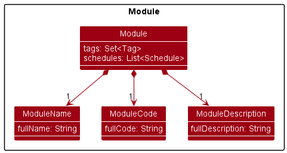
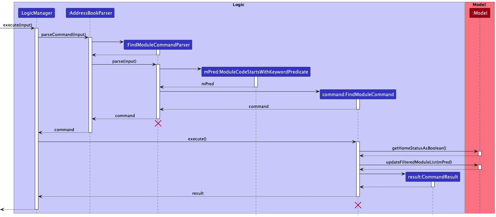

# **Developer Guide**

* Table of Contents

--------------------------------------------------------------------------------------------------------------------

## **Acknowledgements**

* {list here sources of all reused/adapted ideas, code, documentation, and third-party libraries -- include links to the
  original source as well}

--------------------------------------------------------------------------------------------------------------------

## **Setting up, getting started**

Refer to the guide [_Setting up and getting started_](SettingUp.md).

--------------------------------------------------------------------------------------------------------------------

## **Design**

:bulb: **Tip:** The `.puml` files used to create diagrams in this document can be found in
the [diagrams](https://github.com/se-edu/addressbook-level3/tree/master/docs/diagrams/) folder. Refer to the [_PlantUML
Tutorial_ at se-edu/guides](https://se-education.org/guides/tutorials/plantUml.html) to learn how to create and edit
diagrams.

### Architecture

The ***Architecture Diagram*** given above explains the high-level design of the App.

Given below is a quick overview of main components and how they interact with each other.

**Main components of the architecture**

**`Main`** has two classes
called [`Main`](https://github.com/se-edu/addressbook-level3/tree/master/src/main/java/seedu/address/Main.java)
and [`MainApp`](https://github.com/se-edu/addressbook-level3/tree/master/src/main/java/seedu/address/MainApp.java). It
is responsible for,

* At app launch: Initializes the components in the correct sequence, and connects them up with each other.
* At shut down: Shuts down the components and invokes cleanup methods where necessary.

[**`Commons`**](#common-classes) represents a collection of classes used by multiple other components.

The rest of the App consists of four components.

* [**`UI`**](#ui-component): The UI of the App.
* [**`Logic`**](#logic-component): The command executor.
* [**`Model`**](#model-component): Holds the data of the App in memory.
* [**`Storage`**](#storage-component): Reads data from, and writes data to, the hard disk.

**How the architecture components interact with each other**

The *Sequence Diagram* below shows how the components interact with each other for the scenario where the user issues
the command `delete 1`.

Each of the four main components (also shown in the diagram above),

* defines its *API* in an `interface` with the same name as the Component.
* implements its functionality using a concrete `{Component Name}Manager` class (which follows the corresponding
  API `interface` mentioned in the previous point.

For example, the `Logic` component defines its API in the `Logic.java` interface and implements its functionality using
the `LogicManager.java` class which follows the `Logic` interface. Other components interact with a given component
through its interface rather than the concrete class (reason: to prevent outside component's being coupled to the
implementation of a component), as illustrated in the (partial) class diagram below.

The sections below give more details of each component.

### UI component

The **API** of this component is specified
in [`Ui.java`](https://github.com/se-edu/addressbook-level3/tree/master/src/main/java/seedu/address/ui/Ui.java)

The UI consists of a `MainWindow` that is made up of parts e.g.`CommandBox`, `ResultDisplay`, `PersonListPanel`
, `StatusBarFooter` etc. All these, including the `MainWindow`, inherit from the abstract `UiPart` class which captures
the commonalities between classes that represent parts of the visible GUI.

The `UI` component uses the JavaFx UI framework. The layout of these UI parts are defined in matching `.fxml` files that
are in the `src/main/resources/view` folder. For example, the layout of
the [`MainWindow`](https://github.com/se-edu/addressbook-level3/tree/master/src/main/java/seedu/address/ui/MainWindow.java)
is specified
in [`MainWindow.fxml`](https://github.com/se-edu/addressbook-level3/tree/master/src/main/resources/view/MainWindow.fxml)

The `UI` component,

* executes user commands using the `Logic` component.
* listens for changes to `Model` data so that the UI can be updated with the modified data.
* keeps a reference to the `Logic` component, because the `UI` relies on the `Logic` to execute commands.
* depends on some classes in the `Model` component, as it displays `Person` object residing in the `Model`.

### Logic component

**
API** : [`Logic.java`](https://github.com/se-edu/addressbook-level3/tree/master/src/main/java/seedu/address/logic/Logic.java)

Here's a (partial) class diagram of the `Logic` component:

How the `Logic` component works:

1. When `Logic` is called upon to execute a command, it uses the `AddressBookParser` class to parse the user command.
1. This results in a `Command` object (more precisely, an object of one of its subclasses e.g., `AddCommand`) which is
   executed by the `LogicManager`.
1. The command can communicate with the `Model` when it is executed (e.g. to add a person).
1. The result of the command execution is encapsulated as a `CommandResult` object which is returned back from `Logic`.

The Sequence Diagram below illustrates the interactions within the `Logic` component for the `execute("delete 1")` API
call.

:information_source: **Note:** The lifeline for `DeleteCommandParser` should end at the destroy marker (X) but due to a limitation of PlantUML, the lifeline reaches the end of diagram.

Here are the other classes in `Logic` (omitted from the class diagram above) that are used for parsing a user command:

How the parsing works:

* When called upon to parse a user command, the `AddressBookParser` class creates an `XYZCommandParser` (`XYZ` is a
  placeholder for the specific command name e.g., `AddCommandParser`) which uses the other classes shown above to parse
  the user command and create a `XYZCommand` object (e.g., `AddCommand`) which the `AddressBookParser` returns back as
  a `Command` object.
* All `XYZCommandParser` classes (e.g., `AddCommandParser`, `DeleteCommandParser`, ...) inherit from the `Parser`
  interface so that they can be treated similarly where possible e.g, during testing.

### Model component

**
API** : [`Model.java`](https://github.com/se-edu/addressbook-level3/tree/master/src/main/java/seedu/address/model/Model.java)

The `Model` component,

* stores the address book data i.e., all `Person` or `Module` objects (which are contained in a `UniquePersonList` or
  a `UniqueModuleList` object respectively).
* stores the currently 'selected' `Person` or `Module` objects (e.g., results of a search query) as a separate _
  filtered_ list which is exposed to outsiders as an unmodifiable `ObservableList<Person>` or `ObservableList<Module>`
  that can be 'observed' e.g. the UI can be bound to this list so that the UI automatically updates when the data in the
  list change.
* stores a `UserPref` object that represents the user’s preferences. This is exposed to the outside as
  a `ReadOnlyUserPref` objects.
* does not depend on any of the other three components (as the `Model` represents data entities of the domain, they
  should make sense on their own without depending on other components)

### Storage component

**
API** : [`Storage.java`](https://github.com/se-edu/addressbook-level3/tree/master/src/main/java/seedu/address/storage/Storage.java)

The `Storage` component,

* can save both address book data and user preference data in json format, and read them back into corresponding
  objects.
* inherits from both `AddressBookStorage` and `UserPrefStorage`, which means it can be treated as either one (if only
  the functionality of only one is needed).
* depends on some classes in the `Model` component (because the `Storage` component's job is to save/retrieve objects
  that belong to the `Model`)

### Common classes

Classes used by multiple components are in the `seedu.addressbook.commons` package.

--------------------------------------------------------------------------------------------------------------------

## **Implementation**

This section describes some noteworthy details on how certain features are implemented.

### Module Class

#### Implementation

The [`Module`](https://github.com/AY2223S1-CS2103T-W12-1/tp/tree/master/src/main/java/seedu/address/model/module) Class
facilitates the storing of various information related to a student's module that he/she is currently taking.

A `Module` Class contains

* A `ModuleCode`
* `TutorialDetails`
* `LectureDetails`
* A lecture `ZoomLink`
* A tutorial `ZoomLink`
* `AssignmentDetails`

All fields except `ModuleCode` are optional since not every `Module` will have details for every field. Empty fields are
represented by empty strings. Users can later modify the fields using the `EditCommand`.

All the commands associated with the `Module` Class would have the keyword "Module" in their class name. For example,
the command to add a `Module` is referred to as a `AddModuleCommand`.

All the `Module` objects are contained in a `UniqueModuleList` object which ensures that no duplicate `Module` objects
can exist in the `UniqueModuleList` object, where the `UniqueModuleList` was implemented by Ying Ming. This is because
in NUS, there are no two modules with the same module code. Thus, the notion of equality is defined by default to be
two `Module` objects containing the same `ModuleCode` object.

All the classes contained within the `Module` Class all have a regex that checks for whether the user input for the
specific field is valid.

For the five classes,

* The `ModuleCode` should only contain alphanumeric characters and spaces, and it should not be blank.
* The `ZoomLink` should be either blank, or a valid URL.
* `AssignmentDetails` should only contain alphanumeric characters and spaces if added.

### Delete Module feature

#### Implementation

The DeleteModule commands extends `Command`, and takes in an `Index` to be deleted. Additionally, it implements the following operation:

* `DeleteModuleCommand#execute()` — Deletes the corresponding item in the given model according to the given index.

This operation is exposed in the `Model` interface as `Model#deleteModule()`.

Given below is an example usage scenario, and an object diagram to show the objects created during this command.

Step 1. The user launches the application. The `ReadOnlyAddressBook` will be initialized with the initial address book state.

Step 2. The user executes `deletem 1` command to delete the 1st module in the address book.
* The `deletem` command calls `AddressBookParser#parseCommand()`, which creates a `DeleteModuleCommandParser`.
* The `DeleteModuleCommandParser` gets the `Index` to be deleted, which is 1 in this case, and creates a `DeleteModuleCommand`.
* `DeleteModuleCommand` then calls `Model#deleteModule()`, and deletes the module from the model object corresponding to the number parsed.

The following object diagram illustrates the above example:

The following sequence diagram shows how the DeleteModule operation works:

:information_source: **Note:** The lifeline for `DeleteModuleCommandParser` should end at the destroy marker (X) but due to a limitation of PlantUML, the lifeline reaches the end of diagram.

### Find Module feature

#### Implementation

The FindModule command extends `Command`, and takes in an `ModuleCodeContainsKeywordsPredicate` to filter the module list by. Additionally, it implements the following operation:
* `FindModuleCommand#execute()`

This operation is exposed in the `Model` interface as `Model#updateFilteredModuleList()`.

Given below is an example usage scenario.

Step 1. The user launches the application. The `ReadOnlyAddressBook` will be initialized with the initial address book state.

Step 2. The user executes `findm CS2100` command to filter the module list by `CS2100`.
* The `findm CS2100` command calls `AddressBookParser#parseCommand()`, which creates a `FindModuleCommandParser`.
* The `FindModuleCommandParser` instantiates a `ModuleCodeContainsKeywordsPredicate` with the given keyword `CS2100`.
* The `FindModuleCommandParser` then creates a `FindModuleCommand` with the keyword.
* The `FindModuleCommand` then calls `Model#updateFilteredModuleList()` and filter the list to contain only Modules with the given keyword in their module code.

The following sequence diagram shows how the FindModule operation works:

:information_source: **Note:** The lifeline for `FindModuleCommandParser` should end at the destroy marker (X) but due to a limitation of PlantUML, the lifeline reaches the end of diagram.

### Add Module feature

#### Implementation

The AddModule commands extends `Command`, and takes in a `moduleCode`, `lectureDetails`, `tutorialDetails`, `zoomLink`
and multiple optional `assignmentDetails` to be added. Additionally, it implements the following operation:

* `AddModuleCommand#execute()`— Adds the corresponding module to the model.

This operation is exposed in the `Model` interface as `Model#addModule()`.

Given below is an example usage scenario, and an object diagram to show the objects created during this command.

Step 1. The user launches the application. The `ReadOnlyAddressBook` will be initialized with the initial address book
state.

Step 2. The user executes `addm m/CS1101S` command to add a module with the corresponding details in the address book. 
* The `addm` command calls `AddressBookParser#parseCommand()`, which creates a `AddModuleCommandParser`. 
* The `AddModuleCommandParser` then tokenizes the user input string and returns an `ArgumentMultimap` object that maps 
prefixes to their respective argument values. 
* Methods in `ParserUtil` is are then called to parse each individual object obtained from the `ArgumentMultimap` using
their corresponding parsers. 
* Then, a new `Module` with the corresponding details is created. 
* After creating the `Module`, an `AddModuleCommand` is created, which calls `Model#addModule()`, 
and adds the newly created module to the model object.

The following object diagram illustrates the above example:

The following sequence diagram shows how the AddModule operation works:

#### Design considerations:

**Aspect:**

* **Alternative 1 (current choice):** 
    * Pros: 
    * Cons: 

* **Alternative 2:**
    * Pros: 
    * Cons: 

_{more aspects and alternatives to be added}_

--------------------------------------------------------------------------------------------------------------------

## **Documentation, logging, testing, configuration, dev-ops**

* [Documentation guide](Documentation.md)
* [Testing guide](Testing.md)
* [Logging guide](Logging.md)
* [Configuration guide](Configuration.md)
* [DevOps guide](DevOps.md)

--------------------------------------------------------------------------------------------------------------------

## **Appendix: Requirements**

### Product scope

**Target user profile**:

* is from SoC
* has a need to manage a significant number of contacts
* has a need to manage the modules they are taking
* prefer desktop apps over other types
* can type fast
* prefers typing to mouse interactions
* is reasonably comfortable using CLI apps

**Value proposition**: Sole app that SoC students need to streamline their everyday routines

### User stories

Priorities: High (must have) - `* * *`, Medium (nice to have) - `* *`, Low (unlikely to have) - `*`

| Priority | As a …​            | I want to …​                                       | So that I can…​                                                 |
|----------|--------------------|----------------------------------------------------|-----------------------------------------------------------------|
| `* * *`  | SoC Student        | add a module                                       |                                                                 |
| `* * *`  | SoC Student        | add a new person                                   |                                                                 |
| `* * *`  | SoC Student        | delete a person                                    | remove entries that I no longer need                            |
| `* * *`  | SoC Student        | delete a module                                    | remove entries that I no longer need                            |
| `* * *`  | SoC Student        | add zoom links for my modules                      |                                                                 |
| `* * *`  | SoC Student        | delete zoom links                                  | remove entries that I no longer need                            |
| `* * *`  | SoC Student        | easily find my zoom links                          | not spend too much time finding them on various websites        |
| `* * *`  | SoC Student        | find a module and the specifics of the module      | not spend too much time finding information on various websites |
| `* * *`  | SoC Student        | add the deadline of my assignments for each module | easily keep track of my deadlines                               |
| `* * *`  | SoC Student        | find a contact easily                              | not spend too much time looking for contacts                    |
| `* *`    | SoC Student        | check my schedule for the day                      | plan ahead                                                      |
| `* *`    | SoC Student        | organise consultations easily                      | not need to search various websites to organise consultations   |
| `* *`    | SoC Student        | label my contacts                                  | keep track of my project groups                                 |
| `* *`    | SoC Student        | organise the deadlines of my assignments           | see which deadline is most pressing                             |
| `* *`    | SoC Student        | see the dates of my exams                          | better prepare for them                                         |
| `*`      | SoC Student        | add miscellaneous events                           | better plan my time                                             |
| `*`      | SoC Student        | archive the current information                    | reset for the new semester                                      |
| `*`      | SoC Student        | keep track of my interview dates                   | make ample preparations                                         |
| `*`      | SoC Student        | keep track of my weekly meetings                   | make preparations for them                                      |
| `*`      | Teaching Assistant | access document links for all my slides            | share with the class I am teaching                              |
| `*`      | Teaching Assistant | manage my student's consultation slots             | easily find the timing for their consultation                   |
| `*`      | Teaching Assistant | access my module website                           | grade my student's submission                                   |
| `*`      | Teaching Assistant | easily group my students' contacts together        | easily find them at once                                        |

### Use cases

(For all use cases below, the **System** is the `SoCompiler` and the **Actor** is the `user`, unless specified
otherwise)

**Use case:UC1 Add a person**

**MSS**

1. User requests to add person
2. SoCompiler adds the person to the list of persons

   Use case ends.

**Extensions**

* 1a. The given person already exists.

    * 1a1. SoCompiler shows an error message

      Use case ends.

* 1b. Necessary fields are empty.

    * 1b1. SoCompiler shows an error message

      Use case ends.

**Use case:UC2 Delete a person**

**MSS**

1. User requests to list persons
2. SoCompiler shows a list of persons
3. User requests to delete a specific person in the list
4. SoCompiler deletes the person

   Use case ends.

**Extensions**

* 2a. The list is empty.

  Use case ends.

* 3a. The given index is invalid.

    * 3a1. SoCompiler shows an error message.

      Use case resumes at step 2.

**Use case:UC3 Add a module**

**MSS**

1. User requests to add a module
2. SoCompiler adds the module to the list of modules

   Use case ends.

**Extensions**

* 1a. The given module already exists.

    * 1a1. SoCompiler shows an error message

      Use case ends.

* 1b. Necessary fields are empty.

    * 1b1. SoCompiler shows an error message

      Use case ends.

**Use case:UC4 Delete a module**

**MSS**

1. User requests to list module
2. SoCompiler shows a list of modules
3. User requests to delete a specific module in the list
4. SoCompiler deletes the module

   Use case ends.

**Extensions**

* 2a. The list is empty.

  Use case ends.

* 3a. The given index is invalid.

    * 3a1. SoCompiler shows an error message.

      Use case resumes at step 2.

**Use case:UC5 Find a person**

**MSS**

1. User requests to find keyword
2. SoCompiler shows a list of persons matching that keyword

   Use case ends.

**Use case:UC6 Find a module**

**MSS**

1. User requests to find keyword
2. SoCompiler shows a list of modules matching that keyword

   Use case ends.

**Use case:UC7 Display list of persons**

**MSS**

1. User requests to list persons
2. SoCompiler shows a list of persons

   Use case ends.

**Use case:UC8 Display list of modules**

**MSS**

1. User requests to list modules
2. SoCompiler shows a list of modules

   Use case ends.

**Use case:UC9 Edit entry in list of persons**

**MSS**

1. User requests to list persons
2. SoCompiler shows a list of persons
3. User requests to edit the fields of a specified person in the list
4. SoCompiler edits the fields of the specified person

   Use case ends.

**Extensions**

* 3a. The given index is invalid.

    * 3a1. SoCompiler shows an error message

      Use case ends.

* 3b. No field is provided.

    * 3b1. SoCompiler shows an error message

      Use case ends.

* 3c. The given name already exists.

    * 3c1. SoCompiler shows an error message

      Use case ends.

**Use case:UC10 Edit entry in list of persons**

**MSS**

1. User requests to list modules
2. SoCompiler shows a list of modules
3. User requests to edit the fields of a specified module in the list
4. SoCompiler edits the fields of the specified module

   Use case ends.

**Extensions**

* 3a. The given index is invalid.

    * 3a1. SoCompiler shows an error message

      Use case ends.

* 3b. No field is provided.

    * 3b1. SoCompiler shows an error message

      Use case ends.

* 3c. The given name already exists.

    * 3c1. SoCompiler shows an error message

      Use case ends.

*{More to be added}*

### Non-Functional Requirements

1. Should work on any _mainstream OS_ as long as it has Java `11` or above installed.
2. Should be able to hold up to 1000 persons and modules without a noticeable sluggishness in performance for typical
   usage.
3. A user with more than 50 words per minute typing speed for regular English text (i.e. not code, not system admin
   commands) should be able to accomplish most of the tasks faster using commands than using the mouse.
4. The system should be backward compatible with data stored in earlier versions of the system.
5. The product is not required to handle interaction with other users.

*{More to be added}*

### Glossary

* **Mainstream OS**: Windows, Linux, Unix, OS-X
* **Modules**: University modules offered in NUS

--------------------------------------------------------------------------------------------------------------------

## **Appendix: Instructions for manual testing**

Given below are instructions to test the app manually.

:information_source: **Note:** These instructions only provide a starting point for testers to work on;
testers are expected to do more *exploratory* testing.

### Launch and shutdown

1. Initial launch

    1. Download the jar file and copy into an empty folder

    1. Double-click the jar file Expected: Shows the GUI with a set of sample contacts. The window size may not be
       optimum.

1. Saving window preferences

    1. Resize the window to an optimum size. Move the window to a different location. Close the window.

    1. Re-launch the app by double-clicking the jar file. 
       Expected: The most recent window size and location is retained.

1. _{ more test cases …​ }_

### Deleting a person

1. Deleting a person while all persons are being shown

    1. Prerequisites: List all persons using the `list` command. Multiple persons in the list.

    1. Test case: `delete 1` 
       Expected: First contact is deleted from the list. Details of the deleted contact shown in the status message.
       Timestamp in the status bar is updated.

    1. Test case: `delete 0` 
       Expected: No person is deleted. Error details shown in the status message. Status bar remains the same.

    1. Other incorrect delete commands to try: `delete`, `delete x`, `...` (where x is larger than the list size) 
       Expected: Similar to previous.

1. _{ more test cases …​ }_

### Saving data

1. Dealing with missing/corrupted data files

    1. _{explain how to simulate a missing/corrupted file, and the expected behavior}_

1. _{ more test cases …​ }_
