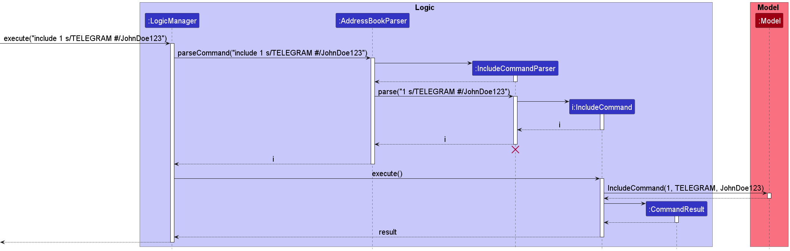
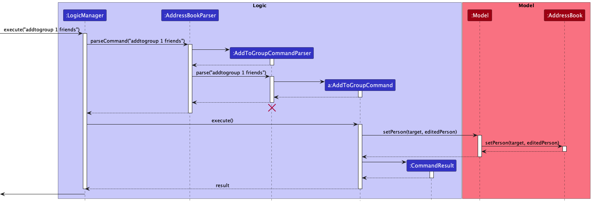

* [Acknowledgements](#acknowledgements)
* [Setting up, getting started](#setting-up-getting-started)
* [Design](#design)
    * [Architecture](#architecture)
    * [UI component](#ui-component)
    * [Logic component](#logic-component)
    * [Model component](#model-component)
    * [Storage component](#storage-component)
    * [Common classes](#common-classes)
* [Implementation](#implementation)
* [Documentation, logging, testing, configuration, dev-ops](#documentation-logging-testing-configuration-dev-ops)
* [Appendix: Requirements](#appendix-requirements)
* [Appendix: Instructions for manual testing](#appendix-instructions-for-manual-testing)
--------------------------------------------------------------------------------------------------------------------

## **Acknowledgements**

* uNivUSal is adapted based on the [**se-education.org**](https://se-education.org) initiative, [`AddressBook Level 3`](https://se-education.org/addressbook-level3).

--------------------------------------------------------------------------------------------------------------------

## **Setting up, getting started**

Refer to the guide [_Setting up and getting started_](SettingUp.md).

--------------------------------------------------------------------------------------------------------------------

## **Design**

:bulb: **Tip:** The `.puml` files used to create diagrams in this document can be found in the [diagrams](https://github.com/se-edu/addressbook-level3/tree/master/docs/diagrams/) folder. Refer to the [_PlantUML Tutorial_ at se-edu/guides](https://se-education.org/guides/tutorials/plantUml.html) to learn how to create and edit diagrams.

### Architecture

The ***Architecture Diagram*** given above explains the high-level design of the App.

Given below is a quick overview of main components and how they interact with each other.

**Main components of the architecture**

**`Main`** has two classes called [`Main`](https://github.com/se-edu/addressbook-level3/tree/master/src/main/java/seedu/address/Main.java) and [`MainApp`](https://github.com/se-edu/addressbook-level3/tree/master/src/main/java/seedu/address/MainApp.java). It is responsible for,
* At app launch: Initializes the components in the correct sequence, and connects them up with each other.
* At shut down: Shuts down the components and invokes cleanup methods where necessary.

[**`Commons`**](#common-classes) represents a collection of classes used by multiple other components.

The rest of the App consists of four components.

* [**`UI`**](#ui-component): The UI of the App.
* [**`Logic`**](#logic-component): The command executor.
* [**`Model`**](#model-component): Holds the data of the App in memory.
* [**`Storage`**](#storage-component): Reads data from, and writes data to, the hard disk.

**How the architecture components interact with each other**

The *Sequence Diagram* below shows how the components interact with each other for the scenario where the user issues the command `delete 1`.

Each of the four main components (also shown in the diagram above),

* defines its *API* in an `interface` with the same name as the Component.
* implements its functionality using a concrete `{Component Name}Manager` class (which follows the corresponding API `interface` mentioned in the previous point.

For example, the `Logic` component defines its API in the `Logic.java` interface and implements its functionality using the `LogicManager.java` class which follows the `Logic` interface. Other components interact with a given component through its interface rather than the concrete class (reason: to prevent outside component's being coupled to the implementation of a component), as illustrated in the (partial) class diagram below.

The sections below give more details of each component.

### UI component

The **API** of this component is specified in [`Ui.java`](https://github.com/se-edu/addressbook-level3/tree/master/src/main/java/seedu/address/ui/Ui.java)

The UI consists of a `MainWindow` that is made up of parts e.g.`CommandBox`, `ResultDisplay`, `PersonListPanel`, `StatusBarFooter` etc. All these, including the `MainWindow`, inherit from the abstract `UiPart` class which captures the commonalities between classes that represent parts of the visible GUI.

The `UI` component uses the JavaFx UI framework. The layout of these UI parts are defined in matching `.fxml` files that are in the `src/main/resources/view` folder. For example, the layout of the [`MainWindow`](https://github.com/se-edu/addressbook-level3/tree/master/src/main/java/seedu/address/ui/MainWindow.java) is specified in [`MainWindow.fxml`](https://github.com/se-edu/addressbook-level3/tree/master/src/main/resources/view/MainWindow.fxml)

The `UI` component,

* executes user commands using the `Logic` component.
* listens for changes to `Model` data so that the UI can be updated with the modified data.
* keeps a reference to the `Logic` component, because the `UI` relies on the `Logic` to execute commands.
* depends on some classes in the `Model` component, as it displays `Person` object residing in the `Model`.

### Logic component

**API** : [`Logic.java`](https://github.com/se-edu/addressbook-level3/tree/master/src/main/java/seedu/address/logic/Logic.java)

Here's a (partial) class diagram of the `Logic` component:

How the `Logic` component works:
1. When `Logic` is called upon to execute a command, it uses the `AddressBookParser` class to parse the user command & saves it into the `HistoryList` class.
1. This results in a `Command` object (more precisely, an object of one of its subclasses e.g., `AddCommand`) which is executed by the `LogicManager`.
1. The command can communicate with the `Model` when it is executed (e.g. to add a person).
1. The result of the command execution is encapsulated as a `CommandResult` object which is returned back from `Logic`.

The Sequence Diagram below illustrates the interactions within the `Logic` component for the `execute("delete 1")` API call.

:information_source: **Note:** The lifeline for `DeleteCommandParser` should end at the destroy marker (X) but due to a limitation of PlantUML, the lifeline reaches the end of diagram.

Here are the other classes in `Logic` (omitted from the class diagram above) that are used for parsing a user command:

How the parsing works:
* When called upon to parse a user command, the `AddressBookParser` class creates an `XYZCommandParser` (`XYZ` is a placeholder for the specific command name e.g., `AddCommandParser`) which uses the other classes shown above to parse the user command and create a `XYZCommand` object (e.g., `AddCommand`) which the `AddressBookParser` returns back as a `Command` object.
* All `XYZCommandParser` classes (e.g., `AddCommandParser`, `DeleteCommandParser`, ...) inherit from the `Parser` interface so that they can be treated similarly where possible e.g, during testing.

### Model component
**API** : [`Model.java`](https://github.com/se-edu/addressbook-level3/tree/master/src/main/java/seedu/address/model/Model.java)

The `Model` component,

* stores the address book data i.e., all `Person` objects (which are contained in a `UniquePersonList` object).
* stores the currently 'selected' `Person` objects (e.g., results of a search query) as a separate _filtered_ list which is exposed to outsiders as an unmodifiable `ObservableList<Person>` that can be 'observed' e.g. the UI can be bound to this list so that the UI automatically updates when the data in the list change.
* stores a `UserPref` object that represents the user’s preferences. This is exposed to the outside as a `ReadOnlyUserPref` objects.
* does not depend on any of the other three components (as the `Model` represents data entities of the domain, they should make sense on their own without depending on other components)

:information_source: **Note:** An alternative (arguably, a more OOP) model is given below. It has a `Tag` list in the `AddressBook`, which `Person` references. This allows `AddressBook` to only require one `Tag` object per unique tag, instead of each `Person` needing their own `Tag` objects. 

### Storage component

**API** : [`Storage.java`](https://github.com/se-edu/addressbook-level3/tree/master/src/main/java/seedu/address/storage/Storage.java)

The `Storage` component,
* can save both address book data and user preference data in json format, and read them back into corresponding objects.
* inherits from both `AddressBookStorage` and `UserPrefStorage`, which means it can be treated as either one (if only the functionality of only one is needed).
* depends on some classes in the `Model` component (because the `Storage` component's job is to save/retrieve objects that belong to the `Model`)

### Common classes

Classes used by multiple components are in the `seedu.addressbook.commons` package.

--------------------------------------------------------------------------------------------------------------------

## **Implementation**

This section describes some noteworthy details on how certain features are implemented.

### Social feature

#### Implementation

The social feature is facilitated by a new class `Social`, which will be a new field of the `Person` class. Additionally, it implements the following features:

* `Social#addWhatsapp()` - Adds a link to the Person object's Whatsapp account.
* `Social#addTelegram()` - Adds a link to the Person object's Telegram account.
* `Social#addInstagram()` - Adds a link to the Person object's Instagram account.
* `Social#addEmail()` - Adds a link to the Person object's Email account.
* `Social#prefer()` - Sets one of the added social media account to be the preferred mode of communication.
* `Social#deleteWhatsapp()` - Deletes the Whatsapp account of the Social class.
* `Social#deleteTelegram()` - Deletes the Telegram account of the Social class.
* `Social#deleteEmail()` - Deletes the Email account of the Social class.
* `Social#deleteInstagram()` - Deletes the Instagram account of the Social class.
* `Social#deletePreferred()` - Sets the preferred account of the Social class to null.
* `Social#openWhatsapp()` - Converts the Whatsapp account of the Social class into a link and opens the link on the default browser.
* `Social#openTelegram()` - Converts the Telegram account of the Social class into a link and opens the link on the default browser.
* `Social#openEmail()` - Converts the Email of the Social class into a link and opens the link on the default browser.
* `Social#openInstagram()` - Converts the Instagram account of the Social class into a link and opens the link on the default browser.
* `Social#openPreferred()` - Converts the preferred social media account of the Social class into a link and opens the link on the default browser.

The social feature also makes use of the IncludeCommand, ExcludeCommand, OpenCommand and PreferCommand which gets the user input to change the Social class of a Person object.
The following are features of the Command Classes that changes the Social class of a Person object by making use of the Social features above.

* `IncludeCommand#execute()` - Adds a link to the Person object's Social.
* `ExcludeCommand#execute()` - Deletes a link in the Person object's Social.
* `OpenCommand#execute()` - Opens a link in the Person object's Social.
* `PreferCommand#execute()` - Sets a preferred social medial in the Person object's Social.

:information_source: **Note:** 
The Social's open feature are also converted into Buttons under the PersonCard of the UI component.
When users click on the certain social media boxes of the Person in their contact, it runs the respective openXXX() feature of the Social class, where XXX is the social media account.

Given below is an example usage scenario and how the Social feature behaves at each step.

Step 1. The user executes `include 1 s/TELEGRAM #/JohnDoe123` to add the Telegram account `JohnDoe123` to the Telegram social media of the person at index `1` in the list.
The `AddressBookParser` then calls `IncludeCommand(1, TELEGRAM, JohnDoe123)` to add the command to the queue.
The `IncludeCommand` then calls `Social.addTelegram(JohnDoe123)` of the first person in the list to add the Telegram username `JohnDoe123`.

Step 2. The user executes `include 1 s/WHATSAPP #/12345678` to add the Whatsapp account `12345678` to the Whatsapp social media of the  person at index `1` in the list.
The `AddressBookParser` then calls `IncludeCommand(1, WHATSAPP, 12345678)` to add the command to the queue.
The `IncludeCommand` then calls `Social.addWhatsapp(12345678)` of the first person in the list to add the Whatsapp account `12345678`.

Step 3. The user executes `prefer 1 s/TELEGRAM` to set the preferred mode of communication of the person at index `1` in the list to the Telegram social media account.
The `AddressBookParser` then calls `PreferCommand.prefer(1, TELEGRAM)` to add the command to the queue.
The `PreferCommand` then calls `Social.prefer(TELEGRAM)` of the first person in the list to set the Telegram account as the preferred social media.

Step 4. The user realises that the added Telegram account of the first person is wrong. The user executes `include 1 s/TELEGRAM #/TomDoe321` to set the Telegram account `TomDoe321` to be the latest Telegram social media account of the first person in the list.
The `AddressBookParser` then calls `IncludeCommand(1, TELEGRAM, TomDoe321)` to add the command to the queue.
The `IncludeCommand` then calls `Social.addTelegram(TomDoe321)` of the first person in the list to add the Telegram username `TomDoe321`.

Step 5. The user realises that the preferred mode of communication of the first person in the list is actually Whatsapp. The user executes `prefer 1 s/WHATSAPP` to set the preferred mode of communication of the first person in the list to the Whatsapp social media account.
The `AddressBookParser` then calls `PreferCommand.prefer(1, WHATSAPP)` to add the command to the queue.
The `PreferCommand` then calls `Social.prefer(WHATSAPP)` of the first person in the list to set the Whatsapp account as the preferred social media.

Step 6. The user realises that the first person in the contact list does not have a Telegram account. THe user executes `exclude 1 s/TELEGRAM` to delete the Telegram social media account of the first person in the contact list.
The `AddressBookParser` then calls `ExcludeCommand(1, TELEGRAM)` to add the command to the queue.
The `ExcludeCommand` then calls `Social.deleteTelegram()` of the first person in the list to remove the Telegram account information.

The following sequence diagram shows how the `IncludeCommand(1, TELEGRAM, JohnDoe123)` command works:

### History feature

#### Implementation

The proposed history feature is facilitated by managing commands with the new `HistoryList` component. Additionally, it implements the following features:

* `HistoryList#addToHistory()` - Adds a command to a list.
* `HistoryList#isMax()` - Checks if the list already has five commands.
* `HistoryList#printList()` - Prints the current contents of the list.

Given below is an example usage scenario and how the grouping mechanism behaves at each step.

Step 1. The user executes `list` to see the list of contacts. The `AddressBookParser` then calls `HistoryList.addToHistory(list)` to add the command to the queue.

Step 2. The user executes `help` to get help for his commands. The `AddressBookParser` then calls `HistoryList.addToHistory(help)` to add the command to the queue.

Step 3. The user now wants to see his past few commands and executes `history` to see. The `HistoryCommand` then calls the `HistoryList.printList()` to show the previous commands.

The following sequence diagram shows how the `HistoryCommand()` command works:

:information_source: **Note:** If there are no previous commands, then a message indicating there are no commands will be printed.

### Grouping feature

#### Implementation

The grouping feature is facilitated by managing groups with the existing `model` component. Additionally, it implements the following features:

* `#AddToGroup()` - Adds a person to a group.
* `#Ungroup()` - Removes a person from a group.
* `#Group()` - Opens a group window to view group members.

Given below is an example usage scenario and how the grouping mechanism behaves at each step.

Step 1. The user executes `addtogroup 1 friends` to group the first person in the list with "friends".

Step 2. The `AddToGroupCommandParser#parse` then parses the arguments.

Step 3. A `AddToGroupCommand` object is then created.

Step 4. `AddToGroupCommand#execute` will then call `setPerson(target, editedPerson)`, hence updating the person in `AddressBook` to be in the group "friends".

Step 5. `CommandResult` contains the success message and the person is successfully added to the group "friends".

The following sequence diagram shows how the add to group operation works, the ungroup command also works in a similar way:

:information_source: **Note:** The lifeline for `AddToGroupCommandParser` should end at the destroy marker (X) but due to a limitation of PlantUML, the lifeline reaches the end of diagram.

### \[Proposed\] Undo/redo feature

#### Proposed Implementation

The proposed undo/redo mechanism is facilitated by `VersionedAddressBook`. It extends `AddressBook` with an undo/redo history, stored internally as an `addressBookStateList` and `currentStatePointer`. Additionally, it implements the following operations:

* `VersionedAddressBook#commit()` — Saves the current address book state in its history.
* `VersionedAddressBook#undo()` — Restores the previous address book state from its history.
* `VersionedAddressBook#redo()` — Restores a previously undone address book state from its history.

These operations are exposed in the `Model` interface as `Model#commitAddressBook()`, `Model#undoAddressBook()` and `Model#redoAddressBook()` respectively.

Given below is an example usage scenario and how the undo/redo mechanism behaves at each step.

Step 1. The user launches the application for the first time. The `VersionedAddressBook` will be initialized with the initial address book state, and the `currentStatePointer` pointing to that single address book state.

Step 2. The user executes `delete 5` command to delete the 5th person in the address book. The `delete` command calls `Model#commitAddressBook()`, causing the modified state of the address book after the `delete 5` command executes to be saved in the `addressBookStateList`, and the `currentStatePointer` is shifted to the newly inserted address book state.

Step 3. The user executes `add n/David …​` to add a new person. The `add` command also calls `Model#commitAddressBook()`, causing another modified address book state to be saved into the `addressBookStateList`.

:information_source: **Note:** If a command fails its execution, it will not call `Model#commitAddressBook()`, so the address book state will not be saved into the `addressBookStateList`.

Step 4. The user now decides that adding the person was a mistake, and decides to undo that action by executing the `undo` command. The `undo` command will call `Model#undoAddressBook()`, which will shift the `currentStatePointer` once to the left, pointing it to the previous address book state, and restores the address book to that state.

:information_source: **Note:** If the `currentStatePointer` is at index 0, pointing to the initial AddressBook state, then there are no previous AddressBook states to restore. The `undo` command uses `Model#canUndoAddressBook()` to check if this is the case. If so, it will return an error to the user rather
than attempting to perform the undo.

The following sequence diagram shows how the undo operation works:

:information_source: **Note:** The lifeline for `UndoCommand` should end at the destroy marker (X) but due to a limitation of PlantUML, the lifeline reaches the end of diagram.

The `redo` command does the opposite — it calls `Model#redoAddressBook()`, which shifts the `currentStatePointer` once to the right, pointing to the previously undone state, and restores the address book to that state.

:information_source: **Note:** If the `currentStatePointer` is at index `addressBookStateList.size() - 1`, pointing to the latest address book state, then there are no undone AddressBook states to restore. The `redo` command uses `Model#canRedoAddressBook()` to check if this is the case. If so, it will return an error to the user rather than attempting to perform the redo.

Step 5. The user then decides to execute the command `list`. Commands that do not modify the address book, such as `list`, will usually not call `Model#commitAddressBook()`, `Model#undoAddressBook()` or `Model#redoAddressBook()`. Thus, the `addressBookStateList` remains unchanged.

Step 6. The user executes `clear`, which calls `Model#commitAddressBook()`. Since the `currentStatePointer` is not pointing at the end of the `addressBookStateList`, all address book states after the `currentStatePointer` will be purged. Reason: It no longer makes sense to redo the `add n/David …​` command. This is the behavior that most modern desktop applications follow.

The following activity diagram summarizes what happens when a user executes a new command:

#### Design considerations:

**Aspect: How undo & redo executes:**

* **Alternative 1 (current choice):** Saves the entire address book.
    * Pros: Easy to implement.
    * Cons: May have performance issues in terms of memory usage.

* **Alternative 2:** Individual command knows how to undo/redo by
  itself.
    * Pros: Will use less memory (e.g. for `delete`, just save the person being deleted).
    * Cons: We must ensure that the implementation of each individual command are correct.

_{more aspects and alternatives to be added}_

### Sorting feature

#### Implementation

The sorting feature sorts persons based on the given input taken as field. It uses the Comparator function.

Given below is an example usage scenario and how the sorting mechanism behaves at each step.

Step 1. The user executes `sort n/` to sort the list by `n/` which is name, alphabetically.

Step 2. The `sortCommandParser#parse` then parses the arguments inputted.

Step 3. A `SortCommand` object is created.

Step 4. `SortCommand#execute` will then call `updateSortedPersonList(comoparator)`, hence updating the sorted list
in the `AddressBook` based on the parsed comparator, which was `NameComparator`.

Step 5. `CommandResult` contains a successful sort message and GUI will show the sorted list.

The following sequence diagram shows how the `createGroup()` command works:

:information_source: **Note:** The lifeline for `CreateGroupCommand` should end at the destroy marker (X) but due to a limitation of PlantUML, the lifeline reaches the end of diagram.

### \[Proposed\] Data archiving

_{Explain here how the data archiving feature will be implemented}_

--------------------------------------------------------------------------------------------------------------------

## **Documentation, logging, testing, configuration, dev-ops**

* [Documentation guide](Documentation.md)
* [Testing guide](Testing.md)
* [Logging guide](Logging.md)
* [Configuration guide](Configuration.md)
* [DevOps guide](DevOps.md)

--------------------------------------------------------------------------------------------------------------------

## **Appendix: Requirements**

### Product scope

**Target user profile**:

* is a 2103t student, TA or professor
* has a need to manage a significant number of contacts and their social media accounts
* prefer desktop apps over other types
* can type fast
* prefers typing to mouse interactions
* is reasonably comfortable using CLI apps

**Value proposition**: Students/TAs/Professors all have different preferred modes of communication. So our product will be able to link users to all the modes of communication of other users to make their lives' easier. (E.g providing quick links to other users telegram and nus mail and personal email, github, phone number etc)

### User stories

Priorities: High (must have) - `* * *`, Medium (nice to have) - `* *`, Low (unlikely to have) - `*`

| Priority | As a …​                                    | I want to …​                                                                | So that I can…​                                                         |
| -------- | ------------------------------------------ |-----------------------------------------------------------------------------|-------------------------------------------------------------------------|
| `* * *`  | potential user exploring the app           | see usage instructions                                                      | refer to instructions when I forget how to use the App                  |
| `* * *`  | user ready to start using the app          | add a new person                                                            | access them later on                                                    |
| `* * *`  | user who just started using the app        | edit a person’s name                                                        | correct any mistakes i might have made previously                       |
| `* * *`  | user currently using the app               | delete a person                                                             | remove entries that I no longer need and clear space in my address book |
| `* * *`  | currently using the app                    | list out all the information in my address book                             | see all the data I currently have                                       |
| `* * *`  | user currently using the app               | see the preferred modes of communication of the contacts in my address book | know what venue to contact them by                                      |
| `* * *`  | user currently using the app               | set the preferred modes of communication of the contacts in my address book | know what venue to contact them by next time                            |
| `* * *`  | user currently using the app               | add the different social media accounts of the contacts in my address book  | contact them through these social media                                 |
| `* * *`  | user currently using the app               | delete the social media accounts of the contacts in my address book         | remove social media accounts I entered wrongly                          |
| `* * *`  | user currently using the app               | open the social media accounts of the contacts in my address book           | quickly contact them                                                    |
| `* * *`  | user currently using the app               | view the history of previously typed commands                               | remember what I have typed previously                                   |
| `* * *`  | user currently using the app               | delete a specific field of a person                                         | remove fields of people that may no longer be correct                   |
| `* * *`  | user currently using the app               | find someone from their name or phone number                                | quickly contact them                                                    |
| `* * *`  | user currently using the app               | easily see the occupation of others in a profile picture                    | know from a glance which contact is a TA, Professor or student          |

### Use cases

(For all use cases below, the **System** is the `uNivUSal` and the **Actor** is the `user`, unless specified otherwise)
 
 

**Use case: Get Help**

**MSS**

1. User enters command ‘help’
2. uNivUSal displays help message to user

   Use case ends.
    

**Use case: Edit a person**

**MSS**

1. User wants to edit a person in uNivUSal
2. User requests to list people
3. uNivUSal shows a list of people
4. User edits the relevant fields they wish to edit of the person using edit command
5. uNivUSal displays the person with updated fields

   Use case ends.
    

**Use case: List people in uNivUSal**

**MSS**

1. User requests for the list of people in uNivUSal
2. uNivUSal displays the list of people to user

   Use case ends.
    

**Use case: Delete a person**

**MSS**

1. User requests to list people
2. uNivUSal shows a list of people
3. User selects person to be deleted based on the index
4. User deletes person from uNivUSal using delete command and the person’s index
5. uNivUSal displays updated list

   Use case ends.
    

**Use case: Delete a person's specified field**

**MSS**

1. User requests to list people
2. uNivUSal shows a list of people
3. User selects person to be deleted based on the index & specified field
4. User deletes person's field from uNivUSal using delete command, the person’s index & specified field
5. uNivUSal displays updated list

   Use case ends.
    

**Extensions**
* 2a. The list is empty.

  Use case ends.

* 3a. The given index is invalid.

    * 3a1. uNivUSal shows an error message.

      Use case resumes at step 2.

* 3b. The given field is invalid.

    * 3b1. uNivUSal shows an error message.

      Use case resumes at step 2.

**Use case: Find a person**

**MSS**

1. User requests to list people
2. uNivUSal shows a list of people
3. User selects person to be found based on the case-insensitive search with name or phone number
5. uNivUSal displays updated list

   Use case ends.
    

**Use case: See history**

**MSS**

1. User enters command ‘history’
2. System provides a list of previously typed commands

   Use case ends.
    

**Extensions**
* 2a. The history list is empty.

    * 2a1. uNivUSal shows an error message.

      Use case ends.

**Use case: Clear uNivUSal**

**MSS**

1. User enters command ‘clear’
2. System clears all the contacts in uNivUSal

   Use case ends.
    

**Use case: Add a person**

**MSS**

1. User wants to add a person to uNivUSal
2. User enters command ‘add’

   Use case ends.
    

**Extensions**

* 2a. The list is empty.

  Use case ends.

* 3a. The given person is invalid.

    * 3a1. uNivUSal shows an error message.

      Use case resumes at step 2.

**Use case: Add a social media account to an existing person in the contacts**

**MSS**

1. User requests to list contacts.
2. uNivUSal shows a list of contacts.
3. User requests to add a social media account to a specific contact in the list.
4. uNivUSal adds the social media account to the contact.

   Use case ends.
    

**Extensions**
* 2a. The list is empty.

  Use case ends.

* 3a. The given index is invalid.

    * 3a1. uNivUSal shows an error message.

      Use case resumes at step 2.

* 3b. The given social media account is invalid.
    * 3b1. uNivUSal shows an error message.

      Use case resumes at step 2.

**Use case: Delete a social media account of an existing person in the contacts**

**MSS**

1. User requests to list contacts.
2. uNivUSal shows a list of contacts.
3. User requests to delete a social media account of a specific contact in the list.
4. uNivUSal deletes the specific social media account of the contact.

   Use case ends.
    

**Extensions**
* 2a. The list is empty.

  Use case ends.

* 3a. The given index is invalid.

    * 3a1. uNivUSal shows an error message.

      Use case resumes at step 2.

* 3b. The given social media to be deleted is invalid.

    * 3b1. uNivUSal shows an error message.

      Use case resumes at step 2.

**Use case: Setting a preferred social media account of an existing person in the contacts**

**MSS**

1. User requests to list contacts.
2. uNivUSal shows a list of contacts.
3. User requests to add a social media account to a specific contact in the list.
4. uNivUSal adds the social media account to the contact.

   Use case ends.
    

**Extensions**
* 2a. The list is empty.

  Use case ends.

* 3a. The given index is invalid.

    * 3a1. uNivUSal shows an error message.

      Use case resumes at step 2.

* 3b. The given social media to be set is invalid.

    * 3b1. uNivUSal shows an error message.

      Use case resumes at step 2.

**Use case: Open a social media account of an existing person in the contacts**

**MSS**

1. User requests to list contacts.
2. uNivUSal shows a list of contacts.
3. User requests to open a social media account of a specific contact in the list.
4. uNivUSal opens the social media account to the contact.

   Use case ends.
    

**Extensions**
* 2a. The list is empty.

  Use case ends.

* 3a. The given index is invalid.

    * 3a1. uNivUSal shows an error message.

      Use case resumes at step 2.

* 3b. The given social media to be opened is invalid.

    * 3b1. uNivUSal shows an error message.

      Use case resumes at step 2.

### Non-Functional Requirements

1.  The system should work in 64-bit environments.
2.  The app should open within 5 seconds.
3.  uNivUSal should be able to hold at least 100 contacts.
4.  The app should be usable by a novice who has never used our app.
5.  The app should work on **Mainstream OS** as long as it has Java 11 or above installed.

### Glossary

* **Mainstream OS**: Windows, Linux, Unix, OS-X

--------------------------------------------------------------------------------------------------------------------

## **Appendix: Instructions for manual testing**

Given below are instructions to test the app manually.

:information_source: **Note:** These instructions only provide a starting point for testers to work on;
testers are expected to do more *exploratory* testing.

### Launch and shutdown

1. Initial launch

    1. Download the jar file and copy into an empty folder

   2.Double-click the jar file Expected: Shows the GUI with a set of sample contacts. The window size may not be optimum.

2. Saving window preferences

    1. Resize the window to an optimum size. Move the window to a different location. Close the window.

    2. Re-launch the app by double-clicking the jar file. 
       Expected: The most recent window size and location is retained.

### Deleting a person

1. Deleting a person while all persons are being shown

    1. Prerequisites: List all persons using the `list` command. Multiple persons in the list.

    2. Test case: `delete 1` 
       Expected: First contact is deleted from the list. Details of the deleted contact shown in the status message. Timestamp in the status bar is updated.

    3. Test case: `delete 0` 
       Expected: No person is deleted. Error details shown in the status message. Status bar remains the same.

    4. Other incorrect delete commands to try: `delete`, `delete x`, `...` (where x is larger than the list size) 
       Expected: Similar to previous.

### Saving data

1. Dealing with missing/corrupted data files

    1. _{explain how to simulate a missing/corrupted file, and the expected behavior}_

### Quick edit

1. Ensuring quick edit does nothing
    1. Prerequisites: Have at least 1 person shown in the main window, close, and restart the app.

    2. Click one of the person cards shown. On some platforms, a double click may be necessary. Clicking more than twice is fine. 
       Expected: an edit command shows up in the command box.

    3. Run the edit command. 
       Expected: the command runs without any problems.

    4. Undo the last command: `undo`  
       Expected: the undo command fails to undo any action because the last action does not modify the person.

## Social class tests

### Adding a social account
1. Adding a social account to an existing contact.
    1. Prerequisites: List all contacts using the list command. First contact has no social accounts filled out.
    2. Test case: `include 1 s/WHATSAPP #/12345678`  
       Expected: Whatsapp with number 12345678 added into the first contact of the list. Details of success command shown in status message.
    3. Test case: `include 1 s/WHATELEMAILGRAM #/failtest`  
       Expected: No Social details added. Error details shown in the status message. Contacts remain the same.
    4. Other incorrect include commands to try: `include 0 s/TELEGRAM #/failtest`, `include 1 s/TELEGRAM`.

### Deleting a social account
1. Deleting a social account to an existing contact.
    1. Prerequisites: List all contacts using the list command. First contact has social accounts filled out.
    2. Testcase: `exclude 1 s/WHATSAPP`  
       Expected: Whatsapp of first contact of the list becomes `<none>`. Details of success command shown in status message.
    3. Testcase: `exclude 1 s/WHATELEMAILGRAM`
       Expected: No Social details change. Error details shown in the status message. Contacts remain the same.
    4. Other incorrect exclude commands to try: `exclude 0 s/TELEGRAM`

### Setting a social account as preferred
1. Deleting a social account to an existing contact.
    1. Prerequisites: List all contacts using the list command. First contact has social accounts filled out.
    2. Testcase: `prefer 1 s/WHATSAPP`  
       Expected: PREFERRED social media box of the first contact set to WHATSAPP. Details of success command shown in status message.
    3. Testcase:`prefer 1 s/WHATELEMAILGRAM`
       Expected: No Social details change. Error details shown in the status message. Contacts remain the same.
    4. Other incorrect prefer commands to try: `prefer 0 s/TELEGRAM`

### Opening a social account using CLI
1. Deleting a social account to an existing contact.
    1. Prerequisites: List all contacts using the list command. First contact has social accounts filled out.
    2. Testcase:`open 1 s/WHATSAPP`  
       Expected: Default web browser opens link to the Whatsapp chat of the first contact. Details of success command shown in status message.
    3. Testcase:`open 1 s/WHATELEMAILGRAM`
       Expected: No Social details change. Error details shown in the status message. Contacts remain the same. No links opened on default browser.
    4. Other incorrect open commands to try: `prefer 0 s/TELEGRAM`

### Opening a social account by clicking GUI
1. Deleting a social account to an existing contact.
    1. Prerequisites: List all contacts using the list command. First contact has social accounts filled out. Second contact has no social accounts filled out.
    2. Testcase: Click on the Whatsapp social box of the first person in the contact list.
       Expected: Default web browser opens link to the Whatsapp chat of the first contact. Details of success command shown in status message.
    3. Testcase: Click on the Whatsapp social box of the second person in the contact list.
       Expected: Popup window with error details shown. No Social details change. Contacts remain the same. No links opened on default browser.

