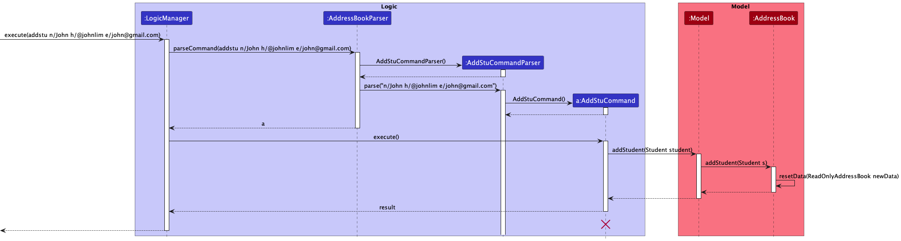
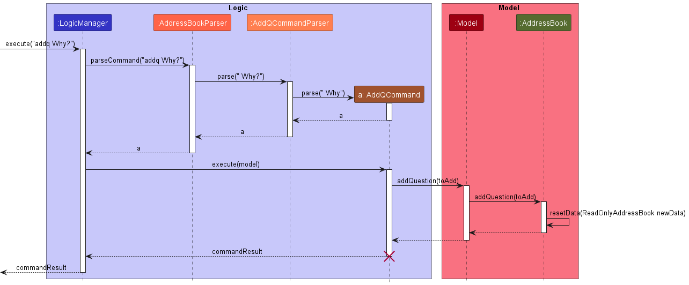
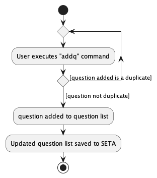

* Table of Contents {:toc}

--------------------------------------------------------------------------------------------------------------------

## **Acknowledgements**

* {list here sources of all reused/adapted ideas, code, documentation, and third-party libraries -- include links to the
  original source as well}

--------------------------------------------------------------------------------------------------------------------

## **Setting up, getting started**

Refer to the guide [_Setting up and getting started_](SettingUp.md).

--------------------------------------------------------------------------------------------------------------------

## **Design**

:bulb: **Tip:** The `.puml` files used to create diagrams in this document can be found in
the [diagrams](https://github.com/AY2223S1-CS2103T-T08-4/tp/tree/master/docs/diagrams/) folder. Refer to the [_PlantUML
Tutorial_ at se-edu/guides](https://se-education.org/guides/tutorials/plantUml.html) to learn how to create and edit
diagrams.

### Architecture

The ***Architecture Diagram*** given above explains the high-level design of the App.

Given below is a quick overview of main components and how they interact with each other.

**Main components of the architecture**

**`Main`** has two classes
called [`Main`](https://github.com/AY2223S1-CS2103T-T08-4/tp/blob/master/src/main/java/seedu/address/Main.java)
and [`MainApp`](https://github.com/AY2223S1-CS2103T-T08-4/tp/blob/master/src/main/java/seedu/address/MainApp.java) It is
responsible for,

* At app launch: Initializes the components in the correct sequence, and connects them up with each other.
* At shut down: Shuts down the components and invokes cleanup methods where necessary.

[**`Commons`**](#common-classes) represents a collection of classes used by multiple other components.

The rest of the App consists of four components.

* [**`UI`**](#ui-component): The UI of the App.
* [**`Logic`**](#logic-component): The command executor.
* [**`Model`**](#model-component): Holds the data of the App in memory.
* [**`Storage`**](#storage-component): Reads data from, and writes data to, the hard disk.

**How the architecture components interact with each other**

The *Sequence Diagram* below shows how the components interact with each other for the scenario where the user issues
the command `deleteq 1`.

Each of the four main components (also shown in the diagram above),

* defines its *API* in an `interface` with the same name as the Component.
* implements its functionality using a concrete `{Component Name}Manager` class (which follows the corresponding
  API `interface` mentioned in the previous point.

For example, the `Logic` component defines its API in the `Logic.java` interface and implements its functionality using
the `LogicManager.java` class which follows the `Logic` interface. Other components interact with a given component
through its interface rather than the concrete class (reason: to prevent outside component's being coupled to the
implementation of a component), as illustrated in the (partial) class diagram below.

The sections below give more details of each component.

### UI component

The **API** of this component is specified
in [`Ui.java`](https://github.com/AY2223S1-CS2103T-T08-4/tp/blob/master/src/main/java/seedu/address/ui/Ui.java)

The UI consists of a `MainWindow` that is made up of parts e.g.`CommandBox`, `ResultDisplay`, `StudentListPanel`,
`QuestionListPanel`, `TutorialListPanel`, `StatusBarFooter` etc. All these, including the `MainWindow`,
inherit from the abstract `UiPart` class which captures the commonalities between classes that represent parts of the
visible GUI.

The `UI` component uses the JavaFx UI framework. The layout of these UI parts are defined in matching `.fxml` files that
are in the `src/main/resources/view` folder. For example, the layout of
the [`MainWindow`](https://github.com/AY2223S1-CS2103T-T08-4/tp/blob/master/src/main/java/seedu/address/ui/MainWindow.java)
is specified
in [`MainWindow.fxml`](https://github.com/AY2223S1-CS2103T-T08-4/tp/blob/master/src/main/resources/view/MainWindow.fxml)

The `UI` component,

* executes user commands using the `Logic` component.
* listens for changes to `Model` data so that the UI can be updated with the modified data.
* keeps a reference to the `Logic` component, because the `UI` relies on the `Logic` to execute commands.
* depends on some classes in the `Model` component, as it displays `Student`, `Question` and `Tutorial` objects
* residing in the `Model`.

### Logic component

**
API** : [`Logic.java`](https://github.com/AY2223S1-CS2103T-T08-4/tp/blob/master/src/main/java/seedu/address/logic/Logic.java)

Here's a (partial) class diagram of the `Logic` component:

How the `Logic` component works:

1. When `Logic` is called upon to execute a command, it uses the `AddressBookParser` class to parse the user command.
1. This results in a `Command` object (more precisely, an object of one of its subclasses e.g., `AddStuCommand`) which
   is
   executed by the `LogicManager`.
1. The command can communicate with the `Model` when it is executed (e.g. to add a person).
1. The result of the command execution is encapsulated as a `CommandResult` object which is returned back from `Logic`.

The Sequence Diagram below illustrates the interactions within the `Logic` component for the `execute("deletestu 1")`
API
call.

:information_source: **Note:** The lifeline for `DeleteCommandParser` should end at the destroy marker (X) but due to a limitation of PlantUML, the lifeline reaches the end of diagram.

Here are the other classes in `Logic` (omitted from the class diagram above) that are used for parsing a user command:

How the parsing works:

* When called upon to parse a user command, the `AddressBookParser` class creates an `XYZCommandParser` (`XYZ` is a
  placeholder for the specific command name e.g., `AddStuCommandParser`) which uses the other classes shown above to
  parse
  the user command and create a `XYZCommand` object (e.g., `AddStuCommand`) which the `AddressBookParser` returns back
  as
  a `Command` object.
* All `XYZCommandParser` classes (e.g., `AddStuCommandParser`, `DeleteStuCommandParser`, ...) inherit from the `Parser`
  interface so that they can be treated similarly where possible e.g, during testing.

### Model component

**
API** : [`Model.java`](https://github.com/AY2223S1-CS2103T-T08-4/tp/blob/master/src/main/java/seedu/address/model/Model.java)

The `Model` component,

* stores the address book data i.e., all `Student` objects (which are contained in a `UniqueStudentList` object), all
  `Question` objects (which are contained in a `UniqueQuestionList` object), all `Tutorial` objects (which are
  contained
  in a `UniqueTutorialList` object)
* stores the currently 'selected' `Student` objects (e.g., results of a search query) as a separate _filtered_ list
  which
  is exposed to outsiders as an unmodifiable `ObservableList<Student>` that can be 'observed' e.g. the UI can be
  bound to
  this list so that the UI automatically updates when the data in the list change. The same applies to `Question`
  objects with `ObservableList<Question>`, and `Tutorial` objects with `ObservableList<Tutorial>`
* stores a `UserPref` object that represents the user’s preferences. This is exposed to the outside as
  a `ReadOnlyUserPref` objects.
* does not depend on any of the other three components (as the `Model` represents data entities of the domain, they
  should make sense on their own without depending on other components)

### Storage component

**
API** : [`Storage.java`](https://github.com/AY2223S1-CS2103T-T08-4/tp/blob/master/src/main/java/seedu/address/storage/Storage.java)

The `Storage` component,

* can save both address book data and user preference data in json format, and read them back into corresponding
  objects.
* inherits from both `AddressBookStorage` and `UserPrefStorage`, which means it can be treated as either one (if only
  the functionality of only one is needed).
* depends on some classes in the `Model` component (because the `Storage` component's job is to save/retrieve objects
  that belong to the `Model`)

### Common classes

Classes used by multiple components are in the `seedu.addressbook.commons` package.

--------------------------------------------------------------------------------------------------------------------

## **Implementation**

This section describes some noteworthy details on how certain features are implemented.

### Add Student feature

The Add Student feature allows CS2103T TAs to add a new `Student` object to the student list. When successfully added,
the student will be added on the Graphical User Interface.

#### Implementation

The Add Student mechanism is facilitated by `AddressBook`.
It implements the following operations:

* `AddressBook#hasStudent(Student s)` - Returns true if a student with the same identity as Student s exists in the
  address book.
* `AddressBook#addStudent(Student student)` - Adds a student to the address book.

These operations are exposed in the Model interface as `Model#hasStudent(Student student)`
and `Model#addStudent(Student student)` respectively.

Given below is an example usage scenario and how the `addstu` mechanism behaves at each step.

Step 1. The user launches the application for the first time. The `AddressBook` will be initialised with the initial
json data stored.

Step 2. The user execute `addstu n/John Doe...` command to add student called John Doe to the address book.
The `addstu` command calls `AddStuCommandParser#parse()` which parses the string keyed into the command line of the GUI.

Step 3. `AddStuCommandParser#parse()` invokes the creation of an `AddStuCommand` object.

**Note:** If a command fails its execution due to incorrect command format, it will not create a `AddStuCommand` object,
User will retype their command.

Step 4. Upon creation of `AddStuCommand` object, `Model#hasStudent(Student student)`
and `Model#addStudent(Student student)`
methods are called.

**Note:** If upon invoking `Model#hasStudent(Student s)` method and return value is `true`, it will not
call `Model#addStudent(Student student)`,
so the student will not be added into the student list as student already exist in the list.

Step 5. After successfully adding student to the student list, a `CommandResult` object will be created to tell the user
that the student has been successfully added.

The following sequence diagram shows how the add student operation works:

The following activity diagram summarizes what happens when a user executes a new `addstu` command.

#### Design Considerations

**Aspect: How AddStu executes::**

- **Alternative 1: Require user to key in response and attendance number in when adding student**
    - Pros: More details of a student can be viewed right after adding a student
    - Cons: Troublesome for CS2103T TAs to add a student quickly as many details have to be keyed in if what they want
      is to just keep track of the students name and contact name.
- **Alternative 2: Only name, telegram handle and email needs to be keyed in when adding student**
    - Pros: Faster to add a student
    - Cons: CS2103T TA has to use another command to change the response and attendance number of the student.

### Add Response feature

The `AddResponse` feature allows users to edit the response count of a `Student` object. When successfully edited,
the response count will be updated on the Graphical User Interface.

#### Implementation

The response mechanism is facilitated by `UniqueStudentList`. It is stored internally as a `Response` along with other
attributes of a `Student`. It is first initialized upon creation of a `Student` object and set as a `null`.

Given below is an example usage scenario and how the response mechanism behaves at each step.

Step 1. The user launches the application for the first time. The `UniqueStudentList` will be initialized with the
initial json data stored.

Step 2. The user executes `addresponse 1 m/7` command to add a response count to the first student in the
one-indexed `UniqueStudentList`. The `addresponse` command will call `AddResponseCommandParser#parse()`.

**Note:**

1. If the index given is not a valid index (ie, out of bounds or negative), it will return an error to the user rather
   than attempting to execute the command.
2. If the review is missing an `index`, or a category (`m/`), `AddResponseCommandParser` will throw an `ParseException`
   to the user with an error message specifying that the command parameters are incorrect, and an example usage of the
   command.

Step 3. `AddResponseCommandParser` returns an `AddResponseCommand` with the newly created `Response` as a parameter.

Step 4. `AddResponseCommand` calls `Model#setStudent` and `Model#updateFilteredStudentList` to edit the response
attribute of the `Student`.

Step 5. After successfully editing the response attribute, `AddResponseCommand` will return the `CommandResult` to the
`Ui`.

The following sequence diagram shows how the add response feature is executed:

The following activity diagram summarizes what happens when a user executes a new command:

#### Design Considerations

**Aspect: How AddResponse executes:**

- **Alternative 1**: Only the number of responses on zoom recorded
    - Pros: Easy to implement
    - Cons: No check on quality of messages sent, which might be factored in to give participation marks for CS2103T
- **Alternative 2**: Number of responses and content of responses on zoom recorded
    - Pros: More comprehensive, users can check the quality of responses to award participation marks correspondingly
    - Cons: More memory consumed, takes quite long to implement on top of other features to be implemented in 4 weeks
      before feature freeze.

### Add Question feature

#### Implementation

The proposed add question mechanism is facilitated by `AddressBook`.
It implements the following operations:

* `AddressBook#hasQuestion(Question question)` - Returns true if a question with the same identity as Question question
  exists in the
  address book.
* `AddressBook#addQuestion(Question question)` - Adds a question to the question list in the address book.

These operations are exposed in the Model interface as `Model#hasQuestion(Question question)`
and `Model#addQuestion(Question question)` respectively.

Given below is an example usage scenario and how the addq mechanism behaves at each step.

Step 1. The user launches the application for the first time. The `AddressBook` will be initialised with the initial
address book state.

Step 2. The user execute `addq Why?` command to add question called "Why?" to the question list ('UniqueQuestionList').
The `addq` command calls `Model#setAddressBook(ReadOnlyAddressBook addressBook)`, causing the modified address book
after the `addq Why?` command executes to be saved in the `addressBook`.

**Note:**

1. If a command fails its execution
   due to incorrect command format, it will not call `Model#setAddressBook(ReadOnlyAddressBook addressBook)`,
   so the address book state will not be saved into `addressBook`. User will retype their command.
2. If upon invoking `AddressBook#hasQuestion`
   method and return value is `true`, it will not call `Model#setAddressBook(ReadOnlyAddressBook addressBook)`,
   so 'UniqueQuestionList' and `addressBook` will not be updated.
3. Questions added not case-sensitive. For
   example, if a question in the `question list` is "why?", another question called "WHY?" can be added. Duplicates are
   not allowed. E.g. adding another question called "why?".

The following sequence diagram shows how the add question operation works:

The following activity diagram summarizes what happens when a user executes a new `addq` command.

#### Design considerations:

**Aspect: How addq executes:**

* **Alternative 1 (current choice):** Saves the question inside the entire address book.
    * Pros: Easy to implement.
    * Cons: If the data file is corrupted, all questions added are lost.

* **Alternative 2:** Add questions to a separate list not part of the address book.
    * Pros: Easier to test as data is stored separately.
    * Cons: Having separate lists will cause the code to be more complicated.

_{more aspects and alternatives to be added}_

### Add Attendance feature

#### Implementation

The proposed add attendance mechanism is facilitated by `UniqueStudentList`.
It is stored internally as an `Attendance` along with other attributes of a `Student`.
It is first initialized upon creation of a `Student` object and set as `0`.

Given below is an example usage scenario and how the attendance machanism behaves at each step.

Step 1. The user launches the application for the first time. The `UniqueStudentList` will be initialized with the
initial Json data stored.

Step 2. The user executes `attendance 1` command to increment the attendance of the 1st student in the one-indexed
`UniqueStudentList`. The `attendance` command calls `AttendanceCommandParser#parse()`).

**Note:**

1. If the index given is not a valid index (ie, out of bounds or negative), it will return an error to the user.
2. If the resulting attendance is not a valid number (ie, out of bounds or negative), it will return an error to the
   user.

Step 3. `AttendanceCommandParser` returns and `AttendanceCommand` with the newly created `Attendance` as a parameter.

Step 4. `AttendanceCommand` calls `Model#setStudent` and `Model#updateFilteredStudentList` to edit the attendance
attribute of the `Student`.

Step 5. After successfully editing the attendance attribute, `AttendanceCommand` will return the `CommandResult` to the
`Ui`.

The following sequence diagram shows how the attendance feature is executed.

The following activity diagram summarizes what happens when a user executes a new `attendance` command.

#### Design Considerations

**Aspect: How Attendance executes:**

- **Alternative 1 (current choice):** Increment attendance of student by 1.
    - Pros: Easy to implement
    - Cons: We are unable to decrement attendance. The workaround to this is by the `editstu` command to change the
      attendance to a value input by user.
- **Alternative 2:** Increment or decrement attendance of student by taking in a sign and a value.
    - Pros: Attendance can be modified easily.
    - Cons: Implementation is relatively complicated and require more exception handling.

--------------------------------------------------------------------------------------------------------------------

## **Documentation, logging, testing, configuration, dev-ops**

* [Documentation guide](Documentation.md)
* [Testing guide](Testing.md)
* [Logging guide](Logging.md)
* [Configuration guide](Configuration.md)
* [DevOps guide](DevOps.md)

--------------------------------------------------------------------------------------------------------------------

## **Appendix: Requirements**

### Product scope

**Target user profile**:

* CS2103T Teaching Assistants managing one or more tutorials
* has a need to manage a significant amount of tasks in a week other than their tutorials
* prefer desktop apps over other types
* can type fast and is reasonably comfortable using CLI apps
* has no access to other time management systems

**Value proposition**: They have difficulties keeping track of students' participation in zoom, telegram handles and
schedule. The UI of the current application is not aesthetically pleasing and not intuitive enough.

### User stories

Priorities: High (must have) - `* * *`, Medium (nice to have) - `* *`, Low (unlikely to have) - `*`

| Priority | As a …​    | I want to …​                                        | So that I can…​                                                     |
|----------|------------|-----------------------------------------------------|---------------------------------------------------------------------|
| `* * *`  | CS2103T TA | add a new student                                   | keep track of my student's name, email and telegram handle          |
| `* * *`  | CS2103T TA | edit a student                                      | correct any errors or make any changes if needed                    |
| `* * *`  | CS2103T TA | delete a student                                    | remove entries I no longer need                                     |
| `* * *`  | CS2103T TA | add student's attendance                            | track student's attendance for grading purposes                     |
| `* * *`  | CS2103T TA | add students' response count                        | keep track of student's participation                               |
| `* * `   | CS2103T TA | add help tag to a student                           | see which students need more attention                              |
| `* * `   | CS2103T TA | find specific student(s)                            | see the details of the specific student(s)                          |
| `* * *`  | CS2103T TA | list out all my students                            | have an overview of all the students under me                       |
| `* * *`  | CS2103T TA | add questions asked by students during the tutorial | address them in the future                                          |
| `* * *`  | CS2103T TA | delete a question in the list of questions          | remove the questions that I have addressed                          |
| `* * `   | CS2103T TA | mark a question as important                        | to prioritise which questions to address first                      |
| `* * `   | CS2103T TA | mark a question as unimportant                      | undo the action of accidentally marking such questions as important |
| `* * *`  | CS2103T TA | list out all the question's details                 | have an overview of all the questions I have                        |
| `* * *`  | CS2103T TA | add a new tutorial                                  | keep track of the time and group number of a tutorial               |
| `* * *`  | CS2103T TA | delete a tutorial                                   | remove a tutorial I have already finished                           |
| `* * `   | CS2103T TA | mark a tutorial as complete                         | to see which tutorials I have already finished                      |
| `* * `   | CS2103T TA | mark a tutorial as incomplete                       | undo the action of accidentally marking tutorials as complete       |
| `* * *`  | CS2103T TA | list out all the tutorial's details                 | have an overview of all the tutorials I have                        |

### Use cases

(For all use cases below, the **System** is the `SETA` and the **Actor** is the `CS2103T TA`, unless specified
otherwise)

****

**Use case: Add a student**

**MSS**

1. User requests to add a student.
2. SETA adds the student with his or her details into the student list.  
   Use case ends.

**Extensions**

* 1a. The name, telegram handle or email of the student is missing.
    * 1a1. SETA shows an error message.

      Use case ends.

****

**Use case: Edit a student**

**MSS**

1. User requests to list students.
2. SETA shows a list of students.
3. User requests to edit a specific student in the list.
4. SETA updates the relevant details of the student and show the changes made.

**Extensions**

* 2a. The list is empty.

  Use case ends.
* 3a. The given index is invalid.
    * 3a1. SETA shows an error message.

      Use case resumes at step 2.

****

**Use case: Delete a student**

**MSS**

1. User requests to list students.
2. SETA shows a list of students.
3. User requests to delete a specific student in the list.
4. SETA deletes the student.

   Use case ends.

**Extensions**

* 2a. The list is empty.

  Use case ends.
* 3a. The given index is invalid.
    * 3a1. SETA shows an error message.

      Use case resumes at step 2.

****

**Use case: Add attendance**

**MSS**

1. User requests to list students.
2. SETA shows a list of students.
3. User requests to add attendance to a specific student in the list.
4. SETA adds attendance to the student.

   Use case ends.

**Extensions**

* 2a. The list is empty.

  Use case ends.
* 3a. The given index is invalid.
    * 3a1. SETA shows an error message.

      Use case resumes at step 2.

* 3b. Resulting attendance is negative.
    * 3b1. SETA shows an error message.

      Use case resumes at step 2.

****

**Use case: Add student's response count**

**MSS**

1. User requests to list students.
2. SETA shows a list of students.
3. User requests to add response count of a specific student in the list.
4. SETA adds the response count to the student.

   Use case ends.

**Extensions**

* 2a. The list is empty.

  Use case ends.

* 3a. The given index is invalid.
    * 3a1. SETA shows an error message.

      Use case resumes at step 2.

****

**Use case: Add help tag**

**MSS**

1. User requests to add help tag to a specific student in the list.
2. SETA adds a help tag to that student.

   Use case ends.

**Extensions**

* 1a. The given index is invalid.
    * 1a1. SETA shows an error message.

      Use case ends.

****

**Use case: Find student(s)**

**MSS**

1. User requests to find a student or student(s) with the specific keyword(s).
2. SETA shows a list of students that contains the keyword(s).

**Extensions**

* 2a. The list is empty.

  Use case ends.

****

**Use case: List students**

**MSS**

1. User requests to list students.
2. SETA shows a list of students.

****

**Use case: Add a question**

**MSS**

1. User requests to add a question.
2. SETA adds the question into the question list.

   Use case ends.

**Extensions**

* 1a. The question description is empty.

  Use case ends.

****

**Use case: Delete question**

1. User requests to delete a specific question in the list.
2. SETA deletes the question.

   Use case ends.

**Extensions**

* 1a. The list is empty.

  Use case ends.

* 1b. The given index is invalid.

    * 1b1. SETA shows an error message.

      Use case resumes at step 1.

****

**Use case: Mark question**

1. SETA shows list of questions.
2. User requests to mark a specific question in the list as important.
3. SETA marks the question as important.

   Use case ends.

**Extensions**

* 1a. The list is empty.

  Use case ends.

* 2a. The given index is invalid.

    * 2a1. SETA shows an error message.

      Use case resumes at step 1.

****

**Use case: Unmark question**

1. SETA shows list of questions.
2. User requests to mark a specific question in the list as unimportant.
3. SETA marks the question as unimportant.

   Use case ends.

**Extensions**

* 1a. The list is empty.

  Use case ends.

* 2a. The given index is invalid.

    * 3a1. SETA shows an error message.

      Use case resumes at step 1.

****

**Use case: Add a tutorial**

**MSS**

1. User requests to add a tutorial.
2. SETA adds the tutorial with the tutorial details into the tutorial list.   
   Use case ends.

**Extensions**

* 1a. The group number or time of the tutorial is missing.
    * 1a1. SETA shows an error message.

      Use case ends.

****

**Use case: Delete a tutorial**

1. SETA shows list of tutorials.
2. User requests to delete a specific tutorial in the list.
3. SETA deletes the tutorial.

   Use case ends.

**Extensions**

* 1a. The list is empty.

  Use case ends.

* 2a. The given index is invalid.

    * 2a1. SETA shows an error message.

      Use case resumes at step 1.

****

**Use case: Mark tutorial**

1. SETA shows a list of tutorials.
2. User requests to mark a specific tutorial in the list as done.
3. SETA marks the tutorial as done.

   Use case ends.

**Extensions**

* 1a. The list is empty.

  Use case ends.

* 2a. The given index is invalid.

    * 2a1. SETA shows an error message.

      Use case resumes at step 1.

****

**Use case: Unmark tutorial**

1. SETA shows a list of tutorials.
2. User requests to mark a specific tutorial in the list as undone.
3. SETA marks the tutorial as undone.

   Use case ends.

**Extensions**

* 1a. The list is empty.

  Use case ends.

* 2a. The given index is invalid.

    * 2a1. SETA shows an error message.

      Use case resumes at step 1.

****

### Non-Functional Requirements

1. Should work on any mainstream OS as long as it has Java 11 or above installed.
2. Should be able to hold up to 100 students.
3. A user with above average typing speed for regular English text should be able to accomplish most of the tasks faster
   using commands than using the mouse.
4. The system should respond within two seconds.
5. The system must perform without failure in 95 percent of use cases.
6. The date time format must be as follows:
   YYYY-MM-DDTHH:mm:SS where T is the separator between date and time.

### Glossary

* **Mainstream OS**: Windows, Linux, Unix, OS-X
* **Private contact detail**: A contact detail that is not meant to be shared with others

--------------------------------------------------------------------------------------------------------------------

## **Appendix: Instructions for manual testing**

Given below are instructions to test the app manually.

**Note:** These instructions only provide a starting point for testers to work on;
testers are expected to do more *exploratory* testing.

### Launch and shutdown

1. Initial launch

    1. Download the jar file and copy into an empty folder

    2. Double-click the jar file Expected: Shows the GUI. The window size will take up the
       full screen.

2. Saving window preferences

    1. Resize the window to an optimum size. Move the window to a different location. Close the window.

    2. Re-launch the app by double-clicking the jar file. 
       Expected: The most recent window size and location is retained.

### Deleting a student

1. Deleting a student while all students are being shown

    1. Prerequisites: List all students using the `liststu` command. Multiple students in the list.

    2. Test case: `deletestu 1` 
       Expected: First student is deleted from the list. Details of the deleted student shown in the status message.

    3. Test case: `deletestu 0` 
       Expected: No student is deleted. Error details shown in the status message. Status bar remains the same.

    4. Other incorrect deletestu commands to try: `deletestu`, `deletestu x` (where x is larger than the list size)  
       Expected: Similar to previous.

### Add response count to a student

1. Add a response count to a student while all students are being shown

    1. Prerequisites: List all students using the `liststu` command. Multiple students in the list.

    2. Test case: `addresponse 1 m/7` 
       Expected: Response count of 7 added to the first student in the list. Success message shown in the status bar.

    3. Test case: `addresponse 0 m/7` 
       Expected: No response count added. Error details shown in the status message. Status bar remains the same.

    4. Other incorrect addresponse commands to try: `addresponse`, `addresponse x m/7` (where x is larger than the list
       size) 
       Expected: Similar to previous.

### Add help tag to a student

1. Add help tag to a student while all students are being shown.

    1. Prerequisites: List all students using the `liststu` command. Multiple students in the list.

    2. Test case: `helpstu 1` 
       Expected: Help tag added to first student in the list. Details of student shown in the status message.

    3. Test case: `helpstu 0` 
       Expected: No help tag added. Error details shown in status message. Status bar remains the same.

    4. Other incorrect marktut commands to try: `helpstu`, `helpstu x` (where x is larger than list size)
       , `helpstu -1`  
       Expected: Similar to previous

### Marking a tutorial as complete

1. Marking a tutorial as complete while all tutorials are being shown

    1. Prerequisites: At least one tutorial in the tutorial list.

    2. Test case: `marktut 1` 
       Expected: First tutorial is deleted from the list. Details of deleted tutorial shown in the status message.

    3. Test case: `marktut 0` 
       Expected: No tutorial marked. Error details shown in status message. Status bar remains the same.

    4. Other incorrect marktut commands to try: `marktut`, `marktut x` (where x is larger than list size)
       , `marktut -1`  
       Expected: Similar to previous 

