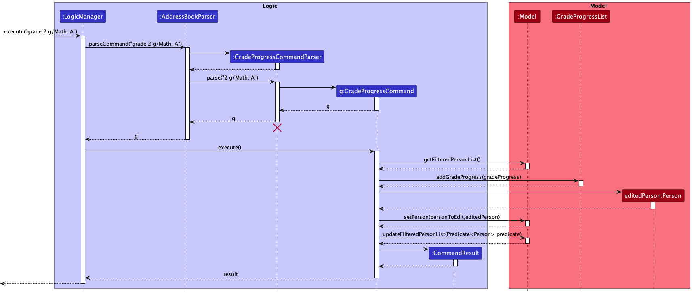
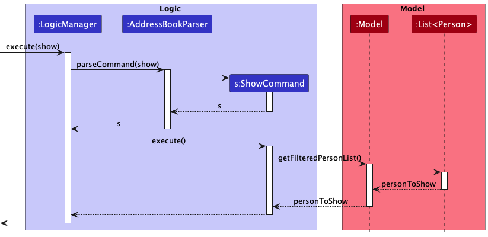

* Table of Contents
{:toc}

--------------------------------------------------------------------------------------------------------------------

## **Acknowledgements**

* {list here sources of all reused/adapted ideas, code, documentation, and third-party libraries -- include links to the original source as well}

--------------------------------------------------------------------------------------------------------------------

## **Setting up, getting started**

Refer to the guide [_Setting up and getting started_](SettingUp.md).

--------------------------------------------------------------------------------------------------------------------

## **Design**

:bulb: **Tip:** The `.puml` files used to create diagrams in this document can be found in the [diagrams](https://github.com/se-edu/addressbook-level3/tree/master/docs/diagrams/) folder. Refer to the [_PlantUML Tutorial_ at se-edu/guides](https://se-education.org/guides/tutorials/plantUml.html) to learn how to create and edit diagrams.

### Architecture

The ***Architecture Diagram*** given above explains the high-level design of the App.

Given below is a quick overview of main components and how they interact with each other.

**Main components of the architecture**

**`Main`** has two classes called [`Main`](https://github.com/se-edu/addressbook-level3/tree/master/src/main/java/seedu/address/Main.java) and [`MainApp`](https://github.com/se-edu/addressbook-level3/tree/master/src/main/java/seedu/address/MainApp.java). It is responsible for,
* At app launch: Initializes the components in the correct sequence, and connects them up with each other.
* At shut down: Shuts down the components and invokes cleanup methods where necessary.

[**`Commons`**](#common-classes) represents a collection of classes used by multiple other components.

The rest of the App consists of four components.

* [**`UI`**](#ui-component): The UI of the App.
* [**`Logic`**](#logic-component): The command executor.
* [**`Model`**](#model-component): Holds the data of the App in memory.
* [**`Storage`**](#storage-component): Reads data from, and writes data to, the hard disk.

**How the architecture components interact with each other**

The *Sequence Diagram* below shows how the components interact with each other for the scenario where the user issues the command `delete 1`.

Each of the four main components (also shown in the diagram above),

* defines its *API* in an `interface` with the same name as the Component.
* implements its functionality using a concrete `{Component Name}Manager` class (which follows the corresponding API `interface` mentioned in the previous point.

For example, the `Logic` component defines its API in the `Logic.java` interface and implements its functionality using the `LogicManager.java` class which follows the `Logic` interface. Other components interact with a given component through its interface rather than the concrete class (reason: to prevent outside component's being coupled to the implementation of a component), as illustrated in the (partial) class diagram below.

The sections below give more details of each component.

### UI component

The **API** of this component is specified in [`Ui.java`](https://github.com/se-edu/addressbook-level3/tree/master/src/main/java/seedu/address/ui/Ui.java)

The UI consists of a `MainWindow` that is made up of parts e.g.`CommandBox`, `ResultDisplay`, `PersonListPanel`, `StatusBarFooter` etc. All these, including the `MainWindow`, inherit from the abstract `UiPart` class which captures the commonalities between classes that represent parts of the visible GUI.

The `UI` component uses the JavaFx UI framework. The layout of these UI parts are defined in matching `.fxml` files that are in the `src/main/resources/view` folder. For example, the layout of the [`MainWindow`](https://github.com/se-edu/addressbook-level3/tree/master/src/main/java/seedu/address/ui/MainWindow.java) is specified in [`MainWindow.fxml`](https://github.com/se-edu/addressbook-level3/tree/master/src/main/resources/view/MainWindow.fxml)

The `UI` component,

* executes user commands using the `Logic` component.
* listens for changes to `Model` data so that the UI can be updated with the modified data.
* keeps a reference to the `Logic` component, because the `UI` relies on the `Logic` to execute commands.
* depends on some classes in the `Model` component, as it displays `Person` object residing in the `Model`.

### Logic component

**API** : [`Logic.java`](https://github.com/se-edu/addressbook-level3/tree/master/src/main/java/seedu/address/logic/Logic.java)

Here's a (partial) class diagram of the `Logic` component:

How the `Logic` component works:
1. When `Logic` is called upon to execute a command, it uses the `AddressBookParser` class to parse the user command.
1. This results in a `Command` object (more precisely, an object of one of its subclasses e.g., `AddCommand`) which is executed by the `LogicManager`.
1. The command can communicate with the `Model` when it is executed (e.g. to add a person).
1. The result of the command execution is encapsulated as a `CommandResult` object which is returned back from `Logic`.

The Sequence Diagram below illustrates the interactions within the `Logic` component for the `execute("delete 1")` API call.

:information_source: **Note:** The lifeline for `DeleteCommandParser` should end at the destroy marker (X) but due to a limitation of PlantUML, the lifeline reaches the end of diagram.

Here are the other classes in `Logic` (omitted from the class diagram above) that are used for parsing a user command:

How the parsing works:
* When called upon to parse a user command, the `AddressBookParser` class creates an `XYZCommandParser` (`XYZ` is a placeholder for the specific command name e.g., `AddCommandParser`) which uses the other classes shown above to parse the user command and create a `XYZCommand` object (e.g., `AddCommand`) which the `AddressBookParser` returns back as a `Command` object.
* All `XYZCommandParser` classes (e.g., `AddCommandParser`, `DeleteCommandParser`, ...) inherit from the `Parser` interface so that they can be treated similarly where possible e.g, during testing.

### Model component
**API** : [`Model.java`](https://github.com/se-edu/addressbook-level3/tree/master/src/main/java/seedu/address/model/Model.java)

The `Model` component,

* stores the address book data i.e., all `Person` objects (which are contained in a `UniquePersonList` object).
* stores the currently 'selected' `Person` objects (e.g., results of a search query) as a separate _filtered_ list which is exposed to outsiders as an unmodifiable `ObservableList<Person>` that can be 'observed' e.g. the UI can be bound to this list so that the UI automatically updates when the data in the list change.
* stores a `UserPref` object that represents the user’s preferences. This is exposed to the outside as a `ReadOnlyUserPref` objects.
* does not depend on any of the other three components (as the `Model` represents data entities of the domain, they should make sense on their own without depending on other components)

:information_source: **Note:** An alternative (arguably, a more OOP) model is given below. It has a `Tag` list in the `AddressBook`, which `Person` references. This allows `AddressBook` to only require one `Tag` object per unique tag, instead of each `Person` needing their own `Tag` objects. 

### Storage component

**API** : [`Storage.java`](https://github.com/se-edu/addressbook-level3/tree/master/src/main/java/seedu/address/storage/Storage.java)

The `Storage` component,
* can save both address book data and user preference data in json format, and read them back into corresponding objects.
* inherits from both `AddressBookStorage` and `UserPrefStorage`, which means it can be treated as either one (if only the functionality of only one is needed).
* depends on some classes in the `Model` component (because the `Storage` component's job is to save/retrieve objects that belong to the `Model`)

### Common classes

Classes used by multiple components are in the `seedu.addressbook.commons` package.

--------------------------------------------------------------------------------------------------------------------

## **Implementation**

This section describes some noteworthy details on how certain features are implemented.

### Lesson plan feature

#### Implementation

The lesson plan feature allows the user to keep track of a lesson plan for a person in the form of a string. It is a required parameter when a new person is added, through `AddCommandParser`.

It can also be added independently, and is facilitated by `LessonPlanCommand` in the Logic component. It extends `Commmand` with a `LessonPlan` object stored internally.
`LessonPlanCommand` is created by `LessonPlanCommandParser` which implements `Parser<LessonPlanCommand>`.
Each `Person` has a `LessonPlan` object which contains a string value with the Lesson Plan.

Given below is an example usage scenario and how the lesson plan feature behaves at each step.

Step 1. The user launches the application for the first time. The address book will be initialized with the initial address book state.

Step 2. The user executes `lessonplan 1 lp/Biology` to overwrite the lesson plan of the first person in the address book.

The functionality and sequence is implemented as described in the Logic component.

### Homework Feature

#### Implementation

The homework feature is facilitated by `HomeworkList` and `Homework`.
Each `Person` has a `HomeworkList` which contains multiple `Homework` objects. Below is a partial class diagram of the relationship:

`HomeworkList` implements the following operations:

* `HomeworkList#addHomework(Homework)` — Adds a homework task to the homework list.
* `HomeworkList#editAtIndex(Index)` — Replaces the homework at the given index with a new homework.
* `HomeworkList#clearList()` — Deletes all items in the homework list.

These operations are exposed in command executions such as `HomeworkCommand#execute()` and `EditCommand#createEditedPerson()`.
`HomeworkList#clearList()` is used for testing purposes only.

Given below is an example usage scenario and how the adding homework mechanism behaves at each step.

Step 1. The user launches the application for the first time. The address book will be initialized with the initial address book state.

Step 2. The user executes `homework 1 h/Maths worksheet` to add homework to the first person in the address book.
The `homework` command calls `HomeworkList#addHomework(Homework)` and adds the task to the list.

The following sequence shows how adding homework works:

:information_source: **Note** The lifeline for `HomeworkCommandParser` should end at the destroy marker (X) but due to a limitation of PlantUML, the lifeline reaches the end of diagram.

Step 3. The user decides to edit the homework to Science instead of Maths.
They go into full view mode with the `view` command and execute `edit 1 h/Science worksheet`, which calls `HomeworkList#editAtIndex()` and replaces the old description with the new one.

#### Design considerations:

**Aspect: Format of homework command:**

* **Alternative 1 (current choice):** Command prefix required.
    * Pros: Easy to implement. Consistent with formats of other commands.
    * Cons: May seem redundant to type as it can only add one item.

* **Alternative 2:** Command prefix not required.
    * Pros: Saves time for users during input.
    * Cons: May be harder to implement. Inconsistent with formats of other commands.

### Grade Progress Feature

#### Implementation

The grade progress feature is facilitated by `GradeProgressCommand`, `GradeProgressList` and `GradeProgressList` classes.
`GradeProgressCommand` extends `Command` abstract class that has  abstract method, `execute()`.
`GradeProgress` deals with the actual grade progress inputs while the
`GradeProgressList` deals with the list of `GradeProgress`. 
The `GradeProgressList` is the object that is displayed in the `AddressBook`.
Additionally, the classes implement the following operations:
- `GradeProgressList#addGradeProgress(GradeProgress)` - Adds grade progress to the grade progress list.
- `GradeProgressList#clearList()` - Clears all stored grades of the Person
- `GradeProgressList#editAtIndex(index)` - Edits the grade at the given index with the new given grade.

Given below is an example usage scenario and how the grade progress feature behaves at each step.

Step 1. The user launches the application for the first time. The `AddressBook` will be initialized with the sample data and
each person in the `AddressBook` contains an empty `GradeProgressList` object.

Step 2. The user executes `grade 2 g/Math: B` command to insert the grade, `Math: B` in the 2nd person in the `AddressBook`.
1. The `grade` command calls the `Model#getFilteredPersonList()` to get the current list of persons prior to the grade progress command.
2. The command then calls the creation of a new `Person` with the updated grade progress list.
3. `Model#setPerson()` is invoked and then `Model#updateFilteredPersonList()` is invoked to update the `AddressBook` entirely with the `grade` command.

Step 3. Upon successful entry of grade inputs, the `CommandResult()` message will be invoked.

#### Design Consideration

Aspect: How grade progress command executes
- Alternative 1 (current choice): Creates a new `Person` object and overwrites current 'Person' object
  - Pros: Easy to implement and simple understandable code.
  - Cons: May lead to performance issues, when contents of the `Person` object is greater.
- Alternative 2:  Include grade progress to the current 'Person' object with a setter method
  - Pros: Faster, as there is no need to recreate the whole `Person` object
  - Cons: Implementation details are greatly exposed, damages code's maintainability

Aspect: Addition of Grade progress
- **Alternative 1 (current choice):** Creation of `Person` object first with empty `GradeProgressList` and thereafter executing `GradeProgressCommand`
  - Pros: Users would not have to key in a long statement when adding a new `Person` to the `AddressBook`
  - Cons: 2 command lines to be written for addition of new `Person` with non-empty `GradeProgressList`
- **Alternative 2:** Grade progress to be added during the creation of the new object
  - Pros: Reduce the need to recreate new `Person` object for the addition of grade progress
  - Cons: Increase tendency of user-made errors when inputting longer command lines

Aspect: Data Structure of `GradeProgressList`
- **Alternative 1 (current choice):** ArrayList
  - Pros: Easy to perform basic functions such as add, delete and remove of respective grade progress elements in the list.
  - Cons: Deletion of data from the middle is time-consuming as data needs to be shifted to update the list.
- **Alternative 2:** Singly Linked list
  - Pros: Insertion and deletion are easier in the linked list. There is no need to shift elements after the insertion or deletion of any element only the address present in the next pointer needs to be updated.
  - Cons: More memory is required in the linked list as compared to an array.

The following sequence diagram shows how the grade progress command operation works:

:information_source: **Note** The lifeline for `GradeProgressCommandParser` should end at the destroy marker (X) but due to a limitation of PlantUML, the lifeline reaches the end of diagram.

### Session feature

#### Implementation

The Session feature allows users of Pupilist to keep track of the session day and start timing of their students represented by the Person class. The Sessions of each student is implemented such that they are stored internally as a `Session List` specific to each Person.

The `Session` class implements the `Session` Objects to be stored in the `SessionList` and implements the `Comparator<Session>` Java interface to allow for comparison between `Session instances`.
It encapsulates the exact string input by the user that is to be used by the `Session` class to create the instance of `Session`. It also uses `LocalDateTime` class to encapsulate the `time` attribute 
associated to each instance of the class. The `Session` class uses the format `EEE HH:mm` for the `LocalDateTimeFormatter` to be used to format the string input to instantiate the `time` attribute.

:information_source: **Note:** Due to `LocalDateTimeFormatter` requiring enough information to create a `LocalDateTime` instance, the implementation of `Session` is such that the `LocalDateTimeFormatter` will default to its `ChronoField.YEAR` to be 2000, its `ChronoField.MONTH` be 1 and `ChronoField.ALIGNED_WEEK_OF_MONTH` be 1, as a workaround around this issue.

Additionally, it implements the following operations:
* `Session#isValidSession(String test)` - Checks whether the string passed by the user is in the valid format to create a `Session` Object.
* `Session#isValidDay(String test)` - Checks whether the day component of the string passed by the user is a valid day of the `LocalDateTime` class. It is a helper method for `isValidSession(String test)`
* `Session#toString()` - The specific String representation for the `Session` Object.
* `Session#equals(Object other)` - Compares a `Session` object to an object, only returning true when the other Object is an instance of `Session` with the specified equality checks with the 'this' `Session` object.
* `Session#compareTo(Session other)` - Compares two instance of the `Session` class for the sorting of `Session` objects in the `SessionList`.
* `Session#hashCode()` - Provides the hashcode of the `Session` Object instance.

Below is the Activity diagram showing how a `Session` instance is created upon the `Session` class constructor being called.

These operations are exposed in the `Command` interface through the `SessionCommand` class, the `EditPersonDescriptor` class and `SessionList` class.

Below is the partial class diagram aimed at showing the dependencies of the `Session` class with other classes of the Pupilist code base.

Given below is an example usage scenario and how the Session class behaves at each step.

**Assumption: There are `Person` instances of the name Benson Meier and Alice Pauline `Person` list.**

Step 1. The user executes a `view benson meier` command which puts the `Person` with the name Benson Meier in view mode. Assume that the Person has a `SessionList` of size >= 3.

Step 2. The user executes an `edit s/1 Mon 08:30` command which edits the index 0 of the `SessionList` displayed on the GUI. This creates a new Session instance with the string input of the format `EEE HH:mm`.
		The `Session` instances in the `SessionList` of the `Person` is immediately sorted using the `Session` class `compareTo` implementation.

Step 3. The user executes a `list` command which puts the Pupilist application into list view, displaying multiple Persons to the user.

Step 4. The user executes an `add 1 s/ Tue 09:00` command which creates a new instance of `Session` with the string input of the format `EEE HH:mm` and adds it to the `SessionList` of the `Person` of the first Person Card shown in the GUI.
	The `Session` instances in the modified `SessionList` of the `Person` is immediately sorted using the `Session` class `compareTo` implementation.
	
Step 5. The user executes a `view Alice Pauline` command which puts the `Person` with the name Alice Pauline in view mode.

Step 6. The user executes a `remove s/3` command which removes the instance of `Session` in index 2 of the `SessionList` of the `Person` displayed in the GUI in view mode. The Session 
	instances in the `SessionList` of the `Person` in view are then immediately sorted using the `Session` class `compareTo` implementation.
		
#### Design considerations:

**Aspect: How to encapsulate user input in Session**

* **Alternative 1 (current choice):** Use defaulting of `LocalDateTimeFormatter` as formatter for `LocalDateTime`.
  * Pros: Easier to implement, uses only one imported Java class `LocalDateTime` for encapsulating user input.
  * Cons: Have to default to a *Black Box* year, month and week which is a workaround. 

* **Alternative 2:** Use of extra `DayOfWeek` class alongside `LocalDateTime`.
  * Pros: Less of a workaround. More accurate backstage representation of user input.
  * Cons: Harder to implement. Have to concatenate `DayOfWeek` and `LocalDateTime` in `toString` method, which may affect performance with a large `SessionList`.

### Remove feature

#### Implementation

The remove feature allows the user to remove a specified detail from the homework, session, attendance, or grade progress lists. It can only be used when the user is in the 'view' state of the student.

Remove is facilitated by the `RemoveCommand` in the Logic component. It extends `command`.

Given below is an example usage scenario and how the Remove mechanism behaves at each step.

**Assumption: There are `Person` instances of the name Benson Meier in the `Person` list.**

Step 1. The user launches the application for the first time. The `AddressBook` will be initialized with the sample data and
each person in the `AddressBook` contains details for each `GradeProgress`, `Session`, `Attendance` or `Homework` object.
Step 2. The user executes `view Benson Meier`,bringing the user to the `view state` of Benson Meier
Step 3. The user executes a `remove a/3` command. The following methods are called in the given order:
1. `LogicManager#Execute`, which then calls
2. `AddressBookParser#parseCommand`. It will parse the input as a `RemoveCommand` and call the constructor of `RemoveCommandParser`.
3. `RemoveCommandParser#parse` will parse the user command based on the prefixes given by the user, and returns a `RemoveCommand` with `RemovePersonDescriptor` as input.
4. `RemoveCommand#execute` is called, and it will check if the user is in `view state`. If not, it will throw a `CommandException` with `MESSAGE_NOT_VIEW_MODE`. Otherwise, the method continues to run.
5. The `RemoveCommand#createRemovedPerson` creates a person using the information in the `RemovePersonDescriptor`.
6. The `Person` is replaced by the newly created `Person` using `Model#setPerson`. `RemoveCommand#execute` returns a `CommandResult` to the `LogicManager`.

The following activity diagram summarises what happens when a user executes the Remove command:

:information_source: **Note** The lifeline for `RemoveCommandParser` should end at the destroy marker (X) but due to a limitation of PlantUML, the lifeline reaches the end of diagram.

#### Design Consideration

**Aspect: Where to implement Remove function**

* **Alternative 1 (current choice):** Have a dedicated function for removing specified details of a Person from the various lists in their details. 
  * Pros: Easier to implement
  * Cons: Less intuitive, users must know difference between `edit` and `remove` functions

* **Alternative 2:** Integrate remove function into edit function.
  * Pros: More intuitive as removing a feature is also instinctively understood as editing details. 
  * Cons: Harder to implement, can lead to potential errors if user means to edit as opposed to remove 

* **Alternative 3:** No Remove command. Users are unable to remove fields added to student's lists, and have to edit the existing fields instead.
  * Pros: Less bug-prone, more convenient for developers
  * Cons: Not user-friendly and makes things difficult for users.
  

### Schedule feature

#### Implementation

The session feature is facilitated by `ShowCommand` and `TimeSlot` which is an association class. Each `TimeSlot` contains a `Person` and a `Session`.
Below is a partial class diagram of the relationship:

Given below is an example usage scenario of how the user can view the schedule by day:

Step 1. The user launches the application for the first time. The `AddressBook` will be initialized with the initial address book state.

Step 2. The user executes `session 1 s/Mon 12:30`, adding a session time to the first person in the list.

Step 3. The user executes a `show Mon` command which displays a list of persons with sessions on Monday.

The following sequence shows how viewing the schedule works:

:information_source: **Note** The lifeline for `ShowCommandParser` should end at the destroy marker (X) but due to a limitation of PlantUML, the lifeline reaches the end of diagram.

#### Design considerations
**Aspect: Retrieval of individual sessions**
* **Alternative 1 (current choice):** An association class between `Session` and `Person`
  * Pros: Simple to retrieve a `Person` and a `Session` when bound together
  * Cons: Association has to be explicitly added and created when needed instead of existing throughout
* **Alternative 2:** Bidirectional navigability
  * Pros: Easy to identify the corresponding `Person` for each `Session`
  * Cons: Increases coupling

**Aspect: Populating of `TimeSlot` objects**
* **Alternative 1 (current choice):** Populated and retrieved only when user inputs `show`
  * Pros: Lesser things to store and keep track of, easier to implement
  * Cons: Has to iterate through the list multiple times if user enters the command multiple times without making changes to the session timings
* **Alternative 2:** Global list that gets updated each time a session changes
  * Pros: Easy to retrieve list of time slots
  * Cons: Unnecessary storing as it only depends on `Session` and `Person` which are both already stored, have to constantly update whenever `SessionList` is updated.

### \[Proposed\] Undo/redo feature

#### Proposed Implementation

The proposed undo/redo mechanism is facilitated by `VersionedAddressBook`. It extends `AddressBook` with an undo/redo history, stored internally as an `addressBookStateList` and `currentStatePointer`. Additionally, it implements the following operations:

* `VersionedAddressBook#commit()` — Saves the current address book state in its history.
* `VersionedAddressBook#undo()` — Restores the previous address book state from its history.
* `VersionedAddressBook#redo()` — Restores a previously undone address book state from its history.

These operations are exposed in the `Model` interface as `Model#commitAddressBook()`, `Model#undoAddressBook()` and `Model#redoAddressBook()` respectively.

Given below is an example usage scenario and how the undo/redo mechanism behaves at each step.

Step 1. The user launches the application for the first time. The `VersionedAddressBook` will be initialized with the initial address book state, and the `currentStatePointer` pointing to that single address book state.

Step 2. The user executes `delete 5` command to delete the 5th person in the address book. The `delete` command calls `Model#commitAddressBook()`, causing the modified state of the address book after the `delete 5` command executes to be saved in the `addressBookStateList`, and the `currentStatePointer` is shifted to the newly inserted address book state.

Step 3. The user executes `add n/David …​` to add a new person. The `add` command also calls `Model#commitAddressBook()`, causing another modified address book state to be saved into the `addressBookStateList`.

:information_source: **Note:** If a command fails its execution, it will not call `Model#commitAddressBook()`, so the address book state will not be saved into the `addressBookStateList`.

Step 4. The user now decides that adding the person was a mistake, and decides to undo that action by executing the `undo` command. The `undo` command will call `Model#undoAddressBook()`, which will shift the `currentStatePointer` once to the left, pointing it to the previous address book state, and restores the address book to that state.

:information_source: **Note:** If the `currentStatePointer` is at index 0, pointing to the initial AddressBook state, then there are no previous AddressBook states to restore. The `undo` command uses `Model#canUndoAddressBook()` to check if this is the case. If so, it will return an error to the user rather
than attempting to perform the undo.

The following sequence diagram shows how the undo operation works:

:information_source: **Note:** The lifeline for `UndoCommand` should end at the destroy marker (X) but due to a limitation of PlantUML, the lifeline reaches the end of diagram.

The `redo` command does the opposite — it calls `Model#redoAddressBook()`, which shifts the `currentStatePointer` once to the right, pointing to the previously undone state, and restores the address book to that state.

:information_source: **Note:** If the `currentStatePointer` is at index `addressBookStateList.size() - 1`, pointing to the latest address book state, then there are no undone AddressBook states to restore. The `redo` command uses `Model#canRedoAddressBook()` to check if this is the case. If so, it will return an error to the user rather than attempting to perform the redo.

Step 5. The user then decides to execute the command `list`. Commands that do not modify the address book, such as `list`, will usually not call `Model#commitAddressBook()`, `Model#undoAddressBook()` or `Model#redoAddressBook()`. Thus, the `addressBookStateList` remains unchanged.

Step 6. The user executes `clear`, which calls `Model#commitAddressBook()`. Since the `currentStatePointer` is not pointing at the end of the `addressBookStateList`, all address book states after the `currentStatePointer` will be purged. Reason: It no longer makes sense to redo the `add n/David …​` command. This is the behavior that most modern desktop applications follow.

The following activity diagram summarizes what happens when a user executes a new command:

#### Design considerations:

**Aspect: How undo & redo executes:**

* **Alternative 1 (current choice):** Saves the entire address book.
  * Pros: Easy to implement.
  * Cons: May have performance issues in terms of memory usage.

* **Alternative 2:** Individual command knows how to undo/redo by
  itself.
  * Pros: Will use less memory (e.g. for `delete`, just save the person being deleted).
  * Cons: We must ensure that the implementation of each individual command are correct.

_{more aspects and alternatives to be added}_

### \[Proposed\] Data archiving

_{Explain here how the data archiving feature will be implemented}_

--------------------------------------------------------------------------------------------------------------------

## **Documentation, logging, testing, configuration, dev-ops**

* [Documentation guide](Documentation.md)
* [Testing guide](Testing.md)
* [Logging guide](Logging.md)
* [Configuration guide](Configuration.md)
* [DevOps guide](DevOps.md)

--------------------------------------------------------------------------------------------------------------------

## **Appendix: Requirements**

### Product scope

**Target user profile**:

* has a need to organise and manage their students and lesson plans
* has a need to keep track of their students' assigned workload
* has a need to keep track of their students' grades progress
* has a need to keep track of their students' attendance in lessons
* has a need to keep track of their student's assignment progress
* has a need to keep track of their student's time slots
* has a need to keep track of their homework assignments for their students
* has a need to access and organise their students contact details
* prefer an all-in-one solution to organise their lesson plans and students
* prefer desktop apps over other types
* can type fast
* prefers typing to mouse interactions
* is reasonably comfortable using CLI apps

**Value proposition**: manage and organise students and lesson plans in a lightweight and fast desktop application.

### User stories

Priorities: High (must have) - `* * *`, Medium (nice to have) - `* *`, Low (unlikely to have) - `*`

| Priority | As a …​                               | I want to …​                                                 | So that I can…​                                                   |
|----------|--------------------------------------|--------------------------------------------------------------|-------------------------------------------------------------------|
| `* * *`  | potential user                       | see the app populated with sample data                       | see how the app would look like after frequent usage              |
| `* * *`  | new user                             | purge all current data                                       | restart with a new set of data for                                |
| `* * *`  | new user		 		  | be able to view all the basic commands of the app            | I can pick them up quickly to start using the app	                |
| `* * *`  | user                                 | assign homework to my students                               | keep track of the work I assigned to them                         |
| `* * *`  | user                                 | mark my students attendance 	                                | keep track of my students' attendance	                            |
| `* * *`  | user                                 | modify my students' grade progress                           | keep track on how well my students' are doing                     |
| `* * *`  | user with many students to manage    | add my students' time slots                                  | keep track of my daily schedule                                   |
| `* * *`  | user with many students to manage	  | view a list of all my students and their work-related info   | I can see my students' workload at a glance                       |
| `* * *`  | long-term user with many students	  | update my students data easily                               | I can keep updated information relevant to their work and contact |
| `* * *`  | long-term user			  | view grade and assignment progress of my individual students | keep track of my students progress  	                             |

*{More to be added}*

### Use cases

(For all use cases below, the **System** is the `Pupilist` and the **Actor** is the `user`, unless specified otherwise)

**Use case: Add attendance**

**MSS**
1. User requests to find a student attendance record.
2. Pupilist shows the Student name and his attendance record.
3. User chooses to increment attendance record of student to mark him as attended.
4. Pupilist tells User that the command is successful.
	
	Use case ends.

**Extensions**

* 1a. No Student specified found.
	* 1a1. Pupilist tells user no such student found.
	  Use case resumes at step 1
	  
**Use case: View students' information**
1. User requests to list students by their user-specified tagged information.
2. Pupilist shows a list of students names along with the requested information.

    Use case ends.

**Extensions**

* 1a. The list is empty.
    * 1a1. Pupilist shows an empty list
  
      Use case ends.
	

* 2a. Invalid information tag request.
    * 2a1. Pupilist shows error to indicate invalid command.
  
      Use case ends.

**Use case: Delete a person**

**MSS**

1.  User requests to list persons
2.  Pupilist shows a list of persons
3.  User requests to delete a specific person in the list
4.  Pupilist deletes the person

    Use case ends.

**Extensions**

* 2a. The list is empty.      
 Use case ends.

* 3a. The given index is invalid.

    * 3a1. Pupilist shows an error message.

      Use case resumes at step 2.

**Use case: Add homework**

**MSS**

1.  User requests to list students
2.  Pupilist shows a list of students
3.  User requests assign homework to a specific student in the list
4.  Pupilist adds homework to the student

    Use case ends.

**Extensions**

* 2a. The list is empty.

  Use case ends.

* 3a. The homework description is invalid.

    * 3a1. Pupilist shows an error message.

      Use case resumes at step 2.

* 3b. The given index is invalid.

    * 3b1. Pupilist shows an error message.

      Use case resumes at step 2.

**Use case: Add lesson plan**

**MSS**

1.  User requests to list students.
2.  Pupilist shows a list of students.
3.  User requests to add a lesson plan to a specific student.
4.  Pupilist adds a lesson plan to the student.

    Use case ends.

**Extensions**

* 3a. Pupilist detects an error in the selected index.

    * 3a1. Pupilist displays an error message.

      Use case resumes at step 3.

    *{More to be added}*

### Non-Functional Requirements

1. Should work on Windows or Linux OS as long as it has Java 11 installed.
2. Should work on 64-bit environments.
3. The system should be usable by a novice who has never used an app to organize their students before.
4. The system should respond within a second.
5. The product is not required to handle communication between teacher and student.

### Glossary

* **Attendance**: The date of the lesson attended
* **Card**: The details of a student
* **Grade Progress**: The current grade of the student and their standard of work
* **Homework**: Work assigned to a student and whether or not they completed it
* **Lesson plan**: What the tutor intends to teach each student such as a subject or topic
* **Mainstream OS**: Windows, Linux, Unix, OS-X
* **Session**: The time slot allocated to a student
* **Schedule**: The students and time slots scheduled for a particular day

--------------------------------------------------------------------------------------------------------------------

## **Appendix: Instructions for manual testing**

Given below are instructions to test the app manually.

:information_source: **Note:** These instructions only provide a starting point for testers to work on;
testers are expected to do more *exploratory* testing.

### Launch and shutdown

1. Initial launch

   1. Download the jar file and copy into an empty folder

   1. Double-click the jar file Expected: Shows the GUI with a set of sample contacts. The window size may not be optimum.

1. Saving window preferences

   1. Resize the window to an optimum size. Move the window to a different location. Close the window.

   1. Re-launch the app by double-clicking the jar file. 
       Expected: The most recent window size and location is retained.

1. _{ more test cases …​ }_

### Deleting a person

1. Deleting a person while all persons are being shown

   1. Prerequisites: List all persons using the `list` command. Multiple persons in the list.

   1. Test case: `delete 1` 
      Expected: First contact is deleted from the list. Details of the deleted contact shown in the status message. Timestamp in the status bar is updated.

   1. Test case: `delete 0` 
      Expected: No person is deleted. Error details shown in the status message. Status bar remains the same.

   1. Other incorrect delete commands to try: `delete`, `delete x`, `...` (where x is larger than the list size) 
      Expected: Similar to previous.

1. _{ more test cases …​ }_

### Saving data

1. Dealing with missing/corrupted data files

   1. _{explain how to simulate a missing/corrupted file, and the expected behavior}_

1. _{ more test cases …​ }_
