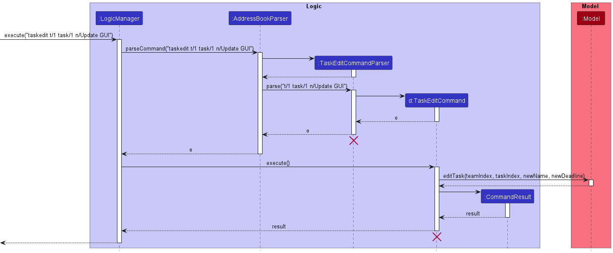
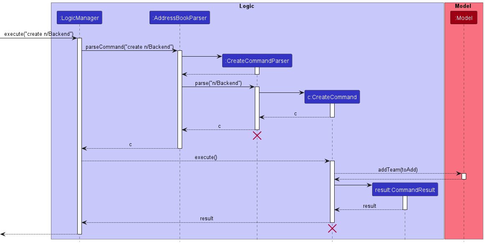

## Table of Contents

* Table of Contents
{:toc}

--------------------------------------------------------------------------------------------------------------------

## **Acknowledgements**

* EZLead is evolved from AddressBook Level 3, a desktop app that manage contacts through CLI.

--------------------------------------------------------------------------------------------------------------------

## **Setting up, getting started**

Refer to the guide [_Setting up and getting started_](SettingUp.md).

--------------------------------------------------------------------------------------------------------------------

## **Design**

:bulb: **Tip:** The `.puml` files used to create diagrams in this document can be found in the [diagrams](https://github.com/AY2223S1-CS2103T-W09-3/tp/tree/master/docs/diagrams) folder. Refer to the [_PlantUML Tutorial_ at se-edu/guides](https://se-education.org/guides/tutorials/plantUml.html) to learn how to create and edit diagrams.

### Architecture

The ***Architecture Diagram*** given above explains the high-level design of the App.

Given below is a quick overview of main components and how they interact with each other.

**Main components of the architecture**

**`Main`** has two classes called [`Main`](https://github.com/AY2223S1-CS2103T-W09-3/tp/blob/master/src/main/java/seedu/address/Main.java) and [`MainApp`](https://github.com/AY2223S1-CS2103T-W09-3/tp/blob/master/src/main/java/seedu/address/MainApp.java). It is responsible for,
* At app launch: Initializes the components in the correct sequence, and connects them up with each other.
* At shut down: Shuts down the components and invokes cleanup methods where necessary.

[**`Commons`**](#common-classes) represents a collection of classes used by multiple other components.

The rest of the App consists of four components.

* [**`UI`**](#ui-component): The UI of the App.
* [**`Logic`**](#logic-component): The command executor.
* [**`Model`**](#model-component): Holds the data of the App in memory.
* [**`Storage`**](#storage-component): Reads data from, and writes data to, the hard disk.

**How the architecture components interact with each other**

The *Sequence Diagram* below shows how the components interact with each other for the scenario where the user issues the command `delete 1`.

Each of the four main components (also shown in the diagram above),

* defines its *API* in an `interface` with the same name as the Component.
* implements its functionality using a concrete `{Component Name}Manager` class (which follows the corresponding API `interface` mentioned in the previous point.

For example, the `Logic` component defines its API in the `Logic.java` interface and implements its functionality using the `LogicManager.java` class which follows the `Logic` interface. Other components interact with a given component through its interface rather than the concrete class (reason: to prevent outside component's being coupled to the implementation of a component), as illustrated in the (partial) class diagram below.

The sections below give more details of each component.

### UI component

The **API** of this component is specified in [`Ui.java`](https://github.com/AY2223S1-CS2103T-W09-3/tp/blob/master/src/main/java/seedu/address/ui/Ui.java)

The UI consists of a `MainWindow` that is made up of parts e.g.`CommandBox`, `ResultDisplay`, `PersonListPanel`, `StatusBarFooter` `TeamListPanel`, `TaskListPanel` , `DisplayUserWindow` etc. All these, including the `MainWindow`, inherit from the abstract `UiPart` class which captures the commonalities between classes that represent parts of the visible GUI.

The `UI` component uses the JavaFx UI framework. The layout of these UI parts are defined in matching `.fxml` files that are in the `src/main/resources/view` folder. For example, the layout of the [`MainWindow`](https://github.com/AY2223S1-CS2103T-W09-3/tp/blob/master/src/main/java/seedu/address/ui/MainWindow.java) is specified in [`MainWindow.fxml`](https://github.com/AY2223S1-CS2103T-W09-3/tp/blob/master/src/main/resources/view/MainWindow.fxml)

The `UI` component,

* executes user commands using the `Logic` component.
* listens for changes to `Model` data so that the UI can be updated with the modified data.
* keeps a reference to the `Logic` component, because the `UI` relies on the `Logic` to execute commands.
* depends on some classes in the `Model` component, as it displays `Team` object residing in the `Model`.

### Logic component

**API** : [`Logic.java`](https://github.com/AY2223S1-CS2103T-W09-3/tp/blob/master/src/main/java/seedu/address/logic/Logic.java)

Here's a (partial) class diagram of the `Logic` component:

How the `Logic` component works:
1. When `Logic` is called upon to execute a command, it uses the `AddressBookParser` class to parse the user command.
1. This results in a `Command` object (more precisely, an object of one of its subclasses e.g., `AddCommand`) which is executed by the `LogicManager`.
1. The command can communicate with the `Model` when it is executed (e.g. to add a person).
1. The result of the command execution is encapsulated as a `CommandResult` object which is returned back from `Logic`.

The Sequence Diagram below illustrates the interactions within the `Logic` component for the `execute("delete 1")` API call.

:information_source: **Note:** The lifeline for `DeleteCommandParser` should end at the destroy marker (X) but due to a limitation of PlantUML, the lifeline reaches the end of diagram.

Here are the other classes in `Logic` (omitted from the class diagram above) that are used for parsing a user command:

How the parsing works:
* When called upon to parse a user command, the `AddressBookParser` class creates an `XYZCommandParser` (`XYZ` is a placeholder for the specific command name e.g., `AddCommandParser`) which uses the other classes shown above to parse the user command and create a `XYZCommand` object (e.g., `AddCommand`) which the `AddressBookParser` returns back as a `Command` object.
* All `XYZCommandParser` classes (e.g., `AddCommandParser`, `DeleteCommandParser`, ...) inherit from the `Parser` interface so that they can be treated similarly where possible e.g, during testing.

### Model component
**API** : [`Model.java`](https://github.com/AY2223S1-CS2103T-W09-3/tp/blob/master/src/main/java/seedu/address/model/Model.java)

The `Model` component,

* stores the address book data. This address book data consists of:
  * all `Person` objects (which are contained in a `UniquePersonList` object),
  * all `Team` objects (which are contained in a `UniqueTeamList` object),
* stores the currently 'selected' `Person`, and `Team` objects (e.g., results of a search query) as a separate _filtered_ list which is exposed to outsiders as an unmodifiable `ObservableList<Person>` and `ObservableList<Team>` respectively, that can be 'observed' e.g. the UI can be bound to this list so that the UI automatically updates when the data in the list change.
* stores a `UserPref` object that represents the user’s preferences. This is exposed to the outside as a `ReadOnlyUserPref` objects.
* does not depend on any of the other three components (as the `Model` represents data entities of the domain, they should make sense on their own without depending on other components)

:information_source: **Note:** An alternative (arguably, a more OOP) model is given below. It has a `Tag` list in the `AddressBook`, which `Person` references. This allows `AddressBook` to only require one `Tag` object per unique tag, instead of each `Person` needing their own `Tag` objects. 

### Storage component

**API** : [`Storage.java`](https://github.com/AY2223S1-CS2103T-W09-3/tp/blob/master/src/main/java/seedu/address/storage/Storage.java)

The `Storage` component,
* can save both address book data and user preference data in json format, and read them back into corresponding objects.
* inherits from both `AddressBookStorage` and `UserPrefStorage`, which means it can be treated as either one (if only the functionality of only one is needed).
* depends on some classes in the `Model` component (because the `Storage` component's job is to save/retrieve objects that belong to the `Model`)

### Common classes

Classes used by multiple components are in the `seedu.address.commons` package.

--------------------------------------------------------------------------------------------------------------------

## **Implementation**

This section describes some noteworthy details on how certain features are implemented.

### Add Task Feature

#### Implementation

The add task feature adds a task into a team and this change is reflected in the Graphical User Interface.
The user may specify a deadline to be associated with the task (i.e. deadline is optional).
The deadline is implemented using `Optional<LocalDate>`. Thus, the deadline can be passed into other methods without knowing whether the deadline exists or not. The `Task` objects are stored in a `UniqueTaskList`.

Given below is an example usage scenario.

Step 1. The user creates the task using the `taskadd` command, executing `taskadd t/1 n/Create Feature A d/12-12-2022` to add the task "Create Feature A" to team 1, with 12th December 2022 as the deadline.

The following sequence diagram shows how the add task operation works:

### Mark Task Feature

#### Implementation

The mark task feature marks a task as completed and this change is reflected in the Graphical User Interface.

Given below is an example usage scenario

Step 1. The user creates the tasks and assign it to a team using the `taskadd` command. The new task created will be initialized with the property isDone to be false.

Step 2. After the task is completed, the user want to mark the task as done. The user then executes `taskmark t/1 task/3` to mark the 3rd task in the 1st team as completed. The task which is contained in team 1 would be marked as completed and this would be reflected in the gui.

Step 3. The user realised that there is some error in the task and wants to unmark it. The user then executes `taskummark t/1 task/3` to unmark the 3rd task in the 1st team.

The following sequence diagram shows how the mark task operation works:

### Edit Task Feature

#### Implementation

The edit task feature updates the name of the task to the new name given by the user and this change is reflected in the Graphical User Interface.

Given below is an example usage scenario:

Step 1. The user creates the task and assign it to a team using `taskadd` command. The name of the task provided by the user is stored as Name in the Task class.

Step 2. The user might want to update the name of the task in the future. The user then executes `taskedit t/1 task/1 n/update GUI` to update the name of the task from the previous name to the new name provided by the user. The `taskedit` command will call `Model#getFilteredTeamList()`, which then gets the specified task from the `UniqueTaskList`. The specified task in team 1 would be updated to the new name by keeping all the other task feature as same. `Model#updateFilterPersonList` is called to update the team with the new task name and this would be reflected in the gui.

The following sequence diagram shows how the edit task operation works:

### Delete Task Feature

#### Implementation

The delete task feature deletes the task from the specified team given by the user and this change is reflected in the Graphical User Interface.

Given below is an example usage scenario:

Step 1. The user creates the task and assign it to a team using `taskadd` command. The tasks are stored in the UniqueTaskList for each Team.

Step 2. The user might want to delete the task to remove the unwanted task in the future. The user then executes `taskdelete t/1 task/1` to delete the task from the specified team. The `taskdelete` command will call `Model#getFilteredTeamList()`, which then gets the specified task from the `UniqueTaskList`. The specified task in team 1 would be deleted from the taskList. `Model#updateFilterPersonList` is called to update the team with the new deletions and this would be reflected in the gui.

The following sequence diagram shows how delete task operation works:

### Edit Person Feature

#### Implementation

The edit person feature edits the information of a person in the address book, this change is reflected within
all teams containing the edited person. The editable information are phone number, email address, physical
address and tag.

Given below is an example usage scenario

Step 1. The user wants to change the phone number of a person to 80779043. Said person is indexed number 4 in
the global list. The user executes `edit 1 p/80779043`.

Step 2. The parser will create an `edit` command. This `edit command` will call `Model#getFilteredList()`
to get the `person` specified by the index in the command then create a new `person` with the modified info.
`Model#updateFiltedPersonList` is called to update all teams with the edited members.

The following sequence diagram shows how the edit task operation works:

### Create Team Feature

#### Implementation

The Create Team Feature allows the user to create a team in EZLead. Team will be stored in a global team list

Step 1. The user wants to create a team named Backend. The user executes `create t/backend`.

Step 2. The parser will create a team object and a `createTeam` command containing created team.
The `createTeam` command will call `Model#addTeam` to add the team into EZLead.

The following sequence diagram show how the create team operation works:

### Delete Team Feature

#### Implementation

The Delete Team Feature allows the user to delete a team in EZLead. After deletion, the team will no longer be reflected in the Graphical User Interface.

Given below is an example usage scenario

Step 1. The user created a team using the `createteam` command.

Step 2. The user assigns some members into the newly created team using the `assign` command.

Step 3. The user realises that the team has completed their work and is no longer needed, and proceeds to delete the team using the `deleteteam t/1` command (Given that the team created in Step 1 is the team in index 1).

The following sequence diagram shows how the delete team operation works:

### Edit Team Feature

#### Implementation

The Edit Team Feature allows the user to edit the name of a pre-existing team in EZLead.

Given below is an example usage scenario and how the Edit Team mechanism behaves at each step.

Step 1. The user executes `editteam t/1 n/Team1` to change the name of first team to Team1.

Step 2. The `editTeam` command is created by the parser using the given team index and new name. It calls
`Model#setTeamName`to change the name of the required team.

The following sequence diagram shows how the edit team operation works:

### Assign Member Feature

#### Implementation

The Assign Member Feature allows the user to assign a person to a pre-existing team in EZLead.

Given below is an example usage scenario and how the Assign Member mechanism behaves at each step.

Step 1. The user executes `assign m/1 t/1` to assign the first person as a member in the first team.

Step 2. The `assignMember` command is created by the parser using the given member's index (global person index) and
team's index. It calls `Model#addPersonToTeam` to add the person to given team.

The following sequence diagram shows how the assign member operation works:

### unAssign Member Feature

#### Implementation

The unAssign Member Feature allows the user to assign a person to a pre-existing team in EZLead.

Given below is an example usage scenario and how the unAssign Member mechanism behaves at each step.

Step 1. The user executes `unassign m/1 (global person index) t/1` to unAssign the first person as a member from the first team.

Step 2. The `unassignMember` command is created by the parser using the given member's index (global person index) and
team's index. It calls `Model#removePersonFromTeam` to remove the person from given team.

The following sequence diagram shows how the unassign team operation works:

--------------------------------------------------------------------------------------------------------------------

## **Documentation, logging, testing, configuration, dev-ops**

* [Documentation guide](Documentation.md)
* [Testing guide](Testing.md)
* [Logging guide](Logging.md)
* [Configuration guide](Configuration.md)
* [DevOps guide](DevOps.md)

--------------------------------------------------------------------------------------------------------------------

## **Appendix: Requirements**

### Product scope

**Target user profile**: Tech Lead managing multiple teams in a software company and designating different tasks to teams

* Experienced in using applications
* has a need to manage a significant number of teams
* prefer desktop apps over other types
* can type fast
* has a need to distribute and track a significant number of tasks

**Value proposition**: Create teams and distribute members amongst teams. Assign and track tasks to teams.

### User stories

Priorities: High (must have) - `* * *`, Medium (nice to have) - `* *`, Low (unlikely to have) - `*`

| Priority | As a …​   | I can  …​                                  | So that I can…​                                    |
|----------|-----------|--------------------------------------------|----------------------------------------------------|
| `* * *`  | tech lead | change the team structure                  | manage the teams (EPIC)                            |
| `* * *`  | tech lead | create a new team                          |                                                    |
| `* * *`  | tech lead | delete a team                              | remove unwanted teams                              |
| `* * *`  | tech lead | edit the name of the team                  | keep the team information up to date               |
| `* * *`  | tech lead | add members to a team                      | update the team when a new member joins            |
| `* * *`  | tech lead | remove members from a team                 | keep the team information up to date               |
| `* * *`  | tech lead | edit the information of members            | update their information when there is a change    |
| `* * *`  | tech lead | manage the tasks for the company           | have an overview of the task in the company (EPIC) |
| `* * *`  | tech lead | create a task                              |                                                    |
| `* * *`  | tech lead | delete a task                              | remove unwanted tasks                              |
| `* * *`  | tech lead | update a task name                         | respond to changes in the requirements             |
| `* *  `  | tech lead | set the status of the task to complete     | know which task is completed                       |
| `* *  `  | tech lead | set the status of the task to not complete | know which task is not completed                   |
| `* *  `  | tech lead | set a deadline for the task                | know when the task should be completed             |
| `* *  `  | tech lead | see the progress of the team               | know the actively performing teams                 |

### Use cases

(For all use cases below, the **System** is the `EZLead` and the **Actor** is the `Tech Lead`, unless specified otherwise)

**Use case: UC1 - Create a new team**

**Actor: Tech Lead**

**MSS**

1. Tech Lead specifies the name of the team.
2. EZLead create a new team object with the specified team.

**Extensions**

* 1a. Team with the same name already exists.

    * 1a1. EZLead throws an error signifying duplicate name.

      Use case resumes from step 1.

**Use case: UC2 - Assigning members into a team**

**Actor: Tech Lead**

**Prerequisites: A team exist**

**MSS**

1. Tech Lead specifies the member to add into which team.
2. EZLead add that member to the team.

Step 1 and 2 is repeated until all members have been added

**Extensions:**

* 1a. Member already assigned to the team

    * 1a1. EZLead throws an error signifying duplicate member

      Use case continues at step 1.

* 1b. Member does not exist in the app

    * 1b1. EZLead throws an error signifying member does not exist

      Use case continues at step 1

**Use case: UC3 - Deleting Team**

**Actor: Tech Lead**

**Prerequisites: A team exist**

**Guarantee: Selected Team will be deleted from EZLead**

**MSS**

1. Tech Lead specifies the team being deleted.
2. Team deleted from EZLead’s database.

**Extensions:**

* 1a. Tech Lead enter wrong command

    * 1a1. EZLead display error message

      Use case ends

* 1b. Team does not exist in EZLead’s Database

    * 1b1. EZLead informs Tech Lead that the team does not exist

      Use case ends

**Use case: UC4 - Renaming a team's name**

**Actor: Tech Lead**

**Prerequisites: A team exists**

**Guarantee: Selected team is renamed to the new given name**

**MSS**

1. Tech Lead specifies the old team and the new team name.
2. EZLead updates the name of the team.

**Extensions:**

* 1a. Tech Lead enters the wrong command.

    * 1a1. EZLead displays an error message.

      Use case ends.

* 1b. Old team does not exist in EZLead's database.

    * 1b1. EZLead displays an error message.

      Use case ends.

* 1c. new name is already used by another team.

    * 1c1. EZLead displays an error message.

      Use case ends.

**Use case: UC5 - Removing team members from a team**

**Actor: Tech Lead**

**Prerequisites: A team with existing members exists**

**Guarantee: Selected team member is removed from the selected team.**

**MSS**

1. Tech Lead specifies the team and the team member to be removed.
2. EZLead removes the team member from the team.

**Extensions:**

* 1a. Specified team does not exist.

    * 1a1. EZLead displays an error message.

      Use case ends.

* 1b. Specified team member does not exist.

    * 1b1. EZLead displays an error message.

      Use case ends.

**Use case: UC6 - Creating a task item**

**Actor: Tech Lead**

**Prerequisites: A team exists**

**MSS**

1. Tech Lead specifies the team and the task.
2. EZLead creates a new task object associated to the specified team.

**Extensions:**

* 1a. Specified team does not exist.

    * 1a1. EZLead displays an error message.

      Use case ends.

**Use case: UC7 - Deleting a task item**

**Actor: Tech Lead**

**Prerequisites: A team exists**

**MSS**

1. Tech Lead specifies the team and the task.
2. EZLead removes the task associated to the specified team.

**Extensions:**

* 1a. Specified team does not exist.

    * 1a1. EZLead displays an error message.

      Use case ends.

* 1b. Specified task does not exist.

    * 1b1. EZLead displays an error message.

      Use case ends.

**Use case: UC8 - Editing a task name**

**Actor: Tech Lead**

**Prerequisites: A team exists**

**MSS**

1. Tech Lead specifies the team, the task and the new task name.
2. EZLead updates task name associated to specified task of the team.

**Extensions:**

* 1a. Specified team does not exist.

    * 1a1. EZLead displays an error message.

      Use case ends.

* 1b. Specified task does not exist.

    * 1b1. EZLead displays an error message.

      Use case ends.

**Use case: UC9 - Marking a task item as done**

**Actor: Tech Lead**

**Prerequisites: A team exists**

**MSS**

1. Tech Lead specifies the team and the task to be marked as done.
2. EZLead marks the task associated to specified team as done.

**Extensions:**

* 1a. Specified team does not exist.

    * 1a1. EZLead displays an error message.

      Use case ends.

* 1b. Specified task does not exist.

    * 1b1. EZLead displays an error message.

      Use case ends.

**Use case: UC10 - Marking a task item as not done**

**Actor: Tech Lead**

**Prerequisites: A team exists**

**MSS**

1. Tech Lead specifies the team and the task to be marked as not done.
2. EZLead marks the task associated to specified team as not done.

**Extensions:**

* 1a. Specified team does not exist.

    * 1a1. EZLead displays an error message.

      Use case ends.

* 1b. Specified task does not exist.

    * 1b1. EZLead displays an error message.

      Use case ends.

### Non-Functional Requirements

1. Should work on any _mainstream OS_ as long as it has Java `11` or above installed.
2. Should be able to hold up to 500 team members without a noticeable sluggishness in performance for typical usage.
3. Should be able to hold up to 1000 tasks without a noticeable sluggishness in performance for typical usage.
4. Should be able to hold up to 100 teams without a noticeable sluggishness in performance for typical usage.
5. Each operation should be completed within 0.5 second so that the tech lead can add tasks quickly

### Glossary

* **Mainstream OS**: Windows, Linux, Unix, OS-X
* **Private contact detail**: A contact detail that is not meant to be shared with others

--------------------------------------------------------------------------------------------------------------------

## **Appendix: Instructions for manual testing**

Given below are instructions to test the app manually.

:information_source: **Note:** These instructions only provide a starting point for testers to work on;
testers are expected to do more *exploratory* testing.

### Launch and shutdown

1. Initial launch

    1.1. Download the jar file and copy into an empty folder

    1.2. Double-click the jar file  
         Expected: Shows the GUI with a set of sample contacts, teams and tasks. The window size may not be optimum.

2. Saving window preferences

    2.1. Resize the window to an optimum size. Move the window to a different location. Close the window.

    2.2. Re-launch the app by double-clicking the jar file. 
         Expected: The most recent window size and location is retained.

3. Closing the application

    3.1.  Type in `exit` in the command input, or simply close the application by pressing the X button on the top right of the main window.
         Expected: The application closes.

### Members

1. Listing all members

    Prerequisites: Open the User List Window using the `userlist` command.

    1.1. Test case: `list` 
        Expected output in the **Main Window**: No change. 
        Expected output in the **User List Window**: The list shows all members.

2. Adding a new member into EZLead

    Prerequisites: Open the User List Window using the `userlist` command. Then listing all members using the `list` command.

    2.1. Test case: `add n/John Doe p/99853657 e/john@gmail.com a/414, North Bridge Ave 5, #09-86 t/friends t/owesMoney` 
        Expected output in the **Main Window**: New person added message and the person's details. 
        Expected output in the **User List Window**: New person added into the bottom of the list.

    2.2. Test case: `add n/John Doe` 
        Expected output in the **Main Window**: Error message for invalid command format.

3. Editing a member's details

    Prerequisites: Open the User List Window using the `userlist` command. Then listing all members using the `list` command. There should also be at least 1 person in the User List window.

    3.1. Test case: `edit 1 n/Johny p/91234567 e/johndoe@example.com` 
        Expected output in the **Main Window**: Person edited message and the person's current details after the editing. Also updates the person's details wherever the person appears in any team. 
        Expected output in the **User List Window**: The person's details are updated.

    3.2. Test case: `edit 1` 
        Expected output in the **Main Window**: Error message for no editable field provided.

4. Deleting a member

    Prerequisites: Open the User List Window using the `userlist` command. Then listing all members using the `list` command. There should also be at least 1 person in the User List window.

    4.1. Test case: `delete p/1` 
        Expected output in the **Main Window**: Person deleted message and the person's details. Also deletes the person wherever the person appears in any team. 
        Expected output in the **User List Window**: The person is deleted.

    4.2. Test case: `delete p/2` 
        Expected output in the **Main Window**: Error message for invalid index.

5. Finding a member

    Prerequisites: Open the User List Window using the `userlist` command. Then listing all members using the `list` command. There should also be at least 1 person in the User List window.

    5.1. Test case: `find Alex` 
        Expected output in the **Main Window**: No change. 
        Expected output in the **User List Window**: The list only shows people that has Alex in any of its fields.

### Teams

1. Adding a new team into EZLead

    1.1. Test case: `create n/Frontend` 
        Expected output in the **Main Window**: New team added message and a new team is added into the Main Window.

2. Editing a team's name

    Prerequisites: There should be at least 1 team in the Main window.

    2.1. Test case: `editteam t/1 n/Backend` 
        Expected output in the **Main Window**: Team edited message and the new team name is reflected in the Main Window.

3. Deleting a team

    Prerequisites: There should be at least 1 team in the Main window.

    3.1. Test case: `delteam 1` 
        Expected output in the **Main Window**: Team deleted message and the team is deleted from the Main Window.

4. Assigning a member to a team

    Prerequisites: There should be at least 1 team in the Main window, and 1 person in the User List window.

    4.1. Test case: `assign m/1 t/1` 
        Expected output in the **Main Window**: New person X added to team Y message. The details of that person is reflected in the member list of team.

5. Unassigning a member from a team

    Prerequisites: There should be at least 1 team in the Main window, and 1 person is already assigned to the team.

    5.1. Test case: `unassign m/1 t/1` 
        Expected output in the **Main Window**: Person X removed from team Y message. The details of that person is removed from the member list of the team.

### Tasks

1. Adding a new task to a team

    1.1. Test case: `taskadd t/1 n/Create GUI d/12-12-2022` 
        Expected output in the **Main Window**: New task added message and a new task is added into the Main Window with the specified deadline.

    1.2. Test case: `taskadd t/1 n/Review PR` 
        Expected output in the **Main Window**: New task added message and a new task is added into the Main Window with a blank deadline.

2. Editing a task's details

    Prerequisites: There should be at least 1 team with at least 1 assigned task in the Main window.

    2.1. Test case: `taskedit t/1 task/1 n/Update PR d/01-01-2023` 
        Expected output in the **Main Window**: Task edited message and the new task details is reflected in place of the old details.

3. Deleting a task

    Prerequisites: There should be at least 1 team with at least 1 assigned task in the Main window.

    3.1. Test case: `taskdelete t/1 task/1` 
        Expected output in the **Main Window**: Task deleted message and the task is deleted from the team's task list.

4. Marking a task as done

   Prerequisites: There should be at least 1 team with at least 1 assigned task in the Main window.

   4.1. Test case: `taskmark t/1 task/1` 
   Expected output in the **Main Window**: Task marked as done message. The task now has a tick mark besides its name.

5. Marking a task as not done

   Prerequisites: There should be at least 1 team with at least 1 assigned task in the Main window.

   5.1. Test case: `taskunmark t/1 task/1` 
   Expected output in the **Main Window**: Task marked as not done message. The box next to the name of the task is now blank.
