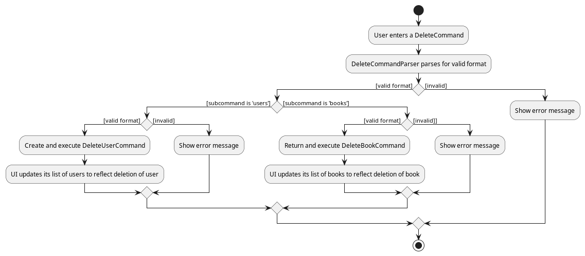
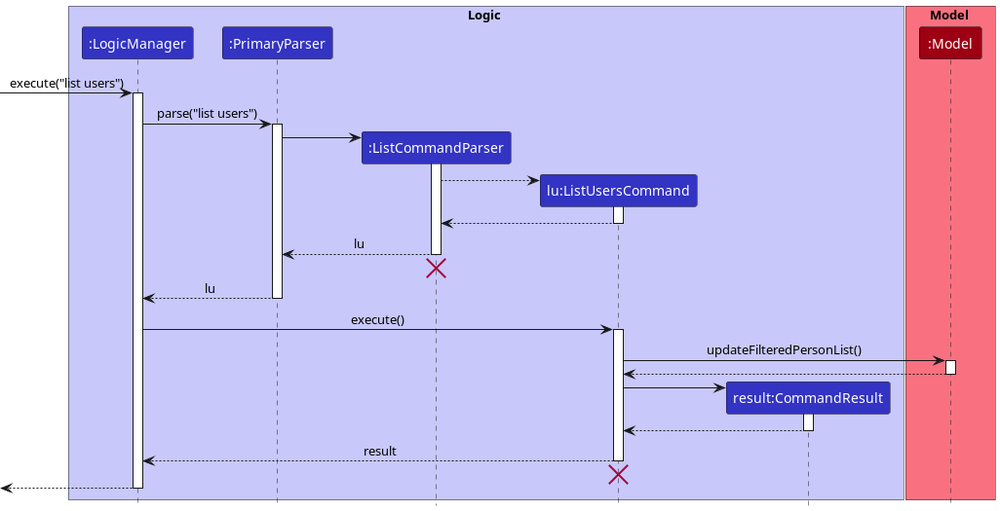
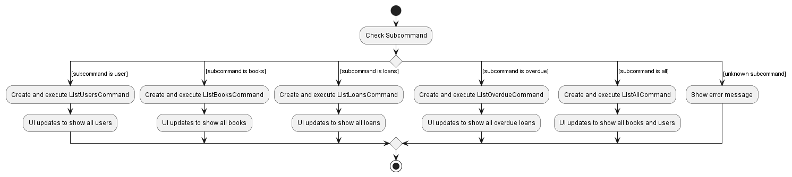

* Table of Contents
  {:toc}
  - [Acknowledgements](#acknowledgements)
  - [Setting up, getting started](#setting-up-getting-started)
  - [Design](#design)
    - [Architecture](#architecture)
    - [UI component](#ui-component)
    - [Logic component](#logic-component)
    - [Model component](#model-component)
    - [Storage component](#storage-component)
    - [Common classes](#common-classes)
  - [Implementation](#implementation)
    - [Command Parsing](#command-parsing)
    - [Add](#add-feature)
    - [Delete](#delete-feature)
    - [List](#list-feature)
    - [Find](#find-feature)
    - [Loan](#loan-feature)
    - [Return](#return-feature)
  - [Documentation, logging, testing, configuration](#documentation-logging-testing-configuration-dev-ops)
  - [Appendix: Requirements](#appendix-requirements)
    - [Product scope](#product-scope)
    - [User stories](#user-stories)
    - [Use cases](#use-cases)
    - [Non-function Requirements](#non-functional-requirements)
    - [Glossary](#glossary)
  - [Appendix: Instructions for manual testing](#appendix-instructions-for-manual-testing)
    - [Adding a book](#adding-a-book)
    - [Adding a user](#adding-a-user)
    - [Deleting a book](#deleting-a-book)
    - [Deleting a user](#deleting-a-user)
    - [Loaning a book](#loaning-a-book)
    - [Returning a book](#returning-a-book)
    - [Finding a book](#finding-a-book)
    - [Finding a user](#finding-a-user)
    - [Editing a book](#editing-a-book)
    - [Editing a user](#editing-a-user)
    - [Listing all books](#listing-all-books)
    - [Listing all users](#listing-all-users)
    - [Listing all books and user](#listing-all-books-and-user)
    - [Listing all loans](#listing-all-loans)
    - [Listing all overdue loans](#listing-all-overdue-loans)
  - [Appendix: Effort](#appendix-effort)

--------------------------------------------------------------------------------------------------------------------

## **Acknowledgements**

<table>
<thead>
<tr class="header">
<th>Resource</th>
<th>Used in</th>
<th>To</th>
</tr>
</thead>
<tbody>
<tr>
<td markdown="span"><a href="https://stackoverflow.com/a/14018549/13742805">https://stackoverflow.com/a/14018549/13742805</a>
</td>
<td markdown="span"><a href="https://github.com/AY2223S1-CS2103-F14-4/tp/tree/master/src/main/java/bookface/commons/util/StringUtil.java">StringUtil.java</a></td>
<td markdown="span">Help with parsing lower-case strings</td>
</tr>
<tr>
<td markdown="span"><a href="https://stackoverflow.com/a/4217164/13742805">https://stackoverflow.com/a/4217164/13742805</a>
</td>
<td markdown="span"><a href="https://github.com/AY2223S1-CS2103-F14-4/tp/tree/master/src/main/java/bookface/logic
/parser/CommandParser.java">CommandParser.java</a></td>
<td markdown="span">Force subclasses to have the same initial method calls</td>
</tr>
<tr>
<td markdown="span"><a href="https://stackoverflow.com/a/30974991/13742805">https://stackoverflow.com/a/30974991/13742805</a>
</td>
<td markdown="span"><a href="https://github.com/AY2223S1-CS2103-F14-4/tp/tree/master/src/main/java/bookface/commons/util/LambdaUtil.java">CommandParser.java</a></td>
<td markdown="span">A lambda function that throws a checked Exception</td>
</tr>
<tr>
<td markdown="span"><a href="https://stackoverflow.com/questions/12087419/adding-days-to-a-date-in-java">https://stackoverflow.com/questions/12087419/adding-days-to-a-date-in-java</a>
</td>
<td markdown="span"><a href="https://github.com/AY2223S1-CS2103-F14-4/tp/blob/master/src/main/java/bookface/logic/commands/LoanCommand.java">LoanCommand.java</a></td>
<td markdown="span">Add certain number of days to the current day</td>
</tr>
<tr>
<td markdown="span"><a href="https://stackoverflow.com/questions/62054264/check-invalid-date-by-localdate">https://stackoverflow.com/questions/62054264/check-invalid-date-by-localdate</a>
</td>
<td markdown="span"><a href="https://github.com/AY2223S1-CS2103-F14-4/tp/blob/master/src/main/java/bookface/logic/parser/LoanCommandParser.java">LoanCommandParser.java</a></td>
<td markdown="span">Parse dates properly</td>
</tr>
<tr>
<td markdown="span"><a href="https://www.ocpsoft.org/prettytime/nlp/">PrettyTimeParser library</a>
</td>
<td markdown="span"><a href="https://github.com/AY2223S1-CS2103-F14-4/tp/blob/master/src/main/java/bookface/logic/parser/LoanCommandParser.java">LoanCommandParser.java</a></td>
<td markdown="span">Allow for higher amounts of flexibility of date formats</td>
</tr>
</tbody>
</table>

_A list of the sources of all reused/adapted ideas, code, documentation, and third-party libraries -- with links to the original source as well_

--------------------------------------------------------------------------------------------------------------------

## **Setting up, getting started**

Refer to the guide [_Setting up and getting started_](SettingUp.md).

--------------------------------------------------------------------------------------------------------------------

## **Design**
    

:bulb: **Tip:** The `.puml` files used to create diagrams in this document can be found in the [diagrams](https://github.com/AY2223S1-CS2103-F14-4/tp/tree/master/docs/diagrams/) folder. Refer to the [_PlantUML Tutorial_ at se-edu/guides](https://se-education.org/guides/tutorials/plantUml.html) to learn how to create and edit diagrams.

### Architecture

The ***Architecture Diagram*** given above explains the high-level design of the App.

Given below is a quick overview of main components and how they interact with each other.

**Main components of the architecture**

**`Main`** has two classes called [`Main`](https://github.com/AY2223S1-CS2103-F14-4/tp/blob/master/src/main/java/bookface/Main.java) and [`MainApp`](https://github.com/AY2223S1-CS2103-F14-4/tp/blob/master/src/main/java/bookface/MainApp.java). It is responsible for,
* At app launch: Initializes the components in the correct sequence, and connects them up with each other.
* At shut down: Shuts down the components and invokes cleanup methods where necessary.

[**`Commons`**](#common-classes) represents a collection of classes used by multiple other components.

The rest of the App consists of four components.

* [**`UI`**](#ui-component): The UI of the App.
* [**`Logic`**](#logic-component): The command executor.
* [**`Model`**](#model-component): Holds the data of the App in memory.
* [**`Storage`**](#storage-component): Reads data from, and writes data to, the hard disk.

**How the architecture components interact with each other**

The *Sequence Diagram* below shows how the components interact with each other for the scenario where the user issues the command `delete user 1`.

Each of the four main components (also shown in the diagram above),

* defines its *API* in an `interface` with the same name as the Component.
* implements its functionality using a concrete `{Component Name}Manager` class (which follows the corresponding API `interface` mentioned in the previous point.

For example, the `Logic` component defines its API in the `Logic.java` interface and implements its functionality using the `LogicManager.java` class which follows the `Logic` interface. Other components interact with a given component through its interface rather than the concrete class (reason: to prevent outside component's being coupled to the implementation of a component), as illustrated in the (partial) class diagram below.

The sections below give more details of each component.

### UI component

The **API** of this component is specified in [`Ui.java`](https://github.com/AY2223S1-CS2103-F14-4/tp/blob/master/src/main/java/bookface/ui/Ui.java)

The UI consists of a `MainWindow` that is made up of parts e.g.`CommandBox`, `ResultDisplay`, `PersonListPanel`, `BookListPanel`, `StatusBarFooter` etc. All these, including the `MainWindow`, inherit from the abstract `UiPart` class which captures the commonalities between classes that represent parts of the visible GUI.

The `UI` component uses the JavaFx UI framework. The layout of these UI parts are defined in matching `.fxml` files
that are in the `src/main/resources/view` folder. For example, the layout of the [`MainWindow`](https://github.com/AY2223S1-CS2103-F14-4/tp/blob/master/src/main/java/bookface/ui/MainWindow.java) is specified in [`MainWindow.fxml`](https://github.com/AY2223S1-CS2103-F14-4/tp/blob/master/src/main/resources/view/MainWindow.fxml)

The `UI` component,

* executes user commands using the `Logic` component.
* listens for changes to `Model` data so that the UI can be updated with the modified data.
* keeps a reference to the `Logic` component, because the `UI` relies on the `Logic` to execute commands.
* depends on some classes in the `Model` component, as it displays `Person` and `Book` objects residing in the `Model`.

### Logic component

**API** : [`Logic.java`](https://github.com/AY2223S1-CS2103-F14-4/tp/blob/master/src/main/java/bookface/logic/Logic.java)

Here's a (partial) class diagram of the `Logic` component:

How the `Logic` component works:
1. When `Logic` is called upon to execute a command, it uses the `PrimaryParser` class to parse the user command.
1. This results in a `Command` object (more precisely, an object of one of its subclasses e.g., `AddUserCommand`) which is executed by the `LogicManager`.
1. The command can communicate with the `Model` when it is executed (e.g. to add a person).
1. The result of the command execution is encapsulated as a `CommandResult` object which is returned from `Logic`.

Here are the other classes in `Logic` (omitted from the class diagram above) that are used for parsing a user command:

How the parsing works:
* When called upon to parse a user command, the `PrimaryParser` class creates an `XYZCommandParser` (`XYZ` is a placeholder for the specific command name e.g., `AddUserCommandParser`) which uses the other classes shown above to parse the user command and create a `XYZCommand` object (e.g., `AddCommand`) which the `PrimaryParser` returns back as a `Command` object.
* Commands can be decomposed into subcommands. For example, to parse `delete user 1`, `PrimaryParser` calls `DeleteCommandParser`. `DeleteCommandParser` then parses `user 1` and returns a `DeleteUserCommand`.
* All `XYZCommandParser` classes (e.g., `AddUserommandParser`, `DeleteUserCommandParser`, ...) inherit from the `Parser` interface so that they can be treated similarly where possible e.g, during testing.

### Model component
**API** : [`Model.java`](https://github.com/AY2223S1-CS2103-F14-4/tp/blob/master/src/main/java/bookface/model/Model.java)

The `Model` component,

* stores BookFace data i.e., all `Person` objects and all `Book` objects (which are contained in a `UniquePersonList` object and a `BookList` object respectively).
* stores the currently 'selected' `Person` and `Book` objects (e.g., results of a search query) as a separate _filtered_ list which is exposed to outsiders as an unmodifiable `ObservableList<Person>` or `ObservableList<Book>` that can be 'observed' e.g. the UI can be bound to this list so that the UI automatically updates when the data in the list change.
* stores a `UserPref` object that represents the user’s preferences. This is exposed to the outside as a `ReadOnlyUserPref` objects.
* does not depend on any of the other three components (as the `Model` represents data entities of the domain, they should make sense on their own without depending on other components)

:information_source: **Note:** An alternative (arguably, a more OOP) model is given below. It has a `Tag` list in the `BookFace`, which `Person` references. This allows `BookFace` to only require one `Tag` object per unique tag, instead of each `Person` needing their own `Tag` objects. 

### Storage component

**API** : [`Storage.java`](https://github.com/AY2223S1-CS2103-F14-4/tp/blob/master/src/main/java/bookface/storage/Storage.java)

The `Storage` component,
* can save both BookFace data and user preference data in json format, and read them back into corresponding objects.
* inherits from both `BookFaceStorage` and `UserPrefStorage`, which means it can be treated as either one (if only the functionality of only one is needed).
* depends on some classes in the `Model` component (because the `Storage` component's job is to save/retrieve objects that belong to the `Model`)

### Common classes

Classes used by multiple components are in the `bookface.commons` package.

--------------------------------------------------------------------------------------------------------------------

## **Implementation**

This section describes some noteworthy details on how certain features are implemented.

### Command Parsing
The [**Logic**](#logic-component) section briefly explains how the user's input is broken down, but the process is explained more thoroughly here.

Parsing of commands is a three-step process - processing the first command word, then the arguments (if any), and constructing the Command instance.

The `add`, `edit`, `find`, `list`, and `delete` commands can apply to either users or books. These commands need additional subcommands and additional parsers to handle the different execution logic and command-line flags for users and books. Thus, the arguments to these commands are actually subcommands.

Compare the commands `loan 1 1` with `delete user 1`. `loan 1 1` has two integer arguments, which cannot be broken down further. However, the arguments `user 1` for `delete` can be treated as a single self-complete subcommand on their own.

These commands (and subcommands) are represented as enums to associate each possible command from the user with a parser.

#### Design consideration:

This approach was chosen to reduce code duplication, and to manage the complexity of `PrimaryParser`. Now, `DeleteUserCommand` (`delete user`) and `DeleteBookCommand` (`delete book`) can share similar code through a common parent `DeleteCommand` (`delete`).

Enums were chosen, as they use less memory (as enums are `final` subclasses of java.lang.Enum) than HashMap for key-value storage, and are easy to modify. Furthermore, they help to ensure type-checking during compile-time, preventing bugs. They also have a semantic value; they represent to both readers and future developers the current allowed constants.

### Add feature
#### Adding a book/user

The `add` command is an important command that is commonly used in BookFace. It allows the user to add a new book or a user to the system.

#### Design consideration:

Since `add` is used for the operations of both adding a book and adding a user, `AddSubCommand` is created to handle differentiating between adding a book and adding a user.

#### Adding a book with `add book`

`add book` adds a new book to the model. Specifically, `ModelManager` maintains a list of books and contains the method `addbook()` that is invoked by `AddBookCommand` to perform this adding operation.

The updating of the model is represented in the following diagram:

*The above will be updated with a more accurate diagram*

The following is the sequence diagram for this operation:
*To be updated with sequence diagram.*

#### Adding a user with `add user`
*To be updated.*

### Delete feature
#### Deleting a book/user
The `delete` allows the user to delete a book or a user from the system.

#### Deleting a book with `delete book`

`delete book` deletes a book from the model. Specifically, `ModelManager` maintains a list of books and contains the method `deleteBook()` that is invoked by `DeleteBookCommand`to perform this deletion.

The sequence diagram below illustrates the interactions within the `Logic` component for the `execute("delete user 1")` API call.

:information_source: **Note:** The lifeline for `DeleteCommandParser` should end at the destroy marker (X) but due to a limitation of PlantUML, the lifeline reaches the end of diagram.

#### Deleting a user with `delete user`
`delete book` deletes a user from the model. Specifically, `ModelManager` maintains a list of users and contains the method `deletePerson()` that is invoked by `DeleteUserCommand` to perform this deletion.

The sequence diagram is rather similar to that of `delete book`, so in the interest of brevity, it has been omitted.

#### Activity Diagram

The following activity diagram summarizes what happens when the librarian executes a `delete` command:

### List feature

#### Implementation

The list mechanism is facilitated by `LogicManager`. During its process of parsing the command by `PrimaryParser`,
a new `ListCommandParser` will be created to internally parse the argument of the command
through `ListSubcommand`.

Currently, there are 5 possible `Command` classes that can be returned from `ListSubcommand`, and
they are created in respect to the subcommand that is parsed:
* `ListBooksCommand` for `Book` upon the command `list books`
* `ListUsersCommand` for `Person` upon the command `list users`
* `ListAllCommand` for both `Book` and `Person` upon the command `list all`
* `ListLoansCommand` for both `Book` and `Person` upon the command `list loans`
* `ListOverdueCommand` for both `Book` and `Person` upon the command `list overdue`

Given below is an example usage scenario and how the list mechanism behaves
at each step.

Step 1. The librarian has executed a `FindUserCommand`, which filtered certain user records to display in BookFace. The librarian
then wants to return the display state to show all user records by entering the `list users` command, which attempts to list all users
in BookFace.

Step 2. `LogicManager` executes the command.

Step 3. `PrimaryParser` then creates a new `ListCommandParser` object, which internally creates a `ListSubcommand` object
to parse the second part of the command (which is `users`).

Step 4. `ListSubcommand` parses the subcommand as an argument and creates a new `ListUsersCommand`.

Step 5. `LogicManager` executes `ListUsersCommand`, which then calls `Model#updateFilteredPersonList()` with a predicate to show all users.

The following sequence diagram shows how the list operation works
(following the steps mentioned above):

:information_source: **Note:** The lifeline for `ListUsersCommand`
and `ListUsersCommand` should end at the destroy marker (X) but due to a limitation of PlantUML, the lifeline reaches
the end of diagram.

The following activity diagram summarizes what happens when a user executes a list command:

### Find feature

#### Implementation

The find feature is facilitated by `FindUserCommand` and `FindUserArgumentsParser` for finding users, and `FindBookCommand` and `FindBookArgumentsParser` for finding books.
It implements the following operations:
* `updateFilteredPersonList(predicate)` — Display users with names matching predicate.
* `updatedFilteredBookList(predicate)` — Display books with title/authors matching predicate.

Given below is an example usage scenario and how the find users mechanism behaves at each step.

Step 1. Assume that BookFace contains some users that are added through several `AddUserCommand` executed by the user. The user executes `find user alex` command to find any user with name 'alex' within the address book.

Step 2. `LogicManager` executes the `find user alex` command.

Step 3. PrimaryParser then creates a new `FindUserArgumentsParser` after parsing `find user alex`.

Step 4. `FindUserArgumentsParser` parses `"alex"` and creates a new `FindUserCommand`.

Step 5. `LogicManager` executes the `FindUserCommand`.

Step 6. `FindUserCommand` calls `Model#updateFilteredPersonList("alex")`  and find all users with names matching "alex".

Step 7. `FindUserCommand` creates new `CommandResult` and returns the result to `LogicManager`.

The following sequence diagram shows a visualization of the above find process:

The following activity diagram summarizes what happens when the librarian executes a find user command:

The process for finding books goes through a similar process as the process for finding users. Given below is an example usage scenario and how the find books mechanism behaves at each step.

Step 1. Assume that BookFace contains some books that are added through several `AddBookCommand` executed by the user. The user executes `find book moby` command to find any book with title or author with 'moby' within the book list.

Step 2. `LogicManager` executes the `find book moby` command.

Step 3. PrimaryParser then creates a new `FindBookArgumentsParser` after parsing `find book moby`.

Step 4. `FindBookArgumentsParser` parses `"moby"` and creates a new `FindBookCommand`.

Step 5. `LogicManager` executes the `FindBookCommand`.

Step 6. `FindBookCommand` calls `Model#updateFilteredBookList("moby")`  and find all books with titles or authors matching "moby".

Step 7. `FindBookCommand` creates new `CommandResult` and returns the result to `LogicManager`.

The following sequence diagram shows a visualization of the above find process:

The following activity diagram summarizes what happens when the librarian executes a find command:

#### Design considerations
The find command is designed such that the matches within `BookList` and `UniquePersonList` are easily found and listed onto the UI of BookFace.

### Loan feature

#### Implementation

The loan mechanism is facilitated by `LoanCommandParser` and `LoanCommand`. It implements the following operation:
* `BookFace#loan()` — Loans to the specified user a specified book.

This operation is exposed in the `Model` interface as `Model#loan()`.

Given below is an example usage scenario and how the loan mechanism behaves at each step.

Step 1. Assume that FaceBook contains some users and some books that are added through several `AddUserCommand` and `AddBookCommand`
executed by the librarian. The librarian then enters `loan 2 2` command to loan to the 2nd user in the user list the 2nd book
in the book list.

Step 2. `LogicManager` executes the librarian's `loan 2 2` command.

Step 3. `PrimaryParser` then creates a new `LoanCommandParser` after parsing `loan 2 2`.

Step 4. `LoanCommandParser` parses `2 2` and creates a new `LoanCommand`.

Step 5. `LogicManager` executes `LoanCommand`.

Step 6. `LoanCommand` calls `Model#Loan()` and loans the 2nd user in the user list the 2nd book
in the book list.

Step 7. `LoanCommand` creates a new `CommandResult` and returns the result to `LogicManager`.

The following sequence diagram shows how the loan operation works:

:information_source: **Note:** The lifeline for `LoanCommandParser`
should end at the destroy marker (X) but due to a limitation of PlantUML, the lifeline reaches the end of diagram.

The following activity diagram summarizes what happens when the librarian executes a loan command:

#### Design considerations:
The loan command is designed such that the `BookList` and `UniquePersonList`
are updated sequentially rather than concurrently, such that there are
separate loan commands in both `BookList` and `UniquePersonList` that are called
by `BookFace` that updates the `BookList` and `UniquePersonList` respectively.

We wanted to avoid the design such that both `Book` and `Person` were associated with each other 
directly (ie. can access details of each other) to reduce coupling. Currently, `Person` contains a `Set` of loaned books
while `Book` contains a `loanee` and a `returnDate` and the loan command updates all the attributes of `Person`
and `Book` separately.

One issue is that the `UniquePersonList` and `BookList` do not refresh their UI
automatically, and we resorted to getting the index of each list to set their
internal `ObservableLists` to 'refresh' their UI.

We have chosen to use an external `PrettyTimeParser` library here to allow for higher degrees of flexibility for input. One downside however is that it uses Natural Language Processing, and it may cause unintended parsing behaviours that is difficult to resolve since Natural Language Processing is beyond the scope of this module. In this case, invalid dates such as `2075-99-99` are accepted as valid dates by the library, and we have decided to check only for the two most common date formats, `dd/MM/yyyy` and `yyyy-MM-dd`.

### Return feature

#### Implementation

Similar to the loan mechanism, the return mechanism is facilitated by `ReturnCommandParser` and `ReturnCommand`. It implements the following operation:
* `BookFace#returnLoanedBook()` — returns a loaned book.

This operation is exposed in the `Model` interface as `Model#returnLoanedBook()`.

Given below is an example usage scenario and how the return mechanism behaves at each step.

Step 1. Assume that FaceBook contains some users and some books that are added through several `AddUserCommand` and `AddBookCommand`
executed by the librarian. The librarian then enters `loan 2 2` command to loan to the 2nd user in the user list the 2nd book
in the book list. The librarian now wants to return the 2nd book that was previously loaned out.
The librarian enters `return 2` command.

Step 2. `LogicManager` executes the librarian's `return 2` command.

Step 3. `PrimaryParser` then creates a new `ReturnCommandParser` after parsing `return 2`.

Step 4. `ReturnCommandParser` parses `2` and creates a new `ReturnCommand`.

Step 5. `LogicManager` executes `ReturnCommand`.

Step 6. `ReturnCommand` calls `Model#returnLoanedBook()` and returns the 2nd book in the book list.

Step 7. `ReturnCommand` creates a new `CommandResult` and returns the result to `LogicManager`.

The following sequence diagram shows how the return operation works:

:information_source: **Note:** The lifeline for `ReturnCommandParser`
should end at the destroy marker (X) but due to a limitation of PlantUML, the lifeline reaches the end of diagram.

The following activity diagram summarizes what happens when a user executes a return command:

#### Design considerations:
Similar to Design considerations for the loan command.

--------------------------------------------------------------------------------------------------------------------

## **Documentation, logging, testing, configuration, dev-ops**

* [Documentation guide](Documentation.md)
* [Testing guide](Testing.md)
* [Logging guide](Logging.md)
* [Configuration guide](Configuration.md)
* [DevOps guide](DevOps.md)

--------------------------------------------------------------------------------------------------------------------

## **Appendix: Requirements**

### Product scope

**Target user profile**:

* librarians managing a small library
* has a need to manage a significant number of patrons
* prefer desktop apps over other types
* can type fast and is reasonably comfortable using CLI apps
* has no access to card-based systems to manage loans

**Value proposition**: Our app replaces a paper-based system or manual tracking of books, providing greater speed/efficiency in identifying where a book is, or when it is due. It also adds a member-tracking system to handle an increasing number of library members.

### User stories

Priorities: High (must have) - `* * *`, Medium (nice to have) - `* *`, Low (unlikely to have) - `*`

| Priority | As a …​                            | I want to …​                   | So that I can…​                                        |
|----------|------------------------------------|--------------------------------|--------------------------------------------------------|
| `* * *`  | new user                           | see usage instructions         | refer to instructions when I forget how to use the App |
| `* * *`  | user                               | add book records               |                                                        |
| `* * *`  | user                               | delete book records            |                                                        |
| `* * *`  | user                               | view the book records          |                                                        |
| `* * *`  | user                               | add new patrons to my library  |                                                        |
| `* * *`  | user                               | delete patrons from my library |                                                        |
| `* * *`  | user                               | add loans                      | mark books as unavailable                              |
| `* * *`  | user                               | mark loans as returned         | mark books as available                                |
| `* * *`  | user                               | view the overdue books         |                                                        |
| `* * *`  | person who likes to talk to others | type my commands to a CLI      | so I can work while interacting with my patrons        |

*{More to be added as we progress into future versions}*

### Use cases

(For all use cases below, the **System** is the `BookFace` and the **Actor** is the `User`, unless specified otherwise)

**Use case: UC01 - Delete a book record**

**MSS**

1.  User requests to delete a book record
2.  BookFace shows a list of books
3.  User requests to delete a specific book record in the list
4.  BookFace deletes the book record from the list

Use case ends.

**Extensions**

* 2a. The list is empty.

  Use case ends.

* 3a. The given index is invalid.

    * 3a1. BookFace shows an error message.

      Use case resumes at step 2.

**Use case: UC02 - List book records**

**MSS:**

1.  User requests to list all book records
2.  BookFace shows a list of books
 Use case ends.

**Extensions:**

* 1a. The list is empty.
   Use case ends.

* 1b. The list of books cannot be retrieved.
    * 1b1. BookFace shows an error message.
     Use case ends.

**Use case: UC03 - Add a book**

**MSS**
1. The librarian has a new book to add to BookFace.
2. The librarian uses the `add book` command with the required fields.
3. BookFace checks for the correctness of the command.
4. BookFace adds the entry to the list of books.

    Use case ends.

**Extensions**
* 3a. There is a book with the exact same details.
  * 3a1. BookFace notifies the librarian of the duplicate.
  * 3a2. BookFace creates this book as a separate object.
  * 3a3. BookFace saves this book to the list.

    Use case ends.
* 3b. The librarian did not specify all required fields.
  * 3b1. BookFace notifies the librarian of the correct usage of `add book`.

    Use case ends.

### Non-Functional Requirements

1. Should work on any _mainstream OS_ as long as it has Java `11` or above installed.
2. Should be able to hold up to 1000 persons without a noticeable sluggishness in performance for typical usage.
3. A user with above average typing speed for regular English text (i.e. not code, not system admin commands) should be able to accomplish most of the tasks faster using commands than using the mouse.
4. Someone without coding background should find BookFace easy to use.
5. The system should respond in 1 second.
6. The system should be backward compatible with data produced by earlier versions of the system.
7. BookFace is not required to handle the displaying detailed reports about users (their loan history, statistics on
   their membership such as frequency of loans) yet.
8. BookFace should work even without an active internet connection.
9. The data stored in a BookFace instance should be recoverable even if the instance crashes.
10. BookFace will need at least 50 MB of disk space to work.
11. BookFace does not plan to improve its accessibility for blind, deaf, or otherwise disabled users according to
    the Web Content Accessibility Guidelines (WCAG 2.1)
12. BookFace should be able to handle basic human mistakes, such as incorrect syntax for commands and prompt the
    user to retry
13. BookFace should be extensible and sufficiently decoupled such that a separate GUI can be attached to the
    existing backend services and database

### Glossary

<table>
<colgroup>
<col width="30%" />
<col width="70%" />
</colgroup>
<thead>
<tr class="header">
<th>Term</th>
<th>Explanation</th>
</tr>
</thead>
<tbody>
<tr>
<td markdown="span">Mainstream OS</td>
<td markdown="span">Windows, Linux, OS-X</td>
</tr>
<tr>
<td markdown="span">CLI</td>
<td markdown="span">Command-Line Interface</td>
</tr>
<tr>
<td markdown="span">GUI</td>
<td markdown="span">Graphical User Interface</td>
</tr>
<tr>
<td markdown="span">Loan</td>
<td markdown="span">A book that has been borrowed from the library</td>
</tr>
</tbody>
</table>

--------------------------------------------------------------------------------------------------------------------

## **Appendix: Instructions for manual testing**

Given below are instructions to test the app manually.

:information_source: **Note:** These instructions only provide a starting point for testers to work on;
testers are expected to do more *exploratory* testing.

### Launch and shutdown

1. Initial launch

   1. Download the jar file and copy into an empty folder

   1. Open command prompt/terminal within the folder and enter  `java -jar BookFace.jar` 
   Expected: Shows the GUI with a set of sample user records. The window size may not be optimum.

2. Saving window preferences

   1. Resize the window to an optimum size. Move the window to a different location. Close the window.

   2. Re-launch the app by double-clicking the jar file. 
       Expected: The most recent window size and location is retained.

3. _{ more test cases …​ }_

### Adding a book
1. Adding a book while all books are being shown
   1. Prequisites: List all books using the `list books` or `list all` command.

   2. Test case: `add book t/Moby Dick a/Herman Melville` 
      Expected: Successful addition of the book to the bottom of the book list. 

   3. Test case: `add book t/Moby Dick` 
      Expected: No book is added. Error details shown in the status message.

   4. Other incorrect add book commands to try: `add book`, `add book t/Herman Melville`, `...` (where one or more compulsory parameter prefixes are missing)  
      Expected: Similar to previous

### Adding a user
1. Adding a user while all users are being shown
   
   1. Prerequisites: List all users using the `list users` or `list all` command.

   2. Test case: `add user n/James Bond p/96629813 e/jamesbond@gmail.com` 
      Expected: Successful addition of the user to the bottom of the person list.

   3. Test case: `add user n/James Bond p/96629813` 
      Expected: No user is added. Error details shown in the status message.

   4. Other incorrect add user commands to try: `add user`, `add user n/James Bond`, `...` (where one or more compulsory parameter prefixes are missing)  
      Expected: Similar to previous.

### Deleting a book
1. Deleting a book 
   1. Prequisites: List all books using the `list books` or `list all` command, and there is at least one or more books in the book list. 

   2. Test case: `delete book 1` 
      Expected: First book is deleted from the book list. Details of the deleted book are shown in the status message.

   3. Test case: `delete book 0` 
      Expected: No book is deleted. Error details shown in the status message.

   4. Other incorrect delete book commands to try: `delete book`, `delete book x`, `...` (where x is larger than the book list size) 
      Expected: Similar to previous

2. Deleting a book that is loaned out
   1. Prerequisites: At least one or more user and book in BookFace, and book is loaned out using the `loan 1 1` command.

   2. Test case: `delete book 1`  
      Expected: No book is deleted. Error message shown in the status message.

### Deleting a user

1. Deleting a user while all users are being shown

   1. Prerequisites: List all users using the `list users` or `list all` command, and there is at least one or more users in the person list.

   2. Test case: `delete user 1` 
      Expected: First contact is deleted from the list. Details of the deleted contact shown in the status message.

   3. Test case: `delete user 0` 
      Expected: No person is deleted. Error details shown in the status message.

   4. Other incorrect delete user commands to try: `delete user`, `delete user x`, `...` (where x is larger than the list size) 
      Expected: Similar to previous.

### Loaning a book

1. Loaning a book that is already loaned

   1. Prerequisites: A book at index 1 that is loaned to a user using the `loan 1 1` command, and other books in BookFace that are not loaned out.

   2. Test case: `loan 2 1` 
      Expected: Book at the first index remains loaned to the first loaner that has not returned the book. Error details shown in the status message.

   3. Test case: `loan 2 2` 
      Expected: Book at index 2 loaned out to user at index 2. Details of the loan are shown in the status message. 

### Returning a book

1. Return a book that is not loaned

   1. Prerequisites: A book at index 2 that is not on loan, and a book at index 1 that is loaned out using the `loan 1 1` command.

   2. Test case: `return 2` 
      Expected: Book is not returned as it is not on loan. Error details shown in the status message.

   3. Test case: `return 1` 
      Expected: Book is no longer on loan. Return details shown in the status message.

### Finding a book

1. Finding a book while all books are being shown

   1. Prerequisites: List all books using the `list books` or `list all` command, and there is at least one or more books in BookFace.

   2. Test case: `find book Moby` 
      Expected: All books with authors and titles containing "Moby" (case insensitive) is shown. Details of the number of matching books found shown in the status message.

   3. Test case: `find book` 
      Expected: No change in books displayed. Error details shown in the status message.

### Finding a user

1. Finding a user while all users are being shown

   1. Prerequisites: List all users using the `list users` or `list all` command, and there is at least one or more users in BookFace.

   2. Test case: `find user James` 
      Expected: All users with names containing "James" (case insensitive) is shown. Details of the number of matching users found shown in the status message.

   3. Test case: `find user` 
      Expected: No change in users displayed. Error details shown in the status message.

### Editing a book
1. Editing a book while all books are being shown

   1. Prerequisites: List all books using the `list books` or `list all` command, and there is at least one or more books in BookFace.
   
   2. Test case: `edit book 1 a/Thomas Jefferson` 
      Expected: Book at index 1 has its author set to "Thomas Jefferson". Edited book details shown in the status message.
   
   3. Test case: `edit book 1` 
      Expected: No change in details for book at index 1. Error details shown in the status message.

### Editing a user
1. Editing a user while all users are being shown
   
   1. Prerequisites: List all users using the `list users` or `list all` command, and there is at least one or more users in BookFace.
   
   2. Test case: `edit user 1 n/Leonard Chong` 
      Expected: User at index 1 has their name set to "Leonard Chong". Edited user details shown in the status message.
   
   3. Test case: `edit user 1` 
      Expected: No change in details for user at index 1. Error details shown in the status message. 

### Listing all books
1. Listing all books from a narrowed down list of books

   1. Prerequisites: A narrowed down list of books is shown after using the `find book KEYWORD`, `list loans` or `list overdue` commands.

   2. Test case: `list books` 
      Expected: All books are shown. Message shown in the status message.
    
### Listing all users
1. Listing all users from a narrowed down list of users

   1. Prerequisites: A narrowed down list of users is shown after using the `find user KEYWORD`, `list loans` or `list overdue` commands.
   
   2. Test case: `list users` 
      Expected: All users are shown. Success message shown in the status message.

### Listing all books and user
1. Listing all books and users from a narrowed down list of users and books
   
   1. Prerequisites: Books and users shown are a narrowed down list of books and users after using the `find book KEYWORD`, `find user KEYWORD`, `list loans` or `list overdue` commands.
   
   2. Test case: `list all` 
      Expected: All users and books shown. Success message shown in the status message.

### Listing all loans
1. Listing all loans when all users and books are being shown

   1. Prerequisites: List all users and books using the `list all` command.
   
   2. Test case: `list loans` 
      Expected: All books that are loaned out and users who have ongoing loans are shown.

### Listing all overdue loans
1. Listing all overdue loans when all loans are being shown

   1. Prequisites: List all loans using the `list loans` command.
   
   2. Test case: `list overdue` 
      Expected: All books that are overdue and users who owe overdue books are shown.

### Saving data

1. Dealing with missing/corrupted data files

   1. _{explain how to simulate a missing/corrupted file, and the expected behavior}_

1. _{ more test cases …​ }_

## **Appendix: Effort**

* **Difficulty level** 
  Creating the `Book` entity alone was somewhat viable for us to do. However, it became quite difficult when multiple variables come into play with `Book`. For instance, integrating `Loan` into `Book` and `Person` meant that we had to ensure any data that is to be created or modified are performed correctly and synchronized with one another (E.g. A `Person`'s loaned book status should reflect all `Book` records that were loaned specifically to that `Person`). Parsing the various commands was the most difficult part of the project since the main commands like `Add` and `Edit` now involved more than 1 entity (unlike in AddressBook), and thus made the product more prone to errors and unexpected bugs from a multitude of possible inputs.
* **Challenges faced** 
  * Changing of features due to multiple implementations; 
    Some features are related to one another (E.g. `Book` and `Loan`), and that made implementations difficult to synchronise, especially when multiple people are modifying them to suit their specific tasks. For instance, if `Book` were to have a quantity variable, `Loan` needs to be modified such that it can keep track of the `Book` quantity and the record is synchronised correctly with `Person`. However, if `Loan` and `Book` are in the middle of an enhancement, it becomes extremely tough to ensure our implementations work with these enhancements.
