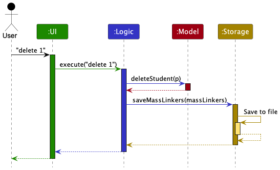
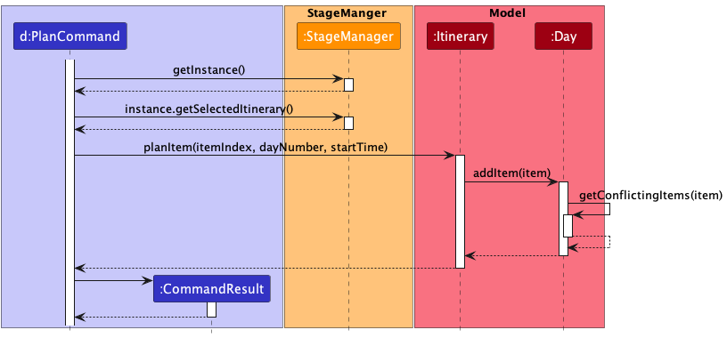

* Table of Contents
{:toc}

--------------------------------------------------------------------------------------------------------------------

## **Acknowledgements**

* {list here sources of all reused/adapted ideas, code, documentation, and third-party libraries -- include links to the original source as well}

--------------------------------------------------------------------------------------------------------------------

## **Setting up, getting started**

Refer to the guide [_Setting up and getting started_](SettingUp.md).

--------------------------------------------------------------------------------------------------------------------

## **Design**

:bulb: **Tip:** The `.puml` files used to create diagrams in this document can be found in the [diagrams](https://github.com/se-edu/addressbook-level3/tree/master/docs/diagrams/) folder. Refer to the [_PlantUML Tutorial_ at se-edu/guides](https://se-education.org/guides/tutorials/plantUml.html) to learn how to create and edit diagrams.

### Architecture

The ***Architecture Diagram*** given above explains the high-level design of the App.

Given below is a quick overview of main components and how they interact with each other.

**Main components of the architecture**

**`Main`** has two classes called [`Main`](https://github.com/AY2223S1-CS2103T-W11-4/tp/blob/master/src/main/java/seedu/waddle/Main.java) and [`MainApp`](https://github.com/AY2223S1-CS2103T-W11-4/tp/blob/master/src/main/java/seedu/waddle/MainApp.java). It is responsible for,
* At app launch: Initializes the components in the correct sequence, and connects them up with each other.
* At shut down: Shuts down the components and invokes cleanup methods where necessary.

[**`Commons`**](#common-classes) represents a collection of classes used by multiple other components.

The rest of the App consists of five components.

* [**`UI`**](#ui-component): The UI of the App.
* [**`Logic`**](#logic-component): The command executor.
* [**`Model`**](#model-component): Holds the data of the App in memory.
* [**`Storage`**](#storage-component): Reads data from, and writes data to, the hard disk.
* [**`StageManager`**](#stageManager-component): Keeps track of the App's current stage.

**How the architecture components interact with each other**

The *Sequence Diagram* below shows how the components interact with each other for the scenario where the user issues the command `delete 1`.

StageManager (shown in the diagram above) uses the Singleton pattern and is accessible by the Logic component for checking and changing the app's current stage.

The other four main components (also shown in the diagram above),

* defines its *API* in an `interface` with the same name as the Component.
* implements its functionality using a concrete `{Component Name}Manager` class (which follows the corresponding API `interface` mentioned in the previous point.

For example, the `Logic` component defines its API in the `Logic.java` interface and implements its functionality using the `LogicManager.java` class which follows the `Logic` interface. Other components interact with a given component through its interface rather than the concrete class (reason: to prevent outside component's being coupled to the implementation of a component), as illustrated in the (partial) class diagram below.

The sections below give more details of each component.

### UI component

The **API** of this component is specified in [`Ui.java`](https://github.com/AY2223S1-CS2103T-W11-4/tp/blob/master/src/main/java/seedu/waddle/ui/Ui.java)

The UI consists of a `MainWindow` that is made up of parts e.g.`CommandBox`, `ResultDisplay`, `ItineraryListPanel`, `ItemGroupListPanel`, `StatusBarFooter` etc. All these, including the `MainWindow`, inherit from the abstract `UiPart` class which captures the commonalities between classes that represent parts of the visible GUI.

The `UI` component uses the JavaFx UI framework. The layout of these UI parts are defined in matching `.fxml` files that are in the `src/main/resources/view` folder. For example, the layout of the [`MainWindow`](https://github.com/AY2223S1-CS2103T-W11-4/tp/blob/master/src/main/java/seedu/waddle/ui/MainWindow.java) is specified in [`MainWindow.fxml`](https://github.com/AY2223S1-CS2103T-W11-4/tp/blob/master/src/main/resources/view/MainWindow.fxml)

The `UI` component,

* executes user commands using the `Logic` component.
* listens for changes to `Model` data so that the UI can be updated with the modified data.
* keeps a reference to the `Logic` component, because the `UI` relies on the `Logic` to execute commands.
* depends on some classes in the `Model` component, as it displays `Itinerary` object residing in the `Model`.

### Logic component

**API** : [`Logic.java`](https://github.com/AY2223S1-CS2103T-W11-4/tp/blob/master/src/main/java/seedu/waddle/logic/Logic.java)

Here's a (partial) class diagram of the `Logic` component:

How the `Logic` component works:
1. When `Logic` is called upon to execute a command, it uses the `WaddleParser` class to parse the user command.
2. This results in a `Command` object (more precisely, an object of one of its subclasses e.g., `AddCommand`) which is executed by the `LogicManager`.
3. The command can communicate with the `Model` when it is executed (e.g. to add an item).
4. The result of the command execution is encapsulated as a `CommandResult` object which is returned back from `Logic`.

The Sequence Diagram below illustrates the interactions within the `Logic` component for the `execute("delete 1")` API call.

:information_source: **Note:** The lifeline for `DeleteCommandParser` should end at the destroy marker (X) but due to a limitation of PlantUML, the lifeline reaches the end of diagram.

Here are the other classes in `Logic` (omitted from the class diagram above) that are used for parsing a user command:

How the parsing works:
* When called upon to parse a user command, the `WaddleParser` class creates an `XYZCommandParser` (`XYZ` is a placeholder for the specific command name e.g., `AddCommandParser`) which uses the other classes shown above to parse the user command and create a `XYZCommand` object (e.g., `AddCommand`) which the `WaddleParser` returns back as a `Command` object.
* All `XYZCommandParser` classes (e.g., `AddCommandParser`, `DeleteCommandParser`, ...) inherit from the `Parser` interface so that they can be treated similarly where possible e.g, during testing.

### Model component
**API** : [`Model.java`](https://github.com/AY2223S1-CS2103T-W11-4/tp/blob/master/src/main/java/seedu/waddle/model/Model.java)

The `Model` component,

* stores the app data i.e., all `Itinerary` objects (which are contained in a `UniqueItineraryList` object).
* stores the currently 'selected' `Itinerary` objects (e.g., results of a search query) as a separate _filtered_ list which is exposed to outsiders as an unmodifiable `ObservableList<Itinerary>` that can be 'observed' e.g. the UI can be bound to this list so that the UI automatically updates when the data in the list change.
* stores a `UserPref` object that represents the user’s preferences. This is exposed to the outside as a `ReadOnlyUserPref` objects.
* does not depend on any of the other three components (as the `Model` represents data entities of the domain, they should make sense on their own without depending on other components).

### Storage component

**API** : [`Storage.java`](https://github.com/AY2223S1-CS2103T-W11-4/tp/blob/master/src/main/java/seedu/waddle/storage/Storage.java)

The `Storage` component,
* can save both Waddle data and user preference data in json format, and read them back into corresponding objects.
* inherits from both `WaddleStorage` and `UserPrefStorage`, which means it can be treated as either one (if only the functionality of only one is needed).
* depends on some classes in the `Model` component (because the `Storage` component's job is to save/retrieve objects that belong to the `Model`)

### Common classes

Classes used by multiple components are in the `seedu.waddle.commons` package.

--------------------------------------------------------------------------------------------------------------------

## **Implementation**

This section describes some noteworthy details on how certain features are implemented.

### Plan/Unplan Feature

The Plan/Unplan feature allows users to allocate an item to a particular time slot within a day.

#### Implementation
 The Plan/Unplan mechanism is facilitated mainly by the `Itinerary` and `Day` classes. First, let us take a look at class structure of the `Itinerary` ,`Day` and  `item` classes.

The diagram above is a partial class diagram containing the all the fields and relevant methods needed to understand the Plan/Unplan implementation.

The fields of particular concern are explained below.
* `unscheduledItemList` — A UniqueItemList of unscheduled items in an Itinerary.
* `days` — A List of Days in an Itinerary.
* `itemList` — A UniqueItemList of scheduled items in a Day.

Additionally, we will explain the methods of particular concern below.

* `Itinerary#planItem(Index, dayNumber, LocalTime)` — Transfers the selected item from the itinerary's unscheduledItemList to the itemList of the selected day. Sets the startTime of the itinerary to the specified startTime. Returns the item.
* `Itinerary#unplanItem(MultiIndex)` — Transfers the selected item from the selected day's itemList to the itinerary's unscheduledItemList. Resets the startTime field of the item. Re-sort the items in `unscheduledItemList` by order of priority. Returns the item.
* `Day#additem(Item)` — Adds the provided item into the itemList if there are no time conflicts. Re-sort the items in itemList by order of startTime.
* `Day#removeitem(Index)` — Removes the item at the specified index from itemList. Returns the item.
* `Day#getConflictingItems(Item)` — Returns a list of items, in the day's itemList, that have time conflicts with the provided item.
* `Item#getStartTime()` — Returns the start time of the item.
* `Item#getEndTime()` — Returns the end time of the item.

Given below is an example usage scenario and how the Plan/Unplan mechanism behaves at each step.

Step 1. The user executes `plan 1 d/1 t/12:00` command to plan the first item in the unscheduledItemList to the first day at time 12:00. The `plan` command is then parsed into a `PlanCommand` object and executed by the LogicManger. This is similar to what was shown in the Architecture Sequence Diagram under the Design section.

Step 2. The `PlanCommand` object's `execute()` method is called. `PlanCommand` gets the singleton instance of StageManager through `StageManager#getInstance()` followed by the current selected `Itinerary` object through `StageManager#getSelectedItinerary()`.

Step 3. `PlanCommand` calls `Itinerary#planItem(itemIndex, dayNumber, startTime)` with the parsed values from the `plan 1 d/1 t/12:00` command.

Step 4. `Itinerary` gets the item from its unscheduledItemList at the specified `itemIndex`. It sets the startTime of the item and then calls `Day#addItem(item)` of the `Day` at index `dayNumber` with the item.

Step 5. `Day`self invokes `Day#getConflictingItems(item)`. If there are no conflicting items, the incoming item is added into the day's `itemList`. If there are conflicting items, a CommandException is thrown with a time conflict message.

Step 6. If the item is successfully added, a `CommandResult` object is created with the success message.

The following sequence diagram shows how the undo operation works:

:information_source: **Note:** The Unplan command works in a similar manner. Instead of `Itinerary#planItem(itemIndex, dayNumber, startTime)` and `Day#addItem(item)`, `Itinerary#unplanItem(MultiIndex)` and `Day#removeitem(Index)` are called instead.

### Edit an item

Refer above for the class structure of the `Itinerary` ,`Day` and  `item` classes.

Items can be either scheduled or unscheduled. Unscheduled items are stored in an itinerary's unscheduledItemList while scheduled items are stored in the respective days' itemLists. as such, both are handled in slightly different manners.

Given below is a walk-through of the edit item mechanism. We will skip to where the `EditItemCommand#execute()` method is called since the preceding portion is similar to what we have laid out in previous sections.

Step 1. The `EditItemCommand` object's `execute()` method is called.

Step 2. The multiIndex in `EditItemCommand` is checked for a presence of a dayNumber. If dayNumber is absent, follow the steps under Unscheduled Items, else follow the steps under Scheduled Items.

* **Unscheduled Items**
  * Step 3. The index is checked to be within bounds of the itinerary's unscheduledItemList. If it is not, a `CommandException` is thrown.
  * Step 4. A new `Item` object, `editedItem` is created with the edited inputs.
  * Step 5. A check for duplicates in the unscheduledItemList is done. If there is a duplicate, a `CommandException` is thrown.
  * Step 6. The original item is replaced with `editedItem`.
  * Step 7. The unscheduledItemList is re-sorted in order of priority.
* **Scheduled Items**
  * Step 3. The dayNumber and index are checked to be within bounds of the itinerary's duration and unscheduledItemList respectively. If any is not, a `CommandException` is thrown.
  * Step 4. A new `Item` object, `editedItem` is created with the edited inputs.
  * Step 5. A check for duplicates in the day's itemList is done. If there is a duplicate, a `CommandException` is thrown.
  * Step 6. The original item is removed from the day's itemList
  * Step 7. Attempt to add the `editedItem` into the itemList. If a time conflict is detected, the original item is added back into the itemList and a `CommandException` is thrown.
  * Step 8. If the `editedItem` is added successfully, the itemList is re-sorted in order of startTime.

### Edit an itinerary

An itinerary's details (description, start date, duration, and budget) can be edited by changing the fields of an Itinerary object.

Given below are some example usage scenarios and how the editing mechanism is carried out. As per the examples above, we will skip to where the `EditCommand#execute()` method is called.

Step 1. The `EditCommand` object's `execute()` method is called.

* **Editing an itinerary's description, budget, and start date**
    * Step 2. A new `Itinerary` object, `editedItinerary` is created with the edited inputs.
    * Step 3. A check for duplicates in model is done. If there is a duplicate, a `CommandException` is thrown.
    * Step 4. The original itinerary is replaced with `editedItinerary`.
* **Editing an itinerary's duration**
  * The steps are similar but with the additional checks below.
  * If the duration is extended, add more Day objects to the Itinerary's list.
  * If the duration is reduced, remove the extra Day objects from the Itinerary's list starting from the back (i.e., the last Day is removed first).
    * The Items that were scheduled in the deleted Days would be unscheduled.
  * Update the duration field.

### Export

The Export feature is facilitated by the pdfbox library.

The conversion from Objects to a text output can be done by calling the `getTextRepresentation()` method of the `Itinerary` ,`Day` and  `item` classes in a cascading manner.

`Itinerary#getTextRepresentation()` will call and append `Day#getTextRepresentation()` of the `Day`s in its `days` list.  `Day#getTextRepresentation()` then calls and append `Item#getTextRepresentation()` of the `Item`s in its `itemList`.
The output will be the itinerary fully represented in text form and written to a newly created blank pdf.

PDF is then exported.

PDF will be stored as "data/<itinerary name>.pdf".

--------------------------------------------------------------------------------------------------------------------

## **Documentation, logging, testing, configuration, dev-ops**

* [Documentation guide](Documentation.md)
* [Testing guide](Testing.md)
* [Logging guide](Logging.md)
* [Configuration guide](Configuration.md)
* [DevOps guide](DevOps.md)

--------------------------------------------------------------------------------------------------------------------

## **Appendix: Requirements**

### Product scope

**Target user profile**:

* has a need to plan itineraries for trips
* prefer desktop apps over other types
* can type fast
* prefers typing to mouse interactions
* is reasonably comfortable using CLI apps

**Value proposition**: Provides a distraction free and fast way to plan itineraries

### User stories

Priorities: High (must have) - `* * *`, Medium (nice to have) - `* *`, Low (unlikely to have) - `*`

| Priority | As a …​                              | I want to …​                                    | So that I can…​                                                      |
|----------|--------------------------------------|-------------------------------------------------|----------------------------------------------------------------------|
| `* * *`  | user                                 | see usage instructions                          | refer to instructions when I forget how to use the App               |
| `* * *`  | user                                 | add a new itinerary                             |                                                                      |
| `* * *`  | user                                 | delete an itinerary                             | remove itineraries that I no longer need                             |
| `* * *`  | user                                 | find an itinerary by keywords                   | access an itinerary without having to scroll through the entire list |
| `* * *`  | user                                 | edit the details of an itinerary                |                                                                      |
| `*`      | user with many itineraries in Waddle | sort itineraries by date                        | see which trips are coming first                                     |
| `* * *`  | user                                 | add activities to an itinerary                  |                                                                      |
| `* * *`  | user                                 | edit activities in an itinerary                 |                                                                      |
| `* * *`  | user                                 | schedule activities in an itinerary             |                                                                      |
| `* * *`  | user                                 | select an itinerary for planning                |                                                                      |
| `* * *`  | user                                 | see the activities i have added in an itinerary | schedule better                                                      |
| `*`      | resourceful user                     | import others' itineraries                      | to reference                                                         |
| `*`      | user who travels in groups           | create a split schedule                         | different groups can do different things simultaneously              |
| `*`      | user                                 | share the itinerary to non Waddle users         | travel buddies can all use it                                        |
| `*`      | user                                 | mark done activities                            |                                                                      |
| `*`      | meticulous                           | categorise each activity by activity type       |                                                                      |
| `*`      | unique user                          | create custom activity categories               |                                                                      |
| `*`      | fast user                            | use shortcuts                                   | be even faster                                                       |
| `*`      | fast user                            | add custom shortcuts for commands               |                                                                      |

*{More to be added}*

### Use cases

(For all use cases below, the user begins at the starting page, the **System** is `Waddle` and the **Actor** is the `user`, unless specified otherwise)

**Use case: Add an itinerary**

**MSS**

1. User requests to add itinerary.
2. User enters the name of the itinerary.
3. Waddle creates the itinerary and provides a confirmation to the user. 
Use case ends.

**Extensions**

* 2a. The itinerary name is not entered.
  * Waddle shows an error message. 
  Use case resumes at step 2.

**Use case: Edit a specific itinerary’s details**

**MSS**

1. User selects a specific itinerary.
2. User enters new details of the itinerary.
3. Waddle updates the itinerary details and provides a confirmation to the user. 
Use case ends.

**Extensions**

* 2a. The itinerary name is incomplete.
  * Waddle shows an error message. 
  Use case resumes at step 2.

**Use case: Delete an itinerary**

**MSS**

1. User selects a specific itinerary.
2. User requests to delete the itinerary.
3. Waddle requests for user confirmation.
4. User confirms intention to delete itinerary.
5. Waddle deletes the itinerary. 
Use case ends.

**Extensions**
* 4a. User decides against deleting the itinerary. 
  Use case ends.

**Use case: Add an item to an itinerary**

**MSS**

1. User selects a specific itinerary.
2. User requests to add an item.
3. User enters details of the item.
4. Waddle adds the item and provides confirmation to the user. 
   Use case ends.

**Extensions**
* 3a. The item details are incomplete.
  * Waddle shows an error message. 
  Use case resumes at step 3.

**Use case: Delete an item from an itinerary**

**MSS**

1. User selects a specific itinerary.
2. User requests to delete a chosen item.
3. Waddle requests for user confirmation.
4. User confirms intention to delete chosen item.
5. Waddle deletes the item from the itinerary. 
Use case ends.

**Extensions**
* 2a. User does not provide index of item.
    * Waddle shows an error message. 
      Use case resumes from step 2.
* 4a. User decides against deleting the item. 
  Use case ends.

*{More to be added}*

### Non-Functional Requirements

1. Should work on any _mainstream OS_ as long as it has Java `11` or above installed.
2. Should be able to hold up to 500 itineraries without a noticeable sluggishness in performance for typical usage.
3. A user with above average typing speed for regular English text (i.e. not code, not system admin commands) should be able to accomplish most of the tasks faster using commands than using the mouse.
4. The GUI should be intuitive and easy to understand.
5. The system should respond in at most 1 second.

*{More to be added}*

### Glossary

* **Mainstream OS**: Windows, Linux, Unix, OS-X

--------------------------------------------------------------------------------------------------------------------

## **Appendix: Instructions for manual testing**

Given below are instructions to test the app manually.

:information_source: **Note:** These instructions only provide a starting point for testers to work on;
testers are expected to do more *exploratory* testing.

### Launch and shutdown

1. Initial launch

   1. Download the jar file and copy into an empty folder

   1. Double-click the jar file Expected: Shows the GUI with a set of sample contacts. The window size may not be optimum.

1. Saving window preferences

   1. Resize the window to an optimum size. Move the window to a different location. Close the window.

   1. Re-launch the app by double-clicking the jar file. 
       Expected: The most recent window size and location is retained.

1. _{ more test cases …​ }_

### Deleting an itinerary

1. Deleting an itinerary while all itineraries are being shown

   1. Test case: `delete 1` 
      Expected: First itinerary is deleted from the list. Details of the deleted itinerary shown in the status message.

   1. Test case: `delete 0` 
      Expected: No itinerary is deleted. Error details shown in the status message.

   1. Other incorrect delete commands to try: `delete`, `delete x`, `...` (where x is larger than the list size) 
      Expected: Similar to previous.

1. _{ more test cases …​ }_

### Saving data

1. Dealing with missing/corrupted data files

   1. _{explain how to simulate a missing/corrupted file, and the expected behavior}_

1. _{ more test cases …​ }_
