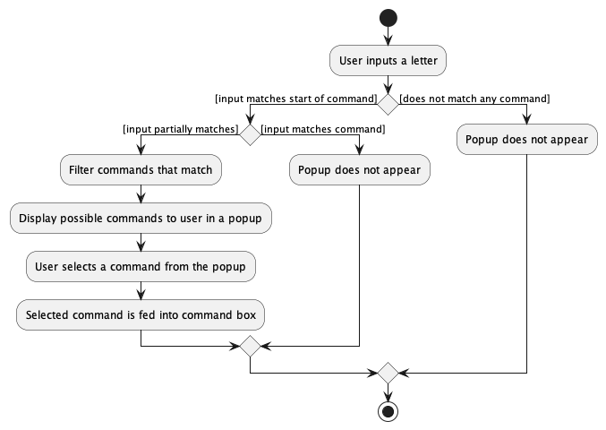

* Table of Contents
  {:toc}

--------------------------------------------------------------------------------------------------------------------

## **1. Introduction**

### **1.1 Purpose**
This document describes the architecture and software design decisions for our CLI-based task management app notionUS.
While the document is in general for anyone who wants to understand the system, it is primarily targeted towards the
designers, developers and software testers of notionUS.

### **1.2 Scope**
As the goal of this document is to cover and explain the architecture and design decisions, we first discuss
the high-level architecture and software design under the "Design" section. Then we go into details of 
implementation of our features in the "Implementation" section. 

--------------------------------------------------------------------------------------------------------------------

## **2. Acknowledgements**

* [AddressBook Level-3](https://se-education.org/addressbook-level3/)

--------------------------------------------------------------------------------------------------------------------

## **3. Setting up, getting started**

Refer to the guide [_Setting up and getting started_](SettingUp.md).

--------------------------------------------------------------------------------------------------------------------

## *4. *Design**

:bulb: **Tip:** The `.puml` files used to create diagrams in this document can be found in
the [diagrams](https://github.com/AY2223S1-CS2103T-F12-3/tp/tree/master/docs/diagrams/) folder. Refer to the [_PlantUML
Tutorial_ at se-edu/guides](https://se-education.org/guides/tutorials/plantUml.html) to learn how to create and edit
diagrams.

### 4.1 Architecture

The ***Architecture Diagram*** given above explains the high-level design of the App.

Given below is a quick overview of main components and how they interact with each other.

**Main components of the architecture**

**`Main`** has two classes
called [`Main`](https://github.com/AY2223S1-CS2103T-F12-3/tp/tree/master/src/main/java/seedu/address/Main.java)
and [`MainApp`](https://github.com/AY2223S1-CS2103T-F12-3/tp/tree/master/src/main/java/seedu/address/MainApp.java). It
is responsible for,

* At app launch: Initializes the components in the correct sequence, and connects them up with each other.
* At shut down: Shuts down the components and invokes cleanup methods where necessary.

[**`Commons`**](#common-classes) represents a collection of classes used by multiple other components.

The rest of the App consists of four components.

* [**`UI`**](#ui-component): The UI of the App.
* [**`Logic`**](#logic-component): The command executor.
* [**`Model`**](#model-component): Holds the data of the App in memory.
* [**`Storage`**](#storage-component): Reads data from, and writes data to, the hard disk.

**How the architecture components interact with each other**

The *Sequence Diagram* below shows how the components interact with each other for the scenario where the user issues
the command `delete 1`.

Each of the four main components (also shown in the diagram above),

* defines its *API* in an `interface` with the same name as the Component.
* implements its functionality using a concrete `{Component Name}Manager` class (which follows the corresponding
  API `interface` mentioned in the previous point.

For example, the `Logic` component defines its API in the `Logic.java` interface and implements its functionality using
the `LogicManager.java` class which follows the `Logic` interface. Other components interact with a given component
through its interface rather than the concrete class (reason: to prevent outside component's being coupled to the
implementation of a component), as illustrated in the (partial) class diagram below.

The sections below give more details of each component.

### 4.2 UI component

The **API** of this component is specified
in [`Ui.java`](https://github.com/AY2223S1-CS2103T-F12-3/tp/tree/master/src/main/java/seedu/address/ui/Ui.java)

The UI consists of a `MainWindow` that is made up of parts e.g.`CommandBox`, `ResultDisplay`, `TaskListPanel`
, `StatusBarFooter`, `FilterStatusDisplay` etc. All these, including the `MainWindow`, inherit from the
abstract `UiPart` class which captures the commonalities between classes that represent parts of the visible GUI.

The `UI` component uses the JavaFx UI framework. The layout of these UI parts are defined in matching `.fxml` files that
are in the `src/main/resources/view` folder, except for `MainWindow`. The layout of
the [`MainWindow`](https://github.com/AY2223S1-CS2103T-F12-3/tp/tree/master/src/main/java/seedu/address/ui/MainWindow.java)
is specified
in [`NotionUSMainWindow.fxml`](https://github.com/AY2223S1-CS2103T-F12-3/tp/tree/master/src/main/resources/view/NotionUSMainWindow.fxml)
.
An FXML variable declared in the Java Class must correspond to the fxml component with the same FX ID.

The layout of `TaskCard` has been edited to fit the look of a task in Notion, especially the behaviour of task cards
when resizing the main window. The CSS of the app is specified
in [`NotionUS.css`](https://github.com/AY2223S1-CS2103T-F12-3/tp/tree/master/src/main/resources/view/NotionUS.css).

The `UI` component,

* executes user commands using the `Logic` component.
* listens for changes to `Model` data so that the UI can be updated with the modified task data and if applicable, any
  filters applied on the tasklist.
* keeps a reference to the `Logic` component, because the `UI` relies on the `Logic` to execute commands.
* depends on some classes in the `Model` component, as it displays `Task` object residing in the `Model`.

### 4.3 Logic component

**
API** : [`Logic.java`](https://github.com/AY2223S1-CS2103T-F12-3/tp/tree/master/src/main/java/seedu/address/logic/Logic.java)

Here's a (partial) class diagram of the `Logic` component:

How the `Logic` component works:

1. When `Logic` is called upon to execute a command, it uses the `TaskListParser` class to parse the user command.
2. This results in a `Command` object (more precisely, an object of one of its subclasses e.g., `AddCommand`) which is
   executed by the `LogicManager`.
3. The command can communicate with the `Model` when it is executed (e.g. to add a task).
4. The result of the command execution is encapsulated as a `CommandResult` object which is returned from `Logic`.

The Sequence Diagram below illustrates the interactions within the `Logic` component for the `execute("delete 1")` API
call.

:information_source: **Note:** The lifeline for `DeleteCommandParser` should end at the destroy marker (X) but due to a limitation of PlantUML, the lifeline reaches the end of diagram.

Here are the other classes in `Logic` (omitted from the class diagram above) that are used for parsing a user command:

How the parsing works:

* When called upon to parse a user command, the `TaskListParser` class creates an `XYZCommandParser` (`XYZ` is a
  placeholder for the specific command name e.g., `AddCommandParser`) which uses the other classes shown above to parse
  the user command and create a `XYZCommand` object (e.g., `AddCommand`) which the `TaskListParser` returns back as
  a `Command` object.
* All `XYZCommandParser` classes (e.g., `AddCommandParser`, `DeleteCommandParser`, ...) inherit from the `Parser`
  interface so that they can be treated similarly where possible e.g, during testing.

### 4.4 Model component
**API** : [`Model.java`](https://github.com/AY2223S1-CS2103T-F12-3/tp/blob/master/src/main/java/seedu/address/model/Model.java)

The `Model` component,

* stores the task list data i.e., all `Task` objects (which are contained in a `UniqueTaskList` object).
* stores the currently 'selected' `Task` objects (e.g., results of a search query) as a separate _filtered_ list which
  is exposed to outsiders as an unmodifiable `ObservableList<Task>` that can be 'observed' e.g. the UI can be bound to
  this list so that the UI automatically updates when the data in the list change.
* to support a default sorting of `Task` objects, `Task` implements the `Comparable<Task>` interface
* stores a `UserPref` object that represents the user’s preferences. This is exposed to the outside as
  a `ReadOnlyUserPref` objects.
* does not depend on any of the other three components (as the `Model` represents data entities of the domain, they
  should make sense on their own without depending on other components)
* As `Deadline` is an optional field, their values are stored in an `Optional` object.

### 4.5 Storage component

**
API** : [`Storage.java`](https://github.com/se-edu/TaskList-level3/tree/master/src/main/java/seedu/address/storage/Storage.java)

The `Storage` component,

* can save both address book data and user preference data in json format, and read them back into corresponding
  objects.
* inherits from both `TaskListStorage` and `UserPrefStorage`, which means it can be treated as either one (if only
  the functionality of only one is needed).
* depends on some classes in the `Model` component (because the `Storage` component's job is to save/retrieve objects
  that belong to the `Model`)

### 4.6 Common classes

Classes used by multiple components are in the `seedu.TaskList.commons` package.

--------------------------------------------------------------------------------------------------------------------

## **5. Implementation**

This section describes some noteworthy details on how certain features are implemented.

### 5.1 Hide Command

In order to get a clearer view by archiving overdue and completed tasks whenever a user enters the command. Hidden (
archived) tasks will still be stored and can be retrieved using `listAllCommand`.

Command takes input

* `archive <index>` where `<index>` is the index of the tasks based on the displayed index shown in Main Window.
* `archive -d date` where `date` should be formatted as `YYYY-MM-DD` and all tasks before and on `date` will be hidden (
  archived).

Command result will tell us number of tasks remaining.

Should `date` be improperly formatted or `<index>` entered is out of bound, a generic CommandResult and an error message
will be given. Model will not be updated.

Below is the sequence diagram for an execution of `archive <index>`, assuming `<index>` is not out of bound.

### 5.2 Mark/unmark feature

#### Implementation

The mark/unmark feature marks a task in the task list as done/not done respectively. Its mechanism is facilitated
by `MarkCommand` and `UnmarkCommand`. They both extend `Command`, overriding the `execute` method.
The implementation of `mark` and `unmark` is such that a task being marked or unmarked is effectively replaced by an
identical task with a modified `isDone` field in the task list.

Below is the sequence diagram for an execution of `mark <index>`, assuming `<index>` is not out of bounds.

### 5.3 Returning to a previous command

#### 5.3.1 Implementation

This feature allows the user to traverse through past commands via the up and down keys on the keyboard, similar to how
it works in a terminal.

This mechanism of returning to previous commands is facilitated by `CommandHistory`. It works with `CommandBox`, storing
entered commands internally in `previousCommands` and controls the traversal with the aid of `pointer`.
Additionally, it implements the following operations:

* `CommandHistory#add(String)` – Saves the entered command into the history.
* `CommandHistory#up()` – Traverses upwards through the history and restores the previously entered command.
* `CommandHistory#down()` – Traverses downwards through the history and restores the command.

Given below is an example usage scenario and how the command history traversal mechanism behaves at each step.

Step 1. The user launches the application for the first time. The `CommandBox` will be initialised, which in turns
initialises the `CommandHistory` that is contained within. Since command history is empty, `previousCommands`will be
empty.

Step 2. The user enters a command `add n/Project m/CS2103T d/2022-10-18 t/lowPriority`. Upon entering a new
command, `CommandBox#handleButtonPressed(KeyEvent)` is called, which in turn calls `CommandHistory#add(String)` to
stores this command into `previousCommands`.

Step 3. The user presses on the `up` key to return to the previously entered command. This action calls
the `CommandHistory#up()` which will shift `pointer` once to the left, pointing it to the previous command in history,
and feeds this String back to the command box.

Step 4. The user presses on the `down` key to traverse down the history. This action calls the `CommandHistory#up()`
which will shift `pointer` once to the right. Since the `pointer` is already pointing to the latest command in history,
there are no more commands to be returned to.
Hence, the command box will be cleared.

The following activity diagram summarizes what happens when a user clicks on the `up`/`down` keys.

#### 5.3.2 Design considerations:

**Aspect: How command history is stored:**

* **Alternative 1 (current choice):** Stores entered commands in an arrayList, renewed everytime the app launches.
    * Pros: Easy to implement.
    * Cons: Will not be able to restore commands from previous launches.
* **Alternative 2:** Stores entered commands into a local `json` file.
    * Pros: Will be able to restore commands from previous launches.
    * Cons: Difficult to implement as storage architecture will have to be renewed.

### 5.4 Command autocomplete feature

#### 5.4.1 Implementation

This feature allows the user to traverse through a drop-down list of possible commands that can be used, and is updated
as they are typing. This provides convenience for the user as he can click `Enter` to complete the command after
selection.

The mechanism works by firstly having a list of possible commands. This list is then filtered with the condition 
of whether any of them contain the text that the user is inputting at real-time. This filtered list is then shown as a 
JXML context menu below the command box.

It adds the following methods in CommandBox.java:

* `CommandBox#handleAutoComplete` – Handles the filtering of the command list and showing the suggestions list.
* `CommandHistory#populatePopUp` – Populates the suggestions list popup with the filtered list.

Below is an example usage scenario for autocomplete:

Step 1. The user opens the app, which initialises the `CommandBox` which then initialises the `ContextMenu` and a
`CommandList` of all the possible commands that be used in the app.

Step 2. The user would like to edit a task that has in NotionUS, and knows that the command begins with an `e`, typing 
it into the command box. A list of possible commands appears as a popup `ContextMenu` below the
command box, containing the commands of `edit` and `exit`.

Step 3. When the popup appears, the user can use the `up` and `down` key to traverse the list to the command of choice.
Once the user would like to use that command, the user hits `Enter` and the command is filled into the command box. 
This closes the popup.

Step 4. The user adds the required additional information if required and then hits `Enter` to perform the command as 
per normal.

Below is an activity diagram to display how the feature works:

#### 5.4.2 Design considerations:

**Aspect: Filtering commandList to find matching commands:**

* **Alternative 1: (current implementation)** Filters command list down everytime the user input changes.
  * Pros: Easy to implement.
  * Cons: Inefficient as full list is filtered every time.
* **Alternative 2:** Filter the current command list if the start of current input matches start of commands already 
in previous list.
  * Pros: Harder to implement.
  * Cons: Efficient especially when command list is large.

--------------------------------------------------------------------------------------------------------------------

## **6. Documentation, logging, testing, configuration, dev-ops**

* [Documentation guide](Documentation.md)
* [Testing guide](Testing.md)
* [Logging guide](Logging.md)
* [Configuration guide](Configuration.md)
* [DevOps guide](DevOps.md)

--------------------------------------------------------------------------------------------------------------------

## **7. Appendix: Requirements**

### 7.1 Product scope

**7.1.1 Target user profile**:

* tech-savvy
* university student
* has a need to manage tasks from school
* prefer desktop apps over other types
* prefers typing to mouse interactions
* is reasonably comfortable using CLI apps

**7.1.2 Value proposition**: manage module tasks faster than a typical mouse/GUI driven app and organise them by certain parameters

### 7.2 User stories

Priorities: High (must have) - `* * *`, Medium (nice to have) - `* *`, Low (unlikely to have) - `*`

*Core Functionalities*

| Priority | As a …​        | I want to …​                                                              | So that I can…​                             |
|----------|----------------|---------------------------------------------------------------------------|---------------------------------------------|
| `* * *`  | beginner user  | add tasks                                                                 | keep track of the tasks on hand             |
| `* * *`  | beginner user  | delete tasks                                                              | remove tasks that are no longer relevant    |
| `* * *`  | beginner user  | tag my tasks to a specific module or commitment                           | organise them better                        |
| `* * *`  | beginner user  | keep track of deadlines related to added tasks                            | complete tasks on time                      |
| `* * *`  | beginner user  | see all the tasks I have that have yet to be completed                    | easily identify tasks to work on            |
| `* *`    | potential user | see example tasks that show how the app displays tasks and their statuses | have a better idea of how the app functions |
| `* *`    | beginner user  | edit the task names                                                       | rectify mistakes                            |
| `* *`    | familiar user  | sort my tasks by due date                                                 | easily see which are the most urgent        |

*{More to be added}*

### 7.3 Use cases

Unless specified otherwise, the **System** is the `NotionUS` application and the **Actor** is the `user`.

**Use Case: UC1 - Add a task**

**MSS:**

1. User requests to add a task into the task list
2. NotionUS adds task into task list and displays it

   Use case ends.

**Extensions:**

* 1a. User does not provide the required information for the task
    * 1a1. NotionUS shows an error, requesting the user re-enter their task

      Use case ends.

**Use Case: UC2 - Edit a task**

**MSS:**

1. User finds the id associated with the task
2. User requests to edit the task
3. NotionUS edits the task and displays it

   Use case ends.

**Extensions:**

* 2a. User provides an invalid ID
    * 2a1. NotionUS shows an error, requesting the user check the task id

      Use case starts from 1.

* 2b. User does not provide any changes
    * 2b1. NotionUS provides a note that nothing was changed

      Use case ends

**Use Case: UC3 - Delete a task**

**MSS:**

1. User finds the id associated with the task
2. User requests to delete the task
3. NotionUS deletes the task and updates the view

   Use case ends.

**Extensions:**

* 2a. User provides an invalid ID
    * 2a1. NotionUS shows an error, requesting the user check the task id

      Use case starts from 1.

**Use Case: UC4 - Tag a task**

**MSS:**

1. User creates a task (UC1)
2. With the task id, user requests to tag the task
3. NotionUS tags the task and displays it
   Use case ends.

**Extensions:**

* 2a. User provides an invalid ID
    * 2a1. NotionUS shows an error, requesting the user check the task id

      Use case starts from 1.

**Use Case: UC4 - Tag a task**

**MSS:**

1. User creates a task (UC1)
2. With the task id, user requests to tag the task
3. NotionUS tags the task and displays it
   Use case ends.

**Extensions:**

* 2a. User provides an invalid ID
    * 2a1. NotionUS shows an error, requesting the user check the task id

      Use case starts from 1.

**Use Case: UC5 - Finding a word in task attributes**

**MSS:**

1. User would like to perform a global search to find a keyword
2. User requests find the keyword
3. NotionUS updates the view with the tasks which attributes contain the keyword

   Use case ends.

**Extensions:**

* 2a. User provides a keyword that does not exist
    * 2a1. NotionUS displays an empty page

      Use case ends.

**Use Case: UC6 - Autocompleting commands**

**MSS:**

1. User would to find a command for listing marked tasks
2. User types `l` in the command box
3. NotionUS displays a popup menu displaying the possible commands that begin with `l`
4. User uses the arrow keys to select through the possible commands
5. User clicks enter to fill the command box with the highlighted command

   Use case ends.

**Extensions:**

* 2a. User uses a letter that does not match any commands
    * 2a1. NotionUS does not display a popup

      Use case ends.
  
* 2b. User inputs a command that matches a command in the popup
    * 2b1. NotionUS closes the popup as suggestions are not required

      Use case ends.

### 7.4 Non-Functional Requirements

1. Should work on any mainstream OS as long as it has Java 11 or above installed. (compatibility)
2. Should be able to hold up to 1000 users without a noticeable lag in performance for typical usage. (performance)
3. Should have a response time less than or equal to 5 seconds given any command. (Performance)
4. Should take less than 2GB of memory while in operation. (Performance)
5. A user with above average typing speed for regular English text (i.e. not code, not system admin commands) should be
   able to accomplish most of the tasks faster using commands than using the mouse. (Usability)
6. The error rate of the commands entered by the user should not exceed 5%. (Usability)
7. Should take an user less than 1 day to familiarise with all the main commands used for the application. (Usability -
   learnability)
8. An user who returned to the interface after stopping for some time should be able to use the application efficiently
   right away. (Usability - memorability)
9. Should provide a pleasant user experience and a high user satisfactory level. (Usability - satisfaction)
10. Should not face any error or system failure 95% of the time. (Reliability)
11. Should support the use of the UK English language. (Localisation)
12. Should be available to users 99% of the time. (Availability)
13. Maintainence should not take up more than 20 minutes when an error is encountered. (Maintainability)
14. Should be easily moved from one computing environment to another without any change in its behaviour or performance.
    ie. should not require an installer.  (Portability)
15. Should take less than 2GB of storage space.
16. Data should be stored locally in the user's operating device.

*{More to be added}*

### 7.5 Glossary

* **Mainstream OS**: Windows, Linux, Unix, OS-X
* **Tag**: A user created tag that is linked to a task

--------------------------------------------------------------------------------------------------------------------

## **8. Appendix: Instructions for manual testing**

Given below are instructions to test the app manually.

:information_source: **Note:** These instructions only provide a starting point for testers to work on;
testers are expected to do more *exploratory* testing.

### 8.1 Launch and shutdown

1. Initial launch

    1. Download the jar file and copy into an empty folder

    1. Double-click the jar file Expected: Shows the GUI with a set of sample contacts. The window size may not be
       optimum.

1. Saving window preferences

    1. Resize the window to an optimum size. Move the window to a different location. Close the window.

    1. Re-launch the app by double-clicking the jar file. 
       Expected: The most recent window size and location is retained.

1. _{ more test cases …​ }_

### 8.2 Deleting a task

1. Deleting a task while all tasks are being shown

   1. Prerequisites: List all tasks using the `ls -a` command. Multiple tasks in the list.

    2. Test case: `delete 1` 
       Expected: First tasj is deleted from the list. Details of the deleted task shown in the status message.
       Timestamp in the status bar is updated.

    3. Test case: `delete 0` 
       Expected: No task is deleted. Error details shown in the status message. Status bar remains the same.

    4. Other incorrect delete commands to try: `delete`, `delete x`, `...` (where x is larger than the list size) 
       Expected: Similar to previous.

2. _{ more test cases …​ }_

### 8.3 Saving data

1. Dealing with missing/corrupted data files

    1. _{explain how to simulate a missing/corrupted file, and the expected behavior}_

2. _{ more test cases …​ }_
