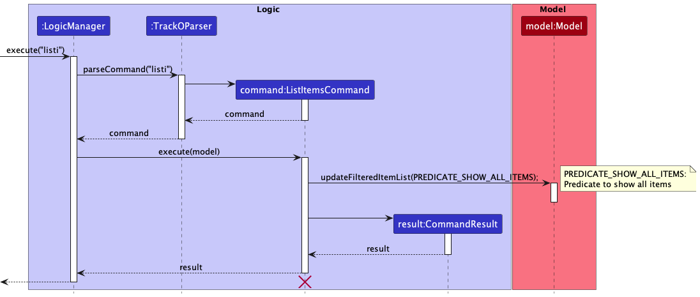
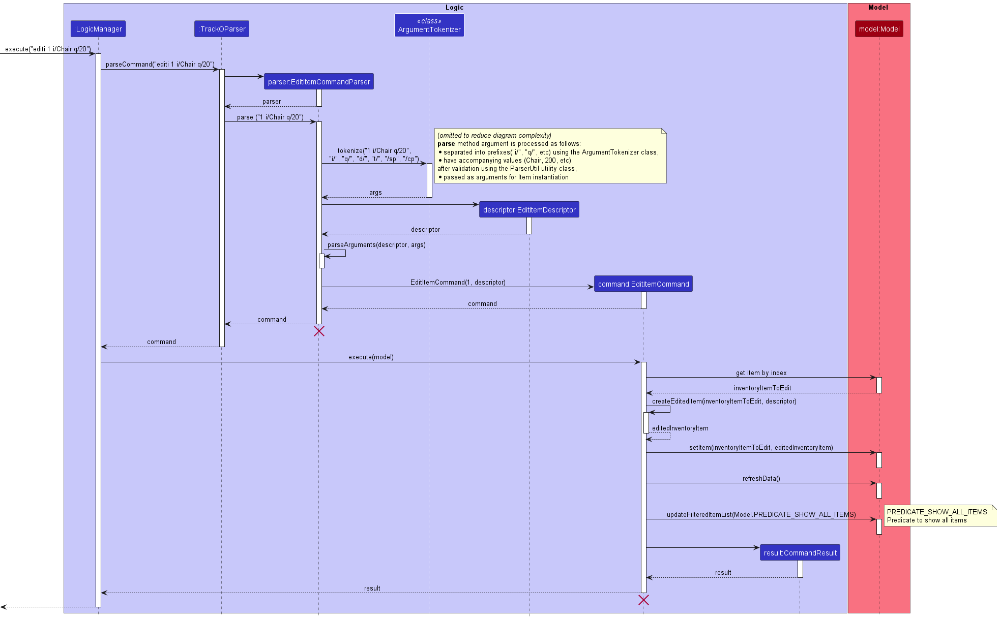
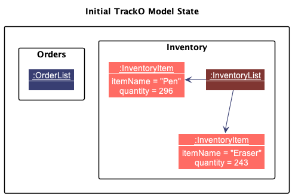
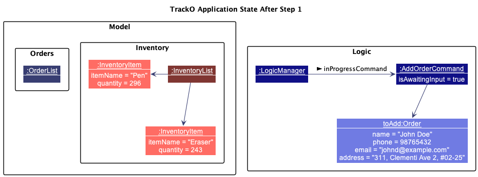
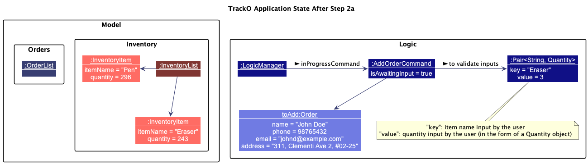
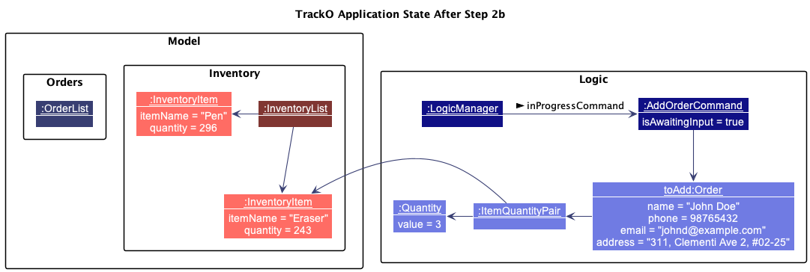
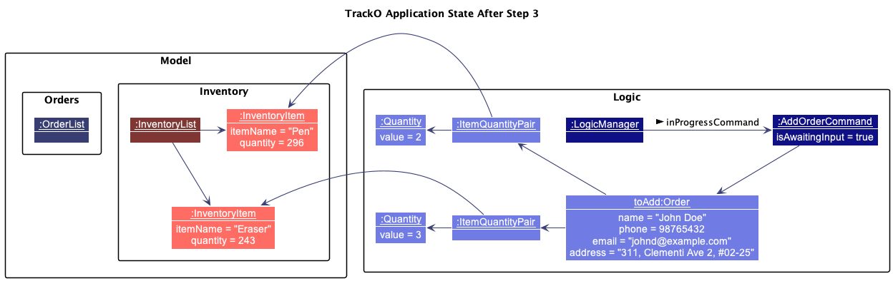
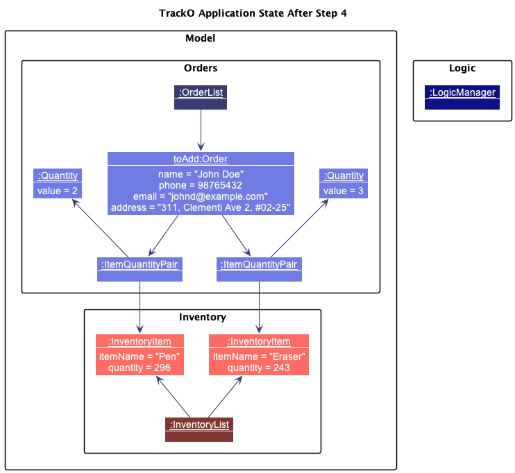
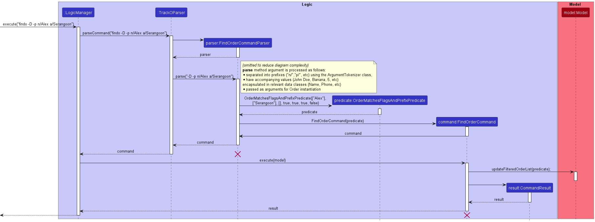
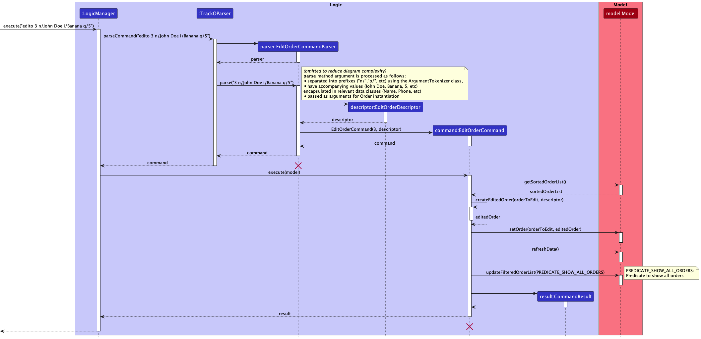

* Table of Contents
{:toc}

--------------------------------------------------------------------------------------------------------------------

## **Acknowledgements**

* {list here sources of all reused/adapted ideas, code, documentation, and third-party libraries -- include links to the original source as well}
--------------------------------------------------------------------------------------------------------------------

## **Setting up, getting started**

Refer to the guide [_Setting up and getting started_](SettingUp.md).

--------------------------------------------------------------------------------------------------------------------

## **Design**

:bulb: **Tip:** The `.puml` files used to create diagrams in this document can be found in the [diagrams](https://github.com/se-edu/addressbook-level3/tree/master/docs/diagrams/) folder. Refer to the [_PlantUML Tutorial_ at se-edu/guides](https://se-education.org/guides/tutorials/plantUml.html) to learn how to create and edit diagrams.

### Architecture

The ***Architecture Diagram*** given above explains the high-level design of the App.

Given below is a quick overview of main components and how they interact with each other.

**Main components of the architecture**

**`Main`** has two classes called [`Main`](https://github.com/AY2223S1-CS2103T-W15-3/tp/blob/master/src/main/java/tracko/Main.java) and [`MainApp`](https://github.com/AY2223S1-CS2103T-W15-3/tp/blob/master/src/main/java/tracko/MainApp.java). It is responsible for,
* At app launch: Initializes the components in the correct sequence, and connects them up with each other.
* At shut down: Shuts down the components and invokes cleanup methods where necessary.

[**`Commons`**](#common-classes) represents a collection of classes used by multiple other components.

The rest of the App consists of four components.

* [**`UI`**](#ui-component): The UI of the App.
* [**`Logic`**](#logic-component): The command executor.
* [**`Model`**](#model-component): Holds the data of the App in memory.
* [**`Storage`**](#storage-component): Reads data from, and writes data to, the hard disk.

**How the architecture components interact with each other**

The *Sequence Diagram* below shows how the components interact with each other for the scenario where the user issues the command `deletei 1`.

Each of the four main components (also shown in the diagram above),

* defines its *API* in an `interface` with the same name as the Component.
* implements its functionality using a concrete `{Component Name}Manager` class (which follows the corresponding API `interface` mentioned in the previous point).

For example, the `Logic` component defines its API in the `Logic.java` interface and implements its functionality using the `LogicManager.java` class which follows the `Logic` interface. Other components interact with a given component through its interface rather than the concrete class (reason: to prevent outside component's being coupled to the implementation of a component), as illustrated in the (partial) class diagram below.

The sections below give more details of each component.

### UI component

The **API** of this component is specified in [`Ui.java`](https://github.com/AY2223S1-CS2103T-W15-3/tp/blob/master/src/main/java/tracko/ui/Ui.java)

The UI consists of a `MainWindow` that is made up of parts e.g.`CommandBox`, `ResultDisplay`, `ItemListPanel`, `OrderListPanel`, `StatusBarFooter` etc. All these, including the `MainWindow`, inherit from the abstract `UiPart` class which captures the commonalities between classes that represent parts of the visible GUI.

The `UI` component uses the JavaFx UI framework. The layout of these UI parts are defined in matching `.fxml` files that are in the `src/main/resources/view` folder. For example, the layout of the [`MainWindow`](https://github.com/AY2223S1-CS2103T-W15-3/tp/blob/master/src/main/java/tracko/ui/MainWindow.java) is specified in [`MainWindow.fxml`](https://github.com/se-edu/addressbook-level3/tree/master/src/main/resources/view/MainWindow.fxml)

The `UI` component,

* executes user commands using the `Logic` component.
* listens for changes to `Model` data so that the UI can be updated with the modified data.
* keeps a reference to the `Logic` component, because the `UI` relies on the `Logic` to execute commands.
* depends on some classes in the `Model` component, as it displays `Order` and `Item` object residing in the `Model`.

### Logic component

**API** : [`Logic.java`](https://github.com/AY2223S1-CS2103T-W15-3/tp/blob/master/src/main/java/tracko/logic/Logic.java)

Here's a (partial) class diagram of the `Logic` component:

How the `Logic` component works:
1. When `Logic` is called upon to execute a command, it uses the `TrackOParser` class to parse the user command.
1. This results in a `Command` object (more precisely, an object of one of its subclasses e.g., `AddOrderCommand`) which is executed by the `LogicManager`.
1. The command can communicate with the `Model` when it is executed (e.g. to add a person).
1. The result of the command execution is encapsulated as a `CommandResult` object which is returned back from `Logic`.

The Sequence Diagram below illustrates the interactions within the `Logic` component for the `execute("deletei 1")` API call.

:information_source: **Note:** The lifeline for `DeleteItemCommandParser` should end at the destroy marker (X) but due to a limitation of PlantUML, the lifeline reaches the end of diagram.

Here are the other classes in `Logic` (omitted from the class diagram above) that are used for parsing a user command:

How the parsing works:
* When called upon to parse a user command, the `TrackOParser` class creates an `XYZCommandParser` (`XYZ` is a placeholder for the specific command name e.g., `AddOrderCommandParser`) which uses the other classes shown above to parse the user command and create a `XYZCommand` object (e.g., `AddOrderCommand`) which the `TrackOParser` returns back as a `Command` object.
* All `XYZCommandParser` classes (e.g., `AddOrderCommandParser`, `DeleteOrderCommandParser`, ...) inherit from the `Parser` interface so that they can be treated similarly where possible e.g, during testing.

### Model component
**API** : [`Model.java`](https://github.com/AY2223S1-CS2103T-W15-3/tp/blob/master/src/main/java/tracko/model/Model.java)

The `Model` component,

* stores the TrackO data i.e., all `Item` and `Order` objects (which are contained in an `InventoryList` and `OrderList` object respectively).
* stores the currently 'selected' `Item` objects (e.g., results of a search query) as a separate _filtered_ list which is exposed to outsiders as an unmodifiable `ObservableList<Item>` that can be 'observed' e.g. the UI can be bound to this list so that the UI automatically updates when the data in the list change.
* stores the currently selected `Order` objects (e.g., results of a search query) as a separate _filtered_ list, which is wrapped within a _sorted_ list (`Order` objects can be sorted by time of creation), which is exposed to outsiders as an unmodifiable `ObservableList<Order>` that can be 'observed' e.g. the UI can be bound to this list so that the UI automatically updates when the data in the list change.
* stores a `UserPref` object that represents the user’s preferences. This is exposed to the outside as a `ReadOnlyUserPref` objects.
* does not depend on any of the other three components (as the `Model` represents data entities of the domain, they should make sense on their own without depending on other components)

:information_source: **Note:** An alternative (arguably, a more OOP) model is given below. It has a `Tag` list in the `TrackO`, which `Item` references. This allows `TrackO` to only require one `Tag` object per unique tag, instead of each `Item` needing their own `Tag` objects. 

### Storage component

**API** : [`Storage.java`](https://github.com/AY2223S1-CS2103T-W15-3/tp/blob/master/src/main/java/tracko/storage/Storage.java)

The `Storage` component,
* can save both TrackO data and user preference data in json format, and read them back into corresponding objects.
* inherits from both `TrackOStorage` and `UserPrefStorage`, which means it can be treated as either one (if only the functionality of only one is needed).
* depends on some classes in the `Model` component (because the `Storage` component's job is to save/retrieve objects that belong to the `Model`)

### Common classes

Classes used by multiple components are in the `tracko.commons` package.

--------------------------------------------------------------------------------------------------------------------

## **Implementation**

This section describes some noteworthy details on how certain features are implemented.

### Add Item feature

#### Implementation

The add item command will be executed by `AddItemCommand`. Items added will be stored in `InventoryList`. 

Given below is an example usage scenario and how the add item mechanism behaves at each step.

Step 1. The user launches the application for the first time. The `TrackO` will be initialized with the initial TrackO state, and the `InventoryList` will contain sample data.

Step 2. The user executes `addi i/keys q/10` command to add 10 keys to item list in TrackO. 
The `addi` command creates an `AddItemCommandParser` which checks the necessary input arguments for item name (prefixed by `i/`) and quantity (prefixed by `q/`) are present before parsing the arguments into an `AddItemCommand` object. 

The `AddItemCommand` calls `Model#addItem()` to add the item and its corresponding quantity into the items list.

:information_source: **Note:** If a command fails its execution, it will not call `Model#addItem()`, so the incomplete item will not be saved to `ItemsList`.

The following sequence diagram shows how the add item operation works:

_{insert sequence diagram}_

:information_source: **Note:** The lifeline for `AddItemCommand` should end at the destroy marker (X) but due to a limitation of PlantUML, the lifeline reaches the end of diagram.

The following activity diagram summarizes what happens when a user executes a new command:

_{insert activity diagram}_

#### Design considerations:

**Aspect: How add item executes:**

_{add design considerations}_

_{more aspects and alternatives to be added}_

### List Items Feature

The list items feature allows the user to list all the existing `Item`s in the inventory.

#### Implementation

The list item feature is supported by the `ListItemsCommand`. It extends `Command`.

Given below is an example usage scenario and how the `ListItemsCommand` mechanism behaves at each step.

Step 1. The user inputs `listi`. This calls `LogicManager#execute`, which then calls `TrackOParser#parseCommand`.
This method will return a new instance of `ListItemsCommand`.

Step 2. `ListItemsCommand#execute` is called, which then calls the method
`Model#updateFilteredOrderList(PREDICATE_SHOW_ALL_ITEMS)`. This will show all the `Item`s in the existing
inventory list.

The sequence diagram below illustrates this process.

:information_source: **Note:** The lifeline for `ListItemsCommand` 
should end at the <i>destroy marker</i> (X) but due to a limitation of PlantUML, the lifeline 
reaches the end of diagram.

#### Design Considerations

**Aspect: How the `listi` command executes**

- **Alternative 1 (current choice)**: The command lists all the items in the inventory list.
  - Pros: Easier to implement.
  - Cons: Unable to filter specific items.

### Find Item Feature

The find item feature allows the user to find `InventoryItem`(s) by keyword(s) given by the user.

#### Implementation

The find item command is supported by `FindItemCommand`. It extends `Command`.

Given below is an example usage scenario and how the find order mechanism behaves at each step.

Step 1. The user executes `findi chair mattress` command to find the orders containing items with the keywords
keychain or apple. The `findi` command calls `FindItemCommandParser` which checks for the correct command
syntax and separates the keywords, utilising each space as a delimiter. 

Step 2. The keywords are then passed into a constructor for `ItemContainsKeywordsPredicate`,
which extends `Predicate<Item>`, to construct a predicate that will filter the items according to the keywords.
The predicate is passed into a new instance of `FindItemCommand`. `FindItemCommand` then calls
`Model#updateFilteredItemList()` to filter `Model#filteredOrders` according to the previously constructed
`ItemContainsKeywordsPredicate`.

The sequence diagram below illustrates this process.

:information_source: **Note:** The lifeline for `FindItemCommandParser` 
and `FindItemCommand` should end at the <i>destroy marker</i> (X) but due to a limitation of PlantUML, the lifeline 
reaches the end of diagram.

#### Design Considerations

**Aspect: How `findi` is implemented**
- **Alternative 1 (current choice)**: The command finds items based on their `ItemName`.
    - Pros: Easier to implement, and users do not have to use prefixes to find items.
    - Cons: Cannot search based on other item fields, e.g. searching based on the price range of the items.
- **Alternative 2**: The command can find items based on all of their fields.
    - Pros: Can search based on more fields, useful if the user has large number of items to navigate through.
    - Cons: Harder to implement.

### Edit Item Feature

The edit item feature allows the user to edit an `Item` currently being tracked by the system.

#### Implementation

The edit item command `editi` is supported by the `EditItemCommand`. It extends `Command`.

The command is implemented through the `Logic` and `Model` components. The `Logic`
component parses the user input, the `Model` component then performs the edit on the target `Item`.

Step 1: The user inputs the command `editi 1 i/Chair q/20`. This calls:
1. `LogicManager#execute()`
2. `TrackOParser#parseCommand()`. This parses the command as an `EditItemCommand` and returns an `EditItemCommandParser` object.
3. `EditItemCommandParser#parse()` parses the arguments and returns an `EditItemCommand` with the target `Index` and the
appropriate `EditItemDescriptor` as input.

The `EditItemDescriptor` contains information which the newly edited `Item`
should have and is used in the creation of the new `Item` object. In this case, the `EditItemDescriptor` contains a new
`ItemName` and `Quantity` taken from the user input, while all other fields are copied from the existing `Item` at the
target `Index` 1.

Step 2:. The `EditItemCommand` creates a new `Item` using `createEditedItem()` and the `EditItemDescriptor`. It then
checks if this `Item` already exists in the inventory list by using `Model#hasItem()`. If it already exists, a
`CommandException` is thrown with `MESSAGE_DUPLICATE_ITEM`.

An item already exists if there is another item in the
inventory list with same `ItemName`. `Item#isSameItem()` returns true when both `Item` have the same `ItemName`. This is
because having 2 `Item` with the same `ItemName` can be confusing to the user and this safeguards the user from such a
situation.

Step 3. The `Item` at the target index is then replaced by the newly created `Item` using `Model#setItem()`,
successfully executing the edit item command in the `Model`.

The sequence diagram below illustrates this process.

:information_source: **Note:** The lifeline for `EditItemCommandParser` should end at 
the <i>destroy marker</i> (X) but due to a limitation of PlantUML, the lifeline reaches the 
end of diagram.

### Order Management

Order management is one of two core features of TrackO alongside inventory management. These two features work together
to form the backbone of the application, allowing for efficient and reliable tracking of order and inventory data.

#### Overview

As per the Model diagram given [above]()(**_Ensure diagram consistency here_**), the application keeps track of one `OrderList`
at any point in time. This `OrderList` instance represents the container that keeps track of all order data in the system.

Currently, the application features 5 main operations that interact directly with the `OrderList`. They are represented by
the following commands:
* [`AddOrderCommand`](#add-order-feature) - creates a new order to be added to the `OrderList`
* [`FindOrderCommand`](#find-order-feature) - filters and display matching orders from the `OrderList` based on provided keywords
* `ListOrderCommand` - display all order data from the `OrderList`
* [`EditOrderCommand`](#edit-order-feature) - edit the data of an order from the `OrderList`
* `DeleteOrderCommand` - deletes an existing order from the `OrderList`
* `MarkOrderCommand` - marks an existing order from the `OrderList` as paid or delivered

The order management feature is supported by the `Order` class, represented by the class diagram below.

The `Order` class encapsulates order-related data packaged in the following classes/attributes:
* `Name`, `Phone`, `Email`, `Address` - customer data related to the `Order`
* `ItemQuantityPair` - represents an ordered `Item` in the `Order`, with an accompanying `Quantity` that represents the amount of units of said `Item` ordered by the customer
* `LocalDateTime` - the time at which the order entry was created in the system
* `isPaid`/`isDelivered` - represents the completion status of the order (an `Order` is considered complete if both fields are true)

### Add Order Feature

The add order feature allows the user to add an `Order` to be tracked by the system.

##### Implementation

The add order feature is supported by the `AddOrderCommand`, which extends from the `MultiLevelCommand` class.
The user will enter multiple rounds of input before an `Order` is successfully added to the system.

Before giving an example usage scenario, lets assume that the user has already added some inventory items to be tracked by the system, but has not added any orders yet.
Hence, our initial state before the add order command is initiated is illustrated as such.

Given below is an example usage scenario that works with the given model state as depicted above, and how the add order mechanism behaves at each step.

Step 1. The user enters the following input into the UI's command box:
`addo n/John Doe p/98765432 e/johnd@example.com a/311, Clementi Ave 2, #02-25`. This instantiates an `AddOrderCommand`, that references
a new `Order` which encapsulates the input customer data. This then sets the `LogicManager` to reference said instantiated `AddOrderCommand`
in its `inProgressCommand` field. The UI then prompts the user for further input.

:information_source: **Note:** Upon any invalid inputs (invalid/missing prefixes or values), the UI will notify the user and provide a prompt for the correct input format

;

Step 2a. The user then enters `i/Eraser q/3`, representing that the order requires 3 quantities (or units) of `Erasers` to fulfill.
The system updates the instantiated command, by first having the `AddOrderCommand` stage the input item name and quantity for validation,
using the `AddOrderCommand#stageForValidation()` method.

:information_source: **Note:** Upon any invalid inputs (invalid/missing prefixes or values), the UI will notify the user and provide a prompt for the correct input format

;

Step 2b. On the `AddOrderCommand#execute()` method call, the system searches the model's inventory for an item that has a matching name to the user's input item name.
In this scenario, we assume that the user has already added an `InventoryItem` with its `ItemName` value to be `Eraser`, to the model's list of tracked `InventoryItem`s.
Hence, upon execution, a valid item will be found based on the user's input item name, and the `Order#addToItemList()` method is called on the `toAdd` object, with the found
`InventoryItem` in the model and `Quantity` object that was previously staged for validation as method parameters.
This adds a new `ItemQuantityPair` object that references the found `InventoryItem` and given `Quantity` to the list of ordered items in the `toAdd` object.

:information_source: **Note:** If the user has entered an item name that does not match any of the items in the model's inventory, the state will remain unchanged and the UI will notify the user and provide a prompt to re-enter inputs

;

Step 3. The user repeats Step 2 multiple times to fill up the instantiated `Order`'s list of ordered items.

;

Step 4. The user then enters `done` after inputting all the required order item details. On the following `AddOrderCommand#execute()` method call,
the `AddOrderCommand` will no longer await input, and the `LogicManager` also removes its reference to the `AddOrderCommand`.
The built up `Order` object is finally added to the model's `OrderList`.

:information_source: **Note:** The user can also choose to abort the command at any point after instantiating the command (Step 2 to 4), by entering 'cancel'. The model will then be unaffected.

The following sequence diagrams show how the add order feature works for a user entering an order with only one ordered item. Take note that
the sequences occurring in the following diagrams are meant to occur in one full sequence (under one diagram) but for readability, have been separated into 3 smaller diagrams.

* Initiating the add order command (Step 1)

* Adding item details (Step 2a, 2b, 3)
* 

* Adding item details (Step 4)
* 

:information_source: **Note:** The lifeline for the objects with the
<i>destroy marker</i> (X) should end at the <i>destroy marker</i> itself but due to a limitation of PlantUML, the lifeline
reaches the end of the diagram.

The following activity diagram below illustrates the general flow of the user's experience in adding an order.

##### Design considerations

**Aspect: How the add order command receives input and executes**
* **Alternative 1**: Single level command, user inputs all required information in one long command.
    * Pros: Easier to implement as the implementation will follow the already in-place command execution structure.
    * Cons: Users have to type out a very long command, and multiple times if they were to mistype certain details and have to re-enter data (e.g, enter multiple instances of "i/ITEM_NAME q/QUANTITY" on the same line of input).
* **Alternative 2 (current choice)**: Multi-level command. User enters inputs in levels (customer data -> multiple iterations of item/quantity information -> "done"/"cancel" ).
  * Pros: Better user experience. Users can be sure that any previously entered input is already validated by the application, making it less overwhelming to input large amounts of information.
  * Cons: Harder to implement as it deviates from the original command execution structure (where one instance of user input relates to one full command execution).

### Find Order Feature

The find order feature allows the user to find an `Order` to be tracked by the system.

#### Implementation

The find order command is supported by `FindOrderCommand`. It extends `Command`.

Given below is an example usage scenario and how the find order mechanism behaves at each step.

Step 1. The user launches the application for the first time. `TrackO` will be initialised with the initial TrackO
state, and the `OrderList` will contain sample data.

Step 2. The user executes `findo -D -p n/Alex a/Serangoon` command to find the orders which are paid but not 
delivered made by customer with the `Name` `Alex` and `Address` containing the word `Serangoon`. The `findo` 
command calls `FindOrderCommandParser` which checks for the correct command syntax and separates the keywords, 
utilising each space as a delimiter. The keywords are then passed as a `List` into a constructor for 
`OrderMatchesFlagsAndPrefixPredicate`, which extends `Predicate<Order>`, to construct a predicate
that will filter the items according to the keywords. The predicate is passed into a new instance of
`FindOrderCommand`. `FindOrderCommand` then calls `Model#updateFilteredOrderList()` to filter 
`Model#filteredOrders` according to the predicate.

:information_source: **Note:** If the command syntax is incorrect,
`FindOrderCommandParser` will throw a `ParseException`.

The following sequence diagram shows how the find order operation works:

#### Design considerations:

**Aspect: What fields the find order command should search by:**
- Alternative 1: The command finds orders based on the order's `ItemName`
  - Pros: Easier to implement, and users do not have to use prefixes to find items
  - Cons: Cannot search based on other fields, such as the customer's details (eg. name, address) and order's delivery or payment status
- Alternative 2 (current choice): The command finds orders based on `ItemName`, `Name`, `Address`, delivery status and payment status
  - Pros: More robust searching functionality, allowing users to search by more fields at once. This benefits users with a large customer base. 
  The ability to search by delivery and payment status also allows users to keep track of the orders which have yet to be paid/delivered. 
  - Cons: Harder to implement.

### Edit Order Feature

The edit order feature allows the user to edit an `Order` to be tracked by the system.

#### Implementation

The edit order feature is supported by `EditOrderCommand`. It extends `Command`.

Given below is an example usage scenario and how the `EditOrderCommand` mechanism behaves at each step.

Step 1. The user inputs `edito 3 n/John Doe i/Banana q/5`. The following methods are called, in the given order:
1. `LogicManager#execute`, which then calls
2. `TrackOParser#parseCommand`. It will parse the input as an `EditOrderCommand` and call the constructor of 
`EditOrderCommandParser`.
3. `EditOrderCommandParser#parse` will parse the user command based on the prefixes given by the user, and returns an
`EditOrderCommand` with the target index and `EditOrderDescriptor` as input. 

The `EditOrderDescriptor` contains information that a newly edited order should have; in this case, 
it contains a `Name`, `Item`, and `Quantity`. The rest of the fields that are not provided are copied from the existing 
order at target index `3` (This index is **one-based**).

Step 2. `EditOrderCommand#execute` is called, and it will check whether the `orderToEdit` is completed; if it is, it
will throw a `CommandException` with `MESSAGE_ORDER_ALREADY_COMPLETED`. Otherwise, the method continues to run.

Step 3. The `EditOrderCommand#createEditedOrder` creates an edited order using the information in the
`EditOrderDescriptor`. When the user inputs an `Item` and `Quantity`, it checks whether:

- **the `Item` exists in the `InventoryList`.**
  - If it does not exist, the method will throw a `CommandException` with `MESSAGE_NONEXISTENT_ITEM`.
  *This is because customers cannot order things that are not in stock*.
  - If it exists, the method will keep running.
- **the `Item` exists in the `Order`'s list of ordered items, which is stored as a `List<ItemQuantityPair>`.** This is
done by `Item#isSameItem`, which returns true if both the newly inputted `Item` and the `Item` referenced in 
`ItemQuantityPair` share the same `ItemName` (case-insensitive).
  - If it does not exist, then the `Item` and `Quantity` will form a
    new instance of `ItemQuantityPair` which will be added to the `List<ItemQuantityPair>`.
  - If it exists, it will check whether:
    - The `Quantity` is `0`. If it is, then:
      - If the order's list of ordered items has more than one `ItemQuantityPair` will be removed from the 
      `List<ItemQuantityPair>`.
      - If the order's list of ordered items has only one `ItemQuantityPair`, then a `CommandException` with
      `MESSAGE_ONE_ORDERED_ITEM` will be thrown. This is because **an order cannot have zero ordered items**.
    - The newly inputted`Quantity` is different from the existing `Quantity`. If it is, then it will update 
to the newly inputted `Quantity`.
      - Otherwise, a `CommandException` with `MESSAGE_NO_CHANGE_IN_QUANTITY` will be thrown. This is to warn users that
      the newly inputted `Quantity` is the same as the existing `Quantity` and does not update the `Quantity` field at
      all. 

Step 4. The `Order` at the target index is then replaced by the newly created `Order` using `Model#setOrder()`, 
successfully executing the edit order command in the `Model`. `Model#refreshData` is called to refresh the GUI, and 
`Model#updateFilteredOrderList(PREDICATE_SHOW_ALL_ORDERS)` is called to update the list to show all orders.
`EditOrderCommand#execute()` returns a `CommandResult` to the `LogicManager`.

The sequence diagram below illustrates this process.

:information_source: **Note:** The lifeline for `EditOrderCommandParser` 
and `EditOrderCommand` should end at the <i>destroy marker</i> (X) but due to a limitation of PlantUML, the lifeline reaches the end of diagram.

#### Design Considerations

**Aspect: Whether to implement the edit order feature**
- **Alternative 1 (current choice)**: The command is implemented and edits the order based on the prefixes 
inputted by the user.
  - Pros: The user can edit only the fields that they want to edit.
  - Cons: The user may have to input long commands.
- **Alternative 2**: No edit command, users have to delete and re-add orders should there be any change.
  - Pros: Less bug-prone, more convenient for the developers to implement.
  - Cons: Not user-friendly and makes things more difficult for the user.
--------------------------------------------------------------------------------------------------------------------

## **Documentation, logging, testing, configuration, dev-ops**

* [Documentation guide](Documentation.md)
* [Testing guide](Testing.md)
* [Logging guide](Logging.md)
* [Configuration guide](Configuration.md)
* [DevOps guide](DevOps.md)

--------------------------------------------------------------------------------------------------------------------
## **Appendix A: Product scope**

**Target user profile**:

* home-based small business owners who want to manage orders and inventory information efficiently
* prefer desktop apps over other types
* can type fast
* prefers typing to mouse interactions
* is reasonably comfortable using CLI apps

**Value proposition**: offers a CLI-based application for home-based small
business owners who prefer to type more/are more efficient at typing to
allow them to save time on managing orders and logistics instead of
traditional GUI applications such as Excel, or even pen and paper.

## **Appendix B: User stories**

Priorities: High (must have) - `* * *`, Medium (nice to have) - `* *`, Low (unlikely to have) - `*`

| Priority | As a …​                                      | I want to …​                                                            | So that I can…​                                                                   |
|----------|----------------------------------------------|-------------------------------------------------------------------------|-----------------------------------------------------------------------------------|
| `* * *`  | business owner                               | add orders easily                                                       | keep track of ongoing orders                                                      |
| `* * *`  | business owner                               | delete entire orders                                                    |                                                                                   |
| `* * *`  | busy business owner                          | list all orders                                                         | see all my ongoing orders in one place and keep track of them                     |
| `* * *`  | business owner                               | add items to my inventory                                               | keep track of additions to my inventory                                           |
| `* * *`  | business owner                               | delete items from my inventory                                          | have an updated list of inventory items                                           |
| `* * *`  | business owner                               | list all items in my inventory                                          | see all items in my inventory in one place                                        |
| `* * *`  | business owner                               | tag inventory items                                                     | keep an organised inventory of items                                              |
| `* *  `  | busy business owner                          | find orders                                                             | locate an order without manually searching through the entire list                |
| `* *  `  | business owner                               | find items in my inventory                                              | locate an item in my inventory without manually searching through the entire list |
| `* * `   | business owner                               | edit order details                                                      | update changes to orders                                                          |
| `* *  `  | business owner                               | edit inventory item details                                             | update changes to inventory                                                       |
| `* *  `  | business owner                               | see which orders have been paid for                                     | press customers for payment                                                       |
| `* *  `  | business owner                               | mark orders as completed                                                | not get mixed up with ones that have not been completed yet                       |
| `* *  `  | business owner                               | sort orders by expected delivery time                                   | know which orders are due first                                                   |
| `* *  `  | business owner                               | sort orders by delivery address                                         | optimise delivery routes                                                          |
| `* *  `  | business owner                               | sort orders by urgency (e.g. by deadline, or days outstanding)          | know which orders I have to prepare first                                         |
| `* *  `  | business owner                               | look at my total earnings                                               | better optimise my earnings                                                       |
| `*    `  | business owner                               | export all business data                                                | save the data elsewhere if needed                                                 |
| `*    `  | business owner who is new to the application | import my current database of order and inventory information to TrackO | seamlessly transfer from other applications to TrackO                             |
| `*   `   | business owner who is a new user             | use more verbose commands to complete my tasks                          | get more used to the syntax of the commands in the application                    |
| `*   `   | tired business owner working at night        | view the application's GUI in dark mode                                 | my eyes don't get strained                                                        |

## **Appendix C: Use cases**

(For all use cases below, the **System** is the `TrackO` and the **Actor** is the `user`, unless specified otherwise)

**Use case: UC01 - Add an order**

**MSS**

1. User requests to add an order.
2. System adds the order.

   Use case ends.

**Extensions**

- 1a. User inputs incomplete order data.  
  - 1a1. System informs user of the incomplete data.

    Use case resumes at 1.

**Use case: UC02 - Delete an order**

**MSS**

1. User requests to delete an order.
2. System deletes the order.

    Use case ends.

**Extensions**

- 1a. The order the user wishes to delete does not exist.

  - 1a1. System informs the user of the non-existent order.

     Use case ends.

- 2a. The list has no orders.

  - 2a1. System informs the user of the empty order list.

    Use case ends.

**Use case: UC03 - List orders**

**MSS**

1. User requests to list all orders.
2. System lists all orders.

    Use case ends.

**Extensions**

- 2a. The list of orders is empty.
    - 2a1. System informs the user that the list is empty.

      Use case ends.

**Use case: UC04 - Find orders**

**MSS**

1. User requests to find an order.
2. System finds the order and informs the user of its details.

    Use case ends.

**Extensions**

- 1a. The order the user is trying to find does not exist.
  - 1a1. System informs the user that the order does not exist.

    Use case ends.

**Use case: UC05 - Add an inventory item**

**MSS**

1. User requests to add an inventory item.
2. System adds the inventory item.

    Use case ends.

**Extensions**

- 1a. User inputs incomplete details of the item.
  - 1a1. System informs user of the incomplete details.

    Use case resumes at 1.

**Use case: UC06 - Delete an inventory item**

**MSS**

1. User requests to delete an inventory item.
2. System deletes the inventory item.

    Use case ends.

**Extensions**

- 1a. The item that the user requests to delete does not exist.
  - 1a1. System informs user of the non-existent item.

    Use case ends.

- 2a. The list of inventory items is empty.
    - 2a1. System informs user that the list of items is empty.

      Use case ends.

**Use case: UC07 - List all inventory items**

**MSS**

1. User requests to list all inventory items.
2. System lists all inventory items.

    Use case ends.

**Extensions**

- 2a. The list of inventory items is empty.
  - 2a1. System informs user of the empty list.

    Use case ends.

**Use case: UC08 - Find an inventory item**

**MSS**

1. User requests to find an inventory item.
2. System finds the item and informs the user of its details.

    Use case ends.

**Extensions**

- 1a. The inventory item that the user requests to find does not exist.
  - 1a1. System informs the user of the non-existent item.

    Use case ends.

**Use case: UC09 - Tag an inventory item**

**MSS**

1. User requests to tag an inventory item.
2. System tags the inventory item.

    Use case ends.

**Use case: UC10 - Edit an inventory item**

1. User requests to edit an inventory item.
2. System edits the inventory item.

    Use case ends.

**Extensions**

- 1a. User inputs incomplete order data.
    - 1a1. System informs user of the incomplete data.

      Use case resumes at 1.

## **Appendix D: Non-Functional Requirements**

1. Should work on any _mainstream OS_ as long as it has Java `11` or above installed.
2. The software should be portable. Moving from one device to another should not create any problems as long as it is on a _mainstream OS_ with Java `11` or above installed.
3. Each command should be executed within 1 second.
4. Should be able to hold up to 10000 orders without a noticeable sluggishness in performance for typical usage.
5. Should be able to hold up to 100 items without a noticeable sluggishness in performance for typical usage.
6. A user with above average typing speed for regular English text (i.e. not code, not system admin commands) should be able to accomplish most of the tasks faster using commands than using the mouse.

## **Appendix E: Glossary**

* **Mainstream OS (Operating System)**: Windows, Linux, Unix, OS-X
* **CLI**: Command Line Interface, receives commands from user in the form of lines of text
* **GUI**: Graphical User Interface, a system of interactive user components for computer software
* **Inventory**: Any item that the business needs to operate
* **Order**: Any sales promise that needs to be fulfilled

--------------------------------------------------------------------------------------------------------------------

## **Appendix F: Instructions for manual testing**

Given below are instructions to test the app manually.

:information_source: **Note:** These instructions only provide a starting point for testers to work on;
testers are expected to do more *exploratory* testing.

### Launch and shutdown

1. Initial launch

   1. Download the jar file and copy into an empty folder

   1. Double-click the jar file Expected: Shows the GUI with a set of sample contacts. The window size may not be optimum.

1. Saving window preferences

   1. Resize the window to an optimum size. Move the window to a different location. Close the window.

   1. Re-launch the app by double-clicking the jar file. 
       Expected: The most recent window size and location is retained.

1. _{ more test cases …​ }_

### Deleting a person

1. Deleting a person while all persons are being shown

   1. Prerequisites: List all persons using the `list` command. Multiple persons in the list.

   1. Test case: `delete 1` 
      Expected: First contact is deleted from the list. Details of the deleted contact shown in the status message. Timestamp in the status bar is updated.

   1. Test case: `delete 0` 
      Expected: No person is deleted. Error details shown in the status message. Status bar remains the same.

   1. Other incorrect delete commands to try: `delete`, `delete x`, `...` (where x is larger than the list size) 
      Expected: Similar to previous.

1. _{ more test cases …​ }_

### Saving data

1. Dealing with missing/corrupted data files

   1. _{explain how to simulate a missing/corrupted file, and the expected behavior}_

1. _{ more test cases …​ }_
