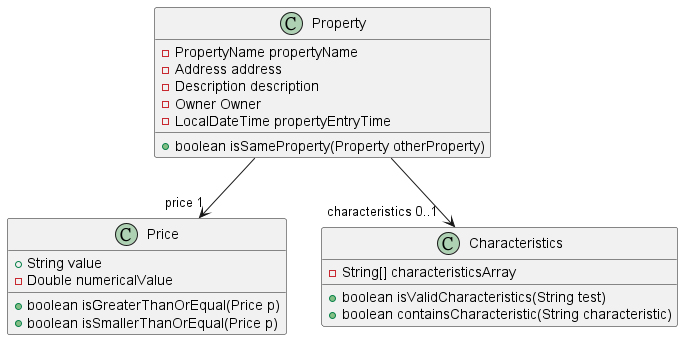

* Table of Contents
{:toc}

## **Introduction**

Cobb is a JavaFX application that helps property agents manage their database of buyers and properties using a
command-line interface. 

### **Purpose**

This guide is primarily targeted towards developers looking to understand or extend the functionalities of Cobb, 
and software testers looking to test Cobb's features. You are also welcome to read this if you understand UML diagrams
and have a general understanding of how a software application works under the hood.

### **Scope**

This guide first gives a high-level architecture overview of Cobb, before explaining the main components that make up 
the application. It then explains some notable features and the design considerations behind their implementation. To
better understand what the application does from the user's standpoint, you might want to dive into the 
[Use cases](#Use cases) section first, or simply run the application and try it for yourself before reading the rest 
of the guide.

--------------------------------------------------------------------------------------------------------------------
## **Acknowledgements**

* [AddressBook-Level3](https://github.com/se-edu/addressbook-level3)
--------------------------------------------------------------------------------------------------------------------

## **Setting up, getting started**

Refer to the guide [_Setting up and getting started_](SettingUp.md).

--------------------------------------------------------------------------------------------------------------------

## **Design**

### Architecture

The ***Architecture Diagram*** given above explains the high-level design of the App.

Given below is a quick overview of main components and how they interact with each other.

**Main components of the architecture**

**`Main`** has two classes called 
[`Main`](https://github.com/AY2223S1-CS2103T-F12-1/tp/blob/master/src/main/java/seedu/address/Main.java)
and [`MainApp`](https://github.com/AY2223S1-CS2103T-F12-1/tp/blob/master/src/main/java/seedu/address/MainApp.java).
It is responsible for,
* At app launch: Initializes the components in the correct sequence, and connects them up with each other.
* At shut down: Shuts down the components and invokes cleanup methods where necessary.

[**`Commons`**](#common-classes) represents a collection of classes used by multiple other components.

The rest of the App consists of four components.

* [**`UI`**](#ui-component): The UI of the App.
* [**`Logic`**](#logic-component): The command executor.
* [**`Model`**](#model-component): Holds the data of the App in memory.
* [**`Storage`**](#storage-component): Reads data from, and writes data to, the hard disk.

**How the architecture components interact with each other**

The *Sequence Diagram* below shows how the components interact with each other for the scenario where the user issues 
the command `deletebuyer 1`.

Each of the four main components (also shown in the diagram above),

* defines its *API* in an `interface` with the same name as the Component.
* implements its functionality using a concrete `{Component Name}Manager` class (which follows the corresponding API 
* `interface` mentioned in the previous point.

For example, the `Logic` component defines its API in the `Logic.java` interface and implements its functionality 
using the `LogicManager.java` class which follows the `Logic` interface. Other components interact with a given 
component through its interface rather than the concrete class (reason: to prevent outside component's being coupled 
to the implementation of a component), as illustrated in the (partial) class diagram below.

The sections below give more details of each component.

### UI component

**API**: 
[`Ui.java`](https://github.com/AY2223S1-CS2103T-F12-1/tp/blob/master/src/main/java/seedu/address/ui/Ui.java)

The UI consists of a `MainWindow` that is made up of parts e.g.`CommandBox`, `ResultDisplay`, `BuyerListPanel`, `PropertyListPanel`, `StatusBarFooter` etc. All these, including the `MainWindow`, inherit from the abstract `UiPart` class which captures the commonalities between classes that represent parts of the visible GUI.

The `UI` component uses the JavaFx UI framework. The layout of these UI parts are defined in matching `.fxml` files that are in the `src/main/resources/view` folder. For example, the layout of the [`MainWindow`](https://github.com/se-edu/addressbook-level3/tree/master/src/main/java/seedu/address/ui/MainWindow.java) is specified in [`MainWindow.fxml`](https://github.com/se-edu/addressbook-level3/tree/master/src/main/resources/view/MainWindow.fxml)

The `UI` component,

* executes user commands using the `Logic` component.
* listens for changes to `Model` data so that the UI can be updated with the modified data.
* keeps a reference to the `Logic` component, because the `UI` relies on the `Logic` to execute commands.
* depends on some classes in the `Model` component, as it displays `Buyer` and `Property` objects residing in `Model`.

### Logic component

**API** : 
[`Logic.java`](https://github.com/AY2223S1-CS2103T-F12-1/tp/blob/master/src/main/java/seedu/address/logic/Logic.java)

Here's a (partial) class diagram of the `Logic` component:

How the `Logic` component works:
1. When `Logic` is called upon to execute a command, it uses the `CobbParser` class to parse the user command.
2. This results in a `Command` object (more precisely, an object of one of its subclasses e.g., `AddBuyerCommand`) 
which is executed by the `LogicManager`.
3. The command can communicate with the `Model` when it is executed (e.g. to add a buyer).
4. The result of the command execution is encapsulated as a `CommandResult` object which is returned back from `Logic`.

The Sequence Diagram below illustrates the interactions within the `Logic` component for the `execute("deletebuyer 1")` 
API call.

:information_source: **Note:** The lifeline for `DeleteBuyerCommandParser`
should end at the destroy marker (X) but due to a limitation of PlantUML, the lifeline reaches the end of diagram.

Here are the other classes in `Logic` (omitted from the class diagram above) that are used for parsing a user command:

How the parsing works:
* When called upon to parse a user command, the `CobbParser` class creates an `XYZCommandParser` (`XYZ` is a 
placeholder for the specific command name e.g. `AddBuyerCommandParser`) which uses the other classes shown above to 
parse the user command and create a `XYZCommand` object (e.g. `AddBuyerCommand`) which the `CobbParser` returns back 
as a `Command` object.
* All `XYZCommandParser` classes (e.g. `AddBuyerCommandParser`, `DeletePropertyCommandParser`, ...) inherit from the 
`Parser` interface so that they can be treated similarly where possible e.g. during testing.

### Model component
**API** : 
[`Model.java`](https://github.com/AY2223S1-CS2103T-F12-1/tp/blob/master/src/main/java/seedu/address/model/Model.java)

The `Model` component,

* stores the buyer book data i.e., all `Buyer` objects (which are contained in a `UniqueBuyerList` object).
* stores the property book data i.e, all `Property` objects (which are contained in a `UniquePropertyList` object).
* stores the currently 'selected' `Buyer` and `Property` objects (e.g. results of a search query) as separate
_filtered_ lists which are exposed to outsiders as unmodifiable `ObservableList<Buyer>` and `ObservableList<Property>`
respectively that can be 'observed' e.g. the UI can be bound to these lists so that the UI automatically updates when 
the data in the lists change.
* stores a `UserPref` object that represents the user’s preferences. This is exposed to the outside as a 
`ReadOnlyUserPref` object.
* does not depend on any of the other three components (as the `Model` represents data entities of the domain, they 
should make sense on their own without depending on other components)

:information_source: **Note:** An alternative (arguably, a more OOP) 
model is given below. A generic Cobb class is created as the parent for BuyerBook and PropertyBook since the two 
children classes have a lot of methods with identical purposes. 

### Storage component

**API** :
[`Storage.java`](https://github.com/AY2223S1-CS2103T-F12-1/tp/blob/master/src/main/java/seedu/address/storage/Storage.java)

The `Storage` component,
* can save buyer book data, property book data, and user preference data in JSON format, and read them back into 
corresponding objects.
* inherits from `BuyerBookStorage`, `PropertyBookStorage`, `UserPrefStorage`, which means it can be treated as either 
one (if only the functionality of only one is needed).
* depends on some classes in the `Model` component (because the `Storage` component's job is to save/retrieve objects 
that belong to the `Model`)

### Common classes

Classes used by multiple components are in the `seedu.addressbook.commons` package.

--------------------------------------------------------------------------------------------------------------------

## **Implementation**

This section describes some noteworthy details on how certain features are implemented.

### \[Proposed\] Undo/redo feature

#### Proposed Implementation

The proposed undo/redo mechanism is facilitated by `VersionedAddressBook`. It extends `AddressBook` with an undo/redo history, stored internally as an `addressBookStateList` and `currentStatePointer`. Additionally, it implements the following operations:

* `VersionedAddressBook#commit()` — Saves the current address book state in its history.
* `VersionedAddressBook#undo()` — Restores the previous address book state from its history.
* `VersionedAddressBook#redo()` — Restores a previously undone address book state from its history.

These operations are exposed in the `Model` interface as `Model#commitAddressBook()`, `Model#undoAddressBook()` and `Model#redoAddressBook()` respectively.

Given below is an example usage scenario and how the undo/redo mechanism behaves at each step.

Step 1. The user launches the application for the first time. The `VersionedAddressBook` will be initialized with the initial address book state, and the `currentStatePointer` pointing to that single address book state.

Step 2. The user executes `delete 5` command to delete the 5th buyer in the address book. The `delete` command calls `Model#commitAddressBook()`, causing the modified state of the address book after the `delete 5` command executes to be saved in the `addressBookStateList`, and the `currentStatePointer` is shifted to the newly inserted address book state.

Step 3. The user executes `add n/David …​` to add a new buyer. The `add` command also calls `Model#commitAddressBook()`, causing another modified address book state to be saved into the `addressBookStateList`.

:information_source: **Note:** If a command fails its execution, it will not call `Model#commitAddressBook()`, so the address book state will not be saved into the `addressBookStateList`.

Step 4. The user now decides that adding the buyer was a mistake, and decides to undo that action by executing the `undo` command. The `undo` command will call `Model#undoAddressBook()`, which will shift the `currentStatePointer` once to the left, pointing it to the previous address book state, and restores the address book to that state.

:information_source: **Note:** If the `currentStatePointer` is at index 0, pointing to the initial AddressBook state, then there are no previous AddressBook states to restore. The `undo` command uses `Model#canUndoAddressBook()` to check if this is the case. If so, it will return an error to the user rather
than attempting to perform the undo.

The following sequence diagram shows how the undo operation works:

:information_source: **Note:** The lifeline for `UndoCommand` should end at the destroy marker (X) but due to a limitation of PlantUML, the lifeline reaches the end of diagram.

The `redo` command does the opposite — it calls `Model#redoAddressBook()`, which shifts the `currentStatePointer` once to the right, pointing to the previously undone state, and restores the address book to that state.

:information_source: **Note:** If the `currentStatePointer` is at index `addressBookStateList.size() - 1`, pointing to the latest address book state, then there are no undone AddressBook states to restore. The `redo` command uses `Model#canRedoAddressBook()` to check if this is the case. If so, it will return an error to the user rather than attempting to perform the redo.

Step 5. The user then decides to execute the command `list`. Commands that do not modify the address book, such as `list`, will usually not call `Model#commitAddressBook()`, `Model#undoAddressBook()` or `Model#redoAddressBook()`. Thus, the `addressBookStateList` remains unchanged.

Step 6. The user executes `clear`, which calls `Model#commitAddressBook()`. Since the `currentStatePointer` is not pointing at the end of the `addressBookStateList`, all address book states after the `currentStatePointer` will be purged. Reason: It no longer makes sense to redo the `add n/David …​` command. This is the behavior that most modern desktop applications follow.

The following activity diagram summarizes what happens when a user executes a new command:

#### Design considerations:

**Aspect: How undo & redo executes:**

* **Alternative 1 (current choice):** Saves the entire address book.
  * Pros: Easy to implement.
  * Cons: May have performance issues in terms of memory usage.

* **Alternative 2:** Individual command knows how to undo/redo by
  itself.
  * Pros: Will use less memory (e.g. for `delete`, just save the buyer being deleted).
  * Cons: We must ensure that the implementation of each individual command are correct.

_{more aspects and alternatives to be added}_

### \[Proposed\] Data archiving

_{Explain here how the data archiving feature will be implemented}_

### Navigate previous commands with arrow keys

#### Motivation

Currently, once a command is executed successfully, there is no way for the user to get it back easily.
However, a user who frequently uses command line interfaces (CLIs) might expect the use of arrow keys to bring
back previous commands, as a way to quickly input multiple similar commands at once.

#### Implementation
`CommandBox` in the `commandbox` package represents the GUI component where the user enters commands.
`CommandRetriever` is a static nested class within `CommandBox`, used to contain and retrieve the history of
successful commands. It implements the following public methods:
- `CommandRetriever#addCommand(String command, TextField textfield)` - Adds a successful command to the command history,
and clears the TextField
- `CommandRetriever#getPreviousCommand(TextField textfield)` - Displays the previous command in the Textfield, if it
exists in the history
- `CommandRetriever#getNextCommand(TextField textfield)` - Displays the next command in the Textfield, if it
exists in the history

These methods are called by `CommandBox#handleCommandEntered()` and `CommandBox#handleKeyReleased(KeyEvent e)`.

Here is the UML diagram for `CommandRetriever`.

`CommandRetriever` only keeps track of the commands executed successfully, as invalid commands are highlighted red
and do not disappear from the TextField. Thus, there is no need to store these invalid commands since the user can
already edit the invalid command in the current implementation without having to retype it. Storing invalid commands
in `CommandRetriever` would only clutter up the history, especially if the user inputted numerous invalid commands.

Given below is an example usage scenario and how the arrow key changes the `CommandBox` text field at each step.
A sequence diagram is also provided below.

Step 1. The user launches the application for the first time. `commandHistory` is initialised as an empty
`ArrayList<String>`, and index is initialised as 0.

Step 2. The user executes a command, `listbuyers` by pressing the Enter key. `CommandBox#handleCommand` is fired,
getting the text from the text field. Since it is a valid command, it is executed successfully. `listbuyers` is added
to the `commandHistory` list, and index is set to `commandHistory.size()`.

Step 3. The user types a command halfway, but does not press the Enter key. He/she now wishes to use the previous
command to type the command.

Step 4. The user presses and releases the Up arrow. `CommandBox#handleKeyReleased` is fired, which sets the text field
to display the `(index - 1)`th element in `commmandHistory`. Because the current command is one that has not been
executed, it is saved in the field `currentCommand`.

Step 5. The user presses and releases the Up arrow again. `CommandBox#handleKeyReleased` is fired, but since there are
no more previous commands, nothing happens.

Step 6. The user presses and releases the Down arrow. `CommandBox#handleKeyReleased` is fired. Since this is the last
element in `commandHistory`, the text field is set to display the string `currentCommand`. This would be the user's
unexecuted command from Step 3.

### Indexing existing buyers and properties in the database

Many of the existing features that are currently implemented requires Cobb to index existing entries in the database.
For example, `deletebuyer 1` would perform the `deletebuyer` operation on the buyer at index `1` of the buyer list.

If the index provided is not a positive integer or not a valid number, Cobb will throw an error requesting the user to
provide a valid input. Similarly, if the index provided is valid but exceeds the number of elements currently in the list,
Cobb will be able to identify that there is a bounds mismatch and inform the user to provide a valid input within bounds.

Internally, both of the lists of `Buyers` and `Properties` are stored using an `ObservableList`, which is an array-like
data structure provided by JavaFX which fires off reports about all of its changes to associated listeners. This means that
any changes to the structure or objects in the `ObservableList` will be recorded by its listeners, causing the updated
list to be displayed correctly on the user's screen.

#### Design Considerations
**Aspect: How entries are indexed in a list**
* **Alternative 1 (current choice)**: Entries are indexed by their relative positions in the current `ObservableList`.
  If the list is filtered or sorted, then the entries' relative positions will change according to this new version of the
  list.
    * Pros:
        * Users will be able to quickly ascertain the index of an entry in the list simply by finding the entry in the list.
        * Indices of visible entries in the `ObservableList` will always be in the range `[1,n]` inclusive, where n
          is the number of entries currently visible in the list. This gives the indices order and structure.
        * No index field needs to be created for `Buyer` and `Property` objects.
    * Cons:
        * The relative index of an entry will change depending on the current structure of the `ObservableList`. This 
          means that a property that has index `1` might not have the same index after the property list is filtered.

* **Alternative 2**: Entries in a list are indexed by an internal `EntryID` parameter that is automatically generated 
  upon its creation.
    * Pros:
        * Users will still be able to identify the index of the entry by first looking for the entry in the list, and then
          looking at the value of its `EntryID` parameter.
        * The index of the entry in the list will not change if the structure of the list is changed, e.g. through filtering
          or sorting operations.
    * Cons:
        * `Buyer` and `Property` class will be bloated with one extra parameter.
        * Care needs to be taken to ensure that no IDs are clashing with each other, which might lead to implementation issues.
        * Users might be able to execute commands on entries in the list that are not currently visible, which might lead
          to confusion.

### Creating a buyer

The `Buyer` class represents a buyer with buyer-specific fields. `PriceRange`, `Characteristics`, and `Priority`
denote his budget, requirements for the property, and buyer priority respectively.  

These three fields are all optional. When the user chooses not to indicate a buyer’s price range or desired characteristics, the `priceRange` and `desiredCharacteristics` field of a buyer may be null. Hence, they have both been implemented using `Optional<T>`.
When the user chooses not to indicate a buyer priority, the buyer's priority will be set to the default priority as `NORMAL`.
When the user creates a buyer, the entry time is also automatically stored as an `LocalDateTime`. 

This is the class diagram of a `Buyer`.

The structure for executing an `addbuyer` command follows the flow as mentioned in the “Logic component” section of this guide.

#### Design considerations:
No duplicate buyers can be added to the buyer list. This means that no two buyers with the same phone or email can exist. We considered using only name to identify a buyer, so that two people with the name but different contact numbers can be added. However, we decided against it as there could be two people with the exact same name. Therefore, we decided to use phone or email since these should be unique to every person. 
The entry time is added towards later of the development to help facilitate a more flexible implementation of the `sortbuyers` command.  

### Creating a property

The `Property` class represents a property with property-specific fields. `Price` and `Characteristics` denote the price and feature of the property respectively.

The `price` field is mandatory while the `characteristics` field is optional. When the user chooses not to indicate a property's characteristics, the `characteristics` field of a property may be null. Hence, it has been implemented using `Optional<T>`.
When the user creates a property, the entry time is also automatically stored as an `LocalDateTime`.

This is the class diagram of a `Property`.

The structure for executing an `addprop` command follows the flow as mentioned in the "Logic component" section of this guide.

#### Design considerations:
No duplicate properties can be added to the property list. This means that no two properties with the same address can exist. We used name and price to identify a property in previous iterations, but later decided against it since in real life there could be identical properties with the exact same name and price. The only thing unique to the property would be the unit number recorded in the address.
The entry time is added towards later of the development to help facilitate a more flexible implementation of the `sortprops` command.

### Editing of buyers and properties

#### Motivation
The user may want to edit the details of a buyer or property after adding it to the application. For example, the user may want to change the budget range of a buyer after adding it to Cobb. 
Or, the user may want to change the price of a property after adding it to Cobb.

#### Implementation
The `EditBuyerCommand` and `EditPropertyCommand` classes extends the `Command` class. They are used to edit the details of a buyer or property, respectively.
Both commands allow the user to change any of the fields of a buyer or property. The commands expect at least one flag to be edited, otherwise an error message will be displayed.
When the edit command is inputted, the `EditBuyerCommandParser` and `EditPropertyCommandParser` classes are used to parse the user input and create the respective `EditBuyerCommand` and `EditPropertyCommand` objects.
When these created command objects are executed by the `LogicManager`, the `EditBuyerCommand#execute(Model model)` or `EditPropertyCommand#execute(Model model)` methods are called. These methods will edit the buyer or property in the model, and return a `CommandResult` object.

:exclamation: **Note:**
To be more concise, we will be referring to both buyers and properties as entities in this section from here onwards.

During this execution process, the existing entity is first retrieved from the model. The fields of the entities are then edited according to what flags were passed in by the user during the edit commands. 
A new buyer or property is then created with the edited fields, and any fields that have not been edited will be copied over from the original entity. The new entity is then added to the model, and the original entity is removed from the model.
The new buyer or property is then added into the model, replacing the old one. The new entity will then be displayed to the user, and a success message is displayed.

The following sequence diagram shows how the `EditBuyerCommand` is executed.

#### Design considerations
**Aspect: How the edit commands should relate to each other:**

* **Alternative 1 (current choice):** `EditBuyerCommand` and `EditPropertyCommand` are separate, and both inherit from the `Command` class.
    * Pros:
        * Both the `Buyer` and `Property` classes have different fields that are exclusive to each other.
        * This reduces complexity of the system, and unexpected behaviours.
        * The inheritance of the `Command` class allows us to keep to the Command design pattern, to easily add more types of edit commands in the future, without having to change the existing code. 
    * Cons:
        * More boilerplate code for each of the classes, which increases the size of the codebase.
* **Alternative 2:** A single `EditCommand` class is used to edit both buyer and property.
    * Cons:
        * Unnecessary complexity is introduced into the system.

**Aspect: How the edited entities should interact with the model:**
* We also decided for the edit commands to create a new entity, instead of editing the existing one. This allows us to not include any setters in the `Buyer` and `Property` classes, which make the objects immutable, so there is less likelihood of unexpected changes to the object. 
By creating a new entity every time the user edits, we can easily add the new buyer or property into the model, and remove the old one. This also allows us to easily undo the edit command in the future, by simply adding the old entity back into the model.

### Owner specification within a property

#### Motivation
In real estate, a property being listed by a property agent is usually owned by a property owner. 
However, the agent may not be the owner of the property. Hence, we decided to allow the user to specify the owner of a property, 
with essential details such as their name and phone number, and have them represented as part of the `Property` class.

#### Implementation
To identify the owner of the property, we decided to include an `Owner` object within a `Property`. This `Owner` class contains two fields: `name` and `phone`.

The `name` and `phone` fields in the `Owner` class are compulsory, to make sure that each property being sold has a relevant contact buyer.
The fields are also validated the same way as when creating a new `Buyer` object.

To support retrieving the `Owner` of a `Property`, we added the following methods:
- `Property#getOwner()` - Returns the `Owner` object of the property.
- `Property#getOwnerName()` - Retrieves the name of the owner of the property.
- `Property#getOwnerPhone()` - Retrieves the phone number of the owner of the property.

This is the class diagram showing the full `Property` class diagram, with the `Owner` class included:

The `Owner` class enacts the Composition relationship, as the `Property` class contains the `Owner` object. Hence, if the property is deleted, it's associated owner will also be deleted.
The tradeoffs for this approach is examined below:

#### Design considerations
**Aspect: How the owner class associates with the property class:**

* **Alternative 1 (current choice):** Owner class is coupled together with the property class.
    * Pros:
      * The `Owner` class is only used in the `Property` class, so it makes sense to couple them together.
      * You do not need to create an owner object separately using another command.
      * This reduces complexity of the system, and unexpected behaviours.
    * Cons:
      * This creates a 1-to-1 relationship between the owner and the property.
      * Each owner is coupled tightly with the property, and cannot be used for other properties.

* **Alternative 2:** Users will have to create an `Owner` object separately, and link it to the property manually.
    * Pros:
      * This allows for a many-to-many relationship between the owners and properties.
      * This allows for better OOP design, as owners will be treated as a separate, first-class entity, similar to
      `Buyer`.
    * Cons:
      * Increases complexity for a possibly limited use case of linking an owner to multiple properties.
      * This may lead to unexpected behaviours, such as whether properties linked to an owner should be deleted when
      the owner is deleted.

### Filtering buyers and properties

In order to filter `Buyers` and `Properties`, a `Predicate` needs to be passed into the `ObservableList` that stores 
references to these objects and displays them on the user's screen. These predicates can differ in the conditions that are
being tested, consequently, they might give different outputs when applied to a given list.

#### Design Considerations:
In order to allow for multiple-condition filtering, that is, the composition of multiple filter predicates, an abstract 
`AbstractFilterXYZPredicate` class was created to employ polymorphic behaviour, where XYZ represents the entry type that
we are working with, for example `AbstractFilterBuyersPredicate` or `AbstractFilterPropsPredicate`. 

Additionally, since users
are only allowed to filter using certain conditions as defined in the behaviour of the `filter` commands, concrete classes
extending this abstract predicate class were implemented for each condition. For example:

Users can filter `Properties` by their `PropertyName`, `Price`, `Characteristics` or `OwnerName`. As a result, the following 
concrete predicate classes were implemented:
1. `PropertyNameContainsSubstringPredicate`
2. `FilterPropsByPricePredicate`
3. `FilterPropsContainingAllCharacteristicsPredicate`
4. `FilterPropsContainingAnyCharacteristicsPredicate`
5. `FilterPropsByOwnerNamePredicate`

Based on command parameters passed in by the user, these predicates are constructed and composed together to form a single
`Predicate`, which is then used to filter the `ObservableList` directly.

The UML diagram below represents the overall structure of the predicates for `Buyers` and `Properties`.

#### Filter-specific design considerations
1. Filtering `Properties` by their prices takes in a `priceRange` instead of just a `Price` as it makes more sense for
   agents to want to identify properties that fit within a certain price range instead of a fixed price.
2. For both `filterBuyers` and `filterProps`, passing in the `-fuzzy` flag will change the final composed predicate to be
   a logical **OR** of all individual predicates, that is, only one of the predicates needs to be satisfied in order
   for the entry to pass through the filter.
3. If the `-c` flag is specified, that is, desired characteristics are supplied as filter conditions, the default behaviour
   is for Cobb to filter out entries that contain **ALL** of the given characteristics. The `-fuzzy` flag changes this behaviour
   to filter out entries that contain *at least one* of the given characteristics.
4. Filtering entries by name - that is, providing the `-n` flag to the filter command, will filter all entries whose names
   contain the parameter provided to `-n` as a *substring*.

### Sorting buyers and properties

To sort `Buyers` and `Properties`, the `ObservableList` that stores references to these objects and displays them on the user's screen
is modified directly to a sorted version. These changes are propagated directly to the `FilteredList`, enabling users to sort
a previously filtered list. As the `FilteredList` is based on the `ObservableList`, users can also sort the list first,
then filter it. This results in users being able to build sort and filter functions on top of each other to more powerfully
manipulate the list based on their needs.

A `Comparator` is used to sort the `ObservableList`. Different comparators with different conditions are used to sort the
list by different criteria. The following are the `Comparators` used to allow for the corresponding sorting functions:

`Buyer`: `BuyerComparator`
1. `BuyerNameComparator`: sort by buyer's name
2. `PriceRangeComparator`: sort by buyer's price range
3. `PriorityComparator`: sort by buyer's priority

`Property`: `PropertyComparator`
4. `PropertyNameComparator`: sort by property's name
5. `PriceComparator`: sort by property's price
Both:
6. `TimeComparator`: sort by entry's time of creation

A `BuyerComparator` compares two `Buyer`s by using the `Comparator` stored in it on the corresponding `Buyer` fields.
For example, if a `BuyerComparator` contains a `BuyerNameComparator`, the two `Buyer`s are compared by their `Name`s using the `BuyerNameComparator`.
As we allow sorting only by one criterion at a time, a `BuyerComparator` will only contain one field `Comparator`. 

The UML diagrams below represent the overall structure of the `Comparator`s used.

Below is a Seqeunce Diagram showing how a `sortbuyer -n ASC` command is executed through the model to modify the original `ObservableList`.

#### Design Considerations:
Similar to the `FilteredList` abstraction provided by JavaFX, we considered using a `SortedList` to present the list in a
sorted version without modifying the underlying data structure `ObservableList`. This is
to preserve the chronological order in which users enter the entries so that it can still be displayed with the `list` command.

However, this meant that we needed to have both `FilteredList` and `SortedList` stored and vary which one is displayed to users
on entering a command. As such, the last-shown list changes depending on the last command entered. To keep track of this,
we used a flag which would be updated everytime a `filter` or `sort` command was used. All `Command`s that referred to an
entry on the displayed list were adapted to take relative indices from the last-shown list indicated by the flag. The `Model`
component also needed access to the `UI` component's `BuyerPanelList` and `PropertyPanelList` in order to display
the corresponding `FilteredList` or `SortedList` based on changes to the flag. To reduce coupling, we would have had to
apply the Observer pattern.

We decided against this as the complicated design made it more bug-prone. In addition, it did not allow for
stacking of `filter` and `sort` functions, that is, a user is unable to filter on top of a sorted list or vice versa as the
`FilteredList` and `SortedList` are independent and separate from each other.

Hence, the above-mentioned design was used. We included chronological sorting as well using `TimeComparator`
so that the user is able to return to the original state of the list,
since sorting by name, for example, would permanently modify the `ObservableList`.

### Matching properties to a buyer, and vice versa

`matchprop` and `matchbuyer` are convenience features, allowing the users to find suitable matches between buyers
and properties easily. Without this, users would have to manually input the conditions from an identified buyer or 
property and make use of the `filter` command. `matchprop` allows users to filter the buyer list with the conditions 
set by a specific property. `matchbuyer` is similar, filtering the property list with the conditions set by a specific 
buyer. 

#### Specifications

For `matchprop`, a `Buyer` is considered a match if its `PriceRange` contains the property's `Price` (inclusive),
and contains at least 1 common characteristic with the property.
For `matchbuyer`, a `Property` is considered a match if its `Price` is within the buyer's `PriceRange` (inclusive),
and contains at least 1 common characteristic with the buyer.

It is also possible to specify `-strict`, which would require a matching object to have _all_ (instead of at least 1)
the characteristics of the target object. This was added due to the possibility that the user gets too many matches,
and wishes to narrow down the results easily. Without this, the user would have to revert to the `filter` command 
and manually input more specific conditions.

Here is a Sequence Diagram of how `matchbuyer 1` is handled, assuming 1 is a valid index and the `Buyer` at index 1 
contains both a `PriceRange` and `Characteristics`.

We see how `MatchBuyerCommand` only works to create a combined predicate of `PriceRange` and `Characteristic`, which is 
then passed to the constructor of `FilterPropertiesCommand` and executed.

#### Design considerations:

`Buyer` and `Property` have many different fields, but there were only a few common fields between them. Both classes
contain `Characteristics`. `Property` contains `Price`, which inherits from `PriceRange` that `Buyer` contains. Thus,
it makes sense that only these fields are used in the match commands, since it would not be possible to filter the list
by a field that is not present in a matching object.

Initially, we also considered allowing a `Buyer` or `Property` to be a match if it just contained at least 1 common
characteristic (i.e. a match did not need to satisfy the pricing condition). However, we decided against this as we
felt that a buyer would almost never consider a property that is not within their budget, and vice versa. Allowing this
to occur would likely give the user more matches that were irrelevant instead of useful ones.

--------------------------------------------------------------------------------------------------------------------

## **Documentation, logging, testing, configuration, dev-ops**

* [Documentation guide](Documentation.md)
* [Testing guide](Testing.md)
* [Logging guide](Logging.md)
* [Configuration guide](Configuration.md)
* [DevOps guide](DevOps.md)

--------------------------------------------------------------------------------------------------------------------

## **Appendix: Requirements**

### Product scope

**Target user profile**:

* property agent
* needs to manage a significant number of buyers, sellers and properties concurrently
* often overwhelmed by a disorganised and inefficient database
* wants to keep track of all information neatly categorised in one place
* takes too long to manually go through each property to find one that matches a buyer's requirements
* prefers desktop apps over other types
* can type fast and prefers typing to mouse interactions
* is reasonably comfortable using CLI apps

**Value proposition**: increases efficiency and convenience by allowing quick text-based inputs,
use of commands to quickly execute functionalities as compared to buttons in the UI on desktop applications, 
automation of matching between suitable properties and buyers

### User stories

Priorities: High (must have) - `* * *`, Medium (nice to have) - `* *`, Low (unlikely to have) - `*`

| Priority | As a …​                                        | I want to …​                                                                          | So that I can…​                                                   |
|----------|------------------------------------------------|---------------------------------------------------------------------------------------|-------------------------------------------------------------------|
| `* * *`  | property agent                                 | add new buyers                                                                        |                                                                   |
| `* * *`  | property agent                                 | add new properties                                                                    |                                                                   |
| `* *`    | property agent                                 | edit contact and property information offline                                         | keep the information updated                                      |
| `* *`    | property agent                                 | delete existing contact and propety entries                                           | remove redundant information, to keep dataset neat                |
| `* *`    | property agent with a large number of contacts | sort buyers and properties according to various relevant criteria                     | easily manipulate my list in a way I want to view the information |
| `* *`    | property agent                                 | find and filter for certain characteristics                                           | easily find matches                                               |
| `*`      | non tech-savvy user                            | be able to make use of the command-line interface without too much difficulty         |                                                                   |
| `*`      | property agent                                 | filter out properties that do not meet the conditions of a prospective buyer          |                                                                   |
| `*`      | property agent                                 | save tasks related to each contact                                                    | monitor the things that I have to do                              |
| `*`      | property agent                                 | input notes for each contact                                                          | easily retrieve it for future correspondence with the client      |
| `*`      | property agent                                 | view all existing information at a glance in a clean, visually-appealing manner       | easily make sense of information presented                        |
| `*`      | property agent with many clients               | avoid duplicate contacts                                                              | have a neat list of active clients                                |
| `*`      | property agent                                 | view the commission rate for each closed case and aggregated commissions for the year | track my progress                                                 |
| `*`      | property agent                                 | prioritise some clients who are desperate to find a place                             | contact them first and close the deal more easily                 |
| `*`      | property agent with a busy schedule            | know when my next free time is                                                        | schedule client meetings with no overlap                          |

### Use cases

(For all use cases below, the **System** is `Cobb` and the **Actor** is the `user`, unless specified otherwise)

### Use case: Add a buyer

**MSS:**

1. User chooses to add a new buyer.
2. User enters the details of the buyer.
3. User executes add command.

Use case ends.

**Extensions**
* 3a. The buyer already exists. 
  3a1. Cobb shows an error message. 
  Use case ends.

* 3b. User provides incorrectly formatted information. 
  3b1. Cobb shows an error message. 
  Use case ends.

### Use case: Add a property

**MSS:**

1. User chooses to add a new property.
2. User enters the details of the property.
3. If available, user enters the details of the owner of the property.
4. User executes add command.

Use case ends.

**Extensions**
* 4a. The property already exists. 
  4a1. Cobb shows an error message. 
  Use case ends.

* 4b. User provides incorrectly formatted information. 
  4b1. Cobb shows an error message.  
  Use case ends.

### Use case: Edit a buyer

**MSS:**

1. User chooses to edit an existing buyer.
2. User finds buyer they want to edit.
3. User executes update command with relevant information to update.

Use case ends.

**Extensions**
* 3a. User provides incorrect information to update. 
  3a1. Cobb shows an error message. 
  Use case ends.

### Use case: List properties

**MSS:**

1. User chooses to list properties.
2. User executes list properties command.
3. Cobb displays a list of all properties saved.

Use case ends.

### Use case: List buyers

**MSS:**

1. User chooses to list buyers
2. User executes list buyers command.
3. Cobb displays a list of all buyers saved.

Use case ends.

### Use case: Delete irrelevant properties

**MSS:**

1. User <u>lists properties [(Use case: List properties)](#use-case-list-properties)</u>.
2. User finds properties that are no longer relevant (e.g. already sold).
3. User executes delete command on these properties.

Use case ends.

### Use case: Delete irrelevant buyers

**MSS:**

1. User <u>lists buyers [(Use case: List buyers)](#use-case-list-buyers)</u>.
2. User finds buyers that are no longer relevant (e.g. already bought a house).
3. User executes delete command on these buyers.

### Use case: Sort properties

**MSS:**

1. User chooses to sort properties by a specified field in a specified order.
2. User executes sort properties command on the currently displayed properties list.
3. Cobb displays the last-shown property list in a sorted order according to the specified criteria.

Use case ends.

### Use case: Sort buyers

**MSS:**

1. User chooses to sort buyers by a specified field in a specified order.
2. User executes sort buyers command on the currently displayed buyer list.
3. Cobb displays the last-shown buyer list in a sorted order according to the specified criteria.

Use case ends.

### Use case: Match buyer to properties

**Preconditions**: Prospective buyer has been added.

**MSS:**
1. User <u>lists all buyers [(Use case: List buyers)](#use-case-list-buyers)</u>.
2. User executes match command on desired buyer.

Use case ends.

### Use case: Match property to buyers

**Preconditions**: Property exists in database.

**MSS:**
1. User <u>lists all properties [(Use case: List properties)](#use-case-list-properties)</u>.
2. User executes match command on desired property.

Use case ends.

### Use case: New buyer

**MSS:**
1. User gets a new buyer.
2. User <u>adds the buyer [(Use case: Add buyer)](#use-case-add-a-buyer)</u>
3. User tries to <u>match the buyer to a property [(Use case: Match buyer to property)](#use-case-match-buyer-to-properties)</u>.

**Extensions:**
* 2a. Buyer already exists. 
  2b. User edits the existing buyer with new requirements, if necessary. 
  Use case continues at 3.

### Use case: Edit a property

**MSS:**

1. User chooses to edit an existing property.
2. User enters the details of the property to be edited.
3. Property is successfully edited with the new details.

Use case ends.

**Extensions**
* 1a. The property does not exist.
  * 1a1. Cobb shows an error message.
  * Use case ends.
* 2a. The new details cause the property to be a duplicate of another property.
  * 2a1. Cobb shows an error message.
  * Use case ends.
* 2b. The new details are the same as previous details.
  * 2b1. Property remains the same.
  * Use case ends.
* 2c. The new details are invalid.
  * 2c1. Cobb shows an error message.
  * Use case ends.

*{More to be added}*

### Non-Functional Requirements

1. Should work on any _mainstream OS_ as long as it has Java `11` or above installed.
2. Should work on any computer fewer than five years old. 
3. Should be able to hold up to 1000 buyers without a noticeable sluggishness in performance for typical usage.
4. Should be able to respond within two seconds.
5. Should be downloaded and available to use within one minute.
6. A user with above average typing speed for regular English text (i.e. not code, not system admin commands) should be able to accomplish most of the tasks faster using commands than using the mouse.

*{More to be added}*

### Glossary

* **Mainstream OS**: Windows, Linux, Unix, OS-X
* **Private contact detail**: A contact detail that is not meant to be shared with others

--------------------------------------------------------------------------------------------------------------------

## **Appendix: Instructions for manual testing**

Given below are instructions to test the app manually.

:information_source: **Note:** These instructions only provide a starting point for testers to work on;
testers are expected to do more *exploratory* testing.

### Launch and shutdown

1. Initial launch

   1. Download the jar file and copy into an empty folder

   1. Double-click the jar file Expected: Shows the GUI with a set of sample contacts. The window size may not be optimum.

1. Saving window preferences

   1. Resize the window to an optimum size. Move the window to a different location. Close the window.

   1. Re-launch the app by double-clicking the jar file. 
       Expected: The most recent window size and location is retained.

1. _{ more test cases …​ }_

### Deleting a buyer

1. Deleting a buyer while all buyers are being shown

   1. Prerequisites: List all buyers using the `list` command. Multiple buyers in the list.

   1. Test case: `delete 1` 
      Expected: First contact is deleted from the list. Details of the deleted contact shown in the status message. Timestamp in the status bar is updated.

   1. Test case: `delete 0` 
      Expected: No buyer is deleted. Error details shown in the status message. Status bar remains the same.

   1. Other incorrect delete commands to try: `delete`, `delete x`, `...` (where x is larger than the list size) 
      Expected: Similar to previous.

1. _{ more test cases …​ }_

### Saving data

1. Dealing with missing/corrupted data files

   1. _{explain how to simulate a missing/corrupted file, and the expected behavior}_

1. _{ more test cases …​ }_
