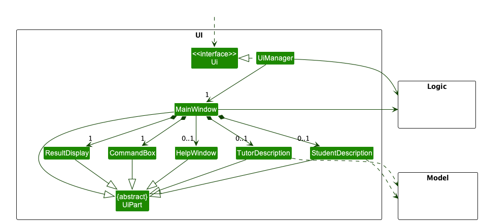

* Table of Contents
  {:toc}

--------------------------------------------------------------------------------------------------------------------

## **Acknowledgements**

* {list here sources of all reused/adapted ideas, code, documentation, and third-party libraries -- include links to the
  original source as well}

--------------------------------------------------------------------------------------------------------------------

## **Setting up, getting started**

Refer to the guide [_Setting up and getting started_](SettingUp.md).

--------------------------------------------------------------------------------------------------------------------

## **Design**

:bulb: **Tip:** The `.puml` files used to create diagrams in this document can be found in
the [diagrams](https://github.com/se-edu/addressbook-level3/tree/master/docs/diagrams/) folder. Refer to the [_PlantUML
Tutorial_ at se-edu/guides](https://se-education.org/guides/tutorials/plantUml.html) to learn how to create and edit
diagrams.

### Architecture

The ***Architecture Diagram*** given above explains the high-level design of the App.

Given below is a quick overview of main components and how they interact with each other.

**Main components of the architecture**

**`Main`** has two classes
called [`Main`](https://github.com/se-edu/addressbook-level3/tree/master/src/main/java/seedu/address/Main.java)
and [`MainApp`](https://github.com/se-edu/addressbook-level3/tree/master/src/main/java/seedu/address/MainApp.java). It
is responsible for,

* At app launch: Initializes the components in the correct sequence, and connects them up with each other.
* At shut down: Shuts down the components and invokes cleanup methods where necessary.

[**`Commons`**](#common-classes) represents a collection of classes used by multiple other components.

The rest of the App consists of four components.

* [**`UI`**](#ui-component): The UI of the App.
* [**`Logic`**](#logic-component): The command executor.
* [**`Model`**](#model-component): Holds the data of the App in memory.
* [**`Storage`**](#storage-component): Reads data from, and writes data to, the hard disk.

**How the architecture components interact with each other**

The *Sequence Diagram* below shows how the components interact with each other for the scenario where the user issues
the command `delete 1`.

Each of the four main components (also shown in the diagram above),

* defines its *API* in an `interface` with the same name as the Component.
* implements its functionality using a concrete `{Component Name}Manager` class (which follows the corresponding
  API `interface` mentioned in the previous point.

For example, the `Logic` component defines its API in the `Logic.java` interface and implements its functionality using
the `LogicManager.java` class which follows the `Logic` interface. Other components interact with a given component
through its interface rather than the concrete class (reason: to prevent outside component's being coupled to the
implementation of a component), as illustrated in the (partial) class diagram below.

The sections below give more details of each component.

### UI component

The **API** of this component is specified
in [`Ui.java`](https://github.com/se-edu/addressbook-level3/tree/master/src/main/java/seedu/address/ui/Ui.java)

Given below is a partial class diagram of the `Ui` component.

The UI consists of a `MainWindow` that is made up of parts including `CommandBox`, `ResultDisplay`, `StatusBarFooter`.
The `mainWindow` also has `HelpWindow` and `AddCommandPopupWindow` that will be shown to the user when required.
Detailed implementation of the `AddCommandPopupWindow` is written [here](#pop-up-window-for-add-command).
All these, including the `MainWindow`, inherit from the abstract `UiPart` class which captures the commonalities between
classes that represent parts of the visible GUI.

Furthermore, the `MainWindow` can be filled by **one** List panels, such as `BuyerListPanel` and `PetListPanel`, for display.
Which list panel is displayed depends on the input `Command`.
Each list panel can have any number of the corresponding card. For example, `BuyerListPanel` can have any number
of `BuyerCard`.
All the list panels and cards inherit from the abstract `UiPart`, but **not shown** in the diagram below to reduce graph
complexity.
Detailed implementation of the list panel can be found [here](#display-of-person-list).

The `UI` component uses the JavaFx UI framework. The layout of these UI parts are defined in matching `.fxml` files that
are in the `src/main/resources/view` folder. For example, the layout of
the [`MainWindow`](https://github.com/AY2223S1-CS2103T-T09-2/tp/blob/master/src/main/java/seedu/address/ui/MainWindow.java)
is specified
in [`MainWindow.fxml`](https://github.com/AY2223S1-CS2103T-T09-2/tp/blob/master/src/main/resources/view/MainWindow.fxml)

The `UI` component,

* executes user commands using the `Logic` component.
* listens for changes to `Model` data so that the UI can be updated with the modified data.
* keeps a reference to the `Logic` component, because the `UI` relies on the `Logic` to execute commands.
* depends on some classes in the `Model` component, as it displays `Person` object residing in the `Model`.

### Logic component

**API** : [`Logic.java`](https://github.com/se-edu/addressbook-level3/tree/master/src/main/java/seedu/address/logic/Logic.java)

Here's a (partial) class diagram of the `Logic` component:

How the `Logic` component works:

1. When `Logic` is called upon to execute a command, it uses the `AddressBookParser` class to parse the user command.
1. This results in a `Command` object (more precisely, an object of one of its subclasses e.g., `AddCommand`) which is
   executed by the `LogicManager`.
1. The command can communicate with the `Model` when it is executed (e.g. to add a person).
1. The result of the command execution is encapsulated as a `CommandResult` object which is returned back from `Logic`.

The Sequence Diagram below illustrates the interactions within the `Logic` component for the `execute("delete 1")` API
call.

:information_source: **Note:** The lifeline for `DeleteCommandParser` should end at the destroy marker (X) but due to a limitation of PlantUML, the lifeline reaches the end of diagram.

Here are the other classes in `Logic` (omitted from the class diagram above) that are used for parsing a user command:

How the parsing works:

* When called upon to parse a user command, the `AddressBookParser` class creates an `XYZCommandParser` (`XYZ` is a
  placeholder for the specific command name e.g., `AddCommandParser`) which uses the other classes shown above to parse
  the user command and create a `XYZCommand` object (e.g., `AddCommand`) which the `AddressBookParser` returns back as
  a `Command` object.
* All `XYZCommandParser` classes (e.g., `AddCommandParser`, `DeleteCommandParser`, ...) inherit from the `Parser`
  interface so that they can be treated similarly where possible e.g, during testing.
* Some Commands have multiple parsers for the same Command (FindCommand has 3 different parsers - FindBuyerCommandParser
  , FindSupplierCommandParser and FindDelivererCommandParser, all of which return a FindCommand)
* Some parsers can return different Commands (eg. SortCommandParser can return a SortBuyerCommand, SortDelivererCommand
  etc.)
* Some Commands are similar but have their own Parsers and behave distinctly. (eg. AddDelivererCommand vs
  AddBuyerCommand).

### Model component

**API** : [`Model.java`](https://https://github.com/AY2223S1-CS2103T-T09-2/tp/blob/master/src/main/java/seedu/address/model/Model.java)

The `Model` component,

* stores the address book data i.e., all `Buyer`, `Supplier`, `Deliverer`, `Order`, and `Pet` objects (which are contained in
  a `UniqueBuyerList`, `UniqueDelivererList`, `UniqueSupplierList`, `UniqueOrderList`, and `UniquePetList` object).
* stores the currently 'selected' `Buyer`, `Supplier`, `Deliverer`, `Order`, and `Pet` objects (e.g., results of a
  search query) as a separate _filtered_ list which is exposed to outsiders as an unmodifiable `ObservableList<Buyer>`,
  `ObservableList<Supplier>`, `ObservableList<Deliverer>`, `ObservableList<Order>`, `ObservableList<Pet>` that can be
  'observed' e.g. the UI can be bound to this list so that the UI automatically updates when the data in the list change.
* stores a `UserPref` object that represents the user’s preferences. This is exposed to the outside as
  a `ReadOnlyUserPref` objects.
* does not depend on any of the other three components (as the `Model` represents data entities of the domain, they
  should make sense on their own without depending on other components)

:information_source: **How Different Address Book Objects are Stored:**   
The diagrams given below contains more details on how each `Buyer`, `Supplier`,
`Deliverer`, `Order` and `Pet` objects are stored in the Model component.  

For more information on what each object represents, refer to the [Glossary](#glossary) section.   

**`Buyer` and `Deliverer` Class** 

Both the `Buyer` and `Deliverer` classes inherit from the `Person` class and have an orders attribute.
Each order has an `UniqueId` for easier identification. Hence, the orders are stored as a collection of `UniqueId`
objects to easily access unique orders. Given below is the class diagram for the **`Buyer`** Class:  

   

**`Supplier` Class** 

Similar to the `Buyer` and `Deliverer` class, the `Supplier` class inherits from the `Person` class. However, instead of
an orders attribute, the `Supplier` class has a pets attribute to represent the pets sold by the `Supplier`.
Similar to an order, each pet has an `UniqueId` for easier identification. Hence, the pets are stored as a collection of
`UniqueId` objects to easily access unique pets. Given below is the class diagram for the **`Supplier`** Class:  

   

**`Order` Class** 

The `Order` class consists of several attributes. The most important attribute to take note of is the Buyer as
every order should be made by a Buyer. Given below is the class diagram for the **`Order`** Class:  

   

**`Pet` Class** 

The `Pet` class consists of several attributes. The most important attribute to take note of is the Supplier as
every pet should be sold by a Supplier. Given below is the class diagram for the **`Pet`** Class:  

### Storage component

**API** : [`Storage.java`](https://github.com/AY2223S1-CS2103T-T09-2/tp/blob/master/src/main/java/seedu/address/storage/Storage.java)

The `Storage` component,

* can save both address book data and user preference data in json format, and read them back into corresponding
  objects.
* inherits from both `AddressBookStorage` and `UserPrefStorage`, which means it can be treated as either one (if only
  the functionality of only one is needed).
* depends on some classes in the `Model` component (because the `Storage` component's job is to save/retrieve objects
  that belong to the `Model`)

### Common classes

Classes used by multiple components are in the `seedu.addressbook.commons` package.

--------------------------------------------------------------------------------------------------------------------

## **Implementation**

This section describes some noteworthy details on how certain features are implemented.

### \[Proposed\] Undo/redo feature

#### Proposed Implementation

The proposed undo/redo mechanism is facilitated by `VersionedAddressBook`. It extends `AddressBook` with an undo/redo
history, stored internally as an `addressBookStateList` and `currentStatePointer`. Additionally, it implements the
following operations:

* `VersionedAddressBook#commit()`— Saves the current address book state in its history.
* `VersionedAddressBook#undo()`— Restores the previous address book state from its history.
* `VersionedAddressBook#redo()`— Restores a previously undone address book state from its history.

These operations are exposed in the `Model` interface as `Model#commitAddressBook()`, `Model#undoAddressBook()`
and `Model#redoAddressBook()` respectively.

Given below is an example usage scenario and how the undo/redo mechanism behaves at each step.

Step 1. The user launches the application for the first time. The `VersionedAddressBook` will be initialized with the
initial address book state, and the `currentStatePointer` pointing to that single address book state.

Step 2. The user executes `delete 5` command to delete the 5th person in the address book. The `delete` command
calls `Model#commitAddressBook()`, causing the modified state of the address book after the `delete 5` command executes
to be saved in the `addressBookStateList`, and the `currentStatePointer` is shifted to the newly inserted address book
state.

Step 3. The user executes `add n/David …​` to add a new person. The `add` command also calls `Model#commitAddressBook()`
, causing another modified address book state to be saved into the `addressBookStateList`.

:information_source: **Note:** If a command fails its execution, it will not call `Model#commitAddressBook()`, so the address book state will not be saved into the `addressBookStateList`.

Step 4. The user now decides that adding the person was a mistake, and decides to undo that action by executing
the `undo` command. The `undo` command will call `Model#undoAddressBook()`, which will shift the `currentStatePointer`
once to the left, pointing it to the previous address book state, and restores the address book to that state.

:information_source: **Note:** If the `currentStatePointer` is at index 0, pointing to the initial AddressBook state, then there are no previous AddressBook states to restore. The `undo` command uses `Model#canUndoAddressBook()` to check if this is the case. If so, it will return an error to the user rather
than attempting to perform the undo.

The following sequence diagram shows how the undo operation works:

:information_source: **Note:** The lifeline for `UndoCommand` should end at the destroy marker (X) but due to a limitation of PlantUML, the lifeline reaches the end of diagram.

The `redo` command does the opposite — it calls `Model#redoAddressBook()`, which shifts the `currentStatePointer` once
to the right, pointing to the previously undone state, and restores the address book to that state.

:information_source: **Note:** If the `currentStatePointer` is at index `addressBookStateList.size() - 1`, pointing to the latest address book state, then there are no undone AddressBook states to restore. The `redo` command uses `Model#canRedoAddressBook()` to check if this is the case. If so, it will return an error to the user rather than attempting to perform the redo.

Step 5. The user then decides to execute the command `list`. Commands that do not modify the address book, such
as `list`, will usually not call `Model#commitAddressBook()`, `Model#undoAddressBook()` or `Model#redoAddressBook()`.
Thus, the `addressBookStateList` remains unchanged.

Step 6. The user executes `clear`, which calls `Model#commitAddressBook()`. Since the `currentStatePointer` is not
pointing at the end of the `addressBookStateList`, all address book states after the `currentStatePointer` will be
purged. Reason: It no longer makes sense to redo the `add n/David …​` command. This is the behavior that most modern
desktop applications follow.

The following activity diagram summarizes what happens when a user executes a new command:

#### Design considerations:

**Aspect: How undo & redo executes:**

* **Alternative 1 (current choice):** Saves the entire address book.
    * Pros: Easy to implement.
    * Cons: May have performance issues in terms of memory usage.

* **Alternative 2:** Individual command knows how to undo/redo by
  itself.
    * Pros: Will use less memory (e.g. for `delete`, just save the person being deleted).
    * Cons: We must ensure that the implementation of each individual command are correct.

_{more aspects and alternatives to be added}_

### \[Proposed\] Data archiving

_{Explain here how the data archiving feature will be implemented}_

### Unique ID Mechanism

#### Motivation
Initially, `Buyer` has reference to `Order` and `Order` also has reference to `Buyer`. The same for `Supplier` and `Pet`. This kind of bidirectional navigation makes it difficult to implement some
JSON-related classes and methods, since the JSON-adapted date models will infinitely recursively write the references
into the `.json` file.

#### Solution
Our solution to this problem is to give each `Order` and `Pet` a unique ID that does not change throughout the life
cycle of the object.

We considered using a unique `int` or `long` data type to represent the id, but either `int` or `long` is possible to
have overflow (though very unlikely), resulting in duplicate IDs. Therefore, we thought of another approach, which is
strings.

We regard a string as a base 26 number (`'a'` - `'z'`). Every time the least significant digit shifts from `'z'`
to `'a'`, we do a carry to the more significant digit. Repeat this step until there is no more carry or the most
significant digit has a carry. In the latter case, we append another `'a'` as the most significant digit. As shown below.

For efficiency, the ID generator is implemented by a `List` of `char`, which avoids frequent string copying and
concatenating. `List` facilitates fast in-place edit of a single `char` at a single index as well.

### Display of person list

#### 1. Motivation

Given below is a partial class diagram of the **old UI**.

Initially, there is only one `PersonListPanel` that displays the person list using `PersonCard`.
However, our product classifies `Person` into three different categories -- `Buyer`, `Supplier`, and `Deliverer`.
Therefore, it is necessary to have a **separate list panel** for each of these three type of `Person`.

In addition, buyers, suppliers and deliverers have comprehensive information on the orders or pets that they possess,
besides their contact information.
A `PersonCard` with only `Label` of JavaFX will display information in a very unorganised and lengthy way, which is not
helpful in helping the user obtain information quickly.
Therefore, the UI needs to be **optimised for the situation where there is plentiful information** that the user wants
to know about a single `Person`.

#### 2. Implementation of the new UI

In the implementation as seen in the diagram below, the `MainWindow` can be filled by any one of the followings
depending on the `Command` executed:

* `BuyerListPanel`: displays information about each `Buyer` using a `BuyerCard` in a `ListView`.
* `SupplierListPanel`: displays information about each `Supplier` using a `SupplierCard` in a `ListView`.
* `DelivererListPanel`: displays information about each `Deliverer` using a `DelivererCard` in a `ListView`.
* `MainListPanel`: displays a master list which includes all `Buyer`, `Supplier`, and `Deliverer` In a `ListView`.
* `OrderListPanel`: displays information about each `Order` using an `OrderCard` in a `ListView`.
* `PetListPanel`: displays information about each `Pet` using a `PetCard` in a `ListView`.

*Note that each person card (`BuyerCard`, `DelivererCard`, `SupplierCard`) can have any number of the corresponding item
cards (`OrderCard`, `PetCard`).*

By having separate list panels, it will be easier to customise the display of different `Person` types as well
as `Order` and `Pet` if required by future features and ui improvements.

In each `BuyerCard` as seen in the graph below, the buyer's `Name` will be shown together with an index and a label
indicating he or she is a `Buyer`.
The left side displays the contact information of the `Buyer`, including `Phone`, `Email`, `Location`, and `Address`.
The right side of the card is visually enhanced by adding a `ListView` of `OrderCard`, which displays the information of
each of the `Order` that the `Buyer` makes with an index in a list.

The structure of a `DelivererCard` is similar to that of the `BuyerCard`.

In each `SupplierCard`, the structure is similar to that of the `BuyerCard` except the right side of the card.
Instead of a `ListView` of `OrderCard`, it has a `ListView` of `PetCard` which displays the information of each of
the `Pet` that the `Supplier` sells with an index in a list.

By modifying the `PersonCard` to the three types of cards stated above, divided into a left section which shows contact
details, and a right section which is a `ListView`, we can keep the information displayed organised and maintain the
height of each card within a reasonable range
(e.g. if the orders are displayed as plain text below the buyer's contact information, the card will be stretched
vertically, potentially to an extent that the whole window can only show information of one single buyer).

#### 3. Alternatives considered

* **Alternative 1 (current choice):** Has only one display window and displays items (`Order` or `Pet`) together with
  the person.
    * Pros: Easy to implement and can view all the information immediately after a command is executed.
    * Cons: Too cramped, which may lead to information overload.
* **Alternative 2:** Has one display window for person and a separate display window for items, as shown below.
    * Pros: More organised and visually pleasant.
    * Cons: Hard to implement and need one more command such as `display INDEX` to display the information of the person or item.

### Pop-up window for add command

#### 1. Motivation

If the user wants to add a `Buyer` with multiple `Order`, or add a `Supplier` with multiple `Pet`, there will be repetitive entering of a lot of prefixes.
The user needs to memorise the prefixes for each attribute of the person or item, and they may get lost when entering such a long command line.

Therefore, we recognise the need for a pop-up window for adding a `Person` (`Buyer` or `Supplier` for the current version),
which has text fields that **prompt** the user to enter the required information **without prefixes**.

#### 2. Implementation of the pop-up window

Given below is the partial class diagram of `Ui` component related to `AddCommandPopupWindow`.

The `AddCommandPopupWindow` is made up of either `PopupPanelForBuyer` or `PopupPanelForSupplier`, depending on the type of `Person` that the user wants to add.
`PopupPanelForBuyer` can have any number of `PopupPanelForOrder`, while `PopupPanelForSupplier` can have any number of `PopupPanelForPet`.
All the pop-up panels inherit from an abstract class `PopupPanel`, which captures the commonalities between classes that represent parts of the content in pop-up window.

Each subclass of `PopupPanel` can generate a `Command` based on the attributes specified in some classes of the `Model` component. Therefore, it has a dependency on the `Model` component.
The `Command` is then passed to `AddCommandPopupWindow`, which keeps a reference to `Logic` for the execution of the given `Command`, and a reference to `ResultDisplay` for the display of `CommandResult` in the `MainWindow`.

Given below is the sequence diagram showing how the command line `add supplier` creates the pop-up window step by step.

* Step 1. Based on the graph above, after the user enters the command line "add supplier", `MainWindow` calls `LogicManager#execute(String)`.

* Step 2. The user input is then parsed by `AddressBookParser` and an `AddCommandWithPopup` instance is created.

* Step 3. `LogicManager` then executes the `AddCommandWithPopup` and returns the `CommandResult` back to the `MainWIndow`

* Step 4. The `MainWindow` recognises from the result that a pop-up window is required for adding a `Supplier`, and invokes the `handleAddByPopup` method in itself.

* Step 5. The `handleAddByPopup` method then creates a `AddCommandPopupWindow`, which has a `StackPane`. The `StackPane` is in turn filled by a `PopupPanelForSupplier`.

* Step 6. The filled `AddCommandPopupWindow` is displayed to the user.

After the pop-up window is created, the user enters information of the `Supplier` in the provided text fields and saves the inputs. The sequence diagram below illustrates how the pop-up window deals with user inputs on saving step by step.

* Step 1. The UI detects there is a saving action (either by pressing the save button or using `CTRL + S`).
* Step 2. The `AddCommandPopupWindow` calls `PopupPanelForSupplier#checkAllPartsFilled`. If there is at least one compulsory text field without any user input, the pop-up window will do nothing.
* Step 3. If all required text fields have user inputs, the `AddCommandPopupWindow` tries to generate a `Command`, during which the `PopupPanelForSupplier` generates a `supplier` using the `generateSupplier()` method in itself.
* Step 4. The generation of supplier invokes the corresponding static methods in the `ParserUtil` class for each of the supplier's attribute, until all inputs are parsed.
* Step 5 **(not shown on the graph)**. When there are subcomponents in the `PopupPanelForSupplier` (`PopupPanelForPet` in this context), it also parses the inputs in these subcomponents by calling `PopupPanelForPet#generatePet()` after the `generateSupplier` call.
* Step 6. The generated `supplier` (without / without `order`) is used to create an `AddSupplierCommand` instance, which is then returned to the `AddCommandPopupWindow`.
* Step 7. The `AddCommandPopupWindow` executes the `AddSupplierCommand` instance, and the gets back the `CommandResult`.

The following activity diagram summarises how the UI responds to an add command with the pop-up window.

To cater to people who can **type fast**, **keyboard shortcuts** are included in the pop-up window.
For example, pressing `ESC` closes the pop-up window without saving, while pressing `CTRL + S` saves the user input and closes the pop-up window.
This is achieved using `EventHandler`, `EventFilter` and `KeyCodeCombination` of JavaFX.

#### 3. Alternatives considered
* **Alternative 1 (current choice):** Has a separate pop-up window when a `Command` in the form similar to `add supplier` is entered by the user, with multiple text fields that contain prompt text for the user to input.
  * Pros: Recognition rather than recall, reducing the users' memorisation work
  * Cons: Hard to implement, less CLI in nature
* **Alternative 2 (also implemented):** Has a `Command` that can add a `Person` with multiple `Order`/`Pet` by prefixes in the `CommandBox` (single text field, no prompt text) of the `MainWndow`.
  * Pros: Easy to implement, more CLI in nature.
  * Cons: Tedious when entering the `Command`, a lot of memorisation work to remember the prefixes.

### The match function

#### 1. Motivation

At times, user needs to find out which pet for sale is the best fit for an order placed by a buyer. Then there comes the
question, how to measure the similarity between an order request and a pet?
In an order, the buyer can specify the age of pet he/she wants, the acceptable price interval, and so forth. We
intentionally set up the same fields in the `Pet` class just to allow comparison between orders and pets.

#### 2. Implementation of the score system

We use a score to describe how close is a pet to an order. As shown below, the total score `S` is the sum of `n`
sub-scores.
Every sub-score is the product of an indicator variable `s_i` and a weight `w_i`. Every indicator-weight pair
corresponds to a field that both `Pet` and `Order` have.

Every indicator variable depends on the field it corresponds to. We basically have two types of indicators:

1. Cut-off indicators. They are 1 if the field in `Pet` is exactly the same as that in `Order`, otherwise 0.
2. Deviation indicators. They are 1 if the field in `Pet` is within the expected range of value. How close they are to 1
   indicates the deviation from the field in `Pet` to the expected value.

We use cut-off indicators and high weight for decisive factors. For example, if the species of the pet is just what the
buyer wants, then we give this pet a high score. The rationale behind is that a buyer certainly prioritises what kind of
pets she/he wants, even other factors are slightly different from what is expected.

On the other hand, we use deviation indicators and low weight for continuous factors. For example, if the price of a pet
just falls in the expected price range of an order, then the indicator is 1. Otherwise, the indicator depends on how far
the pet's price is away from the range.

#### 3. Sample calculation

| Field         | Pet         | Order       | Indicator        | Weight | Sub-score      |
|---------------|-------------|-------------|------------------|--------|----------------|
| Age           | 4           | 5           | 1 - abs(4 - 5)   | 5      | 0 * 5 = 0      |
| Color         | Red         | Blue        | 0                | 50     | 0 * 50 = 0     |
| Color pattern | Dotted      | None        | 0                | 40     | 0 * 40 = 0     |
| Species       | Persian cat | Persian cat | 1                | 80     | 1 * 80 = 80    |
| Price (range) | 50          | 90, 100     | 1 - abs(90 - 50) | 1      | -39 * 1 = - 39 |

So the total score for this pet is 0 + 0 + 0 + 80 - 39 = 41.

#### 4. Sorting

Next, given an order, we calculate the score of all pets against this order and sort these pets in descending order. The
pets at the top are likely to be the best fit.

#### 5. Comments and reflection

At this stage, the weights are pre-set and fixed, so the formula might not truly reflect how important each field is in
a buyer's or a sale coordinator's perspective. Different buyers and sale coordinators might have different views as
well. In the future, we might allow users to configure custom weights, if they don't want to use the default weights.

--------------------------------------------------------------------------------------------------------------------

## **Documentation, logging, testing, configuration, dev-ops**

* [Documentation guide](Documentation.md)
* [Testing guide](Testing.md)
* [Logging guide](Logging.md)
* [Configuration guide](Configuration.md)
* [DevOps guide](DevOps.md)

--------------------------------------------------------------------------------------------------------------------

## **Appendix: Requirements**

### Product scope

**Target user profile**:

Coordinators of pet sale who need a contact list of both clients, deliverers and suppliers. These coordinators run their
business online and get used to typing. Such people need to maintain a contact list of clients, deliverers, and
suppliers.

* get used to desktop for their online business, and can type fast
* meet a lot of people online
* need to contact a lot of people on a regular basis
* need to keep track of fast-growing pets
* need to find suppliers for customer demands
* need to find customers for suppliers' pets
* need to do demand-supply matching
* need to arrange international deliveries

**Value proposition**:

* It is difficult to coordinate (international) pet sales. Suppliers have pets for sale, and clients may have a rough
  idea about what pets they want to buy. Once the need and the supply match, deliverers have to carry out the deal. Such
  need-supply matching and international pet shipment is difficult to manage. Our app will serve as a more convenient
  tool for pet sale coordinators to manage the whole process. Our app will record the needs of clients, current unsold
  pets from suppliers, and deliverers’ details. It will automatically match the best-fit pet to a client’s needs.
* Coordinators who run their business online need delivery. Given the location (country) of the client and the supplier,
  our app will generate a list of deliverers who have a service over the line, based on records.
* Unlike other products, pets need a certificate to be legally sold - including photos of the animals, whether they are
  pure-bred etc. Our app will also help manage certificates.
* Pets, especially younger ones, grow very fast. After a short period of time they may look very different. Their traits
  may change rapidly, too. As such, we will build a notification system that reminds the user to update the information
  of pets regularly. Updating information about a pet on time is useful for coordinators to keep looking for the client
  who has the strongest willingness to buy it.

### User stories

Priorities: High (must have) - `* * *`, Medium (nice to have) - `* *`, Low (unlikely to have) - `*`

#### PetCode user stories

##### Buyer side

| Priority | As a …​                                | I want to …​                                                                                                                                                          | So that I can…​                                                      |
|----------|----------------------------------------|-----------------------------------------------------------------------------------------------------------------------------------------------------------------------|----------------------------------------------------------------------|
| `* * *`  | pet sale coordinator                   | list a summary of all orders from the buyers in storage                                                                                                               | have an overview of what the buyers want.                            |                       |
| `* * *`  | pet sale coordinator                   | be able to delete any contacts of clients who changed their mind about buying pets and any pet suppliers that have closed down or no longer want to supply pets to me | remove entries that I no longer need.                                |
| `* * *`  | pet sale coordinator                   | add inquiry from a buyer as an order                                                                                                                                  | know what they want to buy and what their requirements are.          |
| `* * *`  | pet sale coordinator                   | be able to filter buyer contacts by tags (e.g pet description)                                                                                                        | not waste time searching buyers that satisfy a customer requirement. |
| `* * *`  | pet sale coordinator with many clients | sort the orders from the buyers based on their urgency (time)                                                                                                         | know which order I should deal with first.                           |

### Use cases

(For all use cases below, the **System** is the `PetCode` and the **Actor** is the `user`, unless specified otherwise)

**Use case: UC01 - List Summary**

**MSS**

1. User specifies which list summary to show
2. PetCode generates a summary based on the selected list
3. PetCode formats the list summary
4. PetCode outputs the list summary

Use case ends.

**Extensions**

1a. PetCode detects that the list being specified by the user does not exist  
&nbsp;&nbsp;&nbsp;&nbsp; 1a1. PetCode notifies user that the list does not exist.

Use case ends.

**Use case: UC02 - Add an Inquiry from a Buyer**

**MSS**

1. User specifies who the buyer is
2. User specifies what the buyer would like
3. PetCode saves this inquiry

Use case ends.

**Use case: UC03 - Delete**

**MSS**

1. User specifies the type of person/item and the index of the person/item they want to delete
2. PetCode searches for this person/item
3. PetCode removes this person/item from the list
4. Petcode notifies user that person/item has been deleted from the list

Use case ends.

**Extensions**

2a. Petcode detects that the specified person/item does not exist  
&nbsp;&nbsp;&nbsp;&nbsp; 2a1. Petcode notifies the user that the person/item does not exist.
&nbsp;&nbsp;&nbsp;&nbsp; 2a2. User specifies new person/item
&nbsp;&nbsp;&nbsp;&nbsp; Steps 2a1-2a2 are repeated until the person/item exists.
&nbsp;&nbsp;&nbsp;&nbsp; Use case resumes from step 3.

Use case ends.

**Use case: UC04 - Find a Buyer, Supplier or Deliverer**

**MSS**

1. User specifies whether he or she is searching for a Buyer, Supplier or Deliverer, or all.
2. User specifies the target attribute.
3. PetCode searches for all Buyers, Suppliers or Deliverers with that target attribute, depending on what the user has
   specified.
5. PetCode outputs these Buyers, Suppliers, Deliverers or all three.

Use case ends.

**Extensions**

2a. The tag does not exist

Use case ends.

**Use case: UC05 - Sort**

**MSS**

1. User specifies the list to sort and the attribute(s) to sort by
2. PetCode sorts the specified list in ascending chronological order according to the specified attribute(s)
3. User could <u>list the summary(UC01)</u> to see the outcome

Use case ends.

**Extensions**

1a. PetCode detects that the specified list does not exist  
&nbsp;&nbsp;&nbsp;&nbsp; 1a1. PetCode notifies user that the list does not exist

Use case ends.

1b. The PetCode detects that the specified attribute(s) does not exist  
&nbsp;&nbsp;&nbsp;&nbsp; 1b1. PetCode notifies user that the attribute(s) does not exist

Use case ends.

**Use case: UC06 - Filter for a Pet**

**MSS**

1. User specifies the target attributes he or she is searching for in a Pet.
2. PetCode searches for all Pets with that target attributes, depending on what the user has specified.
3. PetCode outputs all Pets that match the target attributes.

Use case ends.

**Extensions**

1a. The arguments are empty or invalid.

Use case ends.

**Use case: UC07 - Filter for an Order**

**MSS**

1. User specifies the target attributes he or she is searching for in an Order.
2. PetCode searches for all Orders with the target attributes, depending on what the user has specified.
3. PetCode outputs all Orders that match the target attributes.

Use case ends.

**Extensions**

1a. The arguments are empty or invalid.

Use case ends.

**Use case: UC08 - Check for the buyer of an order**

**MSS**

1. User specifies the order list and the index of the order to be checked.
2. PetCode searches for the order at the specified index.
3. PetCode outputs all the buyer of that Order.

Use case ends.

**Extensions**

1a. The index is not a valid index.  
&nbsp;&nbsp;&nbsp;&nbsp; 1a1. PetCode notifies user that the index is invalid.

Use case ends.

### Non-Functional Requirements

1. Should work on any _mainstream OS_ as long as it has Java `11` or above installed.
2. Should be able to hold up to 1000 persons without a noticeable sluggishness in performance for typical usage.
3. A user with above average typing speed for regular English text (i.e. not code, not system admin commands) should be
   able to accomplish most of the tasks faster using commands than using the mouse.
4. The user interface should be intuitive enough for users who are not IT-savvy.

*{More to be added}*

### Glossary

* **Buyer**: A customer of the pet sale coordinator interested in purchasing a pet.
* **Deliverer**: A person that is able to provide delivery services from the supplier to buyer/client.
* **Supplier**: A person that has pets on sale.
* **Item**: An order or a pet.
* **Person**: A buyer/client, or a deliverer, or a supplier.
* **Mainstream OS**: Windows, Linux, Unix, OS-X

--------------------------------------------------------------------------------------------------------------------

## **Appendix: Instructions for manual testing**

Given below are instructions to test the app manually.

:information_source: **Note:** These instructions only provide a starting point for testers to work on;
testers are expected to do more *exploratory* testing.

### Launch and shutdown

1. Initial launch

    1. Download the jar file and copy into an empty folder

    1. Double-click the jar file Expected: Shows the GUI with a set of sample contacts. The window size may not be
       optimum.

1. Saving window preferences

    1. Resize the window to an optimum size. Move the window to a different location. Close the window.

    1. Re-launch the app by double-clicking the jar file. 
       Expected: The most recent window size and location is retained.

1. _{ more test cases …​ }_

### Deleting a buyer

1. Deleting a buyer while all buyers are being shown

    1. Prerequisites: List all buyers using the `list buyer` command. Multiple buyers in the list.

    1. Test case: `delete-b 1` 
       Expected: First buyer is deleted from the list. Details of the deleted contact shown in the message in the result display box.

    1. Test case: `delete-b 0` 
       Expected: No person is deleted. Error details shown in the message in the result display box.

    1. Other incorrect delete commands to try: `delete`, `delete-b x`, `...` (where x is larger than the list size) 
       Expected: Similar to previous.

1. _{ more test cases …​ }_

### Saving data

1. Dealing with missing/corrupted data files

    1. _{explain how to simulate a missing/corrupted file, and the expected behavior}_

1. _{ more test cases …​ }_
