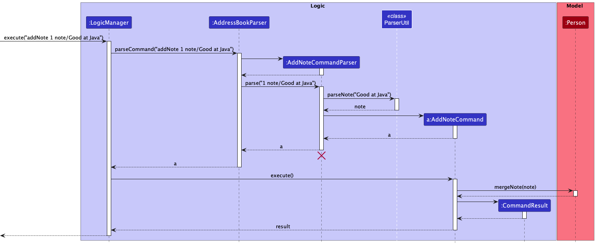
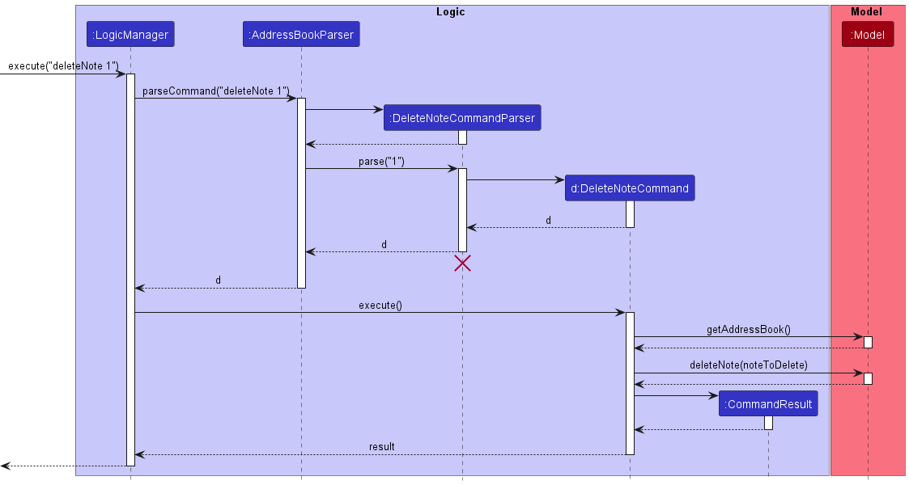

* Table of Contents
  {:toc}

--------------------------------------------------------------------------------------------------------------------

## **Acknowledgements**

* {list here sources of all reused/adapted ideas, code, documentation, and third-party libraries -- include links to the original source as well}

--------------------------------------------------------------------------------------------------------------------

## **Setting up, getting started**

Refer to the guide [_Setting up and getting started_](SettingUp.md).

--------------------------------------------------------------------------------------------------------------------

## **Design**

:bulb: **Tip:** The `.puml` files used to create diagrams in this document can be found in the [diagrams](https://github.com/se-edu/addressbook-level3/tree/master/docs/diagrams/) folder. Refer to the [_PlantUML Tutorial_ at se-edu/guides](https://se-education.org/guides/tutorials/plantUml.html) to learn how to create and edit diagrams.

### Architecture

The ***Architecture Diagram*** given above explains the high-level design of the App.

Given below is a quick overview of main components and how they interact with each other.

**Main components of the architecture**

**`Main`** has two classes called [`Main`](https://github.com/se-edu/addressbook-level3/tree/master/src/main/java/seedu/address/Main.java) and [`MainApp`](https://github.com/se-edu/addressbook-level3/tree/master/src/main/java/seedu/address/MainApp.java). It is responsible for,
* At app launch: Initializes the components in the correct sequence, and connects them up with each other.
* At shut down: Shuts down the components and invokes cleanup methods where necessary.

[**`Commons`**](#common-classes) represents a collection of classes used by multiple other components.

The rest of the App consists of four components.

* [**`UI`**](#ui-component): The UI of the App.
* [**`Logic`**](#logic-component): The command executor.
* [**`Model`**](#model-component): Holds the data of the App in memory.
* [**`Storage`**](#storage-component): Reads data from, and writes data to, the hard disk.

**How the architecture components interact with each other**

The *Sequence Diagram* below shows how the components interact with each other for the scenario where the user issues the command `delete 1`.

Each of the four main components (also shown in the diagram above),

* defines its *API* in an `interface` with the same name as the Component.
* implements its functionality using a concrete `{Component Name}Manager` class (which follows the corresponding API `interface` mentioned in the previous point.

For example, the `Logic` component defines its API in the `Logic.java` interface and implements its functionality using the `LogicManager.java` class which follows the `Logic` interface. Other components interact with a given component through its interface rather than the concrete class (reason: to prevent outside component's being coupled to the implementation of a component), as illustrated in the (partial) class diagram below.

The sections below give more details of each component.

### UI component

The **API** of this component is specified in [`Ui.java`](https://github.com/se-edu/addressbook-level3/tree/master/src/main/java/seedu/address/ui/Ui.java)

The UI consists of a `MainWindow` that is made up of parts e.g.`CommandBox`, `ResultDisplay`, `PersonListPanel`, `NoteListPanel`, `PersonInspectPanel` `StatusBarFooter` etc. All these, including the `MainWindow`, inherit from the abstract `UiPart` class which captures the commonalities between classes that represent parts of the visible GUI.

The `UI` component uses the JavaFx UI framework. The layout of these UI parts are defined in matching `.fxml` files that are in the `src/main/resources/view` folder. For example, the layout of the [`MainWindow`](https://github.com/se-edu/addressbook-level3/tree/master/src/main/java/seedu/address/ui/MainWindow.java) is specified in [`MainWindow.fxml`](https://github.com/se-edu/addressbook-level3/tree/master/src/main/resources/view/MainWindow.fxml)

The `UI` component is separate from the state of the `Model` and changes to the `UI` will not affect the `Model`, but changes to the `Model`'s state will affect the information displayed by the `UI` elements.

Similarly, changes to the visual aspects of `UI`, such as current person viewed, or the filtered state of the lists, will not be saved to file as they do not affect the `Model`'s data.

The `UI` component,

* executes user commands using the `Logic` component.
* listens for changes to `Model` data so that the UI can be updated with the modified data.
* keeps a reference to the `Logic` component, because the `UI` relies on the `Logic` to execute commands.
* depends on some classes in the `Model` component, as it displays `Person` and `Notes` object residing in the `Model`.

This component may be controlled by commands through the `CommandResult` class, which specifies an optional `UiState` that the program should be in at the end of the command execution. This is parsed finally in the `MainWindow::executeCommand` which invokes necessary changes to the UI.

#### UI Elements

1. **Command Box**: A text box that allows users to enter in commands for later execution.
2. **ResultDisplay**: A readonly text box that serves as a console to give feedback from the `Logic` component to the user, such as error messages or logs.
3. **Person List**: A horizontal sliding list that displays all persons in the SectresBook. This list can be filtered to display only relevant people according to some predicate.
4. **Note List**: A vertical sliding list that displays all notes in the SectresBook. This list can be filtered to display only relevant notes according to some predicate.
5. **Person Inspect Panel**: This Panel displays data of a person, using the UI command `inspect`.

### Logic component

**API** : [`Logic.java`](https://github.com/se-edu/addressbook-level3/tree/master/src/main/java/seedu/address/logic/Logic.java)

Here's a (partial) class diagram of the `Logic` component:

How the `Logic` component works:
1. When `Logic` is called upon to execute a command, it uses the `AddressBookParser` class to parse the user command.
1. This results in a `Command` object (more precisely, an object of one of its subclasses e.g., `AddCommand`) which is executed by the `LogicManager`.
1. The command can communicate with the `Model` when it is executed (e.g. to add a person).
1. The result of the command execution is encapsulated as a `CommandResult` object which is returned back from `Logic`.

The Sequence Diagram below illustrates the interactions within the `Logic` component for the `execute("delete 1")` API call.

:information_source: **Note:** The lifeline for `DeleteCommandParser` should end at the destroy-marker (X) but due to a limitation of PlantUML, the lifeline reaches the end of diagram.

Commands such as Edit and Delete feature the ability to delete by name, which utilises the Find feature. Illustrated here is how `execute("edit Lynette")` interacts with the Logic component, using a sequence diagram

Here are the other classes in `Logic` (omitted from the class diagram above) that are used for parsing a user command:

How the parsing works:
* When called upon to parse a user command, the `AddressBookParser` class creates an `XYZCommandParser` (`XYZ` is a placeholder for the specific command name e.g., `AddCommandParser`) which uses the other classes shown above to parse the user command and create a `XYZCommand` object (e.g., `AddCommand`) which the `AddressBookParser` returns back as a `Command` object.
* All `XYZCommandParser` classes (e.g., `AddCommandParser`, `DeleteCommandParser`, ...) inherit from the `Parser` interface so that they can be treated similarly where possible e.g, during testing.

### Model component
**API** : [`Model.java`](https://github.com/se-edu/addressbook-level3/tree/master/src/main/java/seedu/address/model/Model.java)

The `Model` component,

* stores the address book data i.e., all `Person` objects (which are contained in a `UniquePersonList` object) and all `Note` objects (contained in a `NoteBook` object)
* stores the currently 'selected' `Person` objects (e.g., results of a search query) as a separate _filtered_ list which is exposed to outsiders as an unmodifiable `ObservableList<Person>` that can be 'observed' e.g. the UI can be bound to this list so that the UI automatically updates when the data in the list change.
* stores a `UserPref` object that represents the user’s preferences. This is exposed to the outside as a `ReadOnlyUserPref` objects.
* does not depend on any of the other three components (as the `Model` represents data entities of the domain, they should make sense on their own without depending on other components)

### Storage component

**API** : [`Storage.java`](https://github.com/se-edu/addressbook-level3/tree/master/src/main/java/seedu/address/storage/Storage.java)

The `Storage` component,
* can save both address book data and user preference data in json format, and read them back into corresponding objects.
* inherits from both `AddressBookStorage` and `UserPrefStorage`, which means it can be treated as either one (if only the functionality of only one is needed).
* depends on some classes in the `Model` component (because the `Storage` component's job is to save/retrieve objects that belong to the `Model`)

### Common classes

Classes used by multiple components are in the `seedu.addressbook.commons` package.

--------------------------------------------------------------------------------------------------------------------

## Properties Objects

### Properties of Person Objects

This section explains the components of a person object and how they can be used to track information.

A person object contains editable properties:
1. Name
    - Describes the full name of the person
2. Phone
    - Records the mobile phone contact number of the person
3. Email
    - Records the email address of the person
4. Address
    - Records the home address of the person
5. Tag
    - Optionally tags the person with a variable number of tags for easy reference within the SectresBook.

And a non-editable properties:
1. Loan
    - Tracks the current loan amount of the person. A positive number means that the person currently owes money to the club, a negative number means that money is due to be paid to the person.
2. List of Loan Histories
    - Tracks the transactional history of incoming and outgoing loans. Each Loan History comprises a Loan and a Record.

During instantiation, a person object can be declared with all fields, but during editing, Loan must use a specialised command `editLoan` to transform its data.

## Properties of Note Objects

This section explains the components of a note object and how they can be used to track information.

A note object contains editable properties:
1. Title
    - The title of the note, which can be searched by.
2. Content
    - The description of the note.
3. Tags
    - Optional tags that can be assigned to the notes, after-which every person with that tag will be associated with the notes.

During instantiation, a note object can be declared with any of these properties.

-------------------

## **Implementation**

This section describes some noteworthy details on how certain features are implemented.

## Person Features

### Edit Feature

#### Implementation

The Edit Person feature is facilitated by the `EditCommand` which utilises the `FindCommand`. It allows users to edit any editable field of a person given the index of the person, or the name of the person.

If given a name that does not correspond to any person in the SectresBook, the edit features performs the same operations as the Find Command.

Given below is an example usage scenario and how the edit mechanism behaves at each step.

Step 1. The user enters the edit command, with either the index or the person's name.

Step 2a If an index is entered, the `EditCommandParser` carries this index to the `EditCommand`, which retrieves the `Person` to edit by getting the `Model`'s current `FilteredList<Person>` and retrieving by index.

Step 2b. If a non-number is entered, the `EditCommandParser` invokes the `FindCommandParser#parse` method and executes it at the same time with `FindCommand#execute`. The `FilteredList<Person>` is then checked to ensure that there is exactly one person that corresponds with the search term. Otherwise, the method short-circuits with ambiguity errors (more than 1 person) or invalid person errors (no persons at all). If successful, `EditCommandParser` returns a new `EditCommand` with a one-based-index of 1.

- Example of ambiguity error message:
> There is more than 1 person with the name [NAME]

- Example of invalid name error message:
> There is nobody with the name [NAME]

Step 3. `EditCommand#execute` is called by the `LogicManager`. The person to edit is retrieved by the index given and a new edited person is created by copying over non-transformed fields and replacing the transformed field.

Step 4. The `editedPerson` is then set to replace the previous state of the `Person` object in the `Model` with `Model#setPerson`.

The following sequence diagram shows how the `edit` feature works.

### Delete Person

#### Implementation

The delete person feature is facilitated by `DeleteCommand`. It allows users to delete a person from the SectresBook that match the full
First name or Last name of the person.

Given below is the example usage scenario and how the delete feature behaves at each step.

Step 1. The user executes 'delete David' command to delete a person with the name 'David' from the SectresBook.

Step 2. The `DeleteCommandParser` creates a `FindCommand` with 'David'.

Step 3. The `DeleteCommand` is executed with Index 1.

The following sequence diagram shows how the delete command works:

:information_source: **Note:** The lifeline for `DeleteCommandParser` should end at the destroy marker (X) 
but due to a limitation of PlantUML, the lifeline reaches the end of diagram. 

#### Design Considerations:

**Aspect: How delete executes:**

* **Alternative 1 (Currect choice):** Deletes person based on complete first/last name from input.
  * Pros: Less strictness of input from the user to delete a person.
  * Cons: User may accidentally delete a person not meant to be deleted.
* **Alternative 2:** Delete a person based on complete name i.e. first and last name required in input.
  * Pros: Stricter input requirement, ensuring that persons are not accidentally deleted.
  * Cons: Longer input required for the same output.

### Find Person

#### Implementation

The Find Person feature is facilitated by 'FindCommand'. It allows users to find all Persons with names that are matching or phone number starting with any of the keywords.

Given below is an example usage scenario and how the find feature behaves at each step.

Step 1. The user executes 'find David' command to find all Persons in the address book that includes the name `David`.

Step 2. A `FindCommand` is constructed with a `NameContainsKeywordPredicate` which checks through the list of persons in the address book and only shows those with their first/last name matching `David`.

Step 3. The `FindCommand` is executed and the `NameContainsKeywordsPredicate` is used to update the filtered person list.

The following sequence diagram shows how the find command works:

:information_source: **Note:** The lifeline for `FindCommandParser` and `FindCommand` should end at the destroy marker (X) but due to a limitation of PlantUML, the lifeline reaches the end of diagram.

#### Design considerations:

**Aspect: How find executes:**

* **Alternative 1 (current choice):** Chooses person based on the whole first/last name matching the keyword.
    * Pros: More specific Persons list after the find command.
    * Cons: User needs to know the first/last name of the person they are trying to find.

* **Alternative 2:** Chooses person if name contains the keyword.
    * Pros: Easier to find person.
    * Cons: Persons list may show other persons that are not desired by the user.

### Find Person by Tag feature

#### Implementation

The find Person by Tag feature (called `findTag`) is facilitated by `FindTagCommand`. It allows users to find all Persons with the given Tags.

Given below is an example usage scenario and how the findTag feature behaves at each step.

Step 1. The user executes `findTag Finance` command to find all Persons in the address book with the tag `Finance`.

Step 2. A `FindTagCommand` is constructed with a `TagsContainsKeywordsPredicate` which will check through the list of persons in the address book and only show those with the tag `Finance`.

Step 3. The `FindTagCommand` is executed and the `TagsContainsKeywordsPredicate` is passed to model to update the Person List to only show Persons with the tag `Finance`.

The following sequence diagram shows how the findTag command works:

:information_source: **Note:** The lifeline for `FindTagCommandParser` and `FindTagCommand` should end at the destroy marker (X) but due to a limitation of PlantUML, the lifeline reaches the end of diagram.

#### Design considerations:

**Aspect: How findTag executes:**

* **Alternative 1 (current choice):** Goes through all Persons to check for Tag.
    * Pros: Easy to implement (Similar to current find command).
    * Cons: May have performance issues in terms of having to do many more steps.

* **Alternative 2:** Goto searched Tags and get the Persons that each Tag points to.
    * Pros: Will use fewer steps (Go directly to the Tags rather than looking through all Persons).
    * Cons: Implementation would be more complicated.

## Notes Features

### addNote feature

#### Implementation

The addNote mechanism is facilitated by `AddNoteCommand`. It extends `Command` and overrides `Command#execute()` to implement the following operation:
- `AddNoteCommand#execute()` : adds the specified note with its associated title and content into the list of notes to be kept track of.

Given below is an example usage scenario and how the addNote mechanism behaves at each step.

Step 1. The user launches the application and wishes to keep track of a note with the following attributes :
1. Title : Club meeting
2. Content : 3rd October 9pm, brief everybody on upcoming events.

Step 2. The user executes `addNote title/Meeting content/3rd October 9pm`, which calls `LogicManager#execute()`. Subsequently, `AddressBookParser#parseCommand()` is called
which will create a `AddNoteCommandParser` object and call `AddNoteCommandParser#parse()`. This method will take the user's input and make sense of it to create a `Note` object.

Step 3. An `AddNoteCommand` will be created and `AddNoteCommand#execute()` will be called by `LogicManager#execute()`.

Step 4. `AddNoteCommand#execute()` will call the following method from `Model` :
- `addNote(toAdd)`

Step 5. `AddNoteCommand#execute()` will return a `CommandResult` object which will display the following message back to the user:
> New note added: Title: Meeting, Content: 3rd October 9pm

The following sequence diagram shows how the addNote operation works:

#### Design considerations

**Aspect: How Title and Content are represented:**

* **Alternative 1 (current choice):** Title and Content as separate objects.
    * Pros: Easy to validate Title/Content. (In the respective classes)
    * Cons: May have performance issues in terms of memory usage(Many objects might be created).

* **Alternative 2:** Title and Content as fields of Note
    * Pros: Will use less memory (Fewer objects created).
    * Cons: Harder to validate Title/Content. Better OOP(Object-oriented programming) design.

### deleteNote feature

#### Implementation

The deleteNote mechanism is facilitated by `DeleteNoteCommand`. It extends `Command` and overrides `Command#execute()` to implement the following operation:
- `DeleteNoteCommand#execute()` : deletes the note at the specified index from the note list.

Given below is an example usage scenario and how the addNote mechanism behaves at each step.

Step 1. The user launches the application and wishes to delete a note that no longer needs to be kept track of. The user lists the current notes:
1. Title: Meeting, Content: 3rd October 9pm
2. Title: Event, Content: Remind club members to attend.

The user has decided to delete note 1.

Step 2. The user executes `deleteNote 1`, which calls `LogicManager#execute()`. Subsequently, `AddressBookParser#parseCommand()` is called
which will create a `DeleteNoteCommandParser` object and call `DeleteNoteCommandParser#parse()`. This method will take the user's input and make sense of it to get the index of note to be deleted.

Step 3. A `DeleteNoteCommand` object will be created and `DeleteNoteCommand#execute()` will be called by `LogicManager#execute()`.

Step 4. `DeleteNoteCommand#execute()` will call the following method from `Model` :
- `getAddressBook()`
- `deleteNote(noteToDelete)`

Step 5. `DeleteNoteCommand#execute()` will return a `CommandResult` object which will display the following message back to the user:
> Deleted Note: Title: Meeting, Content: 3rd October 9pm

The following sequence diagram shows how the addNote operation works:

#### Design considerations

**Aspect: How the note to be deleted is specified:**

* **Alternative 1 (current choice):** Note is specified by index.
    * Pros: Easy to implement.
    * Cons: Would need to use listNotes command or gui to allow easy identification of index of note.

* **Alternative 2:** Note is specified by Title.
    * Pros: Would be more precise (Title of notes are unique).
    * Cons: Long command would be needed to delete a note with a long Title.

### editNote feature

#### Implementation

The editNote mechanism is facilitated by `EditNoteCommand` and utilises the `FindNoteCommand`. It extends `Command` and overrides `Command#execute()` to implement the following operation:
- `EditNoteCommand#execute()` : edits the note at the specified index (or with matching title) from the note list.

Given below is an example usage scenario and how the editNote mechanism behaves at each step.

Step 1. The user launches the application and wishes to edit a note's title with a new title. The user lists the current notes: 
1. Title: Meeting, Content: 3rd October 9pm
2. Title: Event, Content: Remind club members to attend.

The user has decided to edit the first note titled `Meeting` with a new title, `Club Meeting`.

Step 2a. If an index is entered (user executes `editNote 1 title/Club Meeting`), the `EditNoteCommandParser` carries this index to the `EditNoteCommand`, which retrieves the `Note` to edit by getting the `Model`'s current `FilteredList<Note>` and retrieving by index.

Step 2b. If a non-number is entered (user executes `editNote meeting title/Club Meeting`), `EditNoteCommandParser` calls `FindNoteCommandParser#parse()` and executes `FindNoteCommand#execute()` concurrently. 

`FilteredList<Note>` is then checked to ensure that exactly one note corresponds with the search term. 

Otherwise, the method short-circuits with ambiguity errors (more than 1 note) or invalid note errors (no notes at all). If successful, `EditNoteCommandParser` returns a new `EditNoteCommand` object.

- Example of ambiguity error message:
> There is more than 1 note with meeting in their title!
> 
> Please use a more unique specifier or use indices to edit.

- Example of invalid title error message:
> There are no notes with meeting in their titles in the list!

Step 3. `EditNoteCommand#execute()` will be called by `LogicManager#execute()`. The note to edit is retrieved by the index given and a new edited note is created by copying over non-transformed fields and replacing the transformed field.

Step 4. The `editedNote` is then set to replace the previous state of the `Note` object in the `Model` with `Model#setNote`.

The following sequence diagram shows how the `editNote` feature works.

The following activity diagram shows the workflow of `editNote` feature.

#### Design considerations

**Aspect: How the note to be edited is specified:**

* **Alternative 1 (current choice):** Note is specified by index or title.
    * Pros: Better convenience for users.
    * Cons: Would need to use findNote command for notes specified by title. (more dependencies)

* **Alternative 2:** Note is specified by Title.
    * Pros: Easy to implement
    * Cons: Not flexible for users.

## UI Features

### General UI Design and Mechanism

#### Implementation

During the creation of the new UI, a lot of the FXML structure and the relationships between containers of the UI had to be refactored.

The UI is divided into 2 major sections - one occupied by the `CommandBox` and another occupied by the `WindowAnchorPane`.

The `WindowAnchorPane` consists of an StackPane.
- The `ResultDisplay` is in the first layer
- The `PersonListPanel`, `InspectionPanel` and the `NotesListPanel` are in the second layer below.

The `ResultDisplay` is _click-through_ (does not capture any mouse clicks) and normally has an opacity of 0, so it is effectively hidden.

The `InspectionPanel` is another anchor pane divided into two left and right elements:
    - A basic information `HBox` on the left
    - A loan history list view display on the right

These two elements in the `InspectionPanel` will always maintain the same ratio, basic information to loan history list view, of 2:3.

When the user clicks the `CommandBox` or presses the `SPACE` key, this triggers an event on the `CommandBox` that invokes a transition to the `ResultDisplay` to show the display. As it is on the first layer, the `ResultDisplay` will partially cover the elements below it.

Note that the `ResultsDisplay` never reach full opacity, instead an opacity of 0.8 allows the elements below to be partially visible.

Here are the anchor points of the three major panes within the second layer of `WindowAnchorPane`:

- The `PersonListPanel` has a left anchor of `0`, top anchor of `0`, right anchor of `0.6` with respect to window width (starting from left) and bottom anchor of `0.45` with respect to window height (starting from top).
- The `InspectionPanel` has a left anchor of `0`, top anchor of `0.45`, right anchor of `0.6` with respect to window width (starting from left) and bottom anchor of `0` with respect to window height (starting from top).
- The `NotesListPanel` has a left anchor of `0.6`, top anchor of `0`, right anchor of `0` with respect to window width (starting from left) and bottom anchor of `0` with respect to window height (starting from top).

The arbitrary values above are actually boundaries shared by the three panels and may be manipulated to change the view of the three major elements together. We may imagine the `PersonListPanel` to be glued to the `NotesListPanel` on its right and the `InspectionPanel` below, likewise for the other two elements. This allows the ratios to be adjusted together by simply change the vertical anchor or horizontal anchors.

The Observer Pattern is prevalent throughout the UI design in order to update other components in response to any change to the UI. One such example is the [`inspect` command](#inspect-feature).

This activity diagram details how interactions with the UI is controlled

#### Design Considerations

As the main window of the application is resizable, the ratio of the anchors maintains the aspect of each panel with respect to the window size (unlike constant values which will not change according to window size).

The resizing is handled through the _Observer Pattern_, thankfully existing by default in JavaFX, which updates the proportions of the components upon any change to the height or width of the window.

The main problem came from estimating the correct current space allocated by the window size.

As the three main components are within the `WindowAnchorPane`, and the `WindowAnchorPane` shares its space with an unnamed `StackPane` described by the structure above, this meant that the `WindowAnchorPane` has less space than the actual window size. To make things worse, JavaFX overestimates the actual scene proportions in relation to the window size.

A padding of around 200px was used to help `WindowAnchorPane` displace it's top height to the true position it is at and a bottom padding of 20px was added to give some room from the bottom of the window. The height and width passed into function resizing the anchor panes must always be adjusted according the scene size and the offsets.

A visual defect exists when the screen size exceeds 1080p, as the Inspection Panel is no longer able to stay attached to the anchor point at the bottom of the screen. This defect worsens as the window gets taller.

### Inspect Feature

#### Implementation

The inspect command is a UI-Centric command that controls which person's details are currently shown in the inspection panel.

This is functionally similar to clicking on a person's card, which also updates the information in the inspection panel.

This features uses an Observer on the `SelectionModel` of the `ListView` of persons, updating the `InspectionPanel` whenever a new person is selected.

Step 1. The user executes `'inspect David'` command to view the details of David.

Step 2. An `InspectCommandParser` is parsed with `David`.

Step 3. The `InspectCommand` is created containing a keyword `David`.

Step 4. The `InspectCommand` is executed and a `CommandResult` is created with the `UiState` `inspect` and arguments `David`.

Step 5. The `MainWindow` is receives the `CommandResult` and reads the `UiState` part of the result. This directs it to update the inspect panel.

Step 6. The Person List is retrieved from the `MainWindow` and its selection model is accessed. From here, if the given argument is a number, we will index the person through the order in the list. Otherwise, we will search through the entire list until first person matching the keywords is returned.

Step 7. The Inspection Panel is retrieved from the main window and has its properties updated from the person's information that was returned.

The following sequence diagram shows how the find command works:

:information_source: **Note:** The lifeline for `InspectCommandSequence` and `InspectCommand` should end at the destroy marker (X) but due to a limitation of PlantUML, the lifeline reaches the end of diagram.

#### Design considerations:

**Aspect: How find to design a UI command**

Unlike other command, this command does not mutate any underlying data. One challenge is that the execution flow is different from other commands which mutate data, making the implementation less direct.

We had to find a good insertion point where the information carried from the user input could be used in the program without the need for major refactoring. We realised that the user's input is first taken in through the `MainWindow` class, and through following the function calls, would be used in `MainWindow::executeCommand`. So the inspection operation is effectively added at the end of the executeCommand just before it terminates.

The procedures for `handleExit` and `handleHelp` were changed by refactoring `CommandResult` to carry an ideal state that the UI is expected to be in by the end of the execution. A switch statement was added to the bottom of the `executeCommand` function, much like how the normal commands are parsed, to deal with UI-Centric commands like `help`, `exit` and `inspect`.

### Showing and Hiding the Notes Panel Feature

#### Implementation

Here are the anchor points of the three major panes within the `WindowAnchorPane`:

- The `PersonListPanel` has a left anchor of `0`, top anchor of `0`, right anchor of `0.6` with respect to window width (starting from left) and bottom anchor of `0.45` with respect to window height (starting from top).
- The `InspectionPanel` has a left anchor of `0`, top anchor of `0.45`, right anchor of `0.6` with respect to window width (starting from left) and bottom anchor of `0` with respect to window height (starting from top).
- The `NotesListPanel` has a left anchor of `0.6`, top anchor of `0`, right anchor of `0` with respect to window width (starting from left) and bottom anchor of `0` with respect to window height (starting from top).

Notice that the `PersonListPanel` and `InspectionPanel` share a boundary of the ratio `0.45` with respect to the window height and the both of them share a boundary of `0.6` with respect to screen width with the `NotesListPanel`.

The command `hideNotes` is effectively accomplished by interpolating the ratios smoothly over time to create a sliding effect. To maintain the aspect ratio of the notes panel and prevent deformities, the right anchor interpolates from 0 to `0.6 - 1 = -0.4`, as the left anchor interpolates from `0.6` to `1`.

This maintains the constant size of `x0.4` with respect to window size during the transition.

A fading transition is applied across the same time to smoothly reduce the opacity of the panel.

The time interval set for this transition is `0.3` seconds.

The `showNotes` implementation is exactly the inverse of the `hideNotes` implementation across time.

#### Design considerations:

**Aspect: Challenges related to resizing**

Because hiding the notes panel will also pull the inspection panel longer, and that the inspection panel is divided into two parts itself, the `InspectionPanel` is also further another anchor pane that maintains the ratio of the width between the basic information display and the loans history property.

This concept was only implemented after the implementation of hideNotes, where visual inconsistencoes will start appearing due to disobeying the original ratio.

The padding of the `InspectionPanel` also causes an issue if the right anchor of the pane is not manipulated with the left anchor, as the padding will snap the left anchor to the right of the right anchor. This causes the `InspectionPanel` to be pulled through the entire width of the `NotesListPanel` cause the entire `WindowAnchorPane` to overflow its allocated width. The consideration to slide the right anchor at a constant difference with respect to the left anchor was introduced to combat this issue.

### \[Proposed\] Undo/redo feature

#### Proposed Implementation

The proposed undo/redo mechanism is facilitated by `VersionedAddressBook`. It extends `AddressBook` with an undo/redo history, stored internally as an `addressBookStateList` and `currentStatePointer`. Additionally, it implements the following operations:

* `VersionedAddressBook#commit()` — Saves the current address book state in its history.
* `VersionedAddressBook#undo()` — Restores the previous address book state from its history.
* `VersionedAddressBook#redo()` — Restores a previously undone address book state from its history.

These operations are exposed in the `Model` interface as `Model#commitAddressBook()`, `Model#undoAddressBook()` and `Model#redoAddressBook()` respectively.

Given below is an example usage scenario and how the undo/redo mechanism behaves at each step.

Step 1. The user launches the application for the first time. The `VersionedAddressBook` will be initialized with the initial address book state, and the `currentStatePointer` pointing to that single address book state.

Step 2. The user executes `delete 5` command to delete the 5th person in the address book. The `delete` command calls `Model#commitAddressBook()`, causing the modified state of the address book after the `delete 5` command executes to be saved in the `addressBookStateList`, and the `currentStatePointer` is shifted to the newly inserted address book state.

Step 3. The user executes `add name/David …​` to add a new person. The `add` command also calls `Model#commitAddressBook()`, causing another modified address book state to be saved into the `addressBookStateList`.

:information_source: **Note:** If a command fails its execution, it will not call `Model#commitAddressBook()`, so the address book state will not be saved into the `addressBookStateList`.

Step 4. The user now decides that adding the person was a mistake, and decides to undo that action by executing the `undo` command. The `undo` command will call `Model#undoAddressBook()`, which will shift the `currentStatePointer` once to the left, pointing it to the previous address book state, and restores the address book to that state.

:information_source: **Note:** If the `currentStatePointer` is at index 0, pointing to the initial AddressBook state, then there are no previous AddressBook states to restore. The `undo` command uses `Model#canUndoAddressBook()` to check if this is the case. If so, it will return an error to the user rather
than attempting to perform the undo.

The following sequence diagram shows how the undo operation works:

:information_source: **Note:** The lifeline for `UndoCommand` should end at the destroy marker (X) but due to a limitation of PlantUML, the lifeline reaches the end of diagram.

The `redo` command does the opposite — it calls `Model#redoAddressBook()`, which shifts the `currentStatePointer` once to the right, pointing to the previously undone state, and restores the address book to that state.

:information_source: **Note:** If the `currentStatePointer` is at index `addressBookStateList.size() - 1`, pointing to the latest address book state, then there are no undone AddressBook states to restore. The `redo` command uses `Model#canRedoAddressBook()` to check if this is the case. If so, it will return an error to the user rather than attempting to perform the redo.

Step 5. The user then decides to execute the command `list`. Commands that do not modify the address book, such as `list`, will usually not call `Model#commitAddressBook()`, `Model#undoAddressBook()` or `Model#redoAddressBook()`. Thus, the `addressBookStateList` remains unchanged.

Step 6. The user executes `clear`, which calls `Model#commitAddressBook()`. Since the `currentStatePointer` is not pointing at the end of the `addressBookStateList`, all address book states after the `currentStatePointer` will be purged. Reason: It no longer makes sense to redo the `add name/David …​` command. This is the behavior that most modern desktop applications follow.

The following activity diagram summarizes what happens when a user executes a new command:

#### Design considerations:

**Aspect: How undo & redo executes:**

* **Alternative 1 (current choice):** Saves the entire address book.
    * Pros: Easy to implement.
    * Cons: May have performance issues in terms of memory usage.

* **Alternative 2:** Individual command knows how to undo/redo by
  itself.
    * Pros: Will use less memory (e.g. for `delete`, just save the person being deleted).
    * Cons: We must ensure that the implementation of each individual command are correct.

_{more aspects and alternatives to be added}_

### \[Proposed\] Data archiving

_{Explain here how the data archiving feature will be implemented}_

--------------------------------------------------------------------------------------------------------------------

## **Documentation, logging, testing, configuration, dev-ops**

* [Documentation guide](Documentation.md)
* [Testing guide](Testing.md)
* [Logging guide](Logging.md)
* [Configuration guide](Configuration.md)
* [DevOps guide](DevOps.md)

--------------------------------------------------------------------------------------------------------------------

## **Appendix: Requirements**

### Product scope

**Target user profile**:

* is acting as a secretary or a treasurer of a club with a lot of people
* has a need for a convenient way to organise paperwork and general information about the club
* has a need to manage a significant number of contacts
* has a requirement to keep notes and tabs on people and projects
* prefer desktop apps over other types
* can type fast
* prefers typing to mouse interactions
* is reasonably comfortable using CLI apps

**Value proposition**: manage club members and track notes faster than a typical mouse/GUI driven app or by pen and paper

### User stories

Priorities: High (must have) - `* * *`, Medium (nice to have) - `* *`, Low (unlikely to have) - `*`

| Priority | As a …​      | I want to …​                                             | So that I can…​                                                        |
| -------- |--------------|----------------------------------------------------------|------------------------------------------------------------------------|
| `* * *`  | secretary    | add club members’ information into the address book      | keep track of their contact information.                               |
| `* * *`  | secretary    | edit a club member’s information                         | stay updated with them if their contact information changes.           |
| `* * *`  | secretary    | delete a club member’s information from the address book | stop keeping track of them when they leave the club.                   |
| `* * *`  | user         | search for a person by their name or contact number      | locate details of persons without having to go through the entire list |
| `* *`    | secretary    | search contacts according to a specific tag              | easily  contact people in a whole group                                |
| `*`      | user         | maintain a set of tasks to be done                       | keep track of things to be done.                                       |

*{More to be added}*

### Use cases

(For all use cases below, the **System** is the `SectresBook` and the **Actor** is the `user`, unless specified otherwise)

**Use case: Add a person**

**MSS**
1. User requests to add a person.
2. SectresBook adds the person to the list of persons.

   Use case ends.

**Extensions**
* 1a. The given person already exists.
    * 1a1. SectresBook shows an error message.

      Use case ends.
* 1b. Necessary fields are incomplete/empty.
    * 1b1. Sectresbook shows an error message.

      Use case ends.

**Use case: Update a person**

**MSS**
1. User requests to list persons.
2. SectresBook shows a list of persons.
3. User requests to update a specific person in the list.
4. SectresBook updates information of the person.

   Use case ends.

**Extensions**
* 2a. The list is empty.

  Use case ends.
* 3a. The given index is invalid.
    * 3a1. SectresBook shows an error message.

      Use case resumes at step 2.
* 3b. The command line arguments are invalid.
    * 3b1. SectresBook shows an error message.

      Use case resumes at step 2.

**Use case: Delete a person**

**MSS**

1.  User requests to list persons.
2.  SectresBook shows a list of persons.
3.  User requests to delete a specific person in the list.
4.  SectresBook deletes the person.

    Use case ends.

**Extensions**

* 2a. The list is empty.

  Use case ends.

* 3a. The given index is invalid.

    * 3a1. SectresBook shows an error message.

      Use case resumes at step 2.

**Use case: Find a person**

**MSS**
1. User request to find using keyword.
2. SectressBook shows a list of persons matching keyword.

   Use case ends.

**Use case: Display list of persons**

**MSS**
1. User requests to list persons.
2. SectresBook displays the list of persons stored.

   Use case ends.

*{More to be added}*

### Non-Functional Requirements

1. Should work on any _mainstream OS_ as long as it has Java `11` or above installed.
2. Should be able to hold up to 1000 persons without a noticeable sluggishness in performance for typical usage.
3. A user with above average typing speed for regular English text (i.e. not code, not system admin commands) should be able to accomplish most of the tasks faster using commands than using the mouse.
4. Should not require internet connection, all operations are performed locally.
5. Should not consume a lot of battery to keep it running in the background

### Glossary

* **Mainstream OS**: Windows, Linux, Unix, OS-X
* **Private contact detail**: A contact detail that is not meant to be shared with others
* **Note**: A segment of text that describes a task to be done, coupled with tags that reference people in the SectresBook who are associated with the given task.
* **Secretary**: A person acting as overseers for the administrative functions of a club.

--------------------------------------------------------------------------------------------------------------------

## **Appendix: Instructions for manual testing**

Given below are instructions to test the app manually.

:information_source: **Note:** These instructions only provide a starting point for testers to work on;
testers are expected to do more *exploratory* testing.

### Launch and shutdown

1. Initial launch

    1. Download the jar file and copy into an empty folder

    1. Double-click the jar file Expected: Shows the GUI with a set of sample contacts. The window size may not be optimum.

1. Saving window preferences

    1. Resize the window to an optimum size. Move the window to a different location. Close the window.

    1. Re-launch the app by double-clicking the jar file. 
       Expected: The most recent window size and location is retained.

1. _{ more test cases …​ }_

### Deleting a person

1. Deleting a person while all persons are being shown

    1. Prerequisites: List all persons using the `list` command. Multiple persons in the list.

    1. Test case: `delete 1` 
       Expected: First contact is deleted from the list. Details of the deleted contact shown in the status message. Timestamp in the status bar is updated.

    1. Test case: `delete 0` 
       Expected: No person is deleted. Error details shown in the status message. Status bar remains the same.

    1. Other incorrect delete commands to try: `delete`, `delete x`, `...` (where x is larger than the list size) 
       Expected: Similar to previous.

1. _{ more test cases …​ }_

### Saving data

1. Dealing with missing/corrupted data files

    1. _{explain how to simulate a missing/corrupted file, and the expected behavior}_

1. _{ more test cases …​ }_
