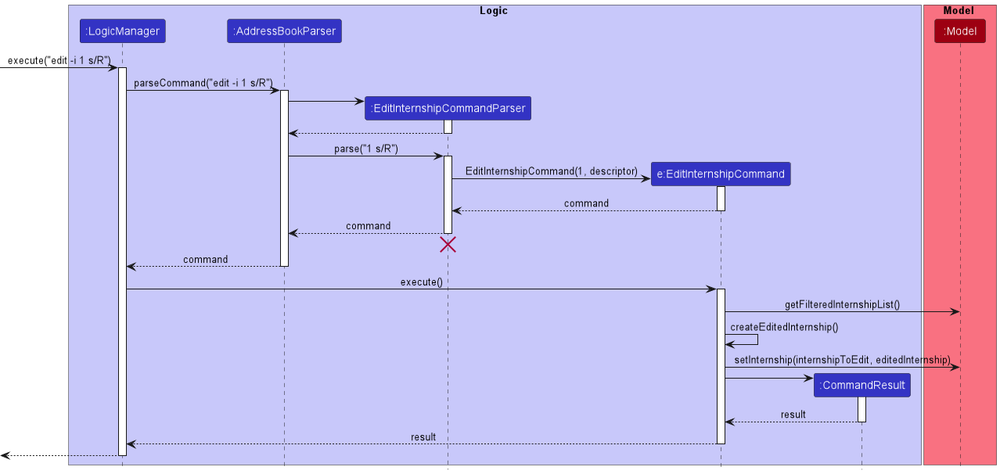
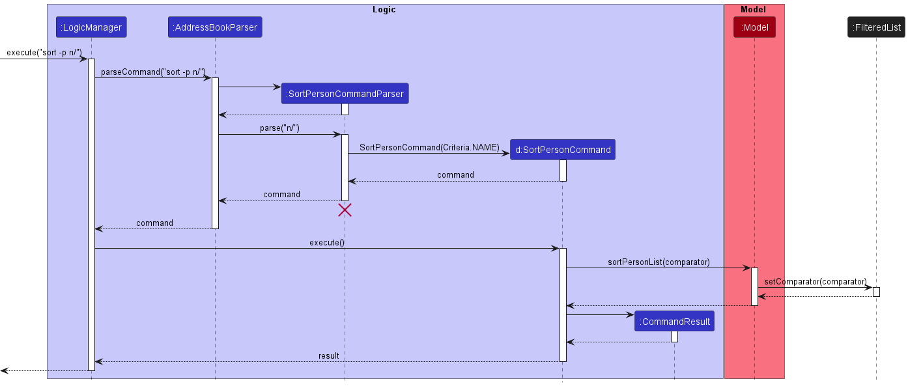
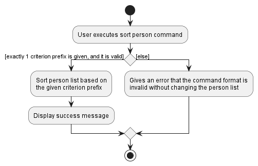
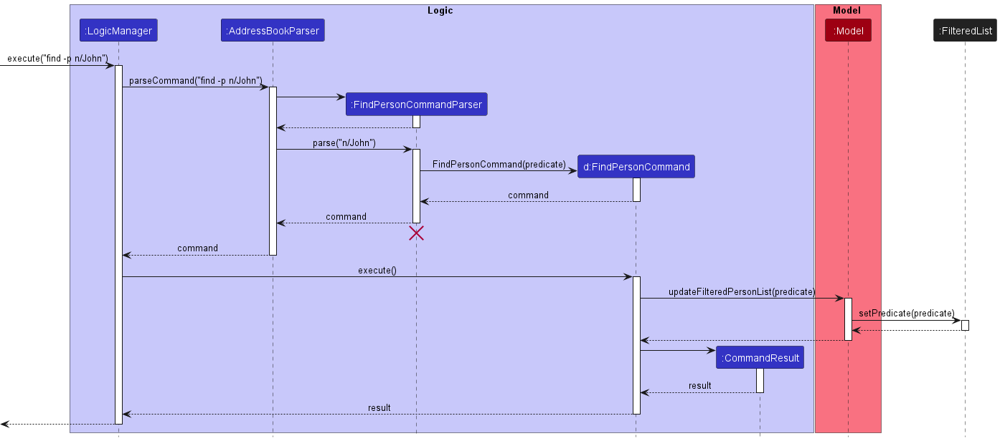

* Table of Contents
{:toc}

--------------------------------------------------------------------------------------------------------------------

## **Acknowledgements**

This project is based on the [AddressBook Level-3](https://github.com/nus-cs2103-AY2223S1/tp) project created by
the [SE-EDU initiative](https://se-education.org).

Libraries used:

* [JavaFX](https://openjfx.io/)

--------------------------------------------------------------------------------------------------------------------

## **Setting up, getting started**

Refer to the guide [_Setting up and getting started_](SettingUp.md).

--------------------------------------------------------------------------------------------------------------------

## **Design**

:bulb: **Tip:** The `.puml` files used to create diagrams in this document can be found in the [diagrams](https://github.com/AY2223S1-CS2103T-F11-1/tp/tree/master/docs/diagrams/) folder. Refer to the [_PlantUML Tutorial_ at se-edu/guides](https://se-education.org/guides/tutorials/plantUml.html) to learn how to create and edit diagrams.

### Architecture

The ***Architecture Diagram*** given above explains the high-level design of the App.

Given below is a quick overview of main components and how they interact with each other.

**Main components of the architecture**

**`Main`** has two classes called [`Main`](https://github.com/AY2223S1-CS2103T-F11-1/tp/tree/master/src/main/java/seedu/address/Main.java) and [`MainApp`](https://github.com/AY2223S1-CS2103T-F11-1/tp/tree/master/src/main/java/seedu/address/MainApp.java). It is responsible for,
* At app launch: Initializes the components in the correct sequence, and connects them up with each other.
* At shut down: Shuts down the components and invokes cleanup methods where necessary.

[**`Commons`**](#common-classes) represents a collection of classes used by multiple other components.

The rest of the App consists of four components.

* [**`UI`**](#ui-component): The UI of the App.
* [**`Logic`**](#logic-component): The command executor.
* [**`Model`**](#model-component): Holds the data of the App in memory.
* [**`Storage`**](#storage-component): Reads data from, and writes data to, the hard disk.

**How the architecture components interact with each other**

The *Sequence Diagram* below shows how the components interact with each other for the scenario where the user issues the command `delete 1`.

Each of the four main components (also shown in the diagram above),

* defines its *API* in an `interface` with the same name as the Component.
* implements its functionality using a concrete `{Component Name}Manager` class (which follows the corresponding API `interface` mentioned in the previous point.

For example, the `Logic` component defines its API in the `Logic.java` interface and implements its functionality using the `LogicManager.java` class which follows the `Logic` interface. Other components interact with a given component through its interface rather than the concrete class (reason: to prevent outside component's being coupled to the implementation of a component), as illustrated in the (partial) class diagram below.

The sections below give more details of each component.

### UI component

The **API** of this component is specified in [`Ui.java`](https://github.com/AY2223S1-CS2103T-F11-1/tp/tree/master/src/main/java/seedu/address/ui/Ui.java)

The UI consists of a `MainWindow` that is made up of parts e.g.`CommandBox`, `ResultDisplay`, `PersonListPanel`, `InternshipListPanel`, `StatusBarFooter` etc. All these, including the `MainWindow`, inherit from the abstract `UiPart` class which captures the commonalities between classes that represent parts of the visible GUI.

The `UI` component uses the JavaFx UI framework. The layout of these UI parts are defined in matching `.fxml` files that are in the `src/main/resources/view` folder. For example, the layout of the [`MainWindow`](https://github.com/AY2223S1-CS2103T-F11-1/tp/tree/master/src/main/java/seedu/address/ui/MainWindow.java) is specified in [`MainWindow.fxml`](https://github.com/AY2223S1-CS2103T-F11-1/tp/tree/master/src/main/resources/view/MainWindow.fxml)

The `UI` component,

* executes user commands using the `Logic` component.
* listens for changes to `Model` data so that the UI can be updated with the modified data.
* keeps a reference to the `Logic` component, because the `UI` relies on the `Logic` to execute commands.
* depends on some classes in the `Model` component, as it displays `Person` object residing in the `Model`.

### Logic component

The **API** of this component is specified in [`Logic.java`](https://github.com/AY2223S1-CS2103T-F11-1/tp/tree/master/src/main/java/seedu/address/logic/Logic.java)

Here's a (partial) class diagram of the `Logic` component:

How the `Logic` component works:
1. When `Logic` is called upon to execute a command, it uses the `AddressBookParser` class to parse the user command.
1. This results in a `Command` object (more precisely, an object of one of its subclasses e.g., `DeletePersonCommand`) which is executed by the `LogicManager`.
1. The command can communicate with the `Model` when it is executed (e.g. to delete a person).
1. The result of the command execution is encapsulated as a `CommandResult` object which is returned back from `Logic`.

The Sequence Diagram below illustrates the interactions within the `Logic` component for the `execute("delete -p 1")` API call.

:information_source: **Note:** The lifeline for `DeleteCommandParser` should end at the destroy marker (X) but due to a limitation of PlantUML, the lifeline reaches the end of diagram.

Here are the other classes in `Logic` (omitted from the class diagram above) that are used for parsing a user command:

How the parsing works:
* When called upon to parse a user command, the `AddressBookParser` class creates an `XYZCommandParser` (`XYZ` is a placeholder for the specific command name e.g., `AddPersonCommandParser`) which uses the other classes shown above to parse the user command and create a `XYZCommand` object (e.g., `AddPersonCommand`) which the `AddressBookParser` returns back as a `Command` object.
* All `XYZCommandParser` classes (e.g., `AddPersonCommandParser`, `DeletePersonCommandParser`, ...) inherit from the `Parser` interface so that they can be treated similarly where possible e.g, during testing.

### Model component
The **API** of this component is specified in [`Model.java`](https://github.com/AY2223S1-CS2103T-F11-1/tp/tree/master/src/main/java/seedu/address/model/Model.java)

The `Model` component,

* stores the address book data i.e., all `Person` objects (which are contained in a `UniquePersonList` object).
* stores the currently 'selected' `Person` objects (e.g., results of a search query) as a separate _filtered_ list which is exposed to outsiders as an unmodifiable `ObservableList<Person>` that can be 'observed' e.g. the UI can be bound to this list so that the UI automatically updates when the data in the list change.
* stores a `UserPref` object that represents the user’s preferences. This is exposed to the outside as a `ReadOnlyUserPref` objects.
* does not depend on any of the other three components (as the `Model` represents data entities of the domain, they should make sense on their own without depending on other components)

:information_source: **Note:** An alternative (arguably, a more OOP) model is given below. It has a `Tag` list in the `AddressBook`, which `Person` references. This allows `AddressBook` to only require one `Tag` object per unique tag, instead of each `Person` needing their own `Tag` objects. 

### Storage component

The **API** of this component is specified in [`Storage.java`](https://github.com/AY2223S1-CS2103T-F11-1/tp/tree/master/src/main/java/seedu/address/storage/Storage.java)

The `Storage` component,
* can save both address book data and user preference data in json format, and read them back into corresponding objects.
* inherits from both `AddressBookStorage` and `UserPrefStorage`, which means it can be treated as either one (if only the functionality of only one is needed).
* depends on some classes in the `Model` component (because the `Storage` component's job is to save/retrieve objects that belong to the `Model`)

### Common classes

Classes used by multiple components are in the `seedu.addressbook.commons` package.

--------------------------------------------------------------------------------------------------------------------

## **Implementation**

This section describes some noteworthy details on how certain features are implemented.

### Edit Internship

#### Implementation

Given below is an example usage scenario.

1. InterNUS shows a list of internships. The user edits the first internship in the list using the command `edit -i 1 s/R`.
2. The command is accepted by the `Logic` component, which passes it to the `AddressBookParser`.
3. The `AddressBookParser` creates the corresponding parser, `EditInternshipCommandParser` to parse the arguments `1 s/R`.
4. The parser stores the details to edit in an `EditInternshipDescriptor`. The parser also creates an `EditInternshipCommand` with the index `1` and the descriptor as arguments.
5. The `EditInternshipCommand` is returned to the `LogicManager`, which then calls its `execute()` method.
6. To retrieve the list of internships, `Model#getFilteredInternshipList()` is called. The target internship (the one at index `1`) is retrieved from the `FilteredList`. An updated `Internship` is also created via a self invocation: `createEditedInternship()`.
7. `Model#setInternship()` is called to replace the target internship with the updated internship.
8. `Model#updateFilteredInternshipList()` is called to update the internship list to display all internships.
9. Finally, `EditInternshipCommand` creates a `CommandResult` to denote that the operation is completed, and returns this `CommandResult` back to `LogicManager`.

The sequence diagram is given below.

### Sort Person list

#### Implementation

1. When the user sorts the person list, the command goes through the `LogicManager`, which will then go through the `AddressBookParser`.
2. The `AddressBookParser` will then create the corresponding parser for the command, which is `SortPersonCommandParser`.
3. After which, it will pass the argument (the full command excluding the command word and flag) to this parser.
4. The command parser will then create a `SortPersonCommand` with the corresponding internal variable (`n/` means sort by name, `c/` means sort by associated company name). This is facilitated by the `Criteria` enumeration.
5. The method then returns all the way back to `LogicManager`, which is then stored as a variable called `command`.
6. Then, the command is executed by calling the `execute()` method of `SortPersonCommand` (the command that was returned earlier) directly.
7. Based on its internal variable, it will call `sortPersonlist()` in the `Model` class on the person list, and passes the sort criteria.
8. The person list will then set the comparator based on the criteria that was passed earlier, and the list is sorted based on that comparator.
9. Afterwards, `SortPersonCommand` creates a `CommandResult` to denote that the operation is completed, and returns this `CommandResult` back to `LogicManager`.

The sequence diagram is given below.

The activity diagram is given below.

#### Design considerations

The sorting mechanism is designed in a way to keep all operations to the `SortPersonCommand` object itself, which will them prompt the `Model` to set the comparator of the person list. This is consistent with the other commands, as they will go through the same process, since each command has their own class and parser (if needed).

### Find Person

#### Implementation

1. When the user attempts to find a person or internship, the command goes through the `LogicManager`, which will then go through the `AddressBookParser`.
2. The `AddressBookParser` will then create the corresponding parser for the command, `FindPersonCommandParser`.
3. After which, it will pass the argument (the full command excluding the command word and flag) to this parser.
4. The command parser will then create a `FindPersonCommand` by constructing and storing a `Predicate` that checks, 
   for each field of the `Person`, whether it contains any of the specified keywords.
   The determining of which keyword is for which field is done via parsing of prefixes in the command,
   and these prefixes are consistent with the ones used in other commands such as the `Add` command.
5. The method returns a `Command` to the `LogicManager` which is stored as a variable called `command`.
6. This `command` is executed by calling its `execute()` method.
7. This will invoke the `updateFilteredPersonList` method of the `model` with the `predicate` that was constructed earlier.
8. The `predicate` will then be passed to the `filteredPersonList` of the `model` and used to filter the list via `setPredicate`.
9. Afterwards, `FindPersonCommand` creates a `CommandResult` to denote that the operation is completed, and returns this `CommandResult` back to `LogicManager`.

The sequence diagram is given below.

### Link Person and Internship

#### Implementation

1. When the user attempts to link a person amd an internship, the command goes through the `LogicManager`, which will then go through the `AddressBookParser`.
2. The `AddressBookParser` will then create the corresponding parser for the command, `LinkCommandParser`.
3. After which, it will pass the argument (the full command excluding the command word and flag) to this parser.
4. The command parser will then create a `LinkCommand` with the specified person index and internship index.
5. The method then returns all the way back to `LogicManager`, which is then stored as a variable called `command`.
6. This `command` is executed by calling its `execute()` method.
7. This will invoke the `getFilteredPersonList` and `getFilteredInternshipList` methods of the `model`
8. Based on this `command` specified person index and internship index, the respective person and internship will be fetched from the internal person list and internship list in InterNUS. New `Person` and `Internship` objects will be created with the fields `internshipId` and `contactPersonId` updated respectively.
9. `setPerson` and `setInternship` methods of the `model` will be invoked to update the person and internship in InterNUS.
11. Afterwards, `LinkCommand` creates a `CommandResult` to denote that the operation is completed, and returns this `CommandResult` back to `LogicManager`.

The sequence diagram is given below.

The following activity diagram summarizes what happens when a user attempts to link a person and an internship:

### \[Proposed\] Undo/redo feature

#### Proposed Implementation

The proposed undo/redo mechanism is facilitated by `VersionedAddressBook`. It extends `AddressBook` with an undo/redo history, stored internally as an `addressBookStateList` and `currentStatePointer`. Additionally, it implements the following operations:

* `VersionedAddressBook#commit()` — Saves the current address book state in its history.
* `VersionedAddressBook#undo()` — Restores the previous address book state from its history.
* `VersionedAddressBook#redo()` — Restores a previously undone address book state from its history.

These operations are exposed in the `Model` interface as `Model#commitAddressBook()`, `Model#undoAddressBook()` and `Model#redoAddressBook()` respectively.

Given below is an example usage scenario and how the undo/redo mechanism behaves at each step.

Step 1. The user launches the application for the first time. The `VersionedAddressBook` will be initialized with the initial address book state, and the `currentStatePointer` pointing to that single address book state.

Step 2. The user executes `delete -p 5` command to delete the 5th person in the address book. The `delete` command calls `Model#commitAddressBook()`, causing the modified state of the address book after the `delete 5` command executes to be saved in the `addressBookStateList`, and the `currentStatePointer` is shifted to the newly inserted address book state.

Step 3. The user executes `add -p n/David …​` to add a new person. The `add -p` command also calls `Model#commitAddressBook()`, causing another modified address book state to be saved into the `addressBookStateList`.

:information_source: **Note:** If a command fails its execution, it will not call `Model#commitAddressBook()`, so the address book state will not be saved into the `addressBookStateList`.

Step 4. The user now decides that adding the person was a mistake, and decides to undo that action by executing the `undo` command. The `undo` command will call `Model#undoAddressBook()`, which will shift the `currentStatePointer` once to the left, pointing it to the previous address book state, and restores the address book to that state.

:information_source: **Note:** If the `currentStatePointer` is at index 0, pointing to the initial AddressBook state, then there are no previous AddressBook states to restore. The `undo` command uses `Model#canUndoAddressBook()` to check if this is the case. If so, it will return an error to the user rather
than attempting to perform the undo.

The following sequence diagram shows how the undo operation works:

:information_source: **Note:** The lifeline for `UndoCommand` should end at the destroy marker (X) but due to a limitation of PlantUML, the lifeline reaches the end of diagram.

The `redo` command does the opposite — it calls `Model#redoAddressBook()`, which shifts the `currentStatePointer` once to the right, pointing to the previously undone state, and restores the address book to that state.

:information_source: **Note:** If the `currentStatePointer` is at index `addressBookStateList.size() - 1`, pointing to the latest address book state, then there are no undone AddressBook states to restore. The `redo` command uses `Model#canRedoAddressBook()` to check if this is the case. If so, it will return an error to the user rather than attempting to perform the redo.

Step 5. The user then decides to execute the command `list -p`. Commands that do not modify the address book, such as `list -p`, will usually not call `Model#commitAddressBook()`, `Model#undoAddressBook()` or `Model#redoAddressBook()`. Thus, the `addressBookStateList` remains unchanged.

Step 6. The user executes `clear`, which calls `Model#commitAddressBook()`. Since the `currentStatePointer` is not pointing at the end of the `addressBookStateList`, all address book states after the `currentStatePointer` will be purged. Reason: It no longer makes sense to redo the `add n/David …​` command. This is the behavior that most modern desktop applications follow.

The following activity diagram summarizes what happens when a user executes a new command:

#### Design considerations:

**Aspect: How undo & redo executes:**

* **Alternative 1 (current choice):** Saves the entire address book.
  * Pros: Easy to implement.
  * Cons: May have performance issues in terms of memory usage.

* **Alternative 2:** Individual command knows how to undo/redo by
  itself.
  * Pros: Will use less memory (e.g. for `delete -p`, just save the person being deleted).
  * Cons: We must ensure that the implementation of each individual command are correct.

_{more aspects and alternatives to be added}_

### \[Proposed\] Data archiving

_{Explain here how the data archiving feature will be implemented}_

--------------------------------------------------------------------------------------------------------------------

## **Documentation, logging, testing, configuration, dev-ops**

* [Documentation guide](Documentation.md)
* [Testing guide](Testing.md)
* [Logging guide](Logging.md)
* [Configuration guide](Configuration.md)
* [DevOps guide](DevOps.md)

--------------------------------------------------------------------------------------------------------------------

## **Appendix: Requirements**

### Product scope

**Target user profile**:

* Can type fast
* Have some experience with Command Line Interfaces
* Are actively seeking internship opportunities
* Having trouble keeping track of multiple internship applications and their progress (over multiple rounds)

**Value proposition**:

* Keep track of multiple company contacts and applications’ progress simultaneously (the reply rates from companies are very low)
* Keep track of colleagues' information post-internship
* Keep track of internship application windows of multiple companies

### User stories

Priorities: High (must have) - `* * *`, Medium (nice to have) - `* *`, Low (unlikely to have) - `*`

| Priority | As a …​          | I want to …​                                                                                             | So that I can…​                                                                                        |
|----------|------------------|----------------------------------------------------------------------------------------------------------|--------------------------------------------------------------------------------------------------------|
| * * *    | First time user  | I can see a summary of commands                                                                          | I can know the functionalities of the app quickly                                                      |
| * * *    | First time user  | I can delete internship status                                                                           | so that I know that I have finished my interview process with the company                              |
| * * *    | First time user  | I can see suggested information I need to fill in while I'm adding a contact                             | I don't have to keep referring to the help page to know the information I can add (email, company etc) |
| * * *    | Second time user | I can pre-load my data from the previous session                                                         | I do not need to re-add everyone again                                                                 |
| * * *    | Second time user | I can purge all current data                                                                             | I can get rid of sample contacts I used for exploring the app                                          |
| * * *    | Lazy user        | search contacts by groups or tags                                                                        | I do not need to manually filter them                                                                  |
| * * *    | User             | I can edit contacts                                                                                      | I do not need to delete and re-add to fix a typo error                                                 |
| * * *    | User             | delete contacts individually                                                                             |                                                                                                        |
| * * *    | User             | add the company name to each contact                                                                     | I know which company the contact is representing                                                       |
| * * *    | User             | navigate the address book easily                                                                         | using the address book should not be a headache by itself                                              |
| * * *    | User             | I can sort contact by interview status                                                                   | so that I can know which company interview I can prepare for                                           |
| * * *    | User             | I can sort contact by interview date                                                                     | so that I can know when to prepare for interview                                                       |
| * * *    | User             | I can see a reminder of the next upcoming interview on the homescreen                                    | so that I know the upcoming interview without opening the address book                                 |
| * *      | First time user  | I can view user guide                                                                                    | so that I can know all the functions                                                                   |
| * *      | First time user  | I can see the app populated with sample contacts                                                         | I can easily see how the app will look like when it is in use                                          |
| * *      | Second time user | see tips suggesting shortcuts or shortforms                                                              | I can potentially achieve faster commands and actions                                                  |
| * *      | Second time user | see a summary of the internship information I have keyed in so far on starting the app                   | I can know where I left off from the last time I used the app                                          |
| * *      | Forgetful user   | search contacts by the time it was added                                                                 | I can figure out whom I added at that time                                                             |
| * *      | Expert user      | Create tags with different priorities                                                                    | Sort contacts by priority                                                                              |
| * *      | Expert user      | Mass import contacts directly                                                                            | Use the app on another device                                                                          |
| * *      | Expert user      | Mass edit contacts (e.g. find and replace/set)                                                           | Set common information amongst groups of contacts quickly                                              |
| * *      | User             | archive contacts                                                                                         | I know which internships I've been rejected from                                                       |
| * *      | User             | Add colors to tags and contacts                                                                          | Distinguish between contacts easier in the GUI                                                         |
| * *      | User             | I can purge all interview status                                                                         | so that I can still save all contact after I have found a job                                          |
| *        | First time user  | I can update the application process attached to a company (application date, round1, interview dates..) | I can see my progress for the internships                                                              |
| *        | Lazy user        | Leaving halfway when inputting contact information saves it as draft and lets me continue from last time | I dont lose my progress when accidentally leaving or can leave temporarily to work on it next time     |
| *        | Forgetful user   | I can sort the companies by upcoming interview dates                                                     | I can see a clear timeline and prevent clashing dates                                                  |
| *        | Expert user      | Create email templates per company                                                                       | Easily draft up internship application emails                                                          |
| *        | User             | add job roles to each contact                                                                            | I know which role I'm contacting that particular person for (front-end, back-end etc)                  |
| *        | User             | Personalize GUI colors and color themes (light mode, dark mode etc.)                                     | Make the app more visually appealing                                                                   |

*{More to be added}*

### Use cases

(For all use cases below, the **System** is the `InterNUS` and the **Actor** is the `user`, unless specified otherwise)

**Use case: UC1 - Delete a person**

**MSS**

1.  User requests to list persons.
2.  InterNUS shows a list of persons.
3.  User requests to delete a specific person in the list.
4.  InterNUS deletes the person.

    Use case ends.

**Extensions**

* 2a. The list is empty.

  Use case ends.

* 3a. The given index is invalid.

    * 3a1. InterNUS shows an error message.

      Use case ends.

* 3b. The person found at the index is a contact person for an internship
    * 3b1. InterNUS looks up the affected internship.

    * 3b2. InterNUS removes the contact person from the internship.

      Use case resumes at step 4.

**Use case: UC2 - Delete an internship**

**MSS**

1.  User requests to list internships.
2.  InterNUS shows a list of internships.
3.  User requests to delete a specific internship in the list.
4.  InterNUS deletes the internship.

    Use case ends.

**Extensions**

* 2a. The list is empty.

  Use case ends.

* 3a. The given index is invalid.

    * 3a1. InterNUS shows an error message.

      Use case ends.

* 3b. The internship found at the index is associated with a person.

    * 3b1. InterNUS looks up the affected person.

    * 3b2. InterNUS removes the internship from the person.

      Use case resumes at step 4.

**Use case: UC3 - Add a contact person to an internship**

**MSS**

1. User adds an internship to InterNUS
2. InterNUS creates a new internship entry in the displayed internship list
3. User adds a person to InterNUS
4. InterNUS creates a new person contact the displayed contact list
5. User requests to set a specific person as the contact person for a specific internship
6. InterNUS sets the person as the contact person for the internship

    Use case ends.

**Extensions**

* 1a. The desired internship to set the contact person for is already in the list.

    * 1a1. No new internship is created.

      Use case resumes at step 3.

* 3a. The desired person to set as the contact person is already in the list

    * 3a1. No new person is created.

      Use case resumes at step 5.

**Use case: UC4 - Add an interview date for an internship**

**MSS**

1. User adds an internship to the internship list.
2. InterNUS creates a new internship entry.
3. User requests to set the interview date of a specific internship.
4. InterNUS sets the interview date for the internship.

   Use case ends.

**Extensions**

* 1a. The desired internship to set the interview date for is already in the list.

    * 1a1. No new internship is created.

      Use case resumes at step 3.

* 3a. The interview date given is invalid.

    * 3a1. InterNUS notifies the user why the given date is invalid.
    
      Use case ends.

**Use case: UC5 - Sort person list**

**MSS**
1. User requests to sort person list and supplies a criterion prefix.
2. InterNUS sorts person list based on the specified criterion prefix.

   Use case ends.

**Extensions**

* 1a. User submits a blank or invalid criterion prefix.

     * 1a1. InterNUS notifies the user that the criterion prefix is invalid and only 1 criterion prefix can be specified.
    
       Use case ends.

* 1b. User submits more than 1 criterion prefixes.

     * 1b1. InterNUS notifies the user that the criterion prefix is invalid and only 1 criterion prefix can be specified.

       Use case ends.

*{More to be added}*

### Non-Functional Requirements

1. Should work on any _mainstream OS_ as long as it has Java `11` or above installed.
2. Should be able to hold up to 1000 persons and 1000 internships without a noticeable sluggishness in performance for typical usage.
3. A user with above average typing speed for regular English text (i.e. not code, not system admin commands) should be able to accomplish most of the tasks faster using commands than using the mouse.
4. A user will not be able to communicate with the people in the contact. 
5. A user will not be able to share contacts with others.
6. Should work only for single user.
7. The data should be stored in a human editable text file
8. The GUI should work well for standard screen resolutions 1920x1080 and higher and for screen scales 100% and 125%. 
9. The GUI should be usable for resolutions 1280x720 and higher and for screen scales 150%.
10. Each contact person can only link to one internship and each internship is only linked to one contact person

*{More to be added}*

### Glossary

* **Mainstream OS**: Windows, Linux, Unix, OS-X
* **Private contact detail**: A contact detail that is not meant to be shared with others

--------------------------------------------------------------------------------------------------------------------

## **Appendix: Instructions for manual testing**

Given below are instructions to test the app manually.

:information_source: **Note:** These instructions only provide a starting point for testers to work on;
testers are expected to do more *exploratory* testing.

### Launch and shutdown

1. Initial launch

   1. Download the jar file and copy into an empty folder

   1. Double-click the jar file Expected: Shows the GUI with a set of sample contacts. The window size may not be optimum.

1. Saving window preferences

   1. Resize the window to an optimum size. Move the window to a different location. Close the window.

   1. Re-launch the app by double-clicking the jar file. 
       Expected: The most recent window size and location is retained.

1. _{ more test cases …​ }_

### Editing a person

1. Editing a person in a filtered list of persons.

    1. Prerequisites: Find the person of interest using the `find -p [PREFIX/KEYWORD]` command. Assume  a list of at least 1 person is shown.

    1. Test case: `edit -p 1 e/johndoe@gmail.com` 
       Expected: First person in the list has his/her email updated. Details of the edited person shown in the status message.

    1. Test case: `edit -p 0 p/98981234` 
       Expected: No person is edited. Error details shown in the status message.

    1. Other incorrect edit commands to try: `edit -p 1`, `edit -p x t/colleague`(where x is larger than the list size). 
       Expected: Similar to previous.
1. _{ more test cases …​ }_

### Deleting a person

1. Deleting a person while all persons are being shown

   1. Prerequisites: List all persons using the `list -p` command. Multiple persons in the list.

   1. Test case: `delete -p 1` 
      Expected: First contact is deleted from the list. Details of the deleted contact shown in the status message.

   1. Test case: `delete -p 0` 
      Expected: No person is deleted. Error details shown in the status message. Status bar remains the same.

   1. Other incorrect delete commands to try: `delete -p`, `delete -p x`, `...` (where x is larger than the list size). 
      Expected: Similar to previous.

1. _{ more test cases …​ }_

### Sorting person list

1. Sorts person list while all persons are being shown

   1. Prerequisites: List all persons using the `list -p` command. Multiple persons in the list.

   1. Test case: `sort -p n/` 
      Expected: Person list is sorted by the persons' names.

   1. Test case: `sort -p c/` 
      Expected: Person list is sorted by the company's names that each person is working at. Persons without an attached company name are listed at the bottom of the list.

   1. Test case: `sort -p n/ c/` 
      Expected: Error is thrown to show that only 1 criterion prefix can be used, and it should be recognisable.

   1. Other incorrect sort person commands to try: `sort -p rbivrv`, `sort -p      `, `sort -p n/ krvnkr`, `...`. 
      Expected: Similar to previous.

2. Sorts person list while not all persons are being shown

   1. Prerequisites: Filter the persons list with `find -p` command. Multiple persons in the list.

   1. Test case: `sort -p n/` 
   Expected: Person list is sorted by the remaining persons' names.

   1. Test case: `sort -p c/` 
   Expected: Person list is sorted by the company's names that each remaining person is working at. Remaining persons without an attached company name are listed at the bottom of the list.

   1. Test case: `sort -p n/ c/` 
   Expected: Error is thrown to show that only 1 criterion prefix can be used, and it should be recognisable.

   1. Other incorrect sort person commands to try: `sort -p rbivrv`, `sort -p      `, `sort -p n/ krvnkr`, `...`. 
   Expected: Similar to previous.

### Saving data

1. Dealing with missing/corrupted data files

   1. _{explain how to simulate a missing/corrupted file, and the expected behavior}_

1. _{ more test cases …​ }_
