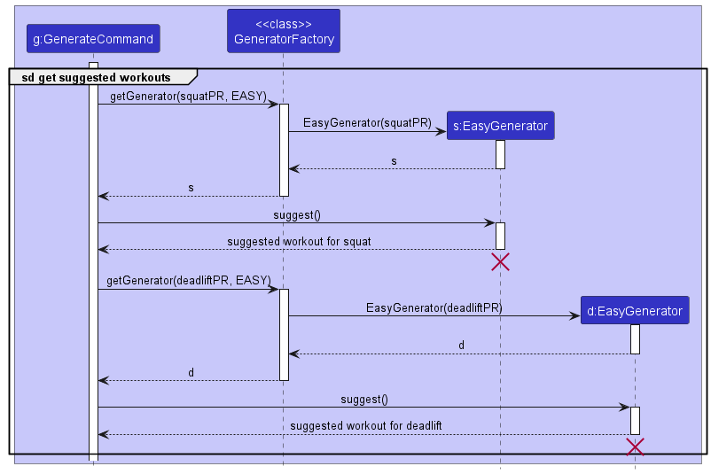

* Table of Contents
{:toc}

--------------------------------------------------------------------------------------------------------------------

## **Acknowledgements**

* {list here sources of all reused/adapted ideas, code, documentation, and third-party libraries -- include links to the original source as well}

--------------------------------------------------------------------------------------------------------------------

## **Setting up, getting started**

Refer to the guide [_Setting up and getting started_](SettingUp.md).

--------------------------------------------------------------------------------------------------------------------

## **Design**

<div markdown="span" class="alert alert-primary">

:bulb: **Tip:** The `.puml` files used to create diagrams in this document can be found in the [diagrams](https://github.com/se-edu/addressbook-level3/tree/master/docs/diagrams/) folder. Refer to the [_PlantUML Tutorial_ at se-edu/guides](https://se-education.org/guides/tutorials/plantUml.html) to learn how to create and edit diagrams.
</div>

### Architecture


The ***Architecture Diagram*** given above explains the high-level design of the App.

Given below is a quick overview of main components and how they interact with each other.

**Main components of the architecture**

**`Main`** has two classes called [`Main`](https://github.com/AY2223S1-CS2103T-T15-4/tp/blob/master/src/main/java/gim/Main.java) and [`MainApp`](https://github.com/AY2223S1-CS2103T-T15-4/tp/blob/master/src/main/java/gim/MainApp.java). It is responsible for,
* At app launch: Initializes the components in the correct sequence, and connects them up with each other.
* At shut down: Shuts down the components and invokes cleanup methods where necessary.

[**`Commons`**](#common-classes) represents a collection of classes used by multiple other components.

The rest of the App consists of four components.

* [**`UI`**](#ui-component): The UI of the App.
* [**`Logic`**](#logic-component): The command executor.
* [**`Model`**](#model-component): Holds the data of the App in memory.
* [**`Storage`**](#storage-component): Reads data from, and writes data to, the hard disk.


**How the architecture components interact with each other**

The *Sequence Diagram* below shows how the components interact with each other for the scenario where the user issues the command `delete 1`.


Each of the four main components (also shown in the diagram above),

* defines its *API* in an `interface` with the same name as the Component.
* implements its functionality using a concrete `{Component Name}Manager` class (which follows the corresponding API `interface` mentioned in the previous point.

For example, the `Logic` component defines its API in the `Logic.java` interface and implements its functionality using the `LogicManager.java` class which follows the `Logic` interface. Other components interact with a given component through its interface rather than the concrete class (reason: to prevent outside component's being coupled to the implementation of a component), as illustrated in the (partial) class diagram below.


The sections below give more details of each component.

### UI component

The **API** of this component is specified in [`Ui.java`](https://github.com/AY2223S1-CS2103T-T15-4/tp/blob/master/src/main/java/gim/ui/Ui.java)


The UI consists of a `MainWindow` that is made up of parts e.g.`CommandBox`, `ResultDisplay`, `ExerciseListPanel`, `StatusBarFooter` etc. All these, including the `MainWindow`, inherit from the abstract `UiPart` class which captures the commonalities between classes that represent parts of the visible GUI.

The `UI` component uses the JavaFx UI framework. The layout of these UI parts are defined in matching `.fxml` files that are in the `src/main/resources/view` folder. For example, the layout of the [`MainWindow`](https://github.com/AY2223S1-CS2103T-T15-4/tp/blob/master/src/main/java/gim/ui/MainWindow.java) is specified in [`MainWindow.fxml`](https://github.com/AY2223S1-CS2103T-T15-4/tp/blob/master/src/main/resources/view/MainWindow.fxml)

The `UI` component,

* executes user commands using the `Logic` component.
* listens for changes to `Model` data so that the UI can be updated with the modified data.
* keeps a reference to the `Logic` component, because the `UI` relies on the `Logic` to execute commands.
* depends on some classes in the `Model` component, as it displays `Exercise` object residing in the `Model`.

### Logic component

**API** : [`Logic.java`](https://github.com/AY2223S1-CS2103T-T15-4/tp/blob/master/src/main/java/gim/logic/Logic.java)

Here's a (partial) class diagram of the `Logic` component:


How the `Logic` component works:
1. When `Logic` is called upon to execute a command, it uses the `ExerciseTrackerParser` class to parse the user command.
1. This results in a `Command` object (more precisely, an object of one of its subclasses e.g., `AddCommand`) which is executed by the `LogicManager`.
1. The command can communicate with the `Model` when it is executed (e.g. to add an exercise).
1. The result of the command execution is encapsulated as a `CommandResult` object which is returned back from `Logic`.

The Sequence Diagram below illustrates the interactions within the `Logic` component for the `execute("delete 1")` API call.


<div markdown="span" class="alert alert-info">:information_source: **Note:** The lifeline for `DeleteCommandParser` should end at the destroy marker (X) but due to a limitation of PlantUML, the lifeline reaches the end of diagram.
</div>

Here are the other classes in `Logic` (omitted from the class diagram above) that are used for parsing a user command:


How the parsing works:
* When called upon to parse a user command, the `ExerciseTrackerParser` class creates an `XYZCommandParser` (`XYZ` is a placeholder for the specific command name e.g., `AddCommandParser`) which uses the other classes shown above to parse the user command and create a `XYZCommand` object (e.g., `AddCommand`) which the `ExerciseTrackerParser` returns back as a `Command` object.
* All `XYZCommandParser` classes (e.g., `AddCommandParser`, `DeleteCommandParser`, ...) inherit from the `Parser` interface so that they can be treated similarly where possible e.g, during testing.

### Model component
**API** : [`Model.java`](https://github.com/AY2223S1-CS2103T-T15-4/tp/blob/master/src/main/java/gim/model/Model.java)


The `Model` component,

* stores the exercise tracker data i.e., all `Exercise` objects (which are contained in a `UniqueExerciseList` object).
* stores the currently 'selected' `Exercise` objects (e.g., results of a search query) as a separate _filtered_ list which is exposed to outsiders as an unmodifiable `ObservableList<Exercise>` that can be 'observed' e.g. the UI can be bound to this list so that the UI automatically updates when the data in the list change.
* stores a `UserPref` object that represents the user’s preferences. This is exposed to the outside as a `ReadOnlyUserPref` objects.
* does not depend on any of the other three components (as the `Model` represents data entities of the domain, they should make sense on their own without depending on other components)

<div markdown="span" class="alert alert-info">:information_source: **Note:** An alternative (arguably, a more OOP) model is given below. It has a `Tag` list in the `ExerciseTracker`, which `Exercise` references. This allows `ExerciseTracker` to only require one `Tag` object per unique tag, instead of each `Exercise` needing their own `Tag` objects.<br>


</div>


### Storage component

**API** : [`Storage.java`](https://github.com/AY2223S1-CS2103T-T15-4/tp/blob/master/src/main/java/gim/storage/Storage.java)


The `Storage` component,
* can save both exercise tracker data and user preference data in json format, and read them back into corresponding objects.
* inherits from both `ExerciseTrackerStorage` and `UserPrefStorage`, which means it can be treated as either one (if only the functionality of only one is needed).
* depends on some classes in the `Model` component (because the `Storage` component's job is to save/retrieve objects that belong to the `Model`)

### Common classes

Classes used by multiple components are in the `gimbook.commons` package.

--------------------------------------------------------------------------------------------------------------------

## **Implementation**

This section describes some noteworthy details on how certain features are implemented.

### **Exercise Components**
* Added Classes into the model Component to encapsulate an Exercise

#### **Implementation**


An `Exercise`,
- is stored in `ExerciseList` and `ExerciseHashmap` of the Model

An `Exercise` contains the following attributes,
1. a `Name`, which represents the name of the Exercise
2. a `Weight`, which represents the total weight used for a certain Exercise
3. a `Reps`, which represents the number of times a specific exercise was performed
4. a `Sets`, which represents the number of cycles of reps that was completed
5. a `Date`, which represent the date an exercise was performed as specified in `DD/MM/YYYY` format

### **Sorting Exercise List**

#### **Sorting Implementation**

The sorting of exercise list is facilitated by `ModelManager` which implements `Model`. `ModelManager` contains a `filteredExercises`
list which is the list of exercises in a `FilteredList` 'wrapper' from `javafc.collections.transformation`. `filteredExercises`
gets the list of exercises to be displayed from method `getExerciseList()` in `ExerciseTracker`.

`ExerciseTracker` has method `sortDisplayedList()` which calls `sortDisplayedList()` in `ExerciseList`.

`ExerciseList` contains a `displayedList` of type `ObservableList<Exercise>` and is the list that will be displayed by the `Ui`.
It is a duplicated copy of the `internalUnmodifiableList` of type `unmodifiableObservableList`. `ExerciseList` has method
`sortDisplayedList()` which sorts the `displayedList` by order of date using the `sort()` method in `java.util.Collections` with a `Comparator<Exercise>`.

#### Sorting Execution

When the command `:sort` is entered, the `Ui` sends the command to `Logic`. `Logic` parses and identifies the `:sort` command that was entered, and creates
an instance of it. `Logic` then executes the command. `Model` will have the displayed list sorted and the sorted list will be displayed by `Ui`.

#### Example Usage

Given below is an example usage scenario and how the sorting mechanism behaves at each step.

Step 1: The user launches the application which loads the set of exercises previously keyed. `displayedList` will be initialised
to be the same as the `internalUnmodifiableList` in `ExerciseList` where the exercises are sorted by the date of input.

Step 2: The user executes `:sort` command to sort the exercises based on date of exercises done. The `ExerciseTrackerParser`
identifies that the command is a `SortCommand`. The command calls `Model` to `sortDisplayedList` and the `Ui` displays the
`displayedList` which has the exercises sorted by their respective dates.

The following sequence diagram shows how the sort command is executed.


#### Design considerations:

**Aspect: Displayed List structure**
* **Current choice**: `displayedList` is a duplicated copy of the list of exercises in `internalUnmodifiableList` of type
  `UnmodifiableObservableList` in `ExerciseList` class
    * Rationale: The sort command will sort the `diplayedList`, not affecting the `internalUnmodifiableList`. This allows
      users to view the sorted list of exercises while maintaining a defensive copy of exercises keyed by user.

**Aspect: Open-Closed Principle**
* **Current choice**: `sortDisplayedList()` in `ExerciseList` sorts the `displayedList` using the `sort()` method in `java.util.Collections` and a `Comparator<Exercise>`.
    * Rationale: Using a `Comparator<Exercise>` in `sort()` allows one to extend the `sortDisplayedList` method to accommodate other sorting orders
      by simply changing the `Comparator<Exercise>` used should the sorting criteria change in the future.

### **Viewing exercises within a date range**

#### **Implementation**

The range view is driven by `ModelManager` implements the interface `Model`. `ModelManager` contains a 
`filteredExercises` list which is the list of exercises in a `FilteredList` 'wrapper' from 
`javafc.collections.transformation`. `filteredExercises` gets the list of exercises to be displayed from method 
`getExerciseList()` in `ExerciseTracker`.

`ExerciseTracker` has the method `filterListByDateRange()` which calls `filterListByDateRange()` in `ExerciseList`.

Inside `ExerciseList`, we have a list `internalUnmodifiableList` which contains the list of `Exercise` objects. Although
it is declared as `final`, the elements within the list can potentially be modified. In order to preserve the order that 
is currently true in the aforementioned list, a copy called `rangeFilteredList` is created within the method 
`filterListByDateRange()`.

The user interface `Ui` will display this `rangeFilteredList` of type `ObservableList<Exercise>` in `ExerciseList`. 

Within the `filterListByDateRange()` method, the `rangeFilteredList` list is iterated through. For each `Exercise`,
the `Date` is considered and compared with both the `startDate` and `endDate` arguments provided to the
`filterListByDateRange()` method. If the `Exercise` has a `Date` value that falls between `startDate` (inclusive) 
and `endDate` (inclusive), then it will be retained in the list. Otherwise, it will be removed from the list.

Then, `rangeFilteredList` will be sorted in ascending order of `Date` using the method `sortDisplayedList()` 
in `ExerciseList`.

#### Execution

When the command `:sort DD/MM/YYYY DD/MM/YYYY` is entered, the `Ui` sends the command to `Logic`. 
Here, `DD/MM/YYYY` is the supported format for entering the start date and end date.
`Logic` parses and identifies the `:sort` command that was entered, and creates an instance of it. 
`Logic` then executes the command.
`Model` will have the displayed list sorted and the sorted list will be displayed by `Ui`.

#### Example Usage

Given below is an example usage scenario and how the date range view mechanism behaves at each step.

Step 1: The user launches the application which loads the set of exercises previously keyed. `rangeFilteredList` will be 
initialised to be the same as the `internalUnmodifiableList` in `ExerciseList` where the exercises are sorted by the 
date of input.

Step 2: The user executes `:sort 11/10/2022 18/10/2022` command to view all the exercises done between 11 October 2022
and 18 October 2022. The `ExerciseTrackerParser` identifies that the command is a `SortCommand`. 
The command calls `Model` to `filterListByDateRange()` and the `Ui` displays the `rangeFilteredList` which has all the 
exercises between the specified dates.

The following sequence diagram shows how the date range process (variant of sort command) is executed.


#### Design considerations:

**Aspect: Algorithm design**
* **Current choice**: The `rangeFilteredList` is obtained by filtering by the date range first, before the sorting is
    done by calling the `sortDisplayedList()` method
    * Rationale: After filtering by the date range, there will be fewer number of `Exercise` objects to sort,
    as compared to doing the reverse process of sorting then filtering. Practical time performance improves, even though
    the time complexity remains at O(nlogn).

**Aspect: Preserving ordering state**
* **Current choice**: `rangeFilteredList` is a copy of `internalUnmodifiableList` in `ExerciseList` class
    * Rationale: Inside `ExerciseList`, we have a list `internalUnmodifiableList` which contains the list of `Exercise` 
      objects. Although it is declared as `final`, the elements within the list can potentially be modified. In order 
      to preserve the order that is currently true in the aforementioned list, a copy called `rangeFilteredList` is 
      created within the method `filterListByDateRange()`. This practice of defensive programming is to prevent the 
      potential bug that may arise in the future, caused by the assumption that `internalUnmodifiableList` preserves 
      the original ordered state.

### **Listing of Personal Records**

#### **Implementation**

The mechanism for listing Exercise personal record(s) is facilitated by `PrCommand`, which extends from `Command`.

It implements the following operations:

* `PrCommand#execute()`Executes and coordinates the necessary objects and methods to list personal record(s).
* `PrCommandParser#parse()`Parses user input from UI and initialises a PrCommand object.

The user can choose to view personal record(s) for specific exercises with the 'n/' prefix:
* `:pr n/NAME1 [n/NAME2 n/NAME3 ...]`

The user can also choose to view personal records for ALL exercises with the 'all/ prefix':
* `:pr all/`

Given below is an example usage scenario for how the mechanism for listing Exercise personal record(s) behaves at each step.

Step 1. The user launches the application and already has 4 Exercise instances, with two unique Exercises (Squat and Deadlift), in the exercise tracker.

Step 2: The user enters the command `:pr n/Squat` to view their personal record for the exercise 'Squat'.


#### Design considerations:

**Aspect: Type of arguments to accept:**
* **Alternative 1 (current choice)**: Accept exercise names.
    * Pros: Being able to view and list personal records by Exercise name is more intuitive and convenient, especially since all unique Exercises are listed in the UI (bottom right).
    * Cons: Would require users to type more characters; also require users to enter exercise names accurately.
  
* **Alternative 2**: Accept index as arguments.
    * Pros: Suggestions are generated based on PR recorded by the app. As such, the input exercise(s) must already exist in the app. Accepting indexes would guarantee this condition.
    * Cons: May require users to scroll to locate index of desired exercise, when the number of exercises grow.

### \[Proposed\] Generating a suggested workout routine

#### Proposed Implementation

The mechanism for generating a suggested workout routine is facilitated by `GenerateCommand`, which extends from `Command`.

It implements the following operations:

* `GenerateCommand#execute()` — Executes and coordinates the necessary objects and methods to generate a suggested workout routine.
* `GenerateCommandParser#parse()` — Parses user input from UI and initializes a GenerateCommand object.

Cases such as where the index from the user input is out of bounds, are handled by the methods.

Given below is an example usage scenario for how the mechanism for generating a workout routine behaves at each step.

Step 1. The user launches the application, and already has 2 exercises, squat and deadlift, at index 1 and 2, in the exercise tracker.

Step 2: The user enters the command `:gen 1,2 l/easy` to generate an easy workout routine consisting of the exercises squat and deadlift.

The following sequence diagram shows how the `GenerateCommand` works.
A `Name` object `exerciseName` is returned to `g:GenerateCommand` by calling a method in `:Model`. 
For the sake of brevity, this interaction is omitted from the diagram.


The diagram below illustrates the interaction between `g:GenerateCommand` and `GeneratorFactory` class.
The static method `GeneratorFactory#getGenerator()` creates a `Generator` of the correct difficulty level, such as `EasyGenerator`.
The number of `Generator` objects created is equal to the number of unique exercise names. They are `s:EasyGenerator` and `d:EasyGenerator` for squat and deadlift respectively.



#### Design considerations:

**Aspect: Type of arguments to accept:**
* **Alternative 1 (current choice)**: Accept index as arguments.
    * Pros: Suggestions are generated based on PR recorded by the app. As such, the input exercise(s) must already exist in the app. Accepting indexes would guarantee this condition. 
    * Cons: May require users to scroll to locate index of desired exercise, when the number of exercises grow. 
* **Alternative 2**: Accept exercise names.
    * Pros: Easier to implement.  
    * Cons: Would require users to type more characters; also require users to enter exercise names accurately.   

**Aspect: Number of `Generator` objects:**
* **Current choice**: Pairing each unique exercise to one `Generator`.
    * Rationale: The current `:gen` command specifies a single difficulty level for all exercises listed in the command. This implementation would allow a `:gen` command to generate suggestions of varying difficulty levels for different exercises in the same command, a possible extension in the future.
    
### \[Proposed\] Undo/redo feature

#### Proposed Implementation

The proposed undo/redo mechanism is facilitated by `VersionedExerciseTracker`. It extends `ExerciseTracker` with an undo/redo history, stored internally as an `exerciseTrackerStateList` and `currentStatePointer`. Additionally, it implements the following operations:

* `VersionedExerciseTracker#commit()` — Saves the current exercise tracker state in its history.
* `VersionedExerciseTracker#undo()` — Restores the previous exercise tracker state from its history.
* `VersionedExerciseTracker#redo()` — Restores a previously undone exercise tracker state from its history.

These operations are exposed in the `Model` interface as `Model#commitExerciseTracker()`, `Model#undoExerciseTracker()` and `Model#redoExerciseTracker()` respectively.

Given below is an example usage scenario and how the undo/redo mechanism behaves at each step.

Step 1. The user launches the application for the first time. The `VersionedExerciseTracker` will be initialized with the initial exercise tracker state, and the `currentStatePointer` pointing to that single exercise tracker state.


Step 2. The user executes `delete 5` command to delete the 5th exercise in the exercise tracker. The `delete` command calls `Model#commitExerciseTracker()`, causing the modified state of the exercise tracker after the `delete 5` command executes to be saved in the `exerciseTrackerStateList`, and the `currentStatePointer` is shifted to the newly inserted exercise tracker state.


Step 3. The user executes `add n/David …​` to add a new exercise. The `add` command also calls `Model#commitExerciseTracker()`, causing another modified exercise tracker state to be saved into the `exerciseTrackerStateList`.


<div markdown="span" class="alert alert-info">:information_source: **Note:** If a command fails its execution, it will not call `Model#commitExerciseTracker()`, so the exercise tracker state will not be saved into the `exerciseTrackerStateList`.

</div>

Step 4. The user now decides that adding the exercise was a mistake, and decides to undo that action by executing the `undo` command. The `undo` command will call `Model#undoExerciseTracker()`, which will shift the `currentStatePointer` once to the left, pointing it to the previous exercise tracker state, and restores the exercise tracker to that state.


<div markdown="span" class="alert alert-info">:information_source: **Note:** If the `currentStatePointer` is at index 0, pointing to the initial ExerciseTracker state, then there are no previous ExerciseTracker states to restore. The `undo` command uses `Model#canUndoExerciseTracker()` to check if this is the case. If so, it will return an error to the user rather
than attempting to perform the undo.

</div>

The following sequence diagram shows how the undo operation works:


<div markdown="span" class="alert alert-info">:information_source: **Note:** The lifeline for `UndoCommand` should end at the destroy marker (X) but due to a limitation of PlantUML, the lifeline reaches the end of diagram.

</div>

The `redo` command does the opposite — it calls `Model#redoExerciseTracker()`, which shifts the `currentStatePointer` once to the right, pointing to the previously undone state, and restores the exercise tracker to that state.

<div markdown="span" class="alert alert-info">:information_source: **Note:** If the `currentStatePointer` is at index `exerciseTrackerStateList.size() - 1`, pointing to the latest exercise tracker state, then there are no undone ExerciseTracker states to restore. The `redo` command uses `Model#canRedoExerciseTracker()` to check if this is the case. If so, it will return an error to the user rather than attempting to perform the redo.

</div>

Step 5. The user then decides to execute the command `list`. Commands that do not modify the exercise tracker, such as `list`, will usually not call `Model#commitExerciseTracker()`, `Model#undoExerciseTracker()` or `Model#redoExerciseTracker()`. Thus, the `exerciseTrackerStateList` remains unchanged.


Step 6. The user executes `clear`, which calls `Model#commitExerciseTracker()`. Since the `currentStatePointer` is not pointing at the end of the `exerciseTrackerStateList`, all exercise tracker states after the `currentStatePointer` will be purged. Reason: It no longer makes sense to redo the `add n/David …​` command. This is the behavior that most modern desktop applications follow.


The following activity diagram summarizes what happens when a user executes a new command:


#### Design considerations:

**Aspect: How undo & redo executes:**

* **Alternative 1 (current choice):** Saves the entire exercise tracker.
  * Pros: Easy to implement.
  * Cons: May have performance issues in terms of memory usage.

* **Alternative 2:** Individual command knows how to undo/redo by
  itself.
  * Pros: Will use less memory (e.g. for `delete`, just save the exercise being deleted).
  * Cons: We must ensure that the implementation of each individual command are correct.

_{more aspects and alternatives to be added}_

### Listing of unique stored Exercises in a graphical UI

#### Implementation 

The display window is located in the bottom right of the application. The display mechanism has been implemented with the Observer pattern in mind.

It is primarily driven by `SavedExerciseListWindow` (which holds the UI for the display). The logic is 
handled by `ExerciseKeys` and `ExerciseHashMap`.

##### General class diagram
The `SavedExerciseListWindow` class implements the `Observer` interface as it is the observer. The 
`ExerciseHashMap` class maintains an internal ArrayList of type `Observer`, which can be modified through the 
addUI function. As the UI elements are usually initialized later than the data, the `SavedExerciseListWindow`
UI object is only added as an observer after its constructor is called. This guards against any nullpointer exceptions 
which may occur when preloading data from a hashmap in storage.


##### Subscribing to updates
Once the `SavedExerciseListWindow` object has been added to the arraylist of `Observer` in the  `ExerciseHashMap`
, it 'subscribes' to notifications whenever the ExerciseHashMap changes. Based on the functionality of the Hashmap as 
well as the application, this can be generalised into two distinct scenarios.

* **Adding an exercise** - Whenever a new exercise has been added, there is a possibility of a new key being added.
* **Removing an exercise** - Whenever a new exercise has been removed, there is a possibility of a key being removed permanently.

<div markdown="span" class="alert alert-info">:information_source: **Note:** The current implementation subscribes to notification for any form of addition or deletion, regardless if the exercise is unique or already exists in the list.
</div>

##### Updating
Whenever there is a state changing operation, the `ExerciseHashMap` object will notify all observers through the notifyObservers
method. All Observers in the list will run the update method that is individually specified in their class. As `SavedExerciseListWindow`
keeps a copy of `ExerciseHashmap`, it is required to do its calculations and formatting to display the text. The logic behind the calculations
and formatting of the display message is handled by the `ExerciseKeys` class.

Let us use `SavedExerciseListWindow` update function as an example of how the system is updated. A notification would notify
`SavedExerciseListWindow` that it needs to relook at the `ExerciseHashMap` it stores and regenerate the input. It calls
the update function which first gives the `ExerciseKeys` object an ArrayList of Strings which are the key names, arranged in 
natural alphabetical order, as defined in Collections.Sort .

```
    public String getDisplay() {
            if (keyArrayList.size() == 0) {
                return "You have no stored exercises in the system!";
            }
            StringBuilder sb = new StringBuilder("Stored exercises:\n");
            for (int i = 1; i < keyArrayList.size() + 1; i++) {
                sb.append(i);
                sb.append(". ");
                sb.append(keyArrayList.get(i - 1));
                sb.append("\n");
            }
            return sb.toString();
    }
```

It then calls the getDisplay function in  `ExerciseKeys` takes the size of the ArrayList to decide the output to be generated. It returns the output as a string
which `SavedExerciseListWindow` can use to set the textarea of the UI to the most updated version.

### Design considerations

##### Polymorphism
The immediately apparent benefit of this design would be the Polymorphism that it capitalises on. In particular, the
notifyObservers function in `ExerciseHashMap`.

```
    public void notifyObservers() {
        for (Observer o: observerArrayList) {
            o.update();
        }
    }
```
Notice that `ExerciseHashMap` does not know the nature of the observers and how they interact with it. 
`ExerciseHashMap` only stores a list of the objects observing it. It does not have to define what they should do to update,
instead, the responsibility of deciding what to do is passed on to the Observers themselves.

This allows for flexibility in having different types of objects having different forms of updating. This keeps the code
in `ExerciseHashMap` short and hides the implementation of the Observers behind the `Observer` interface which acts as an
intermediary to help the UI communicate with `ExerciseHashMap`.

### \[Proposed\] Data archiving

_{Explain here how the data archiving feature will be implemented}_

--------------------------------------------------------------------------------------------------------------------

## **Documentation, logging, testing, configuration, dev-ops**

* [Documentation guide](Documentation.md)
* [Testing guide](Testing.md)
* [Logging guide](Logging.md)
* [Configuration guide](Configuration.md)
* [DevOps guide](DevOps.md)

--------------------------------------------------------------------------------------------------------------------

## **Appendix: Requirements**

### Product scope

**Target user profile**:

* Programmers who love vim and want to hit the gym for some exercise but they are too occupied with work to recall their progressions and don’t know / remember what to do next
* They may also find it hard to remember their statistics on each exercise

**Value proposition**:
* Leverage on their blazing speed on vim to save, write and view gym data in a familiar fashion
* Provides a fast platform for users to track their gym progress or workout routine
* Has vim-like shortcuts to make things more efficient for vim lovers


### User stories

Priorities: High (must have) - `* * *`, Medium (nice to have) - `* *`, Low (unlikely to have) - `*`

<br>

| Priority | As a …   | I want to …                               |
|----------|----------|-------------------------------------------|
| `* * *`  | gym user | add exercises to the app                  |
| `* * *`  | gym user | delete exercises from the app             |
| `* * *`  | gym user | list out my past exercises on the app     |
| `* * *`  | gym user | associate reps/sets number to an exercise |

<br>*{More to be added}*

### Use cases

(For all use cases below, the **System** is `Gim` and the **Actor** is the `user`, unless specified otherwise)

#### Use case 1: Help

System: Gim <br>
Use case: UC01 - Request for help <br>
Actor: User <br>
Guarantees: Help message displayed.

**MSS**

1. User requests for help.
2. Gim displays help message.
<br>Use case ends.

#### Use case 2: Add an exercise

System: Gim <br>
Use case: UC02 - Add an exercise <br>
Actor: User <br>
Guarantees: Input exercise will be added to storage.

**MSS**

1. User requests to add an exercise.
2. Gim adds the exercise into storage.
<br>Use case ends.

**Extensions**

* 1a. User enters the command wrongly.

    * 1a1. Gim shows an error message.
<br>Use case ends.

#### Use case 3: Delete an exercise

System: Gim <br>
Use case: UC03 - Delete an exercise <br>
Actor: User <br>
Guarantees: Selected exercise will be deleted from storage.

**MSS**

1. User requests to delete an exercise.
2. Gim deletes the exercise.
<br>Use case ends.

**Extensions**

* 1a. User enters the command wrongly.
    * 1a1. Gim displays the error message.
<br>Use case ends.

* 1b. User enters an exercise that does not exist in the app.
    * 1b1. Gim displays that the exercise does not exist.
<br>Use case ends.

#### Use case 4: List exercises

System: Gim <br>
Use case: UC04 - List exercises <br>
Actor: User <br>
Guarantees: All stored exercises will be displayed.

**MSS**

1. User requests to list all stored exercises.
2. Gim lists the stored exercises.
<br>Use case ends.

**Extensions**

* 2a. Gim has no stored exercises.
    * 2a1. Gim displays the error message.
<br>Use case ends.


#### Use case 5: Exit Gim

System: Gim <br>
Use case: UC05 - Exit Gim <br>
Actor: User <br>
Guarantees: Gim will exit.

**MSS**

1. User requests to exit Gim.
2. Gim exits.
<br>Use case ends.


*{More to be added}*

### Non-Functional Requirements

1. Should work on any _mainstream OS_ as long as it has Java `11` or above installed.
2. Should be able to hold up to 1000 exercises without a noticeable sluggishness in performance for typical usage.
3. Should work without an internet connection.
4. Should be able to support frequent updating of data.
5. A user with above average typing speed for regular English text (i.e. not code, not system admin commands) should be able to accomplish most of the tasks faster using commands than using the mouse.

*{More to be added}*

### Glossary
* **Mainstream OS**: Windows, Linux, Unix, OS-X
* **Vim**: A Unix text editor, known for being lightweight, fast and efficient. It can be controlled entirely with the keyboard with no need for menus or a mouse.
* **Exercise**: Physical activity done in a regular gym that is structured and repetitive, usually involving some weights.
* **Reps**: Number of times you perform a specific exercise
* **Sets**: Number of cycles of reps that you complete
* **Weight**: Total weight (include barbell if applicable, exclude body weight)

--------------------------------------------------------------------------------------------------------------------

## **Appendix: Instructions for manual testing**

Given below are instructions to test the app manually.

<div markdown="span" class="alert alert-info">:information_source: **Note:** These instructions only provide a starting point for testers to work on;
testers are expected to do more *exploratory* testing.

</div>

### Launch and shutdown

1. Initial launch

   1. Download the jar file and copy into an empty folder

   1. Double-click the jar file Expected: Shows the GUI with a set of sample contacts. The window size may not be optimum.

1. Saving window preferences

   1. Resize the window to an optimum size. Move the window to a different location. Close the window.

   1. Re-launch the app by double-clicking the jar file.<br>
       Expected: The most recent window size and location is retained.

1. _{ more test cases …​ }_

### Deleting an exercise

1. Deleting an exercise while all exercises are being shown

   1. Prerequisites: List all exercises using the `list` command. Multiple exercises in the list.

   1. Test case: `delete 1`<br>
      Expected: First contact is deleted from the list. Details of the deleted contact shown in the status message. Timestamp in the status bar is updated.

   1. Test case: `delete 0`<br>
      Expected: No exercise is deleted. Error details shown in the status message. Status bar remains the same.

   1. Other incorrect delete commands to try: `delete`, `delete x`, `...` (where x is larger than the list size)<br>
      Expected: Similar to previous.

1. _{ more test cases …​ }_

### Saving data

1. Dealing with missing/corrupted data files

   1. _{explain how to simulate a missing/corrupted file, and the expected behavior}_

1. _{ more test cases …​ }_
