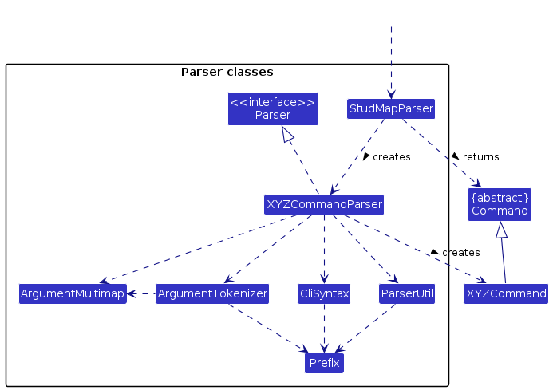
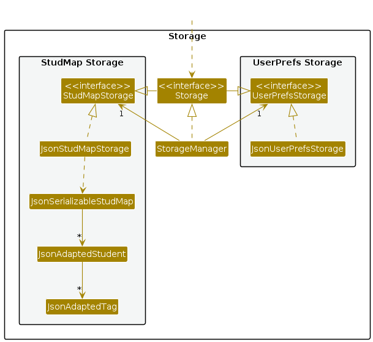
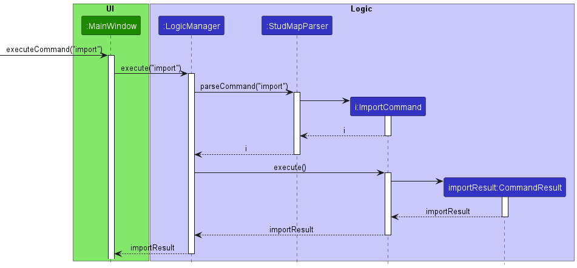
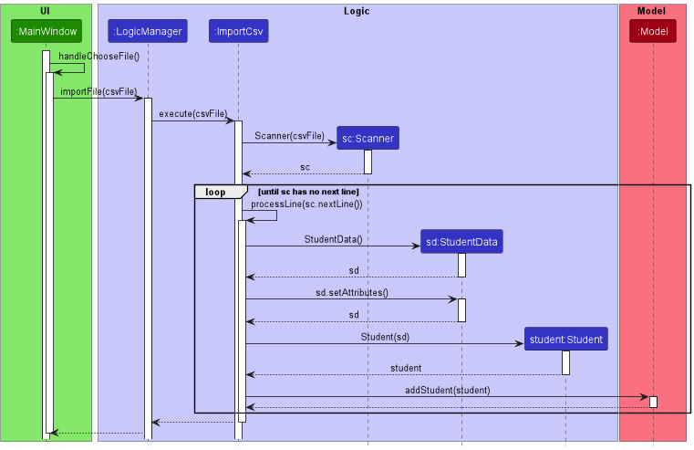

{:logo: height="200px" width="200px" style="display:block; margin-left:auto; margin-right:auto;"}
{:diagram: style="display:block; margin-left:auto; margin-right:auto;"}
{: logo}

# Overview

StudMap is a lightweight desktop app for managing your students and organizing your teaching assistant (TA)
responsibilities. It’s optimized for use via a Command Line Interface (CLI), meaning that you give instructions to
StudMap through a text box, and StudMap just does it for you — it’s like magic. Yet, it has all the benefits of a
traditional application with a graphical interface: you can still see, at a glance, a neat overview of what you need to
see. If you type fast, StudMap can get your student management tasks done faster than anything else.

This Developer Guide aims to acquaint you with the architecture of StudMap, in case you are interested in contributing
to the project. You can also use this as a reference, if you are interested in developing something similar.

---

* Table of Contents
{:toc}

---

# Acknowledgements

* [JavaFX](https://openjfx.io/) for providing the API for rendering GUI.
* [Jackson](https://github.com/FasterXML/jackson) for providing the API for parsing JSON files.
* [JUnit](https://junit.org/junit5/) for providing a unit testing framework.
* StudMap's Developer Guide is adapted
  from [AB3's Developer Guide](https://se-education.org/addressbook-level3/DeveloperGuide.html).

---

# Setting Up and Getting Started

Refer to the guide [_Setting up and getting started_](SettingUp.md).

---

# Design

 

:bulb: **Tip:** The `.puml` files used to create diagrams in this document can be found in
the [diagrams](https://github.com/AY2223S1-CS2103T-W13-1/tp/tree/master/docs/diagrams) folder. Refer to the [_PlantUML
TAial_ at se-edu/guides](https://se-education.org/guides/teaching assistantials/plantUml.html) to learn how to create
and edit diagrams.

## Architecture

Given below is an **Architecture Diagram**. It explains the high-level design of StudMap. Below the diagram is a quick
overview of main components and how they interact with each other.

{: diagram}

### Main Components of the Architecture

**`Main`** has two classes
called [`Main`](https://github.com/AY2223S1-CS2103T-W13-1/tp/tree/master/src/main/java/seedu/studmap/Main.java)
and [`MainApp`](https://github.com/AY2223S1-CS2103T-W13-1/tp/tree/master/src/main/java/seedu/studmap/MainApp.java). It
performs the following tasks:

* At app launch: `Main` initializes the components in the correct sequence, and connects them up with each other.
* At shut down: `Main` shuts down the components and invokes cleanup methods where necessary.

[**`Commons`**](#common-classes) represents a collection of classes used by multiple other components.

The rest of StudMap consists of four components.

* [**`UI`**](#ui-component): The UI of the App.
* [**`Logic`**](#logic-component): The command executor.
* [**`Model`**](#model-component): Holds the data of StudMap in memory.
* [**`Storage`**](#storage-component): Reads data from and writes data to the hard disk.

### How Architecture Components Interact

The *Sequence Diagram* below shows how the components interact with each other for the scenario where the user issues
the command `delete 1`.

{: diagram}

Each of the four main components (also shown in the diagram above)

* defines its *API* in an `interface` with the same name as the Component.
* implements its functionality using a concrete `{Component Name}Manager` class (which follows the corresponding
  API `interface` mentioned in the previous point.

For example, the `Logic` component defines its API in the `Logic.java` interface and implements its functionality using
the `LogicManager.java` class which follows the `Logic` interface. Other components interact with a given component
through its interface rather than the concrete class (reason: to prevent outside component's being coupled to the
implementation of a component), as illustrated in the (partial) class diagram below.

{: diagram}

The sections below give more details of each component.

## UI component

The **API** of this component is specified
in [`Ui.java`](https://github.com/AY2223S1-CS2103T-W13-1/tp/tree/master/src/main/java/seedu/studmap/ui/Ui.java).

{: diagram}

The UI consists of a `MainWindow` that is made up of parts e.g.`CommandBox`, `ResultDisplay`, `StudentListPanel`
, `StatusBarFooter` etc. All these, including the `MainWindow`, inherit from the abstract `UiPart` class which captures
the commonalities between classes that represent parts of the visible GUI.

The `UI` component uses the JavaFx UI framework. The layout of these UI parts are defined in matching `.fxml` files that
are in the `src/main/resources/view` folder. For example, the layout of
the [`MainWindow`](https://github.com/AY2223S1-CS2103T-W13-1/tp/tree/master/src/main/java/seedu/studmap/ui/MainWindow.java)
is specified
in [`MainWindow.fxml`](https://github.com/AY2223S1-CS2103T-W13-1/tp/tree/master/src/main/resources/view/MainWindow.fxml)

The `UI` component

* executes user commands using the `Logic` component.
* listens for changes to `Model` data so that the UI can be updated with the modified data.
* keeps a reference to the `Logic` component, because the `UI` relies on the `Logic` to execute commands.
* depends on some classes in the `Model` component, as it displays `Student` object residing in the `Model`.

## Logic Component

**API:**
[`Logic.java`](https://github.com/AY2223S1-CS2103T-W13-1/tp/tree/master/src/main/java/seedu/studmap/logic/Logic.java)

Here's a (partial) class diagram of the `Logic` component:

{: diagram}

How the `Logic` component works:

1. When `Logic` is called upon to execute a command, it uses the `StudMapParser` class to parse the user command.
2. This results in a `Command` object (more precisely, an object of one of its subclasses e.g. `AddCommand`) which is
   executed by the `LogicManager`.
3. The command can communicate with the `Model` when it is executed (e.g. to add a student).
4. The result of the command execution is encapsulated as a `CommandResult` object which is returned from `Logic`.

The Sequence Diagram below illustrates the interactions within the `Logic` component for the `execute("delete 1")` API
call.

{:
diagram}

:information_source: **Note:** The lifeline for `DeleteCommandParser` should end at the destroy marker (X) but due to a limitation of PlantUML, the lifeline reaches the end of diagram.

Here are the other classes in `Logic` (omitted from the class diagram above) that are used for parsing a user command:

How the parsing works:

* When called upon to parse a user command, the `StudMapParser` class creates an `XYZCommandParser` (`XYZ` is a
  placeholder for the specific command name e.g. `AddCommandParser`) which uses the other classes shown above to parse
  the user command and create a `XYZCommand` object (e.g. `AddCommand`) which the `StudMapParser` returns back as
  a `Command` object.
* All `XYZCommandParser` classes (e.g. `AddCommandParser`, `DeleteCommandParser`, ...) inherit from the `Parser`
  interface so that they can be treated similarly where possible e.g, during testing.

## Model Component

**API:**
[`Model.java`](https://github.com/AY2223S1-CS2103T-W13-1/tp/tree/master/src/main/java/seedu/studmap/model/Model.java)

{: diagram}

The `Model` component

* stores the student map data i.e., all `Student` objects (which are contained in a `UniqueStudentList` object).
* stores the currently 'selected' `Student` objects (e.g. results of a search query) as a separate _filtered_ list which
  is exposed to outsiders as an unmodifiable `ObservableList<Student>` that can be 'observed' e.g. the UI can be bound
  to this list so that the UI automatically updates when the data in the list change.
* stores a `UserPref` object that represents the user’s preferences. This is exposed to the outside as
  a `ReadOnlyUserPref` objects.
* does not depend on any of the other three components (as the `Model` represents data entities of the domain, they
  should make sense on their own without depending on other components)

:information_source: **Note:** An alternative (arguably, a more OOP) model is given below. It has a `Tag` list in the `StudMap`, which `Student` references. This allows `StudMap` to only require one `Tag` object per unique tag, instead of each `Student` needing their own `Tag` objects. 

## Storage Component

**API:**
[`Storage.java`](https://github.com/AY2223S1-CS2103T-W13-1/tp/tree/master/src/main/java/seedu/studmap/storage/Storage.java)

{: diagram}

The `Storage` component

* can save both student map data and user preference data in json format, and read them back into corresponding
  objects.
* inherits from both `StudMapStorage` and `UserPrefStorage`, which means it can be treated as either one (if only
  the functionality of only one is needed).
* depends on some classes in the `Model` component (because the `Storage` component's job is to save/retrieve objects
  that belong to the `Model`)

## Common Classes

Classes used by multiple components are in the `seedu.studmap.commons` package.

---

# Implementation

This section describes some noteworthy details on how certain features are implemented.

## Filter

### Current Implementation

The `filter` feature is implemented by the `FilterCommand` class which extends its parent `Command` class. The implementation
of the `filter` feature can be summarized via the sequence diagram shown below.

{: diagram}

The implementation of the `execute` method in filter is done within the class `FilterCommand#execute()`.
The `execute` method will in turn call the `filterPersonListWithPredicate` method of the corresponding
`ModelManager`. A brief summary of the class structure is illustrated in the class diagram below, using
`FilterCommand` as an example. 

{: diagram}

This method is implemented to support the feature of filtering students by the attributes that are assigned to them.

The `FilterCommand` supports one operation:

- `FilterCommand#execute()` - Overrides the `execute()` method of its parent's `Command` class and is the default
  operation to be executed. This will update the filtered list in the dashboard shown to the user based on the tag set
  by the user

### General Flow for `FilterCommand`

The flow for `FilterCommand#execute` is as such:

1. The attributes to be used for filtering is retrieved from the user input

2. The attribute input will then be parsed into the filter parser which will then return a new Filter Command

3. The filter command will then be immediately executed to filter the current list of students via their assigned
   attributes

4. The result list of students will then be shown back to the user via the dashboard

###Design Consideration

**Common Behaviours**
1. Parse certain attribute to filter
2. Parse certain keyword to filter
3. Return immediately if attribute is valid and list 
do not contain keyword
4. Return immediately if attribute is valid and list
contain keyword
5. Exception thrown immediately if attribute is invalid
    

**Aspect: How filter executes:**
* **Alternative 1 (current choice):** Update the list of students using ModelManager
  * Pros: Extension to more classes allowing the program to be conducted with 
  more OOP hence providing a more stable structure
  * Cons: It can be a hassle for users to read the code as they will have to take into
  account multiple classes that contributes to the function
* **Alternative 2:** Update the list of students within FilterCommand
  * Pros: Increase code readability for users 
  * Cons: Increase code duplication due to lesser OOP.

## Student Editing

This is a set of features with similar implementations that allows user to modify the `Student` object. Currently, the
features supported are:

1. `edit` :  `EditCommand`
    Edit basic attributes of a student (E.g. Name, Phone, etc)
2. `tag` : `TagCommand` and `untag` : `UntagCommand`
    Add and removing tags for a student
3. `mark` : `MarkCommand` and `unmark` : `UnmarkCommand` :
     Add, modify and remove attendance status of a student
4. `grade` : `GradeCommand` and `ungrade` : `UngradeCommand`
     Add, modify and remove assignment grading status of a student.
5. `participate` : `ParticipateCommand` and `unparticipate` : `UnparticipateCommand`
     Add, modify and remove participation records of a student.

Each of these features are implemented through the corresponding commands which extends the generic `EditStudentCommand`
abstract class.

The implementation of the `execute` method is contained in the parent class `EditStudentCommand#execute()`.
The `execute` method which the respective concrete implementations of `EditStudentCommand` will in turn call
the `editStudent` method of the corresponding `StudentEditor` (e.g. `MarkCommand.MarkStudentEditor#editStudent()`). A
brief summary of the class structure is illustrated in the class diagram below, using `MarkCommand` as the example.
Since all concrete implementations of the `EditStudentCommand` share the same class structure, the example
of `MarkCommand` will also be used to explain the implementation details.

{: diagram}

`IndexListGenerator` is an abstract class representing the list of indexes to modify.
The instance of `IndexListGenerator` can be either

* `AllIndexGenerator`, which corresponds to all indexes of the filtered list (meaning all listed students are modified)
* `SingleIndexGenerator`, which corresponds to a single index (meaning one selected student is modified)

`StudentEditor` is an abstract class which contains all the logic for modifying the student. Concrete implementations
of `EditStudentCommand` such as the `MarkCommand` also contains an implementation of its corresponding `StudentEditor` (
E.g. `MarkCommandStudentEditor` in the case of `MarkCommand`).

The corresponding `EditCommandParser` instantiates both its `IndexListGenerator` and the `StudentEditor` based on inputs
and passed them to the constructor of the respective command (`MarkCommand` in this case). The example class structure
using `MarkCommandParser` is illustrated in the class diagram
below.

{: diagram}

### General flow for `EditStudentCommand`

Given below is the typical flow for `EditStudentCommand` such as the  `MarkCommand#execute()`.

1. The command loops through the list of indexes to be modified, as indicated in the `IndexListGenerator`.

2. Here we have `editedStudent` replacing the old student in the `Model` of through `Model#setStudent()`.

Below is a more detailed sequence diagram for the execution of the command using the same example of `MarkCommand`.

{: diagram}

The following activity diagram summarizes what happens when a user executes a mark command:

{: diagram}

### Additional Notes

#### Stateless Attributes

`tag`/`untag` : This command adds/modifies/removes tags that are represented by the `Tag` class and does not include any
status.

#### Multi-State Attributes

Some attributes of a `Student` can have multiple states and can be represented by an identifier. This is encapsulated by
the `MultiStateAttribute<S, T>` generic class, where `S` is the type of the identifier (e.g. `String`), while `T` is the type
of the state, typically some `enum`.

1. `mark` /`unmark` : This command adds/modifies/removes a student's attendances that are represented by
   the `Attendance`
   class. `Attendance` is a `MultiStateAttribute<String, Attendance.Status>` which includes a `Status` enumeration
   containing `ATTENDED` and `NOT_ATTENDED`.  

2. `grade` /`ungrade` : This command adds/modifies/removes a student's assignment grading record that are represented by
   the `Assigment` class. `Assignment` is a `MultiStateAttribute<String, Assignment.Status>` which includes a `Status`
   enumeration containing `NEW`, `RECEIVED`, and `MARKED`.  

3. `participate` /`unparticipate` : This command adds/modifies/removes a student's participation record that are
   represented by the `Participation` class. `Participation` is a `MultiStateAttribute<String, Participation.Status>`
   which includes a `Status` enumeration containing `PARTICIPATED` and `NOT_PARTICIPATED`.  

### Design Considerations:

**Aspect: Abstraction of the generic `EditStudentCommand`:**

* **Common behaviours**
    1. Parse some indices of students to mutate in some way
    2. Parse some potential mutations to students
    3. Return immediately if no mutations are parsed
    4. Perform mutation on students
    5. Replace original students in StudMap
    6. Phrase command result in terms of the edits that were made

These behaviours have been abstracted into `IndexCommandParser`, `EditStudentCommandParser` and `EditStudentCommand`.

**Aspect: Abstraction of the generic `MultiStateAttribute`:**

* **Common behaviours**
    1. Have a field for identifying it (`identifier`) and also a value (`status`).
    2. Need equality defined by `identifier` but not `status` since they are used in a `HashMap`
    3. Need strong equality sometimes desired where `identifier` and `status` must both be equal, such as when
       determining
       whether a `Student` has been edited.

These behaviours have been abstracted into `MultiStateAttribute`. Due to the way it is implemented as a generic class,
you can reasonably extend it to create attributes that use non-string identifiers and non-enum states (e.g. `Integer`).

**Aspect: How command executes:**

* **Alternative 1 (current choice):** Update the students using StudentEditor.
    * Pros: Easy to extend functionality to other classes, more OOP-oriented
    * Cons: May decrease readability for new users due to many classes involved

* **Alternative 2:** Update the students in MarkCommand itself
    * Pros: More intuitive and easy to understand
    * Cons: Makes code harder to maintain, more code duplication.

## Sort

### Implementation

The sort feature is implemented by `SortCommand` which extends the abstract `Command` class. Since sorting is done
according to the specified attribute, the abstract `Attribute` class is used to handle the input attribute and provide
the corresponding `Comparator` to sort the student list.

`SortCommand` supports the following operation:

* `SortCommand#execute()` — Sorts the current working list by the specified comparator and order in the `SortCommand`.

This operation is exposed in the `Model` interface as `sortFilteredStudentList()`.

The following sequence diagram shows how the sort operation works:

{: diagram}

:information_source: **Note:** The lifeline for `SortCommand` should end at the destroy marker (X) but due to a limitation of PlantUML, the lifeline reaches the end of diagram.

### General Flow for `SortCommand`

Given below is an example usage scenario and how the sort mechanism behaves at each step.

1. The user executes `sort asc a/name` to sort the students in the student map by their names in ascending order.

2. `SortCommandParser` handles the parsing of user input to ensure a valid `attributeType` and `sortingOrder` is
   supplied. The checks are done by `Attribute#isValidAttributeType()` and `Order#isValidOrderName()` respectively. For
   valid attributes and order, the `Comparator` and `Order` will be supplied by `Attribute#getAttributeComparator()`
   and `ParserUtil#parseOrder()` to create a `SortCommand`.

3. `SortCommand` calls `Model#sortFilteredStudentList()` with the `Comparator` for sorting names and the
   ascending `Order` required.

4. The ModelManager containing the `studMap` passes on the `Comparator` and `Order` to `StudMap#sort()`.

5. Note that StudMap stores the student list in a `UniqueStudentList`. `UniqueStudentList#sort()` is called with
   the `Comparator` and the boolean value of `false` for `isDescending` according to the ascending `Order` specified.

6. The `internalList` stored in the `UniqueStudentList` is an `FXCollections.observableArrayList` which will then
   be sorted using the `Comparator`. The ordering of the list is reversed using `FXCollections#reverse()`
   if `isDescending`
   is true.

7. The sorted list is displayed to the user.

The following activity diagram summarizes what happens when a user executes a sort command:

{: diagram}

### Design Considerations

**Aspect: How sort executes:**

* **Alternative 1 (current choice):** Valid attributes to sort are specified in the enum class `AttributeType` and the
  corresponding `Comparator` is contained within the abstract `Attribute` class.
    * Pros: Easy to implement. Any new attributes to be enabled for sorting could be specified in the `AttributeType`
      enum class and the `Comparator` within the `Attribute` class.
    * Cons: May not be appropriate to specify the `Comparator` for different attributes within the `Attribute` class
      instead of their own respective class.

* **Alternative 2:** `Attribute` as a superclass inherited by each respective attribute. Each attribute specifies its
  own `Comparator` to be used for sorting and can be retrieved using `getAttributeComparator()`
    * Pros: Aligns more to OOP where the corresponding `Comparator` is contained within each attribute. Make use of
      polymorphism to call the correct `getAttributeComparator()` for different attributes.
    * Cons: Attribute subclasses must be instantiated possibly through a factory method just to get the `Comparator`
      used in sorting.

## Import

### Implementation

The implemented feature is implemented by `ImportCommand` which extends the abstract `Command` class. As our design
of import opens a GUI file browser for the user to select a file, it uses the `FileChooser` object provided by
JavaFX for its functionality. As `FileChooser` requires a JavaFX stage to work, `ImportCommand` has to be hooked
and executed partially by `MainWindow` as well. To facilitate communication between `ImportCommand` and `MainWindow`,
an additional flag `chooseFile` has been hooked to `CommandResult`. This dynamic will be illustrated by a sequence diagram,
which has been split into two parts.

{: diagram}

After the command is passed to `LogicManager`, command processing occurs as per typical commands in StudMap. However,
`ImportCommand` does not handle any file processing (as no file has been selected yet), and instead returns a `CommandResult`
with the flag `chooseFile == true`.

{: diagram}

After receiving the `CommandResult` with the flag, `MainWindow` will handle chooseFile execution, opening the file browser
for the user. After a file has been selected, the file will be passed to `LogicManager`, which is then passed to `ImportCsv`
for processing and insertion into the model.

### General Flow for `ImportCommand`

Given below is an example usage scenario and how the import mechanism behaves at each step.

1. `import` is received from user input, and after a chain of execution from `LogicManager` to `ImportCommand`,
    indicates to `MainWindow` that `import` has been called.

2. `MainWindow` opens a file browser through the `FileChooser` object for the user to select a CSV file.

3. The file is passed to `ImportCsv`, which then reads each row of CSV data line by line.

4. If the data in the CSV row follows the required input format, it creates a student populated with the data, and
   populates the model with that student.

5. This process is repeated until the CSV file has no more rows left to read.

6. The updated student list populated with new students is displayed to the user.

The following activity diagram summarizes the execution of import.
{: diagram}

### Design Considerations

**Aspect: How the user selects a file:**

* **Alternative 1:** User specifies the path to the file as a parameter for the `import` command.
    * Pros: Easy to implement. Avoids interfacing with the JavaFX FileChooser object, containing all processes
      within the `ImportCommand`
    * Cons: May lead to complications involving paths and directories. Will also be time consuming and less intuitive
      for the user.

* **Alternative 2 (current choice):** `import` command opens a file browser for the user to choose the file.
  * Pros: Intuitive and efficient for the user to navigate. Avoids many of the complications involving paths
    (e.g. relative / absolute paths) and processing input
  * Cons: May lead to unnecessary communication between `Logic` and `UI`, and also increases code coupling. More difficult
    to implement.

## \[Proposed\] Undo/Redo

### Proposed Implementation

The proposed undo/redo mechanism is facilitated by `VersionedStudMap`. It extends `StudMap` with an undo/redo
history, stored internally as an `studMapStateList` and `currentStatePointer`. Additionally, it implements the
following operations:

* `VersionedStudMap#commit()` — Saves the current student map state in its history.
* `VersionedStudMap#undo()` — Restores the previous student map state from its history.
* `VersionedStudMap#redo()` — Restores a previously undone student map state from its history.

These operations are exposed in the `Model` interface as `Model#commitStudMap()`, `Model#undoStudMap()`
and `Model#redoStudMap()` respectively.

Given below is an example usage scenario and how the undo/redo mechanism behaves at each step.

Step 1. The user launches the application for the first time. The `VersionedStudMap` will be initialized with the
initial student map state, and the `currentStatePointer` pointing to that single student map state.

{: diagram}

Step 2. The user executes `delete 5` command to delete the 5th student in the student map. The `delete` command
calls `Model#commitStudMap()`, causing the modified state of the student map after the `delete 5` command executes
to be saved in the `studMapStateList`, and the `currentStatePointer` is shifted to the newly inserted student map
state.

{: diagram}

Step 3. The user executes `add n/David …​` to add a new student. The `add` command also calls `Model#commitStudMap()`
, causing another modified student map state to be saved into the `studMapStateList`.

{: diagram}

:information_source: **Note:** If a command fails its execution, it will not call `Model#commitStudMap()`, so the student map state will not be saved into the `studMapStateList`.

Step 4. The user now decides that adding the student was a mistake, and decides to undo that action by executing
the `undo` command. The `undo` command will call `Model#undoStudMap()`, which will shift the `currentStatePointer`
once to the left, pointing it to the previous student map state, and restores the student map to that state.

{: diagram}

:information_source: **Note:** If the `currentStatePointer` is at index 0, pointing to the initial StudMap state, then there are no previous StudMap states to restore. The `undo` command uses `Model#canUndoStudMap()` to check if this is the case. If so, it will return an error to the user rather
than attempting to perform the undo.

The following sequence diagram shows how the undo operation works:

{: diagram}

:information_source: **Note:** The lifeline for `UndoCommand` should end at the destroy marker (X) but due to a limitation of PlantUML, the lifeline reaches the end of diagram.

The `redo` command does the opposite — it calls `Model#redoStudMap()`, which shifts the `currentStatePointer` once
to the right, pointing to the previously undone state, and restores the student map to that state.

:information_source: **Note:** If the `currentStatePointer` is at index `studMapStateList.size() - 1`, pointing to the latest student map state, then there are no undone StudMap states to restore. The `redo` command uses `Model#canRedoStudMap()` to check if this is the case. If so, it will return an error to the user rather than attempting to perform the redo.

Step 5. The user then decides to execute the command `list`. Commands that do not modify the student map, such
as `list`, will usually not call `Model#commitStudMap()`, `Model#undoStudMap()` or `Model#redoStudMap()`.
Thus, the `studMapStateList` remains unchanged.

{: diagram}

Step 6. The user executes `clear`, which calls `Model#commitStudMap()`. Since the `currentStatePointer` is not
pointing at the end of the `studMapStateList`, all student map states after the `currentStatePointer` will be
purged. Reason: It no longer makes sense to redo the `add n/David …​` command. This is the behavior that most modern
desktop applications follow.

{: diagram}

The following activity diagram summarizes what happens when a user executes a new command:

{: diagram}

### Design Considerations

**Aspect: How undo & redo executes:**

* **Alternative 1 (current choice):** Saves the entire student map.
    * Pros: Easy to implement.
    * Cons: May have performance issues in terms of memory usage.

* **Alternative 2:** Individual command knows how to undo/redo by itself.
    * Pros: Will use less memory (e.g. for `delete`, just save the student being deleted).
    * Cons: We must ensure that the implementation of each individual command are correct.

# \[Proposed\] Better Index Parsing

## Proposed Implementation

Necessary generic classes have already been created for this purpose. In `IndexCommandParser`, you can attempt to parse
the given `preamble` in more detail, such as by identifying other common indexing syntax (e.g. `2..5`) to represent
indices between `2` and `5` inclusive. After parsing, you can then write a `IndexListGenerator`, which is a
functional interface that produces a list of `Index` for StudMap to perform operations on.

Due to the OOP design of StudMap, you only need to implement it correctly once. All parsers that inherit
from `IndexCommandParser`, including

* `EditCommandParser`
* `MarkCommandParser`
* `UnmarkCommandParser`
* `GradeCommandParser`
* `UngradeCommandParser`
* `ParticipateCommandParser`
* `UnparticipateCommandParser`
* `TagCommandParser`
* `UntagCommandParser`
* `DeleteCommandParser`

will immediately work with the new syntax.

---

# Documentation, logging, testing, configuration, dev-ops

* [Documentation guide](Documentation.md)
* [Testing guide](Testing.md)
* [Logging guide](Logging.md)
* [Configuration guide](Configuration.md)
* [DevOps guide](DevOps.md)

---

# Appendix: Requirements

## Product scope

**Target user profile:**

* is a teaching assistant
* has a need to manage a significant number of students
* wants to organise their class in multiple ways
* prefer desktop apps over other types
* can type fast
* prefers typing to mouse interactions
* is reasonably comfortable using CLI apps

**Value proposition:** help teaching assistants better keep track of their students’ progress in their assigned module.

## User stories

Priorities: High (must have) - `* * *`, Medium (nice to have) - `* *`, Low (unlikely to have) - `*`

| Priority | As a …​                                          | I want to …​                                         | So that I can…​                                                        |
|----------|--------------------------------------------------|------------------------------------------------------|------------------------------------------------------------------------|
| `* * *`  | new user                                         | import existing data for students                    | do not need to enter their details one by one manually               |
| `* * *`  | teaching assistant                               | add a new student                                    |                                                                        |
| `* * *`  | teaching assistant                               | delete a student                                     | remove entries that I no longer need                                   |
| `* * *`  | teaching assistant                               | mark students who are present and absent from class  | keep track of attendance using this application                        |
| `* * *`  | teaching assistant                               | find a student by name                               | locate details of students without having to go through the entire list |
| `* *`    | teaching assistant with many students in StudMap | sort students by name                                | locate a student easily                                                |
| `* *`    | teaching assistant                               | filter the students by attribute                     | locate a student easily                                                |
| `* *`    | teaching assistant                               | create new labels to tag my students with            | better differentiate the students                                      |
| `* *`    | teaching assistant                               | change the grading status of my student's assignments            | better keep track of assignments that I have received or marked                                      |
| `* *`    | teaching assistant                               | update participation status for my students            | better keep track of the different participation components of my students                                      |
| `*`  | new user                                         | see usage instructions                               | refer to instructions when I forget how to use the App                                     |

## Use cases

(For all use cases below, the **System** is the `StudMap` and the **Actor** is the `TA`, unless specified otherwise)

**Use case: Delete a Student**

**MSS**

1. TA requests to list students
2. StudMap shows a list of students
3. TA requests to delete a specific student in the list
4. StudMap deletes the student

   Use case ends.

**Extensions**

* 2a. The list is empty.

  Use case ends.

* 3a. The given index is invalid.

    * 3a1. StudMap shows an error message.

      Use case resumes at step 2.

**Use case: Add a Student**

**MSS**

1. TA requests to add a student
2. StudMap adds the student

   Use case ends.

**Extensions**

* 1a. The given format for users is invalid

    * 1a1. StudMap shows an error message.

      Use case ends.

**Use case: Sort StudMap**

**MSS**

1. TA requests to sort list by specified Attribute and Order
2. StudMap sorts list

   Use case ends.

**Extensions**

* 1a. The given Attribute is invalid

    * 1a1. StudMap shows an error message.

      Use case ends.

* 1b. The given Order is invalid

    * 1b1. StudMap shows an error message.

      Use case ends.

**Use case: Record participation of a student**

**MSS**

1. TA requests to record participation component for Student X
2. StudMap adds participation component for Student X

   Use case ends.

**Extensions**

* 1a. The given participation component is invalid

    * 1a1. StudMap shows an error message.

      Use case ends.

* 1b. The given index is invalid

    * 1b1. StudMap shows an error message.

      Use case ends.

**Use case: Remove participation of a student**

**MSS**

1. TA requests to remove a participation component for Student X
2. StudMap removes specified participation component for Student X

   Use case ends.

**Extensions**

* 1a. The given participation component is invalid

    * 1a1. StudMap shows an error message.

      Use case ends.

* 1b. The given index is invalid

    * 1b1. StudMap shows an error message.

      Use case ends.

* 1c. The student at given index does not have records of the given participation component

    * 1c1. StudMap shows an error message.

      Use case ends.

## Non-Functional Requirements

1. The software should work on any [**mainstream OS**](#mainstream-os) as long as it has **Java 11** or above installed.
2. The software should be able to hold up to 1000 students without a noticeable sluggishness in performance for typical
   usage.
3. The software should be able to start up in 30 seconds.
4. A user with above average typing speed for regular English text (i.e. not code, not system admin commands) should be
   able to accomplish most of the tasks faster using commands than using the mouse.
5. The software should be able to be used without an installer.
6. The software should not depend on a remote server.
7. If the software crashes or becomes unresponsive, the student records should not be lost.
8. The GUI should work well (i.e., should not cause any resolution-related inconveniences to the user) for standard
   screen resolutions 1920x1080 and higher and for screen scales 100% and 125%.
9. The GUI should be usable (i.e., all functions can be used even if the user experience is not optimal) for resolutions
   1280x720 and higher and for screen scales 150%.
10. The software should be packaged into a single JAR file.
11. The software should not exceed 100MB in size.
12. The documentation should not exceed 15MB per file.
13. The software and documentation should be accessible for users who have a basic command of the English language.

---

# Appendix: Instructions for manual testing

Given below are instructions to test the app manually.

:information_source: **Note:** These instructions only provide a starting point for testers to work on;
testers are expected to do more *exploratory* testing.

## Launch and shutdown

1. Initial launch

   a. Download the jar file and copy into an empty folder

   b. Double-click the jar file Expected: Shows the GUI with a set of sample contacts. The window size may not be
   optimum.

2. Saving window preferences

   a. Resize the window to an optimum size. Move the window to a different location. Close the window.

   b. Re-launch the app by double-clicking the jar file. 
   Expected: The most recent window size and location is retained.

## Adding a student

1. Adding a Student

   a. Prerequisites: None  

   b. Test case: `add n/John Doe m/CS2103T id/E1234567` 
   Expected: Student named John Doe with student ID `E1234567` added into StudMap. Details of the added contact shown in the status message.  

   c. Test case: `add n/John Doe m/CS2103T id/E1234567 e/johndow@gmail.com` 
    Suppose this is run after Test case in (b) above, where student named John Doe with student ID already exists in the StudMap.

   Expected: No student is added. Error message for "duplicate student" shown in the status message.  

## Deleting a student

1. Deleting a student while all students are being shown.

   a. Prerequisites: List all students using the `list` command. Multiple students in the list.  

   b. Test case: `delete 1` 
   Expected: First student is deleted from the list. Details of the deleted student shown in the status message.  

   c. Test case: `delete 0` 
   Expected: No student is deleted. Error details shown in the status message.  

   d. Other incorrect delete commands to try: `delete`, `delete x`, `...` (where x is larger than the list size) 
   Expected: Similar to previous.  

## Sorting student list

1. Sorting the student list.

   a. Prerequisites: List all students using the `list` command. Multiple students in the list.  

   b. Test case: `sort asc a/name` 
   Expected: Student list sorted by name in ascending alphabetical order. Details of the sort done shown in the status message.  

   c. Test case: `sort asc a/participation` 
   Expected: Student list sorted by participation rate in ascending order. Details of the sort done shown in the status message.  

   d. Test case: `sort asc` 
   Expected: An error message for "No attribute specified" shown in the status message.  

   e. Test case: `sort asc a/gender` 
   Expected: An error message for "Invalid attribute" shown in the status message.  

## Recording participation for a student

1. Recording the participation of a student.

   a. Prerequisites: At least one student in the list.  

   b. Test case: `participate 1 yes p/P01` 
   Expected: Record student at index 1 as having participated for participation component `P01`. Details of the participation recorded shown in the status message.  

   c. Test case: `participate 3 yes p/P01` 
    Suppose that there is no student in index 3

   Expected: An error message for "Invalid student index" shown in the status message.  

   d. Test case: `participate 1 yes p/$01` 
   Expected: An error message for detailing the constraint for naming of participation component shown in the status message.  

## Removing participation for a student

1. Removing the participation of a student.

   a. Prerequisites: At least one student in the list.  

   b. Test case: `unparticipate 1 p/P01` 
   Expected: Remove participation component `P01` for student at index 1. Details of the participation removed shown in the status message.  

   c. Test case: `unparticipate 3 p/P01` 
   Suppose that there is no student in index 3

   Expected: An error message for "Invalid student index" shown in the status message.  

   d. Test case: `unparticipate 1 p/P10` 
   Suppose that there is no participation component `P10` for student in index 1

   Expected: An error message for "Participation component P10 not found" shown in the status message.  

## Marking Attendance

1. Marking a student's attendance

   a. Prerequisites: List all students using the `list` command. Multiple students in the list.  

   b. Test case: `mark 1 present c/T05` 
   Expected: First student has attendance marked as present. Details of the updated student shown in the status message.
   Student Card of the first student is updated with new green label containing "T05" in the attendances list.  

   c. Test case: `mark 2 absent c/T03` 
   Suppose there are at least two students in the list.  
   Expected: Second student has attendance marked as absent. Details of the updated student shown in the status message.
   Student Card of the second student is updated with new red label containing "T03" in the attendances list.  

   d. Test case: `mark all present c/T01` 
   Expected: All students have attendance marked as present. Details of the updated students shown in the status message.
   Student Cards of all students are updated with new green label containing "T01" in the attendances list.  

## Unmarking Attendance

1. Unmarking a student's attendance

   a. Prerequisites: List all students using the `list` command. Multiple students in the list.  

   b. Test case: `unmark 1 c/T05` 
   Suppose the first student has class `T05` recorded.  
   Expected: First student has attendance record for class `T05` removed. Details of the updated student shown in the status message.
   Student Card of the first student is updated.  

   c. Test case: `unmark 2 c/T05` 
   Suppose the second student does not have class `T05` recorded.  
   Expected: Nothing is changed. Message that second student does not have class `T05` is shown in the status message.  

## Importing File

1. Importing a student's attendance

   a. Prerequisites: A valid CSV file is available [here](files/example_template.csv), an invalid CSV 
   file is available [here](files/header_size_6.csv), and a partially working CSV file is available [here](files/example_template_errors.csv)

   b. Test case: `import` 
   Suppose a valid CSV file with properly formatted users is selected.  
   Expected: All students are successfully imported into StudMap, and displayed in the student list, 
   barring duplicates.  

   c. Test case: `import` 
   Suppose a CSV file with improperly formatted users is selected.  
   Expected: Students with proper data are successfully imported into StudMap, and displayed in the student list.
   Students with invalid data are not imported, with details about the specific issues displayed in the status message.  

   d. Test case: `import` 
   Suppose a CSV file with improper format is selected.  
   Expected: Nothing happens. StudMap displays an error in the status message.  

## Tagging Students

1. Tagging a student

   a. Prerequisites: List all students using the `list` command. Multiple students in the list.  

   b. Test case: `tag 1 t/friend` 
   Expected: First student has new tag `friend` added. Details of the updated student shown in the status message.
   Student Card of the first student is updated.  

   c. Test case: `tag all t/hello` 
   Expected: All students have new tag `hello` added. Details of the updated students shown in the status message.
   Student Cards of all students are updated.  

## Untagging Students

1. Removing tags from student

   a. Prerequisites: List all students using the `list` command. Multiple students in the list.  

   b. Test case: `untag 1 t/friend` 
   Suppose first student has tag `friend`.  
   Expected: First student has tag `friend` removed. Details of the updated student shown in the status message.
   Student Card of the first student is updated.  

   c. Test case: `untag 2 t/man` 
   Suppose second student does not have tag `man`  
   Expected: Nothing is changed. Message that second student does not have tag man `man` is shown in the status message.  

## Filtering

1. Filtering student list by attributes

   a. Prerequisites: List all students using the `list` command. Multiple students in the list.  

   b. Test case: `filter t/friend` 
   Suppose there are students with tag `friend`  
   Expected: All students with tag `friend` are displayed in the student list.  

   c. Test case: `filter a/A02` 
   Suppose there are students with assignment `A02`  
   Expected: All students with assignment `A02` are displayed in the student list.  

---

# Appendix: Effort

StudMap was an interesting experience in a Brownfield software development environment.
To many of us, it was our first endeavor, which meant lots of trial and error to get things right.

## Keeping StudMap extensible

Diving into AB3, we quickly ran into problems stemming from its rigid structure. Here are some fundamental changes
we made to keep things streamlined and extendable.

### Student Parameter Object

AB3 came with rigid constructors for its `Person` class, which meant that any extension introduced ugly overloading
of constructors. We made use of a parameter object for the `Student` constructor to overcome this issue. With this,
we could easily add multiple attributes, including `Attendances`, `Assignments`, `Participations` without hassle.

### Abstraction of Commands

AB3 started off with a few commands with a lot of duplicated code. Naive extension of AB3 would have resulted in this
code being duplicated many more times, a danger to code quality. As such, one of the earlier efforts was to abstract
out the idea of command parsers which required certain syntax (e.g. `Index`), as well as commands that mutated `Student`.
This allowed StudMap to be flexible and extendable so that future features were easy to implement.

## Conclusion

Overall, this project was fulfilling for many of us, and certainly a fun journey. StudMap gave us the opportunity to
experiment with and learn about non-trivial design patterns.

We cannot understate the effort that we have invested in this project - from midnight meetings for discussing
implementation details to the hours spent upgrading the documentation for this project.

We hope that this Developer Guide has helped you in understanding the architecture of StudMap. If you are a Software Engineering
student, we strongly encourage you to try to extend it - hopefully you will learn as much as we did.

---

# Glossary

### TA

Teaching assistant for a module.

### Student

A person that is partaking in a module.

### Module

The university class that the student is enrolled in, encoded by a unique module code consisting of a 2-3
letter prefix that generally denotes the discipline, and 4 digits at the back, the first of which indicates the level
of the module.

### JAR file

package file format typically used to aggregate many Java class files and associated metadata and
resources into one file for distribution.

### GUI

main interface that the user interacts with to input commands and view results.

### Mainstream OS

Windows, Linux, Unix, OS-X

### Tag

A label for students defined by the user, possibly shared by multiple students.

### Attribute

Characteristics of students that all students have.
