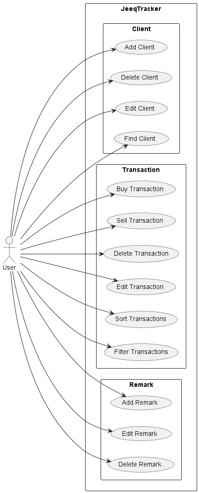

* Table of Contents
{:toc}

--------------------------------------------------------------------------------------------------------------------

## **Acknowledgements**

* {list here sources of all reused/adapted ideas, code, documentation, and third-party libraries -- include links to the original source as well}

--------------------------------------------------------------------------------------------------------------------

## **Setting up, getting started**

Refer to the guide [_Setting up and getting started_](SettingUp.md).

--------------------------------------------------------------------------------------------------------------------

## **Design**

:bulb: **Tip:** The `.puml` files used to create diagrams in this document can be found in the [diagrams](https://github.com/se-edu/addressbook-level3/tree/master/docs/diagrams/) folder. Refer to the [_PlantUML Tutorial_ at se-edu/guides](https://se-education.org/guides/tutorials/plantUml.html) to learn how to create and edit diagrams.

### Architecture

The ***Architecture Diagram*** given above explains the high-level design of the App.

Given below is a quick overview of main components and how they interact with each other.

**Main components of the architecture**

**`Main`** has two classes called [`Main`](https://github.com/AY2223S1-CS2103T-T09-1/tp/blob/master/src/main/java/seedu/address/Main.java) and [`MainApp`](https://github.com/AY2223S1-CS2103T-T09-1/tp/blob/master/src/main/java/seedu/address/MainApp.java). It is responsible for,
* At app launch: Initializes the components in the correct sequence, and connects them up with each other.
* At shut down: Shuts down the components and invokes cleanup methods where necessary.

[**`Commons`**](#common-classes) represents a collection of classes used by multiple other components.

The rest of the App consists of four components.

* [**`UI`**](#ui-component): The UI of the App.
* [**`Logic`**](#logic-component): The command executor.
* [**`Model`**](#model-component): Holds the data of the App in memory.
* [**`Storage`**](#storage-component): Reads data from, and writes data to, the hard disk.

**How the architecture components interact with each other**

The *Sequence Diagram* below shows how the components interact with each other for the scenario where the user issues the command `delete 1`.

Each of the four main components (also shown in the diagram above),

* defines its *API* in an `interface` with the same name as the Component.
* implements its functionality using a concrete `{Component Name}Manager` class (which follows the corresponding API `interface` mentioned in the previous point.

For example, the `Logic` component defines its API in the `Logic.java` interface and implements its functionality using the `LogicManager.java` class which follows the `Logic` interface. Other components interact with a given component through its interface rather than the concrete class (reason: to prevent outside component's being coupled to the implementation of a component), as illustrated in the (partial) class diagram below.

The sections below give more details of each component.

### UI component

The **API** of this component is specified in [`Ui.java`](https://github.com/se-edu/addressbook-level3/tree/master/src/main/java/seedu/address/ui/Ui.java)

The UI consists of a `MainWindow` that is made up of parts (`CommandBox`, `ResultDisplay`, `ClientListPanel`, `TransactionListPanel`, `RemarkListPanel`, `StatusBarFooter`, `HelpWindow`, `NetTransactionBox`). All these, including the `MainWindow`, inherit from the abstract `UiPart` class which captures the commonalities between classes that represent parts of the visible GUI.

The `ClientListPanel`, `TransactionListPanel`, `RemarkListPanel` contains `ClientCard`, `TransactionCard`, `RemarkCard` respectively. These **panels** can hold any number of their respective **card**. These cards also inherit from the abstract `UiPart`, and represents the GUI of a single Client, Transaction, or Panel.

The `UI` component uses the JavaFx UI framework. The layout of these UI parts are defined in matching `.fxml` files that are in the `src/main/resources/view` folder. For example, the layout of the [`MainWindow`](https://github.com/AY2223S1-CS2103T-T09-1/tp/blob/master/src/main/java/seedu/address/ui/MainWindow.java) is specified in [`MainWindow.fxml`](https://github.com/AY2223S1-CS2103T-T09-1/tp/blob/master/src/main/resources/view/MainWindow.fxml)

The `UI` component,

* executes user commands using the `Logic` component.
* listens for changes to `Model` data so that the UI can be updated with the modified data.
* keeps a reference to the `Logic` component, because the `UI` relies on the `Logic` to execute commands.
* depends on some classes in the `Model` component, as it displays `Client`, `Transaction`, and `Remark` object residing in the `Model`.

### Logic component

**API** : [`Logic.java`](https://github.com/se-edu/addressbook-level3/tree/master/src/main/java/seedu/address/logic/Logic.java)

Here's a (partial) class diagram of the `Logic` component:

How the `Logic` component works:
1. When `Logic` is called upon to execute a command, it uses the `JeeqTrackerParser` class to parse the user command.
1. This results in a `Command` object (more precisely, an object of one of its subclasses e.g., `AddCommand`) which is executed by the `LogicManager`.
1. The command can communicate with the `Model` when it is executed (e.g. to add a client).
1. The result of the command execution is encapsulated as a `CommandResult` object which is returned back from `Logic`.

The Sequence Diagram below illustrates the interactions within the `Logic` component for the `execute("delete 1")` API call.

:information_source: **Note:** The lifeline for `DeleteCommandParser` should end at the destroy marker (X) but due to a limitation of PlantUML, the lifeline reaches the end of diagram.

Here are the other classes in `Logic` (omitted from the class diagram above) that are used for parsing a user command:

How the parsing works:
* When called upon to parse a user command, the `JeeqTrackerParser` class creates an `XYZCommandParser` (`XYZ` is a placeholder for the specific command name e.g., `AddCommandParser`) which uses the other classes shown above to parse the user command and create a `XYZCommand` object (e.g., `AddCommand`) which the `JeeqTrackerParser` returns back as a `Command` object.
* All `XYZCommandParser` classes (e.g., `AddCommandParser`, `DeleteCommandParser`, ...) inherit from the `Parser` interface so that they can be treated similarly where possible e.g, during testing.

### Model component
**API** : [`Model.java`](https://github.com/AY2223S1-CS2103T-T09-1/tp/blob/master/src/main/java/seedu/address/model/Model.java)

The `Model` component,

* stores the address book data i.e., all `Client` objects (which are contained in a `UniqueClientList` object).
* stores the currently 'selected' `Client` objects (e.g., results of a search query) as a separate _filtered_ list which is exposed to outsiders as an unmodifiable `ObservableList<Client>` that can be 'observed' e.g. the UI can be bound to this list so that the UI automatically updates when the data in the list change.
* stores a `UserPref` object that represents the user’s preferences. This is exposed to the outside as a `ReadOnlyUserPref` objects.
* does not depend on any of the other three components (as the `Model` represents data entities of the domain, they should make sense on their own without depending on other components)

:information_source: **How Transaction and Remark are modelled:** 
The diagrams below show the Transaction and Remark Model and how they are stored in Client.  

**`Transaction` Class  **
Each `Client` Class has a `TransactionLog` which stores all transactions of the client in a List. The `Transaction` object contains the `Goods` transacted,
`Price` of the goods, `Quantity` of goods and `Date` of the transaction.  

**`Remark` Class  **
Each `Client` Class has a `UniqueRemarkList` which stores `Remark` object that do not 
have the same `Text` (case-insensitive). The `Remark` object contains the 
`Text` which represents the remark's text.  

### Storage component

**API** : [`Storage.java`](https://github.com/AY2223S1-CS2103T-T09-1/tp/blob/master/src/main/java/seedu/address/storage/Storage.java)

The `Storage` component,

* can save both jeeqtracker data and user preference data in json format, and read them back into corresponding objects.
* inherits from both `JeeqTrackerStorage` and `UserPrefStorage`, which means it can be treated as either one (if only the functionality of only one is needed).
* depends on some classes in the `Model` component (because the `Storage` component's job is to save/retrieve objects that belong to the `Model`)

### Common classes

Classes used by multiple components are in the `seedu.jeeqtracker.commons` package.

--------------------------------------------------------------------------------------------------------------------

## **Implementation**

This section describes some noteworthy details on how certain features are implemented.

### \[Proposed\] Data archiving

_{Explain here how the data archiving feature will be implemented}_

### Filter feature for transactions

#### Implementation

The filter transaction mechanism is facilitated by `FilterTransCommand` which extends from `Command` and `FilterTransCmdParser` which extends from `Parser`. To invoke the filter command, `FilterTransCmdParser` will parse the arguments from the user input via `FilterTransCmdParser#parse()` and returns the filter command if the arguments are valid.

`FilterTransCommand` calls the `FilterTransCommand#execute()` operation which executes the command and returns the result message in a `CommandResult` object.

The operation is exposed in the `Logic` interface as `Logic#execute()`.

Given below is an example usage scenario and how the filter mechanism behaves at each step.

Step 1. The user launches the application. The `UiManager` will call on the `MainWindow` to invoke the UI which displays all the clients.

Step 2. The user executes `filter buy` command to filter all the buy transactions from all the clients. This is done by calling the
`Client#getBuyTransactionList()` which returns an unmodifiable view of the buy transaction list.

Step 3. The `CommandResult` of `FilterTransCommand` will call `MainWindow#handleFilterTransaction()`,
to display only the filtered buy transactions from the `Client#getBuyTransactionList()` while the client panel list will display all the clients.

The following sequence diagram shows how the filter operation works:

:information_source: **Note:** The lifeline for `FilterTransCommand` should end at the destroy marker (X) but due to a limitation of PlantUML, the lifeline reaches the end of diagram.

The following activity diagram summarizes what happens when a user executes the filter command:

#### Design considerations:

**Aspect: How filter transaction executes:**

* **Alternative 1 (current choice):** Filter all the transactions made by all the clients.
    * Pros: Easy to implement and allow the user to see all the buy or sell transactions at one glance.
    * Cons: May have performance issues due to searching through all transactions of each client. Unable distinguish which transaction belong to which client.

* **Alternative 2:** Individual filter transaction for each client.
    * Pros: Performs faster as the command only filters through one client transactions. Also, user would be able to know which client the filtered transactions are from.
    * Cons: User would have to manually select each client and filter the transactions.

### \[Proposed\] Buy feature for transactions

The proposed sort mechanism is facilitated by `BuyCommand`. It extends `Command` and `BuyCommandParser` which extends from `Parser`.
To invoke the buy command, `BuyCommandParser` will parse the arguments from the user input via `BuyCommandParser#parse()` and returns the buy command
if the arguments are valid.

`BuyCommand` implements the `BuyCommandParser#execute()` operation which executes the command and returns the result message in a 
`CommandResult` object.

The operation is exposed in the `logic` interface as `Logic#execute()`.

Given below is an example usage scenario and how the buy transaction mechanism behaves at each step.

Step 1. The user launches the application. The `UiManager` will call on the `MainWindow` to invoke the UI which displays the clients.

Step 2. The user executes `buy 1 q/10 g/Apple p/0.5 d/17/05/2000` command to add a buy transaction of 10 apples at $0.50 each on the 17/05/2000 to the
client at index 1.

Step 3. The `Execute` of `BuyCommand` will call `Model#getFilteredClientList()` to get the list of clients. `List<Client>#get()` is called to
get the client at the index to copy. The `BuyTransaction` is then added to the copied client by calling `Client#addTransaction(Transaction)`.
The copied client is replaced with the client at the index by calling `Model#setClient(Client, Client)`.

The following sequence diagrams shows how the buy operation works:

:information_source: **Note:** The lifeline for `BuyCommand` should end at the destroy marker (X) but due to a limitation of PlantUML, the lifeline reaches the end of diagram.

 

The following activity diagram summarizes what happens when a user executes the buy command:

#### Design considerations:

**Aspect: How buy transaction executes:**

* **Alternative 1 (current choice):** Add buy transaction by into each client.
    * Pros: Easy to implement and allow the user to see all the buy transactions for each client via view command.
    * Cons: Users cannot see all buy transaction of every client at one time.
* **Alternative 2:** Add buy transaction to JeeqTracker instead of per client.
    * Pros: Easy to see every past buy transaction with all the clients.
    * Cons: Users may be overwhelmed if there are too many transactions. Also cannot distintively see which buy transaction belongs to which client.

_{more aspects and alternatives to be added}_

--------------------------------------------------------------------------------------------------------------
### \[Proposed\] Editing feature for transactions
#### Implementation
The edit transaction mechanism is facilitated by EditTransactionCommand which extends from `EditCommand` (which extends from `Command`) and
`EditCommandParser` which extends from `Parser`. To invoke the edit command, `EditCommandParser` will parse the arguments from user input with
`EditCommandParser#parse()` and returns the edit command if the arguments are valid.

`EditTransactionCommand` implements the `EditTransactionCommand#execute()` operation which executes the command and returns the result
message in a `CommandResult` object.

The operation is exposed in the `Logic` interface as `Logic#execute()`.

Give below is the usage scenario and how the edit mechanism behaves at each step.

Step 1. The user launches the application. The `UiManager` will call on the `MainWindow` to invoke the UI which displays the clients.

Step 2. The user executes `view 1` command to focus on the client at index 1 and see the client's list of transactions.

Step 3. The user executes `edit 2 m/transaction q/10` command to edit the information of transaction at index 2 in the focused client's transaction list.
This is done by accessing the `TransactionLog` of the focused client, and executing `TransactionLog#setTransaction(index, editedTransaction)`

The following sequence diagram shows how the edit operation works in Logic Manager:

_{more aspects and alternatives to be added}_

### Delete Client/Transaction/Remark feature

#### Current Implementation

The deletion mechanism for `clients`, `transactions`, and `remarks` is facilitated by a `DeleteCommandParser` and `DeleteCommand`.

The following class diagram shows the parent-child relation of `DeleteClientCommand`, `DeleteTransactionCommand`, `DeleteRemarkCommand` relative to the `DeleteCommand`. The concrete classes consists of the logic to delete an item stated by the name of their command.

The `DeleteCommandParser` will take in the `userInput`, parse it, and return the correct concrete command type that is either `DeleteClientCommand`, `DeleteTransactionCommand`, or `DeleteRemarkCommand` which will be executed to achieve the deletion functionality.

This process of deleting the first client in the list is depicted by the following sequence diagram (for user input `delete 1 m/client`):

:information_source: **Note:** The lifeline for `FilterTransCommand` should end at the destroy marker (X) but due to a limitation of PlantUML, the lifeline reaches the end of diagram.

The process for deleting `transaction` and `remark` is almost the same as the process stated above, with just the following changes:
- For delete transaction:
    - `userInput` is changed to `delete 1 m/transaction`
    - `parse("1 m/transaction")` returns `d`, which is a `DeleteTransactionCommand`
    - `deleteClient(1)` is changed to `deleteTransaction(1)`
- For delete remark:
    - `userInput` is changed to `delete 1 m/remark`
    - `parse("1 m/remark")` returns `d`, which is a `DeleteRemarkCommand`
    - `deleteClient(1)` is changed to `deleteRemark(1)`

#### Design Considerations:

**Aspect: How delete executes:**

* **Alternative 1 (current choice):** Delete either Client/Transaction/Remark specified by `mode (m) flag` selected by `index`
    * Pros: Easy to implement and lesser commands overall since flag is used to specify each command.
    * Cons: May be more clunky to use as users have to type in a longer command.

* **Alternative 2:** Create separate individual commands to Delete Client/Transaction/Remark, e.g. `deleteClient 1`, `deleteTransaction 1`, `deleteRemark 1`.
    * Pros: More intuitive to use, shorter command to type.
    * Cons: Adds more valid commands that the user can use, which may not be very user-friendly since they have to remember more commands. Also, there will be much more classes and code.

--------------------------------------------------------------------------------------------------------------------

## **Documentation, logging, testing, configuration, dev-ops**

* [Documentation guide](Documentation.md)
* [Testing guide](Testing.md)
* [Logging guide](Logging.md)
* [Configuration guide](Configuration.md)
* [DevOps guide](DevOps.md)

--------------------------------------------------------------------------------------------------------------------

## **Appendix: Requirements**

### Product scope

**Target user profile**:

This product is for **home-based business owners / reseller** who need help in keeping track of clients' contacts,
transaction records, and remarks about the client.

It is particularly meant for people with these characteristics:

* needs to get things done extremely fast
* prefer desktop applications over other types
* can type fast
* prefers typing to mouse interactions
* is reasonably comfortable using Command Line Interface (CLI) applications

**Value proposition**:

With JeeqTracker, users can analyze and understand the demands of each client and provide a more personalized service
that will meet the needs of the users' clients, increasing customer engagement. Furthermore, users can keep track of
clients, transactions and remarks of a client much faster than traditional applications.

### User stories

Priorities: High (must have) - `* * *`, Medium (nice to have) - `* *`, Low (unlikely to have) - `*`

| Priority | As a …​                               | I can …​                                                                                        | So that I can…​                                                                          |
|----------|---------------------------------------|-------------------------------------------------------------------------------------------------|------------------------------------------------------------------------------------------|
| `* * *`  | home-based business owner             | add a client with his name, phone, email and address                                            | keep track of clients who I will have transactions with                                  |
| `* * *`  | home-based business owner             | add a buy / sell transaction with a specific client                                             | keep track of transactions with a particular client                                      |
| `* * *`  | home-based business owner             | add a remark to a specific client                                                               | record down things about the client to help me know more about the client in the future  |
| `* * *`  | home-based business owner             | view a client's details (name, phone, email, address, remarks)                                  | easily know who and how to contact him                                                   |
| `* * *`  | home-based business owner             | view all transactions (Goods name, price, quantity, date transacted) with a client              | analyse my business                                                                      |
| `* * *`  | home-based business owner             | view all remarks of a specific client                                                           | know more about the client                                                               |
| `* * *`  | home-based business owner             | delete any client, transaction, or remark of my choice                                          | remove anything that is added wrongly, or incorrect                                      |
| `* * *`  | careless home-based business owner    | edit the details of any client, transaction or remark of my choice                              | correct any erroneous fields that I have added                                           |
| `* * *`  | calculative home-based business owner | see my overall profits with a particular client or all clients                                  | I can analyse how to earn more profits                                                   |
| `* *`    | forgetful home-based business owner   | access a built-in help functionality that tells me what commands are valid, and how to use them | have assistance within the application without opening the user guide in another browser |
| `* *`    | efficient home-based business owner   | sort the transactions of a specific client by date                                              | easily tell which are my latest or oldest transaction                                    |
| `* *`    | home-based business owner             | filter all transactions by `buy` or `sell`                                                      | see all my transactions that are of type `buy` or `sell` at one glance                   |
| `* *`    | busy home-based business owner        | do a simple and quick retrieval of clients by finding them by name                              | save time                                                                                |
| `* *`    | forgetful home-based business owner   | open an instructions sheet (user guide) within the application                                  | learn more about different commands with pictorial assistance                            |
| `*`      | calculative home-based business owner | upload invoices for transactions                                                                | retrieve a proof of transaction when required                                            |
| `*`      | artistic home-based business owner    | have some form of control over the colour of the program                                        | customise the application to my liking                                                   |
| `*`      | forgetful home-based business owner   | upload profile photos for my clients                                                            | I can recognise them easily                                                              |

*{More to be added}*

### Use cases

(For all use cases below, the **System** is the `JeeqTracker` and the **Actor** is the `user`, unless specified otherwise)

The **use case diagram** below showcases the tasks that the user can perform in JeeqTracker

Users are able to perform several tasks within the application that is broken down into **Client tasks**, **Transaction tasks**, and **Remark tasks**. For a more detailed interaction between user and the system, read the use case descriptions below.

**Use case: UC01 - Delete a client**

**MSS**

1.  User requests to list all clients
2.  JeeqTracker shows a list of clients
3.  User requests to delete a specific client in the list
4.  JeeqTracker deletes the client

    Use case ends.

**Extensions**

* 2a. The list is empty.

  Use case ends.

* 3a. The given client does not exist in the list.

    * 3a1. JeeqTracker shows an error message.

      Use case resumes at step 2.

**Use case: UC02 - Delete a transaction**

**MSS**

1. User requests to view transaction details with a client
2. JeeqTracker shows a list of transactions that the user has with that client
3. User requests to delete a specific transaction in the transaction list
4. JeeqTracker deletes the transaction

    Use case ends.

**Extensions**

* 2a. The transaction list is empty

    Use case ends.
* 3a. The transaction does not exist in the list
    
    Use case resumes at step 2.

**Use case: UC03 - Delete a remark**

1. User requests to view remark details of a client
2. JeeqTracker displays a list of remarks of that client
3. User requests to delete a specific remark in the remark list
4. JeeqTracker deletes the remark

    Use case ends.

**Extensions**
* 2a. The remark list is empty

    Use case ends
* The remark does not exist in the list

    Use case resumes at step 2.

**Use case: Find a Client**

**MSS**

1. User requests to find a client
2. JeeqTracker displays the clients with the same starting names

   Use case ends.

**Extensions**

* 2a. There are no clients with that name.

  Use case ends.

**Use case: Add a Remark to a Client**  
**Preconditions: Alice is a valid Client in JeeqTracker** 

**MSS**

1. User requests to list all clients
2. JeeqTracker shows a list of clients
3. User requests to add Punctual Buyer as a Remark to client Alice
4. JeeqTracker adds Punctual Buyer as the Remark to Alice's contact card

    Use case ends.

**Extensions**

* 3a. User fails to provide a valid command format to create a Remark.
    * 3a1. JeeqTracker shows an error message.

        Use case resumes at 2.

**Use case: Requesting help**

**MSS**

1. User requests for help to use the add function
2. JeeqTracker displays a detailed explanation on how to use the add function
3. User requests for all the functionalities
4. JeeqTracker displays a pop-up with the link to the user guide

    Use case ends.

**Use case: Clearing all data**

**MSS**

1. User requests to clear all data in JeeqTracker
2. JeeqTracker returns a confirmation to clear all data
3. User confirms
4. JeeqTracker clears all data in JeeqTracker

**Extensions**

* 3a. User inputs the wrong word for confirmation.
    * 3a1. JeeqTracker shows an error message.

      Use case resumes at 2.
    

*{More to be added}*

### Non-Functional Requirements

1.  Should work on any _mainstream OS_ as long as it has Java `11`.
2.  Should be able to hold up to 1000 clients, transactions, and remarks without a noticeable sluggishness in performance for typical usage.
3.  A user with above average typing speed for regular English text (i.e. not code, not system admin commands) should be able to accomplish most of the tasks faster using commands than using the mouse.
4.  The User Interface should be fully rendered within 2 seconds of launching the application.
5.  The system should be usable by a business owner who has basic knowledge of how to use a computer.
6.  The user is not required to handle the saving of clients, transactions and remarks.
7.  JeeqTracker is offered as a free tool.
8.  The source code should be open source.

*{More to be added}*

### Glossary

| Terms         | Definition                                                                                    |
|---------------|-----------------------------------------------------------------------------------------------|
| Mainstream OS | Windows, Linux, Unix, OS-X                                                                    |
| Client        | People who the user wants to have transactions with, or have already transacted with the user |
| Remark        | Characteristics of a client (e.g. Punctual, Friendly)                                         |
| Transaction   | Can only be a **buy** or **sell** transaction, not a trade                                    |

--------------------------------------------------------------------------------------------------------------------

## **Appendix: Instructions for manual testing**

Given below are instructions to test the app manually.

:information_source: **Note:** These instructions only provide a starting point for testers to work on;
testers are expected to do more *exploratory* testing.

### Launch and shutdown

1. Initial launch

   1. Download the jar file and copy into an empty folder

   1. Double-click the jar file Expected: Shows the GUI with a set of sample contacts. The window size may not be optimum.

1. Saving window preferences

   1. Resize the window to an optimum size. Move the window to a different location. Close the window.

   1. Re-launch the app by double-clicking the jar file. 
       Expected: The most recent window size and location is retained.

1. _{ more test cases …​ }_

### Deleting a client

1. Deleting a client while all clients are being shown

   1. Prerequisites: List all clients using the `list` command. Multiple clients in the list.

   1. Test case: `delete 1` 
      Expected: First contact is deleted from the list. Details of the deleted contact shown in the status message. Timestamp in the status bar is updated.

   1. Test case: `delete 0` 
      Expected: No client is deleted. Error details shown in the status message. Status bar remains the same.

   1. Other incorrect delete commands to try: `delete`, `delete x`, `...` (where x is larger than the list size) 
      Expected: Similar to previous.

1. _{ more test cases …​ }_

### Saving data

1. Dealing with missing/corrupted data files

   1. _{explain how to simulate a missing/corrupted file, and the expected behavior}_

1. _{ more test cases …​ }_
