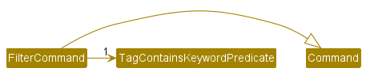
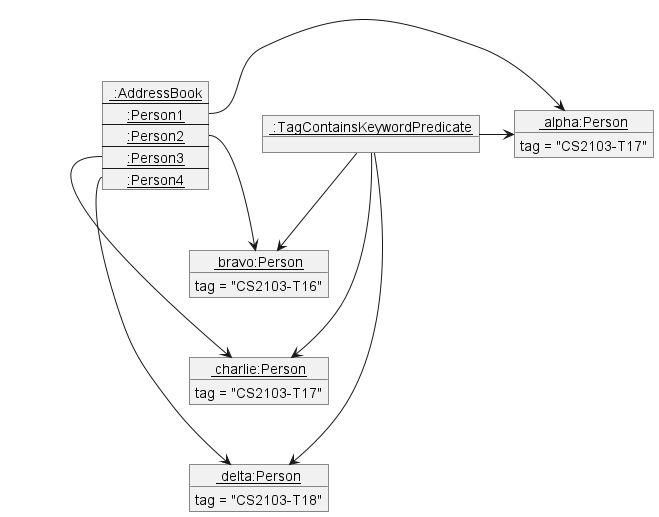
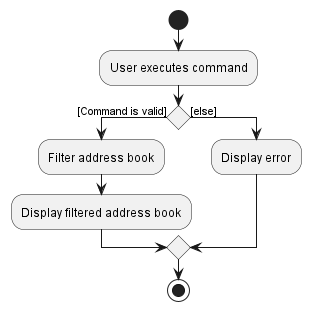

## Table of contents

* Table of Contents
{:toc}

--------------------------------------------------------------------------------------------------------------------

## **Acknowledgements**

* This project is built upon the [AddressBook Level-3](https://github.com/se-edu/addressbook-level3) project created as part of the [SE-EDU Initiative](https://se-education.org).
* Libraries used: [JavaFX](https://openjfx.io), [Jackson](https://github.com/FasterXML/jackson), [JUnit 5](https://github.com/junit-team/junit5)

--------------------------------------------------------------------------------------------------------------------

## **Setting up, getting started**

Refer to the guide [_Setting up and getting started_](SettingUp.md).

--------------------------------------------------------------------------------------------------------------------

## **Design**

:bulb: **Tip:** The `.puml` files used to create diagrams in this document can be found in the [diagrams](https://github.com/se-edu/addressbook-level3/tree/master/docs/diagrams/) folder. Refer to the [_PlantUML Tutorial_ at se-edu/guides](https://se-education.org/guides/tutorials/plantUml.html) to learn how to create and edit diagrams.

### Architecture

The ***Architecture Diagram*** given above explains the high-level design of the App.

Given below is a quick overview of main components and how they interact with each other.

**Main components of the architecture**

**`Main`** has two classes called [`Main`](https://github.com/se-edu/addressbook-level3/tree/master/src/main/java/seedu/address/Main.java) and [`MainApp`](https://github.com/se-edu/addressbook-level3/tree/master/src/main/java/seedu/address/MainApp.java). It is responsible for,
* At app launch: Initializes the components in the correct sequence, and connects them up with each other.
* At shut down: Shuts down the components and invokes cleanup methods where necessary.

[**`Commons`**](#common-classes) represents a collection of classes used by multiple other components.

The rest of the App consists of four components.

* [**`UI`**](#ui-component): The UI of the App.
* [**`Logic`**](#logic-component): The command executor.
* [**`Model`**](#model-component): Holds the data of the App in memory.
* [**`Storage`**](#storage-component): Reads data from, and writes data to, the hard disk.

**How the architecture components interact with each other**

The *Sequence Diagram* below shows how the components interact with each other for the scenario where the user issues the command `delete 1`.

Each of the four main components (also shown in the diagram above),

* defines its *API* in an `interface` with the same name as the Component.
* implements its functionality using a concrete `{Component Name}Manager` class (which follows the corresponding API `interface` mentioned in the previous point.

For example, the `Logic` component defines its API in the `Logic.java` interface and implements its functionality using the `LogicManager.java` class which follows the `Logic` interface. Other components interact with a given component through its interface rather than the concrete class (reason: to prevent outside component's being coupled to the implementation of a component), as illustrated in the (partial) class diagram below.

The sections below give more details of each component.

### UI component

The **API** of this component is specified in [`Ui.java`](https://github.com/se-edu/addressbook-level3/tree/master/src/main/java/seedu/address/ui/Ui.java)

The UI consists of a `MainWindow` that is made up of parts e.g.`CommandBox`, `ResultDisplay`, `PersonListPanel`, `StatusBarFooter` etc. All these, including the `MainWindow`, inherit from the abstract `UiPart` class which captures the commonalities between classes that represent parts of the visible GUI.

The `UI` component uses the JavaFx UI framework. The layout of these UI parts are defined in matching `.fxml` files that are in the `src/main/resources/view` folder. For example, the layout of the [`MainWindow`](https://github.com/se-edu/addressbook-level3/tree/master/src/main/java/seedu/address/ui/MainWindow.java) is specified in [`MainWindow.fxml`](https://github.com/se-edu/addressbook-level3/tree/master/src/main/resources/view/MainWindow.fxml)

The `UI` component,

* executes user commands using the `Logic` component.
* listens for changes to `Model` data so that the UI can be updated with the modified data.
* keeps a reference to the `Logic` component, because the `UI` relies on the `Logic` to execute commands.
* depends on some classes in the `Model` component, as it displays `Person` object residing in the `Model`.

### Logic component

**API** : [`Logic.java`](https://github.com/se-edu/addressbook-level3/tree/master/src/main/java/seedu/address/logic/Logic.java)

Here's a (partial) class diagram of the `Logic` component:

How the `Logic` component works:
1. When `Logic` is called upon to execute a command, it uses the `AddressBookParser` class to parse the user command.
1. This results in a `Command` object (more precisely, an object of one of its subclasses e.g., `AddCommand`) which is executed by the `LogicManager`.
1. The command can communicate with the `Model` when it is executed (e.g. to add a person).
1. The result of the command execution is encapsulated as a `CommandResult` object which is returned back from `Logic`.

The Sequence Diagram below illustrates the interactions within the `Logic` component for the `execute("delete 1")` API call.

:information_source: **Note:** The lifeline for `DeleteCommandParser` should end at the destroy marker (X) but due to a limitation of PlantUML, the lifeline reaches the end of diagram.

Here are the other classes in `Logic` (omitted from the class diagram above) that are used for parsing a user command:

How the parsing works:
* When called upon to parse a user command, the `AddressBookParser` class creates an `XYZCommandParser` (`XYZ` is a placeholder for the specific command name e.g., `AddCommandParser`) which uses the other classes shown above to parse the user command and create a `XYZCommand` object (e.g., `AddCommand`) which the `AddressBookParser` returns back as a `Command` object.
* All `XYZCommandParser` classes (e.g., `AddCommandParser`, `DeleteCommandParser`, ...) inherit from the `Parser` interface so that they can be treated similarly where possible e.g, during testing.

### Model component
**API** : [`Model.java`](https://github.com/se-edu/addressbook-level3/tree/master/src/main/java/seedu/address/model/Model.java)

The `Model` component,

* stores the address book data i.e., all `Person` objects (which are contained in a `UniquePersonList` object).
* stores the currently 'selected' `Person` objects (e.g., results of a search query) as a separate _filtered_ list which is exposed to outsiders as an unmodifiable `ObservableList<Person>` that can be 'observed' e.g. the UI can be bound to this list so that the UI automatically updates when the data in the list change.
* stores a `UserPref` object that represents the user’s preferences. This is exposed to the outside as a `ReadOnlyUserPref` objects.
* does not depend on any of the other three components (as the `Model` represents data entities of the domain, they should make sense on their own without depending on other components)

:information_source: **Note:** An alternative (arguably, a more OOP) model is given below. It has a `Tag` list in the `AddressBook`, which `Person` references. This allows `AddressBook` to only require one `Tag` object per unique tag, instead of each `Person` needing their own `Tag` objects. 

### Storage component

**API** : [`Storage.java`](https://github.com/se-edu/addressbook-level3/tree/master/src/main/java/seedu/address/storage/Storage.java)

The `Storage` component,
* can save both address book data and user preference data in json format, and read them back into corresponding objects.
* inherits from both `AddressBookStorage` and `UserPrefStorage`, which means it can be treated as either one (if only the functionality of only one is needed).
* depends on some classes in the `Model` component (because the `Storage` component's job is to save/retrieve objects that belong to the `Model`)

### Common classes

Classes used by multiple components are in the `seedu.addressbook.commons` package.

--------------------------------------------------------------------------------------------------------------------

## **Implementation**

This section describes some noteworthy details on how certain features are implemented.

### Adding a person

In TAB, the addition of a new `Person`(contact) is facilitated by the `AddCommand` command. `AddCommand` extends the abstract `Command` class,
where it overrides the `Command#execute` method to add in new contacts whenever called.

#### Implementation

1. The user input to add a `Person` to TAB, is passed to and executed by `LogicManager`, which calls `AddressBookParser#parseCommand` to instantiate a `AddCommandParser`.
2. The `AddCommandParser#parse` will return a `AddCommand`, provided the user input is valid.
3. `LogicManager` will then call the `Command#execute` method of `AddCommand`,
creating a new `Person` through `Model#addPerson` method.
4. Upon successful execution of the command, a message will be displayed to the user, by returning a `CommandResult`
to `LogicManager`.

The sequence diagram below illustrates how the command to add a `Person` works:

### Editing a contact

The editing of a contact's details in TAB is facilitated by the `EditCommand` command. `EditCommand` extends the abstract `Command` class,
where it overrides the `Command#execute` method to edit details of contacts whenever called.

#### Implementation

1. The user input to edit a contact on TAB, is passed to and executed by `LogicManager`, which calls `AddressBookParser#parseCommand` to instantiate a `EditCommandParser`.
2. The `EditCommandParser#parse` will return a `EditCommand`, provided the user input is valid.
3. `LogicManager` will then call the `Command#execute` method of `EditCommand`,
   replacing the old `Person` with a modified `Person` through `Model#setPerson` method.
4. Upon successful execution of the command, a message will be displayed to the user, by returning a `CommandResult `
   to `LogicManager`.

The sequence diagram below illustrates how the command to edit a `Person` works:

### Adding the attendance of a student

The addition of attendance of a `Student` in TAB is facilitated by `AttendanceCommand` and `AttendanceCommandParser`.

#### Implementation

1. The user input to add the attendance of a student in TAB, is passed to and executed by `LogicManager`,
which calls `AddressBookParser#parseCommand` to instantiate a `AttendanceCommandParser`.
2. The `AttendanceCommandParser#parse` will return a `AttendanceCommand`, provided the user input is valid.
3. `LogicManager` will then call the `Command#execute` method of `AttendanceCommand`.
4. The internals of `AttendanceCommand` creates a new `Student` with the updated `attendance`.
5. A `Person` object is created with the `Student` object as `position`, and replaces the `Person` to be edited in the `AddressBook`.
through the `Model#setPerson` method.
5. Upon successful execution of the command, a message will be displayed to the user, by returning a `CommandResult `
   to `LogicManager`.

The sequence diagram below illustrates how the command to add attendance works:

### Adding assignments to all students

The addition of assignments in TAB is facilitated by `AddAssignmentsCommand` and `AddAssignmentsCommandParser`.

This feature allows assignments with weightages to be added to each `Student` in TAB. Weightages are separated from the assignment name with the prefix: `w/`

#### Implementation

The `AddAssignmentsCommandParser` parses the user input to check the validity of the Assignment. Then, every `Student` currently listed in TAB will be assigned these Assignments. This is done with the help of the following methods:

* `Student#addAssignment` Adds a single Assignment into the `ArrayList<Assignment>`
* `Student#setAssignments` Adds every Assignment in the user input into `ArrayList<Assignment>`

Listed below are the possible scenarios as well as the behavior of the feature in each scenario.

Scenario 1: User inputs assignments with weightage that does not add up to 100%

e.g. `assignments assignments/ Assignment 1 w/50, Finals w/40`

It will be detected that the weightage of the assignments does not add up to 100 and a `CommandException` is thrown

Scenario 2: User inputs assignments with negative weightage

e.g. `assignments assignments/ Assignment 1 w/-50, Midterms w/50, Finals w/100`

It will be detected that a particular assignment has a negative weightage and a `CommandException` is thrown

Given below is an example usage scenario and how the Add Assignments mechanism behaves at each step.

Step 1. The user launches the application. `TAB` will initially display all Persons

Step 2. The user executes `assignments assignments/ Assignment 1 w/15, Assignment 2 w/15, Midterms w/20, Finals w/50`. The `assignments` keyword
causes `AddressBookParser#parseCommand()` to call `AddAssignmentsCommandParser#parse()`. This returns a `AddAssignmentsCommand`

Step 3. The internals of `AddAssignmentCommand` loops through all the people in the list, checking if they have the position of student

Step 4. `Assignment` objects will be created according to the user input and added to the `assignmentsList` field in `Student`

The following sequence diagram shows how the AddAssignments operation works:

The following activity diagram summarizes what happens in AddressBookParser when a user executes a AddAssignment command:

Design considerations:

Aspect: How AddAssignments executes:
* Alternative 1: Only adds assignments to indexed student
    * Pros: Each student can have different assignments
    * Cons: Will be tedious when there is a large number of students in `TAB`
* Alternative 2: Save Assignments in a json file to be read so every student added after will be automatically instanciated with those assignments
    * Pros: Eliminates the need to run AddAssignments command for new students
    * Cons: Difficulty in implementation

### Adding the grade of a student

#### Implementation

The proposed add grade feature is facilitated by `GradeCommand` which extends `Command` with an index of the student, an index of the assignment, and a grade to be stored.
It overwrites the following operations:
* `GradeCommand#execute()` - Executes the command, storing the given grade of an assignment of a specified student.
* `GradeCommand#equals(Object o)` - Checks if two objects are equal.

A `GradeCommandParser` facilitates the parsing of the user input. It implements `Parser<GradeCommand>.`

After the command is parsed, the given grade is stored inside the `Assignment` of the specified `Student`. This is done with the help of the following methods:
* `Student#updateOverallGrade(Index indexOfAssignment, Sting Grade)` - Calls `setAssignmentGrade()` with the given index and grade, and update the overall grade of the `Student`.
* `Student#setAssignmentGrade(Index indexOfAssignment, String grade)` - Checks whether the index of the assignment is valid. If so, calls `setGrade()` of the corresponding `Assignment` with the given grade.
* `Assignment#setGrade(String grade)` - Stores the given grade inside the `Assignment`.

Given below is an example usage scenario and how the add grade feature behaves at each step.

Step 1. The user launches the application. The `AddressBook` will initially display all Persons with their `Positions`.

Step 2. The user executes `grade 1 assignment/1 grade/86/100`. The `grade` keyword causes `AddressBookParser#parseCommand()` to call `GradeCommandParser#parse()`. This returns a `GradeCommand`.

Step 3. The grade of the specified `Assignment` is added.

Step 4. The internals of `GradeCommand` creates a new `Student` with the updated `overallGrade` and `assignmentList`.

Step 5. A `Person` object is created with the `Student` object as `position`, and replaces the `Person` to be edited in the `AddressBook`.

Step 6. The `AddressBook` displays the updated list of `Person`.

The following sequence diagram shows how the add grade operation works:

#### Design considerations:

* **Alternative 1 (current choice):** `Student#updateOverallGrade()` calls `Student#setAssignmentGrade()` and returns the updated overall grade of the student
    * Pros: The updated `overallGrade` can be easily used to create the new `Student` object.
    * Cons: Can be confusing as in whether the `assignmentsList` of the `Student` is updated as well.
* **Alternative 2:** `Student#updateOverallGrade()` does not return a value and only handle the calculation of the overall grade with the updated `assignmentsList` provided
    * Pros: Separates the operations done on the `overallGrade` and the `assignmentsList`.
    * Cons: The updated `overallGrade` and `assignmentsList` are not available for creating new `Student` object.

### Editing the availability of a TA

The addition of availability of a `TeachingAssistant` in TAB is facilitated by `AvailabilityCommand` and `AvailabilityCommandParser`.

#### Implementation

1. The user input to add the availability of a TA in TAB, is passed to and executed by `LogicManager`,
   which calls `AddressBookParser#parseCommand` to instantiate a `AvailabilityCommandParser`.
2. The `AvailabilityCommandParser#parse` will return a `AvailabilityCommand`, provided the user input is valid.
3. `LogicManager` will then call the `Command#execute` method of `AvailabilityCommand`.
4. The internals of `AvailabilityCommand` creates a new `TeachingAssistant` with the updated `availability`.
5. A `Person` object is created with the `Student` object as `position`, and replaces the `Person` to be edited in the `AddressBook`.
   through the `Model#setPerson` method.
5. Upon successful execution of the command, a message will be displayed to the user, by returning a `CommandResult `
   to `LogicManager`.

The sequence diagram below illustrates how the command to add availability works:

### Editing the roles of a Professor

The addition of roles of a `Professor` in TAB is facilitated by `RolesCommand` and `RolesCommandParser`.

#### Implementation

1. The user input to add the availability of a TA in TAB, is passed to and executed by `LogicManager`,
   which calls `AddressBookParser#parseCommand` to instantiate a `RolesCommandParser`.
2. The `RolesCommandParser#parse` will return a `RolesCommand`, provided the user input is valid.
3. `LogicManager` will then call the `Command#execute` method of `RolesCommand`.
4. The internals of `RolesCommand` creates a new `Professor` with the updated `role`.
5. A `Person` object is created with the `Professor` object as `position`, and replaces the `Person` to be edited in the `AddressBook`.
   through the `Model#setPerson` method.
5. Upon successful execution of the command, a message will be displayed to the user, by returning a `CommandResult `
   to `LogicManager`.

The sequence diagram below illustrates how the command to add roles works:

### Filter by tutorial group

#### Implementation

The filtering feature is facilitated by `FilterCommand`. It extends `Command` with a checking predicate, stored internally as a `TagContainsKeywordPredicate`. It overwrites the following operations:

* `FilterCommand#execute()` — Executes the command, filtering the list of people according to whether they have a matching tag.
* `FilterCommand#equals(Object o)` — Checks if two objects are equal.

Given below is a Class Diagram of this feature.

Given below is an example usage scenario and how the filtering mechanism behaves at each step.

Step 1. The user launches the application. The `AddressBook` will initially display all Persons.

Step 2. The user executes `filter CS2103-T17` command to filter people that have the `CS2103-T17 tag`. The `filter` keyword causes `AddressBookParser#parseCommand()` to call `FilterCommandParser#parse()`. This creates a `TagContainsKeywordPredicate` with the keyword `CS2103-T17`, and returns a `FilterCommand` containing this predicate.

Step 3. `Model` then loops through all people in the list, checking if they have a `CS2103-T17` tag.

:information_source: **Note:** If the filter command fails its execution, this step will not be reached. A Message will be displayed, letting the reader know how the filter command should be used.

Step 4. The filtered list will then be displayed to the user.

The following sequence diagram shows how the filter operation works:

:information_source: **Note:** The lifeline for `UndoCommand` should end at the destroy marker (X) but due to a limitation of PlantUML, the lifeline reaches the end of diagram.

The `redo` command does the opposite — it calls `Model#redoAddressBook()`, which shifts the `currentStatePointer` once to the right, pointing to the previously undone state, and restores the address book to that state.

:information_source: **Note:** If the `currentStatePointer` is at index `addressBookStateList.size() - 1`, pointing to the latest address book state, then there are no undone AddressBook states to restore. The `redo` command uses `Model#canRedoAddressBook()` to check if this is the case. If so, it will return an error to the user rather than attempting to perform the redo.

Step 5. The user then decides to execute the command `list`. `AddressBook` removes the filter, showing all persons.

The following activity diagram summarizes what happens in AddressBookParser when a user executes a filter command:

#### Design considerations:

**Aspect: How filter executes:**

* **Alternative 1 (current choice):** Updates the displayed list by hiding information.
    * Pros: Uses less memory
    * Cons: May have performance issues in terms of memory usage.

* **Alternative 2:** Creates a new Address Book.
    * Pros: Does not modify the master address book.
    * Cons: May have performance issues in terms of memory usage.

### Display details of contacts in secondary panel

#### Implementation

This feature is facilitated by `ShowCommand`, which extends `Command` with an index, stored internally as `index`.
It overwrites the following operations:
* `ShowCommand#execute()` — Executes the command, displaying the details of the contact at the specified index.
* `ShowCommand#equals(Object o)` — Checks if two objects are equal.

Given below is an example usage scenario and how the displaying mechanism behaves at each step.

Step 1. The user launches the application. The `AddressBook` will initially display all Persons with their `Positions`.

Step 2. The user executes `show 1` command to display the details of the first contact shown. The `show` keyowrd causes
`AddressBookParser#parseCommand()` to call `ShowCommandParser#parse()`. This returns a `ShowCommand` containing the
`index 1`.

Step 3. `Model` retrieves the `Person` object located at `index 1`. This returns a `CommandResult` containing the `Person`
object.

Step 4. `MainWindow` from `UI` component will process the `CommandResult` and display the details found inside the
included `Person` object.

The following show diagram shows how the show operation works:

#### Design Considerations
* **Alternative 1 (current choice):** Passing `Person` object to `MainWindow`
    * Pros: Reduced coupling throughout the program
    * Cons: Changing of many method signatures, unintuitive to implement at first.

* **Alternative 2:** Passing `index` to `MainWindow` to retrieve details from `Model`
    * Pros: More intuitive to implement in the sense that only `MainWindow` would be primarily modified.
    * Cons: Increased coupling, violation of Law of Demeter.

### Multiple Teacher’s Address Books (TABs)
**Feature Summary**
- Users are able to create multiple TABs (currently limited to 5).
  - Through `new` command
- Users are able to swap between the TABs
  - Through `swap` command

**Implementation**

Current implementation consists of two parts. First part is creating new books, second part is swapping between books.

**Creating new Books**

This feature builds on `MainWindow` class to facilitate communication between the UI and backend functions. It
communicates with `Logic` to create new TABs and uses `Model` class to alter the current `UserPref` instance.

**Swapping between Books**

This feature, similar to creating new TABs builds on `MainWindow` class and communicates with `Logic` class to swap
between TABs. It uses `Model` class to fetch the next TAB from `UserPref`. The TABs' information are stored as an
array under `preferences.json` as well as the current TAB's index. `UserPref` loops around the array when it reaches
the end. `Logic` then make use of the path information to call `storage` to update the current TAB.

**Example**
Given below is an example usage scenario and how the creation of new TAB mechanism behaves at each step.

Step 1: User enters the `new` command into the Command-Line Interface (CLI) or user navigates via `Files -> New Book` to
create a new TAB.

The following sequence diagram shows how creation of new book work:

Step 1.1: User adds X amount of TABs (up to 5):

Step 2: User enters the `swap` command or navigates via `Files -> New Book` to toggle between TABs:

The following sequence diagram shows how swapping works:
NOTE: Sequence Diagram Only includes added portions

**Design Considerations**

- Alternative 1 (current choice): Toggle between books
  - Pros:
    - Swapping between TAB occurs within 1 window
    - Open for future features
  - Cons:
    - Might be more prone to bugs due to complex implementations
    - Might be slower to load between books
- Alternative 2: Multiple copies of .java applications
  - Pros
    - Easier to implement
    - Can have multiple books open at once
  - Cons:
    - User need to create multiple books
    - Less open to future feature extensions (communicate between books)

--------------------------------------------------------------------------------------------------------------------

## **Documentation, logging, testing, configuration, dev-ops**

* [Documentation guide](Documentation.md)
* [Testing guide](Testing.md)
* [Logging guide](Logging.md)
* [Configuration guide](Configuration.md)
* [DevOps guide](DevOps.md)

--------------------------------------------------------------------------------------------------------------------

## **Appendix: Requirements**

### Product scope

**Target user profile**:

* Teaching Staff, either a Teaching Assistant or a Professor
* Teaches multiple classes simultaneously
* Has a need to manage the contacts of their students
* Requires to filter their students/contacts by their classes
* Prefers to filter and profile their students/contacts through other information

**Value proposition**: Customizing their focus to each student’s needs

### User stories

Priorities: High (must have) - `* * *`, Medium (nice to have) - `* *`, Low (unlikely to have) - `*`

| Priority | As a …​            | I want to …​                                                             | So that I can…​                                                                       |
|---------|--------------------|--------------------------------------------------------------------------|---------------------------------------------------------------------------------------|
| `* * *` | Teaching Assistant | store all my student’s contacts in one place                             | I can easily contact whoever needs to be contacted.                                   |
| `* * *` | Teaching Assistant | remove student contacts who dropped the module                           | my address book is updated for the current semester                                   |
| `* * *` | Professor          | store all my TAs’ contacts in one place                                  |                                                                                       |
| `* * *` | Professor          | view the availability of the TAs                                         | I know who to reach out to should one be unavailable to teach due to medical reasons. |
| `* * *` | Professor          | remove contacts of TAs from my address book when they are no longer a TA | my address book is updated for the current semester                                   |
| `* * *` | New User           | view the summary of all commands                                         |                                                                                       |
| `* * *` | New User           | go through a tutorial to get started.                                    |                                                                                       |

*{More to be added}*

### Use cases

(For all use cases below, the **System** is the `Teachers Address Book (TAB)` and the **Actor** is the `user`, unless specified otherwise)

**Use case: UC01 - Delete a person**

**MSS**

1.  User requests to list persons
2.  TAB shows a list of persons
3.  User requests to delete a specific person in the list
4.  TAB deletes the person

    Use case ends.

**Extensions**

* 2a. The list is empty.

  Use case ends.

* 3a. The given index is invalid.

    * 3a1. TAB shows an error message.

      Use case resumes at step 2.

**Use case: UC02 - Add a person**

**MSS**

1.  User enters the command to add a particular person.
2.  TAB shows that the command is successful and displays the added person.

    Use case ends.

**Extensions**

* 1a. The given student details are invalid.
  * 1a1. TAB shows an error message.

  Use case resumes at step 1.

**Use case: UC03 - Edit a person’s details**

**MSS**

1.  User enters the command to edit a particular person’s details.
2.  TAB shows that the command is successful and displays the edited person.

    Use case ends.

**Extensions**

* 1a. The new student details are invalid.
    * 1a1. TAB shows an error message.

  Use case resumes at step 1.

* 1b. The given index is invalid.
    * 1b1. TAB shows an error message.

  Use case resumes at step 1.

**Use case: UC04 - Show details of a person**

**MSS**

1.  User requests to view details of a person.
2.  TAB shows the details of the specified person.

    Use case ends.

**Extensions**

* 1a. The given index is invalid.

    * 1a1. TAB shows an error message.

      Use case resumes at step 1.

**Use case: UC05 - Add remarks of a person**

**MSS**

1.  User enters the command to input a remark on a specific person.
2.  TAB shows that the command is successful and displays the edited person.

    Use case ends.

**Extensions**

* 1a. The given index is invalid.

    * 1a1. TAB shows an error message.

      Use case resumes at step 1.

**Use case: UC06 - Edit attendance of a student**

**MSS**

1.  User enters the command to edit attendance of a student.
2.  TAB shows that the command is successful and displays the edited student.

    Use case ends.

**Extensions**

* 1a. The given index is invalid.

    * 1a1. TAB shows an error message.

      Use case resumes at step 1.

* 1b. The person at the given index is not a student.

    * 1b1. TAB shows an error message.

      Use case resumes at step 1.

* 1c. The new attendance details are invalid.

    * 1c1. TAB shows an error message.

      Use case resumes at step 1.

**Use case: UC07 - Add assignments to all students**

**MSS**

1.  User enters the command to add assignments to all students.
2.  TAB shows that the command is successful and displays assignments in the students' details.

    Use case ends.

**Extensions**

* 1a. The new assignment details are invalid.

    * 1a1. TAB shows an error message.

      Use case resumes at step 1.

**Use case: UC08 - Edit the grade of a student**

**MSS**

1.  User enters the command to edit the grade of an student's assignment.
2.  TAB shows that the command is successful and displays the updated student details.

    Use case ends.

**Extensions**

* 1a. The given index of the person and/or assignment is invalid.

    * 1a1. TAB shows an error message.

      Use case resumes at step 1.

* 1b. The person at the given index is not a student.

    * 1b1. TAB shows an error message.

      Use case resumes at step 1.

* 1c. The new grade details are invalid.

    * 1c1. TAB shows an error message.

      Use case resumes at step 1.

**Use case: UC09 - Edit the availability of a TA**

**MSS**

1.  User enters the command to edit the availability of a TA.
2.  TAB shows that the command is successful and displays the updated TA's details.

    Use case ends.

**Extensions**

* 1a. The given index is invalid.

    * 1a1. TAB shows an error message.

      Use case resumes at step 1.

* 1b. The person at the given index is not a TA.

    * 1b1. TAB shows an error message.

      Use case resumes at step 1.

* 1c. The new availability details are invalid.

    * 1c1. TAB shows an error message.

      Use case resumes at step 1.

**Use case: UC10 - Edit the roles of a Professor**

**MSS**

1.  User enters the command to edit the roles of a Professor.
2.  TAB shows that the command is successful and displays the updated Professor's details.

    Use case ends.

**Extensions**

* 1a. The given index is invalid.

    * 1a1. TAB shows an error message.

      Use case resumes at step 1.

* 1b. The person at the given index is not a Professor.

    * 1b1. TAB shows an error message.

      Use case resumes at step 1.

* 1c. The new role details are invalid.

    * 1c1. TAB shows an error message.

      Use case resumes at step 1.

**Use case: UC11 - Find persons by name**

**MSS**

1.  User enters the command to find specific persons by name.
2.  TAB shows that the command is successful and displays the matching persons.

    Use case ends.

**Extensions**

* 1a. The given name is invalid.

    * 1a1. TAB shows an error message.

      Use case resumes at step 1.

*{More to be added}*

### Non-Functional Requirements

1. Should work on any _mainstream OS_ as long as it has Java `11` or above installed.
2. Should be able to hold up to 1000 students or TAs without a noticeable sluggishness in performance for typical usage.
3. All user operations should complete within 2 seconds.
4. A user with above average typing speed for regular English text (i.e. not code, not system admin commands) should be able to accomplish most of the tasks faster using commands than using the mouse.
5. Unauthorised users can only read data without modifying anything.

### Glossary

* **Mainstream OS**: Windows, Linux, Unix, OS-X
* **Private contact detail**: A contact detail that is not meant to be shared with others
* **Authorised Users**: Professors and Teaching Assistants handling their respective modules

--------------------------------------------------------------------------------------------------------------------

## **Appendix: Instructions for manual testing**

Given below are instructions to test the app manually.

:information_source: **Note:** These instructions only provide a starting point for testers to work on;
testers are expected to do more *exploratory* testing.

### Launch and shutdown

1. Initial launch

   1. Download the jar file and copy into an empty folder

   1. Double-click the jar file Expected: Shows the GUI with a set of sample contacts. The window size may not be optimum.

1. Saving window preferences

   1. Resize the window to an optimum size. Move the window to a different location. Close the window.

   1. Re-launch the app by double-clicking the jar file. 
       Expected: The most recent window size and location is retained.

1. _{ more test cases …​ }_

### Deleting a person

1. Deleting a person while all persons are being shown

   1. Prerequisites: List all persons using the `list` command. Multiple persons in the list.

   1. Test case: `delete 1` 
      Expected: First contact is deleted from the list. Details of the deleted contact shown in the status message. Timestamp in the status bar is updated.

   1. Test case: `delete 0` 
      Expected: No person is deleted. Error details shown in the status message. Status bar remains the same.

   1. Other incorrect delete commands to try: `delete`, `delete x`, `...` (where x is larger than the list size) 
      Expected: Similar to previous.

1. _{ more test cases …​ }_

### Saving data

1. Dealing with missing/corrupted data files

   1. _{explain how to simulate a missing/corrupted file, and the expected behavior}_

1. _{ more test cases …​ }_
