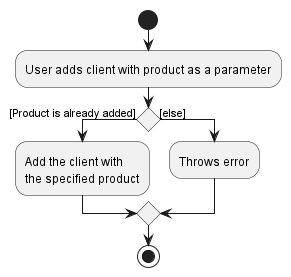
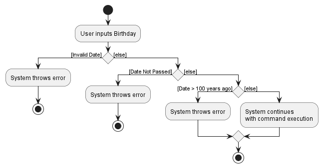
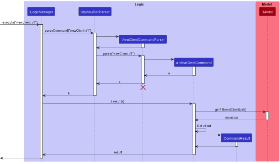
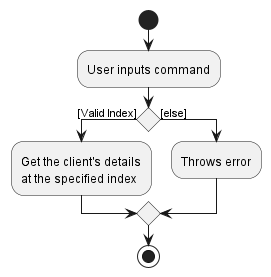
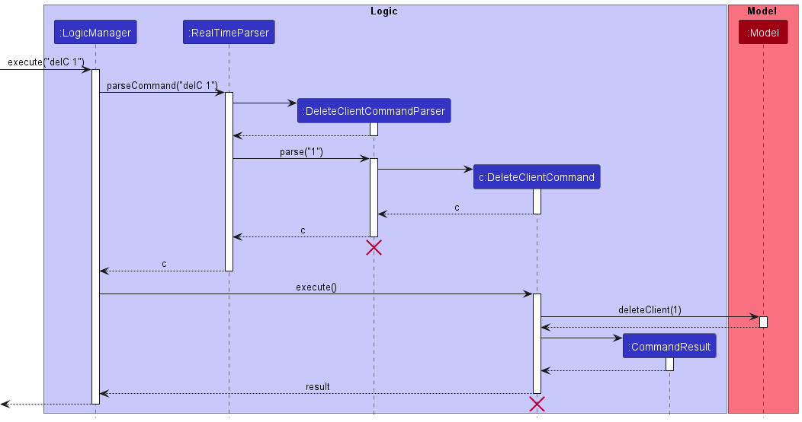
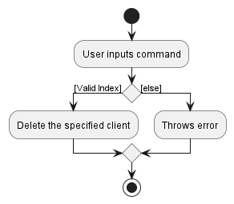
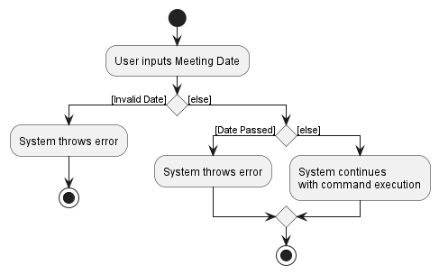
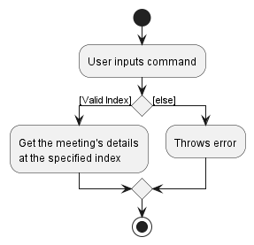
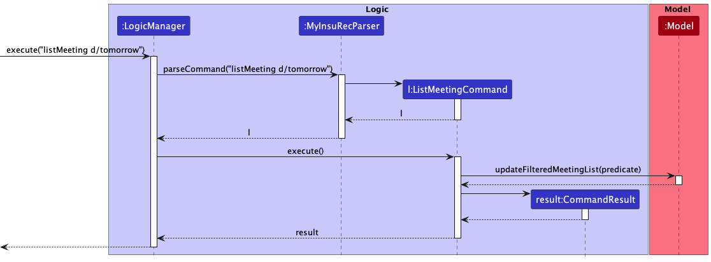
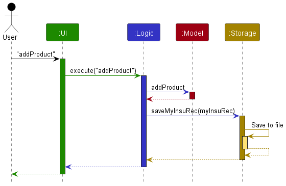

* Table of Contents
{:toc}

--------------------------------------------------------------------------------------------------------------------

## 1. Preface

### 1.1 Introduction

MyInsuRec is a desktop app for financial advisors. It provides financial advisors with clients, meetings and products management abilities to ease their mental load. It also provides some customer relations features such as the ability to look up clients with upcoming birthdays.

This developer guide serves as a documentation to help future developers better understand the system design of MyInsuRec. The guide includes sections on architecture diagrams of MyInsuRec, rationale for feature implementation, product requirements as well as some test cases for manual testing, and more. 

Do look through this developer guide if you are interested in developing MyInsuRec further.

### 1.2 Acknowledgements

* _MyInsuRec_ is a brown-field project based on the [AB3 project template](https://github.com/se-edu/addressbook-level3) by
  [se-education.org](https://se-education.org).
  * Libraries used: [JavaFx](https://openjfx.io/), [Jackson](https://github.com/FasterXML/jackson), [JUnit5](https://junit.org/junit5/)

### 1.3 Setting up, getting started

Refer to the guide [_Setting up and getting started_](SettingUp.md).

--------------------------------------------------------------------------------------------------------------------

## 2. How to use this Developer Guide

Thank you for your interest in MyInsuRec!

This guide smooths the learning curve and helps you understand the internals of MyInsuRec.

If you are seeking to understand the internals of MyInsuRec, check out:
* [3. Design](#3-design) 
* [4. Implementation](#4-implementation) 
* [5. Documentation, logging, testing, configuration, dev-ops](#5-documentation-logging-testing-configuration-dev-ops)

If you are interested in getting to understand the product's target user and how our product fits their needs, check out:
* [6. Requirements](#6-appendix-requirements)
* [6.5 Glossary](#65-glossary)

If you want to test our product's features, check out:
* [7. Manual testing](#7-appendix-instructions-for-manual-testing)

Lastly, we also share our difficulties and challenges faced under:
* [8. Effort](#8-appendix-effort)

We once again thank you for your interest in MyInsuRec. If you have any questions or feedback about MyInsuRec, feel free to reach out to us at [myinsurec@gmail.com](mailto:myinsurec@gmail.com).

--------------------------------------------------------------------------------------------------------------------

## 3. Design

This section gives you a high-level overview of the internal design of MyInsuRec, and goes lower-level as you move along the section.

:bulb: **Tip:** The `.puml` files used to create diagrams in this document can be found in the [diagrams](https://github.com/AY2223S1-CS2103T-W16-4/tp/tree/master/docs/diagrams) folder. Refer to the [_PlantUML Tutorial_ at se-edu/guides](https://se-education.org/guides/tutorials/plantUml.html) to learn how to create and edit diagrams.

### 3.1 Architecture

The ***Architecture Diagram*** given above explains the high-level design of the App.

Given below is a quick overview of main components and how they interact with each other.

#### 3.1.1 Main components of the architecture

**`Main`** has two classes called [`Main`](https://github.com/AY2223S1-CS2103T-W16-4/tp/blob/master/src/main/java/seedu/address/Main.java) and [`MainApp`](https://github.com/AY2223S1-CS2103T-W16-4/tp/blob/master/src/main/java/seedu/address/MainApp.java). It is responsible for,
* At app launch: Initializes the components in the correct sequence, and connects them up with each other.
* At shut down: Shuts down the components and invokes cleanup methods where necessary.

[**`Commons`**](#36-common-classes) represents a collection of classes used by multiple other components.

The rest of the App consists of four components.

* [**`UI`**](#32-ui-component): The UI of the App.
* [**`Logic`**](#33-logic-component): The command executor.
* [**`Model`**](#34-model-component): Holds the data of the App in memory.
* [**`Storage`**](#35-storage-component): Reads data from, and writes data to, the hard disk.

#### 3.1.2 How the architecture components interact with each other

The *Sequence Diagram* below shows how the components interact with each other for the scenario where the user issues the command [`delClient i/1`](https://ay2223s1-cs2103t-w16-4.github.io/tp/UserGuide.html#714-delete-client-delclient) (deletes the client found at index 1).

Each of the four main components (also shown in the diagram above),

* defines its *API* in an `interface` with the same name as the Component.
* implements its functionality using a concrete `{Component Name}Manager` class (which follows the corresponding API `interface` mentioned in the previous point.

For example, the `Logic` component defines its API in the `Logic.java` interface and implements its functionality using the `LogicManager.java` class which follows the `Logic` interface. Other components interact with a given component through its interface rather than the concrete class (reason: to prevent outside component's being coupled to the implementation of a component), as illustrated in the (partial) class diagram below.

The sections below give more details of each component.

### 3.2 UI component

The **API** of this component is specified in [`Ui.java`](https://github.com/AY2223S1-CS2103T-W16-4/tp/blob/master/src/main/java/seedu/address/ui/Ui.java)

The UI consists of a `MainWindow` that is made up of parts e.g.`CommandBox`, `ResultDisplay`, `ClientListPanel`, `StatusBarFooter` etc. All these, including the `MainWindow`, inherit from the abstract `UiPart` class which captures the commonalities between classes that represent parts of the visible GUI.

The `UI` component uses the JavaFx UI framework. The layout of these UI parts are defined in matching `.fxml` files that are in the `src/main/resources/view` folder. For example, the layout of the [`MainWindow`](https://github.com/AY2223S1-CS2103T-W16-4/tp/blob/master/src/main/java/seedu/address/ui/MainWindow.java) is specified in [`MainWindow.fxml`](https://github.com/AY2223S1-CS2103T-W16-4/tp/blob/master/src/main/resources/view/MainWindow.fxml)

The `UI` component

* executes user commands using the `Logic` component.
* listens for changes to `Model` data so that the UI can be updated with the modified data.
* keeps a reference to the `Logic` component, because the `UI` relies on the `Logic` to execute commands.
* depends on some classes in the `Model` component, as it displays `Client` object residing in the `Model`.

### 3.3 Logic component

**API** : [`Logic.java`](https://github.com/AY2223S1-CS2103T-W16-4/tp/blob/master/src/main/java/seedu/address/logic/Logic.java)

Here's a (partial) class diagram of the `Logic` component:

How the `Logic` component works:
1. When `Logic` is called upon to execute a command, it uses the `MyInsuRecParser` class to parse the user command.
1. This results in a `Command` object (more precisely, an object of one of its subclasses e.g., `AddClientCommand`) which is executed by the `LogicManager`.
1. The command can communicate with the `Model` when it is executed (e.g. to add a client).
1. The result of the command execution is encapsulated as a `CommandResult` object which is returned from `Logic`.

The Sequence Diagram below illustrates the interactions within the `Logic` component for the `execute("addClient n/John Tan p/12345678")` API call.

:information_source: **Note:** The lifeline for `DeleteClientCommandParser` should end at the destroy marker (X) but due to a limitation of PlantUML, the lifeline reaches the end of diagram.

Here are the other classes in `Logic` (omitted from the class diagram above) that are used for parsing a user command:

How the parsing works:
* When called upon to parse a user command, the `MyInsuRecParser` class creates an `XYZCommandParser` (`XYZ` is a placeholder for the specific command name e.g., `AddClientCommandParser`) which uses the other classes shown above to parse the user command and create a `XYZCommand` object (e.g., `AddClientCommand`) which the `MyInsuRecParser` returns back as a `Command` object.
* All `XYZCommandParser` classes (e.g., `AddClientCommandParser`, `DeleteClientCommandParser`, ...) inherit from the `Parser` interface so that they can be treated similarly where possible e.g, during testing.

### 3.4 Model component

#### 3.4.1 Overall structure
**API** : [`Model.java`](https://github.com/AY2223S1-CS2103T-W16-4/tp/blob/master/src/main/java/seedu/address/model/Model.java)

The `Model` component,

* stores the MyInsuRec data i.e., all `Client` objects (which are contained in a `UniqueClientList` object).
* stores the currently 'selected' `Client` objects (e.g., results of a search query) as a separate _filtered_ list which is exposed to outsiders as an unmodifiable `ObservableList<Client>` that can be 'observed' e.g. the UI can be bound to this list so that the UI automatically updates when the data in the list change.
* stores a `UserPref` object that represents the user’s preferences. This is exposed to the outside as a `ReadOnlyUserPref` objects.
* does not depend on any of the other three components (as the `Model` represents data entities of the domain, they should make sense on their own without depending on other components)
* `Client`, `Meeting` and `Product` have attributes here that are abstracted and portrayed in the following subsections. Not all dependencies and composition will be shown.

#### 3.4.2 Client

#### 3.4.3 Meeting

#### 3.4.4 Product

### 3.5 Storage component

**API** : [`Storage.java`](https://github.com/AY2223S1-CS2103T-W16-4/tp/blob/master/src/main/java/seedu/address/storage/Storage.java)

The `Storage` component,
* can save both MyInsuRec data and user preference data in json format, and read them back into corresponding objects.
* inherits from both `MyInsuRecStorage` and `UserPrefStorage`, which means it can be treated as either one (if only the functionality of only one is needed).
* depends on some classes in the `Model` component (because the `Storage` component's job is to save/retrieve objects that belong to the `Model`)

### 3.6 Common classes

Classes used by multiple components are in the `seedu.address.commons` package.

--------------------------------------------------------------------------------------------------------------------

## 4. Implementation

This section describes some noteworthy details on how certain features are implemented.

### 4.1 `Client`-related features

#### 4.1.1 Add client with product

Syntax: `addClient n/NAME p/PHONE_NUMBER [a/ADDRESS] [e/EMAIL] [b/BIRTHDAY] [pd/PRODUCT]`

Purpose: Adds a client with the given information to the internal model and storage

Here, we are interested in the use of adding a client and associating it with a product.

##### Implementation

Below is an activity diagram that illustrates how a user might use the addClient feature and associate the added client with a product.

##### Design Considerations

We decided to only allow adding of a client with its product only after the product is already added using `addProduct`.

This is to try and maintain the overall cleanliness and housekeeping of _MyInsuRec_. Suppose we allow the user to add the client with any product name without it already existing in the product list. This might be organized and clean for the first few contacts added, but over time, the product name can get distorted. Shorthand forms may be used in place of the product name, case sensitivity and whitespaces are ignored. With _MyInsuRec_ also placing a focus on allowing users to get an idea of the popularity of each of the products they are selling, it is paramount that the product name stay the same, so as to enable the feature to work. Furthermore, one of the problems we are attempting to solve is the messiness of using traditional Excel spreadsheets. Having this validation check helps to preserve the data added, and thus the user can use the app for a longer time without feeling cluttered.

#### Constraint regrading Birthday

Below is the activity diagram that illustrates the process of validating birthday when birthday of a client is added.

We decided to set these 2 constraints on birthday:
1) Birthday should not be in the future
2) Birthday should not be more than 100 years ago as we feel that client would not be able to buy product due to age limit.

#### 4.1.2 View client

Syntax: `viewClient i/INDEX`, where `INDEX` is an index shown in the client list.

Purpose: View details associated to the client, such as the client's birthday and address, as well as the meeting details with the client.

##### Implementation

Usage Scenario of `viewClient`:

1) User inputs `viewClient i/1` to view the first client in the `Model`.

:information_source: **Note:** If `INDEX` is larger than the current client list's size or `INDEX` is negative, then it will not show any client details. It will return an error to the user.

Below is a sequence diagram that illustrates the execution of `viewClient` command and the interaction with `Model`.

Below is an activity diagram that summarises the execution of `viewClient`.

#### 4.1.3 Delete Client

Syntax: `delClient i/INDEX`, where `INDEX` is an index shown in the client list.

Purpose: Delete client from model and storage.

##### Implementation

Usage Scenario of `delClient`:

1) User inputs `listClient` to view the current list of clients in `Model` with their respective indexes.

2) User inputs `delClient i/1` to delete the first client in the shown in `listClient`. This will evoke the `Command#execute` in `LogicManager`.

The sequence diagram below illustrates the interactions between the `Logic` and `Model` after the execution of `delClient i/1`. 

Below is the activity diagram that summarises the execution of `delClient`.

### 4.2 `Meeting`-related features

#### 4.2.1 Add meeting

Syntax: `addMeeting i/INDEX d/DATE st/START_TIME et/END_TIME dn/DESCRIPTION`

Purpose: Adds a meeting with the given information to the internal model and storage

##### Implementation

In keeping with the command execution structure of the overall program, the command specific classes `AddMeetingCommand` and `AddMeetingCommandParser` were added to the commands and parser packages respectively. The main parser `MyInsuRecParser` was also modified to accept the new command word, `addMeeting`.

The following sequence diagram offers a high-level overview of how
the command is executed.

##### Design Considerations

**Aspect: What the addMeeting command accepts as a reference to a client:**

- **Alternative 1 (current choice):** Accept the client's list index.
    - Pros: Each valid index is guaranteed to refer to a unique client.
    - Cons: It is less intuitive for the user compared to typing in a name.
- **Alternative 2:** Accept the client's name.
    - Pros: It is intuitive for the user to enter a name.
    - Cons: Names have to be spelt exactly as stored, otherwise the name.
      could be referencing more than one client.

**Aspect: The parameters that the AddMeetingCommand constructor should accept:**

- **Alternative 1 (current choice):** Accept the parsed command arguments separately.
    - Pros: The logic and operations on the model that are associated with
      command execution are inside the AddMeetingCommand.
    - Cons: The design of AddMeetingCommand is less intuitive.
- **Alternative 2:** Accept a completed Meeting.
    - Pros: The design of AddMeetingCommand is simpler.
    - Cons: The parser will need to have access to the model in order to
      obtain the referenced client.

#### Constraint regrading Meeting Date

Below is the activity diagram that illustrates the process of validating meeting date.

We decided to set this constraint on meeting date:
1) Meeting Date is not in the past.

#### 4.2.2 Delete meeting

Syntax: `delMeeting i/INDEX`, where `INDEX` is an index shown in the meeting list.

Purpose: Delete a specified `Meeting` from the Meeting List in `Model`

##### Implementation

Usage Scenario of `delMeeting`:

1) User inputs `listMeeting` to view the current meetings in the `Model`'s Meeting List with their respective indexes.

2) User then inputs `delMeeting i/1` to delete the first meeting shown in `listMeeting`. This will evoke `Command#execute` in `LogicManager`.

_The sequence diagram and activity diagram of `delMeeting` is similar to the diagrams shown in [`delClient`](#413-delete-client) feature by replacing all occurrence of `client` with `meeting`._

##### Design Considerations

**Aspect: How many meetings to delete in one command**

- **Alternative Solution 1 (Current Choice):** Allows only one deletion
    - Pros: Easy to implement
    - Cons: Troublesome in the event where multiple meetings
- **Alternative Solution 2:** Allows multiple deletion
    - Pros: Convenient to delete multiple meetings when needed.
    - Cons: Complex to implement
- Considering that the approach taken to develop MyInsuRec is a breath first approach, where we should only build to the point where every iteration is a working product, **Solution 1** is thus chosen as it is easier to implement. However, Solution 2 could be a possible implementation for future iteration.

#### 4.2.3 View meeting

Syntax: `viewMeeting i/INDEX`, where `INDEX` is an index shown in the meeting list.

Purpose: View details associated with a meeting, such as meeting’s date and time.

##### Implementation

Usage Scenario of `viewMeeting`:

1) User inputs `viewMeeting i/1` to view the first meeting in the `Model`.

:information_source: **Note:** If `INDEX` is larger than the current meeting list's size or `INDEX` is negative, then it will not show any meeting details. It will return an error to the user.

Below is a sequence diagram that illustrates the execution of `viewMeeting` command and the interaction with `Model`.

Below is an activity diagram that summarises the execution of `viewMeeting`.

#### 4.2.4 List meeting

Syntax: `listMeeting [d/PERIOD]`

Purpose: View all `Meeting` from the Meeting List in `Model`, optionally using `d/PERIOD` to filter out `Meeting` from a specific time period.

##### Implementation

Usage Scenario of `listMeeting`:

Step 1. User inputs `listMeeting d/tomorrow` to view the meetings for tomorrow in the `Model`.

Below is a sequence diagram that illustrates the execution of `listMeeting d/tomorrow` command and the interaction with `Model`.

:information_source: **Note:** `pred` refers to a predicate where the `Meeting` are filtered based on that predicate.

##### Design Considerations

**Aspect: What the `listMeeting` command accepts for the `PERIOD` prefix:**

- **Alternative 1 (current choice):** Use the same prefix as `DATE` (that is, `d/`)
    - Pros: Users will have to remember lesser prefixes for specifying inputs for a similar domain of dates.
    - Cons: It might be slightly confusing what values can be used for a specific prefix.
- **Alternative 2:** Use another prefix e.g., `prd/`
    - Pros: It might be more intuitive for a new user.
    - Cons: There is limited number of short, representative prefixes that can be used and we feel that we are using quite a number of prefixes already. For example, we want to use `pd/` as a shorthand for `PERIOD`, but that is taken up by `PRODUCT` already. We want to use `p/`, but that is also taken up by `PHONE`. So we feel that it is best to use a keyword in a similar domain.

### 4.3 `Product`-related features

#### 4.3.1 Add product

Syntax: `addProduct pd/PRODUCT_NAME`

Purpose: Add a self-defined product with a name `PRODUCT_NAME` into the product list to keep track of the products that the financial advisor sells.

##### Implementation

Usage Scenario of `addProduct`:

1) User inputs `addProduct pd/PrudenSure` to add PrudenSure in the product list.

Below is a sequence diagram that illustrates the execution of `listMeeting` command.

Below is an activity diagram that summarises the execution of `addProduct`.

### 4.4 UI

#### 4.4.1 Different view panels

View panels are one of the main component of the UI and the main component where a user sees the results of their commands. Examples of view panel include `MeetingListPanel`, `ClientDetailedViewPanel` and more.

The GUI changes view panels depending on the last executed command. For example, a `listMeeting` will cause the meeting list view panel to be displayed, while `viewClient i/1` will cause a detailed client view panel to be displayed.

#### Implementation

Below is a sequence diagram that illustrates the execution of `listMeeting` command and the interaction with `Model`, which demonstrates how a view panel changes to `MeetingListPanel`.

#### Rationale

We chose to implement the changing of view panels through `CommandResult` due to its simplicity and the intended effects are clear. Furthermore, this is in line with how `HelpCommand` and `ExitCommand` is implemented.

##### Design Considerations

**Aspect: The method used to change view panels**

- **Alternative 1 (current choice):** Pass the specific view through `CommandResult` using enum `CommandSpecific`. 
    - Pros: Simple and clear. It is also in line with how some other commands are implemented, and is the most natural manner to communicate with the UI from the Logic.
    - Cons: If we have too many views, we will need a lot of different `CommandSpecific`. Furthermore, our switch statements may get bloated.
- **Alternative 2:** Use listeners on the model. For example, we can have listeners on `filteredClients` to change views when changes happen on `filteredClients`.
    - Pros: Cleaner design. We will not need a separate enum.
    - Cons: Harder to implement. Increases coupling as well, as `Model` can skip communications through `Logic` to get `UI` to change views directly.

- Ultimately, we believe that we will not have too many views (likely a maximum of 6 as we only have to consider `Client`, `Meeting`, `Product` and their detailed variant). As such, we felt that passing the `CommandSpecific` is a cheaper (in terms of effort and programming hours and research) and better solution for now.

**Aspect: Different view panels do not inherit from a single abstract panel class**

- View panels include not only `ListPanel`, but also `DetailedViewPanel`.
- Within in view panel class, there are similar structures (FXML file name attribute, Logger, ListView, constructor, overwriting ListCell etc.), but that is where the similarities end. We feel that having the panels inherit from a single panel does not necessarily add any value, as they do not share any attribute or methods. We find that the use of polymorphism here to make all the different view panels inherit from a single parent class is an example of over engineering and adds no value to justify the effort of doing so.
- Only within the three `ListPanel`, there is a single common method `numRecordsString`, which checks for plurality of the word 'record'. As such, a small bit of polymorphism in an abstract class `ListPanel` is incorporated in an attempt to reduce repetition.

<!-- problematic, rmb to update the header hashs after complete -->

### Edit Client and Edit Meeting feature

`editClient` and `editMeeting` execute in a similar manner to each other.
Let the term entity refer to either a client or a meeting.
Every entity is uniquely identified by a UUID in storage, so essentially all fields in an entity can be edited without loss of its uniqueness.

Below is an activity diagram that summarizes how the updates are reflected in MyInsuRec.
EditCommand::execute() caused the model to be updated first and then the storage

#### Design Considerations

Aspect: Class that triggers model and storage update

- Alternative Solution 1 (Current choice):
- LogicManager::execute() causes both updates
- Pros: Any error in updating storage or model can be identified within execute()
- Cons: execute command performs two functions, update model and update storage, which is not ideal for separating responsibilities.

- Alternative Solution 2:
- LogicManager causes Model update which internally triggers Storage update
- Pros: Removes one instance of cohesion between Logic and Storage (Logic can access Storage via Model only)
- Cons: Model is a single point of failure in this scheme.

#### Rationale
LogicManager is responsible for coordinating both Model and Storage updates because Model and Storage should be kept as separate entities.

[Proposed] Multiple possible prefixes per command feature

In this proposed feature, the user is provided with  multiple possible prefixes for defining fields in a command.
For example, currently we can define a client's birthday using the `b/` prefix.
However, since a birthday is essentially a date, a user may prefer to reuse the `d/` prefix instead (see `addMeeting` command).

Proposed implementation

AddClientCommandParser depends on multiple Prefix objects such as PREFIX_BIRTHDAY, and PREFIX_DATE to identify each field in an AddClientCommand.
Currently, Prefix class stores the required prefix word as a String.
Consider changing the prefix word to a Pattern which can be matched against using Matcher.
For all prefixes we are looking for, we first get the matching pattern using getPrefix().
Then, findPrefixPosition()  validates the presence of a field and also obtain the index of its first occurrence.
From then on, the AddClientCommand can be built as expected.

#### Design considerations

Aspect: How prefixes are stored:

-Alternative Solution 1 (current choice): Prefix::getPrefix() returns a Pattern that findPrefixPosition() can match against using Matcher class.
- Pros: Matcher has several useful methods for validating a match.
- Case-insensitive matches can be made easily by setting a flag in the Pattern.
- Cons: Regex string used to define a pattern may be difficult to read.
  e.g. String regexForBirthday = "[b|d|birthday|birthdate][\\\\]" is not as clear as Alternative 2

- Alternative Solution 2: Store each possible prefix as a String in a List maintained by Prefix.
- Pros:   String matches are easier to understand than regexes
  e.g. String[] patternsForBirthday = {"b", "d", "birthday", "birthdate"}
- Cons: List of String returned is cumbersome for pattern matching, i.e. Iterate through every String in patternsForBirthday to look for a match.

#### Rationale
- A single Pattern for each Prefix is more succinct that a List.
- No need to iterate through a list of Strings to find a match.
- Matches can be made using pre-existing methods in Matcher (no need to rely on String methods)

--------------------------------------------------------------------------------------------------------------------

## 5. Documentation, logging, testing, configuration, dev-ops

* [Documentation guide](Documentation.md)
* [Testing guide](Testing.md)
* [Logging guide](Logging.md)
* [Configuration guide](Configuration.md)
* [DevOps guide](DevOps.md)

--------------------------------------------------------------------------------------------------------------------

## 6. Appendix: Requirements

### 6.1 Product scope

**Target user profile**:

* insurance agent
* has a need to manage a significant number of client contacts
* has a need to look up client's information
* has a need to track a significant amount of meetings
* requires reminders regarding meeting schedules.
* prefer desktop apps over other types
* can type fast
* prefers typing to mouse interactions
* is reasonably comfortable using CLI apps

**Value proposition**:

* manage clients' information faster than a typical mouse/GUI driven app
* view scheduled meetings with client's details in one glance
* less effort to recall client's information, more effort to satisfy client's needs

### 6.2 User stories

Priorities: High (must have) - `* * *`, Medium (nice to have) - `* *`

| Priority | As an …         | I want to …                                                 | So that I can…                                                              | Conditions                                                             |
|----------|-----------------|-------------------------------------------------------------|-----------------------------------------------------------------------------|------------------------------------------------------------------------|
| `* * *`  | insurance agent | add client details                                          | keep track of my client's details                                           |                                                                        |
| `* * *`  | insurance agent | view all my clients                                         | see who I am providing services to                                          |                                                                        |
| `* * *`  | insurance agent | delete clients' details                                     | remove clients whom I am no longer serving                                  |                                                                        |
| `* * * ` | insurance agent | update my clients details                                   | have the latest contact details to keep in touch with my clients.           | All fields that uniquely identify a client should be uneditable        |
| `* * *`  | insurance agent | add client meetings                                         | keep track of when to meet clients                                          | Meetings with timing conflict are not allowed                          |
| `* * *`  | insurance agent | view all client meetings                                    | see when I have meetings                                                    |                                                                        |
| `* * *`  | insurance agent | see an overview of today’s client meetings                  | know what my schedule looks like for the day                                |                                                                        |
| `* * *`  | insurance agent | delete client meetings                                      | remove meetings that are canceled                                           |                                                                        |
| `* *`    | insurance agent | see an overview of future client meetings                   | know what my schedule looks like for at least the coming month              |                                                                        |
| `* *`    | insurance agent | add and edit a list of the products a client bought         | better track which products might interest them                             | Product are created by the agent before being associated with a client |
| `* *`    | insurance agent | know which products my clients have bought                  | gauge the popularity of each product                                        | Clients can be filtered according to the product they bought           |
| `* *`    | insurance agent | see the birthdays of my clients for the upcoming week/month | send my clients a thank you/birthday gift and maintain a close relationship |                                                                        |
| `* *`    | insurance agent | set the default views in my app to light mode and dark mode |                                                                             |                                                                        |

### 6.3 Use cases

(For all use cases below, the **System** is the `MyInsuRec` and the **Actor** is the `insurance agent`, unless specified otherwise)

#### 6.3.1 Use case: UC1 - Add a client

**MSS**

1. User requests to add a client.
2. System adds the client.
3. System informs user that client has been added. 

   Use case ends.

**Extensions**

* 1a. User inputs incomplete or invalid data.
    * 1a1. System shows an error message.

      Use case ends.

#### 6.3.2 Use case: UC2 - List all clients

**MSS**

1. User requests for a list of all clients.
2. System shows a list of all clients.

   Use case ends.

**Extensions**

* 1a. User requests for a list of all clients whose birthday falls within a given period.
    * 1a1. System shows a list of all clients whose birthday falls within the period.

      Use case ends.

* 1b. User requests for a list of all clients who has purchased a given product.
    * 1b1. System shows a list of all clients who has purchased the product.

      Use case ends.

#### 6.3.3 Use case: UC3 - View a client

**MSS**

1. User requests for a [list of all clients](#632-use-case-uc2---list-all-clients).
2. System shows a list of clients.
3. User selects client to view.
4. System displays the client information.

   Use case ends.

**Extensions**

* 1a. User selects a non-existent client.
    * 1a1. System shows an error message.

      Use case ends.

#### 6.3.4 Use case: UC4 - Delete a client

**MSS**

1. User requests for a [list of all clients](#632-use-case-uc2---list-all-clients).
2. System shows a list of clients.
3. User requests to delete a client by specifying the index of the client.
4. System removes the client.
5. System informs user that the specified client has been removed.

   Use case ends.

**Extensions**

* 1a. User attempts to delete a non-existent client.
    * 1a1. System shows an error message.

      Use case ends.

#### 6.3.5 Use case: UC5 - Edit a client

**MSS**

1. User requests for a [list of all clients](#632-use-case-uc2---list-all-clients).
2. System shows a list of clients.
3. User requests to edit a client by specifying the index of the client.
4. System replaces current client information with the new information.
5. System informs user that the specified client has been updated.

   Use case ends.

**Extensions**

* 1a. User attempts to edit a non-existent client or inputs invalid data.
    * 1a1. System shows an error message.

      Use case ends.

#### 6.3.6 Use case: UC6 - Add a meeting

**MSS**

1. User requests for a [list of all clients](#632-use-case-uc2---list-all-clients).
2. System shows a list of clients. 
3. User requests to add a meeting to a specific client by specifying the index of the client. 
4. System adds the meeting. 
5. System informs user that meeting has been added.

   Use case ends.

**Extensions**

* 1a. User inputs incomplete or invalid meeting data.
    * 1a1. System shows an error message.

      Use case ends.

#### 6.3.7 Use case: UC7- List all meetings

**MSS**

1. User requests for a list of all meetings.
2. System shows a list of all meetings.

   Use case ends.

**Extensions**

* 1a. User requests for a list of all meetings in a given period.
    * 1a1. System shows the list of all meetings in the period.

      Use case ends.

#### 6.3.8 Use case: UC8 - View a meeting

**MSS**

1. User requests for a [list of all meetings (UC4)](#637-use-case-uc7--list-all-meetings).
2. System shows a list of all meetings.
3. User requests to view a meeting in detail by specifying the index of the meeting.
4. System shows the meeting details.

   Use case ends.

**Extensions**

* 1a. User selects a non-existent meeting or inputs an invalid index.
    * 1a1. System shows an error message.

      Use case ends.

#### 6.3.9 Use case: UC9 - Delete a meeting

**MSS**

1. User requests for a [list of all meetings (UC4)](#637-use-case-uc7--list-all-meetings).
2. System shows a list of all meetings.
3. User requests to delete one meeting from the list.
4. System deletes the meeting specified by the user.
5. System informs user that the specified meeting is deleted.

   Use case ends.

**Extensions**

* 3a. User deletes a non-existent meeting.
    * 3a1. System shows an error message.

      Use case ends.

#### 6.3.10 Use case: UC10 - Edit a meeting

**MSS**

1. User requests for a [list of all meetings (UC4)](#637-use-case-uc7--list-all-meetings).
2. System shows a list of all meetings. 
3. User requests to edit a meeting by specifying the index of the meeting. 
4. System replaces current meeting information with the new information.
5. System informs user that the specific meeting has been updated.

   Use case ends.

**Extensions**

* 1a. User attempts to edit a non-existent meeting or inputs invalid data.
    * 1a1. System shows an error message.

      Use case ends.

#### 6.3.11 Use case: UC11 - Add a product

**MSS**

1. User requests to add a product.
2. System adds the product.
3. System informs user that the product has been added.

   Use case ends.

**Extensions**

* 1a. User inputs incomplete product data.
    * 1a1. System shows an error message.

      Use case ends.

#### 6.3.12 Use case: UC12 - List all products

**MSS**

1. User requests for a list of all products.
2. System shows a list of all products.

   Use case ends.

#### 6.3.13 Use case: UC13 - Delete a product

**MSS**

1. User requests for a [list of all products (UC4)](#6312-use-case-uc12---list-all-products).
2. System shows a list of all products.
3. User requests to delete one product from the list.
4. System deletes the product specified by the user.
5. System informs user that the specified product is deleted.

   Use case ends.

**Extensions**

* 1a. User tries to delete a product that was not shown in the list.
    * 1a1. System shows an error message.

      Use case ends.

### 6.4 Non-Functional Requirements

1.  Should work on any _mainstream OS_ as long as it has Java `11` or above installed. (Technical requirement)
2.  Should be able to hold up to 1000 clients without a noticeable sluggishness in performance for typical usage. (Performance requirements)
3.  A user with above average typing speed for regular English text (i.e. not code, not system admin commands) should be able to accomplish most of the tasks faster using commands than using the mouse. (Constraints)
4.  Should be usable by a novice who has never used a command line interface. (Accessibility requirements)
5.  Common actions should require 5 or less input phrases to accomplish. (Quality requirements)
6.  Should be able to work without an internet connection. (Constraints)
7.  Should not take more than 10 seconds to execute any commands. (Performance requirements)

### 6.5 Glossary

* **Command Line Interface**: A text-based user interface that allows users to interact with a system.
* **Mainstream OS**: Windows, MacOS, Unix
* **Meeting**: An event that the user with the client at a specific date and time.
* **Product**: A financial product such as life insurance that a financial advisor is selling
* **Timing conflict**: Time periods that overlap. e.g., a time period spanning from 1400 to 1500 and another time period spanning from 1430 to 1500 are considered to overlap. Time period that start and end at the same time however are considered to not overlap, e.g., a time period spanning from 0900 to 0900 and another time period spanning from 0900 to 0900 are considered to not overlap.
* **View panel**: The main and largest component of the user interface. The user sees the result of their commands in the view panel. 
  * e.g., the view panel is the component that is used to display the list of clients, show detailed information about a meeting, etc.

--------------------------------------------------------------------------------------------------------------------

## 7. Appendix: Instructions for manual testing

Given below are instructions to test the app manually.

:information_source: **Note:** These instructions only provide a starting point for testers to work on;
testers are expected to do more *exploratory* testing.

### 7.1 Launch and shutdown

1. Initial launch
   * Download the jar file and copy into an empty folder.
   * Run the jar file via `java -jar MyInsuRec.jar` 
       * Expected: Shows the GUI with a set of sample clients and products. The window size may not be optimum.

2. Saving window preferences
    * Resize the window to an optimum size. Move the window to a different location. Close the window.
    * Re-launch the app by double-clicking the jar file.
        * Expected: The most recent window size and location is retained.

3. Subsequent launches, with data edited
    * Run the jar file via `java -jar MyInsuRec.jar`
        * Expected: Shows the GUI with the correct edited data.

### 7.2 Adding a client

:information_source: **Note:** The function works regardless of the view you are currently in.

   1. Prerequisites: No other client have the exact same name. The product `ProductTest` has not been added.

   2. Test case: `addClient n/John Tan p/89134083`
      - Expected: A client named John Tan and phone number 89134083 is added and the view switches back to the list of client, where the list is updated with John Tan's newly added record.

   3. Test case: `addClient n/Trevor Tan p/89134083`
      - Expected: A client named Trevor Tan and phone number 89134083 is added and the view switches back to the list of client, where the list is updated with Trevor Tan's newly added record. This test case focuses on the fact that the phone numbers are identical, which happens when parents buy policies for their child who does not have a cellular plan.

   4. Test case: `addClient n/Trevor Tan p/89134083`
      - Expected: No client is added and an error message is shown. This tests whether if the app allows clients of the same name, which is not allowed by design.

   5. Test case: `addClient n/Justin Lim p/98120931 e/justinlim@gmail.com`
      - Expected: A client named Justin Lim and phone number 98120931 is added and the view switches back to the list of client, where the list is updated with Justin Lim's newly added record. This test case focuses on the fact that an optional field is used.
    
   6. Test case: `addClient n/Tom p/90231494 pd/ProductTest`
      - Expected: No client is added as the product `ProductTest` is not added beforehand.
      
   7. Test case: `addClient n/Tom p/90231494 pd/ProductTest`, suppose `ProductTest` is added.
      - Expected: The client should now be added with the product as the product is added with the `addProduct` command.

   8. Test case: `addClient Tom p/12345678`
      - Expected: No client will be added. Error details shown in the status message. Status bar remains the same. This test case focus on the incorrect command format.
   
   9. Test case: `addClient n/Tom p/`
      - Expected: No client will be added. Error details shown in the status message. Status bar remains the same. This test case focus on the missing values that should be accompanied after a parameter.

   10. Test case: `addClient n/Tom p/12345`
      - Expected: No client will be added. Error details shown in the status message. Status bar remains the same. This test case focus on the incorrect values that a parameter requires.

### 7.3 Viewing a client

1. Prerequisites: View a specific client's details using the `viewClient` command. There is exactly one client in the list.

2. Test case: `viewClient i/1`
   - Expected: The details of the client who is at the first index is shown.

3. Test case: `viewClient i/a`
   - Expected: The index is not numeric, so there will be an error.

4. Test case: `viewClient i/2`
   - Expected: Index is larger than the size of client list, so there will be an error.

5. Test case: `viewClient i/0`
   - Expected: Index less than 1 is not allowed, therefore there will be an index error.

6. Test case: `viewClient i/`
   - Expected: Index is not provided, so there will be an error.

7. Test case: `viewClient 1`
   - Expected: Prefix for index is not provided, so there will be an invalid command format error.

### 7.4 Deleting a client

:information_source: **Note:** The function works regardless of the view you are currently in, but it only makes sense to use while you are in the list of clients using `listClient` where the index number of the client can be found.

   1. Prerequisites: List all clients using the `listClient` command. At least one client is in the list.

   2. Test case: `delClient i/1`
      - Expected: First client is deleted from the list. Details of the deleted client shown in the status message. Timestamp in the status bar is updated.

   3. Test case: `delClient` OR `delClient 1`
      - Expected: No client is deleted. Error details shown in the status message. Status bar remains the same. This test case focus on the incorrect format. 

   4. Test case: `delClient i/-1`
      - Expected: No client is deleted. Error details shown in the status message. Status bar remains the same. This test case focus on the incorrect index provided.

### 7.5 Listing meetings

//@@author sikai00

:information_source: **Note:** The function works regardless of the view you are currently in.

1. Prerequisites: One existing client, one meeting with date set to tomorrow (of system date), another set to within one week (but not tomorrow), another set to within one month (but not the next week).
   1. To add the meetings, you can use the commands below (replace the dates with appropriate dates)
      1. `addMeeting i/1 dn/Test st/1200 et/1300 d/<date tomorrow>`
      2. `addMeeting i/1 dn/Test st/1200 et/1300 d/<date in the current week (but not tomorrow)>`
      3. `addMeeting i/1 dn/Test st/1200 et/1300 d/<date in the current month (but not tomorrow or the current week)>`

2. Test case: `listMeeting`
   - Expected: The view switches back to the list of meetings, and all three meetings are displayed.

3. Test case: `listMeeting d/tomorrow`
   - Expected: The view switches back to the list of meetings, and only the meeting tomorrow is displayed.

4. Test case: `listMeeting d/week`
   - Expected: The view switches back to the list of meetings, and the meetings tomorrow and in the next week are displayed.

5. Test case: `listMeeting d/month`
   - Expected: The view switches back to the list of meetings, and all three meetings are displayed.

6. Test case: `listMeeting adsfadsf`
   - Expected: The view switches back to the list of meetings, and all three meetings are displayed. Extra parameters are ignored.

### 7.6 Deleting a Meeting

Deleting a meeting while all meetings are being shown

1. Prerequisites: List all meetings using the `listMeeting` command. At least one meeting in the list.

2. Test case: `delMeeting i/1`
    - Expected: First meeting is deleted from the list. Details of the deleted meeting shown in the status message. Timestamp in the status bar is updated.

3. Test case: `delMeeting` OR `delMeeting 1`
    - Expected: No meeting is deleted. Error details shown in the status message. Status bar remains the same. This test case focus on the incorrect format.

4. Test case: `delMeeting i/0` OR `delMeeting i/-1` OR `delMeeting i/` or `delMeeting i/x` (where x is larger than the list size).
    - Expected: No meeting is deleted. Error details shown in the status message. Status bar remains the same. This test case focus on the incorrect index provided.

### 7.7 Viewing a meeting

:information_source: **Note:** The function works regardless of the view you are currently in, but it only makes sense to use while you are in the list of meetings using `listMeeting` where the index number of the meeting can be found.

1. Prerequisites: View a specific meeting's details using the `viewMeeting` command. There is exactly one meeting in the list.

2. View meeting at index 1
   * Test case: `viewMeeting i/1`
     * Expected: The details of the meeting who is at the first index is shown.

3. View meeting using non-numeric index
   * Test case: `viewMeeting i/a`
     * Expected: The index is not numeric, so there will be an error.

4. View meeting using an index out of range
   * Test case: `viewMeeting i/2`
     * Expected: Index is larger than the size of meeting list, so there will be an error.

5. View meeting using index 0
   * Test case: `viewMeeting i/0`
     * Expected: Index less than 1 is not allowed, therefore there will be an index error.

6. View meeting without providing index
   * Test case: `viewMeeting i/`
     * Expected: Index is not provided, so there will be an error.

7. View meeting without using prefix
   * Test case: `viewMeeting 1`
     * Expected: Prefix for index is not provided, so there will be an invalid command format error.

### 7.8 Adding a product

:information_source: **Note:** The function works regardless of the view you are currently in.

1. Prerequisites: No other product have the exact same name.

2. Add product with valid name
   * Test case: `addProduct pd/MyInsureCare`
     * Expected: A product named MyInsureCare is added and the view switches back to the list of product, where the list is updated with the newly added product.

3. Add product with empty field
   * Test case: `addProduct pd/`
     * Expected: Empty fields are not allowed, so no product is added.

### 7.9 Listing products

:information_source: **Note:** The function works regardless of the view you are currently in.

1. List all meetings
   * Test case: `listProduct`
     * Expected: The list of product view shows up.

2. List all meetings, with extra nonsensical parameters
   * Test case: `listProduct adfafio3`
     * Expected: The list of product view shows up. Any other parameter or input added after the command is ignored.

### 7.10 Delete product

:information_source: **Note:** The function works regardless of the view you are currently in, but it only makes sense to use while you are in the list of products using `listProduct` where the index number of the product can be found.

1. Prerequisites: There is at least one product already added.

2. Delete product at index 1
   * Test case: `delProduct i/1`
     * Expected: The list of product view shows up (if not already in it), and the first product is deleted.

3. View product with non-positive index
   * Test case: `delProduct i/-1`
     * Expected: No product is deleted and an error message shows up as the index is invalid.

## 8. Appendix: Effort

MyInsuRec is a brown-field project that extends from AB3. It is developed to become a financial advisor's everyday companion app, used for its client contacts tracking, meetings scheduling and products management ability.

Our team has put in a substantial effort in developing this product. To date, we have over [10,000 lines of code](https://nus-cs2103-ay2223s1.github.io/tp-dashboard/?search=w16-4&sort=groupTitle&sortWithin=title&timeframe=commit&mergegroup=&groupSelect=groupByRepos&breakdown=true&checkedFileTypes=docs~functional-code~test-code~other&since=2022-09-16). Over 380 automated tests were written, and many hours of writing code and testing them was spent on this.

We have listed our project challenges below in an attempt to bring you closer to the behind-the-scenes of the product development, and help you understand the countless hours and the thoughts put into designing and creating the product.

### 8.1 Product challenges

Some design considerations and effort is listed below:

* Careful deliberation on how we can maintain the immutability of all three entity types to match the design of AB3. This was **especially challenging as we planned for `Client` and `Meeting` to have a bidirectional navigability so that we can freely access both object's information, but this is impossible** (literally) as there are no order of creation such that both objects can be immutable. We ultimately settled on a immutable definition that is less strict, and allows `Client` to have an immutable attribute of a list of meetings, but strictly control the ways that the list can be changed.

* Integrating the 3 entity types is also challenging as the initial code base is written purely for a single entity. We had to **spend hours researching on the use of Jackson** to better understand how we can incorporate navigability e.g., having `Client` have a reference to `Meeting` and kept inside to-and-fro storage. We ultimately decided on using an ID generator in order to reference from `Client` to its `Meeting`.

* Having 3 entity type also meant that all 3 view panels in the UI needed to be constantly synchronized with one another. This was more complex than we imagined, as the code base only has event listeners on the `ObservableList` which is created as a separate copy from the `FilteredList`. This meant that any mutations to the object will not trigger an update to the UI. That observation alone took us **hours googling and reading JavaFx documentations and fiddling through the AB3 code base** to figure out why mutations does not cause UI changes. We had to revert some decisions made earlier and revamp the entire code base to be fully immutable for the UI updates to work as intended

* 3 entity types also meant **triple the testing required**. Not just in automated testing, but also in integration test, where we had to ensure that all 3 entities can work together and stay synchronized. For example, ensuring that deletion of 1 entity meant the proper deletion of all the other associated entities.

* Having 3 entity types also mean that our GUI needed to switch between multiple panels. We had to implement all the different types of possible panels for the 3 entity, plus even more panels due to further variants of the list panel (e.g., detailed view panel). This poised some challenge for our team as we had to take the time to learn JavaFx, which was a library we were initially not adept at using.

* We implemented meetings with start and end time. Without the availability of interval trees in Java, it was more difficult than expected to ensure that meetings do not have any timing conflicts. We **faced a lot of bugs** in between trying to get the start and end time duration feature to work, facing regressions after fixing a bug. We eventually managed to produce a version that is relatively bug-free after many iterations spent.

* We have some attributes for clients optional, which is unlike AB3 where only `Tag` is optional. For AB3, the optional `Tag` is easily implemented as it is implemented as a Set which can simply be empty. For our attributes which are not in a form of data structure, we had to deliberate over how it should be implemented. For example, should it just be a barebones, empty parameter version of the attribute (which was the initial solution used)? How would that affect the software engineering principles that are taught? We eventually settled on the use of Java' Optional which suited our needs better, after facing bugs with using the barebones version of an attribute.
