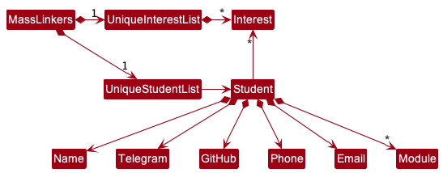

## Table of Contents
1. [Overview](#overview)
2. [Acknowledgements](#acknowledgements)
3. [Setting up, getting started](#setting-up-getting-started)
4. [Design](#design)
   * [Architecture](#architecture)
   * [UI Component](#ui-component)
   * [Logic Component](#logic-component)
   * [Model component](#model-component)
   * [Storage component](#storage-component)
   * [Common classes](#common-classes)
5. [Implementation](#implementation)
   * [Edit Feature](#edit-feature)
   * [Sort Feature](#sort-feature)
   * [Grade Feature](#grade-feature)
   * [Grade Prediction Feature](#grade-prediction-feature)
   * [Attendance Feature](#attendance-feature)
6. [Documentation, logging, testing, configuration, dev-ops](#documentation-logging-testing-configuration-dev-ops)
7. [Appendix: Requirements](#appendix-requirements)
   * [Product Scope](#product-scope)
   * [User Stories](#user-stories)
   * [Use Cases](#use-cases)
   * [Non-Functional Requirements](#non-functional-requirements)
   * [Glossary](#glossary)
8. [Appendix: Instructions for manual testing](#appendix-instructions-for-manual-testing) 

---

## **Overview**

Watson is a powerful **desktop database application** that reduces the administrative workload of **primary/secondary school teachers** greatly. 

It provides a **centralized** platform for teachers to handle and retrieve student data **conveniently**, namely: 
* student particulars 
* student grades
* student attendance

It is optimised for use via a **Command Line Interface (CLI)** while still having the benefits of a
Graphical User Interface (GUI).

This Developer Guide provides general information for developers interested in understanding
the design implementation of Watson for further development.

---

## **Acknowledgements**

| Code Author | Code Used    | Reason               |
|-------------|--------------|----------------------|
| e1010101    | [DateUtil](https://github.com/e1010101/ip/blob/master/src/main/java/util/DateUtils.java) | Ease of date parsing |

---

## **Setting up, getting started**

Refer to the guide [_Setting up and getting started_](SettingUp.md).

---

## **Design**

:bulb: **Tip:** The `.puml` files used to create diagrams in this document can be found in the [diagrams](https://github.com/se-edu/addressbook-level3/tree/master/docs/diagrams/) folder. Refer to the [_PlantUML Tutorial_ at se-edu/guides](https://se-education.org/guides/tutorials/plantUml.html) to learn how to create and edit diagrams.

### Architecture

The **_Architecture Diagram_** given above explains the high-level design of the App.

Given below is a quick overview of main components and how they interact with each other.

**Main components of the architecture**

**`Main`** has two classes called [Main](https://github.com/AY2223S1-CS2103T-T08-1/tp/blob/master/src/main/java/seedu/address/Main.java)
and [MainApp](https://github.com/AY2223S1-CS2103T-T08-1/tp/blob/master/src/main/java/seedu/address/MainApp.java). It is responsible for,

- At app launch: Initializes the components in the correct sequence, and connects them up with each other.
- At shut down: Shuts down the components and invokes cleanup methods where necessary.

[**`Commons`**](#common-classes) represents a collection of classes used by multiple other components.

The rest of the App consists of four components.

- [**`UI`**](#ui-component): The UI of the App.
- [**`Logic`**](#logic-component): The command executor.
- [**`Model`**](#model-component): Holds the data of the App in memory.
- [**`Storage`**](#storage-component): Reads data from, and writes data to, the hard disk.

**How the architecture components interact with each other**

The _Sequence Diagram_ below shows how the components interact with each other for the scenario where the user issues the command `delete 1`.

Each of the four main components (also shown in the diagram above),

- defines its _API_ in an `interface` with the same name as the Component.
- implements its functionality using a concrete `{Component Name}Manager` class (which follows the corresponding API `interface` mentioned in the previous point.

For example, the `Logic` component defines its API in the `Logic.java` interface and implements its functionality using the `LogicManager.java` class which follows the `Logic` interface. Other components interact with a given component through its interface rather than the concrete class (reason: to prevent outside component's being coupled to the implementation of a component), as illustrated in the (partial) class diagram below.

The sections below give more details of each component.

### UI component

The **API** of this component is specified in [UiManager.java](https://github.com/AY2223S1-CS2103T-T08-1/tp/blob/master/src/main/java/seedu/address/ui/UiManager.java)

The UI consists of a `MainWindow` that is made up of parts e.g.`CommandBox`, `ResultDisplay`, `StudentListPanel`, `StatusBarFooter` etc. All these, including the `MainWindow`, inherit from the abstract `UiPart` class which captures the commonalities between classes that represent parts of the visible GUI.

The `UI` component uses the JavaFx UI framework. The layout of these UI parts are defined in matching `.fxml` files that are in the `src/main/resources/view` folder. For example, the layout of the [`MainWindow`](https://github.com/se-edu/addressbook-level3/tree/master/src/main/java/seedu/address/ui/MainWindow.java) is specified in [`MainWindow.fxml`](https://github.com/se-edu/addressbook-level3/tree/master/src/main/resources/view/MainWindow.fxml)

The `UI` component,

- executes user commands using the `Logic` component.
- listens for changes to `Model` data so that the UI can be updated with the modified data.
- keeps a reference to the `Logic` component, because the `UI` relies on the `Logic` to execute commands.
- depends on some classes in the `Model` component, as it displays `Student` object residing in the `Model`.

We added a new UI component in our implementation: the `LoginWindow`.
The `LoginWindow` is a separate window that is displayed when the user first starts the application.
The `LoginWindow` is responsible for authenticating the user and retrieving the user's data from the `Storage` component.
The `LoginWindow` will then pass the user's data to the `MainWindow` so that the `MainWindow` can display the user's data.

`LoginWindow` inherits from the abstract `UiPart` class, just like the `MainWindow`.
As of 20/10/2022, it consists of 2 `TextBox` FXML components and a "submit" `Button` FXML component.

We also added a new UI component in our implementation: the `GradeWindow`.
The `GradeWindow` is a separate GUI window that is displayed when the user enters the `GradeCommand`.
The `GradeWindow` allows users to enter the `Grade` for an `Assesment` for all students taking a `Subject` as specified by the `GradeCommand`

---

### Logic component

**API** : [`Logic.java`](https://github.com/se-edu/addressbook-level3/tree/master/src/main/java/seedu/address/logic/Logic.java)

Here's a (partial) class diagram of the `Logic` component:

How the `Logic` component works:

1. When `Logic` is called upon to execute a command, it uses the `AddressBookParser` class to parse the user command.
1. This results in a `Command` object (more precisely, an object of one of its subclasses e.g., `AddCommand`) which is executed by the `LogicManager`.
1. The command can communicate with the `Model` when it is executed (e.g. to add a student).
1. The result of the command execution is encapsulated as a `CommandResult` object which is returned from `Logic`.

The Sequence Diagram below illustrates the interactions within the `Logic` component for the `execute("delete 1")` API call.

:information_source: **Note:** The lifeline for `DeleteCommandParser` should end at the destroy marker (X) but due to a limitation of PlantUML, the lifeline reaches the end of diagram.

Here are the other classes in `Logic` (omitted from the class diagram above) that are used for parsing a user command:

How the parsing works:

- When called upon to parse a user command, the `AddressBookParser` class creates an `XYZCommandParser` (`XYZ` is a placeholder for the specific command name e.g., `AddCommandParser`) which uses the other classes shown above to parse the user command and create a `XYZCommand` object (e.g., `AddCommand`) which the `AddressBookParser` returns back as a `Command` object.
- All `XYZCommandParser` classes (e.g., `AddCommandParser`, `DeleteCommandParser`, ...) inherit from the `Parser` interface so that they can be treated similarly where possible e.g, during testing.

---

### Model component

**API** : [`Model.java`](https://github.com/se-edu/addressbook-level3/tree/master/src/main/java/seedu/address/model/Model.java)

The `Model` component,

- stores the address book data i.e., all `Student` objects (which are contained in a `UniqueStudentList` object).
- stores the currently 'selected' `Student` objects (e.g., results of a search query) as a separate _filtered_ list which is exposed to outsiders as an unmodifiable `ObservableList<Student>` that can be 'observed' e.g. the UI can be bound to this list so that the UI automatically updates when the data in the list change.
- stores a `UserPref` object that represents the user’s preferences. This is exposed to the outside as a `ReadOnlyUserPref` objects.
- does not depend on any of the other three components (as the `Model` represents data entities of the domain, they should make sense on their own without depending on other components)

:information_source: **Note:** An alternative (arguably, a more OOP) model is given below. It has a `Tag` list in the `AddressBook`, which `Student` references. This allows `AddressBook` to only require one `Tag` object per unique tag, instead of each `Student` needing their own `Tag` objects. 

---

### Storage component

**API** : [`Storage.java`](https://github.com/se-edu/addressbook-level3/tree/master/src/main/java/seedu/address/storage/Storage.java)

The `Storage` component,

- can save both address book data and user preference data in json format, and read them back into corresponding objects.
- inherits from both `AddressBookStorage` and `UserPrefStorage`, which means it can be treated as either one (if only the functionality of only one is needed).
- depends on some classes in the `Model` component (because the `Storage` component's job is to save/retrieve objects that belong to the `Model`)

### Common classes

Classes used by multiple components are in the `seedu.addressbook.commons` package.

---

## **Implementation**

This section describes some noteworthy details on how certain features are implemented.

### Edit feature

#### Current Implementation

The edit command consists of these following classes:

- `EditCommand` which extends `Command`
- `EditCommandParser` which extends `Parser<EditCommand>`

As with all other commands, the edit command has a `Parser` subclass that goes through the `AddressBookParser` and a `Command` subclass that returns an appropriate new `CommandResult` Object.
It allows the editing of a student's name, phone, email, address, class, remarks and tags.

The command will be used as such:
- `edit INDEX [n/NAME] [p/PHONE] [e/EMAIL] [a/ADDRESS] [c/CLASS] [rem/REMARK] [t/TAG]`
- Words in `UPPER_CASE` are the inputs to be supplied by the user.
- Words in square brackets are optional, but at least one of them must be present.

---

### Sort feature

#### current Implementation

The sort command consists of these following classes:

- `SortCommand` which extends `Command`
- `SortCommandParser` which extends `Parser<SortCommand>`

As with all other commands, the sort command has a `Parser` subclass that goes through the `AddressBookParser` and a `Command` subclass that returns an appropriate new `CommandResult` Object. It sorts the list of students by their grades in ascending or descending order as specified by the user.

The command will be used as such:
- sort by English grade in ascending order - e.g.`sort asc s/ENGLISH`
- sort by Math grade in descending order - e.g. `sort desc S/MATH`

---

### Grade feature

#### current Implementation

The Grade command consists of these following classes:

- `GradeCommand` which extends `Command`
- `GradeCommandParser` which extends `Parser<GradeCommand>`
- `GradeWindow` which extends `UiPart`

As with all other commands, the Grade command has a `Parser` subclass that goes through the `AddressBookParser` and a `Command` subclass that returns an appropriate new `CommandResult` Object. It opens a new `GradeWindow` to start the grading process.

The command will be used as such:
- entering grades for an `Assignment` using the follow command format - `grade SUBJECT_NAME_TOTALSCORE_WEIGHTAGE_DIFFICULTY`,
e.g.`grade MATH_CA1_100_0.4_0.1`
- Words in `UPPER_CASE` are the inputs to be supplied by the user.

The command works in the following steps:  
1) Users enter the `GradeCommand` following the above specified format in the `CommandBox`, providing `Subject` and `Assessment` details such as assessment name, total score, weightage and difficulty  
2) `GradeCommandParser` will parse the `GradeCommand` to check whether the parameters provided are valid and return a `CommandResult` with a `StudentList`, which is a list of `Students` filtered by the specified `Subject`  
3) If the parameters are valid, a `GradeWindow` GUI will be opened which will prompt the user to enter the `Grade` of the first `Student` in the `StudentList` 
4) Once the grade is entered, the method `updateUiToNextStudent` will be called to update the `Student` specified in the `GradeWindow` to the next available `Student` in the `StudentList`.  
5) Repeat step 4 until  the grades of all `Students` in the `StudentList` have been entered accordingly.  

---

### Grade Prediction feature

#### current Implementation
Watson follows the following steps to predict a student's grade:

1) Calculate the percentage of classes attended by the student. Let's call this the student's **learning rating**.

For each of the student's previous assessments, perform the following procedure:

1.1. Take the difficulty of the assessment, then apply the following formula:

`(difficulty x learning rating)`

Let's call this number the **difficulty bonus**.

1.2. Add the **difficulty bonus** to the student's grade for the assessment.
We call this their **normalized score**.  
2) Take the average of the student's **normalized scores** for all their previous assessments,
   then add the difficulty of the assessment to predict. This is the final prediction!

The GradePrediction command consists of these following classes:

- `PredictionCommand` which extends `Command`
- `PredictionCommandParser` which extends `Parser<PredictionCommand>`
- `predictionUtil` utility class to handle the logic of grade prediction
- `predictionWindow` which extends `UiPart`

As with all other commands, the `PredictionCommand` command has a `Parser` subclass that goes through the `AddressBookParser` and a `Command` subclass that returns an appropriate new `CommandResult` Object. It opens a new GUI window to start the grading process

The command will be used as such:
-`predict n/NAME s/SUBJECT diff/DIFFICULTY`
- Words in `UPPER_CASE` are the inputs to be supplied by the user.

The command works in the following steps:  
1) Users enter the `PredictionCommand` following the above specified format in the `CommandBox`, providing the name of the `Student`, `Subject` and `Difficulty`  
2) `PredictionCommandParser` will parse the `PredictionCommand` to check whether the provided arguments are valid and return a `CommandResult`  
3) The `PredictGrade` method in `PredictionUtil` class will be used to predict the grade given the arguments provided  
4) A new `PredictionWindow` will be opened to display the predicted grade  

---

### Attendance feature

#### current Implementation

The Attendance command consists of these following classes:

- `AttendanceCommand` which extends `Command`
- `AttendanceCommandParser` which extends `Parser<Attendance>`

As with all other commands, the `AttendanceCommand` command has a `Parser` subclass that goes through the `AddressBookParser` and a `Command` subclass that returns an appropriate new `CommandResult` Object. It marks the attendance of students from a specified `studentClass` on a given `Date`

The command will be used as such:
- `markAtt d/DATE c/STUDENTCLASS ind/INDEXES` eg. `markAtt d/12-02-2023 c/1.2 ind/1 2 3`
- Words in `UPPER_CASE` are the inputs to be supplied by the user.

The command works in the following steps:  
1) Users enter the `AttendanceCommand` following the above specified format in the `CommandBox`, providing the `Date`, `StudentClass` and `Indexes` of students present  
2) `AttendanceCommandParser` will parse the `AttendanceCommand` to check whether the provided arguments are valid  
3) For each `Student` in the specified `StudentClass`, the `updateAttendance` method in the `Attendance` class is called to update the model to indicate whether the `Student` is present.  

---

## **Documentation, testing, logging, configuration, dev-ops**

- [Documentation guide](Documentation.md)
- [Testing guide](Testing.md)
- [Logging guide](Logging.md)
- [Configuration guide](Configuration.md)
- [DevOps guide](DevOps.md)

---

## **Appendix: Requirements**

### Product scope

**Target user profile**:

- are primary/secondary school teachers
- has a need to manage a significant number of students and their details
- prefer desktop apps over other types
- can type fast
- prefers typing to mouse interactions
- is reasonably comfortable using CLI apps
- needs to retrieve information of students quickly

**Value proposition**: manage and retrieve information of students faster than a typical mouse/GUI driven app

---

### User stories

Priorities: High (must have) - `* * *`, Medium (nice to have) - `* *`, Low (unlikely to have) - `*`

| Priority | As a ... | I want to ...                                           | so that I can ...                                     |
|----------|----------|---------------------------------------------------------|-------------------------------------------------------|
| `* * *`  | teacher  | add students and their particulars to the app           | keep track of the student's details                   |
| `* * *`  | teacher  | edit student's details                                  | update or make changes with new information if needed |
| `* * *`  | teacher  | search for certain students based on name/class/subject | retrieve student's information quickly                |
| `* * *`  | teacher  | view the list of all students and their details         | see all information stored clearly                    |
| `* * *`  | teacher  | grade my students                                       | keep track of their grades for each assessment        |
| `* * *`  | teacher  | mark students attendance                                | keep track of their daily attendance easily           |
| `* *`    | teacher  | allow only specific users into the system               | the information stored in Watson remains confidential |
| `* *`    | teacher  | add remarks to students                                 | remember important details about my students          |
| `* *`    | teacher  | sort my students by grade                               | see student's performance at a glance                 |
| `*`      | teacher  | import information from existing databases              | I can set up Watson quickly                           |

---

### Use cases

(For all use cases below, the **System** is the `Watson` and the **Actor** is the `user`, unless specified otherwise)

**Use case: View all students**

**Preconditions: User is logged in**

**MSS**

1.  User requests to list all students.
2.  Watson shows a list of all students.

    Use case ends.

**Extensions**

- 2a. The list is empty.

    - 2a1. Watson displays an empty list.

      Use case ends.

**Use case: Add a student**

**Preconditions: User is logged in**

**MSS**

1.  User requests to add a student and specifies details of the student.
2.  Watson adds a student.
3.  Student is added to the displayed list.

    Use case ends.

**Extensions**

- 2a. Missing required details of the student to be added.

    - 2a1. Watson shows an error message.

      Use case resumes at step 1.

**Use case: Edit a student**

**Preconditions: User is logged in**

**MSS**

1.  User requests to edit a student and specifies the index and parameters to edit.
2.  Watson edits a student and overwrites the parameters with the updated information.
3.  Student is updated in the displayed list.

    Use case ends.

**Extensions**

- 2a. Missing required parameters of the student to be edited.

    - 2a1. Watson shows an error message.

      Use case resumes at step 1.

- 2b. The given index is invalid.

    - 2b1. Watson shows an error message.

      Use case resumes at step 1.

**Use case: Delete a student**

**Preconditions: User is logged in**

**MSS**

1.  User requests to list students.
2.  Watson shows a list of students.
3.  User requests to delete a specific student in the list.
4.  Watson deletes the student.

    Use case ends.

**Extensions**

- 2a. The list is empty.

  Use case ends.

- 3a. The given index is invalid.

  - 3a1. Watson shows an error message.

    Use case resumes at step 2.

**Use case: Find a student**

**Preconditions: User is logged in**

**MSS**

1.  User enters a student's name and/or class and/or subject.
2.  Watson shows a list of students with name and/or class and/or subject corresponding to what was entered.
3.  User selects the student that he/she is looking for.
4.  Watson displays the full details of the student.

    Use case ends.

**Extensions**

- 2a. The list is empty.

  Use case ends.

**Use case: Add remarks to a student**

**Preconditions: User is logged in**

**MSS**

1.  User requests to add a remark to a student.
2.  Watson adds a remark to the specified student.
3.  Student is updated in the displayed list.

    Use case ends.

**Extensions**

- 2a. Missing remark.

    - 2a1. Watson shows an error message.

      Use case resumes at step 1.

- 2b. The given index is invalid.

    - 2b1. Watson shows an error message.

      Use case resumes at step 1.

**Use case: Grade students**

**Preconditions: User is logged in**

**MSS**

1. User requests to add grade of an assessment to students.
2. Watson shows window for user to enter grade for the specified assessment.
3. User enters grade for each student.
4. Students' grades are updated in the displayed list.

    Use case ends.

**Extensions**

- 2a. Invalid command given by user.

    - 2a1. Watson shows an error message.

      Use case resumes at step 1.

**Use case: Predicting a student's grade**

**Preconditions: User is logged in**

**MSS**

1. User requests to predict a student's grade.
2. Watson shows prediction of student's grade.

   Use case ends.

**Extensions**

- 2a. Missing/incorrect name/subject/difficulty entered by user.

    - 2a1. Watson shows an error message.

      Use case resumes at step 1.

**Use case: Sorting students by grades**

**Preconditions: User is logged in**

**MSS**

1. User requests to sort students by grade in ascending/descending order.
2. Watson shows list of students sorted by grades in ascending/descending order.

   Use case ends.

---

### Non-Functional Requirements

1. Should work on any _mainstream OS_ as long as it has Java `11` or above installed.
2. Should be able to hold up to 1000 students without a noticeable sluggishness in performance for typical usage.
3. A user with above average typing speed for regular English text (i.e. not code, not system admin commands) should be able to accomplish most of the tasks faster using commands than using the mouse.
4. Non-authenticated users should not be able to access the system.
5. The data should be saved everytime a command alters the data. 
6. Should work without an internet connection.
7. The User Guide and Developer Guide should be PDF-friendly.

### Glossary

- **Mainstream OS**: Windows, Linux, Unix, OS-X

---

## **Appendix: Instructions for manual testing**

Given below are instructions to test the app manually.

:information_source: **Note:** These instructions only provide a starting point for testers to work on;
testers are expected to do more *exploratory* testing.

### Launch and shutdown

1. Initial launch

   1. Download the jar file and copy into an empty folder

   2. Double-click the jar file Expected: Shows the GUI with a set of sample contacts. The window size may not be optimum.

2. Saving window preferences

   1. Resize the window to an optimum size. Move the window to a different location. Close the window.

   2. Re-launch the app by double-clicking the jar file. 
      Expected: The most recent window size and location is retained.

3. Shut down application

    1. Prerequisites: Application must currently be running.

    2. Test case: Close the application using any means other than the command `exit`.
       Expected: The application exits.

    3. Test case: Close the application using the command `exit`.
       Expected: The application exits.

### Adding a student

1. Adding a student while all students are being shown

    1. Prerequisites: List all students using the `list` command. Multiple students in the list.

    2. Test case: `add n/John Doe p/98765432 e/john@gmail.com a/2 Sengkang Avenue c/1A t/Student Council` 
       Expected: Student John Doe is added the list. Details of the added student shown in the status message.

    3. Test case: `add n/John Doe` 
       Expected: No student is deleted. Missing required details. Error details shown in the status message. Status bar remains the same.

    4. Other incorrect add commands to try: `add`, `add n/123`, `add p/abc`
       Expected: Similar to previous.

### Editing a student

1. Editing a student while all students are being shown

    1. Prerequisites: List all students using the `list` command. Multiple students in the list.

    2. Test case: `edit 1 n/John Doe p/98765432` 
       Expected: Phone number of John Doe is updated in the list. Details of the update shown in the status message.

    3. Test case: `edit 0 n/John Doe p/98765432` 
       Expected: No student is updated. Error details shown in the status message. Status bar remains the same.

    4. Other incorrect edit commands to try: `edit`, `edit x n/John Doe`(where x is a non-existent index)
       Expected: Similar to previous.

### Finding students

1. Finding students that shares the same subject.

    1. Prerequisites: List all students using the `list` command. Multiple students in the list.

    2. Test case: `find s/math` 
       Expected: All students that have the subject `math` in the list will be shown in a new list. Timestamp in the status bar is updated.

    3. Test case: `find s/engrish` 
       Expected: No student will be shown in a new list. Status bar remains the same.

    4. Other incorrect delete commands to try: `find s/`, `find s/x`, `...` (where x is a misspelled subject) 
       Expected: Similar to previous.

2. Finding students that belongs in the same class.

    1. Prerequisites: List all students using the `list` command. Multiple students in the list.

    2. Test case 1: `find c/1A` 
        Expected: All students that are in class 1A will be shown in a new list. Timestamp in the status bar is updated.

    3. Test case 2: `find c/1a` 
       Expected: Same result as Test case 1. Keywords given by user after `c/` are not case sensitive.

    4. Test case 3: `find c/2b` 
       Expected: No student will be shown in a new list as no one is in class 2B. Status bar remains the same.

    5. Other incorrect find commands to try: `find c/`, `find c/ `, `find c/x` (where x is a non-existent class) 
       Expected: Similar to Test case 3.

### Deleting a student

1. Deleting a student while all students are being shown

   1. Prerequisites: List all students using the `list` command. Multiple students in the list.

   2. Test case: `delete 1` 
      Expected: First contact is deleted from the list. Details of the deleted contact shown in the status message. Timestamp in the status bar is updated.

   3. Test case: `delete 0` 
      Expected: No student is deleted. Error details shown in the status message. Status bar remains the same.

   4. Other incorrect delete commands to try: `delete`, `delete x`, `...` (where x is larger than the list size) 
      Expected: Similar to previous.

### Adding remark to a student

1. Adding remark to a student while all students are being shown

    1. Prerequisites: List all students using the `list` command. Multiple students in the list.

    2. Test case: `remark 1 rem/Good at Math` 
       Expected: Remark of the student is updated in the list. Details of the update shown in the status message.

    3. Test case: `remark 0 rem/Good at Math` 
       Expected: No remark added. Error details shown in the status message. Status bar remains the same.

    4. Other incorrect remark commands to try: `remark`, `remark 1`
       Expected: Similar to previous.

### Grading students

1. Grading students while all students are being shown

    1. Prerequisites: List all students using the `list` command. Multiple students in the list.

    2. Test case: `grade MATH_Quiz1_10_0.5_3.5` 
       Expected: New window appears for the user to enter grades for each student.

    3. Test case: `grade ENGRISH_Quiz1_10_0.5_3.5` 
       Expected: No new window appears. Error details shown in the status message. Status bar remains the same.

    4. Other incorrect grade commands to try: `grade`, `grade MATH_Quiz1_10_0.5`
       Expected: Similar to previous.

### Sorting students by grade

1. Sorting students by grade while all students are being shown

    1. Prerequisites: List all students using the `list` command. Multiple students in the list.

    2. Test case: `sort asc s/ENGLISH` 
       Expected: Students in list sorted by grades in ascending order. Details of the update shown in the status message.

    3. Test case: `sort asc s/ENGRISH` 
       Expected: No update in list. Error details shown in the status message. Status bar remains the same.

    4. Other incorrect sort commands to try: `sort`, `sort asc`
       Expected: Similar to previous.

### Marking attendance of students
1. Marking attendance while all students are being shown

    1. Prerequisites: List all students using the `list` command. Multiple students in the list.
    2. Test case: `markAtt d/30-02-2023 c/1.2 ind/1 ` 
       Expected: Attendance of the first student provided in the example, Alex Yeoh will be marked
    3. Test case: `markAtt d/30-02-2023 ` 
       Expected: No update in list.  Error details shown in the status message. Status bar remains the same.
    4. Other incorrect sort commands to try: `markAtt`, `markAtt c/1.2`, `markAtt d/30-02-2023 c/1.2`
       Expected: Similar to previous.
### Saving data

1. Dealing with missing/corrupted data files

    1. Test case: Delete all data files 
       Expected: The application will start with an empty module and task list. The application will create a new data file
       when the user exits the application.

    2. Test case: Modify the date of one the students in the data file to be of an invalid format. 
       Expected: Similar to previous

    3. Test case: Modify the date of one the students in the data file, but maintain the same format. 
       Expected: The application boots up normally, with the saved data (if any), and the changes should be reflected on the UI.
