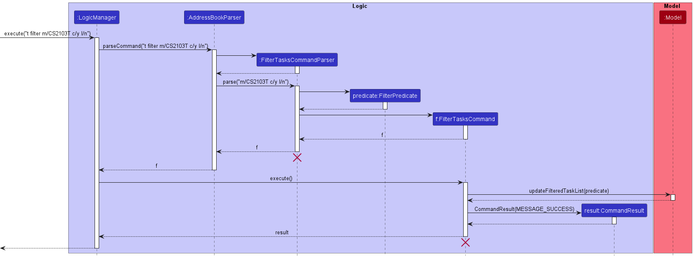
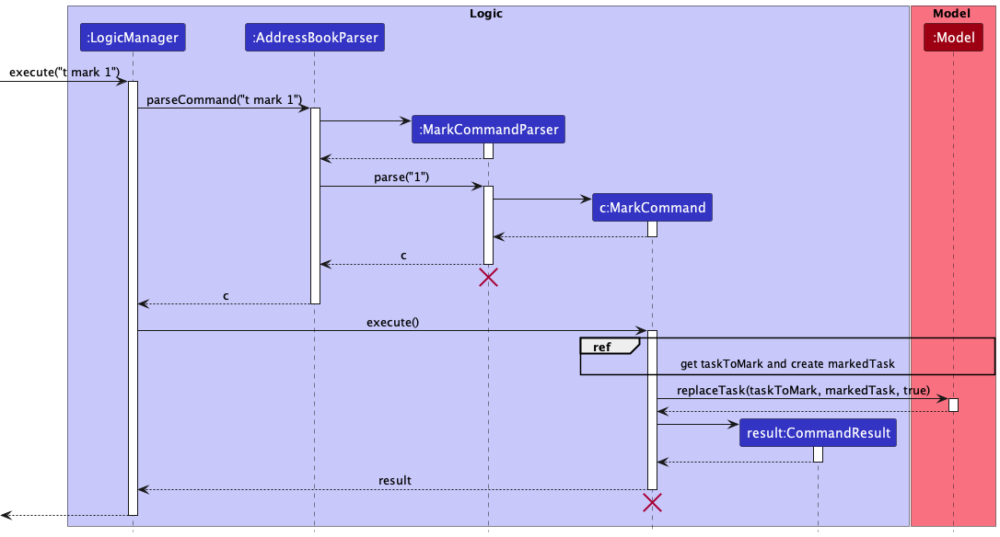
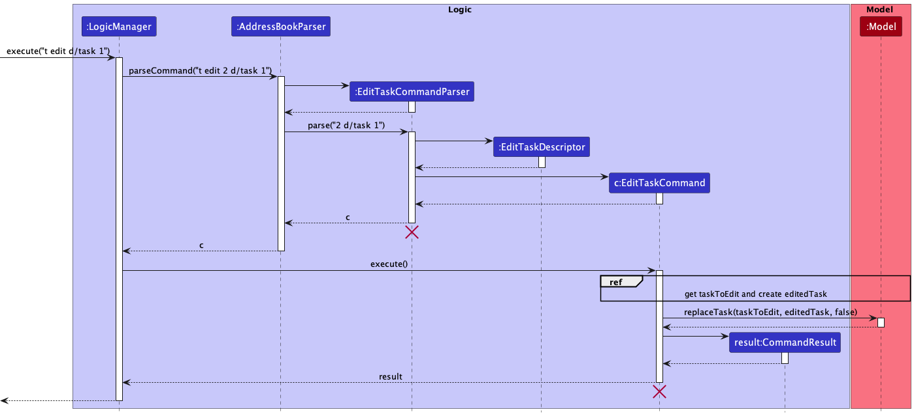
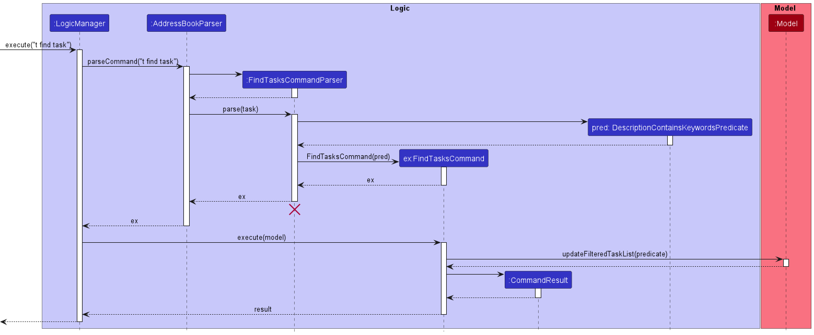
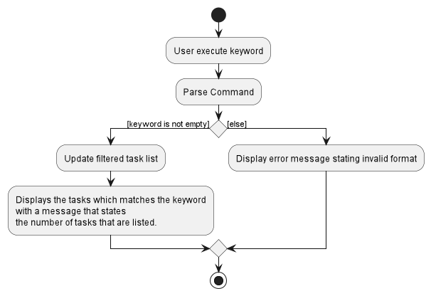

## **Table of Contents**
* Acknowledgements
* Setting up
* Design
  * Architecture
  * UI component
  * Logic component
  * Model component
  * Storage component
  * Common classes
* Implementation
* Documentation, logging, testing, configuration, dev-ops
* Appendix: Requirements
  * Product scope
  * User stories
  * Use cases
  * Non-Functional Requirements
  * Glossary
* Appendix: Instructions for manual testing
  * 

--------------------------------------------------------------------------------------------------------------------

## **Acknowledgements**

* {list here sources of all reused/adapted ideas, code, documentation, and third-party libraries -- include links to the original source as well}

--------------------------------------------------------------------------------------------------------------------

## **Setting up, getting started**

Refer to the guide [_Setting up and getting started_](SettingUp.md).

--------------------------------------------------------------------------------------------------------------------

## **Design**

:bulb: **Tip:** The `.puml` files used to create diagrams in this document can be found in the [diagrams](https://github.com/se-edu/addressbook-level3/tree/master/docs/diagrams/) folder. Refer to the [_PlantUML Tutorial_ at se-edu/guides](https://se-education.org/guides/tutorials/plantUml.html) to learn how to create and edit diagrams.

:information_source: **Note:** For some classes and methods such as AddressBookParser, our team has decided to 
stick with the naming convention used in AB3.

### Architecture

The ***Architecture Diagram*** given above explains the high-level design of the App.

Given below is a quick overview of main components and how they interact with each other.

**Main components of the architecture**

**`Main`** has two classes called 
[`Main`](https://github.com/AY2223S1-CS2103T-F11-2/tp/blob/master/src/main/java/seedu/address/Main.java) 
and 
[`MainApp`](https://github.com/AY2223S1-CS2103T-F11-2/tp/blob/master/src/main/java/seedu/address/MainApp.java). 
It is responsible for,
* At app launch: Initializes the components in the correct sequence, and connects them up with each other.
* At shut down: Shuts down the components and invokes cleanup methods where necessary.

[**`Commons`**](#common-classes) represents a collection of classes used by multiple other components.

The rest of the App consists of four components.

* [**`UI`**](#ui-component): The UI of the App.
* [**`Logic`**](#logic-component): The command executor.
* [**`Model`**](#model-component): Holds the data of the App in memory.
* [**`Storage`**](#storage-component): Reads data from, and writes data to, the hard disk.

**How the architecture components interact with each other**

The *Sequence Diagram* below shows how the components interact with each other for the scenario where the user issues the command `t delete 3`.

Each of the four main components (also shown in the diagram above),

* defines its *API* in an `interface` with the same name as the Component.
* implements its functionality using a concrete `{Component Name}Manager` class (which follows the corresponding API `interface` mentioned in the previous point.

For example, the `Logic` component defines its API in the `Logic.java` interface and implements its functionality using the `LogicManager.java` class which follows the `Logic` interface. Other components interact with a given component through its interface rather than the concrete class (reason: to prevent outside component's being coupled to the implementation of a component), as illustrated in the (partial) class diagram below.

The sections below give more details of each component.

### UI component

The **API** of this component is specified in [`Ui.java`](https://github.com/AY2223S1-CS2103T-F11-2/tp/blob/master/src/main/java/seedu/address/ui/Ui.java)

The UI consists of a `MainWindow` that is made up of parts e.g.`CommandBox`, `ResultDisplay`, `TaskListPanel`, 
`ModuleListPanel`, `ExamListPanel`, `StatusBarFooter` etc. 
All these, including the `MainWindow`, inherit from the abstract `UiPart` class which captures the commonalities between classes that represent parts of the visible GUI.

The `UI` component uses the JavaFx UI framework. The layout of these UI parts are defined in matching `.fxml` files that are in the `src/main/resources/view` folder. For example, the layout of the [`MainWindow`](https://github.com/AY2223S1-CS2103T-F11-2/tp/blob/master/src/main/java/seedu/address/ui/MainWindow.java) is specified in [`MainWindow.fxml`](https://github.com/AY2223S1-CS2103T-F11-2/tp/blob/master/src/main/resources/view/MainWindow.fxml)

The `UI` component,

* executes user commands using the `Logic` component.
* listens for changes to `Model` data so that the UI can be updated with the modified data.
* keeps a reference to the `Logic` component, because the `UI` relies on the `Logic` to execute commands.
* depends on some classes in the `Model` component, as it displays `Person` object residing in the `Model`.

### Logic component

**API** : [`Logic.java`](https://github.com/AY2223S1-CS2103T-F11-2/tp/blob/master/src/main/java/seedu/address/logic/Logic.java)

Here's a (partial) class diagram of the `Logic` component:

How the `Logic` component works:
1. When `Logic` is called upon to execute a command, it uses the `AddressBookParser` class to parse the user command.
1. This results in a `Command` object (more precisely, an object of one of its subclasses e.g., `AddModuleCommand`) which is executed by the `LogicManager`.
1. The command can communicate with the `Model` when it is executed (e.g. to add a module).
1. The result of the command execution is encapsulated as a `CommandResult` object which is returned back from `Logic`.

The Sequence Diagram below illustrates the interactions within the `Logic` component for the `execute("delete 1")` API call.

:information_source: **Note:** The lifeline for `DeleteCommandParser` should end at the destroy marker (X) but due to a limitation of PlantUML, the lifeline reaches the end of diagram.

Here are the other classes in `Logic` (omitted from the class diagram above) that are used for parsing a user command:

How the parsing works:
* When called upon to parse a user command, the `AddressBookParser` class creates an `XYZCommandParser` (`XYZ` is a placeholder for the specific command name e.g., `AddTaskCommandParser`) which uses the other classes shown above to parse the user command and create a `XYZCommand` object (e.g., `AddTaskCommand`) which the `AddressBookParser` returns back as a `Command` object.
* All `XYZCommandParser` classes (e.g., `AddTaskCommandParser`, `DeleteTaskCommandParser`, ...) inherit from the `Parser` interface so that they can be treated similarly where possible e.g, during testing.

### Model component
**API** : [`Model.java`](https://github.com/AY2223S1-CS2103T-F11-2/tp/blob/master/src/main/java/seedu/address/model/Model.java)

The `Model` component,

* stores the address book data 
  * all `Module` objects (which are contained in a `DistinctModuleList` object).
  * all `Task` objects (which are contained in a `DistinctTaskList` object)
  * all `Exam` objects (which are contained in a `DistinctExamList` object)
* stores the currently 'selected' `Module` objects (e.g after executing the find module commands) as a separate _filtered_ list which is exposed to outsiders as an unmodifiable `ObservableList<Module>` that can be 'observed' e.g. the UI can be bound to this list so that the UI automatically updates when the data in the list change.
* stores the currently 'selected' `Task` objects (e.g. after executing the find task command) as a separate _filtered_ list which is exposed to outsiders as an unmodifiable `ObservableList<Task>` that can be 'observed' e.g. the UI can be bound to this list so that the UI automatically updates when the data in the list change.
* stores the currently 'selected' `Exam` objects (e.g., results of a search query) as a separate _filtered_ list which is exposed to outsiders as an unmodifiable `ObservableList<Exam>` that can be 'observed' e.g. the UI can be bound to this list so that the UI automatically updates when the data in the list change.
* stores a `UserPref` object that represents the user’s preferences. This is exposed to the outside as a `ReadOnlyUserPref` objects.
* does not depend on any of the other three components (as the `Model` represents data entities of the domain, they should make sense on their own without depending on other components)

### Storage component

**API** : [`Storage.java`](https://github.com/AY2223S1-CS2103T-F11-2/tp/blob/master/src/main/java/seedu/address/storage/Storage.java)

The `Storage` component,
* can save both address book data and user preference data in json format, and read them back into corresponding objects.
* inherits from both `AddressBookStorage` and `UserPrefStorage`, which means it can be treated as either one (if only the functionality of only one is needed).
* depends on some classes in the `Model` component (because the `Storage` component's job is to save/retrieve objects that belong to the `Model`)

### Common classes

Classes used by multiple components are in the `seedu.addressbook.commons` package.

--------------------------------------------------------------------------------------------------------------------

## **Implementation**

This section describes some noteworthy details on how certain features are implemented.

### Sort Task Command

#### Command Format

`t sort c/CRITERIA` where `CRITERIA` refers to the criteria selected by the user.

`CRITERIA` can be one of the following criteria:
* `priority`
* `deadline`
* `module`
* `description`

#### What is the feature about

The `sort` command allows users to sort the task list by priority status,
deadline, module code and task description with ease. 

#### How does the feature work

The sort task feature is currently implemented through the `SortTaskCommand` which extends the abstract class `Command`.
The `SortTaskCommand`operates directly on the `ObservableList` stored under `DistinctTaskList` in `AddressBook` so the
`ObservableList` in `DistinctTaskList` will be permanently sorted to the criteria.
* When sorting by priority, all tasks with `HIGH` priority status will be positioned at the top of the 
displayed task list, followed by `MEDIUM`, `LOW` and 
lastly all tasks with no priority tags.
* When sorting by deadline, all tasks with deadline tags will be displayed 
at the top of the displayed task list with the task with the earliest deadline
being displayed at the top. All the remaining tasks with no deadline tags will
be displayed below all tasks with deadline tags.

#### Why is the feature implemented in this manner

Our team has made the decision to not remove tasks with no priority status from the displayed task list when
sorting by priority status as we believed that users should be given the freedom to view all tasks that
they have added after sorting.

Our team has also made a similar decision to not remove tasks with no deadlines from the displayed task list when
sorting by deadline.

#### UML Diagrams

Shown below is a sequence diagram of what occurs when the `execute` method of
`LogicManager` is invoked.

|  |
|:-------------------------------------------------------------:|
|             Sequence Diagram of Sort Task Command             |

:information_source: **Note:** The lifeline for `SortTaskCommandParser` and `SortTaskCommand` should end at the destroy marker (X) but due to a limitation of PlantUML, the lifeline reaches the end of diagram.

**Sequence of actions made when `execute` method of `LogicManager` is invoked**
1. `LogicManager` object takes in `t sort c/priority` which the user keys into the command line. 
2. `LogicManager` object calls the `parseCommand` of the `AddressBookParser` object created during the initialisation 
of `LogicManager` object and passes `t sort c/priority` as the arguments of `parseCommand`
3. `SortTaskCommandParser` object is created during execution of `parseCommand` of `AddressBookParser`
4. `SortTaskCommandParser` object calls its `parse` method with `c/priority` being passed in as argument.
5. `SortTaskCommand` object called st is created from `SortTaskCommandParser`
6. `execute` method of `SortTaskCommand` object st is invoked and model is passed in as
an argument.
7. `sortTaskList` method of model is called with `criteria` being passed as an
argument of the method.
8. The `getFilteredTaskList` method of model is called and it returns the `FilteredList<Task>` stored in model.
9. There is a check performed to see if the size of the `FilteredList<Task>` returned in the previous step is greater than 0.
If it is not greater than 0, an error message will be displayed.
8. The `execute` method of `SortTaskCommand` object returns a `CommandResult` object with
the sorted successfully message as its argument to the `LogicManager` object. 

The following activity diagram summarises what happens when SortTaskCommand is executed

|  |
|:-------------------------------------------------------------:|
|              Activity Diagram of SortTaskCommand              |

### Filter feature

#### Implementation

The proposed filter mechanism is facilitated by `FilterPredicate`. It implements `Predicate` with module and tast status conditions, stored as `moduleToCheck` and `statusToCheck`. Additionally, it implements the following operations:

* `FilterPredicate#test(Task)` — Checks if a task fulfils the given module and/or completion status requirements.
* `FilterPredicate#toString()` — Returns a string representing all the conditions used during the filter operation.

These operations are exposed in the `Model` interface as `Model#updateFilteredTaskList`.

Given below is an example usage scenario and how the filter mechanism behaves at each step.

Step 1. The user launches the application. The `AddressBook` will be initialized with the initial address book state.

Step 2. The user executes `filter m/CS2103T s/complete` command to filter the task list to show all CS2103T tasks that have been marked complete. The `filter` command calls `Model#UpdateFilteredTaskList`, causing the task list to be filtered with the given conditions for `moduleToCheck` and `statusToCheck`.

:information_source: **Note:** If the `moduleToCheck` or `statusToCheck` input is invalid, there will be an error message shown and the address book will continue to show the current `taskFilteredList`.

Step 3. The user executes `filter m/CS2103T s/imcomplete` command to filter the task list to show all CS2103T tasks that have been marked incomplete. The updated `taskFilterdList` will be filtered based on all the tasks, not only the ones which have been filtered out in the previous filter command from step 2.

Step 4. The user executes `mark 1`. The first task is no longer in `taskFilteredList` since its `statusToCheck` is now complete and no longer fulfils the conditions.

The following sequence diagram shows how the filter operation works:

 :information_source: **Note:** The lifeline for `FilterCommand` should end at the destroy marker (X) but due to a limitation of PlantUML, the lifeline reaches the end of diagram.

The following activity diagram summarizes what happens when a user executes the filter command:

#### Design considerations:

**Aspect: User command input format:**

* **Alternative 1 (current choice):** Optional condition fields.
    * Pros: Easier to extend and add more conditions.
    * Cons: Harder to implement.

* **Alternative 2:** Compulsory condition fields.
    * Pros: Easier to implement.
    * Cons: Users have to type unnecessary details in command.

### Mark Task Command

####Command Format

`t mark INDEX` where `INDEX` is the index (shown in the displayed task list) of the task to be marked.

####What is the feature about

The `t mark` command allows users to indicate a specific task is completed.
The task specified will be ticked.

####How does the feature work

The mark task feature is currently implemented through the `MarkTaskCommand` which extends the abstract class `Command`.
A copy of the task to be marked will be created, with its `TaskStatus` set to `COMPLETE`. This marked task will then replace the
original task in the `DistinctTaskList`.

####UML diagrams
Shown below is a sequence diagram of what occurs when the execute method of LogicManager is invoked.

|    |
|:----------------------------------------------------------------:|
|  |
|               Sequence diagram of MarkTaskCommand                |

:information_source: **Note:** The lifeline for `MarkCommandParser` and `MarkCommand` should end at the destroy marker (X) but due to a limitation of PlantUML, the lifelines reach the end of the diagram.

:information_source: **Note:** If the command fails, `Model#replaceTask()` will not be called, so the task list will not change. If so, `MarkCommand` will return an error to the user rather than attempting to perform the command.

**Sequence of actions made when `execute` method of `LogicManager` is invoked**

1. The user types the `t mark 1` command.
2. The `execute()` method of the `LogicManager` is called.
3. The `LogicManager` then calls `AddressBookParser#parseCommand()` which parses `t mark 1`, creating a `MarkCommandParser` object.
4. The `AddressBookParser` calls `MarkCommandParser#parse()` which parses `1` and creates a `MarkCommand` object with an `Index` object storing the target index `1`.
5. Then, the `LogicManager`calls `MarkCommand#execute()`.
6. The `MarkCommand` retrieves the task at the `Index`, which is the first task in the filtered task list, from the `Model`. 
7. The `MarkCommand` command calls `Task#mark()` to create a marked copy of the `taskToMark`.
8. This `markedTask` has all fields similar to the original task, except its `TaskStatus` is `COMPLETE`.
9. Then, `MarkCommand` calls `Model#replaceTask()` which replaces the `taskToMark` in the filtered task list in `Model` with the `markedTask`.

:information_source: **Note:** The `UnmarkCommand` works the same — the only difference is that it calls `Task#unmark()`, which returns a copy of the task with `TaskStatus` set to `INCOMPLETE`.

  
The following activity diagram summarizes what happens when MarkCommand is executed
  
|  |
|:--------------------------------------------------------------:|
|              Activity diagram of MarkTaskCommand               |

### Edit Task Command

####Command Format

`t edit INDEX [m/MODULE]* [d/DESCRIPTION]*` where `INDEX` is the index of the task to edit, and `MODULE` and `DESCRIPTION` are the module and description to replace the current values of the specified task.

####What is the feature about

The `t edit` command allows users to update the specified task with the fields provided. The provided fields will replace the existing fields.

####How does the feature work

The edit task feature is currently implemented through the `EditTaskCommand` which extends the abstract class `Command`.
A copy of the task to be edited will be created, with its existing `MODULE` and `DESCRIPTION` replaced with the new
values provided. This edited task will then replace the
original task in the `DistinctTaskList`.

####UML diagrams
Shown below is a sequence diagram of what occurs when the `execute` method of
`LogicManager` is invoked.

|    |
|:----------------------------------------------------------------:|
|  |
|               Sequence diagram of EditTaskCommand                |

:information_source: **Note:** The lifelines for `EditTaskCommandParser` and `EditTaskCommand` should end at the destroy marker (X) but due to a limitation of PlantUML, the lifelines reach the end of the diagram.

:information_source: **Note:** If the command is invalid, `Model#replaceTask()` will not be called, so the task list will not change. If so, `EditTaskCommand` will return an error to the user rather than attempting to perform the command.

**Sequence of actions made when `execute` method of `LogicManager` is invoked**

1. The user types the `t edit 1 d/task 1` command.
2. The `execute()` method of the `LogicManager` is called.
3. The `LogicManager` then calls `AddressBookParser#parseCommand()` which parses `t edit 1 d/task 1`, creating an `EditTaskCommandParser` object.
4. The `AddressBookParser` calls `EditTaskCommandParser#parse()` which parses `1 d/task 1` and creates an `EditTaskCommand` object with an `Index` object storing the target index `1` and an `EditTaskDescriptor` object storing the description `task 1` in a `TaskDescription` object.
5. Then, the `LogicManager`calls `EditTaskCommand#execute()`.
6. The `EditTaskCommand` retrieves the task at the `Index`, which is the first task in the filtered task list, from the `Model`.
7. The `EditTaskCommand` command calls `Task#edit()` with the `EditTaskDescriptor` passed as the argument.
8. The `Task#edit()` method checks that the module of the `taskToEdit` is not changed, so it creates a copy of the `taskToEdit`, with only the description changed. If `taskToEdit` has a linked exam, `linkedEditedTask` is also linked to the same exam.
9. This `linkedEditedTask` has all fields similar to the original task, except its `TaskDescription` is changed to `Task 1`.
10. Then, the `EditTaskCommand` calls `Model#replaceTask()` which replaces the `taskToEdit` in the filtered task list in `Model` with the `linkedEditedTask`.

The following activity diagram summarizes what happens when EditTaskCommand is executed

|    |
|:----------------------------------------------------------------:|
|        Activity diagram of EditTaskCommand                       |

### Link Exam feature

#### Command Format

`e link e/EXAM_INDEX t/TASK_INDEX` where `EXAM_INDEX` refers to the index number of the displayed exam list
and `TASK_INDEX` refers to the index number of the displayed task list.

#### What is the feature about

The link exam feature allows users to link an exam in the exam list to a task in the task list.

#### How does the feature work

The link exam feature is currently implemented through the `LinkExamCommand` class which extends the abstract class `Command`
. The `LinkExamCommand` takes in two `Index` objects, one being the exam index and the other being
the task index.

When the user invokes the`execute` method of `LinkExamCommand`,
the `Task` and `Exam` stored at the specified index of the `FilteredList<Task>` and the
`FilteredList<Exam>` respectively are retrieved.

There will be checks to see if the `Task` is already linked to the exam and if
the module code of the `Exam` is same as that of `Task`. Once these checks are passed,
the `Task` will be linked to the `Exam`

#### UML Diagrams

Shown below is a sequence diagram of what occurs when the `execute` method of
`LogicManager` is invoked.

|   |
|:--------------------------------------------------------------:|
|              Sequence diagram of LinkExamCommand               |

:information_source: **Note:** The lifeline for `LinkExamCommandParser` and `LinkExamCommand` should end at the destroy marker (X) but due to a limitation of PlantUML, the lifeline reaches the end of diagram.

**Sequence of actions made when `execute` method of `LogicManager` is invoked**
1. `LogicManager` object takes in `e link e/1 t/1` which the user keys into the command line.
2. `LogicManager` object calls the `parseCommand` of the `AddressBookParser` object created during the initialisation
   of `LogicManager` object and passes `e link e/1 t/1` as the arguments of `parseCommand`.
3. `LinkExamCommandParser` object is created during execution of `parseCommand` of `AddressBookParser`.
4. `LinkExamCommandParser` object calls its `parse` method with `e/1 t/1` being passed in as argument.
5. `LinkExamCommand` object called le is created from `LinkExamCommandParser`.
6. `execute` method of `LinkExamCommand` object le is invoked and model is passed in as
   an argument.
7. `LinkExamCommand` calls the `getFilteredTaskList` method of `Model` and the `FilteredList<Task>` stored in model is
   returned.
8.  `LinkExamCommand` calls the `getFilteredExamList` method of `Model` and the `FilteredList<Exam>` stored in model is
    returned.
9. `Task` object called task is returned when `get` method of `List<Task>` is executed.
10. task calls its own method `isLinked` and returns whether the task is linked. If the task is linked,
    an error message will be displayed.
11. `Exam` object called exam is returned when `get` method of `List<Exam>` is executed.
12. task calls its own method `getModule` and the `Module` stored in task will be returned.
13. exam calls its own method `getModule` and the `Module` stored in Exam will be returned.
14. The static method `isSameModule` of `Module` class is executed, and it checks whether task and exam
    have the same module code. If they do not have the same module code, an error message will be displayed.
15. The `linkTask` method of `model` will be executed, and it will create a new `Task` object called linkedTask
16. The `replaceTask` method of `model` will be executed and replaces task in `DistinctTaskList` in model with
    linkedTask
17. The `execute` method of `LinkExamCommand` returns a `CommandResult` object with
    the exam linked successfully message as its argument to the `LogicManager` object.

The following activity diagram summarises what happens when LinkExamCommand is executed

|   |
|:--------------------------------------------------------------:|
|              Activity diagram of LinkExamCommand               |

### Add Exam Feature

#### Command Format: 
`e add m/MODULE ex/EXAM DESCRIPTION ed/EXAM DATE`
where `MODULE` refers to the exam module, `EXAM DESCRIPTION` refers to the exam description and `EXAM DATE` refers to the exam date of the exam 
to be added into the exam list. 

#### What is the feature about: 
This command allows users to add an exam to the exam list, with the following fields of exam module, exam description 
and exam date. 

#### How does the feature work: 
This add exam feature is currently implemented through AddExamCommand class which extends the abstract class Command. 
If the module, exam description and exam date are valid, and the module exists in the module list, and the exam is not a duplicate of any existing exam, 
the exam will be added to the `DistinctExamList`. 

#### UML Diagrams
Shown below is a sequence diagram of what occurs when the execute method of LogicManager is invoked.

|   |
|:------------------------------------------------------------:|
|              Sequence diagram of AddExamCommand              |

Step 1. The user types an `e add m/cs2030s ex/midterms ed/20-12-2022` command. 

Step 2. The command calls `LogicManager#execute()` with 
the command input as the argument, which then calls `AddressBookParser#parseCommand() ` 
with command input as the argument. 

Step 3. `AddressBookParser#parseCommand()` matches the command to be 
an add exam command through the command word and the feature type, which then calls `AddExamCommandParser#parse()`.

Step 4. `AddExamCommandParser#parse()` then parses `m/cs2030s ex/midterms ed/20-12-2022` to get `Module`, `ExamDescription` 
and the `ExamDate` objects of the exam by calling their respective `ParserUtil` parse methods.
Then, an `Exam` object is created with the three objects as arguments. 

Step 5. `AddExamCommandParser#parse()` returns a new `AddExamCommand` object created with the `Exam`
object created previously as the argument in the constructor. `LogicManager` object will call 
`AddExamCommand#execute()` with a `Model` object as the argument. 

Step 6. `AddExamCommand#execute()` will check if model already contains the module of the exam 
through `Model#hasModule()`. If it does not contain the module, an exception will be thrown to 
indicate the module is not found. It will also check if the model already contains the exam 
through `Model#hasExam()`. If it contains the exam, an exception will be thrown 
to indicate that the exam already exists in MODPRO. 

Otherwise, it will call `ModelManager#addExam()` with the exam as the argument, 
which calls `AddressBook#addExam()` that will add the exam to the `DistinctExamList`, 
which stores all the exams.`AddExamCommand#execute()` method returns a `CommandResult` 
object to display that the exam was successfully added.

:information_source: **Note:**

* For step 4, the `Exam` object will not be created if the exam description or exam date or module 
is not valid. Exam description is not valid if it is an empty string, exam date is not valid 
if it is not in DD-MM-YYYY or if it is earlier than the current date. Module is not valid if it is not at least 6 characters long
with the first 2 being alphabetical characters. Hence, in such cases, `Exam` object is not created, and the exam will not be added.

The following activity diagram summarises what happens when AddExamCommand is executed

|   |
|:-------------------------------------------------------------:|
|               Activity diagram of AddExamCommand              |

  
### Find Tasks Feature

#### Command Format:
`t find KEYWORD` where `KEYWORD` is the keyword inputted by user.

#### What is the feature about: 
The command allows users to find tasks whose task description matches the keyword inputted by them fully or partially.
The keyword is case-insensitive. For example, "TASK" will match "task".

#### Why is the feature implemented in this way: 
It is implemented such that users can find tasks that contain the keyword not just fully but also partially. 
This can be helpful especially if they cannot remember the full description of the task. 
Also, if they want quick access to the task, they can simply type a partial description to find the task instead of writing the whole description.

#### UML Diagrams:
Shown below is a sequence diagram of what occurs when the execute method of LogicManager is invoked.

|   |
|:----------------------------------------------------------------:|
|               Sequence diagram of FindTasksCommand               |

Step 1. The user types an `t find task` command.

Step 2. The command calls `LogicManager#execute()` with
the command input as the argument, which then calls `AddressBookParser#parseCommand() `
with command input as the argument.

Step 3. `AddressBookParser#parseCommand()` matches the command to be
a find tasks command through the command word and the feature type, which then calls `FindTasksCommandParser#parse()` which takes in `task` as its argument.

Step 4. `FindTasksCommandParser#parse()` will create a `DescriptionContainsKeywordsPredicate` object which is a predicate that takes in the keyword inputted by user and
tests if the task description matches the keyword- `task`
Then it will create and return  `FindTasksCommand` object,that takes in a single argument-the `DescriptionContainsKeywordsPredicate` object, 
 to `LogicManager` object.

Step 5.  `LogicManager` object will call `FindTasksCommand#execute()` with a `Model` object as the argument.
`FindTasksCommand#execute()` will call `Model#updateFilteredTaskList` to update the filtered task list
by the predicate (which is the `DescriptionContainsKeywordsPredicate` object created previously) to only 
display the tasks which match the keyword. Then, a `CommandResult` object is returned to the `LogicManager` object.

:information_source: **Note:**

* For Step 4, `FindTasksCommandParser#parse` will not return a new `FindTasksCommand` object if the keyword is empty. 

The following activity diagram summarises what happens when FindTasksCommand is executed

|  |
|:----------------------------------------------------------------:|
|               Activity diagram of FindTasksCommand               |

--------------------------------------------------------------------------------------------------------------------

## **Documentation, logging, testing, configuration, dev-ops**

* [Documentation guide](Documentation.md)
* [Testing guide](Testing.md)
* [Logging guide](Logging.md)
* [Configuration guide](Configuration.md)
* [DevOps guide](DevOps.md)

--------------------------------------------------------------------------------------------------------------------

## **Appendix: Requirements**

### Product scope

**Target user profile**:

* has a need to manage a significant number of modules, tasks and exams
* prefer desktop apps over other types
* can type fast
* prefers typing to mouse interactions
* is reasonably comfortable using CLI apps

**Value proposition**: manage module tasks faster than a typical mouse/GUI driven app

### User stories

Priorities: High (must have) - `* * *`, Medium (nice to have) - `* *`, Low (unlikely to have) - `*`

| Priority | As a …​        | I want to …​                                                 | So that I can…​                                                                                      |
|---------|----------------|--------------------------------------------------------------|------------------------------------------------------------------------------------------------------|
| `* * *` | NUS student    | view a help guide on how to use the list of commands         | refer to this guide when I forget some of the commands                                               |
| `* * *` | NUS student    | view the list of tasks I need to complete                    | start implementing those tasks.                                                                      |
| `* * *` | NUS student    | create the tasks in the tasklist                             | add the list of tasks that need to be completed                                                      |
| `* * *` | NUS student    | indicate a task is completed                                 | spend more time on other tasks.                                                                      |
| `* * *` | NUS student    | add modules to my module list                                | add the modules that I am currently taking to the module list                                        |
| `* * *` | NUS student    | delete the tasks in my tasklist                              | remove them if added wrongly.                                                                        |
| `* * *` | NUS student    | delete the modules in my modulelist                          | remove them if added wrongly.                                                                        |
| `* * *` | NUS student    | edit the modules in my modulelist                            | remove them if added wrongly.                                                                        |
| `* * *` | NUS student    | link the task in the task list to the exam in the exam list  | track the number of exam-related tasks                                                               |
| `* * *` | NUS student    | add my exams to the exam list                                | add my upcoming exams to the exam list to track my revision progress.                                |
| `* * *` | NUS student    | view the list of modules I have                              | see the modules I am taking and my study progress for the modules.                                   |
| `* * `  | NUS student    | tag the priority status of a task in the task list           | prioritise the task that I would like to complete first                                              |
| `* * `  | NUS student    | tag the deadline of a task in the task list                  | track the date that the task should be completed                                                     |
| `* * `  | NUS student    | edit the priority status tagged to a task in the task list   | change the priority of the task I would like to complete first                                       |
| `* * `  | NUS student    | edit the deadline tagged to a task in the task list          | change the deadline that I would like to complete the task                                           |
| `* * `  | NUS student    | delete the priority status tagged to a task in the task list | remove the priority status of tasks which have been added wrongly                                    |
| `* * `  | NUS student    | tag the priority status tagged to a task in the task list    | remove deadlines which I no longer want to track.                                                    |
| `* * `  | NUS student    | sort the tasks in the task list                              | organise the tasks in the task list.                                                                 |
| `* *`   | NUS student    | find a task by task description through a command            | quickly locate the task instead of having to go through the whole list of tasks just to find it.     |
| `* *`   | NUS student    | find a module by module code through a command               | quickly locate the module instead of having to go through the whole list of modules just to find it. |                                                   |                                                                                                 |
| `* *`   | NUS student    | edit the exams in the exam list                              | change and correct the exam details easily if I input the wrong details.                             |
| `* *`   | NUS student    | indicate a task is not completed                             | continue working on the task.                                                                        |
| `* *`   | NUS student    | edit the tasks in my task list                               | easily change and correct the details of my tasks.                                                   |

### Use cases

(For all use cases below, the **System** is the `MODPRO` and the **Actor** is the `NUS student`, unless specified otherwise)

**Use case: Add a task into task list**

**MSS**

1. User requests to add a task
2. MODPRO shows the task added

   Use case ends.

**Extensions**

* 1a. The given description is empty.

    * 1a1. MODPRO shows an error message.

      Use case ends.

**Use case: List tasks in task list**

**MSS**
1. NUS student requests to view all tasks in the stored task list
2. MODPRO displays the list of all tasks and display a message of "Listed all tasks".

   Use case ends.

**Extensions**
* 1a. The provided command is in an invalid command format.
  
    * 1a1. MODPRO shows an error message.  
      Use case ends.

**Use case: Indicate a task is completed**

**MSS**
1. NUS student requests to mark a specific task
2. MODPRO ticks the specified task
3. MODPRO updates the progress bar for the module and exam (if it exists) of the task

   Use case ends.

**Extensions**
* 1a. The provided command is in an invalid command format
    * 1a1. MODPRO shows an error message  
      Use case ends.
* 1b. The given index for the task is invalid
    * 1b1. MODPRO shows an error message  
      Use case ends.
* 1c. The task specified is already marked 
    * 1c1. MODPRO shows an error message  
      Use case ends.

**Use case: Indicate a task is not completed**

**MSS**
1. NUS student requests to unmark a specific task
2. MODPRO unticks the specified task
3. MODPRO updates the progress bar for the module and exam (if it exists) of the task

   Use case ends.

**Extensions**
* 1a. The provided command is in an invalid command format
    * 1a1. MODPRO shows an error message  
      Use case ends.
* 1b. The given index for the task is invalid
    * 1b1. MODPRO shows an error message  
      Use case ends.
* 1c. The task specified is already unmarked
    * 1c1. MODPRO shows an error message  
      Use case ends.

**Use case: Edit a task**

**MSS**
1. NUS student requests to edit the module or description of a specific task
2. MODPRO updates the specified task with the new values provided

   Use case ends.

**Extensions**
* 1a. The provided command is in an invalid command format
    * 1a1. MODPRO shows an error message  
      Use case ends.
* 1b. The given index for the task is invalid
    * 1b1. MODPRO shows an error message  
      Use case ends.
* 1c. Neither the module nor the description is provided.
    * 1c1. MODPRO shows an error message  
      Use case ends.
* 1d. The given module code is invalid
    * 1d1. MODPRO shows an error message  
      Use case ends.
* 1e. The given description is invalid
    * 1e1. MODPRO shows an error message  
      Use case ends.
* 1f. The given module does not exist in the module list
    * 1f1. MODPRO shows an error message  
      Use case ends.
* 1g. The module and description of the specified task are not changed.
    * 1g1. MODPRO shows an error message  
      Use case ends.
* 1h. The edited task is the same as another existing task in the task list
    * 1h1. MODPRO shows an error message  
      Use case ends. 
* 2a. The module of the specified task is changed and the specified task is linked to an exam
    * 2a1. MODPRO unlinks the task from its exam and updates the progress bar for the exam
    * 2a2. MODPRO updates the progress bar for both the current and previous module of the task 
      Use case ends.
* 2b. The module of the specified task is changed and the specified task is not linked to any exam
    * 2b1. MODPRO updates the progress bar for both the current and previous module of the task 
      Use case ends.

**Use Case: Add tags to a task**

**MSS**
1. NUS student requests to add a tag to a task in task list
2. MODPRO adds the tag to the task in the task list

   Use case ends.

**Extensions**
* 1a. The provided command is in an invalid command format
  * 1a1. MODPRO shows an error message  
  Use case ends.
* 1b. The given index for the task is invalid
  * 1b1. MODPRO shows an error message  
    Use case ends.
* 1c. The priority status provided is invalid
  * 1c1. MODPRO shows an error message  
  Use case ends
* 1d. The deadline provided is invalid
  * 1d1. MODPRO shows an error message  
  Use case ends
* 1e. The task already has a priority status
  * 1e1. MODPRO shows an error message  
  Use case ends
* 1f. The task already has a deadline
  * 1f1. MODPRO shows an error message  
  Use case ends

**Use Case: Edit the tags of a task**

**MSS**
1. NUS student requests to edit the tags of a task in task list
2. MODPRO edits the tag of the task in the task list

   Use case ends.

**Extensions**
* 1a. The provided command is in an invalid command format
    * 1a1. MODPRO shows an error message  
      Use case ends.
* 1b. The given index for the task is invalid
    * 1b1. MODPRO shows an error message  
      Use case ends.
* 1c. The priority status provided is invalid
    * 1c1. MODPRO shows an error message  
      Use case ends
* 1d. The deadline provided is invalid
    * 1d1. MODPRO shows an error message  
      Use case ends
* 1e. The task does not have a priority status
    * 1e1. MODPRO shows an error message  
      Use case ends
* 1f. The task does not have a deadline
    * 1f1. MODPRO shows an error message  
      Use case ends
* 1g. The priority status is the same as the priority status of the task
    * 1g1. MODPRO shows an error message  
      Use case ends
* 1h. The deadline is the same as the deadline of the task
    * 1h1. MODPRO shows an error message  
      Use case ends

**Use Case: Delete tags of a task**

**MSS**
1. NUS student requests to delete the tags of a task in task list
2. MODPRO deletes the tag of the task in the task list

   Use case ends.

**Extensions**
* 1a. The provided command is in an invalid command format
    * 1a1. MODPRO shows an error message  
      Use case ends.
* 1b. The given index for the task is invalid
    * 1b1. MODPRO shows an error message  
      Use case ends.
* 1c. The keywords provided is invalid
    * 1c1. MODPRO shows an error message  
      Use case ends
* 1d. The task does not have a priority status
    * 1d1. MODPRO shows an error message  
      Use case ends
* 1e. The task does not have a deadline
    * 1e1. MODPRO shows an error message  
      Use case ends

    
**Use case: Delete a task from the task list**

**MSS**
1. User requests to delete a specific task in the task list
2. MODPRO deletes the task

   Use case ends.

**Extensions**
* 1a. The given index is invalid.
    * 1a1. MODPRO shows an error message.  
      Use case ends.

**Use Case: Add a module to the module list**

**MSS**
1. NUS student requests to add a module to the module list
2. MODPRO adds the module to the module list

   Use case ends.

**Extensions**
* 1a. The provided command is in an invalid command format
    * 1a1. MODPRO shows an error message  
      Use case ends.
* 1b. The given module code is invalid
    * 1b1. MODPRO shows an error message  
      Use case ends.
* 1c. The given module name is invalid
    * 1c1. MODPRO shows an error message  
      Use case ends
* 1d. The given module credit is invalid
    * 1d1. MODPRO shows an error message  
      Use case ends
* 1e. The given module code already exists in the module list
  * 1e1. MODPRO shows an error message  
    Use case ends
* 1f. The given module name already exists in the module list
    * 1f1. MODPRO shows an error message  
      Use case ends
* 1g. The given module credit already exists in the module list
    * 1g1. MODPRO shows an error message  
      Use case ends

**Use case: Delete a module from the module list**

**MSS**
1. User requests to delete a specific module in the module list
2. MODPRO deletes the module

   Use case ends.

**Extensions**
* 1a. The given index is invalid.
    * 1a1. MODPRO shows an error message.  
      Use case ends.
* 1b. The module at the given index is tied to multiple tasks thus cannot be deleted
    * 1a1. MODPRO shows an error message.  
      Use case ends.

**Use case: Edit a module in the module list**

**MSS**
1. User requests to edit a specific module in the module list
2. MODPRO edits the module

   Use case ends.

**Extensions**
* 1a. The given index is invalid.
    * 1a1. MODPRO shows an error message.  
      Use case ends.
* 1b. The module at the given index is tied to multiple tasks thus cannot be edited
    * 1b1. MODPRO shows an error message.  
      Use case ends.
* 1c. The given module code is invalid 
    * 1c1. MODPRO shows an error message.  
      Use case ends.

**Use Case: Sort the task list**

**MSS**
1. NUS student requests to sort the task list
2. MODPRO sorts the task in the task list

   Use case ends.

**Extensions**
* 1a. The provided command is in an invalid command format
    * 1a1. MODPRO shows an error message  
      Use case ends.
* 1b. The given criteria is invalid
    * 1b1. MODPRO shows an error message  
      Use case ends.

**Use Case: Link the exam to a task**

**MSS**
1. NUS student requests to link the exam in the exam list to a task in the task list
2. MODPRO links the task to the exam

   Use case ends.

**Extensions**
* 1a. The provided command is in an invalid command format
    * 1a1. MODPRO shows an error message  
      Use case ends.
* 1b. The given index for the task is invalid
    * 1b1. MODPRO shows an error message  
      Use case ends.
* 1c. The given index for the exam is invalid
    * 1c1. MODPRO shows an error message  
      Use case ends.
* 1d. The task is already linked
    * 1d1. MODPRO shows an error message  
      Use case ends.
* 1e. The task and exam selected have a different module code
    * 1e1. MODPRO shows an error message  
      Use case ends.

**Use case: List modules in module list**

**MSS**
1. NUS student requests to view all modules in the stored module list.
2. MODPRO displays the list of all modules and display a message of "Listed all modules".

   Use case ends.

**Extensions**
* 1a. The provided command is in an invalid command format.
    * 1a1. MODPRO shows an error message.  
      Use case ends.
  
**Use case: Find tasks in the task list**

**MSS** 
1. NUS student requests to find tasks whose description matches the keyword inputted partially or fully.  
2. MODPRO show the list of tasks whose description matches the keyword partially or fully. 

   Use case ends. 

**Extensions**
* 1a. The keyword inputted is empty
    * 1a1. MODPRO shows an error message   
      Use case ends. 
* 1b. The provided command is in an invalid command format.
    * 1b1. MODPRO shows an error message.  
      Use case ends.

**Use case: Find modules in the module list**

**MSS**
1. NUS student requests to find modules whose module code matches the keyword inputted partially or fully.
2. MODPRO show the list of modules whose module code matches the keyword partially or fully.

   Use case ends.

**Extensions**
* 1a. The keyword inputted is empty
    * 1a1. MODPRO shows an error message  
      Use case ends.
* 1b. The provided command is in an invalid command format.
    * 1b1. MODPRO shows an error message.  
      Use case ends.
  
**Use case: Add an exam into the exam list** 

**MSS** 
1. NUS student requests to add an exam. 
2. MODPRO adds the exam into the exam list.

   Use case ends. 

**Extensions**
* 1a. The description of the exam is empty
    * 1a1. MODPRO shows an error message.  
      Use case ends. 
* 1b. The exam date provided is invalid. 
    * 1b1. MODPRO shows an error message.  
      Use case ends.
* 1c. Exam module does not exist in MODPRO.  
    * 1c1. MODPRO shows an error message.  
      Use case ends.
* 1d. The exam to be added is the same as another existing exam in the exam list. 
    * 1d1. MODPRO shows an error message.   
      Use case ends. 
* 1e. The module code provided is invalid. 
    * 1e1. MODPRO shows an error message.   
      Use case ends.
* 1f. The provided command is in an invalid command format. 
    * 1f1. MODPRO shows an error message.   
      Use case ends.
* 1g. Not all the fields(Exam description, Exam date, Module) are provided. 
    * 1g1. MODPRO shows an error message.  
      Use case ends. 

**Use case: Edit an exam in the exam list**

**MSS**
1. NUS student requests to edit a specific exam in the exam list by specifying the index number of the exam to be edited.  
2. MODPRO updates the specified exam with the new values provided.

   Use case ends. 

**Extensions**
* 1a. The given exam description is empty. 
    * 1a1. MODPRO shows an error message.  
      Use case ends.
* 1b. The given exam date is invalid. 
    * 1b1. MODPRO shows an error message.  
      Use case ends.
* 1c. The given exam module code is invalid.
    * 1c1.MODPRO shows an error message.   
      Use case ends. 
* 1d. The given exam module does not exist in MODPRO. 
    * 1d1. MODPRO shows an error message.   
      Use case ends. 
* 1e. The given index is invalid.
    * 1e1. MODPRO shows an error message.  
      Use case ends.
* 1f. The edited exam is the same as another existing exam in the exam list.
    * 1f1. MODPRO shows an error message.  
      Use case ends.
* 1g. The module and description and date of the exam are not changed. 
    * 1g1. MODPRO shows an error message   
      Use case ends. 
* 1h. The provided command is in an invalid command format.
    * 1h1. MODPRO shows an error message.  
      Use case ends.
* 1i. No fields are provided to edit the exam. 
    * 1i1. MODPRO shows an error message.  
      Use case ends. 
* 2a. The module of the specified exam is changed and the exam is linked to some tasks previously. 
    * 2a1. MODPRO unlinks these tasks from the exam, and the updates the progress bar of the exam.  
      Use case ends.

### Non-Functional Requirements

1.  Should work on any _mainstream OS_ as long as it has Java `11` or above installed. 

[//]: # (@@author dlimyy-reused)
[//]: # (Resued with modification from existing AB3)
2. Should be able to hold up to 1000 tasks without experiencing noticeable sluggishness in performance during typical usage

[//]: # (@@author)
3.  A user with above average typing speed for regular English text (i.e. not code, not system admin commands) should be able to accomplish most of the tasks faster using commands than using the mouse.

*{More to be added}*

### Glossary

* **Mainstream OS**: Windows, Linux, Unix, OS-X
* **GUI**: Graphical User Interface
* **UML** Unified Modeling Language
--------------------------------------------------------------------------------------------------------------------

## **Appendix: Instructions for manual testing**

Given below are instructions to test the app manually.

:information_source: **Note:** These instructions only provide a starting point for testers to work on;
testers are expected to do more *exploratory* testing.

### Launch and shutdown

1. Initial launch

    1. Download the jar file and copy into an empty folder

    1. Double-click the jar file Expected: Shows the GUI with a set of sample contacts. The window size may not be optimum.

1. Saving window preferences

    1. Resize the window to an optimum size. Move the window to a different location. Close the window.

    1. Re-launch the app by double-clicking the jar file. 
       Expected: The most recent window size and location is retained.

1. _{ more test cases …​ }_

### Adding a module
1. Adding a module into the module list
   1. Test case: `m add c/cs2100 m/Computer Organisation mc/4` 
      Expected: Module with the name `Computer Organisation`, module credit `4` and 
module code `cs2100` is added to the module list.
   2. Test case: `m add c/cs2100` 
      Expected: An error message will be displayed. There are missing compulsory fields for
   module name and module credit.
   3. Other incorrect add module commands to try: `m add`, `m add c/1111 m/module mc/4` 
   Expected: An error message will be displayed.

### Adding a tag to a task
1. Adding a tag to a task in the task list that is not tagged
   1. Prerequisites: The task selected must not be tagged with any tags. 
   2. Test case: `t tagadd 1 p/HIGH` 
      Expected: The task located at the first index in the displayed task list is tagged with the priority status `HIGH`.
   3. Test case: `t tagadd 1 dl/25-11-2022` 
      Expected: The task located at the first index in the displayed task list is tagged with the deadline of `25-11-2022`.
   4. Test case: `t tagadd 1 p/random` 
      Expected: An error message will be displayed. An invalid priority status is chosen.
   5. Other incorrect add tag commands to try: `t tagadd`, `t tagadd 2 dl/39-13-2000` 
    Expected: An error message will be displayed.
2. Adding a tag to a task in the task list that is tagged with only a priority status
   1. Prerequisites: The task selected must be tagged with a priority status.
   2. Test case: `t tagadd 1 p/HIGH` 
      Expected: An error message will be displayed. The task located at the first index in the displayed task list is already tagged with a priority status.
   3. Test case: `t tagadd 1 dl/25-11-2022' 
      Expected: The task located at the first index in the displayed task list is tagged with the deadline of `25-11-2022`.
   4. Other incorrect add tag commands to try: `t tagadd`, `t tagadd 2 dl/39-13-2000` 
      Expected: An error message will be displayed.
3. Adding a tag to a task in the task list that it tagged with only a deadline
   1. Prerequisites: The task selected must be tagged with a deadline. 
   2. Test case: `t tagadd 1 dl/25-11-2022`H` 
       Expected: An error message will be displayed. The task located at the first index in the displayed task list is already tagged with a deadline.
   3. Test case: `t tagadd 1 p/HIGH` 
      Expected: The task located at the first index in the displayed task list is tagged with the priority status `HIGH`.
   4. Other incorrect add tag commands to try: `t tagadd`, `t tagadd 2 dl/39-13-2000` 
      Expected: An error message will be displayed.

### Editing a tag of a task
1. Editing the tag of a task in the task list that is not tagged at all
    1. Prerequisite is that the task selected is not tagged with either the priority status or deadline
    2. Test case: `t tagedit 1 p/HIGH` 
        Expected: Error message is displayed. The task located at the first index in the displayed task list is not tagged with a priority status.
    3. Test case: `t tagedit 1 dl/25-11-2022` 
       Expected: Error message is displayed. The task located at the first index in the displayed task list is not tagged with a deadline.
    4. Test case: `t tagedit 1 p/random` 
       Expected: An error message will be displayed. An invalid priority status is chosen.
    5. Other incorrect edit tag commands to try: `t tagedit`, `t tagedit 2 dl/39-13-2000` 
       Expected: An error message will be displayed.
2. Editing the tag of a task in the task list that is tagged with a priority status
    1. Prerequisites: The task selected is tagged with only the priority status `HIGH`
    2. Test case: `t tagedit 1 p/HIGH` 
       Expected: An error message will be displayed. The task selected is tagged with the same priority status.
    3. Test case: `t tagedit 1 p/LOW` 
       Expected: The task located at the first index of the displayed task list is tagged with the priority status `LOW`
    4. Other incorrect edit tag commands to try: `t tagedit`, `t tagedit 2 dl/39-13-2000` 
       Expected: An error message will be displayed.
3. Editing the tag of a task in the task list that it tagged with a deadline
    1. Prerequisites: The task selected is tagged with only the deadline `25-11-2022`
    2. Test case: `t tagedit 1 dl/25-11-2022`H` 
        Expected: An error message will be displayed. The task selected is tagged with the same deadline.
    3. Test case: `t tagedit 1 dl/26-11-2022` 
       Expected: The task located at the first index in the displayed task list is tagged with the new deadline `26-11-2022`
    4. Other incorrect edit tag commands to try: `t tagedit`, `t tagedit 2 dl/39-13-2000` 
       Expected: An error message will be displayed.

### Deleting a tag of a task
1. Deleting the tag of a task in the task list that is not tagged at all
    1. Prerequisite is that the task selected is not tagged with either the priority status or deadline
    2. Test case: `t tagdel 1 t/priority` 
       Expected: Error message is displayed. The task located at the first index in the displayed task list is not tagged with a priority status.
    3. Test case: `t tagdel 1 t/deadline` 
       Expected: Error message is displayed. The task located at the first index in the displayed task list is not tagged with a deadline.
    4. Test case: `t tagdel 1 t/random` 
       Expected: An error message will be displayed. An invalid keyword is chosen.
    5. Other incorrect delete tag commands to try: `t tagdel`, `t tagdel -1 t/priority` 
       Expected: An error message will be displayed.
2. Deleting the tag of a task in the task list that is tagged with a priority status
    1. Prerequisites: The task selected is tagged with only a priority status
    2. Test case: `t tagdel t/priority` 
       Expected: The task located at the first index in the displayed task list will have its priority status removed.
    3. Test case: `t tagdel t/deadline` 
       Expected: An error message is displayed. The task does not have a deadline.
    4. Other incorrect delete tag commands to try: `t tagdel`, `t tagdel -1 t/priority` 
       Expected: An error message will be displayed.
3. Editing the tag of a task in the task list that it tagged with a deadline
    1. Prerequisites: The task selected is tagged with only a deadline
    2. Test case: `t tagdel t/priority`H` 
       Expected: An error message will be displayed. The task selected does not have a priority status
    3. Test case: `t tagdel t/deadline` 
       Expected: The task located at the first index in the displayed task list has its deadline removed.
   4. Other incorrect delete tag commands to try: `t tagdel`, `t tagdel -1 t/priority` 
      Expected: An error message will be displayed.

### Sorting the task list
1. Sorting the unfiltered task list
    1. Test case: `t sort c/priority` 
       Expected: Sorts all tasks in the unfiltered task list by priority status.
   2. Other incorrect sort task commands to try: `t sort`, `t sort c/low` 
       Expected: An error message will be displayed.
2. Sorting the filtered task list
    1. Prerequisite: Perform a `t filter` operation on the task list  
    2. Test case: `t sort c/priority` 
        Expected: Sorts all tasks in the filtered task list by priority status.
    3. Other incorrect sort task commands to try: `t sort`, `t sort c/low` 
       Expected: An error message will be displayed.

### Linking the exam to a task
1. Linking the exam to an unlinked task
   1. Prerequisite: The task selected is unlinked and the task and exam have the same module code
   2. Test case: `e link e/1 t/1` 
      Expected: Links the first task in the displayed task list with the first exam in the displayed exam list.
   3. Other incorrect link exam commands to try: `e link`, `e link e/-1 t/9999999999999999999` 
      Expected: An error message will be displayed.
2. Linking the exam to a linked task
    1. Prerequisite: The task selected is linked and the task and exam selected have the same module code
   2. Test case: `e link e/1 t/1` 
      Expected: An error message is displayed. The first task in the displayed task list is already linked.
   3. Other incorrect link exam commands to try: `e link`, `e link e/-1 t/9999999999999999999` 
      Expected: An error message will be displayed.

### Viewing the help window
1. Viewing the help window
   1. Test case: `help` 
   Expected: The help window will display on the screen
   2. Incorrect help command to try: `help123`
   Expected: An error message will be displayed

### Adding an exam 

1. Adding an exam to the exam list
    1. Prerequisite: the module `cs2030s` is present in the module list, and `cs2040s` is not present in module list. 
    2. Test case: `e add m/cs2030s ex/Finals ed/30-12-2023` 
       Expected: The exam with the module field as `cs2030s`, exam description as `Finals`, exam date as `30-12-2023` is added to the exam list.
    A message is displayed to show that the exam is added successfully.
    3. Test case: `e add m/cs2030s ex/Finals ed/30-13-2023` 
       Expected: Exam will not be added, and error message will be shown to say that the date provided is not in DD-MM-YYYY format. 
    4. Test case: `e add m/cs2040s ex/Finals ed/30-12-2023` 
       Expected: Exam will not be added, and error message will be shown to say that the module does not exist. 
    5. Test case: `e add m/cs2030s ex/ ed/30-12-2023` 
       Expected: Exam will not be added, and error message will be shown to say that the description of the exam should not be empty. 
    

### Editing an exam 
1. Editing an exam in the exam list.
    1. Prerequisite: the module `cs2030s` is present in the module list, and `cs2040s` is not present in module list and exam list only has 2 exams. 
    2. Test case: `e edit 1 m/cs2030s ex/Finals ed/30-12-2023` 
       Expected: The first exam in the exam list is edited by changing the module field to `cs2030s`, exam description to `Finals`, exam date to `30-12-2023`. 
       A message is displayed to show that the exam is edited successfully.
    3. Test case: `e edit 0 m/cs2030s ex/Finals ed/30-12-2023` 
       Expected: Exam will not be edited, and error message will be shown to say that the index should be greater than 0 and less than 2147483648 for the index of an exam.
    4. Test case: `e edit 1 m/cs2040s ex/Finals ed/30-12-2023` 
       Expected: Exam will not be edited, and error message will be shown to say that the module does not exist.
    5. Test case: `e edit 1 ex/ ed/30-12-2023` 
       Expected: Exam will not be edited, and error message will be shown to say that the description of the exam should not be empty.
    6. Test case: `e edit 1 ed/30-13-2023` 
       Expected: Exam will not be edited, and error message will be shown to say that the date provided is not in DD-MM-YYYY format.
    7. Test case: `e edit 4 ed/30-12-2023` 
       Expected: Exam will not be edited, and error message will be shown to say that the index should be more than 0 but less than 3.

### Finding a task  
1. Finding a task in the task list
   1. Prerequisite: The tasks with task descriptions as "WORK", "homework 1", "homewoRK 2", "past year paper" are inside the task list.
   2. Test case: `t find work`  
      Expected: The task list should display the 3 tasks with task description of "WORK", "homework 1", "homewoRK 2",with a message saying "3 tasks listed"
   3. Test case: `t find paper` 
      Expected: The task list should only display the task with the task description "past year paper", with a message saying "1 tasks listed"
   4. Test case: `t find assignment` 
      Expected: The task list should show no tasks displayed, with a message saying "0 tasks listed"

### Finding a module
1. Finding a module in the module list
    1. Prerequisite: The modules with module code as "CS2030s", "CS2040S", "CS3333" are inside the module list.
    2. Test case: `m find cs` 
       Expected: The module list should display the 3 modules with module code of "CS2030s", "CS2040S", "CS3333",with a message saying "3 modules listed"
    3. Test case: `m find 20` 
       Expected: The module list should display the 2 modules with the module code of "CS2030s", "CS2040S",with a message saying "2 modules listed".
    4. Test case: `m find 5555` 
       Expected: The module list should show no module displayed, with a message saying "0 modules listed"
    

### Listing modules
1. Listing modules in the stored module list
    1. Prerequisite: The modules with module code as "CS2030s", "CS2040S", "CS3333" are inside the module list, and a `m find 20` command is done.
    2. Test case: `m list` 
       Expected: The module list should now display the all 3 modules with module code of "CS2030s", "CS2040S", "CS3333",with a message saying "Listed all modules"

### Listing tasks
1. Listing tasks in the stored tasks list
    1. Prerequisite: The tasks with task descriptions as "WORK", "homework 1", "homewoRK 2", "past year paper" are inside the task list, and a `t find paper` command is done. 
    2. Test case: `t list`  
       Expected: The task list should now display the all 4 tasks with task descriptions of "WORK", "homework 1", "homewoRK 2", "past year paper",with a message saying "Listed all tasks"

2. _{ more test cases …​ }_

### Marking a task

1. Marking a task while all tasks are being shown 
   * Prerequisites: 
     * List all tasks using the `t list` command. 
     * The task list displays multiple tasks. 
   * Test case: `t mark 1` 
     Expected: 
     * First task in the list is ticked.
     * Details of the marked task shown in the feedback message.
     * Progress bar for the module of the task is updated. 
   * Test case: `t mark 0` 
     Expected:
     * No changes made to any tasks, exams or modules.
     * Error details shown in the feedback message. 
   * Test case: `t mark INDEX` (where `INDEX` is the index of a task that is already marked) 
     Expected: Similar to the previous test case.
   * Other invalid mark commands to try: `t mark `, `t mark asd`, `t mark INDEX` (where `INDEX` is larger than the list size) 
     Expected: Similar to the previous test case.

2. Marking a task with only some tasks shown 
   * Prerequisites:
     * Filter the tasks using the `t filter` command.
     * The task list displays multiple tasks. 
   * Test case: `t mark 1` 
     Expected:
     * First task in the list is ticked.
     * Details of the marked task shown in the feedback message.
     * Progress bar for the module of the task is updated. 
   * Test case: `t mark INDEX` (where `INDEX` is larger than the size of the displayed list but less than the size of the stored task list) 
     Expected:
     * No changes made to any tasks, exams or modules.
     * Error details shown in the feedback message.

3. Marking a task linked to an exam
    * Prerequisites:
      * The list contains a task linked to an exam.
      * The task shows the name of the exam.
    * Test case: `t mark INDEX` (where `INDEX` is the index of the linked task) 
      Expected:
      * The task specified is ticked.
      * Details of the marked task shown in the feedback message.
      * Progress bars for both the module of the task and the exam it is linked to, are updated.

### Editing a task

1. Editing a task while all tasks are being shown
    * Prerequisites: 
      * List all tasks using the `t list` command.
      * The task list displays multiple tasks.
      * There are no tasks with the description 'task 1'.
    * Test case: `t edit 1 d/task 1`
      Expected:
      * The description of the first task in the list is changed to 'task 1'.
      * Details of the edited task is shown in the feedback message.
    * Test case: `t edit 0 d/task 1` 
      Expected:
      * No changes made to any tasks, exams or modules.
      * Error details shown in the feedback message.
    * Other incorrect edit commands to try: `t edit d/task 1`, `t edit 1`, `t edit asd d/task 1`, `t edit INDEX d/task 1` (where `INDEX` is larger than the list size), `t edit 1 d/DESCRIPTION` (where `DESCRIPTION` is the current description of the first task in the list) 
      Expected: Similar to the previous test case.

2. Editing a task with only some tasks shown
    * Prerequisites:
      * Filter the tasks using the `t filter` command.
      * The task list displays multiple tasks but not all the tasks in the stored task list.
      * There are no tasks in the stored task list with the description 'task 1'.
    * Test case: `t edit 1 d/task 1` 
      Expected:
      * The description of the first task in the list is changed to 'task 1'.
      * Details of the marked task shown in the feedback message.
    * Test case: `t edit INDEX d/task 1` (where `INDEX` is larger than the size of the displayed list but less than the size of the stored task list) 
      Expected:
      * No changes made to any tasks, exams or modules.
      * Error details shown in the feedback message.

3. Editing a task with invalid parameters
    * Prerequisites:
        * There are no modules in the stored module list with the module code 'cs2030'.
        * The task list displays multiple tasks. 
    * Test cases: `t edit 1 m/cs2030`, `t edit 1 m/c`, `t edit 1 d/ ` 
      Expected:
        * No changes made to any tasks, exams or modules.
        * Error details shown in the feedback message.

4. Editing a task to be the same as another task
    * Prerequisites:
        * There are 2 modules in the stored module list.
        * The first 2 tasks in the list have the same module.
    * Test cases: `t edit 1 d/DESCRIPTION` (where DESCRIPTION is the description of the second task) 
      Expected:
        * No changes made to any tasks, exams or modules.
        * Error details shown in the feedback message.

5. Editing the module of a task linked to an exam
    * Prerequisites:
        * List all tasks using the `t list` command.
        * There are 2 modules in the stored module list, 1 exam in the exam list and 1 task in the task list.
        * The module of both the exam and the task is the first module in the module list.
        * The task is linked to the exam.
    * Test cases: `t edit 1 m/MODULE` (where `MODULE` is the module code of the second module in the list) 
      Expected:
        * The module of the task in the list is changed to `MODULE`.
        * A warning and the details of the edited task are shown in the feedback message.
        * Progress bars for the 2 modules are updated.

### Saving data

1. Dealing with missing/corrupted data files

    1. _{explain how to simulate a missing/corrupted file, and the expected behavior}_

2. _{ more test cases …​ }_

