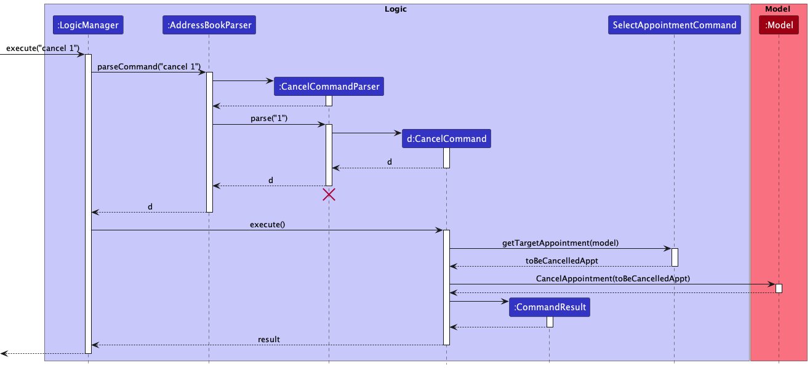
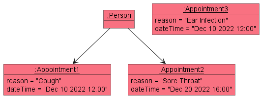

* Table of Contents
{:toc}

--------------------------------------------------------------------------------------------------------------------

## **Acknowledgements**

* In order to change the contents page for User Guide and Developer Guide to follow numbering order, we reused code from https://github.com/lesterong/tp/blob/master/docs/assets/css/style.scss with minor modifications.

--------------------------------------------------------------------------------------------------------------------

## **Setting up, getting started**

Refer to the guide [_Setting up and getting started_](SettingUp.md).

--------------------------------------------------------------------------------------------------------------------

## **Design**

:bulb: **Tip:** The `.puml` files used to create diagrams in this document can be found in the [diagrams](https://github.com/AY2223S1-CS2103T-T17-4/tp/tree/master/docs/diagrams) folder. Refer to the [_PlantUML Tutorial_ at se-edu/guides](https://se-education.org/guides/tutorials/plantUml.html) to learn how to create and edit diagrams.

### Architecture

The ***Architecture Diagram*** given above explains the high-level design of the App.

Given below is a quick overview of main components and how they interact with each other.

**Main components of the architecture**

**`Main`** has two classes called [`Main`](https://github.com/AY2223S1-CS2103T-T17-4/tp/blob/master/src/main/java/seedu/address/Main.java) and [`MainApp`](https://github.com/AY2223S1-CS2103T-T17-4/tp/blob/master/src/main/java/seedu/address/MainApp.java). It is responsible for,
* At app launch: Initializes the components in the correct sequence, and connects them up with each other.
* At shut down: Shuts down the components and invokes cleanup methods where necessary.

[**`Commons`**](#common-classes) represents a collection of classes used by multiple other components.

The rest of the App consists of four components.

* [**`UI`**](#ui-component): The UI of the App.
* [**`Logic`**](#logic-component): The command executor.
* [**`Model`**](#model-component): Holds the data of the App in memory.
* [**`Storage`**](#storage-component): Reads data from, and writes data to, the hard disk.

**How the architecture components interact with each other**

The *Sequence Diagram* below shows how the components interact with each other for the scenario where the user issues the command `delete 1`.

Each of the four main components (also shown in the diagram above),

* defines its *API* in an `interface` with the same name as the Component.
* implements its functionality using a concrete `{Component Name}Manager` class (which follows the corresponding API `interface` mentioned in the previous point.

For example, the `Logic` component defines its API in the `Logic.java` interface and implements its functionality using the `LogicManager.java` class which follows the `Logic` interface. Other components interact with a given component through its interface rather than the concrete class (reason: to prevent outside component's being coupled to the implementation of a component), as illustrated in the (partial) class diagram below.

The sections below give more details of each component.

### UI component

The **API** of this component is specified in [`Ui.java`](https://github.com/AY2223S1-CS2103T-T17-4/tp/blob/master/src/main/java/seedu/address/ui/Ui.java)

The UI consists of a `MainWindow` that is made up of parts e.g.`CommandBox`, `ResultDisplay`, `PersonListPanel`, `StatusBarFooter` etc. All these, including the `MainWindow`, inherit from the abstract `UiPart` class which captures the commonalities between classes that represent parts of the visible GUI.

The `UI` component uses the JavaFx UI framework. The layout of these UI parts are defined in matching `.fxml` files that are in the `src/main/resources/view` folder. For example, the layout of the [`MainWindow`](https://github.com/AY2223S1-CS2103T-T17-4/tp/blob/master/src/main/java/seedu/address/ui/MainWindow.java) is specified in [`MainWindow.fxml`](https://github.com/AY2223S1-CS2103T-T17-4/tp/blob/master/src/main/resources/view/MainWindow.fxml)

The `UI` component,

* executes user commands using the `Logic` component.
* listens for changes to `Model` data so that the UI can be updated with the modified data.
* keeps a reference to the `Logic` component, because the `UI` relies on the `Logic` to execute commands.
* depends on some classes in the `Model` component, as it displays `Person` and `Appointment` objects residing in the `Model`.

### Logic component

**API** : [`Logic.java`](https://github.com/AY2223S1-CS2103T-T17-4/tp/blob/master/src/main/java/seedu/address/logic/Logic.java)

Here's a (partial) class diagram of the `Logic` component:

How the `Logic` component works:
1. When `Logic` is called upon to execute a command, it uses the `AddressBookParser` class to parse the user command.
1. This results in a `Command` object (more precisely, an object of one of its subclasses e.g., `AddCommand`) which is executed by the `LogicManager`.
1. The command can communicate with the `Model` when it is executed (e.g. to add a person).
1. The result of the command execution is encapsulated as a `CommandResult` object which is returned back from `Logic`.

The Sequence Diagram below illustrates the interactions within the `Logic` component for the `execute("delete 1")` API call.

:information_source: **Note:** The lifeline for `DeleteCommandParser` should end at the destroy marker (X) but due to a limitation of PlantUML, the lifeline reaches the end of diagram.

Here are the other classes in `Logic` (omitted from the class diagram above) that are used for parsing a user command:

How the parsing works:
* When called upon to parse a user command, the `AddressBookParser` class creates an `XYZCommandParser` (`XYZ` is a placeholder for the specific command name e.g., `AddCommandParser`) which uses the other classes shown above to parse the user command and create a `XYZCommand` object (e.g., `AddCommand`) which the `AddressBookParser` returns back as a `Command` object.
* All `XYZCommandParser` classes (e.g., `AddCommandParser`, `DeleteCommandParser`, ...) inherit from the `Parser` interface so that they can be treated similarly where possible e.g, during testing.

### Model component
**API** : [`Model.java`](https://github.com/AY2223S1-CS2103T-T17-4/tp/blob/master/src/main/java/seedu/address/model/Model.java)

The `Model` component,

* stores the address book data i.e., all `Person` objects (which are contained in a `UniquePersonList` object) and all `Appointment` objects (which are contained in a
`UniqueAppointmentList` object).
* stores the currently 'selected' `Person` objects and `Appointment` objects (e.g., results of a search query) as separate _filtered_ lists which are exposed to outsiders as an unmodifiable `ObservableList<Person>` and `ObservableList<Appointment>` respectively that can be 'observed' e.g. the UI can be bound to these lists so that the UI automatically updates when the data in the lists change.
* stores a `UserPref` object that represents the user’s preferences. This is exposed to the outside as a `ReadOnlyUserPref` objects.
* does not depend on any of the other three components (as the `Model` represents data entities of the domain, they should make sense on their own without depending on other components)

:information_source: **Note:** An alternative (arguably, a more OOP) model is given below. It has a `Tag` list in the `AddressBook`, which `Person` references. This allows `AddressBook` to only require one `Tag` object per unique tag, instead of each `Person` needing their own `Tag` objects. 

### Storage component

**API** : [`Storage.java`](https://github.com/AY2223S1-CS2103T-T17-4/tp/blob/master/src/main/java/seedu/address/storage/Storage.java)

The `Storage` component,
* can save idENTify data, command history data and user preference data in json format, and read them back into corresponding objects.
* inherits from both `AddressBookStorage` and `UserPrefStorage`, which means it can be treated as either one (if only the functionality of only one is needed).
* depends on some classes in the `Model` component (because the `Storage` component's job is to save/retrieve objects that belong to the `Model`)

### Common classes

Classes used by multiple components are in the `seedu.addressbook.commons` package.

--------------------------------------------------------------------------------------------------------------------

## **Implementation**

This section describes some noteworthy details on how certain features are implemented.

### \[Implemented\] List patients/appointments feature

#### Implementation
The list patients/appointments mechanism is facilitated by the `UniquePersonList` and `UniqueAppointmentList`
respectively. They extend `Iterable` and store lists of `Person` and `Appointment`.

An example usage scenario of list patients/appointments is given below:

**Steps:**
1. After launching the application, user executes the command `find alex` to search for entries in both
`UniquePersonList` and `UniqueAppointmentList` that contains "alex". This causes entries in the list which
does not contain "alex" to be hidden from the GUI. This will set the premise of using `list patients` and
`list appts`.

2. When user wants to view the full list of patients again, he/she can enter the command `list patients`. Note that
this command only interacts with the `UniquePersonList` and not the `UniqueAppointmentList`, thus it will not modify
the displayed list of appointments in any way.

3. When user wants to view the full list of appointments again, he/she can enter the command `list appts`. Note that
   this command only interacts with the `UniqueAppointmentList` and not the `UniquePersonList`, thus it will not modify
   the displayed list of patients in any way.

To help you understand what is going on behind the scenes, here is a sequence diagram that demonstrates how
`list patients` work:

From the diagram, the `ListCommand` object passes the predicate to show all entries to the `ModelManager`, which
will call onto a JavaFX function to modify the displayed list. For `list appts`, it follows a similar
process as well.

**Aspect: How the command is implemented:**
* **Alternative 1 (current choice):** `list patients` and `list appts` as a command words.
  * Pros: No additional parser class required
  * Cons: `ListCommand#execute()` will have more lines of code.
* **Alternative 2:** `list` as a command word with arguments `patients` or `appts` following it.
  * Pros: Seems more aligned with other commands that require more than 1 word of input
  * Cons: Require an additional `ListCommandParser` to work; more lines of code required.

We ultimately went with Alternative 1 since we do not expect `list` to take in many different arguments.

### \[Implemented\] Cancel feature 

#### Implementation
The implemented cancel feature allows users to cancel a patient's appointment based on its index in the appointment list.  
It is implemented similar to other idENTify commands and it extends `SelectAppointmentCommand`, an abstract class which encapsulates  
operations which require selecting appointments from an appointment list. The logical flow of using this command is shown in the
activity diagram given below.

The `AddressBookParser` will first check for the `cancel` command word. The cancel command
is facilitated by the `CancelCommandParser` and `CancelCommand` classes. The `CancelCommandParser`
parses the user input and obtains the index inputted by the user, before creating the cancel command to
execute the deletion of the appointment from the current appointment list.
Given below is an overview of how the cancel command executes the deletion of an appointment to delete the
first appointment (index 1) in the appointment list:

#### Design considerations:

**Aspect: How we decided to choose the user command:**

* **Alternative 1 (current choice):** Select an appointment index from appointment list
  * Pros: More convenient for the end user to just choose the indexed appointment from the current appointment list.
  * Cons: The details of a patient's appointments will not be shown under the patient's details in the patient's list.

* **Alternative 2:** Use both patient and appointment index to select an appointment to delete.
  itself.
  * Pros: Intuitive if the user just wants to delete a specified patient's appointments.
  * Cons: Appointments will have to be shown under tha patient list which will clutter up the UI.

Our team decided to change the user input format of the cancel command from `cancel PATIENT_INDEX APPOINTMENT_INDEX`
to `cancel APPOINTMENT_INDEX`, so it is faster for
the user to key in, and also more similar to the other commands with only 1 index.

### \[Implemented\] Hide patients/appointments
- The `hide patients` command hides patients based on at least 1 tag or name given. If more than 1 tag or name is given,
then any patients that match that tag or name will be hidden.
For example, `hide patients t/nose t/ear` will hide all patients that has either a nose or ear tag.
- The `hide appts` command works in exactly the same way, but the conditions are the reason, tag, and status of
the appointment. For example, `hide appts s/marked` will hide all appointments that are marked.

#### Implementation
The key idea of hide and other organisational commands is to allow users to successively filter out patients,
so that they can operate on a small list that they are interested in. For example, `hide patients n/Alex` and then
followed by `hide patients t/ear` should apply both hide commands successively, each time hide is applied on the current
shown list instead of the entire patient list.

To implement this, and to ensure that hide works well with other organisational features such as find and unhide, we
maintain an overarching HiddenPredicateSingleton which captures the state of the current patient and appointment list.
This singleton serves as a global predicate which is updated every time an organisational command is entered.

Each time the command is executed, the current patient/appointment predicate will be combined with (AND operation)
a predicate that is the complement of the given condition, since entries that satisfy the model predicate will be shown
, and thus to hide we will have to apply a NOT operation to the given condition e.g `hide patients t/ear` means we should
combine the current patient list predicate with a predicate that will fail if the patient tag contains ear.
The activity diagram below will illustrate a hide patient process. A similar process applies for hide appointment.

#### Design considerations:
**Aspect: How hide patient/appointment executes:**

* **Current choice:** Making use of a singleton class to capture the state of the patient/appointment list at all times.

**Aspect: Whether hide should hide by any match or all match**
* **Current choice:** Making hide any match, meaning patients/appts that match any of the keywords will be hidden.
E.g: `hide appts s/unmarked t/ear` will hide all appointments that is either unmarked OR has a ear tag.
* **Alternative:** Making hide all match meaning `hide appts s/unmarked t/ear` only hides appointments that satisfy
both the status and tag conditions.
* We decided to go with any match so that it is easier for users if they want to hide many types of entries at one go,
as opposed to all match since the user will have to key in hide many times successively.

### \[Implemented\] Group Patient

The group mechanism implements the following operations:

* Group patients according to their tags.

The operation is exposed in the `Command` interface as `Command#GroupPatientCommand()`.

Given below is an example usage scenario and how the group mechanism behaves at each step.

Step 1. The user launches the application for the first time. The `idENTify` will be initialized with the initial
patient list.

Step 2. The user executes `group patients` command to group patients by their tags, causing the modified list of
patients after the `group patients` command executes to show on the screen.

The Sequence Diagram below illustrates the interactions within the `Logic` component for the `execute
("group patients")` API call.

The following activity diagram summarizes what happens when a user executes a new command:

#### Design considerations:

**Aspect: How group patients executes:**

* **Current choice:** Use a different comparator from default so that a heavy weight can be assigned to the value of a
  tag group where a patient belongs.

### \[Implemented\] Group Appointment

The group mechanism implements the following operations:

* Group appointments according to their tags or patient.

The operation is exposed in the `Command` interface as `Command#GroupAppointmentCommand()`.

Given below is an example usage scenario and how the group mechanism behaves at each step.

Step 1. The user launches the application for the first time. The `idENTify` will be initialized with the initial
appointment list.

Step 2. The user executes `group appts k/KEY` command to group appointments by their tags `(k/tag)` or patient `
(k/patient)`, causing the modified list of appointments after the `group appts k/KEY` command executes to show on 
the screen.

The Sequence Diagram below illustrates the interactions within the `Logic` component for the `execute
("group appts k/KEY")` API call.

The following activity diagram summarizes what happens when a user executes a new command:

#### Design considerations:

**Aspect: How group appointments executes:**

* **Current choice:** Use a different comparator from default so that a heavy weight can be assigned to the value of a
  tag group where a patient belongs or the patient attached to the appointment.

### \[Implemented\] Ungroup

The ungroup mechanism implements the following operations:

* Either ungroup appointments or ungroup patients.

The operation is exposed in the `Command` interface as `Command#UngroupCommand()`.

Given below is an example usage scenario and how the group mechanism behaves at each step.

Step 1. The user launches the application for the first time. The `idENTify` will be initialized with the initial
patient and appointment list.

Step 2. The user executes `group appts k/KEY` command to group appointments by their tags `(k/tag)` or patient `
(k/patient)`, causing the modified list of appointments after the `group appts k/KEY` command executes to show on
the screen or executes `group patients` command to group patients by their tags, causing the modified list of
patients after the `group patients` command executes to show on the screen.

Step 3. The user executes `ungroup appts` command to ungroup appointments or `ungroup patients` command to ungroup 
patients.

:information_source: **Note:** If the use has not group patients or 
appointments, ungroup commands will make no effect on the current addressbook list on the screen.

The Sequence Diagram below illustrates the interactions within the `Logic` component for the `execute
("ungroup")` API call.

The following activity diagram summarizes what happens when a user executes a new command:

#### Design considerations:

**Aspect: How ungroup executes:**

* **Current choice:** Use the default comparator for appointments or patients so that the specified list will sort 
  as default settings. To be more specific, the patient list will be sorted by patients' names and the appointemnt 
  list will be sorted by datetime.

### \[Implemented\] Book feature

#### Implementation

The `AddressBookParser` class checks for the `book` command word to begin. The book mechanism is facilitated by the `BookCommandParser` and `BookCommand` classes. The `BookCommandParser` implements the `Parser` interface and takes in the user input and parses it into an index and 3 string values. The 3 string values are obtained from the `ArgumentMultimap` that checks whether the user has inputted the 3 prefixes supported by this feature.

The 3 prefixes are:
* `r/` for reason
* `d/` for dateTime
* `pe/` for recurring time period (optional)

After retrieving the string values, the `BookCommandParser` executes the `ParserUtil#ParseAppointment()` to convert these values and create an `Appointment` object. A `BookCommand` object will then be created with the given index and `Appointment` object. The `BookCommand` object will retrieve the specified person in the `UniquePersonList` and adds the `Appointment` object to the person's list of appointments.

The newly added `Appointment` object will also be saved in the JSON file through the usage of a Jackson-friendly class `JsonAdaptedAppointment`.

Given below are some example usage scenarios and how the book feature behaves in each scenario.

Scenario 1: User inputs `book 1 r/Sore Throat d/2022-12-10 12:00`. 

The `ParserUtil` class will detect that both the given reason and date are valid, and creates an appointment object to be stored in the specified `Person`, 
only if the `Person` does not have an existing appointment at that date.

Scenario 2: User inputs an empty reason in the `r/` prefix.

The `ParserUtil` class will detect that the given reason is empty and throws a `CommandException`, which will feedback to the user that he has given an invalid reason.

Scenario 3: User inputs an invalid dateTime in the `d/` prefix, such as `2022-15-10 14:00`.

The `ParserUtil` class will detect that the given dateTime is invalid and throws a `CommandException`, which will feedback to the user that he has given an invalid dateTime.

Scenario 4: User inputs an invalid recurring time period in the `pe/` prefix, such as `1S`.

The `ParserUtil` class will detect that the given time period is invalid and throws a `CommandException`, which will feedback to the user that he has given an invalid time period.

Scenario 5: User tries to book an appointment with the same time as other appointments of the same person.

This object diagram illustrates the above scenario. As the specified person has already booked an appointmnet in `Dec 10 2022 12:00`, the newly created `Appointment` object will not be associated with the person. The `BookCommand` will throw a `CommandException`, which will feedback to the user that he tried to book an appointment at the same time as the other appointments.

The following sequence diagram helps to provide a clearer picture to how the book operation works:

The following Class diagram shows how serializing `Appointment` objects into JSON format is done.

`Appointment` objects are mapped to `JsonAdaptedAppointment` objects, so that they contain only relevant fields to store and works easier with Jackson.
These objects are stored in a list field of the `JsonAdaptedPerson` and are stored together in a single JSON file, for easier retrival and assignment when starting up the application.

#### Design Considerations:

**Aspect: Where to assign Appointment objects:**

* **Alternative 1 (current implementation):** Each person stores his own list of appointments, as well as the `UniqueAppointmentList` class storing the same objects.
  * Pros: Easier to keep track of which appointments are associated to which person for other appointment related features.
  * Cons: Must ensure both the person's appointments and `UniqueAppointmentList` appointments are equal, in edit/cancel/delete features.

* **Alternative 2:** `Appointment` objects are stored only in the `UniqueAppointmentList` class.
  * Pros: Easier to maintain as there's only one appointment object.
  * Cons: Harder and more costly to track of each person's appointments, especially if the person himself is edited or deleted in the process.

### Mark/Unmark feature

The execution of the `mark`/`unmark` is quite similar to each other, with some minor differences.

Given below is an example usage scenario, where the user enters `mark 1` as the input,
and how the mark mechanism behaves at each step.

The `unmark` command functions similiarly to `mark`, but with the use of `UnmarkCommandParser` and `UnmarkCommand`
classes in place of `MarkCommandParser` and `MarkCommand` respectively.
It also lacks the logic to add recurring appointments.

#### Design considerations:

**Aspect: How mark & unmark executes:**
* **Alternative 1 (current choice):** `MarkCommand` and `UnmarkCommand` takes in an `Index` denoting the appointment to
mark/unmark.
    * Pros: Easy to implement.
    * Cons: Will have to compute the actual appointment to mark `MarkCommand`/`UnmarkCommand` itself.

* **Alternative 2:** `MarkCommand` and `UnmarkCommand` takes in the `Appointment` to be marked as a parameter in its
constructor directly
    * Pros: Cohesiveness is increased, as it only needs to concern itself with marking/unmarking the appointment.
    * Cons: The `CommandResult` object generated at the end of the command will not have the `Index` of the appointment
  recorded in it. This makes it harder to debug using `CommandResult` when bugs occur.

### Find `execute()` implementation

The `find` command,
* Takes in 2 predicates `CombinedPersonPredicate` and `CombinedAppointmentPredicate`.
* `CombinedPersonPredicate` stores all person related search strings and tests for all patients that satisfies all
the search terms.
* `CombinedAppointmentPredicate` stores all appointment related search tags and tests for all appointments that
satisfies all the search terms.
* These 2 predicates are then used together in `FindCommand#execute()` to create a single predicate that displays all 
* the relevant patient and appointments.

#### Design considerations:

**Aspect: How to pass in search terms to `FindCommand`:**
* **Alternative 1:** Store all search terms in `FindCommand` and use `Predicate#and` to combine the
the search predicates.
    * Pros: Easy and quick to implement. No extra classes needed.
    * Cons: There is no way to override the `Predicate#equals()`. Testability of `FindCommand` would be low.

* **Alternative 2:** Create 1 class for each search term
(E.g `NameContainsSequencePredicate`, `AppointmentContainsReasonPredicate` etc.). Create a `CombinedPersonPredicate`
and a `CombinedAppointmentPredicate` that takes in all these 'lesser' predicates and combine them to form the actual
predicate to filter the list with.
    * Pros: Testability of `FindCommand` would be very high.
    * Cons: Large amount of classes needed. There would also be the issue of excessive duplication of code.
It would also be time-consuming to add in potential new predicates in the future as much more test cases would be needed
to test each individual class.

* **Alternative 3 (current choice):** Keep the `CombinedPersonPredicate` and `CombinedAppointmentPredicate`,
and store the relevant search terms into each predicate. Combine those search terms in the predicate class itself.
    * Pros: Testability of `FindCommand` would be high. Extending the method features in the future would also be
more efficient than alternative 2.
    * Cons: Slightly less testable than alternative 2. However, the increased efficiency is worth the tradeoff.

--------------------------------------------------------------------------------------------------------------------

## **Documentation, logging, testing, configuration, dev-ops**

* [Documentation guide](Documentation.md)
* [Testing guide](Testing.md)
* [Logging guide](Logging.md)
* [Configuration guide](Configuration.md)
* [DevOps guide](DevOps.md)

--------------------------------------------------------------------------------------------------------------------

## **Appendix: Requirements**

### Product scope

**Target User Profile:**
* Tech savvy admin staff in Ear, Nose, Throat (ENT) department
* Has a need to manage a significant number of contacts
* Prefer desktop apps over other types
* Can type fast
* Prefer typing to mouse interactions
* Is reasonably comfortable using Command-Line Interface (CLI) apps

**Value proposition:**
* ENT doctors treat patients who often have chronic conditions and our product will make it easier for the staff to keep track of these patients, such as their appointment dates, the severity of their condition, their diagnosis, etc
* ENT department offers a lot of services including head & neck surgery, voice clinic, and otology / skull base, etc; therefore, they need this app to filter different types of patients

### User stories

Priorities: High (must have) - `* * *`, Medium (nice to have) - `* *`, Low (unlikely to have) - `*`

| Priority | As a …​       | I want to …​                                     | So that I can…​                                                               |
|----------|---------------|--------------------------------------------------|-------------------------------------------------------------------------------|
| `* * *`  | starting user | view a help screen                               | understand how this application works                                         |
| `* * *`  | user          | search some patients by keywords                 | find specific patients and information faster                                 |
| `* * *`  | user          | search some appointment by keywords              | find specific appointments and information faster                             |
| `* * *`  | user          | add a contact of the patient                     | keep track of the patient's contact details                                   |
| `* * *`  | user          | delete a contact of the patient                  | remove the patient from my contacts when no longer needed                     |
| `* * *`  | user          | book an appointment for the patient              | schedule the patient to meet the doctor                                       |
| `* * *`  | user          | cancel an appointment for the patient            | ensure that the appointment schedule is updated and accurate                  |
| `* * *`  | user          | save the data of my contacts when I exit the app | not lose the contacts when I open the app again                               |
| `* *`    | clumsy user   | edit information about a patient                 | merge and keep his information up to date                                     |
| `* *`    | clumsy user   | edit an existing appointment                     | fix my error in setting their appointment details                             |
| `* * *`  | user          | mark an appointment as done                      | know that the patient has already visited                                     |
| `* *`    | user          | unmark an appointment as not done                | change my appointment state without deleting and adding the appointment again |
| `*`      | user          | sort my patients by their names                  | look up their information faster                                              |
| `*`      | user          | sort my appointments by their datetime           | arrange appointments more efficiently                                         |
| `*`      | user          | group my patients by their tags                  | check patients' problems more easily                                          |
| `*`      | user          | group my appointments by some keys               | view and arrange appointments in one go                                       |
| `*`      | user          | ungroup my patients                              | view the original patient list                                                |
| `*`      | user          | ungroup my appointments                          | view the original appointment list                                            |
| `*`      | user          | hide my patients by some conditions              | concentrate on other patients not satisfying the conditions                   |
| `*`      | user          | hide my appointments by some conditions          | deal with appointments that do not satisfy the conditions better              |
| `*`      | user          | unhide my patients                               | view the original patient list                                                |
| `*`      | user          | unhide my appointments                           | view the original appointment list                                            |
| `*`      | lazy user     | view my previous commands                        | avoid repeating to input the same or similar commands over and over again     |

*{More to be added}*

### Use cases

(For all use cases below, the **System** is the `idENTify` and the **Actor** is the `user`, unless specified otherwise)

**Use Case: UC01 - Show a list of all patients**

**Guarantees**: A list of all patients’ contact is shown.

**MSS**

1. User requests to list all patients.
2. idENTify shows a list of all patients.

    Use case ends.

**Extensions**
- 2a. The list is empty.

     Use case ends.

**Use Case: UC02 - Show a list of all appointments**

**Guarantees**: A list of all appointments is shown.

**MSS**
1. User requests to list all appointments.
2. idENTify shows a list of all appointments.

     Use case ends.

**Extensions**
- 2a. The list is empty.

    Use case ends.

**Use Case: UC03 - Add a Patient**

**Guarantees**: A patient contact is added into idENTify.

**MSS**

1. User adds the patient by entering the command and the patient details.
2. idENTify adds the patient.

     Use case ends.

**Extensions**

* 1a. idENTify detects an error in the entered data.
  - 1a1. idENTify shows an error message.
  - 1a2. User enters new data.
  - Steps 1a1-1a2 are repeated until the data entered are correct.

    Use case resumes at step 2.

**Use Case: UC04 - Book an appointment**

**Guarantees:** An appointment is booked for the patient only if the data entered are correct.

**MSS**

1.  User gets the <ins>list of patients(UC01)<ins>.
2.  User requests to book an appointment for a specified patient.
3.  idENTify shows that an appointment has been booked for that patient.

    Use case ends.

**Extensions**

* 2a.  idENTify detects an error in the entered data.
  - 2a1. idENTify shows an error message.
  - 2a2. User enters new data.
  - Steps 2a1-2a2 are repeated until the data entered are correct.

    Use case resumes at step 3.

**Use Case: UC05 - Delete a patient**

**Guarantees**: The patient will be deleted from the patient list only if the data entered are correct.

**MSS**
1. User gets the <ins>list of patients(UC01)<ins>.
2. User requests to delete a specific patient in the list.
3. idENTify deletes the patient.

    Use case ends.

**Extensions**

* 2a.  idENTify detects an error in the entered data.
  - 2a1. idENTify shows an error message.
  - 2a2. User enters new data.
  - Steps 2a1-2a2 are repeated until the data entered are correct.
  
    Use case resumes at step 3.

**Use Case: UC06 - cancel an appointment**

**Guarantees:** The appointment will be deleted from the appointment list only if the data entered are correct.

**MSS**
1.  User gets the <ins>list of appointments(UC02)<ins>.
2.  User requests to cancel a specific appointment in the list.
3.  idENTify shows that the appointment has been cancelled.

    Use case ends.

**Extensions**

* 2a. idENTify detects an error in the entered data.
  - 2a1. idENTify shows an error message.
  - 2a2. User enters new data.
  - Steps 2a1-2a2 are repeated until the data entered are correct. 

    Use case resumes at step 3.

**Use Case: UC07 - find a patient**

**Guarantees:**  A list of patients that matches the given query if applicable.
1.  User requests to find a patient.
2.  idENTify shows a list of patients that matches the given query.

    Use case ends.

**Extensions**

- 2a. The list is empty.

    Use case ends.

**Use Case: UC08 - find an appointment**

**Guarantees:**  A list of appointments that matches the given query if applicable.
1.  User requests to find an appointment.
2.  idENTify shows a list of appointments that matches the given query.

    Use case ends.

**Extensions**

- 2a. The list is empty.

    Use case ends.

**Use Case: UC09 - mark an appointment**

**Guarantees:** The appointment will be marked as done only if the data entered are correct.

**MSS**
1.  User gets the <ins>list of appointments(UC02)<ins>.
2.  User requests to mark a specified appointment for a specified patient.
3.  idENTify marks the selected appointment.

    Use case ends.

**Extensions**

* 2a. idENTify detects an error in the entered data.
  - 2a1. idENTify shows an error message.
  - 2a2. User enters new data.
  - Steps 2a1-2a2 are repeated until the data entered are correct.

    Use case resumes at step 3.

**Use Case: UC10 - unmark an appointment**

**Guarantees:** The appointment will be unmarked as not done only if the data entered are correct.

**MSS**
1.  User gets the <ins>list of appointments(UC02)<ins>.
2.  User requests to mark a specified appointment for a specified patient.
3.  idENTify marks the selected appointment.

    Use case ends.

**Extensions**

* 2a. idENTify detects an error in the entered data.
  - 2a1. idENTify shows an error message.
  - 2a2. User enters new data.
  - Steps 2a1-2a2 are repeated until the data entered are correct.

    Use case resumes at step 3.

**Use Case: UC11 - edit a patient**

**Guarantees:** The patient's contact will have its fields edited only if the data entered are correct.

**MSS**
1.  User gets the <ins>list of patients(UC01)<ins>.
2.  User requests to edit a specified patient details.
3.  idENTify edits the selected patient contact.

    Use case ends.

**Extensions**

* 2a. idENTify detects an error in the entered data.
  - 2a1. idENTify shows an error message.
  - 2a2. User enters new data.
  - Steps 2a1-2a2 are repeated until the data entered are correct.

    Use case resumes at step 3.

 **Use Case: UC12 - edit an appointment**

**Guarantees:** The appointment will have its fields edited only if the data entered are correct.

**MSS**
1.  User gets the <ins>list of appointments(UC03)<ins>.
2.  User requests to edit a specified appointment for a specified patient.
3.  idENTify edits the selected appointment.

    Use case ends.

**Extensions**

* 2a. idENTify detects an error in the entered data.
  - 2a1. idENTify shows an error message.
  - 2a2. User enters new data.
  - Steps 2a1-2a2 are repeated until the data entered are correct.

    Use case resumes at step 3.

**Use Case: UC13 - sort the patient list**

**Guarantees:** The patient list will be sorted in ascending order.

**MSS**
1.  User gets the <ins>list of patients(UC01)<ins>.
2.  idENTify displays the patient list sorted by their names.

    Use case ends.

**Extensions**

* 2a. idENTify detects multiple patients with the same name.
    - 2a1. idENTify compares their other information.
    - 2a2. idENTify sort them by their other information.
    - 2a3. idENTify displays the sorted patient list.

    Use case ends.
    
**Use Case: UC14 - sort the appointment list**

**Guarantees:** The appointment list will be sorted in ascending order.

**MSS**
1.  User gets the <ins>list of appointments(UC02)<ins>.
2.  idENTify displays the appointment list sorted by their datetime.

    Use case ends.

**Extensions**

* 2a. idENTify detects multiple appointments with the same datetime.
    - 2a1. idENTify compares their corresponding patients.
    - 2a2. idENTify sort them by their patient information.
    - 2a3. idENTify displays the sorted appointment list.

    Use case ends.

**Use Case: UC15 - group patients**

**Guarantees:** Patients will be grouped by their tags.

**MSS**
1. User enters command to group patients.
2. idENTify displays the patient list grouped by their tags.

    Use case ends.

**Extensions**

* 2a. idENTify detects multiple patients with the same tags.
    - 2a1. idENTify compares their other information.
    - 2a2. idENTify sort them by their other information.
    - 2a3. idENTify displays the sorted patient list.

    Use case ends.

**Use Case: UC16 - group appointments**

**Guarantees:** Appointments will be grouped by their some criteria.

**MSS**
1. User enters command to group appointments with some criterion.
2. idENTify displays the appointment list grouped according to the specified criterion.

    Use case ends.

**Extensions**

* 1a. idENTify detects an error in the entered data.
    - 1a1. idENTify shows an error message.
    - 1a2. User enters new data.
    - Steps 1a1-1a2 are repeated until the data entered are correct.
  
      Use case resumes at step 2.

* 2a. idENTify detects multiple appointments that should have the same order.
    - 2a1. idENTify compares their other information.
    - 2a2. idENTify sort them by their other information.
    - 2a3. idENTify displays the sorted appointment list.

    Use case ends.

**Use Case: UC17 - ungroup patients**

**Guarantees:** The patient list will be the same as before grouping.

**MSS**
1. User enters command to ungroup patients.
2. idENTify displays the patient list <ins>sorted by default(UC13)<ins>.

    Use case ends.

**Use Case: UC18 - ungroup appointments**

**Guarantees:** The appointment list will be the same as before grouping.

**MSS**
1. User enters command to ungroup appointments.
2. idENTify displays the appointment list <ins>sorted by default(UC14)<ins>.

    Use case ends.

**Use Case: UC19 - hide patients**

**Guarantees:** Patients satisfying given conditions will not be shown.

**MSS**
1. User enters command to hide patients with specified conditions.
2. idENTify displays the patient list without hidden patients.

    Use case ends.

**Extensions**

* 1a. idENTify detects an error in the entered data.
  - 1a1. idENTify shows an error message.
  - 1a2. User enters new data.
  - Steps 1a1-1a2 are repeated until the data entered are correct.

    Use case resumes at step 2.

**Use Case: UC20 - hide appointments**

**Guarantees:** Appointments satisfying given conditions will not be shown.

**MSS**
1. User enters command to hide appointments with specified conditions.
2. idENTify displays the appointment list without hidden appointments.

    Use case ends.

**Extensions**

* 1a. idENTify detects an error in the entered data.
  - 1a1. idENTify shows an error message.
  - 1a2. User enters new data.
  - Steps 1a1-1a2 are repeated until the data entered are correct.

    Use case resumes at step 2.

**Use Case: UC21 - unhide patients**

**Guarantees:** The patient list will be the same as before hiding.

**MSS**
1. User enters command to unhide patients.
2. idENTify displays the <ins>whole patient list (UC01)<ins>.

    Use case ends.

**Use Case: UC22 - unhide appointments**

**Guarantees:** The appointment list will be the same as before hiding.

**MSS**
1. User enters command to unhide appointments.
2. idENTify displays the <ins>whole appointment list (UC02)<ins>.

    Use case ends.

**Use Case: UC23 - clear entries**

**Guarantees:** All entries will be cleared.

**MSS**
1. User enters command to clear all entries of current patient and appointment lists.
2. idENTify displays an empty patient list and an empty appointment list.

    Use case ends.

**Use Case: UC24 - show help page**

**Guarantees:** A help page will be provided.

**MSS**
1. User enters command to ask for help about how to use the app.
2. idENTify shows a page including some information to help users.

    Use case ends.

**Use Case: UC24 - show command history**

**MSS**
1. User enters command to view previous commands.
2. idENTify shows previous commands to users.

    Use case ends.

**Use Case: UC25 - exit the app**

**MSS**
1. User enters command to exit.
2. idENTify saves current data and exits.

    Use case ends.

### Non-Functional Requirements

1. Should work on Windows, Linux, OS-X Operating System (OS) as long as it has Java 11.
2. Should be able to hold up to 1000 persons without a noticeable sluggishness in performance for typical usage.
3. A user with above average typing speed for regular English text should be able to accomplish most of the tasks
   faster using commands than using the mouse.
4. Should not be used with offensive language.
5. Expected to adhere to a schedule that delivers a feature set every one month.
6. Should respond to each command at most 1 second long.
7. Not required to make calls to contacts.
8. Should be able to store data locally in a human editable text file.
9. Should not use Database Management System to store data.
10. Product should be a result of evolving the given code base.
11. Should be for a single user.
12. Should be able to be used at any time (even beyond this semester)
13. Should not exceed 100MB in size.
14. Should not require external software to run.

*{More to be added}*

### Glossary

* **Regular English text**: Basic text that is keyed in by a user. Not code or not system admin commands.

* **Operating System (OS)**: The low-level software that supports a computer's basic functions, common ones include
  Windows, macOS, Linux.
* **Search string**: The text that a user uses to find a specific patient (such as a part of the patient’s name).
* **Command-Line Interface (CLI)**: A text-based user interface (UI) used to run programs, manage computer files and
  interact with the computer.
* **Graphical User Interface (GUI)**: A graphics-based operating system interface that uses icons, menus and a mouse
  (to click on the icon or pull down the menus) to manage interaction with the system.
* **Main Success Scenario**: Describes the most straightforward interaction for a given use case, which assumes that nothing goes wrong.
* **Actor**: A role played by a user. An actor can be a human or another system. Actors are not part of the system; they reside outside the system.
* **Backward compatible**: Refers to a hardware or software system that can use the interface of an older version of the same product.
* **Store data locally**: Allow the required data to be stored in a file in the user’s computer.
* **Database Management Systems (DBMS)**: Software systems used to store, retrieve, and run queries on data. A DBMS serves as an interface between an end-user and a database, allowing users to create, read, update, and delete data in the database.

--------------------------------------------------------------------------------------------------------------------

## **Appendix: Instructions for manual testing**

Given below are instructions to test the app manually. It is recommended to follow the steps and sections in order.

:information_source: **Note:** These instructions only provide a starting point for testers to work on;
testers are expected to do more *exploratory* testing.

### Launch and shutdown

1. Initial launch

   1. Download the jar file and copy into an empty folder

   1. Double-click the jar file Expected: Shows the GUI with a set of sample patient and appointment information. The window size may not be optimum.

2. Saving window preferences

   1. Resize the window to an optimum size. Move the window to a different location. Close the window.

   1. Re-launch the app by double-clicking the jar file. 
       Expected: The most recent window size and location is retained.

### Adding a patient

1. Test case: `add n/John Doe p/12345678`
   1. Expected results:
      1. An acknowledgement message regarding the added patient appears.
      2. A new entry appears in the patient list with the name `John Doe`, phone number `12345678` and 0 upcoming appointments.
2. Test case: `add n/John`
   1. Expected results:
      1. An invalid command format error message appears.
      2. No new entries are added.
      
### Deleting a patient
Section Prerequisites: Completed all the steps in the previous section `Adding a patient`.

1. Test case: `delete 6` It should be a patient without any upcoming appointments.
   1. Expected results:
      1. An acknowledgement message regarding the patient deleted appears.
      2. The patient should no longer appear in the patient list.
   
2. Test case: `delete 6`. It should be a patient with at least 1 upcoming appointment.
   1. Expected results:
      1. Similar to previous
      2. Additionally, there should be no more appointments belonging to the patient in the appointment list.

3. Test case: `delete 0`
    1. Expected results:
       1. An invalid command format error message appears.
       2. No entries in the patient appointment lists were deleted.

### Booking an appointment

Section Prerequisite: Completed all the steps in the previous section `Deleting a patient`.

1. Test case: `book 1 r/Swimmer's Ear d/2022-12-30 10:00`
   1. Expected results:
      1. An acknowledgement message that an appointment was booked for the target patient appears.
      2. A new entry with the reason `Swimmer's Ear`, date `Dec 30 2022 10:00` and state `Non-recurring` should appear in the appointment list.

2. Test case: `book 2 r/Rhinitis d/2020-10-10 10:30 pe/1Y`
   1. Expected results:
      1. Similar to previous, but with a new appointment entry with reason `Rhinitis`, date `2020-10-10` and state `Recurring every 1 year` should appear instead.

3. Test case `book`
   1. Expected result: 
      1. An invalid command format error message appears.
      2. No new entries are added.

### Cancelling an appointment
Section Prerequisite: Completed all the steps in the previous section `Booking an appointment`.

1. Test case: `cancel 1`.
   1. Expected results:
      1. An acknowledgement message that the target appointment was deleted appears.
      2. The appointment should no longer appear on the appointment list.

2. Test case: `cancel 9999`.
   1. Expected results:
      1. An invalid appointment index error message appears.
      2. No entries in the patient or appointment lists were deleted.

### Editing existing patients
Section Prerequisite: At least 1 patient exists in the patient list.

1. Test case: `edit patients 1 e/test@example.com a/Blk 10 Clementi Street #12-34`
   1. Expected results:
      1. An acknowledgement message that the patient's information was edited appears.
      2. The patient entry contains the updated email and address information.

2. Test case: `edit patients 1 n/Jane`
   1. Expected result: Same as previous, but contains with only the name updated. You may need to scroll down to see the updated patient entry.

3. Test case: `edit`
   1. Expected results:
      1. A command incomplete message appears.
      2. No entries in the patient or appointment lists were modified.

### Editing existing appointments
Section Prerequisite: At least 1 appointment exists in the patient list.

1. Test case: `edit appts 1 r/Sore Throat`
   1. Expected results:
       1. An acknowledgement message that the appointment's information was edited appears.
       2. The appointment entry contains the updated reason.
  
2. Test case: `edit appts`
   1. Expected results:
       1. An invalid command format error message appears.
       2. No entries in the patient or appointment lists were modified.
      
### Marking appointments as complete
Section Prerequisite: The 2nd appointment in the appointment list should be unmarked. If the appointment is marked or missing, replace the `2` in the following commands with another appointment entry that is currently unmarked.

1. Test case: `mark 2`
   1. Expected results:
      1. An acknowledgement message that the appointment was marked appears.
      2. The appointment's mark status changes from `[]` to `[X]`.

2. Test case: `mark 2`
   1. Expected results:
      1. An error message indicated that the appointment is already marked appears.
      2. There is no change in the mark status of the appointment.

### Marking appointments as incomplete
Section Prerequisite: Completed all the steps in the previous section `Marking appointments as complete`.

Repeat the same test cases in the previous section, but using `unmark 2` instead. 

The expected results should be similar as those in the previous section, but with acknowledgment messages indicating 
that the appointment was unmarked, and that the appointment's marked status changes from `[X]` to `[]`.

### Listing results
Section Prerequisite: There is at least 1 entry in each of the patient and appointment lists.

- **Note**: Filter the list using a find command (E.g., `find n/test r/test`) before performing any test case in this section.
  - Ensure that the resulting patient and appointment lists contains fewer patients and appointments prior to entering the command.
  - It is fine if no results are displayed.

1. Test case: `list patients`
   1. Expected results:
      1. An acknowledgement message that all patients are listed appears.
      2. The patient list displays all patients.
      3. The other list (appointment list in this case) should stay unchanged.

2. Test case: `list appts`
   1. Expected result: Same as previous, but with appointments instead.

3. Test case: `list all`
   1. Expected results:
      1. An acknowledgement message that all patients and appointment are listed appears.
      2. Both patient and appointment lists displays all results.

4. Test case: `list`
   1. Expected results:
      1. A command incomplete message appears.
      2. Both patient and appointment lists stay unchanged.

### Grouping/Ungrouping results
Section Prerequisite: There are at least 2 entries in each of the patient and appointment lists with different tags
attached to them.

1. Test case: `group patients`
   1. Expected results:
      1. An acknowledgement message that all patients are grouped appears.
      2. Entries in the patient list with similar tags should be grouped together, with behaviour as specified in the user guide.
      
2. Test case: `ungroup patients`
   1. Expected results:
       1. An acknowledgement message that all patients are ungrouped appears.
       2. The changes to the patient list that occurred in the previous test case should be reverted.
       
3. Test case: `group appts k/tag`
   1. Expected result: Similar to test case 1, but with appointments grouped with their tags instead.

4. Test case: `ungroup appts`
   1. Expected result: Similar to test case 2, but with appointments instead.

### Hiding/Unhiding results
Section Prerequisite: There is a patient named `Bernice` with at least 1 appointment. There is also at least 1 appointment
in the appointment list with the reason `Checkup`.
It is recommended to have more patients and appointments so that the behaviour of this command becomes more clear.

- **Note**: For all test cases in this section, a message displaying the number of filtered results should appear after every valid input.

1. Test case: `hide patients n/Bernice`
   1. Expected results:
      2. There are no more patients containing the name `Bernice` in the patient list.
      3. There are no more appointments belonging to a patient containing the name `Bernice` in the appointment list.

2. Test case: `unhide patients n/Bernice`
   1. Expected result: The results hidden in the previous test case should reappear.

3. Test case: `hide appts r/Checkup`
   1. Expected result: There are no more appointments containing the reason `Checkup` in the appointment list.

4. Test case: `unhide appts r/Checkup`
   1. Expected result: The results hidden in the previous test case should reappear.

### Finding results
Section Prerequisites: Those previously mentioned in `Hiding/Unhiding results`.

**Note**: Enter `list all` after performing every test case in this section. Similarly to the previous section, a message
displaying the number of filtered results should appear after every valid input.

1. Test case: `find n/Bernice`
   1. Expected results:
      1. Only patients containing the name `Bernice` appear in the patient list.
      2. Only appointments belonging to a patient containing the name `Bernice` appear in the appointment list.

2. Test case: `find r/Checkup`
   1. Expected results:
      1. Only appointments containing the reason `Checkup` appear in the appointment list.
      2. Only patients with at least 1 such appointment will appear in the patient list.
      
### Dealing with save data issues

1. Test Case: Dealing with missing files
   1. If there is no save data present, the application will open with a new data file filled with sample data
   2. To simulate a missing file:
      1. Head to the location of your save data. The location of the save data is indicated at the bottom left of the idENTify app.
      2. Delete the file `idENTify.json`
      3. Relaunch the app.
   3. Expected result: A new file will be created with some sample patients and appointments.

2. Test case: Dealing with corrupted files
   1. If save data is corrupted, the application will open with an empty data file. 
   2. To simulate a missing file:
      1. Head to the location of your save data, in the same way as the previous test case.
      2. Open the file `idENTify.json`, and corrupt the file (E.g. Delete the very first line of the `idENTify.json` file).
      3. Relaunch the app.
   3. Expected result: A new file will be created with no patients or appointments.
   