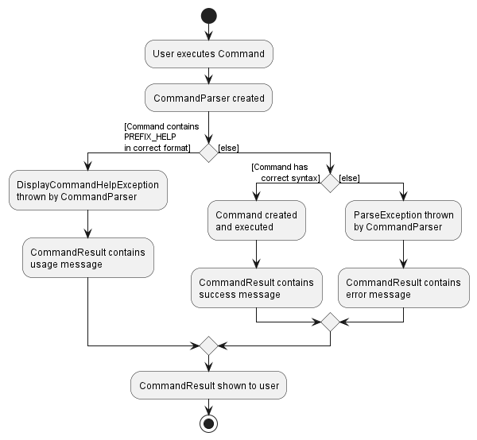

#Table of Contents
* [Acknowledgements](#acknowledgements) / [Setting up, getting started](#setting-up-getting-started)
* [Introduction](#introduction)
* [Design](#design)
  * [Architecture](#architecture)
  * [UI component](#ui-component)
  * [Logic component](#logic-component)
  * [Model component](#model-component)
  * [Storage component](#storage-component)
  * [Common classes](#common-classes)
* [Implementation Details](#implementation-details)
  * [Displaying Command Help](#displaying-command-help)
  * [Favourite/Unfavourite Feature](#favouriteunfavourite-feature)
  * [Optional Fields](#optional-fields-in-eateries-_currently-not-in-use_)
  * [Searching Through Food Guide](#searching-through-food-guide)
* [Documentation, logging, testing, configuration, dev-ops](#documentation-logging-testing-configuration-dev-ops)
* [Appendix: Requirements](#appendix-requirements)
  * [Product Scope](#product-scope)
  * [User Stories](#user-stories)
  * [Use Cases](#use-cases)
  * [Glossary](#glossary)
* [Appendix: Instructions for manual testing](#appendix-instructions-for-manual-testing)
  * [Launch and Shutdown](#launch-and-shutdown)
  * [Deleting an Eatery](#deleting-an-eatery)
  * [Saving Data](#saving-data)

----------------------------------------------------------------------------------------------

### **Acknowledgements**

This application is based on addressbook-level3 by se-edu.

--------------------------------------------------------------------------------------------------------------------

### **Setting up, getting started**

Refer to the guide 
[_Setting up and getting started_](https://github.com/AY2223S1-CS2103T-W11-1/tp/blob/master/docs/SettingUp.md).

--------------------------------------------------------------------------------------------------------------------

## **Introduction**

NUSEatWhere is a Command Line (CLI) application which helps you search for the available food options in NUS and 
make an informed decision on where to eat. It does this via a preloaded set of data paired with commands that helps the
user navigate the list of eateries in the National University of Singapore (NUS).

This Developer Guide aims to outline how the NUSEatWhere application was implemented to ensure
ease of modifications for any future changes/developments you might have in mind for our application.

_For details on commands or how a user would use the application, 
you can refer to our [User Guide](https://ay2223s1-cs2103t-w11-1.github.io/tp/UserGuide.html)._

--------------------------------------------------------------------------------------------------------------------

## **Design**

:bulb: **Tip:** The `.puml` files used to create diagrams in this document can be found in the 
[diagrams](https://github.com/AY2223S1-CS2103T-W11-1/tp/tree/master/docs/diagrams/) folder. Refer to the 
[_PlantUML Tutorial_ at se-edu/guides](https://se-education.org/guides/tutorials/plantUml.html) to learn how to create 
and edit diagrams.

### Architecture

  
The Architecture Diagram explains the high-level design of the App.

Given below is a quick overview of main components and how they interact with each other.

**Main components of the architecture**

**`Main`** has two classes called 
[`Main`](https://github.com/AY2223S1-CS2103T-W11-1/tp/blob/master/src/main/java/eatwhere/foodguide/Main.java) and 
[`MainApp`](https://github.com/AY2223S1-CS2103T-W11-1/tp/blob/master/src/main/java/eatwhere/foodguide/MainApp.java). 
It is responsible for,

* **At app launch**: Initializes the components in the correct sequence, and connects them up with each other.

* **At shut down**: Shuts down the components and invokes cleanup methods where necessary.

[**`Commons`**](#common-classes) represents a collection of classes used by multiple other components.

The rest of the App consists of four components.

* [**`UI`**](#ui-component): The UI of the App.
* [**`Logic`**](#logic-component): The command executor.
* [**`Model`**](#model-component): Holds the data of the App in memory.
* [**`Storage`**](#storage-component): Reads data from, and writes data to, the hard disk.

**How the architecture components interact with each other**

  
The Sequence Diagram shows how the components interact with each other for the 
scenario where the user issues the command `delete 1`.

Each of the four main components (also shown in the diagram above),

* defines its *API* in an `interface` with the same name as the Component.
* implements its functionality using a concrete `{Component Name}Manager` class (which follows the corresponding API `interface` mentioned in the previous point.

 

  
The (partial) class diagram shows how the Logic class interacts with the Model and Storage classes.

For example, the `Logic` component defines its API in the `Logic.java` interface and implements its functionality 
using the `LogicManager.java` class which follows the `Logic` interface. Other components interact with a given 
component through its interface rather than the concrete class (reason: to prevent outside component's being 
coupled to the implementation of a component), as illustrated in the (partial) class diagram above.

The sections below give more details of each component.

### UI component

The **API** of this component is specified in 
[`Ui.java`](https://github.com/AY2223S1-CS2103T-W11-1/tp/blob/master/src/main/java/eatwhere/foodguide/ui/Ui.java)

  
The class diagram showing the Ui class.

The UI consists of a `MainWindow` that is made up of parts e.g.`CommandBox`, `ResultDisplay`, `EateryListPanel`, 
`StatusBarFooter` etc. All these, including the `MainWindow`, inherit from the abstract `UiPart` class which captures 
the commonalities between classes that represent parts of the visible GUI.

The `UI` component uses the JavaFx UI framework. The layout of these UI parts are defined in matching `.fxml` files 
that are in the `src/main/resources/view` folder. For example, the layout of the 
[`MainWindow`](https://github.com/AY2223S1-CS2103T-W11-1/tp/blob/master/src/main/java/eatwhere/foodguide/ui/MainWindow.java) 
is specified in [`MainWindow.fxml`](https://github.com/AY2223S1-CS2103T-W11-1/tp/blob/master/src/main/resources/view/MainWindow.fxml)

The `UI` component,

* __executes user commands__ using the `Logic` component.
* __listens for changes to `Model` data__ so that the UI can be updated with the modified data.
* __keeps a reference to the `Logic` component__, because the `UI` relies on the `Logic` to execute commands.
* depends on some classes in the `Model` component, as it __displays the `Eatery` object__ residing in the `Model`.

### Logic component

**API** : [`Logic.java`](https://github.com/AY2223S1-CS2103T-W11-1/tp/blob/master/src/main/java/eatwhere/foodguide/logic/Logic.java)

Here's a (partial) class diagram of the `Logic` component:

  
The class diagram showing the Logic class.

How the `Logic` component works:

1. When `Logic` is called upon to execute a command, it uses the `FoodGuideParser` class to parse the user command.
1. This results in a `Command` object (more precisely, an object of one of its subclasses e.g., `AddCommand`) which is executed by the `LogicManager`.
1. The command can communicate with the `Model` when it is executed (e.g. to add an eatery).
1. The result of the command execution is encapsulated as a `CommandResult` object which is returned back from `Logic`.

  
The Sequence Diagram illustrates the interactions within the `Logic` component for the `execute("delete 1")` API call.

:information_source: **Note:** The lifeline for `DeleteCommandParser` should end at the destroy marker (X) but due to a limitation of PlantUML, the lifeline reaches the end of diagram.

  
The diagram shows the other classes in `Logic` (omitted from the class diagram above) that are used for parsing a user command.

How the parsing works:
* When called upon to parse a user command, the `FoodGuideParser` class creates an `XYZCommandParser` (`XYZ` is a placeholder for the specific command name e.g., `AddCommandParser`) which uses the other classes shown above to parse the user command and create a `XYZCommand` object (e.g., `AddCommand`) which the `FoodGuideParser` returns back as a `Command` object.
* All `XYZCommandParser` classes (e.g., `AddCommandParser`, `DeleteCommandParser`, ...) inherit from the `Parser` interface so that they can be treated similarly where possible e.g, during testing.

### Model component
**API** : [`Model.java`](https://github.com/AY2223S1-CS2103T-W11-1/tp/blob/master/src/main/java/eatwhere/foodguide/model/Model.java)

  
The class diagram shows the Model class.

The `Model` component,

* __Stores the address book data__ i.e., all `Eatery` objects (which are contained in a `UniqueEateryList` object).
* __Stores the currently 'selected' `Eatery` objects__ (e.g., results of a search query) as a separate _filtered_ list which is exposed to outsiders as an unmodifiable `ObservableList<Eatery>` that can be 'observed' e.g. the UI can be bound to this list so that the UI automatically updates when the data in the list change.
* __Stores a `UserPref` object__ that represents the user’s preferences. This is exposed to the outside as a `ReadOnlyUserPref` objects.
* Does not depend on any of the other three components (as the `Model` represents data entities of the domain, they should make sense on their own without depending on other components)

:information_source: **Note:** An alternative (arguably, a more OOP) model is given below. It has a `Tag` list in the `FoodGuide`, which `Eatery` references. This allows `FoodGuide` to only require one `Tag` object per unique tag, instead of each `Eatery` needing their own `Tag` objects. 

 
The diagram shows a more OOP model, the main difference being how Tag is implemented.

### Storage component

**API** : [`Storage.java`](https://github.com/AY2223S1-CS2103T-W11-1/tp/blob/master/src/main/java/eatwhere/foodguide/storage/Storage.java)

 
The class diagram shows the Storage class.

The `Storage` component,

* Can __save both food guide data and user preference data__ in json format, and read them back into corresponding objects.
* Inherits from both `FoodGuideStorage` and `UserPrefStorage`, which means it can be treated as either one (if only the functionality of only one is needed).
* Depends on some classes in the `Model` component (because the `Storage` component's job is to save/retrieve objects that belong to the `Model`)

### Common classes

Classes used by multiple components are in the `eatwhere.foodguide.commons` package.

--------------------------------------------------------------------------------------------------------------------

## **Implementation Details**

This section describes some noteworthy details on how certain features are implemented.

### Displaying Command Help

Users are able to view a help or usage message for individual commands by including a special flag in their input.
This mimics the behaviour found in other CLI applications and shells, where it is facilitated by
the addition of arguments such as `-h`, `-help`, or `--help`.

#### Implementation

The FoodGuide's current `PREFIX_HELP`, representing the help flag, is `-h`,
which aligns with the other prefixes in the command syntax.
In the FoodGuide, since all parsing beyond identifying the command word is handled by individual command parsers,
searching for this flag has to be done in these parsers.

Individual `CommandParser`s return instances of their `Command`.
Because different commands have varying number of arguments, modifying `CommandResult` to support the
displaying of a help message would require additional constructors for all supported commands,
which is tedious and makes future commands harder to implement.

Therefore, the option to display help instead makes use of a special exception `DisplayCommandHelpException`,
which is thrown when `PREFIX_HELP` is detected. This then bypasses usual command evaluation and
returns the usage message of the command.

The detection of `PREFIX_HELP` is as follows:
* The prefix must not be accompanied by a value. `-hello` and `-h ello` will not invoke the exception.
* Presence of the prefix overrides other arguments.

The detection rules limit false-positives from stray `-h`s in names of eateries, locations, etc.

  
For supported commands, the activity diagram summarizes what happens when a user executes a command.

### Favourite/Unfavourite feature
The favourite/unfavourite commands were introduced as a way to standardize how "favourite eateries" are tagged.
In a way, `fav`/`unfav` is a shortcut for `tag`/`untag`. The "`<3`" favourite tag is implemented in such a way in the interest of time, and the fact that
it can be searched up with other tags via `findTag`, hence proving to be more useful at the project's current iteration.

#### Implementation
Currently, `FavouriteCommand`/`UnfavouriteCommand` is similar to the other commands available for use, with the exception that it 
_extends_ `TagCommand`/`UntagCommand` and not `Command`. Since `FavouriteCommand` and `UnfavouriteCommand` are both implemented
in a similar way, this section will be focusing mainly on `FavouriteCommand` for ease of explanation.

  
The Sequence Diagram shows the interactions within the Logic component when `fav` is called.

As can be seen by the above diagram, most function calls to `FavouriteCommand` is directed to TagCommand, though there are some points to note:
* The fixed "`<3`" tag should be made into a tag in the `FavouriteCommand` class rather than in the `TagCommand` class. This is because `FavouriteCommand` is the subclass, hence `TagCommand` should have no dependencies on `FavouriteCommand`.
* Using the above-mentioned `-h` help command should show a custom message for `FavouriteCommand`, since it's command `fav` is different from `tag`.
* Upon successfully favouriting an eatery, the user should receive a message indicating the "`<3`" is a tag, and can be searched up and used as a criteria for the `-r` randomizer feature via the `findTag` command.

Through a comparison with the sequence diagram found in the [logic component section](#logic-component) that bears the shape of most of the default commands, it can be seen in exactly which function calls `FavouriteCommand` differs.
 

When `FavouriteCommand` is first initialized, it initializes `TagCommand` via a `super()` method call. Hence, the process of turning "`<3`" into a tag acceptable by `TagCommand` has to be streamlined, such that prefixes in `FavouriteCommand` are used.
Additionally, the `execute()` call to `FavouriteCommand` is passed onto `TagCommand` whereby `TagCommand` then normally interacts with the `Model` class as other commands do.

This unique implementation of `FavouriteCommand` and `UnfavouriteCommand` is especially important to keep in mind if future modifications (e.g. keeping favourited eateries at the top of the list) are implemented.

### Optional fields in Eateries _(currently not in use)_
The ability to keep some fields optional is very useful as the user is less inclined to use a dummy input when seeking to decide on the contents on fields later.
Hence, this works with the `edit` command to give the user even more flexibility.
Due to the importance of the `price` field, this option is removed and no longer presented to the user in the current iteration of our product. However, it is still feasible to implement should the need for it arise.

#### Implementation

  
The Activity Diagram shows how different the AddCommandParser and Eatery classes operate with different inputs.

_(Note: This diagram omits references to `-h` help as it is presented on its own. For more information about help, you can refer to the
[section about the -h command](#displaying-command-help) above.)_

As seen from the diagram, the compulsory fields are always checked first to ensure that the argument map does not contain null values.
Thereafter, the call to the optional field's constructor is handled within the `Eatery` object.
The optional field should be able to receive both null and non-null values (or by using 2 different constructors), with the input left empty indicating that there is currently no value for the optional field.
At the end, a complete eatery is returned to be added, with other classes having no idea whether the Eatery contains the optional field or not.
 

Since null values may cause NullPointerException errors, it is important that all data relating to this field is kept within the class itself.
Hence, heavy abstraction should be used here. Such examples include:
* Not giving public direct access to the value (e.g. `toString()` returns `" "` instead of null)
* Keeping the parsing of the data files to the related optional field class only
 

There are several ways to deal with storing this optional value, but the one that was used for this particular implementation was storing the optional field as an empty `""` string. This is because the optional field constructor with a value did not allow null values. Hence, any empty strings appearing in the json save file must have been due to the use of the default constructor.

### Searching through Food Guide

Users are currently able to search individual fields of eateries in `Food Guide` by the following commands:
* `find`: search by `Name`
* `findLocation`: search by `Location`
* `findCuisine`: search by `Cuisine`
* `findPrice`: search by `Price`
* `findTags`: search by `Tags`

#### Implementation

  
The Sequence diagram *illustrates the interactions within the `Logic` component for the `execute("findPrice $")` API call.*

Augmenting `AB3`'s current implementation of `find`, each `find` command currently has its own `CommandParser` 
which returns its respective `Command`. To execute the command `"findPrice $"`, `FoodGuideParser` creates 
a `FindPriceCommandParser` to parse the user command and create a `findPriceCommand` object. 

In order to keep track of the user's inputted search terms, we utilize `XYZContainsKeywordsPredicate` 
(XYZ is a placeholder for the field being searched, e.g. `LocationContainsKeywordsPredicate`). 
`XYZContainsKeywordsPredicate` implements the Java functional interface `Predicate<Eatery>`, 
taking in an `Eatery` object while containing the user's inputted search terms in the form of a list.

The `Predicate` returns `True` if, for the field being searched, 
ANY of the search terms in said `Predicate`'s list matches the value stored in an eatery's field. 

In particular, the current implementation of `find` and `findLocation`, we perform a case-insensitive substring search. 
For each respective `Predicate` object, it tests `True` if _any_ of the user's inputted search terms 
is a substring of the eatery's stored name or location respectively. For example, given an eatery with the location
`"(Frontier, Air-Con)"`, `LocationContainsKeywordsPredicate` will test `True` for any of (but not limited to) 
the following search terms:
* `"("` and `")"`, 
* `"-"` and `","`,
* `"Front",` `"Frontier,"` and `"air-con"`

Each `XYZContainsKeywordsPredicate` is then used by `ModelManager` to update the current list of displayed eateries.

--------------------------------------------------------------------------------------------------------------------

## **Documentation, logging, testing, configuration, dev-ops**

* [Documentation guide](Documentation.md)
* [Testing guide](Testing.md)
* [Logging guide](Logging.md)
* [Configuration guide](Configuration.md)
* [DevOps guide](DevOps.md)

--------------------------------------------------------------------------------------------------------------------

## **Appendix: Requirements**

### Product scope

**Target user profile**: This product is for ...
* NUS students/staff who prefer Command Line Interface (CLI) over Graphical User Interface (GUI)
* want to keep track of the various food options in NUS.

**Value proposition**: This application summarizes the various food options available in NUS, and allows users to make an informed choice as to what to eat.

### User stories

Priorities: High (must have) - `* * *`, Medium (nice to have) - `* *`, Low (unlikely to have) - `*`

| Priority | As a … | I want to …                      | So that I can…                                    |
|----------|--------|----------------------------------|---------------------------------------------------|
| `* * *`  | user   | see usage instructions           | easily figure out and remember how to use the app |
| `* * *`  | user   | see what stalls there are in NUS | know what food is available                       |
| `* * *`  | user   | search for stalls by name        |                                                   |
| `* * *`  | user   | search for stalls by tags        |                                                   |
| `* * *`  | user   | search for stalls by location    |                                                   |
| `* * *`  | user   | search for stalls by cuisine     |                                                   |
| `* * *`  | user   | tag stalls                       | organize stalls by tags                           |
| `* * *`  | user   | untag a stall                    | remove a stall from a tag group                   |
| `* *`    | user   | add new eateries                 | customize the list                                |
| `* *`    | user   | remove eateries                   | customize the list                                |

*{More to be added}*

### Use cases

(For all use cases below, the **System** is the `FoodGuide` and the **Actor** is the `user`, unless specified otherwise)

**Use case: Search stall by Cuisine**

**MSS**

1. User requests to search for stall by cuisine
2. NUSEatWhere returns a list of all the eateries of the given cuisine

**Use case: Search stall by Name**

**MSS**

1. User requests to search for stall by name
2. NUSEatWhere returns a list of all the eateries with a matching name

**Use case: Search stall by Tag**

**MSS**

1. User requests to search for stall by tag
2. NUSEatWhere returns a list of all the eateries with that tag

**Use case: Search stall by Location**

**MSS**

1. User requests to search for stall by location
2. NUSEatWhere returns a list of all the eateries with that location

**Use case: Help Command**

**MSS**

1. User enters the help command
2. NUSEatWhere returns a list of all commands and their functionality explained

**Use case: List Command**

**MSS**

1. User enters the list command
2. NUSEatWhere returns a list of all eateries

**Use case: Tag Command**

**MSS**

1. User requests to tag an eatery
2. NUSEatWhere adds a tag to the eatery and shows the updated eatery.

**Use case: Untag Command**

**MSS**

1. User requests to untag an eatery
2. NUSEatWhere untags the eatery and shows the updated eatery

**Use case: Add Command**

**MSS**

1. User requests to add an eatery
2. NUSEatWhere adds the eatery to the list.

**Use case: Delete Command**

**MSS**

1. User requests to delete an eatery
2. NUSEatWhere deletes the eatery from the list.

### Non-Functional Requirements

1. Should work on any _mainstream OS_ as long as it has Java `11` or above installed.

2. Should be able to hold up to 100 tagged eateries without a noticeable sluggishness in performance for typical usage.

3. Should be able to store and load data for at least tagged 100 eateries

4. A user with above average typing speed for regular English text (i.e. not code, not system admin commands) should be able to accomplish most of the tasks faster using commands than using the mouse.

5. Should be usable for users who have never been to NUS

*{More to be added}*

### Glossary

* **Mainstream OS**: Windows, Linux, Unix, OS-X

--------------------------------------------------------------------------------------------------------------------

## **Appendix: Instructions for manual testing**

Given below are instructions to test the app manually.

:information_source: **Note:** These instructions only provide a starting point for testers to work on;

testers are expected to do more *exploratory* testing.

### Launch and shutdown

1. Initial launch

1. Download the jar file and copy into an empty folder

1. Double-click the jar file Expected: Shows the GUI with a set of sample contacts. The window size may not be optimum.

1. Saving window preferences

1. Resize the window to an optimum size. Move the window to a different location. Close the window.

1. Re-launch the app by double-clicking the jar file. 

Expected: The most recent window size and location is retained.

### Deleting an Eatery

1. Deleting an eatery while all eatery are being shown

1. Prerequisites: List all eateries using the `list` command. Multiple eateries in the list.

1. Test case: `delete 1` 

Expected: First eatery is deleted from the list. Details of the deleted eatery shown in the status message. Timestamp in the status bar is updated.

1. Test case: `delete 0` 

Expected: No eatery is deleted. Error details shown in the status message. Status bar remains the same.

1. Other incorrect delete commands to try: `delete`, `delete x`, `...` (where x is larger than the list size) 

Expected: Similar to previous.

### Saving data
Dealing with missing/corrupted data files

1. Delete the `foodguide.json` file found in `data`

Expected: If the data is missing, a default food guide list starts up.

1. Edit the keys (e.g. `name` to `nnnn`) in the `foodguide.json` file found in `data`

Expected: If the data is formatted wrongly, a blank food guide list starts up.
