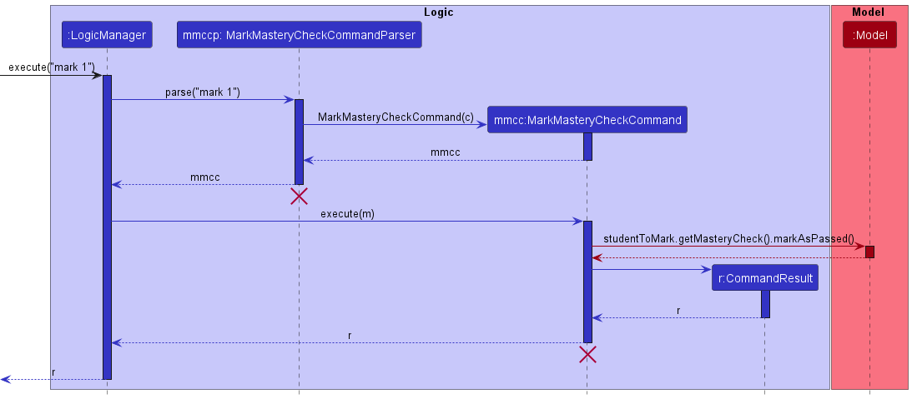

* Table of Contents
{:toc}

--------------------------------------------------------------------------------------------------------------------

## **Acknowledgements**

* {list here sources of all reused/adapted ideas, code, documentation, and third-party libraries -- include links to the
  original source as well}

--------------------------------------------------------------------------------------------------------------------

## **Setting up, getting started**

Refer to the guide [_Setting up and getting started_](SettingUp.md).

--------------------------------------------------------------------------------------------------------------------

# **Design**

:bulb: **Tip:** The `.puml` files used to create diagrams in this document can be found in
the [diagrams](https://github.com/AY2223S1-CS2103T-W13-1/tp/tree/master/docs/diagrams) folder. Refer to the [_PlantUML
Tutorial_ at se-edu/guides](https://se-education.org/guides/tutorials/plantUml.html) to learn how to create and edit
diagrams.

### Architecture

The ***Architecture Diagram*** given above explains the high-level design of the App.

Given below is a quick overview of main components and how they interact with each other.

**Main components of the architecture**

**`Main`** has two classes
called [`Main`](https://github.com/AY2223S1-CS2103T-W13-1/tp/tree/master/src/main/java/seedu/studmap/Main.java)
and [`MainApp`](https://github.com/AY2223S1-CS2103T-W13-1/tp/tree/master/src/main/java/seedu/studmap/MainApp.java). It
is responsible for,

* At app launch: Initializes the components in the correct sequence, and connects them up with each other.
* At shut down: Shuts down the components and invokes cleanup methods where necessary.

[**`Commons`**](#common-classes) represents a collection of classes used by multiple other components.

The rest of the App consists of four components.

* [**`UI`**](#ui-component): The UI of the App.
* [**`Logic`**](#logic-component): The command executor.
* [**`Model`**](#model-component): Holds the data of the App in memory.
* [**`Storage`**](#storage-component): Reads data from, and writes data to, the hard disk.

**How the architecture components interact with each other**

The *Sequence Diagram* below shows how the components interact with each other for the scenario where the user issues
the command `delete 1`.

Each of the four main components (also shown in the diagram above),

* defines its *API* in an `interface` with the same name as the Component.
* implements its functionality using a concrete `{Component Name}Manager` class (which follows the corresponding
  API `interface` mentioned in the previous point.

For example, the `Logic` component defines its API in the `Logic.java` interface and implements its functionality using
the `LogicManager.java` class which follows the `Logic` interface. Other components interact with a given component
through its interface rather than the concrete class (reason: to prevent outside component's being coupled to the
implementation of a component), as illustrated in the (partial) class diagram below.

The sections below give more details of each component.

### UI component

The **API** of this component is specified
in [`Ui.java`](https://github.com/AY2223S1-CS2103T-W13-1/tp/tree/master/src/main/java/seedu/studmap/ui/Ui.java)

The UI consists of a `MainWindow` that is made up of parts e.g.`CommandBox`, `ResultDisplay`, `StudentListPanel`
, `StatusBarFooter` etc. All these, including the `MainWindow`, inherit from the abstract `UiPart` class which captures
the commonalities between classes that represent parts of the visible GUI.

The `UI` component uses the JavaFx UI framework. The layout of these UI parts are defined in matching `.fxml` files that
are in the `src/main/resources/view` folder. For example, the layout of
the [`MainWindow`](https://github.com/AY2223S1-CS2103T-W13-1/tp/tree/master/src/main/java/seedu/studmap/ui/MainWindow.java)
is specified
in [`MainWindow.fxml`](https://github.com/AY2223S1-CS2103T-W13-1/tp/tree/master/src/main/resources/view/MainWindow.fxml)

The `UI` component,

* executes user commands using the `Logic` component.
* listens for changes to `Model` data so that the UI can be updated with the modified data.
* keeps a reference to the `Logic` component, because the `UI` relies on the `Logic` to execute commands.
* depends on some classes in the `Model` component, as it displays `Student` object residing in the `Model`.

### Logic component

**
API** : [`Logic.java`](https://github.com/AY2223S1-CS2103T-W13-1/tp/tree/master/src/main/java/seedu/studmap/logic/Logic.java)

Here's a (partial) class diagram of the `Logic` component:

How the `Logic` component works:

1. When `Logic` is called upon to execute a command, it uses the `StudMapParser` class to parse the user command.
1. This results in a `Command` object (more precisely, an object of one of its subclasses e.g., `AddCommand`) which is
   executed by the `LogicManager`.
1. The command can communicate with the `Model` when it is executed (e.g. to add a student).
1. The result of the command execution is encapsulated as a `CommandResult` object which is returned back from `Logic`.

The Sequence Diagram below illustrates the interactions within the `Logic` component for the `execute("delete 1")` API
call.

:information_source: **Note:** The lifeline for `DeleteCommandParser` should end at the destroy marker (X) but due to a limitation of PlantUML, the lifeline reaches the end of diagram.

Here are the other classes in `Logic` (omitted from the class diagram above) that are used for parsing a user command:

How the parsing works:

* When called upon to parse a user command, the `StudMapParser` class creates an `XYZCommandParser` (`XYZ` is a
  placeholder for the specific command name e.g., `AddCommandParser`) which uses the other classes shown above to parse
  the user command and create a `XYZCommand` object (e.g., `AddCommand`) which the `StudMapParser` returns back as
  a `Command` object.
* All `XYZCommandParser` classes (e.g., `AddCommandParser`, `DeleteCommandParser`, ...) inherit from the `Parser`
  interface so that they can be treated similarly where possible e.g, during testing.

### Model component

**
API** : [`Model.java`](https://github.com/AY2223S1-CS2103T-W13-1/tp/tree/master/src/main/java/seedu/studmap/model/Model.java)

The `Model` component,

* stores the student map data i.e., all `Student` objects (which are contained in a `UniqueStudentList` object).
* stores the currently 'selected' `Student` objects (e.g., results of a search query) as a separate _filtered_ list which
  is exposed to outsiders as an unmodifiable `ObservableList<Student>` that can be 'observed' e.g. the UI can be bound to
  this list so that the UI automatically updates when the data in the list change.
* stores a `UserPref` object that represents the user’s preferences. This is exposed to the outside as
  a `ReadOnlyUserPref` objects.
* does not depend on any of the other three components (as the `Model` represents data entities of the domain, they
  should make sense on their own without depending on other components)

:information_source: **Note:** An alternative (arguably, a more OOP) model is given below. It has a `Tag` list in the `StudMap`, which `Student` references. This allows `StudMap` to only require one `Tag` object per unique tag, instead of each `Student` needing their own `Tag` objects. 

### Storage component

**
API** : [`Storage.java`](https://github.com/AY2223S1-CS2103T-W13-1/tp/tree/master/src/main/java/seedu/studmap/storage/Storage.java)

The `Storage` component,

* can save both student map data and user preference data in json format, and read them back into corresponding
  objects.
* inherits from both `StudMapStorage` and `UserPrefStorage`, which means it can be treated as either one (if only
  the functionality of only one is needed).
* depends on some classes in the `Model` component (because the `Storage` component's job is to save/retrieve objects
  that belong to the `Model`)

### Common classes

Classes used by multiple components are in the `seedu.studmap.commons` package.

--------------------------------------------------------------------------------------------------------------------

# **Implementation**

This section describes some noteworthy details on how certain features are implemented.

## **Filter feature**

#### Current Implementation

The 'filter' feature is implemented by the 'FilterCommand' class which extends its parent 'Command' class. The structure
of the 'filter' feature can be summarized via the sequence diagram shown below.

This method is implemented to support the feature of filtering students by the tags that is assigned to them.

The 'FilterCommand' supports one operation:

- 'FilterCommand#execute()' - Overrides the 'execute()' method of its parents 'Command' class and is the default
  operation to be executed. This will update the filtered list in the dashboard shown to the user based on the tag set
  by the user

The flow for 'FilterCommand#execute' is as such:

Step 1: The tag to be used for filtering is retrieved from the user input

Step 2: The tag input will then be parsed into the filter parser which will then return a new Filter Command

Step 3: The filter command will then be immediately executed to filter the current list of students via their assigned
tags

Step 4: The result list of students will then be shown back to the user via the dashboard

## **EditStudent features**
This is a set of features with similar implementations that allows user to modify the `Student` object. Currently, the featuresEditStudent features include:
1. `edit` :  `EditCommand`
 Edit basic attributes of a student (E.g. Name, Phone, etc)
2. `tag`:`TagCommand` and `untag` : `UntagCommand`
 Add and removing tags for a student
3. `mark` : `MarkCommand` and `unmark` : `UnmarkCommand` :
  Add, modify and remove attendance status of a student
4. `grade` : `GradeCommand` and `ungrade` : `UngradeCommand`
  Add, modify and remove assignment grading status of a student.

Each of these features are implemented through the corresponding commands which extends the generic `EditStudentCommand` abstract class.

The implementation of the `execute` method is contained in the parent class `EditStudentCommand#execute`. The `execute` method which the respective concrete implementations of `EditStudentCommand` will in turn call the `editStudent` method of the corresponding `StudentEditor` (e.g. `MarkCommand.MarkStudentEditor#editStudent`). A brief summary of the class structure is illustrated in the class diagram below, using `MarkCommand` as the example. Since all concrete implementations of the `EditStudentCommand` share the same class structure, the example of `MarkCommand` will also be used to explain the implementation details.

`IndexListGenerator` is an abstract class representing the list of indexes to modify.
The instance of `IndexListGenerator` can be either
* `AllIndexGenerator`, which corresponds to all indexes of the filtered list (meaning all listed students are modified)
* `SingleIndexGenerator`, which corresponds to a single index (meaning one selected student is modified)

`StudentEditor` is an abstract class which contains all the logic for modifying the student. Concrete implementations of `EditStudentCommand` such as the `MarkCommand` also contains an implementation its corresponding `StudentEditor` (E.g. `MarkCommandStudentEditor` in the case of `MarkCommand`).

The corresponding `EditCommandParser` instantaites both its `IndexListGenerator` and the `StudentEditor` based on inputs and passed them to the constructor of the respective command (`MarkCommand` in this case). The example class structure using `MarkCommandParser` is illustrated in the class diagram
below.

]

#### **General flow for update using EditStudentCommand**

Given below is the typical flow for `EditStudentCommand` such as the  `MarkCommand#execute`.

Step 1. The command loops through the list of indexes to be modified, as indicated in the `IndexListGenerator`.

Step 3. The command replaces the old student with the newly edited student in the `Model` of the old student .

Below is a more detailed sequence diagram for the execution of the command using the same example of `MarkCommand`.

#### Other notes or implementation
`tag`/`untag` : This command adds/modifies/removes tags that are represented by the `Tag` class and does not include any status.
`mark` /`unmark` : This command adds/modifies/removes a student's attendances that are represented by the `Attendance` class and include 2 status (absent/present).
`mark` /`unmark` : This command adds/modifies/removes a student's assignment grading record that are represented by the `Assigment` class and include 3 status (new/received, marked).

### Design considerations:

**Aspect: How mark command executes:**

* **Alternative 1 (current choice):** Update the students using StudentEditor.
    * Pros: Easy to extend functionality to other classes, more OOP-oriented
    * Cons: May decrease readability for new users due to many classes involved

* **Alternative 2:** Update the students in MarkCommand itself
    * Pros: More intuitive and easy to understand
    * Cons: Makes code harder to maintain, more code duplication.

## **Sort feature**

#### Implementation

The sort feature is implemented by `SortCommand` which extends the abstract `Command` class. Since sorting is done according to the specified attribute, the abstract `Attribute` class is used to handle the input attribute and provide the corresponding `Comparator` to sort the student list.
`SortCommand` supports the following operation:

* `SortCommand#execute()` — Sorts the current working list by the specified comparator and order in the `SortCommand`.

This operation is exposed in the `Model` interface as `sortFilteredStudentList()`.

The following sequence diagram shows how the sort operation works:

Given below is an example usage scenario and how the sort mechanism behaves at each step.

Step 1. The user executes `sort asc a/name` to sort the students in the student map by their names in ascending order.

Step 2. `SortCommandParser` handles the parsing of user input to ensure a valid `attributeType` and `sortingOrder` is supplied. The checks are done by `Attribute#isValidAttributeType()` and `Order#isValidOrderName()` respectively. For valid attributes and order, the `Comparator` and `Order` will be supplied by `Attribute#getAttributeComparator()` and `ParserUtil#ParseOrder()` to create a `SortCommand`.

Step 3. `SortCommand` calls `Model#sortFilteredStudentList()` with the `Comparator` for sorting names and the ascending `Order` required.

Step 4. The ModelManager containing the `studMap` passes on the `Comparator` and `Order` to `StudMap#sort()`.

Step 5. Note that StudMap stores the student list in a `UniqueStudentList`. `UniqueStudentList#sort()` is called with the `Comparator` and the boolean value of `false` for `isDescending` according to the ascending `Order` specified.

Step 6. The `internalList` stored in the `UniqueStudentList` is an `FXCollections.observableArrayList` which will then be sorted using the `Comparator`. The ordering of the list is reversed using `FXCollections#reverse()` if `isDescending` is true.

Step 5. The sorted list is displayed to the user.

#### Design considerations:

**Aspect: How sort executes:**

* **Alternative 1 (current choice):** Valid attributes to sort are specified in the enum class `AttributeType` and the corresponding `Comparator` is contained within the abstract `Attribute` class.
    * Pros: Easy to implement. Any new attributes to be enabled for sorting could be specified in the `AttributeType` enum class and the `Comparator` within the `Attribute` class.
    * Cons: May not be appropriate to specify the `Comparator` for different attributes within the `Attribute` class instead of their own respective class.

* **Alternative 2:** `Attribute` as a superclass inherited by each respective attribute. Each attribute specifies its own `Comparator` to be used for sorting and can be retrieved using `getAttributeComparator()`
    * Pros: Aligns more to OOP where the corresponding `Comparator` is contained within each attribute. Make use of polymorphism to call the correct `getAttributeComparator()` for different attributes.
    * Cons: Attribute subclasses must be instantiated possibly through a factory method just to get the `Comparator` used in sorting.

### \[Proposed\] Undo/redo feature

#### Proposed Implementation

The proposed undo/redo mechanism is facilitated by `VersionedStudMap`. It extends `StudMap` with an undo/redo
history, stored internally as an `studMapStateList` and `currentStatePointer`. Additionally, it implements the
following operations:

* `VersionedStudMap#commit()` — Saves the current student map state in its history.
* `VersionedStudMap#undo()` — Restores the previous student map state from its history.
* `VersionedStudMap#redo()` — Restores a previously undone student map state from its history.

These operations are exposed in the `Model` interface as `Model#commitStudMap()`, `Model#undoStudMap()`
and `Model#redoStudMap()` respectively.

Given below is an example usage scenario and how the undo/redo mechanism behaves at each step.

Step 1. The user launches the application for the first time. The `VersionedStudMap` will be initialized with the
initial student map state, and the `currentStatePointer` pointing to that single student map state.

Step 2. The user executes `delete 5` command to delete the 5th student in the student map. The `delete` command
calls `Model#commitStudMap()`, causing the modified state of the student map after the `delete 5` command executes
to be saved in the `studMapStateList`, and the `currentStatePointer` is shifted to the newly inserted student map
state.

Step 3. The user executes `add n/David …​` to add a new student. The `add` command also calls `Model#commitStudMap()`
, causing another modified student map state to be saved into the `studMapStateList`.

:information_source: **Note:** If a command fails its execution, it will not call `Model#commitStudMap()`, so the student map state will not be saved into the `studMapStateList`.

Step 4. The user now decides that adding the student was a mistake, and decides to undo that action by executing
the `undo` command. The `undo` command will call `Model#undoStudMap()`, which will shift the `currentStatePointer`
once to the left, pointing it to the previous student map state, and restores the student map to that state.

:information_source: **Note:** If the `currentStatePointer` is at index 0, pointing to the initial StudMap state, then there are no previous StudMap states to restore. The `undo` command uses `Model#canUndoStudMap()` to check if this is the case. If so, it will return an error to the user rather
than attempting to perform the undo.

The following sequence diagram shows how the undo operation works:

:information_source: **Note:** The lifeline for `UndoCommand` should end at the destroy marker (X) but due to a limitation of PlantUML, the lifeline reaches the end of diagram.

The `redo` command does the opposite — it calls `Model#redoStudMap()`, which shifts the `currentStatePointer` once
to the right, pointing to the previously undone state, and restores the student map to that state.

:information_source: **Note:** If the `currentStatePointer` is at index `studMapStateList.size() - 1`, pointing to the latest student map state, then there are no undone StudMap states to restore. The `redo` command uses `Model#canRedoStudMap()` to check if this is the case. If so, it will return an error to the user rather than attempting to perform the redo.

Step 5. The user then decides to execute the command `list`. Commands that do not modify the student map, such
as `list`, will usually not call `Model#commitStudMap()`, `Model#undoStudMap()` or `Model#redoStudMap()`.
Thus, the `studMapStateList` remains unchanged.

Step 6. The user executes `clear`, which calls `Model#commitStudMap()`. Since the `currentStatePointer` is not
pointing at the end of the `studMapStateList`, all student map states after the `currentStatePointer` will be
purged. Reason: It no longer makes sense to redo the `add n/David …​` command. This is the behavior that most modern
desktop applications follow.

The following activity diagram summarizes what happens when a user executes a new command:

#### Design considerations:

**Aspect: How undo & redo executes:**

* **Alternative 1 (current choice):** Saves the entire student map.
    * Pros: Easy to implement.
    * Cons: May have performance issues in terms of memory usage.

* **Alternative 2:** Individual command knows how to undo/redo by itself.
    * Pros: Will use less memory (e.g. for `delete`, just save the student being deleted).
    * Cons: We must ensure that the implementation of each individual command are correct.

_{more aspects and alternatives to be added}_

### \[Proposed\] Data archiving

_{Explain here how the data archiving feature will be implemented}_

--------------------------------------------------------------------------------------------------------------------

## **Documentation, logging, testing, configuration, dev-ops**

* [Documentation guide](Documentation.md)
* [Testing guide](Testing.md)
* [Logging guide](Logging.md)
* [Configuration guide](Configuration.md)
* [DevOps guide](DevOps.md)

--------------------------------------------------------------------------------------------------------------------

## **Appendix: Requirements**

### Product scope

**Target user profile**:

* is a tutor
* has a need to manage a significant number of students
* wants to organise their class in multiple ways
* prefer desktop apps over other types
* can type fast
* prefers typing to mouse interactions
* is reasonably comfortable using CLI apps

**Value proposition**: help tutors better keep track of their students’ progress in their assigned module.

### User stories

Priorities: High (must have) - `* * *`, Medium (nice to have) - `* *`, Low (unlikely to have) - `*`

| Priority | As a …​                                     | I want to …​                                         | So that I can…​                                                        |
|----------|---------------------------------------------|------------------------------------------------------|------------------------------------------------------------------------|
| `* * *`  | new user                                    | see usage instructions                               | refer to instructions when I forget how to use the App                 |
| `* * *`  | tutor                                       | add a new student                                    |                                                                        |
| `* * *`  | tutor                                       | delete a student                                     | remove entries that I no longer need                                   |
| `* * *`  | tutor                                       | mark students who are present and absent from class  | keep track of attendance using this application                        |
| `* * *`  | tutor                                       | find a student by name                               | locate details of students without having to go through the entire list |
| `* *`    | tutor with many students in the student map | sort students by name                                | locate a student easily                                                |
| `* *`    | tutor                                       | filter the students by attribute                     | locate a student easily                                                |
| `* *`    | tutor                                       | create new labels to tag my students with            | better differentiate the students                                      |

### Use cases

(For all use cases below, the **System** is the `StudMap` and the **Actor** is the `Tutor`, unless specified otherwise)

**Use case: Delete a Student**

**MSS**

1. Tutor requests to list students
2. StudMap shows a list of students
3. Tutor requests to delete a specific student in the list
4. StudMap deletes the student

   Use case ends.

**Extensions**

* 2a. The list is empty.

  Use case ends.

* 3a. The given index is invalid.

    * 3a1. StudMap shows an error message.

      Use case resumes at step 2.

**Use case: Add a Student**

**MSS**

1. Tutor requests to add a student
2. StudMap adds the student

   Use case ends.

**Extensions**

* 1a. The given format for users is invalid

    * 1a1. StudMap shows an error message.

      Use case ends.

*{More to be added}*

### Non-Functional Requirements

1. The software should work on any _mainstream OS_ as long as it has Java `11` or above installed.
2. The software should be able to hold up to 1000 students without a noticeable sluggishness in performance for typical
   usage.
3. The software should be able to start up in 30 seconds.
4. A user with above average typing speed for regular English text (i.e. not code, not system admin commands) should be
   able to accomplish most of the tasks faster using commands than using the mouse.
5. The software should be able to be used without an installer.
6. The software should not depend on a remote server.
7. If the software crashes or becomes unresponsive, the student records should not be lost.
8. The GUI should work well (i.e., should not cause any resolution-related inconveniences to the user) for standard
   screen resolutions 1920x1080 and higher and for screen scales 100% and 125%.
9. The GUI should be usable (i.e., all functions can be used even if the user experience is not optimal) for resolutions
   1280x720 and higher and for screen scales 150%.
10. The software should be packaged into a single JAR file.
11. The software should not exceed 100MB in size.
12. The documentation should not exceed 15MB per file.
13. The software and documentation should be accessible for users who have a basic command of the English language.

### Glossary

* **Tutor**: Teaching assistant for the specific module
* **Student**: A person that is partaking in a module.
* **Module**: The university class that the student is enrolled in, encoded by a unique module code consisting of a 2-3
  letter prefix that generally denotes the discipline, and 4 digits at the back, the first of which indicates the level
  of the module.
* **JAR file**: package file format typically used to aggregate many Java class files and associated metadata and
  resources into one file for distribution.
* **GUI**: main interface that the user interacts with to input commands and view results.
* **Mainstream OS**: Windows, Linux, Unix, OS-X
* **Tag**: A label for students defined by the user, possibly shared by multiple students.
* **Attribute**: Characteristics of students that all students have.

--------------------------------------------------------------------------------------------------------------------

## **Appendix: Instructions for manual testing**

Given below are instructions to test the app manually.

:information_source: **Note:** These instructions only provide a starting point for testers to work on;
testers are expected to do more *exploratory* testing.

### Launch and shutdown

1. Initial launch

    1. Download the jar file and copy into an empty folder

    1. Double-click the jar file Expected: Shows the GUI with a set of sample contacts. The window size may not be
       optimum.

1. Saving window preferences

    1. Resize the window to an optimum size. Move the window to a different location. Close the window.

    1. Re-launch the app by double-clicking the jar file. 
       Expected: The most recent window size and location is retained.

1. _{ more test cases …​ }_

### Deleting a student

1. Deleting a student while all students are being shown

    1. Prerequisites: List all students using the `list` command. Multiple students in the list.

    1. Test case: `delete 1` 
       Expected: First contact is deleted from the list. Details of the deleted contact shown in the status message.
       Timestamp in the status bar is updated.

    1. Test case: `delete 0` 
       Expected: No student is deleted. Error details shown in the status message. Status bar remains the same.

    1. Other incorrect delete commands to try: `delete`, `delete x`, `...` (where x is larger than the list size) 
       Expected: Similar to previous.

1. _{ more test cases …​ }_

### Saving data

1. Dealing with missing/corrupted data files

    1. _{explain how to simulate a missing/corrupted file, and the expected behavior}_

1. _{ more test cases …​ }_
