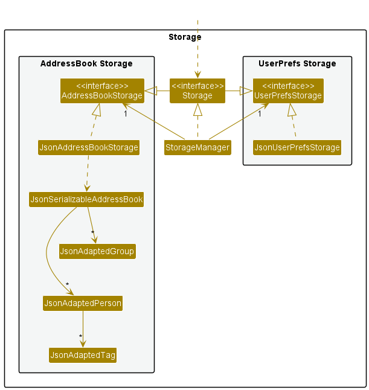
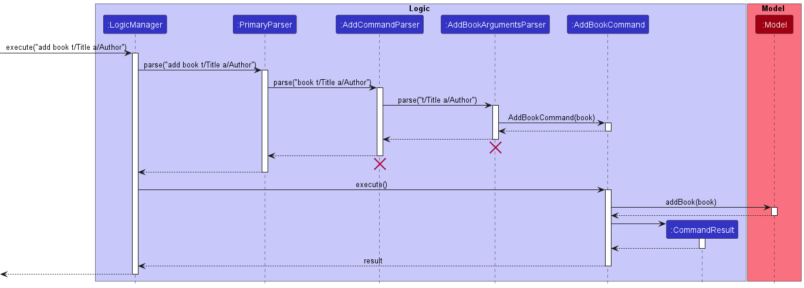

* Table of Contents
{:toc}

---

## **Acknowledgements**

- This project is based on the AddressBook-Level3 project created by the [SE-EDU initiative](https://se-education.org).

--------------------------------------------------------------------------------------------------------------------

## **Setting up, getting started**

Refer to the guide [_Setting up and getting started_](SettingUp.md).

--------------------------------------------------------------------------------------------------------------------

## **Design**

:bulb: **Tip:** The `.puml` files used to create diagrams in this document can be found in the [diagrams](https://github.com/se-edu/addressbook-level3/tree/master/docs/diagrams/) folder. Refer to the [_PlantUML Tutorial_ at se-edu/guides](https://se-education.org/guides/tutorials/plantUml.html) to learn how to create and edit diagrams.

### Architecture

The ***Architecture Diagram*** given above explains the high-level design of the App.

Given below is a quick overview of main components and how they interact with each other.

**Main components of the architecture**

**`Main`** has two classes called [`Main`](https://github.com/se-edu/addressbook-level3/tree/master/src/main/java/seedu/address/Main.java) and [`MainApp`](https://github.com/se-edu/addressbook-level3/tree/master/src/main/java/seedu/address/MainApp.java). It is responsible for,
* At app launch: Initializes the components in the correct sequence, and connects them up with each other.
* At shut down: Shuts down the components and invokes cleanup methods where necessary.

[**`Commons`**](#common-classes) represents a collection of classes used by multiple other components.

The rest of the App consists of four components.

* [**`UI`**](#ui-component): The UI of the App.
* [**`Logic`**](#logic-component): The command executor.
* [**`Model`**](#model-component): Holds the data of the App in memory.
* [**`Storage`**](#storage-component): Reads data from, and writes data to, the hard disk.

**How the architecture components interact with each other**

The *Sequence Diagram* below shows how the components interact with each other for the scenario where the user issues the command `delete 1`.

Each of the four main components (also shown in the diagram above),

* defines its *API* in an `interface` with the same name as the Component.
* implements its functionality using a concrete `{Component Name}Manager` class (which follows the corresponding API `interface` mentioned in the previous point.

For example, the `Logic` component defines its API in the `Logic.java` interface and implements its functionality using the `LogicManager.java` class which follows the `Logic` interface. Other components interact with a given component through its interface rather than the concrete class (reason: to prevent outside component's being coupled to the implementation of a component), as illustrated in the (partial) class diagram below.

The sections below give more details of each component.

### UI component

**API**: [`Ui.java`](https://github.com/AY2223S1-CS2103-F13-1/tp/blob/master/src/main/java/seedu/address/ui/Ui.java)

The UI consists of a `MainWindow` that is made up of parts e.g.`ProjectListPanel`, `IssueListPanel`, `ClientListPanel`, `ResultDisplay`, `HelpWindow` etc. All these, including the `MainWindow`, inherit from the abstract `UiPart` class which captures the commonalities between classes that represent parts of the visible GUI.

The `UI` component uses the JavaFx UI framework. The layout of these UI parts are defined in matching `.fxml` files that are in the `src/main/resources/view` folder. For example, the layout of the [`MainWindow`](https://github.com/AY2223S1-CS2103-F13-1/tp/blob/master/src/main/java/seedu/address/ui/MainWindow.java) is specified in [`MainWindow.fxml`](https://github.com/AY2223S1-CS2103-F13-1/tp/blob/master/src//main/resources/view/MainWindow.fxml)

The `UI` component,

* executes user commands using the `Logic` component.
* listens for changes to `Model` data so that the UI can be updated with the modified data.
* keeps a reference to the `Logic` component, because the `UI` relies on the `Logic` to execute commands.
* depends on some classes in the `Model` component.

### Logic component

**API** : [`Logic.java`](https://github.com/se-edu/addressbook-level3/tree/master/src/main/java/seedu/address/logic/Logic.java)

Here's a (partial) class diagram of the `Logic` component:

How the `Logic` component works:
1. When `Logic` is called upon to execute a command, it uses the `AddressBookParser` class to parse the user command to result in a `Command` object (more precisely, an object of one of its subclasses e.g., `AddClientCommand`). More specifically,
   1. If the command is specific to an entity (e.g. `Project`, `Client` or `Issue`), this results in a `CommandParser` object (More specifically, an object of one of its subclasses e.g., `ClientCommandParser`)), which then yields a `Command` object.
   2. Otherwise, it results in a `Command` Object directly.
2. The resulting `Command` object is executed by the `LogicManager`.
3. The command can communicate with the `Model` when it is executed (e.g. to add a person).
4. The result of the command execution is encapsulated as a `CommandResult` object which is returned back from `Logic`.

The Sequence Diagram below illustrates the interactions within the `Logic` component for the `execute("delete 1")` API call.

:information_source: **Note:** The lifeline for `DeleteCommandParser` should end at the destroy marker (X) but due to a limitation of PlantUML, the lifeline reaches the end of diagram.

Here are the other classes in `Logic` (omitted from the class diagram above) that are used for parsing a user command:

How the parsing works:
* When called upon to parse a user command, the `AddressBookParser` class creates an `XYZCommandParser` (`XYZ` is a placeholder for the specific command name e.g., `ClientCommandParser`) which uses the other classes shown above to parse the user command and create a `XYZCommand` object (e.g., `AddClientCommand`) which the `AddressBookParser` returns back as a `Command` object.
* All `XYZCommandParser` classes (e.g., `ClientCommandParser`, `IssueCommandParser`, ...) inherit from the `Parser` interface so that they can be treated similarly where possible e.g, during testing.

### Model component
**API** : [`Model.java`](https://github.com/AY2223S1-CS2103-F13-1/tp/blob/master/src/main/java/seedu/address/model/Model.java)

The `Model` component,

* stores the project book data i.e., all `Project`, `Client`, and `Issue` objects (which are contained in separate `UniqueEntityList` objects).
* stores the currently 'selected' `Peoject`, `CLient`, or `Issue` objects (e.g., results of a search query) as a separate _filtered_ list which is exposed to outsiders as an unmodifiable `ObservableList<Project>`, `ObservableList<Client>` or `ObservableList<Issue>` that can be 'observed' e.g. the UI can be bound to this list so that the UI automatically updates when the data in the list change.
* stores a `UserPref` object that represents the user’s preferences. This is exposed to the outside as a `ReadOnlyUserPref` objects.
* does not depend on any of the other three components (as the `Model` represents data entities of the domain, they should make sense on their own without depending on other components)

### Storage component

**API** : [`Storage.java`](https://github.com/AY2223S1-CS2103-F13-1/tp/blob/master/src/main/java/seedu/address/storage/Storage.java)

The `Storage` component,
* can save both project book data and user preference data in json format, and read them back into corresponding objects.
* inherits from both `AddressBookStorage` and `UserPrefStorage`, which means it can be treated as either one (if only the functionality of only one is needed).
* depends on some classes in the `Model` component (because the `Storage` component's job is to save/retrieve objects that belong to the `Model`).
* handles all parsing of objects in `StorageUtil`.

### Common classes

Classes used by multiple components are in the `seedu.addressbook.commons` package.

--------------------------------------------------------------------------------------------------------------------

## **Implementation**

This section describes some details on how certain features are implemented.

### List Command Feature

The list mechanism is facilitated by `MainWindow`. It contains a `CommandBox` which listens for user command input and a JavaFX `StackPane` which holds the current entity list to be displayed. Upon the execution of either a `ListProjectCommand`, `ListClientCommand` or `ListIssueCommand`, the following operations are carried out:
* `MainWindow#swapProjectListDisplay()` — Changes the current display to a list of projects.
* `MainWindow#swapClientListDisplay()` — Changes the current display to a list of clients.
* `MainWindow#swapIssueListDisplay()` — Changes the current display to a list of issues.

Given below is an example usage scenario and how the list mechanism behaves at each step.

Step 1. The user launches the application for the first time. The `StackPane` will be initialized by default with a list of projects.

Step 2. The user executes `client -l` to view a list of clients. The `ListClientCommand` is executed and calls `MainWindow#swapClientListDisplay()`, clearing the current collection of child nodes of the `StackPane` and adds the root of a `ClientListPanel` to the emptied child nodes. The list of clients is now shown in the UI.

:information_source: **Note:** If the current display is already the same as that requested by the user, it will still call the respective setter methods, although the actual UI display will not change.

The following sequence diagram shows how the list operation works:

:information_source: **Note:** The lifeline for `ListClientCommand`
should end at the destroy marker (X) but due to a limitation of PlantUML, the lifeline reaches the end of diagram.

The following activity diagram summarizes what happens when a user executes a list command:

#### Design considerations

**Aspect: How list executes:**

* **Alternative 1 (current choice):** The children nodes of the `StackPane` are cleared and the root of the desired list type is added every time a list `Command` is executed.
  * Pros: Easier to implement.
  * Cons: The same `StackPane` is being reused for different entities. Misses out on potential polymorphism benefits.

* **Alternative 2:** The children nodes of the `StackPane` are never cleared and holds a single list of entities (`Project`, `Client`, `Issue`) and the list is filtered for the desired instance type for each list `Command`.
  * Pros: Less duplication of code.
  * Cons: Leads to more `instanceof` checks. Not much common behaviour between the entity classes to be abstracted via polymorphism.

### Default View Command Feature

The default view mechanism is facilitated by `GuiSettings`. It is stored internally as a `DefaultView` enumeration which can take either of three values, `PROJECT`, `CLIENT` or `ISSUE`. Upon the execution of either a `SetProjectDefaultViewCommand`, `SetClientDefaultViewCommand` or `SetIssueDefaultViewCommand`, the following operation is called:
* `GuiSettings#setDefaultView()` — Sets the default view variable to the specified `DefaultView` type.

This operation is exposed in the Model interface as `Model#setDefaultView()`.

Given below is an example usage scenario and how the default view mechanism behaves at each step.

Step 1. The user launches the application for the first time. The list of projects is shown by default.

Step 2. The user executes `client -v` to set the default view to clients. The `SetClientDefaultViewCommand` is executed and calls `Model#setDefaultView()`, setting the default view to the list of clients.

Step 3. The next time the user launches the application, the list of clients is shown by default.

The following sequence diagram shows how the default view operation works:

:information_source: **Note:** The lifeline for `SetClientDefaultViewCommand`
should end at the destroy marker (X) but due to a limitation of PlantUML, the lifeline reaches the end of diagram.

The following activity diagram summarizes what happens when a user executes a default view command:

  
### Add Command Feature

A key functionality of DevEnable is the ability to add projects, issues, and clients into the system. The command word for adding will be `project`, `issue`, or `client`, depending on which entity is being added.
This is followed by the flag `-a`, representing an Add command. Next, it is followed by a series of prefixes-value pairs to initialise the entity, some of which are compulsory while others are optional.
When a user enters a valid Add command in the interface, `AddressBookParser#parseCommand` will be called which processes the inputs, creates an instance of a command parser, and calls the `ProjectCommandParser#parse`,
`IssueCommandParser#parse` or `ClientCommandParser#parse` method, depending on which entity is being added. Within this method, the flag `-a` will be detected, calling `ProjectCommandParser#parseAddProjectCommand`, 
`IssueCommandParser#parseAddIssueCommand`, or `ClientCommandParser#parseAddClientCommand`, depending on which entity is added, which checks for input and prefix-value pair validity with methods in `ParserUtil`.
Finally, the parsed arguments are passed into and returned in an instance of the Add Command entity and the `AddProjectCommand#execute`, `AddIssueCommand#execute`, or `AddClientCommand#execute` is called depending
on which entity is added, which retrieves the respective entity list from the system, adds the entity into the list to update it, and have the UI display the updated filtered entity list.   

#### Add Project Command
Compulsory prefixes: n/VALID_NAME  
Optional prefixes: c/VALID_CLIENT_ID, r/VALID_REPOSITORY, d/VALID_DEADLINE  
Example Use: `project -a n/John c/1 r/JohnDoe/tp d/2022-03-05`  

#### Add Issue Command
Compulsory prefixes: p/VALID_PROJECT_ID, t/VALID_TITLE  
Optional prefixes: d/VALID_DEADLINE, u/VALID_URGENCY  
Example Use: `issue p/1 t/To create a person class which stores all relevant person data d/2022-12-10 u/0`  

#### Add Client Command
Compulsory prefixes: n/VALID_NAME, p/VALID_PROJECT_ID  
Optional prefixes: m/VALID_MOBILE_NUMBER, e/VALID_EMAIL  
Example Use: `client -a n/John Doe m/98765432 e/johnd@example.com p/1`  

The following sequence diagram shows how the add command operation works for adding a project entity:
Example: `project -a n/Team Project`

:information_source: **Note:** The lifeline for `AddProjectCommand` 
should end at destroy marker (X) but due to a limitation of PlantUML, the lifeline reaches the end of diagram.

#### Design considerations:

**Aspect: Add command access to the model:**

**Alternative 1: (current choice)** Only `AddProjectCommand:execute`, `IssueCommandParser:execute` and `ClientCommandParser:execute` have access to the Model.
* Pros: No coupling between Parser class and Model class.
* Cons: Mappings could not be performed within the parser.

**Alternative 2:** Refactor `ProjectCommandParser:parseAddProjectCommand`, `IssueCommandParser:parseAddIssueCommand` and `ClientCommandParser:parseAddClientCommand` to have access to the Model.
 * Pros: Mappings could be performed within the parser which fitted its responsibility.
 * Cons: May result in extra coupling between Parser class and Model class.
 
Taking into consideration the extra coupling involved, Alternative 1 was chosen as the current design for add command access to the model.

### Delete Command Feature

A key functionality of DevEnable is the ability to delete projects, issues, and clients into the system. The command 
word for deleting will be `project`, `issue`, or `client`, depending on which entity is being deleted.
This is followed by the flag `-d`, representing a Delete Command. Next, it is followed by a compulsory argument to 
initialise the entity.
When a user enters a valid Delete Command in the interface, `AddressBookParser#parseCommand` will be called which 
processes the inputs, creates an instance of a command parser, and calls the `ProjectCommandParser#parse`,
`IssueCommandParser#parse` or `ClientCommandParser#parse` method, depending on which entity is being added. Within 
this method, the flag `-d` will be detected, calling `ProjectCommandParser#parseDeleteProjectCommand`,
`IssueCommandParser#parseDeleteIssueCommand`, or `ClientCommandParser#parseDeleteClientCommand`, depending on which 
entity is deleted, which checks for input argument validity with methods in `ParserUtil`.
Finally, the parsed arguments are passed into and returned in an instance of the Delete Command entity and the 
`DeleteProjectCommand#execute`, `DeleteIssueCommand#execute`, or `AddClientCommand#execute` is called depending
on which entity is deleted, which retrieves the respective entity list from the system, deletes the entity from the 
list to update it, and have the UI display the updated filtered entity list.

#### Delete Project Command

Compulsory argument: VALID_PROJECT_ID
Example Use: `project -d 1`

#### Delete Issue Command
Compulsory argument: VALID_ISSUE_ID
Example Use: `issue -d 2`

#### Delete Client Command
Compulsory argument: VALID_CLIENT_ID
Example Use: `client -d 3`
 
The following sequence diagram shows how the delete command operation works for deleting a client entity:
Example: `client -d 1`

:information_source: **Note:** The lifeline for `DeleteClientCommand` 
should end at destroy marker (X) but due to a limitation of PlantUML, the lifeline reaches the end of diagram.

#### Design considerations:

**Aspect: Delete Command's access to the model:**

**Alternative 1: (current choice)** Only `ProjectCommand:execute`, `IssueCommandParser:execute` and `ClientCommandParser:execute` have access to the Model.
* Pros: No coupling between Parser class and Model class.
* Cons: Mappings could not be performed within the parser.

**Alternative 2:** Refactor `ProjectCommandParser:parseDeleteProjectCommand`,`IssueCommandParser:parseDeleteIssueCommand` and `ClientCommandParser:parseDeleteClientCommand` to have access to the Model.
* Pros: Mappings could be performed within the parser which fitted its responsibility.
* Cons: May result in extra coupling between Parser class and Model class.

Taking into consideration the extra coupling involved, Alternative 1 was chosen as the current design for Delete 
Command's access to the model.

### Edit Command Feature

A key functionality of DevEnable is the ability to edit projects, issues and clients currently in the system. The command word for editing will be `project`, `issue`, or `client`, depending on which entity it being edited.
This is followed by the flag `-e`, representing an Edit command. Next, it is followed by a series of prefixes-value pairs, one compulsory pair for identifying the entity to be edited, and at least one pair indicating the fields to be edited.
When a user enters a valid Edit command in the interface, `AddressBookParser#parseCommand` will be called which processes the inputs, creates an instance and calls the `ProjectCommandParser#parse`, 
`IssueCommandParser#parse` or `ClientCommandParser#parse` method, depending on which entity is being edited. Within this method, the flag `-e` will be detected, calling `ProjectCommandParser#parseEditProjectCommand`, 
`IssueCommandParser#parseEditIssueCommand`, or `ClientCommandParser#parseEditClientCommand`, depending on which entity is edited, which checks for input and prefix-pair validity with methods in `ParserUtil`.
Finally, the parsed arguments are passed into and returned in an instance of the Edit Command entity and the `EditProjectCommand#execute`, `EditIssueCommand#execute`, or `EditClientCommand#execute` is called depending on
which entity is edited, which retrieves the respective entity from its entity list in the system, edits the fields of the entity, updates it, and have the UI display the updated filtered entity list.

#### Edit Project Command
Compulsory prefix: p/VALID_PROJECT_ID  
Optional prefixes (at least one to be included): n/VALID_NAME, c/VALID_CLIENT_ID, r/VALID_REPOSITORY, d/VALID_DEADLINE  
Example Use: `project -e p/1 n/Jeff c/1 r/Jeffrey/tp d/2022-07-05`  

#### Edit Issue Command
Compulsory prefix: i/VALID_ISSUE_ID  
Optional prefixes (at least one to be included): t/VALID_TITLE, d/VALID_DEADLINE, u/VALID_URGENCY  
Example Use: `issue -e i/1 t/To edit issue command d/2022-04-09 u/1`  

#### Edit Client Command
Compulsory prefix: c/VALID_CLIENT_ID  
Optional prefixes (at least one to be included): n/VALID_NAME, m/VALID_MOBILE_NUMBER, e/VALID_EMAIL, p/VALID_PROJECT_ID  
Example Use: `client -e c/1 n/BenTen m/12345678 e/Ben10@gmail.com p/1`

The following sequence diagram shows how the edit command operation works for editing an issue entity:
Example: `issue -e i/1 t/To edit issue command d/2022-04-09 u/1`

#### Design considerations: 

**Aspect: Editing of entity fields:**

**Alternative 1: (current choice)** For each possible field to be edited, a new object of that field, with the parsed argument(if any) or null value, is created in `ProjectCommandParser#parseEditProjectCommand`, `IssueCommandParser#parseEditIssueCommand` or `ClientCommandParser#parseEditClientCommand`, then passed as arguments into `EditProjectCommand`, `EditIssueCommand` or `EditClientCommand`. 
Within `EditProjectCommand#execute`, `EditIssueCommand#execute` and `EditClientCommand#execute`, set the fields to the new field objects.
* Pros: No creation of a new entity object
* Cons: Requires use of multiple accessors for various fields of each entity.

**Alternative 2:** For each possible field to be edited, a new object of that field, with the parsed argument(if any) or null value, is created in `ProjectCommandParser#parseEditProjectCommand`, `IssueCommandParser#parseEditIssueCommand` or `ClientCommandParser#parseEditClientCommand`, then passed as arguments into `EditProjectCommand`, `EditIssueCommand` or `EditClientCommand`.
Within `EditProjectCommand#execute`, `EditIssueCommand#execute` and `EditClientCommand#execute`, retrieve the entity to be edited and create a new entity with the new field objects and the original fields not to be edited.
* Pros: Only requires getters for fields, preventing field values from being easily edited.
* Cons:  Creation of a new entity object, requiring modification of entity list.

Taking into consideration the potential issues with ID that came with modifying the entity lists, Alternative 1 was chosen as the current design for editing fields of an entity.

### Sort Command Feature

The sort feature sorts the entities in their respective entity lists in the Model according to a specified `key` and `order`. The View pulls the new entity lists from the Model and displays them. Upon the execution of
either a `SortProjectCommand`, `SortIssueCommand` or `SortClientCommand`, the `AddressBook#sortXXXByYYY()` is invoked (where XXX is the `entity` and YYY is the `key` to be sorted by) which obtains the entity class's 
modifiable `ObservableList` as imported from the JavaFX collections, and calls its `sorted()` method that, depending on the specified `order`, takes in a comparator function specifying how to sort the entities.

#### Sort Project Command
Keys (exactly one key to be included): p, d, i, n  
Orders (exactly one order to be included): 0, 1  
General Form: `project -s KEY/ORDER`  
Example Use: `project -s d/0`  

#### Sort Issue Command
Keys (exactly one key to be included): i, d, u  
Orders (exactly one order to be included): 0, 1  
General Form: `issue -s KEY/ORDER`  
Example Use: `issue -s u/1`  

#### Sort Client Command
Keys (exactly one key to be included): c, n  
Orders (exactly one order to be included): 0, 1  
General Form: `client -s KEY/ORDER`  
Example Use: `client -s c/1`  

#### Design considerations:

**Aspect: How sorted entities are stored in the Model:**

**Alternative 1 (current choice):** Sort entities directly on their original entity lists. After `SortProjectCommand`, `SortIssueCommand` or `SortClientCommand`, the original entity list gets manipulated and is rendered to the View.
* Pros: Saves lots of space
* Cons: Sort commands manipulate the original entity list in order to change the display on view

**Alternative 2:** Maintain a separate sorted entity list for each entity and their purpose is to store each entity in their sorted order. After `SortProjectCommand`, `SortIssueCommand` or `SortClientCommand`, the respective sorted entity list gets manipulated and is rendered to the View.
* Pros: The original entity lists will not be affected by manipulations made through sorting in order to change the display on view 
* Cons: To maintain such a sorted entity list for Project, Issue and Client will take up considerable space
    
Alternative 1 was chosen because it saves space when sorting entities. The command to set default view of each entity helped overcome the cons of directly manipulating of the original list. This meant rebooting the app removed the previous entity sort order and revert to the default order. 

### Pin Command Feature

The pin mechanism is facilitated by `AddressBook`. It contains a `UniqueEntityList` for each entity type. Upon the execution of either a `PinProjectCommand`, `PinClientCommand` or `PinIssueCommand`, the following operations are carried out:
* `AddressBook#sortProjectsByPin()` — Sorts the current project list according to pin.
* `AddressBook#sortClientsByPin()`, `AddressBook#sortIssuesByPin()` — Similar function as above, but for clients and issues.
* `AddressBook#sortProjectsByCurrentCategory()`  — Sorts the current project list according to the last known sorting category.
* `AddressBook#sortClientsByCurrentCategory()`, `AddressBook#sortIssuesByCurrentCategory()` — Similar function as above, but for clients and issues.

These operations are exposed in the Model interface as methods with the same name e.g. `Model#sortProjectsByPin()`, `Model#sortProjectsByCurrentCategory()`.

Given below is an example usage scenario and how the pin mechanism behaves at each step.

Step 1. The user creates an entity with a unique ID. The entity is unpinned by default and will be displayed according to the current sorting order.

Step 2. The user executes `client -p 3` to pin the 3rd client in the project book. The `PinClientCommand` is executed and calls `Client#togglePin()`, toggling the `Pin` attribute of the 5th client from `false` to `true`. This is followed by a call to `Model#sortClientsByCurrentCategory()` and `Model#sortClientsByPin()`, which displays the sorted client list with pinned clients (now including the 4th client) at the top.

:information_source: **Note:** If the current client is already pinned, `Client#togglePin()` will toggle the `Pin` attribute of the client from `true` to `false` and call the latest sort order, causing the client to be displayed in its original position.

The following sequence diagram shows how the pin operation works:

:information_source: **Note:** The lifeline for `PinClientCommand`
should end at the destroy marker (X) but due to a limitation of PlantUML, the lifeline reaches the end of diagram.

The following activity diagram summarizes what happens when a user executes a pin command:

#### Design considerations

**Aspect: How entities can be unpinned:**

**Alternative 1 (current choice):** The same command e.g. `PinClientCommand` used to pin the entity is also used to unpin the entity.
* Pros: Less duplication of code and less commands for the user to remember.
* Cons: Lesser separation of responsibilities as the same command is used for different (but similar) functionality.

**Alternative 2:** An additional separate unpin command is created e.g. `UnpinClientCommand`.
* Pros: Better separation of responsibilities as one command is used to pin and the other is used to unpin the entity. There is no overlap.
* Cons: More duplication of code, additional command for user to remember with roughly the same functionality.

### Find Command Feature

A key functionality of DevEnable is the ability to find projects, issues and clients by searching for specific 
keywords in different attributes of these entities. The command word for finding will be `project`, `issue`, or 
`client`, depending on which entity it being edited. This is followed by the flag `-f`, representing a Find command.
Next, it is followed by a series of prefixes-value pairs, least one which is compulsory, representing the fields and 
keywords to search and thereby identifying the entity to be found. When a user enters a valid Find command in the 
interface,`AddressBookParser#parseCommand` will be called which processes the inputs, creates an instance and calls 
the `ProjectCommandParser#parse`, `IssueCommandParser#parse` or `ClientCommandParser#parse` method, depending on 
which entity is being found. Within this method, the flag `-f` will be detected, calling 
`ProjectCommandParser#parseFindProjectCommand`, `IssueCommandParser#parseFindIssueCommand`, or 
`ClientCommandParser#parseFindClientCommand`, depending on which entity is found, which checks for input and 
prefix-pair validity with methods in `ParserUtil`. Finally, the parsed arguments are passed into and returned in an 
instance of the Find Command entity and the `FindProjectCommand#execute`, `FindIssueCommand#execute`, or 
`FindClientCommand#execute` is called depending on which entity is found, which retrieves the respective entity from 
its entity list in the system, searches for the keywords the fields of the entity, matches it so as to filter the 
entities with such fields, and have the UI display the updated filtered entity list.

#### Find Project Command
Optional prefixes (at least one to be included): n/VALID_PROJECT_NAME, p/VALID_PROJECT_ID, c/VALID_CLIENT_ID, 
r/VALID_REPOSITORY, l/VALID_CLIENT_NAME
Example Use: `project -f p/1 n/DevEnable c/2 r/Jeffrey/tp l/Jeffrey`

#### Find Issue Command
Optional prefixes (at least one to be included): t/VALID_TITLE, s/VALID_STATUS, u/VALID_URGENCY, 
n/VALID_PROJECT_NAME, p/VALID_PROJECT_ID, i/VALID_ISSUE_ID
Example Use: `issue -f t/Documentation s/Incomplete u/LOW n/DevEnable p/1 i/3`

#### Find Client Command
Optional prefixes (at least one to be included): n/VALID_CLIENT_NAME, c/VALID_CLIENT_ID, e/VALID_EMAIL, m/VALID_MOBILE
Example Use: `client -f n/BenTen c/1 m/12345678 e/Ben10@gmail.com`

The following sequence diagram shows how the find command operation works for finding a client:
Example: `client -f n/Harry`

:information_source: **Note:** The lifeline for `FindCommand` 
should end at destroy marker (X) but due to a limitation of PlantUML, the lifeline reaches the end of diagram.

#### Design considerations:

**Aspect: Find Command's access to the model:**

**Alternative 1: (current choice)** Only `ProjectCommand:execute`, `IssueCommandParser:execute` and `ClientCommandParser:execute` have access to the Model.
* Pros: No coupling between Parser class and Model class.
* Cons: Mappings could not be performed within the parser.

**Alternative 2:** Refactor `ProjectCommandParser:parseFindProjectCommand`,`IssueCommandParser:parseFindIssueCommand` 
and `ClientCommandParser:parseFindlientCommand` to have access to the Model.
* Pros: Mappings could be performed within the parser which fitted its responsibility.
* Cons: May result in extra coupling between Parser class and Model class.

Taking into consideration the extra coupling involved, Alternative 1 was chosen as the current design for Find 
Command's access to the model.

**Aspect: Find Command's validation of input keywords:**

**Alternative 1: (current choice)** All keywords must pass the validation check based on their respective prefixes.
* Pros: Helps to differentiate between no items being listed because none matched the search criteria and because the
  criteria was invalid.
* Cons: The user can only search by valid keywords and thus has less flexibility in choosing inputs.

**Alternative 2:** The keywords need not pass the validation check for their respective prefixes.
* Pros: The user has greater freedom in choosing the inputs which is a more familiar experience with respect to
  other such apps.
* Cons: There is ambiguity in cases where no items are listed as to whether it is because such an item can never exist
  in the list or if it does not exist at the time of search.

Taking into consideration the need for clear system feedback to the user, Alternative 1 was chosen as the current
design for Find Command's validation of input keywords.

**Aspect: How Find Command matches a keyword against the target in a given field:**

**Alternative 1: (current choice)** At least one word in the target must match exactly with the keyword.
* Pros: The search result is more precise and concise which makes it easier for the user to navigate and the keyword 
  can be validated for each prefix which makes it easier for the user to use a variety of prefixes and keywords.
* Cons: Partial searches are not supported as the user needs to search by whole words.

**Alternative 2:** At least a part of the target must match with the keyword.
* Pros: The user can make partial searches and search for parts of a word.
* Cons: The filtered list might be more cluttered and input validation might not be supported.

Taking into account the ease of use and the benefits of input validation, Alternative 1 was chosen as the current 
design to match keywords against targets.

**Aspect: How Find Command handles multiple keywords for name and title prefixes:**

**Alternative 1: (current choice)** At least one word in the target must match exactly with at least one keyword.
* Pros: The user can search for many keywords at once such that the user can filter the list based on multiple criteria.
* Cons: The user can not search by sentences or phrases.

**Alternative 2:** At least one word in the target must match exactly with all keywords.
* Pros: The user can search for exact sentences or phrases.
* Cons: The user can not search based on many keywords and may not be able to remember long phrases to use this
  effectively.

Taking into account the ease of use when the user can search for long titles or names by remembering non-continuous 
words as opposed to a long phrase and the relevance of the design decision being specific to the name and title 
prefixes, Alternative 1 as chosen as the current design to handles multiple keywords for the name and title prefixes.

**Aspect: How Find Command handles multiple arguments with the same prefix:**

**Alternative 1: (current choice)** At least one word in the target is in the union of the set of keywords 
from multiple arguments with the same prefix.
* Pros: The user can search for many keywords at once such that the user can filter the list based on multiple
  criteria and more convenient to expand search criteria without having to alter prefix arguments already typed.
* Cons: It might be redundant with the multi keyword search for arguments with name and title prefixes.

**Alternative 2:** At least one word in the target matches with the keyword from the last argument with the same prefix.
* Pros: It prevents redundancy with the search made when multiple keywords are present for an argument with the name
  and title prefixes.
* Cons: It does not allow the user to easily expand his search criteria and might be harder to remember.

Taking into account the benefits of improving flexibility of use by allowing the user to expand the search criteria 
as he types without having to edit a part of the command already typed and the redundancy being restricted to only 
certain prefixes, Alternative 1 was chosen as the current design to handle multiple arguments with the same prefix.

**Aspect: How Find Command handles multiple arguments with different prefixes:**

**Alternative 1: (current choice)** Find all items that fulfil the search criteria for all prefixes in the input.
* Pros: The user can search based on criteria across different fields to obtain a more specific list of items.
* Cons: A mistake in specifying the keyword for one prefix can result in the desired item not appearing on the list.

**Alternative 2:** Find all items that fulfil the search criteria for at least one prefixes in the input.
* Pros: A mistake in specifying the search criteria for one prefix may not result in the desired item being filtered 
  out.
* Cons: May be hard for the user to find specific items on the list that fulfill different criteria.

Taking into account the benefits of improving specificity of use by allowing the user to search based on multiple 
criteria all of which must be fulfilled, Alternative 1 was chosen as the current design to handle multiple arguments 
with different prefixes.

### Mark/Unmark Issue Command Feature

An important feature of DevEnable is the ability to mark issues as completed or incomplete.
The command word will be `issue`, followed by the flag `-m`, representing a Mark command, which marks the issue as completed, or `-u` representing an Unmark command, which marks the issue as incomplete.
Next, it is followed by a compulsory argument, representing the `issueId`, to initialise the issue.

#### Mark Issue Command

When a user enters a valid Mark command in the interface, `AddressBookParser#parseCommand` will be called which processes the inputs, creates an instance of a command parser and calls the `IssueCommandParser#parse` method.
Within this method, the `-m` flag is detected, calling `IssueCommandParser#parseMarkIssueCommand`, which checks for input argument validity (only positive integers) with the `ParserUtil#parseIssueID` method.
A new `status` object, initialised with `isCompleted` equals `true` is created. The parsed issueId and new status object are passed into and returned in an instance of the `MarkIssueCommand`, `MarkIssueCommand#execute` is called,
which retrieves the issue with the parsed issueId from the `IssueList` in the system. The status of the issue is set to the new status object, list is updated and the UI displays the updated filtered issue list.

Compulsory argument: VALID_ ISSUE_ID
Example use: `issue -m 1`

#### Unmark Issue Command

When a user enters a valid Unmark command in the interface, `AddressBookParser#parseCommand` will be called which processes the inputs, creates an instance of a command parser and calls the `IssueCommandParser#parse` method.
Within this method, the `-u` flag is detected, calling `IssueCommandParser#parseUnmarkIssueCommand`, which checks for input argument validity (only positive integers) with the `ParserUtil#parseIssueID` method.
A new `status` object, initialised with `isCompleted` equals `false` is created. The parsed issueId and new status object are passed into and returned in an instance of the `UnmarkIssueCommand`, `UnmarkIssueCommand#execute` is called,
which retrieves the issue with the parsed issueId from the `IssueList` in the system. The status of the issue is set to the new status object, list is updated and the UI displays the updated filtered issue list.

Compulsory argument: VALID_ISSUE_ID
Example use: `issue -u 2`

The following sequence diagram shows how the mark command operation works for mark an issue entity (unmark works in the same manner):
Example: `issue -m 1`

:information_source: **Note:** The lifeline for `MarkIssueCommand`
should end at the destroy marker (X) but due to a limitation of PlantUML, the lifeline reaches the end of diagram.

#### Design Considerations

**Aspect: Method to mark and unmark issues**

**Alternative 1: (current choice)** Separate Mark command to mark status as completed and Unmark command to mark status as incomplete, regardless of current status of issue.
* Pros: Requires minimal user input and user can set desired status without reference to current status. Responsibilities of each command are separate and clear.
* Cons: More commands for the user to remember and more duplication of code.

**Alternative 2:** A single Mark command which flips the status of the issue (completed issues become incomplete and vice versa).
* Pros: Requires minimal user input, only one command to remember and less duplication of code.
* Cons: Requires user to refer to the current state in order to set it as the desired state. Less separation in terms of responsibilities.

**Alternative 3:** A single Mark command which takes in issue id as well as the completion status to mark the issue as (completed or incomplete)
* Pros: Only one command to remember, less duplication of code and user can set desired status without reference to current status.
* Cons: Requires user to remember the valid input state (`completed` and `incomplete`). Less separation in terms of responsibilities.

Alternative 1 was chosen as the design method since it allowed users to set the desired status regardless of current status
with the shortest and easiest to type command possible. It also allowed for command purposes and responsibilities to be kept clear and separate.

--------------------------------------------------------------------------------------------------------------------

## **Documentation, logging, testing, configuration, dev-ops**

* [Documentation guide](Documentation.md)
* [Testing guide](Testing.md)
* [Logging guide](Logging.md)
* [Configuration guide](Configuration.md)
* [DevOps guide](DevOps.md)

--------------------------------------------------------------------------------------------------------------------

## **Appendix: Requirements**

### Product scope

#### Target user profile:

**Steve** is a web developer who:
* has a need to manage a significant projects and stakeholders related to said projects
* prefer desktop apps over other types
* can type fast
* prefers typing to mouse interactions
* is reasonably comfortable using CLI apps

**Value proposition**: manage projects and project contacts faster than a typical mouse/GUI driven app.

### User stories

Priorities: High (must have) - `* * *`, Medium (nice to have) - `* *`, Low (unlikely to have) - `*`

| Priority | As a …​             | I want to …​                                                                               | So that I can…​                                                                             |
| -------- | ------------------- | ------------------------------------------------------------------------------------------ | ------------------------------------------------------------------------------------------- |
| `* * *`  | student developer   | track multiple projects spread across different websites in one place.                     |                                                                                             |
| `* * *`  | developer           | see the projects automatically sorted in accordance with the deadline                      | I can manage and clear those with a higher urgency first                                    |
| `* * *`  | user                | add projects to the application                                                            |                                                                                             |
| `* * *`  | user                | delete projects from the application                                                       | I can keep my data accurate if I make a mistake in entering data.                           |
| `* * *`  | user                | edit projects from the application                                                         | I can handle changes in my projects.                                                        |
| `* * *`  | user                | tag clients to each project                                                                | I can know which clients each project is under.                                             |
| `* * *`  | new user            | view a guide                                                                               | I can learn about the functionalities of the application.                                   |
| `* * *`  | user                | add deadlines to the projects                                                              | I can prioritize accordingly.                                                               |
| `* * *`  | user                | add the contact numbers and email addresses of each client to the projects                 | I can contact them more efficiently.                                                        |
| `* * *`  | user                | link my projects to their repositories                                                     | I can easily navigate to them.                                                              |
| `* * *`  | user                | find projects by fields such as their name, id and repository                              | I can easily view specific projects                                                         |
| `* * *`  | user                | find clients by fields such as their name, id, mobile and email                            | I can easily view specific clients                                                          |
| `* * *`  | user                | find issues by fields such as their title, id, urgency, and status                         | I can easily view specific issues                                                           |
| `* * *`  | user                | edit client details                                                                        | I can change and update client details when I have more information.                        |
| `* * *`  | user                | add issues to projects                                                                     | Keep track of what features/bugs need to be worked on.                                      |
| `* * *`  | user                | delete issues from projects                                                                | Remove issues added by mistake/no longer needed.                                            |
| `* * *`  | user                | find certain issues based on fields                                                        | Better keep track of, and retrieve the specific issue I want.                               |
| `* * *`  | user                | mark issues as completed                                                                   | I can keep track of what issues are completed/not done                                      |
| `* * *`  | user                | unmark completed issues as not completed                                                   | I can keep track of what issues are completed/not done                                      |
| `* *`    | developer           | choose to ‘pin’ certain projects                                                           | I can quickly access them                                                                   |
| `* *`    | developer           | see all the issues/room for improvements of the website that my clients have in one place, | I know what features/bugs to work on for them                                               |
| `* *`    | new user            | view dummy data                                                                            | I can learn how to use the application.                                                     |
| `* *`    | new user            | tag ongoing bugs to a project                                                              | I can allocate my time to bug fixes in an efficient manner.                                 |
| `* *`    | developer           | sort the projects                                                                          | I can see which projects require more urgency when the number of projects becomes too long. |
| `* *`    | developer           | clear all data using a single command                                                      |                                                                                             |
| `* *`    | user                | split the project tiles into different categories                                          | I can organize my workspace better.                                                         |
| `* *`    | user                | see a list of all clients I am currently working with                                      | I can keep an overview of my entire client base.                                            |
| `* *`    | user                | sort a list of clients based on name or other fields                                       | see a list of my clients in an organised fashion.                                           |
| `*`      | user                | configure the app to list projects/clients/issues on startup                               | use the app more efficiently.                                                               |

### Use cases

(For all use cases below, the **System** is `DevEnable` and the **Actor** is the `user`, unless specified otherwise)

**Use case: UC1 - List all projects**

**MSS**

1.  User requests to list projects
2.  DevEnable shows a list of projects.

    Use case ends.

**Extensions**

* 1a. The list is empty.
  * 1a1. DevEnable displays a default message.

    Use case ends.

**Use case: UC2 - Add project**

**MSS**

1.  User requests to add a project.
2.  DevEnable adds the project to the list.

    Use case ends.

**Extensions**

* 1a. The project already exists within the list.
    * 1b1. DevEnable displays an error message that the project already exists.

      Use case ends.

**Use case: UC3 - Delete project**

**MSS**

1. User <ins>views the list of projects (UC1).</ins>
2. User requests to delete a specific project in the list.
3. DevEnable deletes the project from the list.

    Use case ends.

**Extensions**

* 2a. The project does not exist.
    * 2a1. DevEnable displays an error message that the project does not exist.

      Use case ends.

**Use case: UC4 - Edit project**

**MSS**

1. User <ins>views the list of projects (UC1).</ins>
2. User requests to edit a specific project in the list.
3. DevEnable edits the project in the list.

    Use case ends.

**Extensions**

* 2a. The project does not exist.
    * 2a1. DevEnable displays an error message that the project does not exist.

      Use case ends.

**Use case: UC5 - List all clients**

**MSS**

1.  User requests to list clients
2.  DevEnable shows a list of clients.

    Use case ends.

**Extensions**

* 1a. The list is empty.
  * 1a1. DevEnable displays a default message.

    Use case ends.

**Use case: UC6 - Add Client to DevEnable**

**MSS**

1.  User requests to add a client.
2.  DevEnable adds the client to the list, and attaches it to a project..

    Use case ends.

**Extensions**

* 2a. The project that the client will be attached to does not exist.
    * 2a1. DevEnable displays an error message that the project does not exist.

      Use case ends.

**Use case: UC7 - Delete client**

**MSS**

1. User requests to delete a client.
2. DevEnable deletes the client from the project in the list.

    Use case ends.

**Extensions**

* 2a. The client does not exist.
    * 2a1. DevEnable displays an error message that the client does not exist.

      Use case ends.

**Use case: UC8 -  Edit client**

**MSS**

1. User requests to edit a client of a specific project in the list.
2. DevEnable edits the client of the project in the list.

    Use case ends.

**Extensions**

* 2a. The client does not exist.
    * 2a1. DevEnable displays an error message that the client does not exist.

      Use case ends.

**Use case: UC9 - Edit details of project**

**MSS**

1. User <ins>views the list of projects (UC1).</ins>
2. User requests to edit some details of a specific project in the list.
3. DevEnable adds the deadline to the project in the list.

    Use case ends.

**Extensions**

* 2a. The project does not exist.
    * 2a1. DevEnable displays an error message that the project does not exist.

      Use case ends.
	  
* 2b. The user input is not in the correct format.
    * 2b1. DevEnable displays an error message with the required format.

      Use case ends.

**Use case: UC10 - Add client**

**MSS**

1.  User requests to add a client.
2.  DevEnable adds the client to the client list.

    Use case ends.

**Extensions**

* 1a. The client already exists in the list.
    * 1a1. DevEnable displays an error message that the client already exists.

      Use case ends.

**Use case: UC11 - Delete client**

**MSS**

1. User views the list of clients.
2. User requests to delete a specific client in the list.
3. DevEnable deletes the client from the list.

   Use case ends.

**Extensions**

* 2a. DevEnable detects that the client does not exist.
    * 2a1. DevEnable displays an error message that the client does not exist.

      Use case ends.

**Use case: UC12 - Edit client**

**MSS**

1. User views the list of clients.
2. User requests to edit a specific client in the list.
3. DevEnable edits the client in the list.

   Use case ends.

**Extensions**

* 2a. DevEnable detects that the client does not exist.
    * 2a1. DevEnable displays an error message that the client does not exist.

      Use case ends.

**Use case: UC13 - Find projects**

**MSS**

1. User views <ins>views the list of projects (UC1).</ins>
2. User requests to filter the list based on specific keywords.
3. DevEnable finds matching projects in the list.

   Use case ends.

**Extensions**

* 2a. A project that matches the search does not exist.
    * 2a1. DevEnable displays an error message that such a project does not exist.

      Use case ends.

**Use case: UC14 - Find clients**

**MSS**

1. User views the list of clients.
2. User requests to filter the list based on specific keywords.
3. DevEnable finds matching clients in the list.

   Use case ends.

**Extensions**

* 2a. A client that matches the search does not exist.
    * 2a1. DevEnable displays an error message that such a client does not exist.

      Use case ends.

**Use case: UC15 - Add issue to DevEnable**

**MSS**

1.  User requests to add a issue.
2.  DevEnable adds the issue to the list, and attaches it to a project..

    Use case ends.

**Extensions**

* 2a. The project specified for the issue to be attached to does not exist.
    * 2a1. DevEnable displays an error message that the project does not exist.

      Use case ends.

**Use case: UC16 - Delete issue from project**

**MSS**

1. User requests to delete an issue.
2. DevEnable deletes the issue.

    Use case ends.

**Extensions**

* 2a. The issue does not exist
    * 2a1. DevEnable displays an error message.

      Use case ends.

**Use case: UC17 - Edit issue of project**

**MSS**

1. User requests to edit an issue.
2. DevEnable edits the issue as requested.

    Use case ends.

**Extensions**

* 2a. The issue does not exist.
    * 2a1. DevEnable displays an error message that the issue does not exist.

      Use case ends.
	  
**Use case: UC18 - List all issues**

**MSS**

1.  User requests to list issues
2.  DevEnable shows a list of issues.

    Use case ends.

**Extensions**

* 1a. The list is empty.
  * 1a1. DevEnable displays a default message.

    Use case ends.

**Use case: UC19 - Mark issue as complete**	

**MSS**

1. User requests to mark an issue as complete
2. DevEnable marks said issue as complete

**Extensions**
- 1a. There are no issues/issue is not found.
	- 1a1. DevEnable displays an error message

	Use Case ends.

- 1b. The issue is already complete
	- 1b1. DevEnable displays an error message

	Use Case ends.

**Use case: UC20 - Mark issue as incomplete**	

**MSS**

1. User requests to mark an issue as incomplete
2. DevEnable marks said issue as incomplete

**Extensions**
- 1a. There are no issues/issue is not found.
	- 1a1. DevEnable displays an error message

	Use Case ends.

- 1b. The issue is incomplete
	- 1b1. DevEnable displays an error message

	Use Case ends.

**Use case: UC21 - Find issues**

**MSS**

1. User views the list of issues.
2. User requests to filter the list based on specific keywords.
3. DevEnable finds matching issues in the list.

   Use case ends.

**Extensions**

* 2a. DevEnable detects that such an issue does not exist.
    * 2a1. DevEnable displays an error message that such an issue does not exist.

      Use case ends.

**Use Case: UC22 - View a sorted list of projects**

**MSS**

1. User requests to view a sorted list of projects with parameters.
2. DevEnable displays a sorted list of projects with said parameters.

	Use Case ends

**Use Case: UC23 - View a sorted list of clients**

**MSS**

1. User requests to view a sorted list of clients with parameters.
2. DevEnable displays a sorted list of clients with said parameters.

	Use Case ends

**Use Case: UC24 - View a sorted list of issues**

**MSS**

1. User requests to view a sorted list of issues with parameters.
2. DevEnable displays a sorted list of issues with said parameters.

	Use Case ends

**Use Case: UC25 - Pin/Unpin a project**

**MSS**

1. User requests to pin a project
2. DevEnable pins/unpins said project in the list, depending on whether it was pinned initially.

	Use Case ends

**Extensions**
- 1a. The project requested for by the user does not exist
	- 1a1. DevEnable displays an error message that the project does not exist.

	Use Case ends.

**Use Case: UC26 - Pin/Unpin a issue**

**MSS**

1. User requests to pin a issue
2. DevEnable pins/unpins said issue in the list, depending on whether it was pinned initially.

	Use Case ends

**Extensions**
- 1a. The issue requested for by the user does not exist
	- 1a1. DevEnable displays an error message that the issue does not exist.

	Use Case ends.

**Use Case: UC27 - Pin/Unpin a client**

**MSS**

1. User requests to pin a client
2. DevEnable pins/unpins said client in the list, depending on whether it was pinned initially.

	Use Case ends

**Extensions**
- 1a. The client requested for by the user does not exist
	- 1a1. DevEnable displays an error message that the client does not exist.

	Use Case resumes at Step 1.

**Use Case: UC28 - Set default view of DevEnable to project list**

**Guarantees:** On startup, DevEnable shows project list initially.

**MSS**

1. User requests for the project list to be the default view
2. DevEnable sets the default view to be the project list.

**Use Case: UC29 - Set default view of DevEnable to client list**

**Guarantees:** On startup, DevEnable shows client list initially.

**MSS**

1. User requests for the client list to be the default view
2. DevEnable sets the default view to be the client list.

**Use Case: UC30 - Set default view of DevEnable to issue list**

**Guarantees:** On startup, DevEnable shows issue list initially.

**MSS**

1. User requests for the issue list to be the default view
2. DevEnable sets the default view to be the issue list.

**Use case: UC31 - View list of commands**

**MSS**

1.  User requests to list all commands.
2.  DevEnable shows the list of commands.

    Use case ends.

**Use Case: UC32 - Clear project book**

**Guarantees:** Project book is empty after clear

**MSS**

1. User requests to clear project book
2. DevEnable clears project book

	Use case ends

**Use Case: UC33 - Exit project book**

**MSS**

1. User requests to exit project book
2. DevEnable exits

	Use Case ends
	
### Non-Functional Requirements

1.  The product should work on any _mainstream OS_ as long as it has Java `11` or above installed.
2.  The product should be able to hold up to 200 projects without a noticeable sluggishness in performance for typical usage.
3.  A user with above average typing speed for regular English text (i.e. not code, not system admin commands) should be able to accomplish most of the tasks faster using commands than using the mouse.
4.  The product should work only for a single user.
5.  The data should be stored locally and should be in a human editable text file.
6.  The GUI should work well for standard screen resolutions 1920x1080 and higher and for screen scales 100% and 125%.
7.  The GUI should be usable for resolutions 1280x720 and higher and for screen scales 150%.
8.  The product file size should not exceed 100MB.
9.  The document file size should not exceed 15MB.
10.  The DG and UG should be PDF-friendly.
11.  The product needs to be developed in a breadth-first incremental manner.
12.  The product should not use a DBMS to store data.
13.  The data should be saved every time a command alters the data.

### Glossary

* **Mainstream OS**: Windows, Linux, Unix, OS-X.
* **Client**: A contact detail that is attached to a project.
* **Project**: A project that has many clients, which typically has deliverables with deadlines.
* **Entity**: A Client, Project or Issue.

--------------------------------------------------------------------------------------------------------------------

## **Appendix: Instructions for manual testing**

Given below are instructions to test the app manually.

:information_source: **Note:** These instructions only provide a starting point for testers to work on;
testers are expected to do more *exploratory* testing.

### Launch and shutdown

1. Initial launch

   1. Download the jar file and copy into an empty folder.

   2. Double-click the jar file. 
      Expected: Shows the GUI with a set of sample projects. The window size may not be optimum.

2. Saving window preferences

   1. Resize the window to an optimum size. Move the window to a different location. Close the window.

   2. Re-launch the app by double-clicking the jar file. 
       Expected: The most recent window size and location is retained.
   3. _{ more test cases …​ }_

### Listing an entity

1. Listing an entity while any list of entities is currently being shown

    1. Test case: `project -l` 
       Expected: All project entities are listed regardless of the initial display. Details of the pinned project shown in the status message.

    2. Test case: `project -l 012345` 
       Expected: Similar to previous. Extraneous parameters are ignored.

    3. Test case: `project l` 
       Expected: Displayed list does not change. Error details shown in the status message. Status bar remains the same.

    4. Other incorrect list commands to try: `project list`, `project -list`, `...`.Same for entities `issue` and `client`. 
       Expected: Similar to previous.

### Setting default view

1. Setting the default view to any list of entities

    1. Prerequisites: Current default view not set to clients (DevEnable sets the default view to project for first time users)

    2. Test case: `client -v` 
       Expected: On reopening the application, the list of clients will be displayed. Details of the changed default view shown in the status message.

    3. Test case: `client -v 012345` 
       Expected: Similar to previous. Extraneous parameters are ignored.

    4. Test case: `client v` 
       Expected: List displayed by default does not change. Error details shown in the status message. Status bar remains the same.

    5. Other incorrect default view commands to try: `client view`, `client -dv`, `...`. Same for entities `issue` and `project`.  
       Expected: Similar to previous.

### Adding an entity

1. Adding an entity while any list of entities is being shown

    1. Prerequisites: At least one project in project list to test issue and client command.

    2. Test case: `project -a n/Home Project` 
       Expected: Project with `name` Home Project is added to project list. View of project list is shown.

    3. Test case: `issue -s t/Has bugs p/1` 
       Expected: Issue with `title` Has bugs is added to issue list. View of issue list is shown.

    4. Test case: `client -a n/John Doe p/1` 
       Expected: Client with `name` John Doe is added to client list. View of client list is shown.

    5. Other incorrect add commands to try: `project -a`, `project -a r/Project/Home`, `project -a n/Project d/x`, `project -a n/Project y/`, `...` (where x improperly formatted, and y is an invalid prefix). Same for entities `issue` and `client`.  
       Expected: No adding occurs. Error details shown in the status message. Status bar remains the same.

### Deleting an entity

1. Deleting an entity while all entities are being shown

    1. Prerequisites: List all entities using the respective entity list command. Multiple entities in the list.

    2. Test case: `client -d 1` 
       Expected: Client with `clientId` 1 is deleted from the list. Details of the deleted client shown in the status message. View of client list is shown.

    3. Test case: `issue -d 0` 
       Expected: No issue is deleted. Error details shown in the status message.
    
    4. Other incorrect delete commands to try: `project -d`, `project -d x`, `project -d word` (where x is larger than the list
      size). Same for entities `issue` and `client`.  
      Expected: Similar to previous.

### Editing an entity

1. Editing an entity while all entities are being shown

    1. Prerequisites: List all entities using the respective entity list command. Multiple entities in the list.

    2. Test case: `client -e c/1 n/Charles m/92345678 e/charles@gmail.com` 
       Expected: Client with `clientId` 1 is edited to have new `ame` Charles, new `mobile` 92345678 and new `email` 
       charles@gmail.com. New `name` of the edited client shown in the status message. View of client list is shown.

    3. Test case: `issue -e i/2 t/Finish Work u/2` 
       Expected: Issue with `issueId` 2 is edited to have new `title` Finish Work and new `urgency` medium. New `title`
       of the edited issue shown in the status message. View of issue list is shown.
   
    4. Test case: `project -e p/1 d/2019-12-12` 
       Expected: Project with `projectId` 1 is edited to have new `deadline` 12 Dec 2019. The `name` of edited project 
       shown in the status message. View of project list is shown.

    5. Test case: `client -e c/0 n/Barry m/12345678 e/harry@gmail.com` 
       Expected: No client is edited. Error details shown in the status message.

    6. Other incorrect edit commands to try: `client -e`, `client -e c/1`, `client -e c/1 p/&&123456`, `client -e 
       n/Harry c/x`, `...` (where x is larger than the client list size). Same for entities `issue` and `project`. 
       Expected: Similar to previous.
    
### Sorting an entity

1. Sorting an entity while any list of entities is being shown

    1. Prerequisites: Optional parameters of various entities have values. 
   
    2. Test case: `project -s d/1` 
       Expected: Projects sorted in reverse chronological order. View of project list is shown.
   
    3. Test case: `issue -s u/1` 
       Expected: Issues sorted in descending levels of `urgency`. View of issue list is shown.
   
    4. Test case: `client -s n/0` 
       Expected: Clients sorted in alphabetical order of `name`. View of client list is shown.
   
    5. Other incorrect sort commands to try: `project -s`, `project -s d/x`, `project -s y/0`, `project -s i/0 i/1 d/0`, `...` (where x is not 0 or 1, andy is not a valid key). Same for entities `issue` and `client`. 
       Expected: No sorting occurs. Error details shown in the status message. Status bar remains the same.
    
### Pinning an entity

1. Pinning an entity while any list of entities is being shown

    1. Prerequisites: List all projects using the `project -l` command. Multiple projects in the list.

    2. Test case: `project -p 3` 
       Expected: Project with `projectId` 3 appears with a pin symbol at the top of the list. Details of the pinned project shown in the status message.

    3. Test case: Repeat `project -p 2` twice. 
       Expected: On the first enter of the command, the project with `projectId` 2 appears as in 2. On the second enter of the command, the project with `projectId` 2 is no longer at the top of the list and does not have any pin symbol in its display. Details of the unpinned project shown in the status message.

    4. Test case: `project -p 0` 
       Expected: No project is pinned. Error details shown in the status message. Status bar remains the same.

    5. Other incorrect pin commands to try: `project -p`, `project -p x`, `...` (where x is a project ID not in the list). Same for entities `issue` and `client` 
       Expected: Similar to previous.

### Finding an entity

1. Find client(s) while all clients are being shown

    1. Prerequisites: List all clients using the `client -l` command. Multiple clients in the list, at least one of
       which has the `name` Harry.

    2. Test case: `client -f n/Harry Ginny` 
       Expected: All clients whose `name` has the word Harry or Ginny are listed. Number of listed clients
       shown in the status message.

    3. Test case: `client -f n/Harry Ginny e/harry@gmail.com m/12345 65432` 
       Expected: All clients, if any, whose `name` has the word Harry or Ginny and whose `email` is harry@gmail.com
       and whose `mobile` is 12345 or 65432 are listed. Number of listed clients shown in the status message.

    4. Test case: `client -f n/Harry c/1 n/Ginny` 
       Expected: All clients, if any, whose `name` has the word Harry or Ginny and whose `clientId` is 1 are listed.
       Number of listed clients shown in the status message.

    5. Test case: `client -f n/&&invalidname` 
       Expected: No client is listed. Error details shown in the status message.

    6. Test case: `client -f abc` 
       Expected: No client is listed. Error details shown in the status message.

    7. Other incorrect find commands to try: `client -f`, `client -f c/x`, `...` (where x is larger than the list
       size) 
       Expected: Similar to previous.

2. Find project(s) while all projects are being shown

    1. Prerequisites: List all projects using the `project -l` command. Multiple projects in the list, at least one of
       which has the name DevEnable.

    2. Test case: `project -f n/DevEnable AB3` 
       Expected: All projects whose `name` has the word DevEnable or AB3 are listed. Number of listed projects shown
       in the status message.

    3. Test case: `project -f n/DevEnable AB3 r/dev/tp l/Harry` 
       Expected: All projects, if any, whose `name` has the word DevEnable or AB3 and `repository` is dev/tp and whose
       client has the `name` Harry are listed. Number of listed projects shown in the status message.

    4. Test case: `client -f n/DevEnable c/2 p/1 n/AB3` 
       Expected: All projects, if any, whose `name` has the word DevEnable or AB3 and `projectId` is 1 and whose client
       has the `clientId` 2 are listed. Number of listed projects shown in the status message.

    5. Test case: `project -f r/invalid-repo` 
       Expected: No project is listed. Error details shown in the status message.

    6. Test case: `project -f abc` 
       Expected: No project is listed. Error details shown in the status message.

    7. Other incorrect find commands to try: `project -f`, `project -f p/x`, `...` (where x is larger than the list
       size) 
       Expected: Similar to previous.

3. Find issue(s) while all issues are being shown

    1. Prerequisites: List all issues using the `issue -l` command. Multiple issues in the list, at least one of
       which has the `title` Testing.

    2. Test case: `issue -f t/Testing Documentation` 
       Expected: All issues whose `title` has the word Testing or Documentation are listed. Number of listed issues
       shown in the status message.

    3. Test case: `issue -f t/Testing s/Incomplete u/NONE n/DevEnable` 
       Expected: All issues, if any, whose `title` has the word Testing and `status` is incomplete and `urgency` is NONE
       and whose project has the `name` DevEnable are listed. Number of listed projects shown in the status message.

    4. Test case: `issue -f n/Testing i/1 p/2 t/Documentation` 
       Expected: All issues, if any, whose `title` has the word Testing or Documentation and `issueId` is 1 and whose
       project has the `projectId` 2 are listed. Number of listed projects shown in the status message.

    5. Test case: `issue -f s/thisIsAnInvalidStatus` 
       Expected: No issue is listed. Error details shown in the status message.

    6. Test case: `issue -f abc` 
       Expected: No issue is listed. Error details shown in the status message.

    7. Other incorrect find commands to try: `issue -f`, `issue -f i/x`, `...` (where x is larger than the list
       size) 
       Expected: Similar to previous.

### Marking/Unmarking an issue

1. Marking an issue while all issues are being shown

    1. Prerequisites: List all issues using the `issue -l` command. Multiple issues in the list.

    2. Test case: `issue -m 1` 
       Expected: The status of the issue with `issueId` 1 is set as completed. Details of the marked issue shown in the status message.
    
    3. Test case: `issue -m 0` 
       Expected: No issue is marked. Error details shown in the status message.

    4. Other incorrect mark commands to try: `issue -m`, `issue -m x`, `issue -m word`, `...` (where x is larger than the list size) 
       Expected: Similar to previous.

2. Unmarking an issue while all issues are being shown 

   1. Prerequisites: List all issues using the `issue -l` command. Multiple issues in the list. 

   2. Test case: `issue -u 1` 
   Expected: The status of the issue with `issueId` 1 is set as incomplete. Details of the unmarked issue shown in the status message. 

   3. Test case: `issue -u 0` 
   Expected: No issue is unmarked. Error details shown in the status message. 

   4. Other incorrect unmark commands to try: `issue -u`, `issue -u x`, `issue -u word`, `...` (where x is larger than the list size) 
   Expected: Similar to previous.
   
### Saving data

1. Editing the data file

   1. Prerequisites: Obtain sample data file from running the application for the first time.
   
   2. Test case: Change the `pin` attribute for any `project` or `issue` object from `false` to `true` or vice-versa. 
      Expected: Application starts with the corresponding `project` or `issue` pinned to the top of their respective lists.
   
   3. Test case: Change the `mobile` attribute for **all** instances of the `client` object with name `Alex Yeoh`. 
      Expected: Application starts with the respective change in the `mobile` attribute.
   
2. Dealing with missing data file

   1. Test case: Delete the `addressbook.json` data file and open up the application. 
      Expected: Application starts up with sample data. Details of the missing data file is logged in `addressbook.log.0`

3. Dealing with corrupted data files

   1. Prerequisites: Same as that for editing the data file.
   
   2. Test case: Remove the `pin` attribute from any JSON object and open up the application. 
      Expected: Application starts with empty data. Error details logged in `addressbook.log.0`
   
   3. Test case: Change the `deadline` attribute to an invalid deadline string e.g. `2022-50-04`. 
      Expected: Similar to previous.
   
   4. Test case: Change the `projectId` attribute of the first project object (with `name` attribute `Individual Project`) to `2` such that there is a duplicate project ID. 
      Expected: Similar to previous.

   5. Test case: Change the `mobile` attribute of the first client object (with `name` attribute `Alex Yeoh`) to `91111111` such that it does not tally with the second copy of `Alex Yeoh`. 
      Expected: Similar to previous.

   6. Test case: Change the `name` attribute of the first project object (with `name` attribute `Individual Project`) to `Team Project` such that there is a duplicate project name. 
      Expected: Similar to previous.
   
   7. Test case: Add an extra comma `,` after any other comma e.g. `"name" : "Individual Project",,` such that the data file is in the wrong format. 
      Expected: Similar to previous.

   8. Test case: Add an extraneous attribute e.g. `"remark" : "likes to eat"` after any other attribute in the file. 
      Expected: The extraneous attribute is ignored and the application starts up as per normal with the correct data.
