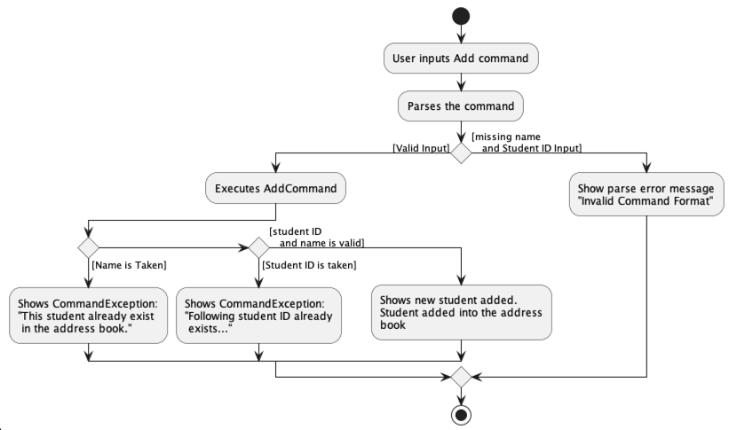
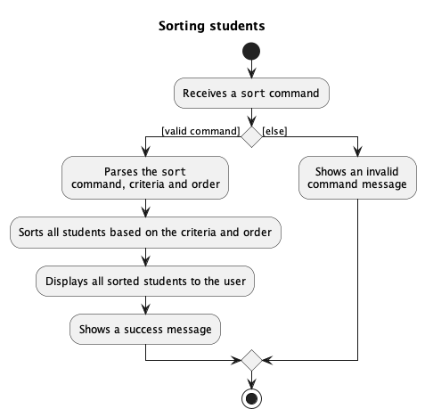
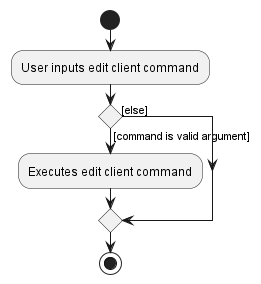

* Table of Contents
{:toc}

--------------------------------------------------------------------------------------------------------------------

## **Legend**

:information_source: **Notes:** Notes are placed in this guide to specify extra details and elaboration.

--------------------------------------------------------------------------------------------------------------------

## **Acknowledgements**

This project is based on the AddressBook-Level3 project created by the [SE-EDU initiative](https://se-education.org/).
Libraries used: [JavaFX](https://openjfx.io/), [JUnit5](https://github.com/junit-team/junit5), [Jackson](https://github.com/FasterXML/jackson).

--------------------------------------------------------------------------------------------------------------------

## **Setting up, getting started**

Refer to the guide [_Setting up and getting started_](SettingUp.md).

--------------------------------------------------------------------------------------------------------------------

## **Design**

:bulb: **Tip:** The `.puml` files used to create diagrams in this document can be found in the [diagrams](https://github.com/AY2223S1-CS2103T-W10-3/tp/tree/master/docs/diagrams/) folder. Refer to the [_PlantUML Tutorial_ at se-edu/guides](https://se-education.org/guides/tutorials/plantUml.html) to learn how to create and edit diagrams.

--------------------------------------------------------------------------------------------------------------------

### Architecture

The ***Architecture Diagram*** given above explains the high-level design of the App.

Given below is a quick overview of main components and how they interact with each other.

**Main components of the architecture**

**`Main`** has two classes called [`Main`](https://github.com/AY2223S1-CS2103T-W10-3/tp/blob/master/src/main/java/seedu/trackascholar/Main.java) and [`MainApp`](https://github.com/AY2223S1-CS2103T-W10-3/tp/blob/master/src/main/java/seedu/trackascholar/MainApp.java). It is responsible for,
* At app launch: Initializes the components in the correct sequence, and connects them up with each other.
* At shut down: Shuts down the components and invokes cleanup methods where necessary.

[**`Commons`**](#common-classes) represents a collection of classes used by multiple other components.

The rest of the App consists of four components.

* [**`UI`**](#ui-component): The UI of the App.
* [**`Logic`**](#logic-component): The command executor.
* [**`Model`**](#model-component): Holds the data of the App in memory.
* [**`Storage`**](#storage-component): Reads data from, and writes data to, the hard disk.

**How the architecture components interact with each other**

The *Sequence Diagram* below shows how the components interact with each other for the scenario where the user issues the command `delete 1`.

Each of the four main components (also shown in the diagram above),

* defines its *API* in an `interface` with the same name as the Component.
* implements its functionality using a concrete `{Component Name}Manager` class (which follows the corresponding API `interface` mentioned in the previous point.

For example, the `Logic` component defines its API in the `Logic.java` interface and implements its functionality using the `LogicManager.java` class which follows the `Logic` interface. Other components interact with a given component through its interface rather than the concrete class (reason: to prevent outside component's being coupled to the implementation of a component), as illustrated in the (partial) class diagram below.

The sections below give more details of each component.

--------------------------------------------------------------------------------------------------------------------

### UI component

The **API** of this component is specified in [`Ui.java`](https://github.com/AY2223S1-CS2103T-W10-3/tp/blob/master/src/main/java/seedu/trackascholar/ui/Ui.java)

The UI consists of a `MainWindow` that is made up of parts e.g.`CommandBox`, `ResultDisplay`, `PersonListPanel`, `StatusBarFooter` etc. All these, including the `MainWindow`, inherit from the abstract `UiPart` class which captures the commonalities between classes that represent parts of the visible GUI.

The `UI` component uses the JavaFx UI framework. The layout of these UI parts are defined in matching `.fxml` files that are in the `src/main/resources/view` folder. For example, the layout of the [`MainWindow`](https://github.com/AY2223S1-CS2103T-W10-3/tp/blob/master/src/main/java/seedu/trackascholar/ui/MainWindow.java) is specified in [`MainWindow.fxml`](https://github.com/AY2223S1-CS2103T-W10-3/tp/blob/master/src/main/resources/view/MainWindow.fxml)

The `UI` component,

* executes user commands using the `Logic` component.
* listens for changes to `Model` data so that the UI can be updated with the modified data.
* keeps a reference to the `Logic` component, because the `UI` relies on the `Logic` to execute commands.
* depends on some classes in the `Model` component, as it displays `Applicant` object residing in the `Model`.

--------------------------------------------------------------------------------------------------------------------

### Logic component

**API** : [`Logic.java`](https://github.com/AY2223S1-CS2103T-W10-3/tp/blob/master/src/main/java/seedu/trackascholar/logic/Logic.java)

Here's a (partial) class diagram of the `Logic` component:

How the `Logic` component works:
1. When `Logic` is called upon to execute a command, it uses the `TrackAScholarParser` class to parse the user command.
1. This results in a `Command` object (more precisely, an object of one of its subclasses e.g., `AddCommand`) which is executed by the `LogicManager`.
1. The command can communicate with the `Model` when it is executed (e.g. to add an applicant).
1. The result of the command execution is encapsulated as a `CommandResult` object which is returned back from `Logic`.

The Sequence Diagram below illustrates the interactions within the `Logic` component for the `execute("delete 1")` API call.

:information_source: **Note:** The lifeline for `DeleteCommandParser` should end at the destroy marker (X) but due to a limitation of PlantUML, the lifeline reaches the end of diagram.

Here are the other classes in `Logic` (omitted from the class diagram above) that are used for parsing a user command:

How the parsing works:
* When called upon to parse a user command, the `TrackAScholarParser` class creates an `XYZCommandParser` (`XYZ` is a placeholder for the specific command name e.g., `AddCommandParser`) which uses the other classes shown above to parse the user command and create a `XYZCommand` object (e.g., `AddCommand`) which the `TrackAScholarParser` returns back as a `Command` object.
* All `XYZCommandParser` classes (e.g., `AddCommandParser`, `DeleteCommandParser`, ...) inherit from the `Parser` interface so that they can be treated similarly where possible e.g, during testing.

--------------------------------------------------------------------------------------------------------------------

### Model component
**API** : [`Model.java`](https://github.com/AY2223S1-CS2103T-W10-3/tp/blob/master/src/main/java/seedu/trackascholar/model/Model.java)

The `Model` component,

* stores TrackAScholar data i.e., all `Applicant` objects (which are contained in a `UniqueApplicantList` object).
* stores the currently 'selected' `Applicant` objects (e.g., results of a search query) as a separate _filtered_ list which is exposed to outsiders as an unmodifiable `ObservableList<Person>` that can be 'observed' e.g. the UI can be bound to this list so that the UI automatically updates when the data in the list change.
* stores a `UserPref` object that represents the user’s preferences. This is exposed to the outside as a `ReadOnlyUserPref` objects.
* does not depend on any of the other three components (as the `Model` represents data entities of the domain, they should make sense on their own without depending on other components)

:information_source: **Note:** An alternative (arguably, a more OOP) model is given below. It has a `Tag` list in the `TrackAScholarBook`, which `Applicant` references. This allows `TrackAScholar` to only require one `Tag` object per unique tag, instead of each `Applicant` needing their own `Tag` objects. 

--------------------------------------------------------------------------------------------------------------------

### Storage component

**API** : [`Storage.java`](https://github.com/AY2223S1-CS2103T-W10-3/tp/blob/master/src/main/java/seedu/trackascholar/storage/Storage.java)

The `Storage` component,
* can save both TrackAScholar data and user preference data in json format, and read them back into corresponding objects.
* inherits from both `TrackAScholarStorage` and `UserPrefStorage`, which means it can be treated as either one (if only the functionality of only one is needed).
* depends on some classes in the `Model` component (because the `Storage` component's job is to save/retrieve objects that belong to the `Model`)

### Common classes

Classes used by multiple components are in the `seedu.trackascholar.commons` package.

--------------------------------------------------------------------------------------------------------------------

## **Implementation**

This section describes some noteworthy details on how certain features are implemented.

### Add applicant feature

#### Implementation

The add operation is facilitated by `AddCommand`. It extends `Command` and implements the `Command#execute` operation.

Given below is an example usage scenario and how the add operation is handled by TrackAScholar:

1. The user enters `add n/Sam p/98886767 e/sam@example.com s/NUS Merit Scholarship as/pending`, for example, to add a new applicant.
   This invokes `LogicManager#execute()`, which calls `TrackAScholarParser#parseCommand()` to separate the command word `add` and
   the arguments `n/Sam p/98886767 e/sam@example.com s/NUS Merit Scholarship as/pending`.

2. `TrackAScholarParser` identifies the `add` command and `AddCommandParser` will be instantiated which calls `AddCommandParser#parse()`
   to map the various arguments via their prefixes (e.g. `Sam` is mapped using prefix `n/`).

3. `AddCommandParser#parse()` will then call `AddCommandParser#arePrefixesPresent()` to ensure that all mandatory prefixes are present
   in the user input, after which the various arguments will be retrieved via the prefixes and parsed into their respective attributes.

4. `AddCommandParser#parse()` creates a new `Applicant` with the various attributes before finally initializing and returning an `AddCommand`
   with the new `Applicant` as an argument.

5. `LogicManager#execute()` now calls `AddCommand#execute()`, which invokes `Model#hasApplicant()` to check if the new `Applicant` is a
   duplicate of any applicant already stored in TrackAScholar. When the check has concluded and no duplicate was found, `Model#addApplicant()`
   is called to add the new `Applicant` into TrackAScholar.

6. `AddCommand#execute()` finishes with returning a `CommandResult` containing details about the applicant's successful addition to TrackAScholar.

The following sequence diagram shows how the add operation works:

The following activity diagram summarizes what happens when a user executes an add command:

--------------------------------------------------------------------------------------------------------------------

### Filter application status feature

#### Implementation

The filter operation is facilitated by `FilterCommand`. It extends `Command` and implements the `Command#execute` operation.

Given below is an example usage scenario and how the filter operation is handled by TrackAScholar:

1. The user enters `filter pending`, for example, to filter out applicants with pending scholarship application status.
   This invokes `LogicManager#execute()`, which calls `TrackAScholarParser#parseCommand()` to separate the command word `filter` and
   the argument `pending`.

2. `TrackAScholarParser` identifies the `filter` command and `FilterCommandParser` will be instantiated which calls `FilterCommandParser#parse()`
   which checks that the argument is a valid application status by calling `ApplicationStatus#isValidApplicationStatus()`.

3. After passing the check, `FilterCommandParser#parse()` creates a new `ApplicationStatusPredicate` with the argument before finally initializing and returning a `FilterCommand`
   with the new `ApplicationStatusPredicate` as an argument.

4. `LogicManager#execute()` now calls `FilterCommand#execute()`, which invokes `Model#updateFilteredApplicantList()` to filter out the list of
   applicants with the matching application status. When the operation has concluded, `Model#getFilteredApplicantList()`
   is called to retrieve the filtered list, such that TrackAScholar can count the total number of applicants in that particular list.

5. `FilterCommand#execute()` finishes with returning a `CommandResult` containing details of how many applicants were found with a matching scholarship application status.

The following sequence diagram shows how the filter operation works:

The following activity diagram summarizes what happens when a user executes a filter command:

--------------------------------------------------------------------------------------------------------------------

### Sort applicants by name, scholarship or status feature.

#### Implementation

The sort operation is facilitated by `SortCommand`. It extends `Command` and implements the `Command#execute` operation.

Given below is an example usage scenario and how the sort operation is handled by TrackAScholar:

1. The user enters `sort name`, for example, to sort all applicants by name in ascending lexicographic order.
   This invokes `LogicManager#execute()`, which calls `TrackAScholarParser#parseCommand()` to separate the command word `sort` and
   the argument `name`.

2. `TrackAScholarParser` identifies the `sort` command and `SortCommandParser` will be instantiated which calls `SortCommandParser#parse()`
   which checks if the arguments have the valid parameter name and flag by calling `List#contains()` and `SortCommandParser#checkInputSizeAndReverseFlag()` respectively.

3. After passing the check, `SortCommandParser#parse()` creates a new `Comparator<Applicant>` with the argument before finally initializing and returning a `SortCommand`
   with the new `Comparator<Applicant>` as an argument.

4. `LogicManager#execute()` now calls `SortCommand#execute()`, which invokes `Model#updateFilteredApplicantList()` to filter out the list of
   applicants with the matching application status. When the operation has concluded, `Model#getFilteredApplicantList()`
   is called to retrieve the filtered list, such that TrackAScholar can count the total number of applicants in that particular list.

5. `SortCommand#execute()` finishes with returning a `CommandResult` containing the newly sorted applicant list according to the input parameters.

The following sequence diagram shows how the sort operation works:

The following activity diagram summarizes what happens when a user executes a sort command:

--------------------------------------------------------------------------------------------------------------------

### Remove applicants by application status feature

#### Implementation

The remove operation is facilitated by `RemoveCommand`. It extends `Command` and implements the `Command#execute` operation.

Given below is an example usage scenario and how the remove operation is handled by TrackAScholar:

1. The user enters `remove accepted`, for example, to remove all applicants with accepted scholarship application status.
   This invokes `LogicManager#execute()`, which calls `TrackAScholarParser#parseCommand()` to separate the command word `remove` and
   the argument `accepted`.

2. `TrackAScholarParser` identifies the `remove` command and `RemoveCommandParser` will be instantiated which calls `RemoveCommandParser#parse()`.

3. `RemoveCommandParser#parse()` now parses the argument and creates a new `ApplicationStatus` before finally initializing and returning a `RemoveCommand`
   with the new `ApplicationStatus` as an argument.

4. `LogicManager#execute()` now calls `RemoveCommand#execute()`, which invokes `RemoveCommand#promptUserConfirmation()`. TrackAScholar now displays
   a window asking for the user's confirmation to remove the applicants. After the user confirms, `RemoveCommand#confirmRemove()` is called which
   in turn calls `Model#removeApplicant()` to remove all applicants from the list matching the targeted `ApplicationStatus`.

5. `FilterCommand#execute()` finishes with returning a `CommandResult` containing information of the successful removal.

The following sequence diagram shows how the remove operation works:

:information_source: **Note:** The GUI interactions when `RemoveCommand#execute()` calls `RemoveCommand#promptUserConfirmation()`
is abstracted out as this sequence diagram aims only to demonstrate the interactions inside Logic Component for the `remove` command.

The following activity diagram summarizes what happens when a user executes a remove command:

--------------------------------------------------------------------------------------------------------------------
### Find applicant by find name feature

#### Implementation

The find operation is facilitated by `FindCommand`. It extends `Command` and implements the `Command#execute` operation.

Given below is an example usage scenario and how the find command operates in TrackAScholar:

1. The user enters `find john`.The application searches the data for all the applicants with the name that matches

2. `TrackAScholarParser` identifies the person and displays it to the user.

--------------------------------------------------------------------------------------------------------------------
### Edit applicant feature

#### Implementation

The edit operation is facilitated by `EditCommand`. It extends `Command` and implements the `Command#execute` operation.

Given below is an example usage scenario and how the edit operation is handled by TrackAScholar:

1. The user enters `edit 1 n/Sam p/91234567 e/samnew@example.com s/NUS Sports Scholarship as/accepted`, for example, to edit an existing applicant at index 1 in the list.
   This invokes `LogicManager#execute()`, which calls `TrackAScholarParser#parseCommand()` to separate the command word `edit` and
   the arguments `1 n/Sam p/91234567 e/samnew@example.com s/NUS Sports Scholarship as/accepted`.

2. `TrackAScholarParser` identifies the `edit` command and `EditCommandParser` will be instantiated which calls `EditCommandParser#parse()`
   to map the various arguments via their prefixes (e.g. `Sam` is mapped using prefix `n/`).

3. `EditCommandParser#parse()` will then call `Optional#isPresent()` to check if a prefix is present
   in the user input, to identify which inputs need to be changed.

4. `EditCommandParser#parse()` creates an `EditApplicantDescriptor` object with the various attributes to be changed before 
   initializing and returning an `EditCommand` with the `EditApplicantDescriptor` as an argument.

5. `EditCommandParser#parse()` throws a `ParseException` if index is not a positive integer and a `CommandException` if index 
   is larger than the list size.

6. `LogicManager#execute()` now calls `EditCommand#execute()`, which creates a new `Applicant` object with the updated applicant fields.
    `Model#setApplicant` is used to update the current applicant with the new applicant. 

7. `EditCommand#execute()` finishes with returning a `CommandResult` containing details about the applicant's successful edit and the applicant's details in TrackAScholar.

The following sequence diagram shows how the edit operation works:

The following activity diagram summarizes what happens when a user executes a edit command:

--------------------------------------------------------------------------------------------------------------------

## **Documentation, logging, testing, configuration, dev-ops**

* [Documentation guide](Documentation.md)
* [Testing guide](Testing.md)
* [Logging guide](Logging.md)
* [Configuration guide](Configuration.md)
* [DevOps guide](DevOps.md)

--------------------------------------------------------------------------------------------------------------------

## **Appendix: Requirements**

### Product scope

**Target Users**:  
* NUS administrative staff in the Office of Admissions

**Value Proposition**:  
Streamline the scholarship application process by organizing the scholarship applications into their corresponding types and status, thus supporting faster and easier identification of a student’s scholarship application progress with a GUI.

--------------------------------------------------------------------------------------------------------------------

### User stories

Priorities: High (must have) - `* * *`, Medium (nice to have) - `* *`, Low (unlikely to have) - `*`

| Priority | As a …​                                         | I want to …​                                       | So that I can…​                                                                    |
|---------|-------------------------------------------------|----------------------------------------------------|------------------------------------------------------------------------------------|
| `* * *` | new user                                        | see usage instructions easily                      | discover functionalities provided by the application                               |
| `* * *` | new user                                        | operate with clear and concise commands            | learn easily and grow proficiency with time                                        |
| `* * *` | user                                            | retrieve previously stored application data        | access stored database                                                             |
| `* * *` | user                                            | save fresh data easily                             | avoid losing all my data                                                           |
| `* * *` | administrator                                   | add a scholar to my database                       | keep track of the application status of the scholar                                |
| `* * *` | administrator                                   | delete a scholar from my database                  | remove data of applications that is no longer needed                               |
| `* * *` | administrator managing  multiple applicants | list all applicants in my database                 | view all scholarship applicants on the list of applications                        |
| `* *`   | administrator                                   | edit the details of a scholar in my database       | have easy access to their most updated details                                     |
| `* *`   | administrator managing  multiple applicants | find applicants using keywords                     | retrieve details of their application without having to go through the entire list |
| `*`     | advanced user                                   | run the application on different operating systems | access the same database/storage on different operating systems                    |

*{More to be added}*

### Use cases

(For all use cases below, the **System** is `TrackAScholar` and the **Actor** is the `user`, unless specified otherwise)

--------------------------------------------------------------------------------------------------------------------

**Use case: UC01 - Add An Applicant**

**Guarantees:**
* A new applicant will only be added if there does not exist an applicant with the same name.

**MSS**

1. User requests to add an applicant.
2. TrackAScholar adds the applicant to the list.  
    Use case ends.

**Extensions**

* 1a. Input format is wrong.

  * 1a1. TrackAScholar displays an error message prompting correct input format.  
    Use case resumes at step 1.

* 1b. Input parameters is invalid.

  * 1a1. TrackAScholar displays an error message showing parameter requirements.  
    Use case resumes at step 1.

* 1c. An applicant with the same name already exist.

  * 1a1 TrackAScholar displays an error message that applicant already exist.  
    Use case resumes at step 1.

--------------------------------------------------------------------------------------------------------------------

**Use case: UC02 - Delete an applicant**

**Guarantees:**
* Once an applicant is deleted,the applicant will be removed from the database and the user will no longer
be able to view the applicant from the list.

**MSS**

1. User request to delete an applicant in TrackAScholar.
2. TrackAScholar removes applicant with matching name.
   Use case ends.

**Extensions**

* 1a. Input format is wrong.

  * 1a1. TrackAScholar displays an error message prompting correct input format.  
      Use case resumes at step 1.

* 1b. Input parameters is invalid.

  * 1b1. TrackAScholar displays an error message showing parameter requirements.  
      Use case resumes at step 1.

* 1c. Verify deletion.

  * 1c1. TrackAScholar request confirmation to delete the applicant.
  * 1c2. User agrees by typing YES to confirm deletion.  
      Use case ends.

--------------------------------------------------------------------------------------------------------------------

**Use case: UC03 - Edit personal details of an applicant**

**Guarantees:**
* The details of an applicant will only be updated if there exists such an applicant with the same name in the txt file.

**MSS**

1. User requests to change the details of an applicant (such as email or contact number etc.).
2. TrackAScholar updates the personal details of the applicant to the list.  
   Use case ends.

**Extensions**

* 1a. Input format is wrong.

  * 1a1. TrackAScholar displays an error message prompting correct input format.  
      Use case resumes at step 1.

* 1b. Input parameters is invalid.

  * 1a1. TrackAScholar displays an error message showing parameter requirements.  
      Use case resumes at step 1.

* 1c. An applicant with such name does not exist.

  * 1a1 TrackAScholar displays an error message that applicant does not exist and details cannot be updated.  
      Use case resumes at step 1.

--------------------------------------------------------------------------------------------------------------------

**Use case: UC04 - List Applicants**

**MSS**

1. User requests to list all applicants.
2. TrackAScholar shows the list of all applicants.  
   Use case ends.

**Extensions**

* 1a. Input format is wrong.

    * 1a1. TrackAScholar displays an error message prompting correct input format.  
      Use case resumes at step 1.

* 1b. TrackAScholar has no applicants stored.

    * 1a1. TrackAScholar shows an empty applicant list.

--------------------------------------------------------------------------------------------------------------------

**Use case: UC05 - Filter applicants by status**

**MSS**

1. User requests a filtered list based on a specific application status.
2. TrackAScholar shows the number of applicants by status.
3. TrackAScholar shows the percentage of applicants by status.
4. TrackAScholar shows the filtered list of applicants with the specified applicant status.

    Use case ends.

**Extensions**

* 1a. User specifies more than one applicant status during request.

    * Step 4 repeats as many times as there are requests.

* 1b. TrackAScholar detects an error in the entered applicant status/detects no applicant status input.

    * 1b1. TrackAScholar requests for the correct applicant status.
    * 1b2. User enters new applicant status.
    * Steps 1b1-1b2 are repeated until the applicant status entered matches a valid existing applicant status.
    * Use case resumes from step 2.

*{More to be added}*

--------------------------------------------------------------------------------------------------------------------

### Non-Functional Requirements

1. Should work on any _mainstream OS_ as long as it has Java `11` or above installed.
2. Should be able to hold up to 1000 applicants without a noticeable sluggishness in performance for typical usage.
3. A user with above average typing speed for regular English text (i.e. not code, not system admin commands) should be able to accomplish most of the tasks faster using commands than using the mouse.
4. Product should not be required to handle the contacting of applicants.
5. Learning features of the product should be intuitive and easily acquired by new users.
6. TrackAScholar should respond within 2 seconds.
7. Storage stored should be easy to be shared and uploaded between different users.

*{More to be added}*

### Glossary

* **Mainstream OS**: Windows, Linux, Unix, OS-X
* **Private contact detail**: A contact detail that is not meant to be shared with others
* **MSS**: Main Success Scenario
* **GUI**: Graphical user interface allows users to interact with a software through visual components instead of the command line

--------------------------------------------------------------------------------------------------------------------

## **Appendix: Instructions for manual testing**

Given below are instructions to test the app manually.

:information_source: **Note:** These instructions only provide a starting point for testers to work on;
testers are expected to do more *exploratory* testing.

### Launch and shutdown

1. Initial launch

   1. Download the jar file and copy into an empty folder

   1. Double-click the jar file Expected: Shows the GUI with a set of sample contacts. The window size may not be optimum.

1. Saving window preferences

   1. Resize the window to an optimum size. Move the window to a different location. Close the window.

   1. Re-launch the app by double-clicking the jar file. 
       Expected: The most recent window size and location is retained.

1. _{ more test cases …​ }_

### Deleting an applicant

1. Deleting an applicant while all applicants are being shown

   1. Prerequisites: List all applicants using the `list` command. Multiple applicants in the list.

   1. Test case: `delete 1` 
      Expected: First contact is deleted from the list. Details of the deleted contact shown in the status message. Timestamp in the status bar is updated.

   1. Test case: `delete 0` 
      Expected: No applicant is deleted. Error details shown in the status message. Status bar remains the same.

   1. Other incorrect delete commands to try: `delete`, `delete x`, `...` (where x is larger than the list size) 
      Expected: Similar to previous.

1. _{ more test cases …​ }_

### Saving data

1. Dealing with missing/corrupted data files

   1. _{explain how to simulate a missing/corrupted file, and the expected behavior}_

2. _{ more test cases …​ }_

